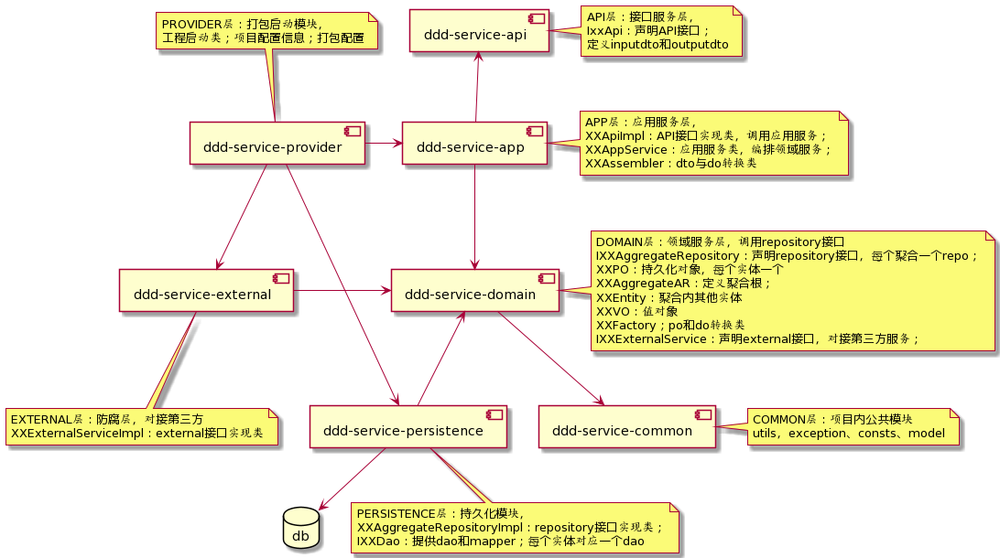

# DDD工程文档

## DDD工程模块依赖关系

## 开发规范

### 依赖规范

最小化引用，按需使用；

### 分支管理

上线分支：release_beta_上线时间

开发分支：develop

迭代分支：dev_8.8_team  基于develop分支拉

个人分支： dev_8.8_team_工号  基于迭代分支拉

TODO
1 多模块下单个模块如何使用其他模块下的配置？
2 打出的war包部署到tomcat启动问题？
3 如何打出可执行jar？
4 统一异常处理，统一返回结构
5 mybatis集成 mysql集成 连接池 事务  多数据源
7 redis集成、kafka集成