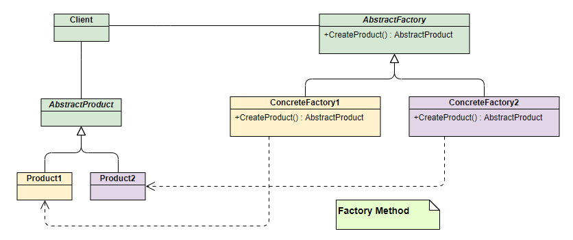

设计原则/设计模式/重构

https://blog.csdn.net/weixin_43122090/article/details/105462226

[设计模式常见面试题汇总](https://www.cnblogs.com/dailyprogrammer/articles/12272717.html)

面试资料：csdn 115085887  设计模式速成版 ，csdn 120454098

书籍：设计模式之禅

常用设计模式

Spring中设计模式

jdk中设计模式：如IO流中使用的装饰者模式

代理模式与装饰者模式区别、工厂模式区别

项目开发中使用的设计模式

如何用自己的语言表达出来


# 设计原则

OOP  AOP

SOLIDCD

单一职责原则、开闭原则、里式替换原则（基类能出现的地方均可替换成子类）、接口隔离原则、依赖倒置原则、合成复用原则（优先使用组合聚合关系其次才考虑继承关系）、迪米特法则（降低类间依赖、最少知识）

高内聚低耦合

# 设计模式

创建型、结构型、行为型

常用：单例、工厂、代理、模板方法、观察者、建造者、策略模式、适配器模式、责任链模式

## 单例模式

一般有五种写法，懒汉式、恶汉式、DCL、枚举、内部类。一般情况下直接使用饿汉式就行，如果明确要求要懒加载会倾向于使用静态内部类，如果涉及到反序列化创建对象时会试着使用枚举的方式来实现单例。

```java
// 恶汉式
public class Singleton {
    // 类加载时就初始化
    private static final Singleton instance = new Singleton();    
    private Singleton(){} // 构造器私有

    public static Singleton getInstance(){
        return instance;
    }
}
// 懒汉式
public class Singleton {
    private static Singleton instance;
    private Singleton (){}

    public synchronized static Singleton getInstance() {
     if (instance == null) {
         instance = new Singleton();
     }
     return instance;
    }
}
// 双检锁
public class Singleton {
    private volatile static Singleton instance; //声明成 volatile，禁止指令重排
    private Singleton (){}

    public static Singleton getSingleton() {
        if (instance != null) {
            return instance;
        }
        synchronized (Singleton.class) {
            if (instance == null) {       
                instance = new Singleton();
            }
        }
        return instance;
    }   
}
// 静态内部类
public class Singleton {  
    private static class SingletonHolder {  
        private static final Singleton INSTANCE = new Singleton();  
    }  
    private Singleton (){}  
    public static final Singleton getInstance() {  
        return SingletonHolder.INSTANCE; 
    }  
}
// 枚举式
public enum EasySingleton{
    INSTANCE;
}
```

## 工厂模式

简单工厂、工厂方法、抽象工厂

简单工厂：所有的产品都由一个工厂生产。如果你想加产品，就改源代码。

工厂方法：有多个工厂，但一个工厂只生产一种产品。如耐克厂只生产耐克鞋，阿迪厂只生产阿
迪鞋。如果你想加产品，那就加工厂类。用来生产同一等级结构中的固定产品，支持拓展增加产品

抽象工厂：有多个工厂，每个工厂可以生产多类产品。如耐克厂可以生产耐克鞋和耐克衣服，阿
迪厂可以生产阿迪鞋和阿迪衣服。但如果你想生产帽子，那么就需要在抽象工厂里加抽象方法，
然后修改所有的子类。 用来生产不同产品族的全部产品，不支持拓展增加产品，支持增加产品族

### 简单工厂


```java
public interface Phone {
    void make();
}
public class MiPhone implements Phone {
    public MiPhone() {
        this.make();
    }
    @Override
    public void make() {       
        System.out.println("make xiaomi phone!");
    }
}
public class IPhone implements Phone {
    public IPhone() {
        this.make();
    }
    @Override
    public void make() {       
        System.out.println("make iphone!");
    }
}
public class PhoneFactory {
    public Phone makePhone(String phoneType) {
        if(phoneType.equalsIgnoreCase("MiPhone")){
            return new MiPhone();
        }
        else if(phoneType.equalsIgnoreCase("iPhone")) {
            return new IPhone();
        }
        return null;
    }
}
public class Demo {
    public static void main(String[] arg) {
        PhoneFactory factory = new PhoneFactory();
        Phone miPhone = factory.makePhone("MiPhone");            // make xiaomi phone!
        IPhone iPhone = (IPhone)factory.makePhone("iPhone");    // make iphone!
    }
}
```

### 工厂方法



```java
public interface AbstractFactory {
    Phone makePhone();
}
public class XiaoMiFactory implements AbstractFactory{
    @Override
    public Phone makePhone() {
        return new MiPhone();
    }
}
public class AppleFactory implements AbstractFactory {
    @Override
    public Phone makePhone() {
        return new IPhone();
    }
}
public class Demo {
    public static void main(String[] arg) {
        AbstractFactory miFactory = new XiaoMiFactory();
        AbstractFactory appleFactory = new AppleFactory();
        miFactory.makePhone();            // make xiaomi phone!
        appleFactory.makePhone();        // make iphone!
    }
}
```

### 抽象工厂


```java
public interface AbstractFactory {
    Phone makePhone();
    PC makePC();
}
public class XiaoMiFactory implements AbstractFactory{
    @Override
    public Phone makePhone() {
        return new MiPhone();
    }
    @Override
    public PC makePC() {
        return new MiPC();
    }
}
public class AppleFactory implements AbstractFactory {
    @Override
    public Phone makePhone() {
        return new IPhone();
    }
    @Override
    public PC makePC() {
        return new MAC();
    }
}
public class Demo {
    public static void main(String[] arg) {
        AbstractFactory miFactory = new XiaoMiFactory();
        AbstractFactory appleFactory = new AppleFactory();
        miFactory.makePhone();            // make xiaomi phone!
        miFactory.makePC();                // make xiaomi PC!
        appleFactory.makePhone();        // make iphone!
        appleFactory.makePC();            // make MAC!
    }
}
```


# 装饰器模式和代理模式的区别
共同点：
效果类似：装饰器模式和代理模式都可以在方法的前后增加逻辑
可以嵌套：代理可以层层代理，装饰也可以层层装饰

区别：
实现方式不同：代理类和原有类之间并没有什么直接关联。就像我找中介帮我卖房子，我和中介
之间并没有什么直接关系，我出钱他办事，我是我，他是他。但是装饰类和被装饰类之间就有关
系，他们有共同的父类。比如BufferReader装饰了FileReader，他们有共同的父类Reader。

应用场景不同：代理模式主要用来做AOP，适用于同时对好多方法做切面。就像中介也不可能只
帮我一个人卖房子。 而装饰器只专注于装饰一个类，BufferReader只专注于装饰Reader。 

代理模式中，目标类对于客户端是透明的，由代理类隐藏其具体信息并响应客户端请求，用于实现访问控制；而装饰者中客户端对特定的目标类对象进行增强。所以，代理类与真实对象的关系常在编译时就确定，而装饰者在运行时递归构造。

# 装饰者模式

为类动态增加功能，比继承更灵活。

```java
// IO流 装饰器模式为FileReader增加了Buffer功能
BufferedReader in = new BufferedReader(new FileReader("filename.txt"));
String s = in.readLine();

// 芒果-珍珠-双份柠檬-红茶
Beverage beverage = new Mongo(new Pearl(new Lemon(new Lemon(new BlackTea()))));
```

