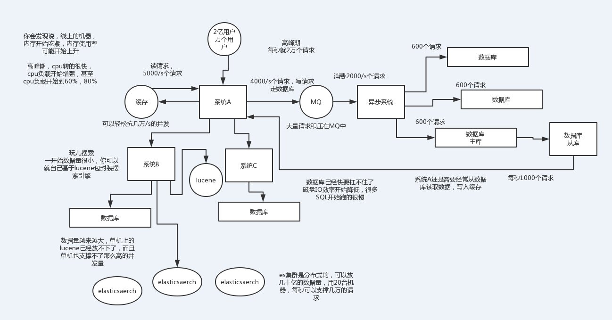
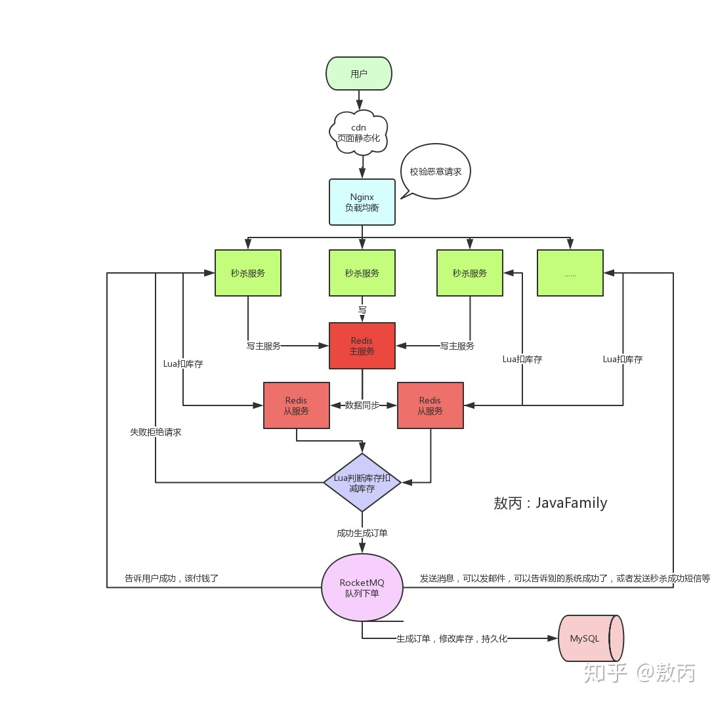

# 设计类
系统设计、架构设计
## 如何设计高并发系统？

如果有面试官问你个问题说，如何设计一个高并发系统？那么不好意思，一定是因为你实际上没干过高并发系统。面试官看你简历就没啥出彩的，感觉就不咋地，所以就会问问你，如何设计一个高并发系统？其实说白了本质就是看看你有没有自己研究过，有没有一定的知识积累。

最好的当然是招聘个真正干过高并发的哥儿们咯，但是这种哥儿们人数稀缺，不好招。所以可能次一点的就是招一个自己研究过的哥儿们，总比招一个傻也不会的哥儿们好吧！

所以这个时候你必须得做一把个人秀了，秀出你所有关于高并发的知识！

为啥高并发牛逼？就是因为现在用互联网的人越来越多，很多app、网站、系统承载的都是高并发请求，可能高峰期每秒并发量几千，很正常的。如果是什么双十一了之类的，每秒并发几万几十万都有可能。

那么如此之高的并发量，加上原本就如此之复杂的业务，咋玩儿？真正厉害的，一定是在复杂业务系统里玩儿过高并发架构的人，但是你没有，那么我给你说一下你该怎么回答这个问题：

（1）系统拆分，将一个系统拆分为多个子系统，用dubbo来搞。然后每个系统连一个数据库，这样本来就一个库，现在多个数据库，不也可以抗高并发么。

（2）缓存，必须得用缓存。大部分的高并发场景，都是读多写少，那你完全可以在数据库和缓存里都写一份，然后读的时候大量走缓存不就得了。毕竟人家redis轻轻松松单机几万的并发啊。没问题的。所以你可以考虑考虑你的项目里，那些承载主要请求的读场景，怎么用缓存来抗高并发。

（3）MQ，必须得用MQ。可能你还是会出现高并发写的场景，比如说一个业务操作里要频繁搞数据库几十次，增删改增删改，疯了。那高并发绝对搞挂你的系统，你要是用redis来承载写那肯定不行，人家是缓存，数据随时就被LRU了，数据格式还无比简单，没有事务支持。所以该用mysql还得用mysql啊。那你咋办？用MQ吧，大量的写请求灌入MQ里，排队慢慢玩儿，后边系统消费后慢慢写，控制在mysql承载范围之内。所以你得考虑考虑你的项目里，那些承载复杂写业务逻辑的场景里，如何用MQ来异步写，提升并发性。MQ单机抗几万并发也是ok的，这个之前还特意说过。

（4）分库分表，可能到了最后数据库层面还是免不了抗高并发的要求，好吧，那么就将一个数据库拆分为多个库，多个库来抗更高的并发；然后将一个表拆分为多个表，每个表的数据量保持少一点，提高sql跑的性能。

（5）读写分离，这个就是说大部分时候数据库可能也是读多写少，没必要所有请求都集中在一个库上吧，可以搞个主从架构，主库写入，从库读取，搞一个读写分离。读流量太多的时候，还可以加更多的从库。

（6）Elasticsearch，可以考虑用es。es是分布式的，可以随便扩容，分布式天然就可以支撑高并发，因为动不动就可以扩容加机器来抗更高的并发。那么一些比较简单的查询、统计类的操作，可以考虑用es来承载，还有一些全文搜索类的操作，也可以考虑用es来承载。

上面的6点，基本就是高并发系统肯定要干的一些事儿，大家可以仔细结合之前讲过的知识考虑一下，到时候你可以系统的把这块阐述一下，然后每个部分要注意哪些问题，之前都讲过了，你都可以阐述阐述，表明你对这块是有点积累的。

## 秒杀系统设计

[阿里的秒杀系统是怎么设计的？](https://www.toutiao.com/i6857684494082802188/?tt_from=weixin&utm_campaign=client_share&wxshare_count=1&timestamp=1632151005&app=news_article&utm_source=weixin&utm_medium=toutiao_android&use_new_style=1&req_id=2021092023164401021207009823B5266C&share_token=c22b13d8-9981-4932-b8c8-2e0e1da77f55&group_id=6857684494082802188)

抢红包功能、商品秒杀等瞬时高并发场景

秒杀不一定是每个同学都会问到的，至少肯定没**Redis基础**那样常问，但是一旦问到，大家一定要回答到点上。至少你得说出**可能出现的情况**，**需要注意的情况**，以及对于的**解决思路和方案**，因为这才是一个coder的基本素养，这些你不考虑你也很难去进步。最后就是需要对整个链路比较熟悉，注意是一个完整的链路，前端怎么设计的呀，网关的作用呀，怎么**解决Redis的并发竞争**啊，**数据的同步方式**呀，**MQ的作用**啊等等，相信你会有不错的收获。

秒杀场景问题：

**高并发**

大量的请求进来，我们需要考虑的点就很多了，**缓存雪崩**，**缓存击穿**，**缓存穿透**这些我之前提到的点都是有可能发生的，出现问题打挂DB那就很难受了，活动失败用户体验差，活动人气没了，最后背锅的还是**开发**。

**超卖**

**恶意请求**

搞个几十台机器搞点脚本，模拟出来十几万个人左右的请求，那我是不是意味着我基本上有80%的成功率了。

**链接暴露**

开发知道地址，在秒杀的时候自己提前请求

**数据库**

每秒上万甚至十几万的**QPS**（每秒请求数）直接打到**数据库**，基本上都要把库打挂掉，而且你服务不单单是做秒杀的还涉及其他的业务，你没做**降级、限流、熔断**啥的，别的一起挂，小公司的话可能**全站崩溃404**。

应对方案：

**前端**

资源静态化、秒杀链接加盐、秒杀钱按钮置灰，点击后置灰或者几秒后再允许再次点击

**分流**

DNS、F5、Nginx、负载均衡；弹性扩缩容服务实例

**限流**

Nginx、应用层限流、分布式限流

**风控**

放进来10000个请求，但是库存只有1000个，那我们就算出最有可能是真实用户的1000人进行秒杀，丢弃其他请求，因为秒杀本来就是黑盒操作的，用户层面是无感知的，这样设计能让真实的用户买到东西，还可以减少自己被薅羊毛的概率。

**服务单一职责：**

可以给秒杀开个服务，把秒杀的代码业务逻辑放一起。好处是就算秒杀没抗住，秒杀库崩了，服务挂了，也不会影响到其他的服务。（高可用）

**Redis集群：**

单机Redis顶不住，Redis集群，主从同步、读写分离，哨兵，开启持久化（高可用）

**库存预热**

秒杀前通过定时任务或者运维同学提前把商品的库存加载到Redis中去，让整个流程都在Redis里面去做，然后等秒杀结束了，再异步的去修改库存就好了。

但是用Redis有一个问题，采用主从，先读取库存然后再判断然后有库存才去减库存，正常情况没问题，但是高并发的情况问题就很大。比如现在库存只剩下1个了，高并发，4个服务器一起查询了发现都是还有1个，那大家都觉得是自己抢到了，就都去扣库存，那结果就变成了-3，是的只有一个是真的抢到了，别的都是超卖的。咋办？

**事务：**

Redis本身是支持事务，有很多原子命令，也可以用LUA，还可以用他的管道，乐观锁他也支持。

查询并扣库存逻辑用redis+lua实现，保证原子性

**限流&降级&熔断&隔离：**

不怕一万就怕万一，万一你真的顶不住了，限流，顶不住就挡一部分出去但是不能说不行，降级，降级了还是被打挂了，熔断，至少不要影响别的系统，隔离，你本身就独立的，但是你会调用其他的系统，别拖累其他系统。

**消息队列（削峰填谷）**

可以把它放消息队列，然后一点点消费去改库存，单个商品一次修改就够了，多个商品秒杀场景，双十一零点。

**数据库**

单独给秒杀建立一个数据库，为秒杀服务，表的设计也是竟可能的简单点，现在的互联网架构部署都是**分库**的。

