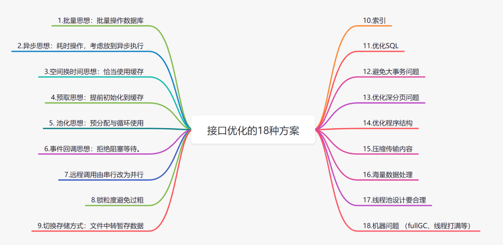

性能调优

三高思想：大道至简、清除冗余

[接口性能优化的15个技巧](https://www.toutiao.com/article/7152327136030835232/?log_from=53e12154ad351_1670165982743&from_pwa=1)

[实战总结18种接口优化方案](https://www.toutiao.com/article/7216249025438286336/?log_from=7583c6a508f6c_1682909317420)

[CTO偷传我的系统性能优化的十大绝招](https://mp.weixin.qq.com/s/ujDIauY9YbUWjto1IfruAQ)

[优雅编码的45个技巧](https://www.toutiao.com/article/7219134284794692152/?log_from=cdcf8ded31e9d_1681023052999)

问题处理

三高：高并发 高性能 高可用 高扩展                      优化是系统工程

# 三高系统

https://mp.weixin.qq.com/s/KndeH1BbEH7OUpcjJ8oZUw

常见的高并发场景有：淘宝的双11、春运时的抢票、微博大V的热点新闻等。除了这些典型事情，每秒几十万请求的秒杀系统、每天千万级的订单系统、每天亿级日活的信息流系统等，都可以归为高并发。

上面谈到的高并发场景，并发量各不相同，**那到底多大并发才算高并发呢**？

1、不能只看数字，要看具体的业务场景。不能说10W QPS的秒杀是高并发，而1W QPS的信息流就不是高并发。信息流场景涉及复杂的推荐模型和各种人工策略，它的业务逻辑可能比秒杀场景复杂10倍不止。因此，不在同一个维度，没有任何比较意义。

2、业务都是从0到1做起来的，并发量和QPS只是参考指标，最重要的是：在业务量逐渐变成原来的10倍、100倍的过程中，你是否用到了高并发的处理方法去演进你的系统，从架构设计、编码实现、甚至产品方案等维度去预防和解决高并发引起的问题？而不是一味的升级硬件、加机器做水平扩展。

此外，各个高并发场景的业务特点完全不同：有读多写少的信息流场景、有读多写多的交易场景，**那是否有通用的技术方案解决不同场景的高并发问题呢？**

我觉得大的思路可以借鉴，别人的方案也可以参考，但是真正落地过程中，细节上还会有无数的坑。另外，由于软硬件环境、技术栈、以及产品逻辑都没法做到完全一致，这些都会导致同样的业务场景，就算用相同的技术方案也会面临不同的问题，这些坑还得一个个趟。

从宏观角度看，高并发系统设计的目标有三个：高性能、高可用，以及高可扩展。

1、**高性能**：性能体现了系统的并行处理能力，在有限的硬件投入下，提高性能意味着节省成本。同时，性能也反映了用户体验，响应时间分别是100毫秒和1秒，给用户的感受是完全不同的。

2、**高可用**：表示系统可以正常服务的时间。一个全年不停机、无故障；另一个隔三差五出线上事故、宕机，用户肯定选择前者。另外，如果系统只能做到90%可用，也会大大拖累业务。

3、**高扩展**：表示系统的扩展能力，流量高峰时能否在短时间内完成扩容，更平稳地承接峰值流量，比如双11活动、明星离婚等热点事件。

## 通用的设计方法

通用的设计方法主要是从「纵向」和「横向」两个维度出发，俗称高并发处理的两板斧：纵向扩展和横向扩展。

**纵向扩展**

它的目标是提升单机的处理能力，方案包括：

1、提升单机的硬件性能：通过增加内存、CPU核数、存储容量、或者将磁盘升级成SSD等堆硬件的方式来提升。

2、提升单机的软件性能：使用缓存减少IO次数，使用并发或者异步的方式增加吞吐量。

**横向扩展**

因为单机性能总会存在极限，所以最终还需要引入横向扩展，通过集群部署以进一步提高并发处理能力，又包括以下2个方向：

1、做好分层架构：这是横向扩展的前提，因为高并发系统往往业务复杂，通过分层处理可以简化复杂问题，更容易做到横向扩展。

2、各层进行水平扩展：无状态水平扩容，有状态做分片路由。业务集群通常能设计成无状态的，而数据库和缓存往往是有状态的，因此需要设计分区键做好存储分片，当然也可以通过主从同步、读写分离的方案提升读性能。

## **高性能的实践方案**

1、本地思想：（如引入二级本地缓存，注册中心数据本地化，远程调用落地，元数据本地化优先调用远程等)

2、池化思想：（内存池各种连接池对象池线程池等，预分配循环使用，复用)

3、缓存缓冲：（借助Buffer、MQ、本地缓存分布式缓存Map、CDN，nginx缓存等，使用缓存MQ承接大流量）

​                            读多写少用缓存，写多读少用缓冲

4、异步思想：（借助MQspringevent线程、延时任务等，非核心逻辑异步化、Future、监听回调机制，非阻塞)

5、并发并行：（通过多线程将串行逻辑并行化)

6、预取思想：（预处理、延迟处理，如缓存预热，通过异步任务提前预热数据到缓存中。延迟队列）

7、批量思想：（减少IO次数，批处理、如请求合并、批量插入、批量查询）

8、压缩传输：（减少IO数据包大小，包括采用轻量级的通信协议、合适的数据结构、去掉冗余字段、压缩缓存value等。高性能序列化Protobuf，前后端交互Gzip压缩）

9、架构层面：

分层架构：分布式系统拆分（mysql、redis读写分离、动静分离CDN、冷热分离（不常访问历史数据转储归档单独访问或清理）分库分表分区）分离思想，分而治之

分流思想：集群部署、负载均衡，减轻单机压力

流量控制：熔断限流降级，包括前端限流、Nginx接入层限流、服务端的限流。对流量进行削峰填谷，通过缓存MQ承接流量。单机限流、分布式限流

10、业务层面  限制数据范围、冷热分离、防重复点击、用回答问题或拖动等延迟分批

11、代码层面（锁、事务控制、粒度上下文传递集合初始容量等，读多写少的场景用乐观锁 threadlocal、volatile+cas、distrpor；数据结构与算法（时间换空间，空间换时间等，贪心 分治 回溯 动态规划 查找排序 ）)，

12、存储层面（读写分离、分库分表分区、sql优化索引锁事务、数据冗余字段冗余，数据异构（选择合适的工具、关系型数据库，NoSQL、mongodb、es、clickhouse、mysql、hive、hbase等)）

13、中间件层（组件调优：tomcat jvm db cache mq solr Nginx）

14、硬件底层（CPU内存网卡固态硬盘；顺序写零拷贝IO复用Reactor；JVMGC算法选择等，尽可能减少GC频率和耗时）

​        上述方案无外乎从计算和 IO 两个维度考虑所有可能的优化点，需要有配套的监控系统实时了解当前的性能表现，并支撑你进行性能瓶颈分析，然后再遵循二八原则，抓主要矛盾进行优化。

## **高可用的实践方案**

高可用的方案主要从冗余、取舍、系统运维3个方向考虑，同时需要有配套的值班机制和故障处理流程，当出现线上问题时，可及时跟进处理。

1、故障转移：对等节点的故障转移，Nginx和服务治理框架均支持一个节点失败后访问另一个节点。

​                        非对等节点故障转移，通过心跳检测并实施主备切换（比如redis哨兵模式、MySQL主从切换等）。

2、代码层面：超时设置、容错机制、重试策略和幂等设计。数据一致性检查及修复。兜底策略、开关控制

3、服务保护：熔断、限流、降级

​             降级处理：保证核心服务，牺牲非核心服务，必要时进行熔断；或者核心链路出问题时，有备选链路。

​             限流处理：对超过系统处理能力的请求直接拒绝或者返回错误码。

4、中间件层：消息可靠性：包括producer端的重试机制、broker侧的持久化、consumer端的ack机制等。

5、灰度发布：能支持按机器维度进行小流量部署，观察系统日志和业务指标，等运行平稳后再推全量。

6、监控告警：全方位的监控体系，包括最基础的CPU、内存、磁盘、网络的监控，以及Web服务器、JVM、数据库、各类中间件的监控和业务指标的监控。

7、灾备演练：类似当前的“混沌工程”，对系统进行一些破坏性手段，观察局部故障是否会引起可用性问题。

8、安全机制：恶意攻击、系统漏洞

9、弹性伸缩：系统能够快速扩缩容

## **高扩展的实践方案**

1、合理的分层架构：比如上面谈到的互联网最常见的分层架构，另外还能进一步按照数据访问层、业务逻辑层对微服务做更细粒度的分层（但是需要评估性能，会存在网络多一跳的情况）。

2、存储层的拆分：按照业务维度做垂直拆分、按照数据特征维度进一步做水平拆分（分库分表）。

3、业务层的拆分：最常见的是按照业务维度拆（比如电商场景的商品服务、订单服务等），也可以按照核心接口和非核心接口拆，还可以按照请求源拆（比如To C和To B，APP和H5）。

微服务拆分原则

单一职责、复用、高内聚低耦合、边界清晰、领域驱动、hold住、持续演进

微服务拆分考虑因素

基于领域模型、基于业务需求变化频率、基于应用性能、基于组织架构团队规模、技术异构等

接口设计

安全设计：

https 请求

token：登录用户名密码生成token保存在redis中，设置有效期，请求接口时带上token；校验token

sign：将排序后请求参数+token+timestamp按照约定加密算法加密，与后端将相关参数加密后sign比较

sign：

timestamp：将服务端当前时间和时间戳参数值比较，超过指定期限不予处理；

sign 

权限拦截切面：横向越权：操作别的应用或别的用户的数据；纵向越权：读权限操作需要写权限的接口

限流 熔断 幂等 降级  
高并发 大数据量 版本兼容 环境兼容 (数据迁移) 周边影响（第三方系统影响；系统内其他功能的影响）

参数校验，业务约束

统一请求响应格式；统一异常处理；日志记录；

代码规范：命名、注释、参数校验、日志打印、代码格式、可读性、安全编码规范比如明文密码

并发控制、事务控制、

高性能、高可用、高扩展

对主流程的影响（通过埋点或开关项切面等控制是否执行 降级）

单元测试；

https://blog.csdn.net/weixin_40483369/article/details/119828631

架构设计原则

https://www.toutiao.com/article/7262893568652673551/?log_from=262757b212204_1691073868562