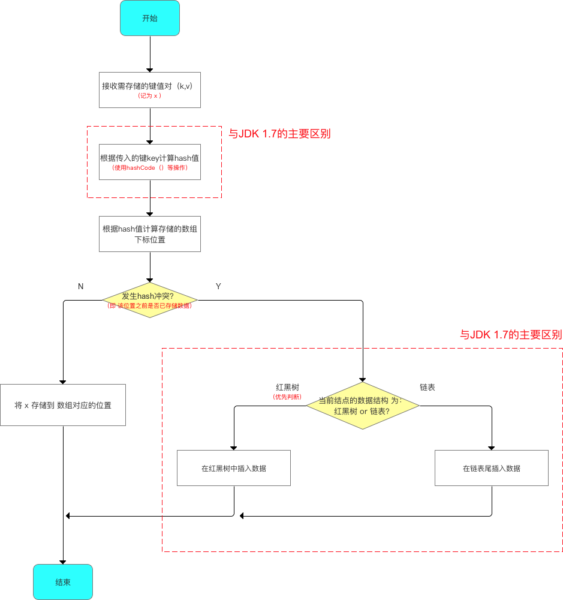
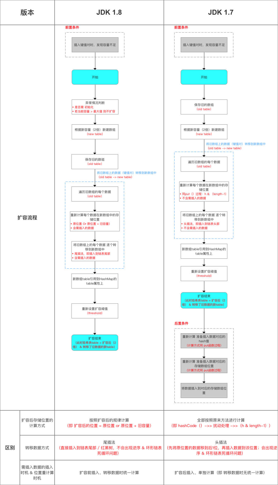
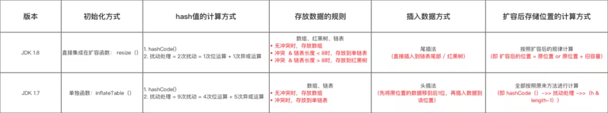
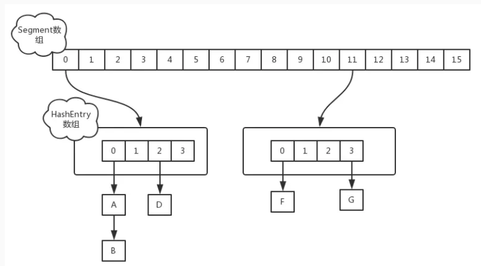
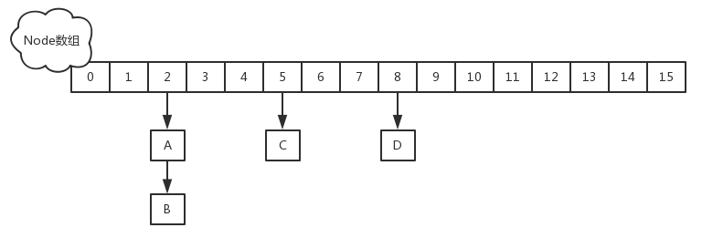

**重点**

1 HashMap原理、源码   LinkedHashMap 手写实现LRU/LFU缓存算法 1.7/1.8

2 ConcurrentHashMap原理、源码  put/get/size/resize 1.7/1.8

3 ArrayList 底层实现及扩容机制

4 阻塞式队列源码实现 实现生产者消费者模式

5 CopyOnWrite底层实现

6 红黑树

[3W字详解java集合](https://mp.weixin.qq.com/s/WoVpnE8edJtv4lhFiB3yhw)

# 1 HashMap

[HashMap源码深度解析](https://www.ixigua.com/6827809139582829060)

## 1.1  HashMap 底层数据结构？说说HashMap 的工作原理？
数据结构：1.7 HashMap 底层是 hash 数组和单向链表实现，jdk8后采用数组+链表+红黑树的数据结构。

工作原理：底层以数组存储键值对(即Entry对象，Entry还有一个指向其他Entry对象的引用next，数组名为table其长度为2的N次幂元素为Entry类型存储位置是不连续的；当使用put方法插入键值对时先根据key的hashCode值利用hash算法对hashCode抽取计算然后通过indexFor方法与数组长度做次运算得到其在table数据中的位置(即索引i)，若该位置为空则插入该Entry，若该位置不空则比较二者key的equals为true则value覆盖为false则新Entry替换数组中当前值其next指向被替换的元素生成链表；get(key)原理同

动态增长：容量即table数组大小默认为16，加载因子默认为0.75，扩容门限为当前数组长度乘以加载因子，新加Entry时先判断map长度是否大于等于门限若成立则扩容一倍；注意扩容是很耗时操作

## 1.2 HashMap 的哈希函数怎么设计的吗？为什么要用异或运算符？ 解决hash冲突的有几种方法？
hash 函数是先拿到通过 key 的 hashCode ，是 32 位的 int 值，然后让 hashCode 的高 16 位和低 16 位进行异或操作。两个好处：一定要尽可能降低 hash 碰撞，越分散越好；算法一定要尽可能高效，因为这是高频操作, 因此采用位运算；

为什么采用 hashcode 的高 16 位和低 16 位异或能降低 hash 碰撞？

因为 key.hashCode()函数调用的是 key 键值类型自带的哈希函数，返回 int 型散列值。int 值范围为**-2147483648~2147483647**，前后加起来大概 40 亿的映射空间。只要哈希函数映射得比较均匀松散，一般应用是很难出现碰撞的。但问题是一个 40 亿长度的数组，内存是放不下的。设想，如果 HashMap 数组的初始大小才 16，用之前需要对数组的长度取模运算，得到的余数才能用来访问数组下标。采用异或运算能保证了对象的 hashCode 的 32 位值只要有一位发生改变，整个 hash() 返回值就会改变。尽可能的减少碰撞。

**解决hash冲突的有几种方法？**

+ **再哈希法**：如果hash出的index已经有值，就再hash，不行继续hash，直至找到空的index位置，要相信瞎猫总能碰上死耗子。这个办法最容易想到。但有2个缺点：比较浪费空间，消耗效率。根本原因还是数组的长度是固定不变的，不断hash找出空的index，可能越界，这时就要创建新数组，而老数组的数据也需要迁移。随着数组越来越大，消耗不可小觑。get不到，或者说get算法复杂。进是进去了，想出来就没那么容易了。
+ **开放地址方法**：如果hash出的index已经有值，通过算法在它前面或后面的若干位置寻找空位，这个和再hash算法差别不大
+ **建立公共溢出区**： 把冲突的hash值放到另外一块溢出区。
+ **链式地址法**： 把产生hash冲突的hash值以链表形式存储在index位置上。HashMap用的就是该方法。优点是不需要另外开辟新空间，也不会丢失数据，寻址也比较简单。但是随着hash链越来越长，寻址也是更加耗时。好的hash算法就是要让链尽量短，最好一个index上只有一个值。也就是尽可能地保证散列地址分布均匀，同时要计算简单。

## 1.3 hashmap何时分配初始数组？table 的容量如何确定？初始容量为什么是16？new HashMap(18);此时HashMap初始容量为多少？

采用延迟初始化，首次put时检查并初始化数组；

① table 数组大小是由 capacity 这个参数确定的，默认是16，也可以构造时传入，最大限制是1<<30；

② loadFactor 是装载因子，主要目的是用来确认table 数组是否需要动态扩展，默认值是0.75，比如table 数组大小为 16，装载因子为 0.75 时，threshold 就是12，当 table 的实际大小超过 12 时，table就需要动态扩容；

③ 扩容时，调用 resize() 方法，将 table 长度变为原来的两倍（注意是 table 长度，而不是 threshold）；

④ 如果数据很大的情况下，扩展时将会带来性能的损失，在性能要求很高的地方，这种损失很可能很致命。

new HashMap(18);此时HashMap初始容量为32。在HashMap中有个静态方法tableSizeFor ，tableSizeFor方法保证函数返回值是大于等于给定参数initialCapacity最小的2的幂次方的数值 。

## 1.4 HashMap 的长度为什么是 2 的 N 次方呢？

为了能让 HashMap 存数据和取数据的效率高，尽可能地减少 hash 值的碰撞，也就是说尽量把数据能均匀的分配，每个链表或者红黑树长度尽量相等。我们首先可能会想到 % 取模的操作来实现。下面是回答的重点哟：
取余（%）操作中如果除数是 2 的幂次，则等价于与其除数减一的与（&）操作（也就是说 hash % length == hash &(length - 1) 的前提是 length 是 2 的 n 次方）。并且，采用二进制位操作 & ，相对于 % 能够提高运算效率。
这就是为什么 HashMap 的长度需要 2 的 N 次方了。

## 1.5 请解释一下HashMap的参数loadFactor，它的作用是什么？为什么默认取0.75？
loadFactor表示HashMap的拥挤程度，影响hash操作到同一个数组位置的概率。默认loadFactor等于0.75，当HashMap里面容纳的元素已经达到HashMap数组长度的75%时，表示HashMap太挤了，需要扩容，在HashMap的构造器中可以定制loadFactor。取值大和取值小有和影响。

当负载因子是1.0的时候，也就意味着，只有当数组全部填充了，才会发生扩容。这就带来了很大的问题，因为Hash冲突时避免不了的。当负载因子是1.0的时候，意味着会出现大量的Hash的冲突，底层的红黑树变得异常复杂。对于查询效率极其不利。这种情况就是牺牲了时间来保证空间的利用率。因此一句话总结就是负载因子过大，虽然空间利用率上去了，但是时间效率降低了。

负载因子是0.5的时候，这也就意味着，当数组中的元素达到了一半就开始扩容，既然填充的元素少了，Hash冲突也会减少，那么底层的链表长度或者是红黑树的高度就会降低。查询效率就会增加。但是，兄弟们，这时候空间利用率就会大大的降低，原本存储1M的数据，现在就意味着需要2M的空间。一句话总结就是负载因子太小，虽然时间效率提升了，但是空间利用率降低了。

负载因子是0.75的时候，空间利用率比较高，而且避免了相当多的Hash冲突，使得底层的链表或者是红黑树的高度比较低，提升了空间效率。

## 1.6 JDK8中hashmap当链表长度 >= 8时，为什么要将链表转换成红黑树？
因为红黑树的平均查找长度是log(n)，长度为8的时候，平均查找长度为3，如果继续使用链表，平均查找长度为8/2=4，所以，当链表长度 >= 8时 ，有必要将链表转换成红黑树。

## 1.7  拉链法导致的链表过深问题为什么不用二叉查找树代替，而选择红黑树？为什么不一直使用红黑树？
之所以选择红黑树是为了解决二叉查找树的缺陷，二叉查找树在特殊情况下会变成一条线性结构（这就跟原来使用链表结构一样了，造成很深的问题），遍历查找会非常慢。而红黑树在插入新数据后可能需要通过左旋，右旋、变色这些操作来保持平衡，引入红黑树就是为了查找数据快，解决链表查询深度的问题，我们知道红黑树属于平衡二叉树，但是为了保持“平衡”是需要付出代价的，但是该代价所损耗的资源要比遍历线性链表要少，所以当长度大于8的时候，会使用红黑树，如果链表长度很短的话，根本不需要引入红黑树，引入反而会慢。

## 1.8 说说你对红黑树的了解
红黑树是一种自平衡的二叉查找树，是一种高效的查找树。红黑树通过如下的性质定义实现自平衡：

节点是红色或黑色。

根是黑色。

所有叶子都是黑色（叶子是NIL节点）。

每个红色节点必须有两个黑色的子节点。（从每个叶子到根的所有路径上不能有两个连续的红色节点。）

从任一节点到其每个叶子的所有简单路径都包含相同数目的黑色节点（简称黑高）。

## 1.9 说说HashMap中put方法的过程？


## 1.10 说说hashMap中get是如何实现的？
对key的hashCode进行hash值计算，与运算计算下标获取bucket位置，如果在桶的首位上就可以找到就直接返回，否则在树中找或者链表中遍历找，如果有hash冲突，则利用equals方法去遍历链表查找节点。

## 1.11 说说resize扩容的过程？1.7中为什么会产生死循环？1.8中做了什么优化处理？
什么时候扩容？


1.7 多线程下死循环问题 https://www.toutiao.com/i6778430163987202572/

因为在 put 元素的时候，如果触发扩容操作，也就是 rehash ，就会将原数组的内容重新 hash 到新的扩容数组中，但是在扩容这个过程中，其他线程也在进行 put 操作，如果这两个元素 hash 值相同，可能出现同时在同一数组下用链表表示，造成闭环，导致在get时会出现死循环，所以HashMap是线程不安全的。

## 1.12  JDK8中对HashMap做了哪些改变？
1.在java 1.8中，如果链表的长度超过了8，那么链表将转换为红黑树。（桶的数量必须大于64，小于64的时候只会扩容）--该处桶的数量64判断有何意义？

2.发生hash碰撞时，java 1.7 会在链表的头部插入，而java 1.8会在链表的尾部插入。

3.在java 1.8中，Entry被Node替代(换了一个马甲)。



## 1.13 HashMap 中的 key 我们可以使用任何类作为 key 吗？
平时可能大家使用的最多的就是使用 String 作为 HashMap 的 key，但是现在我们想使用某个自定 义类作为 HashMap 的 key，那就需要注意以下几点：

如果类重写了 equals 方法，它也应该重写 hashCode 方法。类的所有实例需要遵循与 equals 和 hashCode 相关的规则。如果一个类没有使用 equals，你不应该在 hashCode 中使用它。咱们自定义 key 类的最佳实践是使之为不可变的，这样，hashCode 值可以被缓存起来，拥有更好的性能。不可变的类也可以确保 hashCode 和 equals 在未来不会改变，这样就会解决与可变相关的问题了。

## 1.14 HashMap源码解读
工作原理源码1.7/1.8

[不怕面试再问HashMap，一次彻底地梳理（原理+手写实现）](https://www.toutiao.com/a6930953980453470724/?channel=&source=search_tab)

[HashMap源码分析](https://www.toutiao.com/i6727624027327693316/?group_id=6727624027327693316)

## 1.15 手写实现HashMap


## 1.16 LinkedHashMap原理？手写实现LRUMap？


# 2  HashMap 和 HashTable 有什么区别？HashMap 和 HashSet区别？
1. 线程安全： HashMap 是⾮线程安全的， HashTable 是线程安全的,因为 HashTable 内部的⽅法基本都经过 synchronized 修饰。
2. 效率： 因为线程安全的问题， HashMap 要⽐ HashTable 效率⾼⼀点。另外， HashTable基本被淘汰，不要在代码中使⽤它；
3. 对 Null key 和 Null value 的⽀持： HashMap 可以存储 null 的 key 和 value，但 null 作为键只能有⼀个， null 作为值可以有多个； HashTable 不允许有 null 键和 null 值，否则会抛出NullPointerException 。
4. 初始容量大小和每次扩充容量大小的不同 ： ① 创建时如果不指定容量初始值， Hashtable默认的初始大小为 11，之后每次扩充，容量变为原来的 2n+1。 HashMap 默认的初始化大小为 16。之后每次扩充，容量变为原来的 2 倍。② 创建时如果给定了容量初始值，那么Hashtable 会直接使⽤你给定的大小，⽽ HashMap 会将其扩充为 2 的幂次⽅大小。
5. 底层数据结构： JDK1.8 以后的 HashMap 在解决哈希冲突时有了较大的变化，当链表⻓度大于阈值（默认为 8）（将链表转换成红⿊树前会判断，如果当前数组的⻓度小于 64，那么会选择先进⾏数组扩容，⽽不是转换为红⿊树）时，将链表转化为红⿊树，以减少搜索时间。 Hashtable 没有这样的机制。 
6. HashMap 需要重新计算 hash 值，而 HashTable 直接使用对象的 hashCode；   

如果你看过 HashSet 源码的话就应该知道： HashSet 底层就是基于 HashMap 实现的。（ HashSet 的源码⾮常⾮常少，因为除了 clone() 、 writeObject() 、 readObject() 是 HashSet⾃⼰不得不实现之外，其他⽅法都是直接调⽤ HashMap 中的⽅法。

# 3 HashMap 是线程安全的吗？如何规避 HashMap 的线程不安全？
不是，在多线程环境下，1.7 会产生死循环、数据丢失、数据覆盖的问题，1.8 中会有数据覆盖的问题，以 1.8 为例，当 A 线程判断 index 位置为空后正好挂起，B 线程开始往 index 位置的写入节点数据，这时 A 线程恢复现场，执行赋值操作，就把 A 线程的数据给覆盖了；还有++size 这个地方也会造成多线程同时扩容等问题。

如何规避 HashMap 的线程不安全？

单线程条件下，为避免出现ConcurrentModificationException，需要保证只通过HashMap本身或者只通过Iterator去修改数据，不能在Iterator使用结束之前使用HashMap本身的方法修改数据。因为通过Iterator删除数据时，HashMap的modCount和Iterator的expectedModCount都会自增，不影响二者的相等性。如果是增加数据，只能通过HashMap本身的方法完成，此时如果要继续遍历数据，需要重新调用iterator()方法从而重新构造出一个新的Iterator，使得新Iterator的expectedModCount与更新后的HashMap的modCount相等。

多线程条件下，可使用两种方式：Collections.synchronizedMap方法构造出一个同步Map；直接使用线程安全的ConcurrentHashMap。

# 4 ConcurrentHashMap
## 4.1 HashMap 和 ConcurrentHashMap 的区别？
都是 key-value 形式的存储数据；

HashMap 是线程不安全的，ConcurrentHashMap 是 JUC 下的线程安全的；

HashMap 底层数据结构是**数组 + 链表**（JDK8 之前）。JDK 8 之后是**数组 + 链表 + 红黑树**。当链表中元素个数达到 8 的时候，链表的查询速度不如红黑树快，链表会转为红黑树，红黑树查询速度快；

HashMap 初始数组大小为 16（默认），当出现扩容的时候，以 0.75 * 数组大小的方式进行扩容；ConcurrentHashMap 在 JDK8 之前是采用**分段锁**来现实的 Segment + HashEntry， Segment 数组大小默认是 16，2 的 n 次方；JDK 8 之后，采用 **Node + CAS + Synchronized** 来保证并发安全进行实现。

## 4.2 为什么 ConcurrentHashMap 比 HashTable 效率要高？
HashTable：使用一把锁（锁住整个链表结构）处理并发问题，多个线程竞争一把锁，容易阻塞；

ConcurrentHashMap：JDK7 中使用分段锁（ReentrantLock + Segment + HashEntry），相当于把一个 HashMap 分成多个段，每段分配一把锁，这样支持多线程访问。锁粒度：基于 Segment，包含多个 HashEntry。JDK 8 中使用CAS + synchronized + Node + 红黑树。锁粒度：Node（首结点）（实现 Map.Entry<K,V>）。锁粒度降低了。

## 4.3 能对ConcurrentHashMap 做个简单介绍吗？
① 重要的常量：　　
private transient volatile int sizeCtl; 　
当为负数时，-1 表示正在初始化，-N 表示 N - 1 个线程正在进行扩容；　
当为 0 时，表示 table 还没有初始化；　　
当为其他正数时，表示初始化或者下一次进行扩容的大小。

② 数据结构：　　
Node 是存储结构的基本单元，继承 HashMap 中的 Entry，用于存储数据；
TreeNode 继承 Node，但是数据结构换成了二叉树结构，是红黑树的存储结构，用于红黑树中存储数据；　　
TreeBin 是封装 TreeNode 的容器，提供转换红黑树的一些条件和锁的控制。

③ 存储对象时（put() 方法）：
如果没有初始化，就调用 initTable() 方法来进行初始化；如果没有 hash 冲突就直接 CAS 无锁插入；　　
如果需要扩容，就先进行扩容；如果存在 hash 冲突，就加锁来保证线程安全，两种情况：一种是链表形式就直接遍历到尾端插入，一种是红黑树就按照红黑树结构插入；　　
如果该链表的数量大于阀值 8，就要先转换成红黑树的结构，break 再一次进入循环， 　　
如果添加成功就调用 addCount() 方法统计 size，并且检查是否需要扩容。

④ 扩容方法 transfer()：默认容量为 16，扩容时，容量变为原来的两倍。helpTransfer()：调用多个工作线程一起帮助进行扩容，这样的效率就会更高。

⑤ 获取对象时（get()方法）：　
计算 hash 值，定位到该 table 索引位置，如果是首结点符合就返回；　　
如果遇到扩容时，会调用标记正在扩容结点 ForwardingNode.find()方法，查找该结点，匹配就返回；　　
以上都不符合的话，就往下遍历结点，匹配就返回，否则最后就返回 null。

## 4.4 说说 ConcurrentHashMap中锁机制
JDK 1.7 中，采用分段锁的机制，实现并发的更新操作，底层采用**数组+链表**的存储结构，包括两个核心静态内部类 Segment 和 HashEntry。

① Segment 继承 ReentrantLock（重入锁） 用来充当锁的角色，每个 Segment 对象守护每个散列映射表的若干个桶；

② HashEntry 用来封装映射表的键-值对；

③ 每个桶是由若干个 HashEntry 对象链接起来的链表

JDK 1.8 中，采用**Node + CAS + Synchronized**来保证并发安全。取消类 Segment，直接用 table 数组存储键值对；当 HashEntry 对象组成的链表长度超过 TREEIFY_THRESHOLD 时，链表转换为红黑树，提升性能。底层变更为数组 + 链表 + 红黑树。


## 4.5 熟悉ConcurrentHashMap 的并发度吗？
程序运行时能够同时更新 ConccurentHashMap 且不产生锁竞争的最大线程数。默认为 16，且可以在构造函数中设置。当用户设置并发度时，ConcurrentHashMap 会使用大于等于该值的最小2幂指数作为实际并发度（假如用户设置并发度为17，实际并发度则为32）。

## 4.6 在 JDK 1.8 中，ConcurrentHashMap 为什么要使用内置锁 synchronized 来代替重入锁 ReentrantLock？
① 粒度降低了；

② JVM 开发团队没有放弃 synchronized，而且基于 JVM 的 synchronized 优化空间更大

③ 在大量的数据操作下，对于 JVM 的内存压力，基于 API 的 ReentrantLock 会开销更多的内存。

## 4.7 ConcurrentHashMap源码分析


# 5 介绍Collection框架结构、优点及集合使用泛型优点
Collection/Map  
降低开发成本；

经过严格测试提升代码质量；降低维护成本；

复用性高；

泛型允许为集合指定对象类型，若添加其他类型元素则编译报错，泛型使代码更整洁不需要显示转换和instanceof判断；

ArrayList、HashMap、TreeMap和HashTable类提供对元素的随机访问

# 6 为何Collection不从Cloneable和Serializable接口继承？为何Map不继承Collection接口？
Collection接口指定一组对象，对象即为它的元素。如何维护这些元素由Collection的具体实现决定。例如，一些如List的Collection实现允许重复的元素，而其它的如Set就不允许。很多Collection实现有一个公有的clone方法。然而，把它放到集合的所有实现中也是没有意义的。这是因为Collection是一个抽象表现。重要的是实现。当与具体实现打交道的时候，克隆或序列化的语义和含义才发挥作用。所以，具体实现应该决定如何对它进行克隆或序列化，或它是否可以被克隆或序列化。在所有的实现中授权克隆和序列化，最终导致更少的灵活性和更多的限制。特定的实现应该决定它是否可以被克隆和序列化。

Map包含key-value键值映射对提供抽取key或value列表集合的方法，不适合“一组对象”规范，和集合是不同概念

# 7 Collecton和Collections区别？Array和Arrays？
Collecton是集合基础接口，子接口有List Set Queue；
Collections是集合工具类，提供集合查找、排序、同步、空集合等操作

# 8 Comparable和Comparator的不同之处？
Comparable接口出自java.lang有个compareTo方法，若在定义类时涉及到类对象的排序比较可实现该接口，其只能提供基于单个逻辑的排序(如按年龄)，注意同时覆写了equals方法应保证equals为true时compareTo返回0；

Comparator接口为比较器，出自java.util包，含类型参数，可自由定义不同排序算法比价比较器(如按年龄按收入等)，若类定义时没实现Compareable接口又想对该类对象排序比较则可为该类对象定义比较器实现该接口；

# 7 说说什么是 fail-fast？fail-safe?

fail-fast 机制是 Java 集合（Collection）中的一种错误机制。当多个线程对同一个集合的内容进行操作时，就可能会产生 fail-fast 事件。

例如：当某一个线程 A 通过 iterator 去遍历某集合的过程中，若该集合的内容被其他线程所改变 了，那么线程 A 访问集合时，就会抛出 ConcurrentModificationException 异常，产生 fail-fast 事 件。这里的操作主要是指 add、remove 和 clear，对集合元素个数进行修改。

可以这么理解：在遍历之前，把 modCount 记下来 expectModCount，后面 expectModCount 去和modCount 进行比较，如果不相等了，证明已并发了，被修改了，于是抛出 ConcurrentModificationException 异常。每次我们尝试获取下一个元素的时候，Iterator fail-fast属性检查当前集合结构里的任何改动。如果发现任何改动，它抛出ConcurrentModificationException。 

解决办法：建议使用“java.util.concurrent 包下的类”去取代java.util 包下的类。

Iterator的fail-fast属性与当前的集合共同起作用，因此它不会受到集合中任何改动的影响。Java.util包中的所有集合类都被设计为fail-fast的，而java.util.concurrent中的集合类都为fail-safe的。Fail-fast迭代器抛出ConcurrentModificationException，而fail-safe迭代器从不抛出ConcurrentModificationException。

# 8 BlockingQueue
## 8.1 什么是阻塞式队列
Java.util.concurrent.BlockingQueue是一个队列，在进行检索或移除一个元素的时候，它会等待队列变为非空；当在添加一个元素时，它会等待队列中的可用空间。

BlockingQueue接口是Java集合框架的一部分，主要用于实现生产者-消费者模式。

Java提供了集中BlockingQueue的实现，比如ArrayBlockingQueue、LinkedBlockingQueue、PriorityBlockingQueue,、SynchronousQueue等。

## 8.2 BlockingQueue源码


## 8.3 实现生产者消费者模式


## 8.4 手写实现BlockingQueue


# 9 HashSet如何检查重复？
当你把对象加⼊ HashSet 时， HashSet 会先计算对象的 hashcode 值来判断对象加⼊的位置，同时也会与其他加⼊的对象的 hashcode 值作⽐较，如果没有相符的 hashcode ， HashSet 会假设对象没有重复出现。但是如果发现有相同 hashcode 值的对象，这时会调⽤ equals() ⽅法来检查ashcode 相等的对象是否真的相同。如果两者相同， HashSet 就不会让加⼊操作成功。 

# 10 Iterable、Iterator、ListIterator、**Enumeration** ？为何Iterator接口没有具体实现？为何有remove方法但没有add方法添加元素？

Iterator接口提供遍历任何Collection的接口。我们可以从一个Collection中使用迭代器方法来获取迭代器实例。迭代器取代了Java集合框架中的Enumeration。迭代器允许调用者在迭代过程中移除元素；

Enumeration的速度是Iterator的两倍，也使用更少的内存。Enumeration是非常基础的，也满足了基础的需要。但是，与Enumeration相比，Iterator更加安全，因为当一个集合正在被遍历的时候，它会阻止其它线程去修改集合。迭代器取代了Java集合框架中的Enumeration。迭代器允许调用者从集合中移除元素，而Enumeration不能做到。为了使它的功能更加清晰，迭代器方法名已经经过改善可以使用Iterator来遍历Set和List集合，而ListIterator只能遍历List；Iterator只可以向前遍历，而ListIterator从Iterator接口继承，然后添加了一些额外的功能可以双向遍历

为什么一定要去实现Iterable这个接口呢？ 为什么不直接实现Iterator接口呢？

JDK集合类都是实现了Iterable接口，但并不直接实现Iterator接口？Iterator接口的核心方法next()或者hasNext()是依赖于迭代器的当前迭代位置的。如果Collection直接实现Iterator接口，势必导致集合对象中包含当前迭代位置的数据(指针)。当集合在不同方法间被传递时，由于当前迭代位置不可预置，那么next()方法的结果会变成不可预知。除非再为Iterator接口添加一个reset()方法，用来重置当前迭代位置。但即时这样，Collection也只能同时存在一个当前迭代位置。而Iterable(接口方法有获取迭代器的iterator()和支持foeach)则不然，每次调用都会返回一个从头开始计数的迭代器。多个迭代器是互不干扰的。

**为何有remove方法但没有add方法添加元素？**

Iterator接口定义了遍历集合的方法，但它的实现则是集合实现类的责任。每个能够返回用于遍历的Iterator的集合类都有它自己的Iterator实现内部类。这就允许集合类去选择迭代器是fail-fast还是fail-safe的。比如，ArrayList迭代器是fail-fast的，而CopyOnWriteArrayList迭代器是fail-safe的。

语义不明，已知的是，Iterator的协议不能确保迭代的次序。然而要注意，ListIterator没有提供一个add操作，它要确保迭代的顺序。

# 11 Iterator的remove方法和集合的remove方法？
 jdk5.0以上的for-each也是利用内部的**iterator**来遍历集合的（跟以前的**iterator**一样）获得的**Iterator**是一个内部类产生的迭代器**，**这个迭代器在调用next方法时**，**会检查列表是否被修改过**，**如果被修改过**，**就会抛出ConcurrentModificationException异常。

进一步说**，**当使用 fail-fast **iterator** 对**Collection** 或 Map 进行迭代操作过程中尝试直接修改 **Collection** / Map 的内容时**，**即使是在单线程下运行**java.util.ConcurrentModificationException 异常也将被抛出。**

Iterator 是工作在一个独立的线程中**，**并且拥有一个 mutex 锁。 **Iterator** 被创建之后会建立一个指向原来对象的单链索引表**，**当原来的对象数量发生变化时**，**这个索引表的内容不会同步改变**，**所以当索引指针往后移动的时候就找不到要迭代的对象**，**所以按照 fail-fast 原则 **Iterator** 会马上抛出 java.util.ConcurrentModificationException 异常。所以 **Iterator** 在工作的时候是不允许被迭代的对象被改变的。但你可以使用 **Iterator** 本身的方法 **remove**() 来删除对象，Iterator.remove() 方法会在删除当前迭代对象的同时维护索引的一致性。

有意思的是如果你的 **Collection** / Map 对象实际只有一个元素的时候**，** ConcurrentModificationException 异常并不会被抛出。这也就是为什么在 javadoc 里面指出： it would be wrong to write a program that depended on this exception for its correctness: ConcurrentModificationException should be used only to detect bugs.

解决方法：在Map或者**Collection**的时候**，**不要用它们的API直接修改集合的内容**，**如果要修改可以用**Iterator**的**remove**()方法。

# 12 CopyOnWrite
## 12.1 CopyOnWrite 思想
写入时复制（CopyOnWrite，简称COW）思想是计算机程序设计领域中的一种通用优化策略。其核心思想是，如果有多个调用者（Callers）同时访问相同的资源（如内存或者是磁盘上的数据存储），他们会共同获取相同的指针指向相同的资源，直到某个调用者修改资源内容时，系统才会真正复制一份专用副本（private copy）给该调用者，而其他调用者所见到的最初的资源仍然保持不变。这过程对其他的调用者都是透明的（transparently）。此做法主要的优点是如果调用者没有修改资源，就不会有副本（private copy）被创建，因此多个调用者只是读取操作时可以共享同一份资源。通俗易懂的讲，写入时复制技术就是不同进程在访问同一资源的时候，只有更新操作，才会去复制一份新的数据并更新替换，否则都是访问同一个资源。

JDK 的 CopyOnWriteArrayList/CopyOnWriteArraySet 容器正是采用了 COW 思想，它是如何工作的呢？简单来说，就是平时查询的时候，都不需要加锁，随便访问，只有在更新的时候，才会从原来的数据复制一个副本出来，然后修改这个副本，最后把原数据替换成当前的副本。修改操作的同时，读操作不会被阻塞，而是继续读取旧的数据。这点要跟读写锁区分一下。

**优点和缺点**

**1.优点**

对于一些读多写少的数据，写入时复制的做法就很不错，例如配置、黑名单、物流地址等变化非常少的数据，这是一种无锁的实现。可以帮我们实现程序更高的并发。
CopyOnWriteArrayList 并发安全且性能比 Vector 好。Vector 是增删改查方法都加了synchronized 来保证同步，但是每个方法执行的时候都要去获得锁，性能就会大大下降，而 CopyOnWriteArrayList 只是在增删改上加锁，但是读不加锁，在读方面的性能就好于 Vector。

**2.缺点**

数据一致性问题。这种实现只是保证数据的最终一致性，在添加到拷贝数据而还没进行替换的时候，读到的仍然是旧数据。内存占用问题。如果对象比较大，频繁地进行替换会消耗内存，从而引发 Java 的 GC 问题，这个时候，我们应该考虑其他的容器，例如 ConcurrentHashMap。

## 12.2 CopyOnWriteArrayList源码分析
我们先来看看 CopyOnWriteArrayList 的 add() 方法，其实也非常简单，就是在访问的时候加锁，拷贝出来一个副本，先操作这个副本，再把现有的数据替换为这个副本。
```java
public boolean add(E e) {
        final ReentrantLock lock = this.lock;
        lock.lock();
        try {
            Object[] elements = getArray();
            int len = elements.length;
            Object[] newElements = Arrays.copyOf(elements, len + 1);
            newElements[len] = e;
            setArray(newElements);
            return true;
        } finally {
            lock.unlock();
        }
    }
```
CopyOnWriteArrayList 的 get(int index) 方法就是普通的无锁访问。
```java
 public E get(int index) {
        return get(getArray(), index);
    }
    
    @SuppressWarnings("unchecked")
    private E get(Object[] a, int index) {
        return (E) a[index];
    }    
```

# 13 ArrayList和LinkedList有何区别？
ArrayList和LinkedList两者都实现了List接口，但是它们之间有些不同。ArrayList顺序存储基于索引支持元素随机访问效率高但插入删除需移动元素效率较低；LinkList链式存储插入删除效率高访问效率低需遍历而且消耗更多内存(双链表存储前后节点引用)且不涉及扩容问题；

1. 是否保证线程安全： ArrayList 和 LinkedList 都是不同步的，也就是不保证线程安全；
2. 底层数据结构： Arraylist 底层使⽤的是 Object 数组； LinkedList 底层使⽤的是双向链表数据结构（JDK1.6 之前为循环链表， JDK1.7 取消了循环）
3. 插⼊和删除是否受元素位置的影响： ① ArrayList 采⽤数组存储，所以插⼊和删除元素的时间复杂度受元素位置的影响。 ⽐如：执⾏ add(E e) ⽅法的时候， ArrayList 会默认在将指定的元素追加到此列表的末尾，这种情况时间复杂度就是 O(1)。但是如果要在指定位置 i插⼊和删除元素的话（ add(int index, E element) ）时间复杂度就为 O(n-i)。因为在进⾏上述操作的时候集合中第 i 和第 i 个元素之后的(n-i)个元素都要执⾏向后位/向前移⼀位的操作。 ②LinkedList 采⽤链表存储，所以对于 add(E e) ⽅法的插⼊，删除元素时间复杂度不受元素位置的影响，近似 O(1)，如果是要在指定位置 i 插⼊和删除元素的话（ (add(int index, E element) ） 时间复杂度近似为 o(n)) 因为需要先移动到指定位置再插⼊。
4. 是否⽀持快速随机访问： LinkedList 不⽀持⾼效的随机元素访问，⽽ ArrayList ⽀持。快速随机访问就是通过元素的序号快速获取元素对象(对应于 get(int index) ⽅法)。
5. 内存空间占⽤： ArrayList 的空间浪费主要体现在在 list 列表的结尾会预留⼀定的容量空间，⽽ LinkedList 的空间花费则体现在它的每⼀个元素都需要消耗⽐ ArrayList 更多的空间（因为要存放直接后继和直接前驱以及数据）。

# 14 Map接口提供了哪些不同的集合视图？
（1）Set keyset()：返回map中包含的所有key的一个Set视图。集合是受map支持的，map的变化会在集合中反映出来，反之亦然。当一个迭代器正在遍历一个集合时，若map被修改了（除迭代器自身的移除操作以外），迭代器的结果会变为未定义。集合支持通过Iterator的Remove、Set.remove、removeAll、retainAll和clear操作进行元素移除，从map中移除对应的映射。它不支持add和addAll操作。

（2）Collection values()：返回一个map中包含的所有value的一个Collection视图。这个collection受map支持的，map的变化会在collection中反映出来，反之亦然。当一个迭代器正在遍历一个collection时，若map被修改了（除迭代器自身的移除操作以外），迭代器的结果会变为未定义。集合支持通过Iterator的Remove、Set.remove、removeAll、retainAll和clear操作进行元素移除，从map中移除对应的映射。它不支持add和addAll操作。

（3）Set<Map.Entry<K,V>> entrySet()：返回一个map钟包含的所有映射的一个集合视图。这个集合受map支持的，map的变化会在collection中反映出来，反之亦然。当一个迭代器正在遍历一个集合时，若map被修改了（除迭代器自身的移除操作，以及对迭代器返回的entry进行setValue外），迭代器的结果会变为未定义。集合支持通过Iterator的Remove、Set.remove、removeAll、retainAll和clear操作进行元素移除，从map中移除对应的映射。它不支持add和addAll操作。

# 15 ArrayList和Vector比较？
均为有序可重复基于索引可随机访问集合且迭代器实现均为failfast，区别在于线程安全性；

数据增长(ArrayList增加0.5倍，Vector增长一倍)

线程安全性；是否允许null值；默认长度；fail-fast

Array和ArrayList比较：数组支持基本类型list不支持；数组大小固定；

# 16  List、Set、Map比较？

List是有序可重复集合存储单列数据，

Map存储键值映射双列数据且键不能重复值可重复；

Set是无序不可重复集合；

# 17 如何保证一个集合线程安全？

使用同步集合Vector、Hashtable等；

使用Collections工具类synchronizedList同步集合；

使用并发包中线程安全的集合ConcurrentHashMap; 

# 18 两对象equals比较为true但却有不同的hashCode，对否？

对，对于存入hash集合的对象要求equals为true时hashCode必须相同；若不存入hash集合则无此要求；

# 19 TreeSet里同时放入父类和子类对象比较时调用的是父类还是子类的compareTo方法还是抛异常？
当前的add方法放入的是哪个对象就调用哪个对象的compareTo方法；

TreeSet底层采用红黑树默认调用对象的compareTo方法比较可指定比较器Comparator

# 20 TreeMap和TreeSet排序时如何比较元素？Collections类中的sort()方法如何比较元素？

TreeSet要求存放的对象所属的类必须实现Comparable接口，该接口提供了比较元素的compareTo()方法，当插入元素时会回调该方法比较元素的大小。

TreeMap要求存放的键值对映射的键必须实现Comparable接口从而根据键对元素进行排序。

Collections工具类的sort方法有两种重载的形式，

第一种要求传入的待排序容器中存放的对象比较实现Comparable接口以实现元素的比较；

第二种不强制性的要求容器中的元素必须可比较，但是要求传入第二个参数，参数是Comparator接口的子类型（需要重写compare方法实现元素的比较），相当于一个临时定义的排序规则，其实就是通过接口注入比较元素大小的算法，也是对回调模式的应用（Java中对函数式编程的支持）。

# 21 ⽐较 HashSet、 LinkedHashSet 和 TreeSet 三者的异同
HashSet 是 Set 接⼝的主要实现类 ， HashSet 的底层是 HashMap ，线程不安全的，可以存储 null 值；

LinkedHashSet 是 HashSet 的⼦类，能够按照添加的顺序遍历；

TreeSet 底层使⽤红⿊树，能够按照添加元素的顺序进⾏遍历，排序的⽅式有⾃然排序和定制排序。 

# 22 集合框架底层数据结构总结
先来看⼀下 Collection 接⼝下⾯的集合。

List:

Arraylist ： Object[] 数组，

Vector ： Object[] 数组，

LinkedList ： 双向链表(JDK1.6 之前为循环链表， JDK1.7 取消了循环)

Set：

HashSet （⽆序，唯⼀） : 基于 HashMap 实现的，底层采⽤ HashMap 来保存元素；

LinkedHashSet ： LinkedHashSet 是 HashSet 的⼦类，并且其内部是通过 LinkedHashMap来实现的。

TreeSet （有序，唯⼀）： 红⿊树

Map：

HashMap ： JDK1.8 之前 HashMap 由数组+链表组成的。 JDK1.8 以后数组+链表+红黑树（将链表转换成红⿊树前会判断，如果当前数组的⻓度⼩于 64，那么会选择先进⾏数组扩容，⽽不是转换为红⿊树）

LinkedHashMap ： LinkedHashMap 继承⾃ HashMap ，所以它的底层仍然是基于拉链式散列结构即由数组和链表或红⿊树组成。另外， LinkedHashMap 在上⾯结构的基础上，增加了⼀条双向链表，使得上⾯的结构可以保持键值对的插⼊顺序。同时通过对链表进⾏相应的操作，实现了访问顺序相关逻辑。

Hashtable ： 数组+链表

TreeMap ： 红⿊树

# 23 Java集合优秀实践列举几条？

定义集合时指定初始容量减少扩容拷贝次数；

基于接口编程；

使用Collections工具类获得不变、同步或空集合以及对集合进行排序查找逆序；

不再添加元素时使用trim方法清空冗余空间；

尽量使用jdk提供的不变类作为key值；

