**重点**

1 volatile 底层

2 cas 

3 aqs 理解

4 synchronized 原理、锁升级过程

5 threadlocal 内存泄漏  使用注意

6 threadpool 

https://blog.csdn.net/liuhuiteng/article/details/88371292

https://blog.csdn.net/cmyperson/article/details/79610870

优秀实践

在⾯试中被问到并发知识的时候，⼤多都会被问到“请你说⼀下⾃⼰对于 AQS 原理的理解”。下⾯给⼤家⼀个示例供⼤家参加，⾯试不是背题，⼤家⼀定要加⼊⾃⼰的思想，即使加⼊不了⾃⼰的思想也要保证⾃⼰能够通俗的讲出来⽽不是背出来。 

[Java并发史上最全面试题](https://www.zhihu.com/question/511409941/answer/2309629045?utm_source=wechat_session&utm_medium=social&utm_oi=814962150182379520&utm_content=group3_Answer&utm_campaign=shareopn)

# 1 进程和线程区别？为什么需要多线程？

进程是具有一定独立功能的程序关于某个数据集合上的一次运行活动，是操作系统进行资源分配和调度的一个独立单位；

线程是进程的一个实体，是CPU调度和分派的基本单位，是比进程更小的能独立运行的基本单位。线程的划分尺度小于进程，这使得多线程程序的并发性高；

进程在执行时通常拥有独立的内存单元，而线程之间可以共享内存。使用多线程的编程通常能够带来更好的性能和用户体验，但是多线程的程序对于其他程序是不友好的，因为它可能占用了更多的CPU资源。当然，也不是线程越多，程序的性能就越好，因为线程之间的调度和切换也会浪费CPU时间。

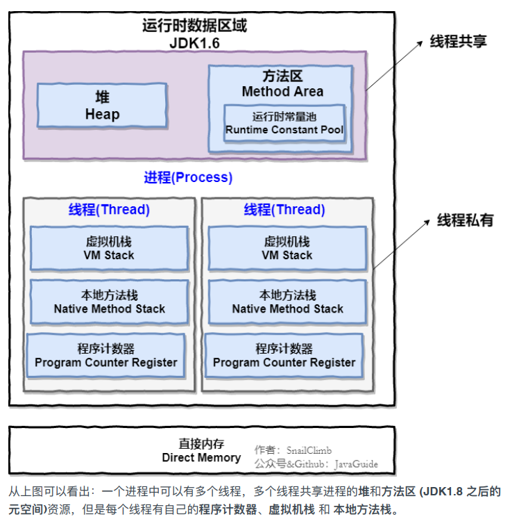

线程是进程划分成的更⼩的运⾏单位。线程和进程最⼤的不同在于基本上各进程是独⽴的，⽽各线程则不⼀定，因为同⼀进程中的线程极有可能会相互影响。线程执⾏开销⼩，但不利于资源的管理和保护；⽽进程正相反。 
程序计数器私有主要是为了线程切换后能恢复到正确的执⾏位置。 为了保证线程中的局部变量不被别的线程访问到，虚拟机栈和本地⽅法栈是线程私有的。

为什么要使用多线程？

从计算机底层来说： 线程可以⽐作是轻量级的进程，是程序执⾏的最⼩单位,线程间的切换和调度的成本远远⼩于进程。另外，多核 CPU 时代意味着多个线程可以同时运⾏，这减少了线程上下⽂切换的开销。
从当代互联⽹发展趋势来说： 现在的系统动不动就要求百万级甚⾄千万级的并发量，⽽多线程并发编程正是开发⾼并发系统的基础，利⽤好多线程机制可以⼤⼤提⾼系统整体的并发能⼒以及性能 。

# 2 什么是多线程的上下文切换？

多线程的上下文切换是指**CPU控制权由一个已经正在运行的线程切换到另外一个就绪并等待获取CPU执行权的线程的过程**。

多线程编程中⼀般线程的个数都⼤于 CPU 核⼼的个数，⽽⼀个 CPU 核⼼在任意时刻只能被⼀个线程使⽤，为了让这些线程都能得到有效执⾏， CPU 采取的策略是为每个线程分配**时间⽚并轮转**的形式。当⼀个线程的时间⽚⽤完的时候就会重新处于就绪状态让给其他线程使⽤，这个过程就属于⼀次上下⽂切换。概括来说就是：当前任务在执⾏完 CPU 时间⽚切换到另⼀个任务之前会先保存⾃⼰的状态，以便下次再切换回这个任务时，可以再加载这个任务的状态。 **任务从保存到再加载的过程就是⼀次上下⽂切换**。

上下⽂切换通常是计算密集型的。也就是说，它需要相当可观的处理器时间，在每秒⼏⼗上百次的切换中，每次切换都需要纳秒量级的时间。所以，上下⽂切换对系统来说意味着消耗⼤量的CPU 时间，事实上，可能是操作系统中时间消耗最⼤的操作。Linux 相⽐与其他操作系统（包括其他类 Unix 系统）有很多的优点，其中有⼀项就是，其上下⽂切换和模式切换的时间消耗⾮常少。 

# 3 什么是线程安全？竞态条件？临界资源？

如果你的代码在多线程下执行和在单线程下执行永远都能获得一样的结果，那么你的代码就是线程安全的。这个问题有值得一提的地方，就是线程安全也是有几个级别的：

- 不可变。像String、Integer、Long这些，都是final类型的类，任何一个线程都改变不了它们的值，要改变除非新创建一个，因此这些不可变对象不需要任何同步手段就可以直接在多线程环境下使用
- 绝对线程安全。不管运行时环境如何，调用者都不需要额外的同步措施。要做到这一点通常需要付出许多额外的代价，Java中标注自己是线程安全的类，实际上绝大多数都不是线程安全的，不过绝对线程安全的类，Java中也有，比方说CopyOnWriteArrayList、CopyOnWriteArraySet
- 相对线程安全。相对线程安全也就是我们通常意义上所说的线程安全，像Vector这种，add、remove方法都是原子操作，不会被打断，但也仅限于此，如果有个线程在遍历某个Vector、有个线程同时在add这个Vector，99%的情况下都会出现ConcurrentModificationException，也就是fail-fast机制。
- 线程非安全。这个就没什么好说的了，ArrayList、LinkedList、HashMap等都是线程非安全的类。

# 4 如何在Java中创建Immutable对象？

通过构造方法初始化所有成员；

对成员变量不要提供setter方法、将所有的成员声明为私有的和final的，这样就不允许直接访问这些成员、

在getter方法中，不要直接返回对象本身，而是返回克隆对象，并返回对象的拷贝。

# 5 说明同步和异步、并行和并发

如果系统中存在临界资源（资源数量少于竞争资源的线程数量的资源），例如正在写的数据以后可能被另一个线程读到，或者正在读的数据可能已经被另一个线程写过了，那么这些数据就必须进行同步存取（数据库操作中的排他锁就是最好的例子）。当应用程序在对象上调用了一个需要花费很长时间来执行的方法，并且不希望让程序等待方法的返回时，就应该使用异步编程，在很多情况下采用异步途径往往更有效率。事实上，所谓的同步就是指阻塞式操作，而异步就是非阻塞式操作。

# 6 编写多线程程序有几种实现方式？区别是什么？

Java 5以前实现多线程有两种实现方法：

一种是继承Thread类；

另一种是实现Runnable接口。 

两种方式都要通过重写run()方法来定义线程的行为，推荐使用后者，因为Java中的继承是单继承，一个类有一个父类，如果继承了Thread类就无法再继承其他类了，显然使用Runnable接口更为灵活。

Java 5以后创建线程还有第三种方式：

实现Callable接口，该接口中的call方法可以在线程执行结束时产生一个返回值，可以抛异常。

# 7 线程的基本状态以及状态之间的关系

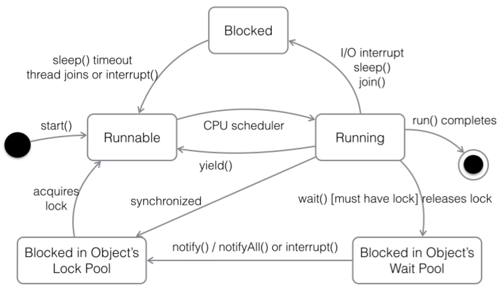

1）Thread t = new Thread()，初始化一个线程，实际上就是一个普通对象，此时他的状态为New

2）t.start(); 线程处于就绪状态（可运行状态），也就是随时等待着运行， 不要小看这个start，这个start决定了他是否是一个真正的线程实例，因为start为其准备了线程环境，你若只是普通调用run方法，那么这就是 一个普通的方法。处在这个时候的线程，都会去竞争CPU资源，所以谁被竞争到了CPU资源，也就是被调度Scheduler，那么他就可以从可运行状态到 真正运行状态。

3）当线程获取到了CPU资源时，线程就从可运行状态到真正运行状态，也就是Running。

4）如果这个线程正在等待客户输入学习，也就是IO异常，等各种阻塞事件，也有可能是自己调用了sleep等阻塞事件，线程就会从运行状态转为阻塞状态，这个状态是不会发生任何事情的！

5）一旦阻塞事件被清除，比如用户已经输入完成，IO流已经关闭，sleep也已经超时等，线程从阻塞状态变为就绪状态，又一次回到了可运行状态，随时与别的线程竞争资源，等待运行！

6）处于运行状态的线程可能会在运行当中遇到了同步方法或同步块，也就是synchronized标记的方法或块，这个时候该线程获到了对象的锁， 其他线程就无法进入该同步方法，那么这些无法执行的线程怎么办呢？他们就都阻塞在这里，等待锁的释放，从新去竞争锁资源，因为只有拥有锁的线程才有资格继 续往下运行，那么这里这些线程就阻塞在锁池（Lock Pool）。

7）一旦被阻塞在锁池的线程竞争到了锁（之前的线程运行完了或之前的线程在内部跑出来异常，或者调用了wait等，都会释放线程的锁），那么这个线 程就会从阻塞状态转为就绪状态，不要以为这个线程会立刻执行，这是不可能的，你要想到线程执行都是要获取到CPU资源的，如果没有操作系统的调度，他们都 没有资格运行！

8）处于运行状态的线程可能会在运行当中进入了同步方法或同步块，这个时候他拥有了对象的锁，至高无上，可是由于当前环境可能导致他没必要继续执 行，所以他会自己让出锁资源让别的线程也有机会继续执行，所以这个线程可能在synchronized内部调用所对象的wait方法，一旦调用，当前线程 让出锁资源，同时自己进入等待池（wait pool）中，直到被别的线程唤醒！如果没有被唤醒就一直会处在等待池当中，受到线程的阻塞，所以这个时候他们一心想要的是被唤醒，因为只有唤醒才有可能 继续运行！

9）一旦被阻塞在等待池的线程被唤醒（可能是某个synchronized的线程调用了notify或notifyAll，也可能是外部调用 interrupt导致内部抛出异常，也会获取到锁），那么这个线程就会从等待池转为锁池当中，继续阻塞，所以不要以为线程被唤醒就会继续运行，这是不可 能的，他们同样需要竞争锁资源。

10）线程运行过程中抛出异常，或者线程实在运行完了，那么线程就结束了，也就是消亡期。运行完了是不可以继续start的，必须从新new 一个线程才能start。那么将是有一个生命周期。

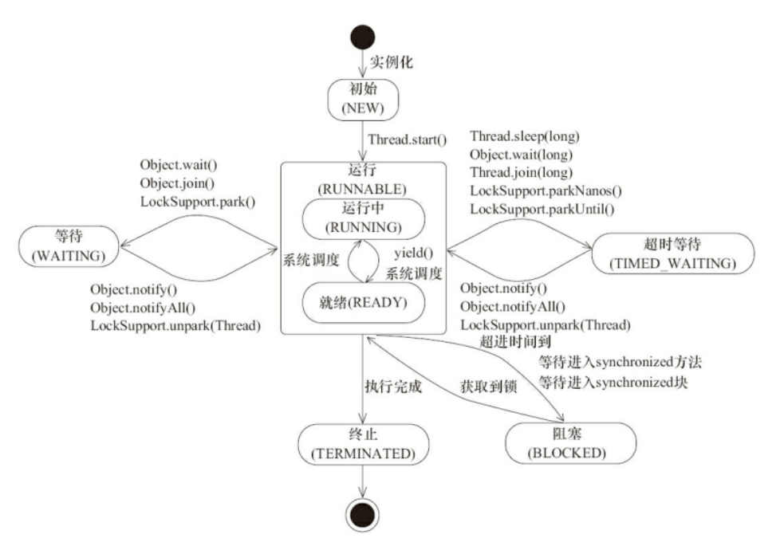

# 8 启动一个线程是调用run()还是start()方法？为什么需要run()和start()方法，我们可以只用run()方法来完成任务吗？

启动一个线程是调用start()方法，使线程所代表的虚拟处理机处于可运行状态，这意味着它可以由JVM 调度并执行，这并不意味着线程就会立即运行。run()方法是线程启动后要进行回调的方法。
我们需要run()&start()这两个方法是因为JVM创建一个单独的线程不同于普通方法的调用，所以这项工作由线程的start方法来完成，start由本地方法实现，需要显示地被调用，使用这俩个方法的另外一个好处是任何一个对象都可以作为线程运行，只要实现了Runnable接口，这就避免因继承了Thread类而造成的Java的多继承问题。

new ⼀个 Thread，线程进⼊了新建状态。调⽤ start() ⽅法，会启动⼀个线程并使线程进⼊了就绪状态，当分配到时间⽚后就可以开始运⾏了。 start() 会执⾏线程的相应准备⼯作，然后⾃动执⾏ run() ⽅法的内容，这是真正的多线程⼯作。 但是，直接执⾏ run() ⽅法，会把 run()⽅法当成⼀个 main 线程下的普通⽅法去执⾏，并不会在某个线程中执⾏它，所以这并不是多线程⼯作。总结： **调⽤ start() ⽅法⽅可启动线程并使线程进⼊就绪状态，直接执⾏ run() ⽅法的话不会以多线程的⽅式执⾏。 **

# 9 sleep方法和wait方法比较

两者都可以暂停线程执行。

sleep()方法（休眠）是线程类（Thread）的静态方法，调用此方法会让当前线程暂停执行指定的时间，将执行机会（CPU）让给其他线程，但是对象的锁依然保持，因此休眠时间结束后会自动恢复（线程回到就绪状态）。

wait()是Object类的方法，调用对象的wait()方法导致当前线程放弃对象的锁（线程暂停执行），进入对象的等待池（wait pool），只有调用对象的notify()方法（或notifyAll()方法）时才能唤醒等待池中的线程进入等锁池（lock pool），如果线程重新获得对象的锁就可以进入就绪状态。

wait()需要在同步块内调用，而 sleep 可以在任何地方使用。sleep 必须捕获异常，而 wait  不需要捕获异常。
在 sleep 的过程中过程中有可能被其他对象调用它的 interrupt() ,产生 InterruptedException 异常，如果你的程序不捕获这个异常，线程就会异常终止，进入 TERMINATED 状态，如果你的程序捕获了这个异常，那么程序就会继续执行catch语句块(可能还有 finally 语句块)以及以后的代码。注意 sleep() 方法是一个静态方法，也就是说他只对当前对象有效，通过 t.sleep() 让t对象进入 sleep ，这样的做法是错误的，它只会是使当前线程被 sleep 而不是 t 线程
wait 属于 Object 的成员方法，一旦一个对象调用了wait方法，必须要采用 notify() 和 notifyAll() 方法唤醒该进程;如果线程拥有某个或某些对象的同步锁，那么在调用了 wait() 后，这个线程就会释放它持有的所有同步资源，而不限于这个被调用了 wait() 方法的对象。 wait() 方法也同样会在 wait 的过程中有可能被其他对象调用 interrupt() 方法而产生 。 

# 10 sleep方法和yield方法比较

① sleep()方法给其他线程运行机会时不考虑线程的优先级，因此会给低优先级的线程以运行的机会；yield()方法只会给相同优先级或更高优先级的线程以运行的机会；

② 线程执行sleep()方法后转入阻塞（blocked）状态，而执行yield()方法后转入就绪状态；

③ sleep()方法声明抛出InterruptedException，而yield()方法没有声明任何异常；

④ sleep()方法比yield()方法（跟操作系统CPU调度相关）具有更好的可移植性

# 11 线程运行时发生异常会怎样？

如果异常没有被捕获该线程将会停止执行。

Thread.UncaughtExceptionHandler是用于处理未捕获异常造成线程突然中断情况的一个内嵌接口。当一个未捕获异常将造成线程中断的时候JVM会使用Thread.getUncaughtExceptionHandler()来查询线程的UncaughtExceptionHandler并将线程和异常作为参数传递给handler的uncaughtException()方法进行处理。

# 12 notify和notifyAll有何区别?为何wait()/notify()/notifyAll()方法不在Thread类中而在Object中？

notify()方法不能唤醒某个具体的线程，所以只有一个线程在等待的时候它才有用武之地。而notifyAll()唤醒所有线程并允许他们争夺锁确保了至少有一个线程能继续运行。

JAVA提供的锁是对象级的而不是线程级的，每个对象都有锁，通过线程获得。如果线程需要等待某些锁那么调用对象中的wait()方法就有意义了。如果wait()方法定义在Thread类中，线程正在等待的是哪个锁就不明显了。简单的说，由于wait，notify和notifyAll都是锁级别的操作，所以把他们定义在Object类中因为锁属于对象。

# 13 为什么wait和notify方法要在同步块中调用？

主要是因为Java API强制要求这样做，如果你不这么做，你的代码会抛出IllegalMonitorStateException异常。还有一个原因是为了避免wait和notify之间产生竞态条件。因为锁定的目标是对象而非线程，而线程并不知道其他等待该锁的线程。

# 14 什么是线程死锁？如何检测死锁？如何避免死锁？手写一个死锁demo？
多线程由于相互竞争资源而造成的一种僵局称为死锁。产⽣死锁必须具备以下四个条件：

1. 互斥条件：该资源任意⼀个时刻只由⼀个线程占⽤。
2. 请求与保持条件：⼀个进程因请求资源⽽阻塞时，对已获得的资源保持不放。
3. 不剥夺条件:线程已获得的资源在末使⽤完之前不能被其他线程强⾏剥夺，只有⾃⼰使⽤完毕后才释放资源。
4. 循环等待条件:若⼲进程之间形成⼀种头尾相接的循环等待资源关系。
```java
public class DeadLockDemo {
    private static Object resource1 = new Object();//资源 1
    private static Object resource2 = new Object();//资源 2
    public static void main(String[] args) {
        new Thread(() -> {
            synchronized (resource1) {
                System.out.println(Thread.currentThread() + "get resource1");
                try {
                    Thread.sleep(1000);
                } catch (InterruptedException e) {
                    e.printStackTrace();
                }
                System.out.println(Thread.currentThread() + "waiting get esource2");
                synchronized (resource2) {
                    System.out.println(Thread.currentThread() + "get resource2");
                }
            }
        }, "线程 1").start();
        new Thread(() -> {
            synchronized (resource2) {
                System.out.println(Thread.currentThread() + "get resource2");
                try {
                    Thread.sleep(1000);
                } catch (InterruptedException e) {
                    e.printStackTrace();
                }
                System.out.println(Thread.currentThread() + "waiting get  resource1");
                synchronized (resource1) {
                    System.out.println(Thread.currentThread() + "get resource1");
                }
            }
        }, "线程 2").start();
    }
}
```
线程 A 通过 synchronized (resource1) 获得 resource1 的监视器锁，然后通过Thread.sleep(1000); 让线程 A 休眠 1s 为的是让线程 B 得到执⾏然后获取到 resource2 的监视器锁。线程 A 和线程 B 休眠结束了都开始企图请求获取对⽅的资源，然后这两个线程就会陷⼊互相等待的状态，这也就产⽣了死锁。上⾯的例⼦符合产⽣死锁的四个必要条件。 

**如何检测死锁？**

可以使用jdk自带的命令行工具排查：

1. 使用jps查找运行的Java进程：jps -l
2. 使用jstack查看线程堆栈信息：jstack -l  进程id

基本就可以看到死锁的信息。还可以利用图形化工具，比如JConsole。出现线程死锁以后，点击JConsole线程面板的`检测到死锁`按钮，将会看到线程的死锁信息。

**如何避免死锁？**

1. 破坏互斥条件 ：这个条件没有法破坏，因为我们⽤锁本来就是想让他们互斥的（临界资源需要互斥访问）。
2. 破坏请求与保持条件 ：⼀次性申请所有的资源。
3. 破坏不剥夺条件 ：占⽤部分资源的线程进⼀步申请其他资源时，若申请不到，可以主动释放它占有的资源。
4. 破坏循环等待条件 ：靠按序申请资源来预防。按顺序申请资源，释放资源则反序释放，破坏循环等待条件。
```java
// 修改线程二代码
new Thread(() -> {
   synchronized (resource1) {
   System.out.println(Thread.currentThread() + "get resource1");
   try {
      Thread.sleep(1000);
    } catch (InterruptedException e) {
      e.printStackTrace();
    }
    System.out.println(Thread.currentThread() + "waiting get resource2");
    synchronized (resource2) {
         System.out.println(Thread.currentThread() + "get resource2");
    }
  }
}, "线程 2").start();
```
我们分析⼀下上⾯的代码为什么避免了死锁的发⽣?
线程 1 ⾸先获得到 resource1 的监视器锁,这时候线程 2 就获取不到了。然后线程 1 再去获取
resource2 的监视器锁，可以获取到。然后线程 1 释放了对 resource1、 resource2 的监视器锁的
占⽤，线程 2 获取到就可以执⾏了。这样就破坏了破坏循环等待条件，因此避免了死锁。

# 15 JMM

## 15.1 说一下你对Java内存模型（JMM）的理解？

Java内存模型（Java Memory Model，JMM），是一种抽象的模型，被定义出来屏蔽各种硬件和操作系统的内存访问差异，以实现让java程序在各种平台下都能达到一致的并发效果。

JMM定义了线程和主内存之间的抽象关系：线程之间的共享变量存储在`主内存`（Main Memory）中，每个线程都有一个私有的`本地内存`（Local Memory），本地内存中存储了该线程以读/写共享变量的副本。

## 15.2 说说你对原子性、可见性、有序性的理解？

原子性、[有序性](https://www.zhihu.com/search?q=有序性&search_source=Entity&hybrid_search_source=Entity&hybrid_search_extra={"sourceType"%3A"answer"%2C"sourceId"%3A2309629045})、可见性是并发编程中非常重要的基础概念，JMM的很多技术都是围绕着这三大特性展开。

- **原子性**：原子性指的是一个操作是不可分割、不可中断的，要么全部执行并且执行的过程不会被任何因素打断，要么就全不执行。
- **可见性**：可见性指的是一个线程修改了某一个共享变量的值时，其它线程能够立即知道这个修改。
- **有序性**：有序性指的是对于一个线程的执行代码，从前往后依次执行，单线程下可以认为程序是有序的，但是并发时有可能会发生指令重排。

> 原子性、可见性、有序性都应该怎么保证呢？ 

- 原子性：JMM只能保证基本的原子性，如果要保证一个代码块的原子性，需要使用`synchronized`。
- 可见性：Java是利用`volatile`关键字来保证可见性的，另外，`final`和`synchronized`也能保证可见性。
- 有序性：`synchronized`或者`volatile`都可以保证多线程之间操作的有序性。

## 15.3 那说说什么是指令重排？

在执行程序时，为了提高性能，编译器和处理器常常会对指令做重排序。重排序分3种类型。
1. 编译器优化的重排序。编译器在不改变单线程程序语义的前提下，可以重新安排语句的执行顺序。
2. 指令级并行的重排序。现代处理器采用了指令级并行技术（Instruction-Level Parallelism，ILP）来将多条指令重叠执行。如果不存在数据依赖性，处理器可以改变语句对应 机器指令的执行顺序。
3. 内存系统的重排序。由于处理器使用缓存和读/写缓冲区，这使得加载和存储操作看上去可能是在乱序执行。

## 15.4 指令重排有限制吗？happens-before了解吗？

指令重排也是有一些限制的，有两个规则`happens-before`和`as-if-serial`来约束。

happens-before的定义：

- 如果一个操作happens-before另一个操作，那么第一个操作的执行结果将对第二个操作可见，而且第一个操作的执行顺序排在第二个操作之前。
- 两个操作之间存在happens-before关系，并不意味着Java平台的具体实现必须要按照 happens-before关系指定的顺序来执行。如果重排序之后的执行结果，与按happens-before关系来执行的结果一致，那么这种重排序并不非法

happens-before原则（先行发生原则）：

- 程序次序规则：一个线程内，按照代码顺序，书写在前面的操作先行发生于书写在后面的操作
- 锁定规则：一个unLock操作先行发生于后面对同一个锁额lock操作
- volatile变量规则：对一个变量的写操作先行发生于后面对这个变量的读操作
- 传递规则：如果操作A先行发生于操作B，而操作B又先行发生于操作C，则可以得出操作A先行发生于操作C
- 线程启动规则：Thread对象的start()方法先行发生于此线程的每个一个动作
- 线程中断规则：对线程interrupt()方法的调用先行发生于被中断线程的代码检测到中断事件的发生
- 线程终结规则：线程中所有的操作都先行发生于线程的终止检测，我们可以通过Thread.join()方法结束、Thread.isAlive()的返回值手段检测到线程已经终止执行
- 对象终结规则：一个对象的初始化完成先行发生于他的finalize()方法的开始

## 15.5 as-if-serial又是什么？单线程的程序一定是顺序的吗？

as-if-serial语义的意思是：不管怎么重排序（编译器和处理器为了提高并行度），**单线程程序的执行结果不能被改变**。编译器、runtime和处理器都必须遵守as-if-serial语义。

为了遵守as-if-serial语义，编译器和处理器不会对存在数据依赖关系的操作做重排序，因为这种重排序会改变执行结果。但是，如果操作之间不存在数据依赖关系，这些操作就可能被编译器和处理器重排序。为了具体说明，请看下面计算圆面积的代码示例。

```java
double pi = 3.14;   // A
double r = 1.0;   // B 
double area = pi * r * r;   // C
```

A和C之间存在数据依赖关系，同时B和C之间也存在数据依赖关系。因此在最终执行的指令序列中，C不能被重排序到A和B的前面（C排到A和B的前面，程序的结果将会被改变）。但A和B之间没有数据依赖关系，编译器和处理器可以重排序A和B之间的执行顺序。

单线程程序是按程序的“顺序”来执行的。as- if-serial语义使单线程情况下，我们不需要担心重排序的问题，可见性的问题。

# 16 掌握volatile

https://zhuanlan.zhihu.com/p/466843124

## 16.1 volatile关键字的作用？

volatile关键字的作用主要有两个：
- 多线程主要围绕可见性和原子性两个特性而展开，使用volatile关键字修饰的变量，保证了其在多线程之间的可见性。
- 为了获取更好的性能JVM可能会对指令进行重排序，多线程下可能会出现一些意想不到的问题。使用volatile则会对禁止语义重排序，当然这也一定程度上降低了代码执行效率。

从实践角度而言，volatile的一个重要作用就是和CAS结合，保证了原子性。  只有成员变量才能使用它。

## 16.2 volatile类型变量提供什么保证？
volatile 主要有两方面的作用:

1.避免指令重排

2.可见性保证.

例如，JVM 或者 JIT为了获得更好的性能会对语句重排序，但是 volatile 类型变量即使在没有同步块的情况下赋值也不会与其他语句重排序。

volatile 提供 happens-before 的保证，确保一个线程的修改能对其他线程是可见的。

某些情况下，volatile 还能提供原子性，如读 64 位数据类型，像 long 和 double 都不是原子的(低32位和高32位)，但 volatile 类型的 double 和 long 就是原子的。

## 16.3 可以创建volatile数组吗？
Java 中可以创建 volatile类型数组，不过只是一个指向数组的引用，而不是整个数组。如果改变引用指向的数组，将会受到volatile 的保护，但是如果多个线程同时改变数组的元素，volatile标示符就不能起到之前的保护作用了。

## 16.4 volatile能使得一个非原子操作变成原子操作吗？
一个典型的例子是在类中有一个 long 类型的成员变量。如果你知道该成员变量会被多个线程访问，如计数器、价格等，你最好是将其设置为 volatile。为什么？因为 Java 中读取 long 类型变量不是原子的，需要分成两步，如果一个线程正在修改该 long 变量的值，另一个线程可能只能看到该值的一半（前 32 位）。但是对一个 volatile 型的 long 或 double 变量的读写是原子。

一种实践是用 volatile 修饰 long 和 double 变量，使其能按原子类型来读写。double 和 long 都是64位宽，因此对这两种类型的读是分为两部分的，第一次读取第一个 32 位，然后再读剩下的 32 位，这个过程不是原子的，但 Java 中 volatile 型的 long 或 double 变量的读写是原子的。

volatile 修复符的另一个作用是提供内存屏障（memory barrier），例如在分布式框架中的应用。简单的说，就是当你写一个 volatile 变量之前，Java 内存模型会插入一个写屏障（write barrier），读一个 volatile 变量之前，会插入一个读屏障（read barrier）。意思就是说，在你写一个 volatile 域时，能保证任何线程都能看到你写的值，同时，在写之前，也能保证任何数值的更新对所有线程是可见的，因为内存屏障会将其他所有写的值更新到缓存。

## 16.5 volatile 变量和 atomic 变量有什么不同？
volatile变量可以确保先行关系，即写操作会发生在后续的读操作之前, 但它并不能保证原子性。例如用volatile修饰count变量那么 count++ 操作就不是原子性的。

AtomicInteger类提供的atomic方法可以让这种操作具有原子性如getAndIncrement()方法会原子性的进行增量操作把当前值加一，其它数据类型和引用变量也可以进行相似操作。

## 16.7 volatile原理

volatile主要两个特性，可见性和有序性。

- 可见性是使用lock前缀实现，lock前缀可实现嗅探机制，每个处理器都会有一个嗅探机制，去看自己的工作内存中的数值与主内存中那个的是否一致，不一致，会将自己的工作内存中的数值设置成无效，同时会从主内存中读取数值更新到自己的工作内存中。
- 有序性是通过内存屏障，禁止指令重排，内存屏障还可以强制刷出各种CPU的缓存数据保证可见性

关于原子性，对任意单个volatile变量的读写具有原子性，但volatile++复合操作是不具有原子性的。

为了实现volatile的内存语义，编译器在生成字节码时，会在指令序列中插入内存屏障来禁止特定类型的处理器重排序。

1. 在每个volatile写操作的前面插入一个`StoreStore`屏障
2. 在每个volatile写操作的后面插入一个`StoreLoad`屏障
3. 在每个volatile读操作的后面插入一个`LoadLoad`屏障
4. 在每个volatile读操作的后面插入一个`LoadStore`屏障


## 16.8 volatile和CAS底层实现都用CPU的lock指令，他们有什么不同？

首先lock只是前缀，lock后面一定有跟命令，具体看后面的命令

volatile没有保证原子性，volatile的实现需要内存屏障，由于lock前缀的指令具有内存屏障的效果，这里的lock addl $0x0,(%rsp)是用来作内存屏障使用的。
storeload屏障，完全由下面这些指令实现：__asm__ volatile ("lock; addl $0,0(%%rsp)" : : : "cc", "memory");

lock指令的作用是：在执行lock后面指令时，会设置处理器的LOCK#信号（这个信号会锁定总线，阻止其它CPU通过总线访问内存，直到这些指令执行结束），这条指令的执行变成原子操作，之前的读写请求都不能越过lock指令进行重排，相当于一个内存屏障。

CAS保证原子性，CAS的实现用了lock cmpxchg指令。cmpxchg指令涉及一次内存读和一次内存写，需要lock前缀保证中间不会有其它cpu写这段内存。
lock只是前缀。cas 指定了lock后面的指令必须是交换，volatile lock后面的指令要看编译时的实际情况。CAS给cmpxchg指令加lock前缀，是为了cmpxchg指令在多核处理器情况能保证原子性。

## 16.9 单例模式？为何DCL中需要volatile？

懒汉式、恶汉式、枚举式、内部类、synchronized、DCL

```java
public class Singleton {
    private volatile static Singleton uniqueInstance;
    private Singleton() {
    }
    public static Singleton getUniqueInstance() {
        // 先判断对象是否已经实例过，没有实例化过才进⼊加锁代码
        if (uniqueInstance == null) {
            //类对象加锁
            synchronized (Singleton.class) {
                if (uniqueInstance == null) { // 必要，防止其他线程获得锁后再创建新实例
                    uniqueInstance = new Singleton();
                }
            }
        }
        return uniqueInstance;
    }
}
```

另外，需要注意 uniqueInstance 采⽤ volatile 关键字修饰也是很有必要。uniqueInstance = new Singleton(); 这
段代码其实是分为三步执⾏：

1. 为 uniqueInstance 分配内存空间
2. 初始化 uniqueInstance
3. 将 uniqueInstance 指向分配的内存地址

但是由于 JVM 具有指令重排的特性，执⾏顺序有可能变成 1->3->2。指令重排在单线程环境下不会出现问题，但是在多线程环境下会导致⼀个线程获得还没有初始化的实例。例如，线程 T1 执⾏了 1 和 3，此时 T2 调⽤ getUniqueInstance () 后发现 uniqueInstance 不为空，因此返回uniqueInstance ，但此时 uniqueInstance 还未被初始化。 使⽤ volatile 可以禁⽌ JVM 的指令重排，保证在多线程环境下也能正常运⾏。

# 17 掌握CAS

## 17.1 CAS原理及问题及解决方案？

CAS叫做CompareAndSwap，⽐较并交换，主要是通过处理器的指令来保证操作的原⼦性的。

CAS 指令包含 3 个参数：共享变量的内存地址 A、预期的值 B 和共享变量的新值 C。只有当内存中地址 A 处的值等于 B 时，才能将内存中地址 A 处的值更新为新值 C。作为一条 CPU 指令，CAS 指令本身是能够保证原子性的。

**ABA 问题**

并发环境下，假设初始条件是A，去修改数据时，发现是A就会执行修改。但是看到的虽然是A，中间可能发生了A变B，B又变回A的情况。此时A已经非彼A，数据即使成功修改，也可能有问题。

>  怎么解决ABA问题？  

- 加版本号

每次修改变量，都在这个变量的版本号上加1，这样，刚刚A->B->A，虽然A的值没变，但是它的版本号已经变了，再判断版本号就会发现此时的A已经被改过了。参考乐观锁的版本号，这种做法可以给数据带上了一种实效性的检验。Java提供了AtomicStampReference类，它的compareAndSet方法首先检查当前的对象引用值是否等于预期引用，并且当前印戳（Stamp）标志是否等于预期标志，如果全部相等，则以原子方式将引用值和印戳标志的值更新为给定的更新值。 

**循环性能开销**

自旋CAS，如果一直循环执行，一直不成功，会给CPU带来非常大的执行开销。

>  怎么解决循环性能开销问题？  

在Java中，很多使用自旋CAS的地方，会有一个自旋次数的限制，超过一定次数，就停止自旋。

**只能保证一个变量的原子操作**

CAS 保证的是对一个变量执行操作的原子性，如果对多个变量操作时，CAS 目前无法直接保证操作的原子性的。

>  怎么解决只能保证一个变量的原子操作问题？ 

- 可以考虑改用锁来保证操作的原子性
- 可以考虑合并多个变量，将多个变量封装成一个对象，通过AtomicReference来保证原子性。

## 17.2 Java有哪些保证原子性的方法？如何保证多线程下i++ 结果正确？

- 使用循环原子类，例如AtomicInteger，实现i++原子操作
- 使用juc包下的锁，如ReentrantLock ，对i++操作加锁lock.lock()来实现原子性
- 使用synchronized，对i++操作加锁


## 17.3 介绍下juc包中的原子类？AtomicInteger实现原理？乐观锁？

Atomic 是指⼀个操作是不可中断的。即使多线程⼀起执⾏的时候，⼀个操作⼀旦开始，就不会被其他线程⼲扰 .

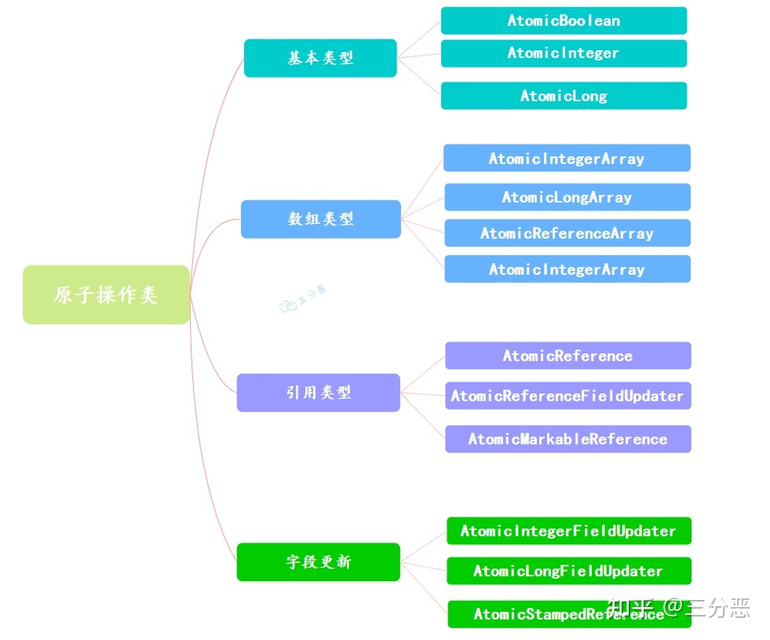

Atomic包里的类基本都是使用Unsafe实现的包装类。

使用原子方式更新基本类型，Atomic包提供了以下3个类：

- AtomicBoolean：原子更新布尔类型。   
- AtomicInteger：原子更新整型。   
- AtomicLong：原子更新长整型。
  

通过原子的方式更新数组里的某个元素，Atomic包提供了以下4个类：

- AtomicIntegerArray：原子更新整型数组里的元素。
  
- AtomicLongArray：原子更新长整型数组里的元素。
  
- AtomicReferenceArray：原子更新引用类型数组里的元素。
  
- AtomicIntegerArray类主要是提供原子的方式更新数组里的整型
  

如果要原子更新多个变量，就需要使用这个原子更新引用类型提供的类。Atomic包提供了以下3个类：

- AtomicReference：原子更新引用类型。
  
- AtomicReferenceFieldUpdater：原子更新引用类型里的字段。
  
- AtomicMarkableReference：原子更新带有标记位的引用类型。可以原子更新一个布尔类型的标记位和引用类型。构造方法是AtomicMarkableReference（V initialRef，boolean initialMark）。
  

如果需原子更新类里的某个字段时，就需要使用原子更新字段类，Atomic包提供了以下3个类进行原子字段更新：

- AtomicIntegerFieldUpdater：原子更新整型的字段的更新器。
- AtomicLongFieldUpdater：原子更新长整型字段的更新器。
- AtomicStampedReference：原子更新带有版本号的引用类型。该类将整数值与引用关联起来，可用于原子的更新数据和数据的版本号，可以解决使用CAS进行原子更新时可能出现的 ABA问题。

## 17.4 JDK8对CAS的优化？

LongAddr

https://mp.weixin.qq.com/s?__biz=MzU0OTk3ODQ3Ng==&mid=2247484070&idx=1&sn=c1d49bce3c9da7fcc7e057d858e21d69&chksm=fba6eaa5ccd163b3a935303f10a54a38f15f3c8364c7c1d489f0b1aa1b2ef293a35c565d2fda&mpshare=1&scene=1&srcid=0608QzOXG2l0z2QyfVaCKqRH%23rd

# 18 掌握ThreadLocal
## 18.1 什么是线程局部变量ThreadLocal？内存泄漏问题？线程池中使用ThreadLocal需要注意什么？
线程局部变量是局限于线程内部的变量，属于线程自身所有，不在多个线程间共享。Java提供ThreadLocal类来支持线程局部变量，是一种实现线程安全的方式。但是在管理环境下（如 web 服务器）使用线程局部变量的时候要特别小心，在这种情况下，工作线程的生命周期比任何应用变量的生命周期都要长。任何线程局部变量一旦在工作完成后没有释放，Java 应用就存在内存泄露的风险。

ThreadLocal 内存泄露问题了解不？

ThreadLocalMap 中使⽤的 key 为 ThreadLocal 的弱引⽤,⽽ value 是强引⽤。所以，如果ThreadLocal 没有被外部强引⽤的情况下，在垃圾回收的时候， key 会被清理掉，⽽ value 不会被清理掉。这样⼀来， ThreadLocalMap 中就会出现 key 为 null 的 Entry。假如我们不做任何措施的话， value 永远⽆法被 GC 回收，这个时候就可能会产⽣内存泄露。

 ThreadLocalMap 实现中已经考虑了这种情况，在调⽤ set() 、 get() 、 remove() ⽅法的时候，会清理掉 key 为 null的记录。使⽤完 ThreadLocal ⽅法后 最好⼿动调⽤ remove() ⽅法 。

**结合线程池使用时会否有问题？**

## 18.2 ThreadLoal的作用是什么？
简单说ThreadLocal就是一种以空间换时间的做法在每个Thread里面维护了一个ThreadLocal.ThreadLocalMap把数据进行隔离，数据不共享，自然就没有线程安全方面的问题了.

## 18.3 ThreadLocal 原理分析?为什么使用弱引用？为什么采用开放地址法解决hash冲突？

ThreadLocal为解决多线程程序的并发问题提供了一种新的思路。ThreadLocal，顾名思义是线程的一个本地化对象，当工作于多线程中的对象使用ThreadLocal维护变量时，ThreadLocal为每个使用该变量的线程分配一个独立的变量副本，所以每一个线程都可以独立的改变自己的副本，而不影响其他线程所对应的副本。从线程的角度看，这个变量就像是线程的本地变量。

ThreadLocal类非常简单好用，只有四个方法，能用上的也就是下面三个方法：

- void set(T value)：设置当前线程的线程局部变量的值。
- T get()：获得当前线程所对应的线程局部变量的值。
- void remove()：删除当前线程中线程局部变量的值。

ThreadLocal是如何做到为每一个线程维护一份独立的变量副本的呢？在ThreadLocal类中有一个Map，键为线程对象，值是其线程对应的变量的副本，自己要模拟实现一个ThreadLocal类其实并不困难，代码如下所示：

```java
import java.util.Collections;
import java.util.HashMap;
import java.util.Map;
public class MyThreadLocal<T> {
    private Map<Thread, T> map = Collections.synchronizedMap(new HashMap<Thread, T>());
    public void set(T newValue) {
        map.put(Thread.currentThread(), newValue);
    }
    public T get() {
        return map.get(Thread.currentThread());
    }
    public void remove() {
        map.remove(Thread.currentThread());
    }
}
```
## 18.4 threadlocal与synchronized区别？


# 19 掌握synchronized

## 19.1 代码中如何使用synchronized关键字？synchronized关键字能修饰构造方法？
synchronized 关键字最主要的三种使⽤⽅式：

1.修饰实例⽅法: 作⽤于当前对象实例加锁，进⼊同步代码前要获得 当前对象实例的锁。

2.修饰静态⽅法: 也就是给当前类加锁，会作⽤于类的所有对象实例 ，进⼊同步代码前要获得 当前 class 的锁。因为静态成员不属于任何⼀个实例对象，是类成员（ static 表明这是该类的⼀个静态资源，不管 new 了多少个对象，只有⼀份）。所以，如果⼀个线程 A 调⽤⼀个实例对象的⾮静态 synchronized ⽅法，⽽线程 B 需要调⽤这个实例对象所属类的静态 synchronized ⽅法，是允许的，不会发⽣互斥现象， 因为访问静态 synchronized ⽅法占⽤的锁是当前类的锁，⽽访问⾮静态 synchronized ⽅法占⽤的锁是当前实例对象锁。  

3.修饰代码块 ：指定加锁对象，对给定对象/类加锁。 synchronized(this|object) 表示进⼊同步代码库前要获得给定对象的锁。 synchronized(类名.class) 表示进⼊同步代码前要获得 当前 class 的锁 。

总结：

synchronized 关键字加到 static 静态⽅法和 synchronized(class) 代码块上都是是给 Class类上锁。
synchronized 关键字加到实例⽅法上是给对象实例上锁。尽量不要使⽤ synchronized(String a) 因为 JVM 中，字符串常量池具有缓存功能！ 

构造⽅法可以使⽤ synchronized 关键字修饰么？

构造⽅法不能使⽤ synchronized 关键字修饰。构造⽅法本身就属于线程安全的，不存在同步的构造⽅法⼀说。 

## 19.2 synchronized底层原理？
synchronized 关键字解决的是多个线程之间访问资源的同步性， synchronized 关键字可以保证被它修饰的⽅法或者代码块在任意时刻只能有⼀个线程执⾏。

 Java 早期版本中， synchronized 属于重量级锁，效率低下。因为监视器锁（monitor）是依赖于底层的操作系统的 Mutex Lock 来实现的， Java线程是映射到操作系统的原⽣线程之上的。如果要挂起或者唤醒⼀个线程，都需要操作系统帮忙完成，⽽操作系统实现线程之间的切换时需要从⽤户态转换到内核态，这个状态间转换时间成本相对较⾼。JDK6对锁的实现引⼊了⼤量的优化，如⾃旋锁、适应性⾃旋锁、锁消除、锁粗化、偏向锁、轻量级锁等技术来减少锁操作的开销。

```java
public class SynchronizedDemo {
  public void method() {
      synchronized (this) {
         System.out.println("synchronized 代码块");
      }
  }
}
```

通过 JDK⾃带的 javap 命令查看 SynchronizedDemo 类的相关字节码信息：⾸先切换到类的对应⽬录执⾏ javac SynchronizedDemo.java 命令⽣成编译后的 .class ⽂件，然后执⾏ javap -c -s -v -l SynchronizedDemo.class 。 

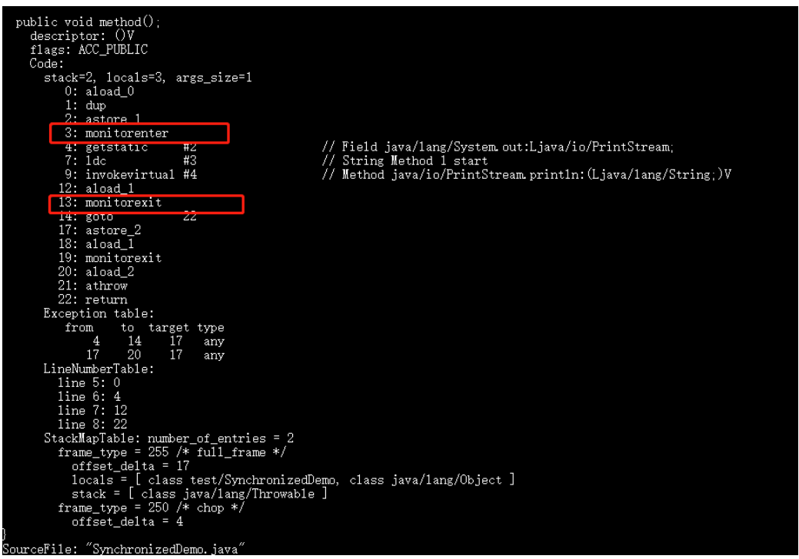
从上⾯我们可以看出：
synchronized同步语句块的实现使⽤的是 monitorenter 和 monitorexit 指令，其中monitorenter 指令指向同步代码块的开始位置， monitorexit 指令则指明同步代码块的结束位置。当执⾏ monitorenter 指令时，线程试图获取锁也就是获取对象监视器 monitor 的持有权。
在 Java 虚拟机(HotSpot)中， Monitor 是基于 C++实现的，由ObjectMonitor实现的。每个对象中都内置了⼀个 ObjectMonitor 对象。另外， wait/notify 等⽅法也依赖于 monitor 对象，这就是为什么只有在同步的块或者⽅法中才能调⽤ wait/notify 等⽅法，否则会抛出 java.lang.IllegalMonitorStateException 的异常的原因。

在执⾏ monitorenter 时，会尝试获取对象的锁，如果锁的计数器为 0 则表示锁可以被获取，获取后将锁计数器设为 1 也就是加 1。在执⾏ monitorexit 指令后，将锁计数器设为 0，表明锁被释放。如果获取对象锁失败，那当前线程就要阻塞等待，直到锁被另外⼀个线程释放为⽌。

```java
public class SynchronizedDemo2 {
    public synchronized void method() {
       System.out.println("synchronized ⽅法");
    }
}
```

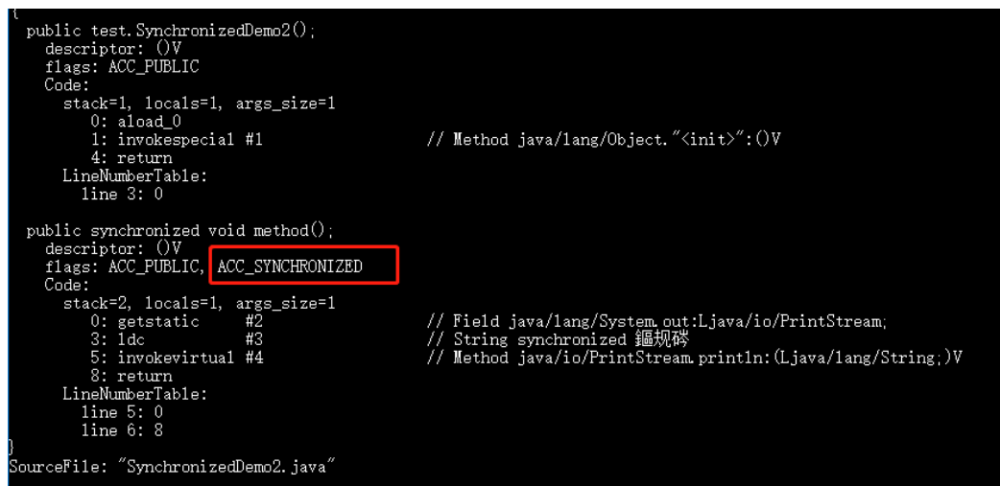

synchronized 修饰的⽅法并没有 monitorenter 指令和 monitorexit 指令，取得代之的是ACC_SYNCHRONIZED 标识，该标识指明了该⽅法是⼀个同步⽅法。 JVM 通过ACC_SYNCHRONIZED 访问标志来辨别⼀个⽅法是否声明为同步⽅法，从⽽执⾏相应的同步调⽤。 

> synchronized锁住的是什么呢？ 

monitorenter、monitorexit或者ACC_SYNCHRONIZED都是**基于Monitor实现**的。实例对象结构里有对象头，对象头里面有一块结构叫Mark Word，Mark Word指针指向了**monitor**。所谓的Monitor其实是一种**同步工具**，也可以说是一种**同步机制**。在Java[虚拟机](https://www.zhihu.com/search?q=虚拟机&search_source=Entity&hybrid_search_source=Entity&hybrid_search_extra={"sourceType"%3A"answer"%2C"sourceId"%3A2309629045})（HotSpot）中，Monitor是由**ObjectMonitor实现**的，可以叫做内部锁，或者Monitor锁。

ObjectMonitor的工作原理：

- ObjectMonitor有两个队列：_WaitSet、_EntryList，用来保存ObjectWaiter 对象列表。
- _owner，获取 Monitor 对象的线程进入 _owner 区时， _count + 1。如果线程调用了 wait() 方法，此时会释放 Monitor 对象， _owner 恢复为空， _count - 1。同时该等待线程进入 _WaitSet 中，等待被唤醒。
```
ObjectMonitor() {
    _header       = NULL;
    _count        = 0; // 记录线程获取锁的次数
    _waiters      = 0,
    _recursions   = 0;  //锁的重入次数
    _object       = NULL;
    _owner        = NULL;  // 指向持有ObjectMonitor对象的线程
    _WaitSet      = NULL;  // 处于wait状态的线程，会被加入到_WaitSet
    _WaitSetLock  = 0 ;
    _Responsible  = NULL ;
    _succ         = NULL ;
    _cxq          = NULL ;
    FreeNext      = NULL ;
    _EntryList    = NULL ;  // 处于等待锁block状态的线程，会被加入到该列表
    _SpinFreq     = 0 ;
    _SpinClock    = 0 ;
    OwnerIsThread = 0 ;
  }
```

所以我们就知道了，同步是锁住的什么东西：

- monitorenter，在判断拥有同步标识 ACC_SYNCHRONIZED 抢先进入此方法的线程会优先拥有 Monitor 的 owner ，此时计数器 +1。
- monitorexit，当执行完退出后，计数器 -1，归 0 后被其他进入的线程获得。

## 19.3 除了原子性，synchronized可见性，有序性，可重入性怎么实现？

>  synchronized怎么保证可见性？ 

- 线程加锁前，将清空工作内存中共享变量的值，从而使用共享变量时需要从主内存中重新读取最新的值。
- 线程加锁后，其它线程无法获取主内存中的共享变量。
- 线程解锁前，必须把共享变量的最新值刷新到主内存中。

>  synchronized怎么保证有序性？ 

synchronized同步的代码块，具有排他性，一次只能被一个线程拥有，所以synchronized保证同一时刻，代码是单线程执行的。因为as-if-serial语义的存在，单线程的程序能保证最终结果是有序的，但是不保证不会指令重排。所以synchronized保证的有序是执行结果的有序性，而不是防止指令重排的有序性。

> synchronized怎么实现可重入的呢？ 

synchronized 是可重入锁，是因为 synchronized 锁对象有个计数器，会随着线程获取锁后 +1 计数，当线程执行完毕后 -1，直到清零释放锁。

## 19.4 synchronized锁升级过程？

了解锁升级，得先知道不同锁的状态是什么样的。这个状态指的是什么呢？

Java对象头里，有一块结构，叫`Mark Word`标记字段，这块结构会随着锁的状态变化而变化。64 位虚拟机 Mark Word 是 64bit，我们来看看它的状态变化：
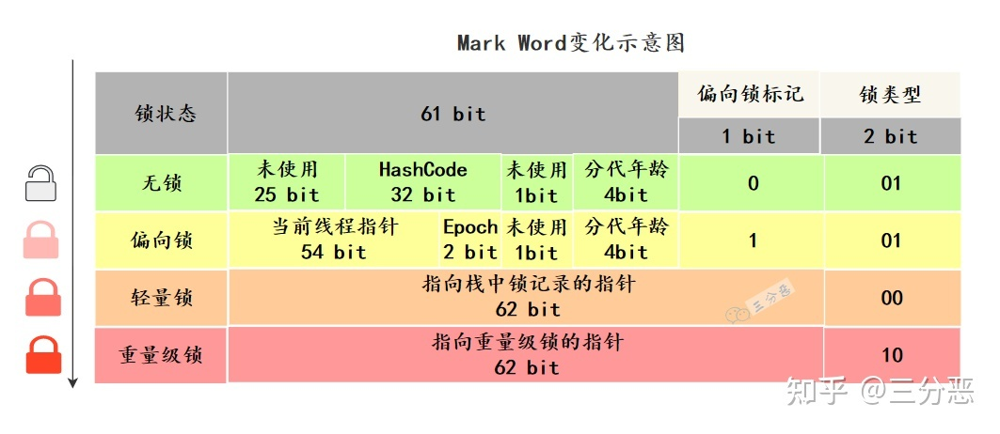Mark Word存储对象自身的运行数据，如**哈希码、GC分代年龄、锁状态标志、偏向时间戳（Epoch）** 等。

>  synchronized做了哪些优化？ 

在JDK6之前，synchronized的实现直接调用ObjectMonitor的enter和exit，这种锁被称之为**重量级锁**。从JDK6开始，HotSpot虚拟机开发团队对Java中的锁进行优化，如增加了适应性自旋、锁消除、锁粗化、轻量级锁和偏向锁等优化策略，提升了synchronized的性能。

- 偏向锁：在无竞争的情况下，只是在Mark Word里存储当前线程指针，CAS操作都不做。 
- 轻量级锁：在没有多线程竞争时，相对重量级锁，减少操作系统互斥量带来的性能消耗。但是，如果存在锁竞争，除了互斥量本身开销，还额外有CAS操作的开销。 
- 自旋锁：减少不必要的CPU上下文切换。在轻量级锁升级为重量级锁时，就使用了自旋加锁的方式 
- 锁粗化：将多个连续的加锁、解锁操作连接在一起，扩展成一个范围更大的锁。 
- 锁消除：虚拟机即时编译器在运行时，对一些代码上要求同步，但是被检测到不可能存在共享数据竞争的锁进行消除。

> 锁升级的过程是什么样的？

锁升级方向：无锁-->偏向锁---> 轻量级锁---->重量级锁，这个方向基本上是不可逆的。

我们看一下升级的过程：

**偏向锁：**

**偏向锁的获取：**

1. 判断是否为可偏向状态--MarkWord中锁标志是否为‘01’，是否偏向锁是否为‘1’
2. 如果是可偏向状态，则查看线程ID是否为当前线程，如果是，则进入步骤'5'，否则进入步骤‘3’
3. 通过CAS操作竞争锁，如果竞争成功，则将MarkWord中线程ID设置为当前线程ID，然后执行‘5’；竞争失败，则执行‘4’
4. CAS获取偏向锁失败表示有竞争。当达到safepoint时获得偏向锁的线程被挂起，**偏向锁升级为轻量级锁**，然后被阻塞在安全点的线程继续往下执行同步代码块
5. 执行同步代码

**偏向锁的撤销：**

1. 偏向锁不会主动释放(撤销)，只有遇到其他线程竞争时才会执行撤销，由于撤销需要知道当前持有该偏向锁的线程栈状态，因此要等到safepoint时执行，此时持有该偏向锁的线程（T）有‘2’，‘3’两种情况；

2. 撤销----T线程已经退出同步代码块，或者已经不再存活，则直接撤销偏向锁，变成无锁状态----该状态达到阈值20则执行批量重偏向

3. 升级----T线程还在同步代码块中，则将T线程的偏向锁**升级为轻量级锁**，当前线程执行轻量级锁状态下的锁获取步骤----该状态达到阈值40则执行批量撤销

**轻量级锁：**

**轻量级锁的获取：**

1. 进行加锁操作时，jvm会判断是否已经时重量级锁，如果不是，则会在当前线程栈帧中划出一块空间，作为该锁的锁记录，并且将锁对象MarkWord复制到该锁记录中
2. 复制成功之后，jvm使用CAS操作将对象头MarkWord更新为指向锁记录的指针，并将锁记录里的owner指针指向对象头的MarkWord。如果成功，则执行‘3’，否则执行‘4’
3. 更新成功，则当前线程持有该对象锁，并且对象MarkWord锁标志设置为‘00’，即表示此对象处于轻量级锁状态
4. 更新失败，jvm先检查对象MarkWord是否指向当前线程栈帧中的锁记录，如果是则执行‘5’，否则执行‘4’
5. 表示锁重入；然后当前线程栈帧中增加一个锁记录第一部分（Displaced Mark Word）为null，并指向Mark Word的锁对象，起到一个重入计数器的作用。
6. 表示该锁对象已经被其他线程抢占，则进行**自旋等待**（默认10次），等待次数达到阈值仍未获取到锁，则**升级为重量级锁**

简单版本升级过程

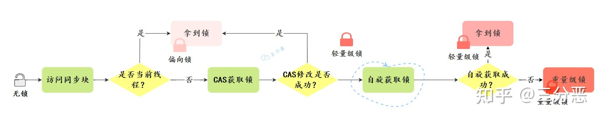

完整版升级过程

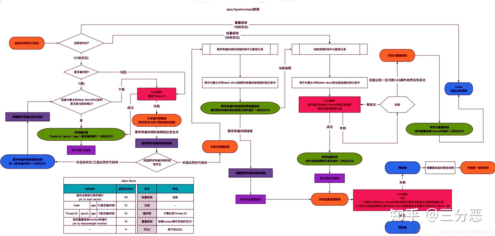

## 19.5 synchronized与ReentrantLock的区别？与volatile的区别？

> synchronized与ReentrantLock的区别

可以从锁的实现、功能特点、性能等几个维度去回答这个问题：

- **锁的实现：** synchronized是Java语言的关键字，基于JVM实现。而ReentrantLock是基于JDK的API层面实现的（一般是lock()和unlock()方法配合try/finally 语句块来完成。）

- **性能：** 在JDK1.6锁优化以前，synchronized的性能比ReenTrantLock差很多。但是JDK6开始，增加了适应性自旋、锁消除等，两者性能就差不多了。

- **功能特点：** ReentrantLock 比 synchronized 增加了一些高级功能，如等待可中断、可实现公平锁、可实现选择性通知、尝试获取锁。 

  - ReentrantLock提供了一种能够中断等待锁的线程的机制，通过lock.lockInterruptibly()来实现这个机制
  - ReentrantLock可以指定是公平锁还是非公平锁。而synchronized只能是非公平锁。所谓的公平锁就是先等待的线程先获得锁。
  - synchronized与wait()和notify()/notifyAll()方法结合实现等待/通知机制，ReentrantLock类借助Condition接口与newCondition()方法实现。
  - ReentrantLock需要手工声明来加锁和释放锁，一般跟finally配合释放锁。synchronized不用手动释放。

> synchronized与volatile的区别

volatile 是线程同步的轻量级实现，所以 volatile 性能⽐synchronized好。但是 volatile只能⽤于变量⽽ synchronized可以修饰⽅法以及代码块。

volatile 能保证数据的可⻅性，但不能保证数据的原⼦性。 synchronized 关键字两者都能保证。

volatile主要⽤于解决变量在多个线程之间的可⻅性，⽽synchronized解决的是多个线程之间访问资源的同步性。 

volatile常结合CAS实现无锁编程。


# 20 掌握AQS 

## 20.1 介绍下AQS原理

AQS 是⼀个⽤来构建锁和同步器的框架，使⽤ AQS 能简单且⾼效地构造出应⽤⼴泛的⼤量的同步器，⽐如我们提到的 ReentrantLock ， Semaphore ，其他的诸如ReentrantReadWriteLock ， SynchronousQueue ， FutureTask 等等皆是基于 AQS 的。我们⾃⼰也能利⽤ AQS ⾮常轻松容易地构造出符合我们⾃⼰需求的同步器。 

- AQS 使用一个 volatile 修饰的 int 类型的成员变量 state 来表示同步状态，修改同步状态成功即为获得锁，volatile 保证了变量在多线程之间的可见性，修改 State 值时通过 CAS 机制来保证修改的原子性。获取state的方式分为两种，独占方式和共享方式，一个线程使用独占方式获取了资源，其它线程就会在获取失败后被阻塞。一个线程使用共享方式获取了资源，另外一个线程还可以通过CAS的方式进行获取。

- 如果共享资源被占用，需要一定的阻塞等待唤醒机制来保证锁的分配，AQS 中会将竞争共享资源失败的线程添加到一个变体的 CLH 队列中。AQS是基于一个FIFO的双向队列，其内部定义了一个节点类Node，Node 节点内部的 SHARED 用来标记该线程是获取共享资源时被阻挂起后放入AQS 队列的， EXCLUSIVE 用来标记线程是 取独占资源时被挂起后放入AQS 队列。

AQS 核⼼思想是，如果被请求的共享资源空闲，则将当前请求资源的线程设置为有效的⼯作线程，并且将共享资源设置为锁定状态。如果被请求的共享资源被占⽤，那么就需要⼀套线程阻塞等待以及被唤醒时锁分配的机制，这个机制 AQS 是⽤ CLH 队列锁实现的，即将暂时获取不到锁的线程加⼊到队列中 。

CLH(Craig,Landin,and Hagersten)队列是⼀个虚拟的双向队列（虚拟的双向队列即不存在队列实例，仅存在结点之间的关联关系）。 AQS 是将每条请求共享资源的线程封装成⼀个CLH 锁队列的⼀个结点（Node）来实现锁的分配。 申请线程只在本地变量上自旋，**它不断轮询前驱的状态**，如果发现 **前驱节点释放了锁就结束自旋**

AQS 中的 CLH 变体等待队列拥有以下特性：

- AQS 中队列是个双向链表，也是 FIFO 先进先出的特性
- 通过 Head、Tail 头尾两个节点来组成队列结构，通过 volatile 修饰保证可见性
- Head 指向节点为已获得锁的节点，是一个虚拟节点，节点本身不持有具体线程
- 获取不到同步状态，会将节点进行自旋获取锁，自旋一定次数失败后将线程阻塞，相对于 CLH 队列性能较好

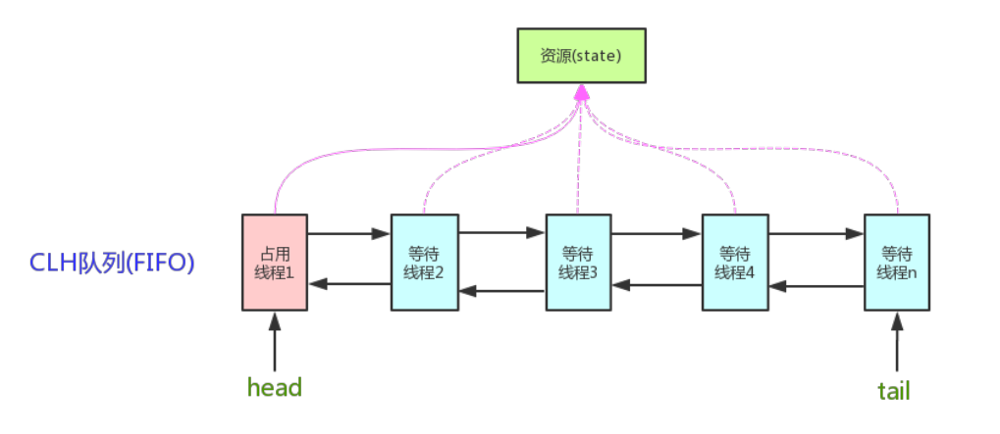

AQS 使⽤⼀个 int 成员变量来表示同步状态，通过内置的 FIFO 队列来完成获取资源线程的排队⼯作。 AQS 使⽤ CAS 对该同步状态进⾏原⼦操作实现对其值的修改。状态信息通过 protected 类型的 getState， setState， compareAndSetState 进⾏操作。
```java
private volatile int state;//共享变量，使⽤volatile修饰保证线程可⻅性
//返回同步状态的当前值
protected final int getState() {
   return state;
}
// 设置同步状态的值
protected final void setState(int newState) {
    state = newState;
}
//原⼦地（CAS操作）将同步状态值设置为给定值update如果当前同步状态的值等于expect（期望值）
protected final boolean compareAndSetState(int expect, int update) {
    return unsafe.compareAndSwapInt(this, stateOffset, expect, update);
}
```
AQS 对资源的共享⽅式:

Exclusive（独占）：只有⼀个线程能执⾏，如 ReentrantLock 。⼜可分为公平锁和⾮公平锁：
公平锁：按照线程在队列中的排队顺序，先到者先拿到锁；⾮公平锁：当线程要获取锁时，⽆视队列顺序直接去抢锁，谁抢到就是谁的。

Share（共享）：多个线程可同时执⾏，如CountDownLatch 、Semaphore 、CyclicBarrier 、ReadWriteLock 我们都会在后⾯讲到。ReentrantReadWriteLock 可以看成是组合式，因为 ReentrantReadWriteLock 也就是读写锁允许多个线程同时对某⼀资源进⾏读。

不同的⾃定义同步器争⽤共享资源的⽅式也不同。⾃定义同步器在实现时只需要实现共享资源state 的获取与释放⽅式即可，⾄于具体线程等待队列的维护（如获取资源失败⼊队/唤醒出队等）， AQS 已经在顶层实现好。
AQS 同步器的设计是基于模板⽅法模式的，如果需要⾃定义同步器⼀般的⽅式是这样：

1. 使⽤者继承 AbstractQueuedSynchronizer 并重写指定的⽅法。（对于共享资源 state 的获取和释放）
2. 将 AQS 组合在⾃定义同步组件的实现中，并调⽤其模板⽅法，⽽这些模板⽅法会调⽤使⽤者重写的⽅法。

⾃定义同步器时需要重写下⾯⼏个 AQS 提供的模板⽅法：
```java
isHeldExclusively()//该线程是否正在独占资源。只有⽤到condition才需要去实现它。
tryAcquire(int)//独占⽅式。尝试获取资源，成功则返回true，失败则返回false。
tryRelease(int)//独占⽅式。尝试释放资源，成功则返回true，失败则返回false。
tryAcquireShared(int)//共享⽅式。尝试获取资源。负数表示失败； 0表示成功，但没有剩余可⽤资源；正数表示成功，且有剩余资源。
tryReleaseShared(int)//共享⽅式。尝试释放资源，成功则返回true，失败则返回false。
```
默认情况下，每个⽅法都抛出 UnsupportedOperationException 。 这些⽅法的实现必须是内部线程安全的，并且通常应该简短⽽不是阻塞。 AQS 类中的其他⽅法都是 final ，所以⽆法被其他类使⽤，只有这⼏个⽅法可以被其他类使⽤。

以 ReentrantLock 为例， state 初始化为 0，表示未锁定状态。 A 线程 lock()时，会调⽤tryAcquire()独占该锁并将 state+1。此后，其他线程再 tryAcquire()时就会失败，直到 A 线程unlock()到 state=0（即释放锁）为⽌，其它线程才有机会获取该锁。当然，释放锁之前， A 线程⾃⼰是可以重复获取此锁的（state 会累加），这就是可重⼊的概念。但要注意，获取多少次就要释放多么次，这样才能保证 state 是能回到零态的。

再以 CountDownLatch 以例，任务分为 N 个⼦线程去执⾏， state 也初始化为 N（注意 N 要与线程个数⼀致）。这 N 个⼦线程是并⾏执⾏的，每个⼦线程执⾏完后 countDown() ⼀次， state 会CAS(Compare and Swap)减 1。等到所有⼦线程都执⾏完后(即 state=0)，会 unpark()主调⽤线程，然后主调⽤线程就会从 await() 函数返回，继续后余动作。

⼀般来说，⾃定义同步器要么是独占⽅法，要么是共享⽅式，他们也只需实现 tryAcquiretryRelease 、 tryAcquireShared-tryReleaseShared 中的⼀种即可。但 AQS 也⽀持⾃定义同步器同时实现独占和共享两种⽅式，如 ReentrantReadWriteLock 。

推荐两篇 AQS 原理和相关源码分析的⽂章：
http://www.cnblogs.com/waterystone/p/4920797.html
https://www.cnblogs.com/chengxiao/archive/2017/07/24/7141160.html

AQS 组件总结

Semaphore (信号量)-允许多个线程同时访问： synchronized 和 ReentrantLock 都是⼀次只允许⼀个线程访问某个资源， Semaphore (信号量)可以指定多个线程同时访问某个资源。

CountDownLatch （倒计时器）： CountDownLatch 是⼀个同步⼯具类，⽤来协调多个线程之间的同步。这个⼯具通常⽤来控制线程等待，它可以让某⼀个线程等待直到倒计时结束，再开始执⾏。

CyclicBarrier (循环栅栏)： CyclicBarrier 和 CountDownLatch 类似，它也可以实现线程间的技术等待，但是它的功能⽐ CountDownLatch 更加复杂和强⼤。主要应⽤场景和CountDownLatch 类似。 CyclicBarrier 的字⾯意思是可循环使⽤（ Cyclic ）的屏障（ Barrier ）。它要做的事情是，让⼀组线程到达⼀个屏障（时被阻塞，直到最后⼀个线程到达屏障时，屏障才会开⻔，所有被屏障拦截的线程才会继续⼲活。 CyclicBarrier 默认的构造⽅法是 CyclicBarrier(int parties) ，其参数表示屏障拦截的线程数量，每个线程调⽤ await() ⽅法告诉 CyclicBarrier 我已经到达了屏障，然后当前线程被阻塞。

## 20.3 ReentrantLock底层原理？公平锁和非公平锁？可重入锁？

ReentrantLock 是可重入的独占锁，只能有一个线程可以获取该锁，其它获取该锁的线程会被阻塞而被放入该锁的阻塞队列里面。

**公平锁 FairSync**

1. 公平锁是指多个线程按照申请锁的顺序来获取锁，线程直接进入队列中排队，队列中的第一个线程才能获得锁
2. 公平锁的优点是等待锁的线程不会饿死。缺点是整体吞吐效率相对非公平锁要低，等待队列中除第一个线程以外的所有线程都会阻塞，CPU 唤醒阻塞线程的开销比非公平锁大

**非公平锁 NonfairSync**

- 非公平锁是多个线程加锁时直接尝试获取锁，获取不到才会到等待队列的队尾等待。但如果此时锁刚好可用，那么这个线程可以无需阻塞直接获取到锁
- 非公平锁的优点是可以减少唤起线程的开销，整体的吞吐效率高，因为线程有几率不阻塞直接获得锁，CPU 不必唤醒所有线程。缺点是处于等待队列中的线程可能会饿死，或者等很久才会获得锁

**非公平锁和公平锁的两处不同：**

1. 非公平锁在调用 lock 后，首先就会调用 CAS 进行一次抢锁，如果这个时候恰巧锁没有被占用，那么直接就获取到锁返回了。
2. 非公平锁在 CAS 失败后，和公平锁一样都会进入到 tryAcquire 方法，在 tryAcquire 方法中，如果发现锁这个时候被释放了（state == 0），非公平锁会直接 CAS 抢锁，但是公平锁会判断等待队列是否有线程处于等待状态，如果有则不去抢锁，乖乖排到后面。

相对来说，非公平锁会有更好的性能，因为它的吞吐量比较大。当然，非公平锁让获取锁的时间变得更加不确定，可能会导致在阻塞队列中的线程长期处于饥饿状态。

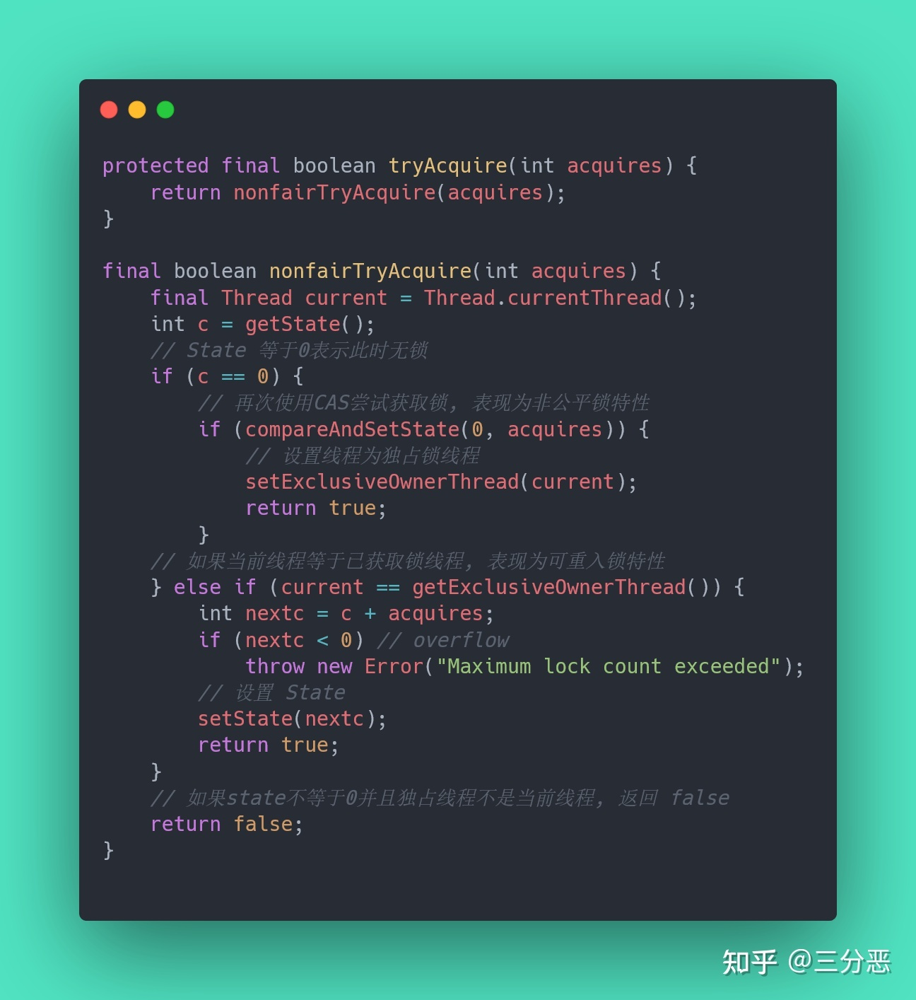

默认创建的对象lock()的时候：

- 如果锁当前没有被其它线程占用，并且当前线程之前没有获取过该锁，则当前线程会获取到该锁，然后设置当前锁的拥有者为当前线程，并设置 AQS 的状态值为1 ，然后直接返回。如果当前线程之前己经获取过该锁，则这次只是简单地把 AQS 的状态值加1后返回。
- 如果该锁己经被其他线程持有，非公平锁会尝试去获取锁，获取失败的话，则调用该方法线程会被放入 AQS 队列阻塞挂起。

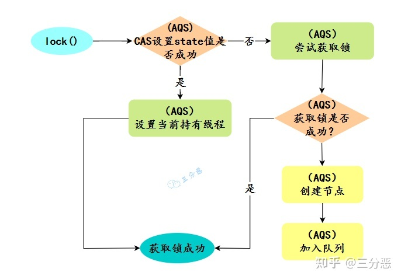

# 21 掌握线程池ThreadPool

## 21.1 为何要使用线程池threadpool？
避免线程膨胀，创建线程开销大基于重复利用的考虑。池化技术的思想主要是为了减少每次获取资源的消耗，提⾼对资源的利⽤率 。使⽤线程池的好处：

降低资源消耗。通过重复利⽤已创建的线程降低线程创建和销毁造成的消耗。

提⾼响应速度。当任务到达时，任务可以不需要的等到线程创建就能⽴即执⾏。

提⾼线程的可管理性。线程是稀缺资源，如果⽆限制的创建，不仅会消耗系统资源，还会降低系统的稳定性，使⽤线程池可以进⾏统⼀的分配，调优和监控。 

## 21.2 简述线程池的工作原理？线程池的状态及线程池中线程状态？
```java
// 存放线程池的运⾏状态 (runState) 和线程池内有效线程的数量 (workerCount)
private final AtomicInteger ctl = new AtomicInteger(ctlOf(RUNNING, 0));
private static int workerCountOf(int c) {
   return c & CAPACITY;
}
private final BlockingQueue<Runnable> workQueue;
public void execute(Runnable command) {
   // 如果任务为null，则抛出异常。
   if (command == null)
      throw new NullPointerException();
   // ctl 中保存的线程池当前的⼀些状态信息
   int c = ctl.get();
   // 下⾯会涉及到3步操作
   // 1.⾸先判断当前线程池中之⾏的任务数量是否⼩于 corePoolSize
   // 如果⼩于的话，通过addWorker(command, true)新建⼀个线程，并将任务(command)
   // 添加到该线程中；然后，启动该线程从⽽执⾏任务。
   if (workerCountOf(c) < corePoolSize) {
      if (addWorker(command, true))  return;
      c = ctl.get();
    }
   // 2.如果当前之⾏的任务数量⼤于等于 corePoolSize 的时候就会⾛到这⾥
   // 通过 isRunning ⽅法判断线程池状态，线程池处于 RUNNING 状态才会被并且队列可以
   // 加⼊任务，该任务才会被加⼊进去
   if (isRunning(c) && workQueue.offer(command)) {
      int recheck = ctl.get();
     // 再次获取线程池状态，如果线程池状态不是 RUNNING 状态就需要从任务队列中移除任务，并尝试判断线程是  否全部执⾏完毕。同时执⾏拒绝策略。
   if (!isRunning(recheck) && remove(command)) reject(command);
     // 如果当前线程池为空就新创建⼀个线程并执⾏。
     else if (workerCountOf(recheck) == 0) addWorker(null, false);
    }
    //3. 通过addWorker(command, false)新建⼀个线程，并将任务(command)添加到该线程中；然后，启动该线程从⽽执⾏任务。
    //如果addWorker(command, false)执⾏失败，则通过reject()执⾏相应的拒绝策略的内容。
    else if (!addWorker(command, false)) reject(command);
}
```

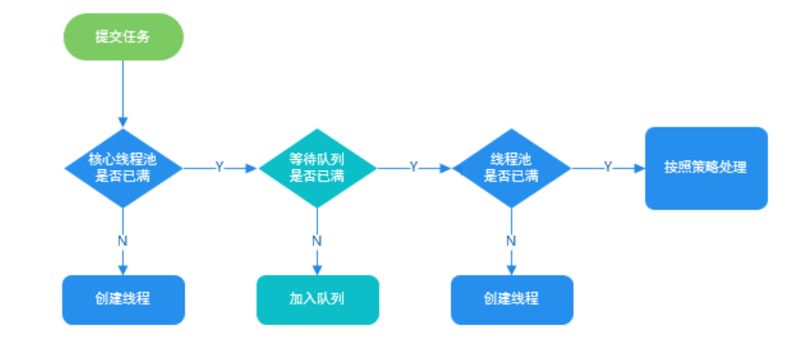

线程池状态：

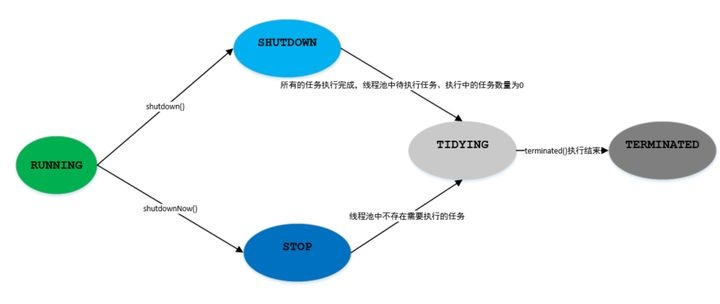

- RUNNING：线程池的初始化状态，可以添加待执行的任务。
- SHUTDOWN：线程池处于待关闭状态，不接收新任务仅处理已经接收的任务。
- STOP：线程池立即关闭，不接收新的任务，放弃缓存队列中的任务并且中断正在处理的任务。
- TIDYING：线程池自主整理状态，调用 terminated() 方法进行线程池整理。
- TERMINATED：线程池终止状态。

池中线程状态：运行、空闲

**线程池的管理过程**：首先创建线程池，然后根据任务的数量逐步将线程增大到corePoolSize数量，如果此时仍有任务增加，则放置到workQueue中，直到workQueue爆满为止，然后继续增加池中的线程数量，最终到达maximumPoolSize，那如果此时还有任务要增加进来，就需要拒绝策略handler来处理了，或者丢弃新任务或者挤占已有任务或者抛异常。当一个线程完成任务时，它会从队列中取下一个任务来执行。当一个线程无事可做，超过一定的时间（keepAliveTime）时，线程池会判断，如果当前运行的线程数大于 corePoolSize，那么这个线程就被停掉。所以线程池的所有任务完成后，它最终会收缩到 corePoolSize 的大小。

## 21.3 ThreadPoolExector核心参数？如何创建线程池？
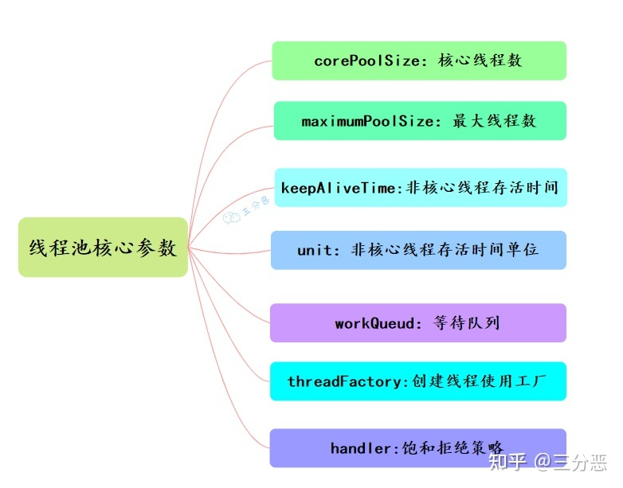

ThreadPoolExecutor 构造函数重要参数分析：

**corePoolSize** : 核⼼线程数线程数定义了最⼩可以同时运⾏的线程数量。

**maximumPoolSize** : 当队列中存放的任务达到队列容量的时候，当前可以同时运⾏的线程数量变为最⼤线程数。

**workQueue** : 当新任务来的时候会先判断当前运⾏的线程数量是否达到核⼼线程数，如果达到的话，新任务就会被存放在队列中。

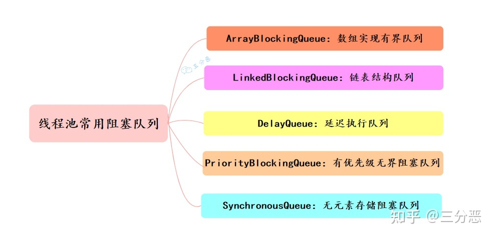

ArrayBlockingQueue：ArrayBlockingQueue（有界队列）是一个用数组实现的有界阻塞队列，按FIFO排序量。

LinkedBlockingQueue：LinkedBlockingQueue（可设置容量队列）是基于链表结构的阻塞队列，按FIFO排序任务，容量可以选择进行设置，不设置的话，将是一个无边界的阻塞队列，最大长度为Integer.MAX_VALUE，吞吐量通常要高于ArrayBlockingQuene；newFixedThreadPool线程池使用了这个队列

DelayQueue：DelayQueue（延迟队列）是一个任务定时周期的延迟执行的队列。根据指定的执行时间从小到大排序，否则根据插入到队列的先后排序。newScheduledThreadPool线程池使用了这个队列。

PriorityBlockingQueue：PriorityBlockingQueue（优先级队列）是具有优先级的无界阻塞队列

SynchronousQueue：SynchronousQueue（同步队列）是一个不存储元素的阻塞队列，每个插入操作必须等到另一个线程调用移除操作，否则插入操作一直处于阻塞状态，吞吐量通常要高于LinkedBlockingQuene，newCachedThreadPool线程池使用了这个队列。

**keepAliveTime** :当线程池中的线程数量⼤于 corePoolSize 的时候，如果这时没有新的任务提交，核⼼线程外的线程不会⽴即销毁，⽽是会等待，直到等待的时间超过了keepAliveTime 才会被回收销毁；

**unit** : keepAliveTime 参数的时间单位。

**threadFactory** :executor 创建新线程的时候会⽤到。

**handler** :饱和策略。关于饱和策略下⾯单独介绍⼀下。 
ThreadPoolExecutor**饱和策略**定义:如果当前同时运⾏的线程数量达到最⼤线程数量并且队列也已经被放满了任时， ThreadPoolTaskExecutor 定义⼀些策略:

ThreadPoolExecutor.AbortPolicy ：抛出 RejectedExecutionException 来拒绝新任务的处理。

ThreadPoolExecutor.CallerRunsPolicy ：调⽤执⾏⾃⼰的线程运⾏任务。您不会任务请求。但是这种策略会降低对于新任务提交速度，影响程序的整体性能。另外，这个策略喜欢增加队列容量。如果您的应⽤程序可以承受此延迟并且你不能任务丢弃任何⼀个任务请求的话，你可以选择这个策略。

ThreadPoolExecutor.DiscardPolicy ： 不处理新任务，直接丢弃掉。

ThreadPoolExecutor.DiscardOldestPolicy ： 此策略将丢弃最早的未处理的任务请求。

《阿⾥巴巴 Java 开发⼿册》中强制线程池不允许使⽤ Executors 去创建，⽽是通过ThreadPoolExecutor 的⽅式，这样的处理⽅式让写的同学更加明确线程池的运⾏规则，规避资源耗尽的⻛险 ：

Executors 返回线程池对象的弊端如下：

FixedThreadPool 和 SingleThreadExecutor ： 允许请求的队列⻓度为Integer.MAX_VALUE ，可能堆积⼤量的请求，从⽽导致 OOM。

CachedThreadPool 和 ScheduledThreadPool ： 允许创建的线程数量为Integer.MAX_VALUE ，可能会创建⼤量线程，从⽽导致 OOM。 

**如何创建线程池？**

⽅式⼀：通过构造⽅法实现 

⽅式⼆：通过 Executor 框架的⼯具类 Executors 来实现
我们可以创建三种类型的 ThreadPoolExecutor：

FixedThreadPool ： 该⽅法返回⼀个固定线程数量的线程池。该线程池中的线程数量始终不变。当有⼀个新的任务提交时，线程池中若有空闲线程，则⽴即执⾏。若没有，则新的任务会被暂存在⼀个任务队列中，待有线程空闲时，便处理在任务队列中的任务。

SingleThreadExecutor： ⽅法返回⼀个只有⼀个线程的线程池。若多余⼀个任务被提交到该线程池，任务会被保存在⼀个任务队列中，待线程空闲，按先⼊先出的顺序执⾏队列中的任务。

CachedThreadPool： 该⽅法返回⼀个可根据实际情况调整线程数量的线程池。线程池的线程数量不确定，但若有空闲线程可以复⽤，则会优先使⽤可复⽤的线程。若所有线程均在作，⼜有新的任务提交，则会创建新的线程处理任务。所有线程在当前任务执⾏完毕后，将返回线程池进⾏复⽤。 

## 21.4 线程池中submit() 和 execute()方法有什么区别？shutdownNow() 和 shutdown() 两个方法有什么区别？
两个方法都可以向线程池提交任务，execute()方法的返回类型是void，它定义在Executor接口中, 而submit()方法可以返回持有计算结果的Future对象，它定义在ExecutorService接口中，它扩展了Executor接口，其它线程池类像ThreadPoolExecutor和ScheduledThreadPoolExecutor都有这些方法。

1. execute() ⽅法⽤于提交不需要返回值的任务，所以⽆法判断任务是否被线程池执⾏成功与否；
2. submit() ⽅法⽤于提交需要返回值的任务。线程池会返回⼀个 Future 类型的对象，通过这个 Future 对象可以判断任务是否执⾏成功，并且可以通过 Future 的 get() ⽅法来获取返回值， get() ⽅法会阻塞当前线程直到任务完成，⽽使⽤ getlong timeout TimeUnitunit ⽅法则会阻塞当前线程⼀段时间后⽴即返回，这时候有可能任务没有执⾏完。 

shutdownNow() 和 shutdown() 都是用来终止线程池的，它们的原理是遍历线程池中的工作线程，然后逐个调用线程的interrupt方法来中断线程，所以无法响应中断的任务可能永远无法终止。它们的区别是，使用 shutdown() 程序不会报错，也不会立即终止线程，它会等待线程池中的缓存任务执行完之后再退出，执行了 shutdown() 之后就不能给线程池添加新任务了；shutdownNow() 会试图立马停止任务，如果线程池中还有缓存任务正在执行，则会抛出 java.lang.InterruptedException: sleep interrupted 异常。

## 21.5 如果你提交任务时，线程池队列已满。会时发会生什么？
这个问题问得很狡猾，许多程序员会认为该任务会阻塞直到线程池队列有空位。事实上如果一个任务不能被调度执行那么ThreadPoolExecutor’s submit()方法将会抛出一个RejectedExecutionException异常。

## 21.6 线程池中核心线程数量大小怎么设置？
**CPU密集型任务**：比如像加解密，压缩、计算等一系列需要大量耗费 CPU 资源的任务，大部分场景下都是纯 CPU 计算。尽量使用较小的线程池，一般为CPU核心数+1。因为CPU密集型任务使得CPU使用率很高，若开过多的线程数，会造成CPU过度切换。

**IO密集型任务**：比如像 MySQL 数据库、文件的读写、网络通信等任务，这类任务不会特别消耗 CPU 资源，但是 IO 操作比较耗时，会占用比较多时间。可以使用稍大的线程池，一般为2*CPU核心数。IO密集型任务CPU使用率并不高，因此可以让CPU在等待IO的时候有其他线程去处理别的任务，充分利用CPU时间。

**混合型任务**：核心线程数=(线程等待时间/线程CPU时间+1)*CPU核心数

另外：线程的平均工作时间所占比例越高，就需要越少的线程；线程的平均等待时间所占比例越高，就需要越多的线程；

以上只是理论值，实际项目中建议在本地或者测试环境进行多次调优，找到相对理想的值大小。

## 21.7 线程池为什么要使用阻塞队列而不使用非阻塞队列？
阻塞队列可以保证任务队列中没有任务时阻塞获取任务的线程，使得线程进入wait状态，释放cpu资源。当队列中有任务时才唤醒对应线程从队列中取出消息进行执行。使得在线程不至于一直占用cpu资源。（线程执行完任务后通过循环再次从任务队列中取出任务进行执行，代码片段如下
 while (task != null || (task = getTask()) != null) {}）。
不用阻塞队列也是可以的，不过实现起来比较麻烦而已，有好用的为啥不用呢？

## 21.8 知道线程池中线程复用原理吗？
线程池将线程和任务进行解耦，线程是线程，任务是任务，摆脱了之前通过 Thread 创建线程时的一个线程必须对应一个任务的限制。

在线程池中，同一个线程可以从阻塞队列中不断获取新任务来执行，其核心原理在于线程池对 Thread 进行了封装，并不是每次执行任务都会调用 Thread.start() 来创建新线程，而是让每个线程去执行一个“循环任务”，在这个“循环任务”中不停的检查是否有任务需要被执行，如果有则直接执行，也就是调用任务中的 run 方法，将 run 方法当成一个普通的方法执行，通过这种方式将只使用固定的线程就将所有任务的 run 方法串联起来。

## 21.9 线程池异常怎么处理知道吗？

在使用线程池处理任务的时候，任务代码可能抛出RuntimeException，抛出异常后，线程池可能捕获它，也可能创建一个新的线程来代替异常的线程，我们可能无法感知任务出现了异常，因此我们需要考虑线程池异常情况。常见的异常处理方式：

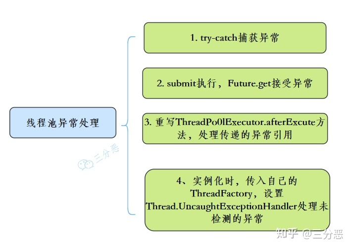

## 21.10 线程池如何实现参数的动态修改？

线程池提供了几个 setter方法来设置线程池的参数。

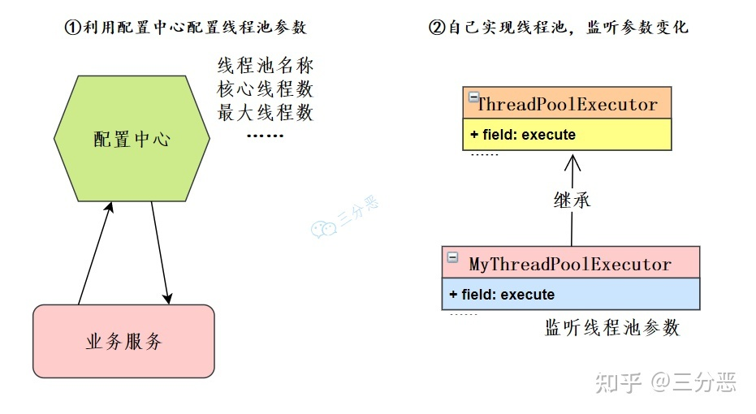

- 微服务架构下，可以利用配置中心如Nacos、Apollo等等，也可以自己开发配置中心。业务服务读取线程池配置，获取相应的线程池实例来修改线程池的参数。 

- 如果限制了配置中心的使用，也可以自己去扩展**ThreadPoolExecutor**，重写方法，监听线程池参数变化，来动态修改线程池参数。

## 21.11 单机线程池执行断电了应该怎么处理？

可以对正在处理和阻塞队列的任务做事务管理或者对阻塞队列中的任务持久化处理，并且当断电或者系统崩溃，操作无法继续下去的时候，可以通过回溯日志的方式来撤销`正在处理`的已经执行成功的操作。然后重新执行整个阻塞队列。

也就是说，对阻塞队列持久化；正在处理任务事务控制；断电之后正在处理任务的回滚，通过日志恢复该次操作；服务器重启后阻塞队列中的数据再加载。

## 21.12 手写线程池？

https://zhuanlan.zhihu.com/p/467110862

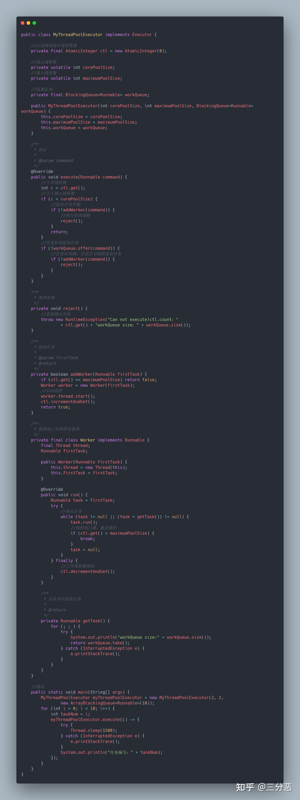

# 22 并发工具类
countdownlatch、cyclicbarrier

## 22.1 CountDownLatch（倒计数器）

CountDownLatch，倒计数器，有两个常见的应用场景[18]：

**场景1：协调子线程结束动作：等待所有子线程运行结束**

CountDownLatch允许一个或多个线程等待其他线程完成操作。

**场景2. 协调子线程开始动作：统一各线程动作开始的时机**

CountDownLatch的**核心方法**也不多：

- `await()`：等待latch降为0；
- `boolean await(long timeout, TimeUnit unit)`：等待latch降为0，但是可以设置超时时间。比如有玩家超时未确认，那就重新匹配，总不能为了某个玩家等到天荒地老。
- `countDown()`：latch数量减1；
- `getCount()`：获取当前的latch数量。

## 22.2 .CyclicBarrier（同步屏障）

CyclicBarrier的字面意思是可循环使用的屏障。它要做的事情是，让一组线程到达一个屏障（也可以叫同步点）时被阻塞，直到最后一个线程到达屏障时，屏障才会开门，所有被屏障拦截的线程才会继续运行。

CyclicBarrier最最核心的方法，仍然是await()：

- 如果当前线程不是第一个到达屏障的话，它将会进入等待，直到其他线程都到达，除非发生**被中断**、**屏障被拆除**、**屏障被重设**等情况；

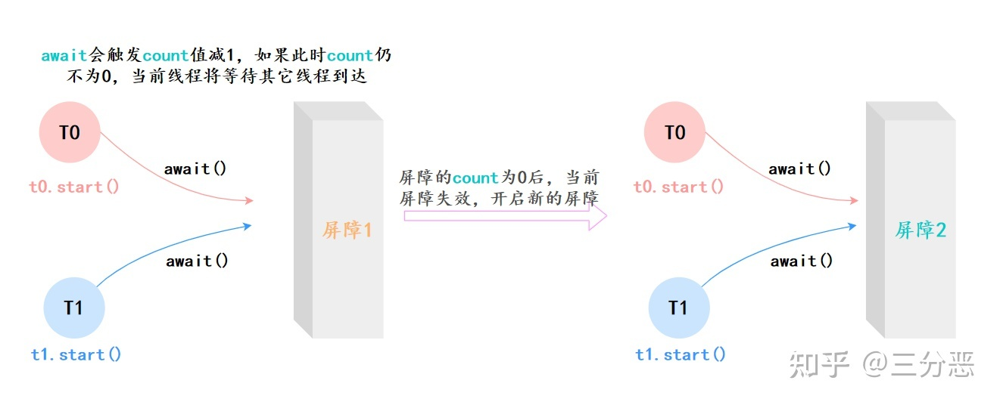

## 22.3 CyclicBarrier和CountDownLatch有什么区别

两者最核心的区别[18]：

- CountDownLatch是一次性的，而CyclicBarrier则可以多次设置屏障，实现重复利用；
- CountDownLatch中的各个子线程不可以等待其他线程，只能完成自己的任务；而CyclicBarrier中的各个线程可以等待其他线程

## 22.4 Semaphore（信号量)

Semaphore是用来控制同时访问特定资源的线程数量，通过协调各个线程，以保证合理的使用公共资源。

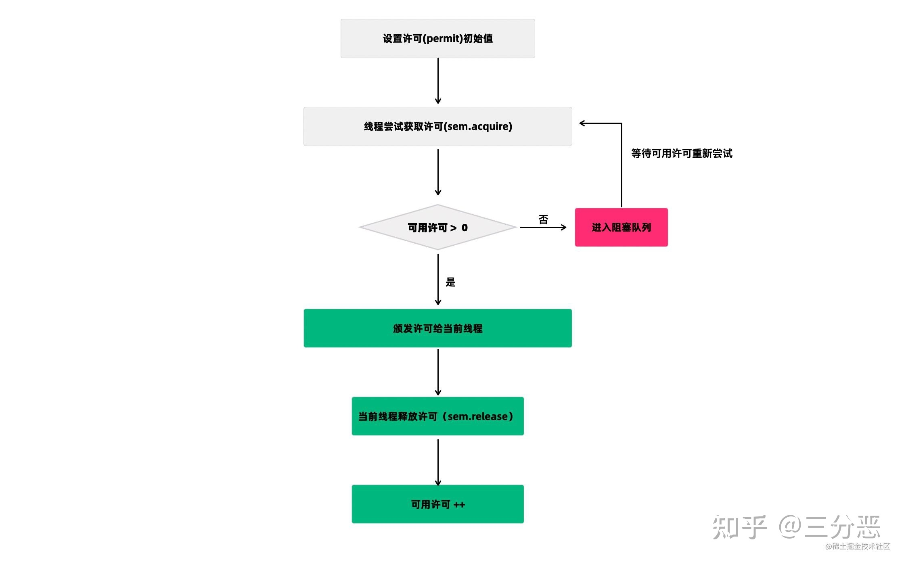

一个Semaphore的用途：它可以用于做流量控制，特别是公用资源有限的应用场景，比如数据库连接。

假如有一个需求，要读取几万个文件的数据，因为都是IO密集型任务，我们可以启动几十个线程并发地读取，但是如果读到内存后，还需要存储到数据库中，而数据库的连接数只有10个，这时必须控制只有10个线程同时获取数据库连接保存数据，否则会报错无法获取数据库连接。可以使用Semaphore来做流量控制，如下：

## 22.5 Exchanger 了解吗？

Exchanger（交换者）是一个用于线程间协作的工具类。Exchanger用于进行线程间的数据交换。它提供一个同步点，在这个同步点，两个线程可以交换彼此的数据。

两个线程通过 exchange方法交换数据，如果第一个线程先执行exchange()方法，它会一直等待第二个线程也执行exchange方法，当两个线程都到达同步点时，这两个线程就可以交换数据，将本线程生产出来的数据传递给对方。

Exchanger可以用于遗传算法，遗传算法里需要选出两个人作为交配对象，这时候会交换两人的数据，并使用交叉规则得出2个交配结果。Exchanger也可以用于校对工作，比如我们需要将纸制银行流水通过人工的方式录入成电子银行流水，为了避免错误，采用AB岗两人进行录入，录入到Excel之后，系统需要加载这两个Excel，并对两个Excel数据进行校对，看看是否录入一致。

```java
public class ExchangerTest {
    private static final Exchanger<String> exgr = new Exchanger<String>();
    private static ExecutorService threadPool = Executors.newFixedThreadPool(2);

    public static void main(String[] args) {
        threadPool.execute(new Runnable() {
            @Override
            public void run() {
                try {
                    String A = "银行流水A"; // A录入银行流水数据 
                    exgr.exchange(A);
                } catch (InterruptedException e) {
                }
            }
        });
        threadPool.execute(new Runnable() {
            @Override
            public void run() {
                try {
                    String B = "银行流水B"; // B录入银行流水数据 
                    String A = exgr.exchange("B");
                    System.out.println("A和B数据是否一致：" + A.equals(B) + "，A录入的是："
                            + A + "，B录入是：" + B);
                } catch (InterruptedException e) {
                }
            }
        });
        threadPool.shutdown();
    }
}
```

## 22.6 Fork/Join框架

Fork/Join框架是Java7提供的一个用于并行执行任务的框架，是一个把大任务分割成若干个小任务，最终汇总每个小任务结果后得到大任务结果的框架。

要想掌握Fork/Join框架，首先需要理解两个点，**分而治之**和**工作窃取算法**。

**分而治之**

Fork/Join框架的定义，其实就体现了分治思想：将一个规模为N的问题分解为K个规模较小的子问题，这些子问题相互独立且与原问题性质相同。求出子问题的解，就可得到原问题的解。

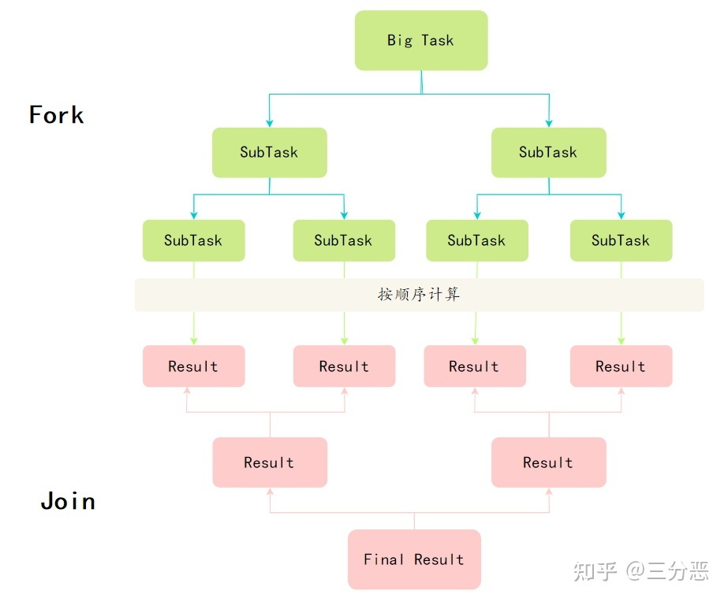

**工作窃取算法**

大任务拆成了若干个小任务，把这些小任务放到不同的队列里，各自创建单独线程来执行队列里的任务。

那么问题来了，有的线程干活块，有的线程干活慢。干完活的线程不能让它空下来，得让它去帮没干完活的线程干活。它去其它线程的队列里窃取一个任务来执行，这就是所谓的**工作窃取**。

工作窃取发生的时候，它们会访问同一个队列，为了减少窃取任务线程和被窃取任务线程之间的竞争，通常任务会使用双端队列，被窃取任务线程永远从双端队列的头部拿，而窃取任务的线程永远从双端队列的尾部拿任务执行。

看一个Fork/Join框架应用的例子，计算1~n之间的和：1+2+3+…+n

- 设置一个分割阈值，任务大于阈值就拆分任务
- 任务有结果，所以需要继承RecursiveTask

```java
public class CountTask extends RecursiveTask<Integer> {
    private static final int THRESHOLD = 16; // 阈值
    private int start;
    private int end;

    public CountTask(int start, int end) {
        this.start = start;
        this.end = end;
    }

    @Override
    protected Integer compute() {
        int sum = 0;
        // 如果任务足够小就计算任务
        boolean canCompute = (end - start) <= THRESHOLD;
        if (canCompute) {
            for (int i = start; i <= end; i++) {
                sum += i;
            }
        } else {
            // 如果任务大于阈值，就分裂成两个子任务计算
            int middle = (start + end) / 2;
            CountTask leftTask = new CountTask(start, middle);
            CountTask rightTask = new CountTask(middle + 1, end);
            // 执行子任务
            leftTask.fork();
            rightTask.fork(); // 等待子任务执行完，并得到其结果
            int leftResult = leftTask.join();
            int rightResult = rightTask.join(); // 合并子任务
            sum = leftResult + rightResult;
        }
        return sum;
    }

    public static void main(String[] args) {
        ForkJoinPool forkJoinPool = new ForkJoinPool(); // 生成一个计算任务，负责计算1+2+3+4
        CountTask task = new CountTask(1, 100); // 执行一个任务
        Future<Integer> result = forkJoinPool.submit(task);
        try {
            System.out.println(result.get());
        } catch (InterruptedException e) {
        } catch (ExecutionException e) {
        }
    }
    
}
```

ForkJoinTask与一般Task的主要区别在于它需要实现compute方法，在这个方法里，首先需要判断任务是否足够小，如果足够小就直接执行任务。如果比较大，就必须分割成两个子任务，每个子任务在调用fork方法时，又会进compute方法，看看当前子任务是否需要继续分割成子任务，如果不需要继续分割，则执行当前子任务并返回结果。使用join方法会等待子任务执行完并得到其结果。

# 23 多线程中忙循环是什么？

忙循环就是程序员用循环让一个线程等待，不像传统方法wait()、sleep()或者yied()它们都放弃了CPU控制，而忙循环不会放弃CPU，它就是在运行一个空循环。这么做的目的是为了保留CPU缓存，在多核系统中，一个等待线程醒来的时候可能会在另一个内核运行，这样会重建缓存。为了避免重建缓存和减少等待重建的时间就可以使用它。

# 24 如何停止线程？如何中断线程？


# 25 并发编程题

## 25.1  3个线程T1、T2、T3，如何让他们顺序执行？2个线程交替打印输出？

https://www.toutiao.com/i6964665069351289348/

这是一道面试中常考的并发编程的代码题，与它相似的问题有：

三个线程T1、T2、T3轮流打印ABC，打印n次，如ABCABCABCABC.......

两个线程交替打印1-100的奇偶数

N个线程循环打印1-100
......

其实这类问题本质上都是线程通信问题，思路基本上都是一个线程执行完毕，阻塞该线程，唤醒其他线程，按顺序执行下一个线程。下面先来看最简单的，如何按顺序执行三个线程。

1）join思路

```java
public class JoinTest {
    public static void main(String[] args) throws Exception {
        for (int i=0; i<10; i++) {
            Thread t1 = new Thread (new JoinThread(null), "A");
            Thread t2 = new Thread (new JoinThread(t1), "B");
            Thread t3 = new Thread (new JoinThread(t2), "C");
            t1.start();
            t2.start();
            t3.start();
            Thread.sleep(10);
        }
    }
}
class JoinThread implements Runnable {
    private Thread beforeThread;

    public JoinThread(Thread thread) {
        this.beforeThread = thread;
    }
    public void run() {
        if (null == beforeThread) {
            System.out.println(Thread.currentThread().getName());
            return;
        }
        try {
            beforeThread.join();
            System.out.println(Thread.currentThread().getName());
        } catch (Exception e) {
            e.printStackTrace();
        }
    }
}
```

2）原子变量

```java
public class PrintABAtomic implements IPrintAB {
    // 打印何时结束需要设置一个上限，打印到100结束；
    private static final int MAX_PRINT_NUM = 100;
    private static final AtomicInteger atomicInteger = new AtomicInteger(0);
    @Override
    public void printAB() {
        new Thread(() -> {
            while (atomicInteger.get() < MAX_PRINT_NUM) {
                // 打印奇数.
                if (atomicInteger.get() % 2 == 0) {
                    log.info("num:" + atomicInteger.get());
                    atomicInteger.incrementAndGet();
                }
            }
        }).start();
        new Thread(() -> {
            while (atomicInteger.get() < MAX_PRINT_NUM) {
                // 打印偶数.
                if (atomicInteger.get() % 2 == 1) {
                    log.info("num:" + atomicInteger.get());
                    atomicInteger.incrementAndGet();
                }
            }
        }).start();
    }
}
```

3)  volatile

```java
public class PrintABVolatile implements IPrintAB {
    private static final int MAX_PRINT_NUM = 100;
    private static volatile int count = 0;
    @Override
    public void printAB() {
        new Thread(() -> {
            while (count < MAX_PRINT_NUM) {
                if (count % 2 == 0) {
                    log.info("num:" + count);
                    count++;
                }
            }
        }).start();
        new Thread(() -> {
            while (count < MAX_PRINT_NUM) {
                if (count % 2 == 1) {
                    log.info("num:" + count);
                    count++;
                }
            }
        }).start();
    }
}
```

## 25.2 实现生产者消费者模式

# 26 如何获得线程堆栈信息？

对于不同的操作系统，有多种方法来获得Java进程的线程堆栈。当你获取线程堆栈时，JVM会把所有线程的状态存到日志文件或者输出到控制台。

在Windows你可以使用Ctrl + Break组合键来获取线程堆栈，

Linux下用kill -3命令，你也可以用jstack这个工具来获取，它对线程id进行操作，你可以用jps这个工具找到id。

# 27 你有哪些多线程开发良好的实践？

- 给线程命名
- 最小化同步范围
- 优先使用volatile
- 尽可能使用更高层次的并发工具而非wait和notify()来实现线程通信,如BlockingQueue,Semeaphore
- 优先使用并发容器而非同步容器.
- 考虑使用线程池