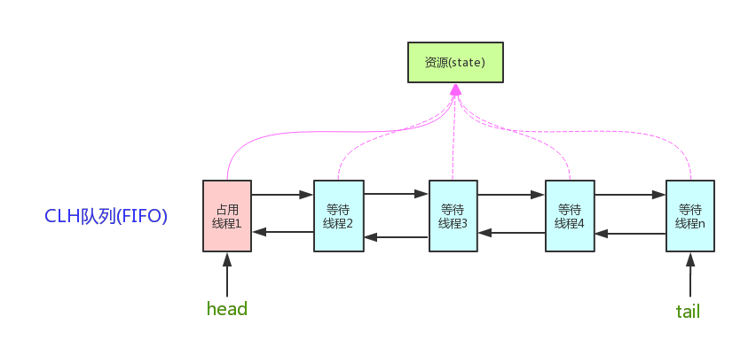
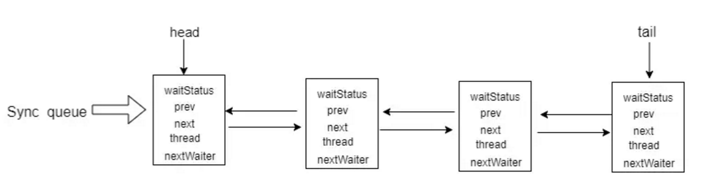
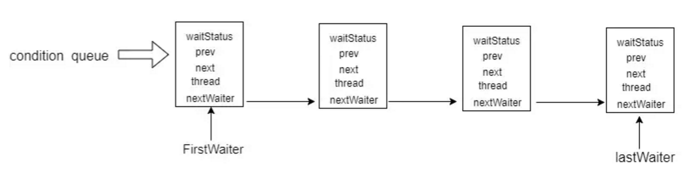
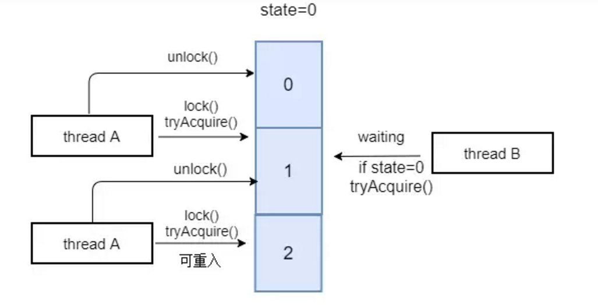
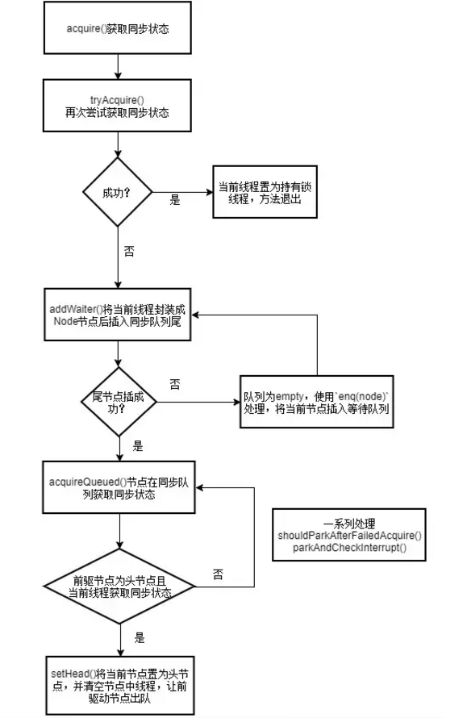
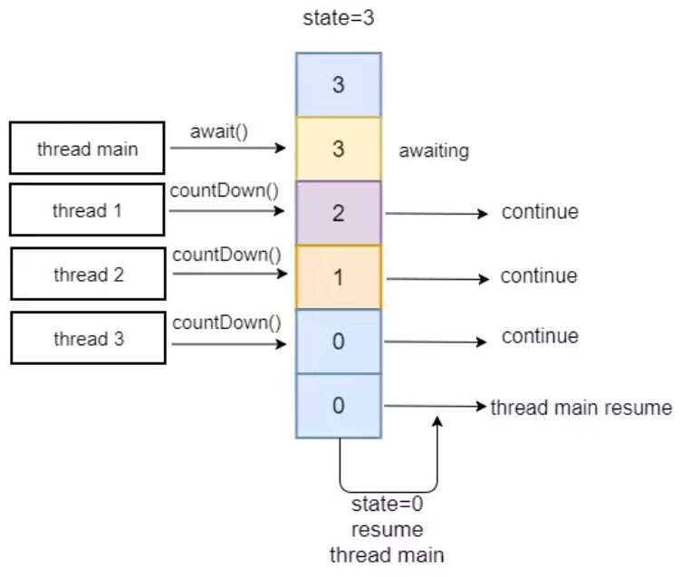

https://mp.weixin.qq.com/s/5hHBgzB2-b1_mGevYK3IXw
https://www.toutiao.com/a6760474880518390286/?channel=&source=search_tab

https://www.cnblogs.com/waterystone/p/4920797.html

# 1 AQS是什么？有什么用？

AQS全称AbstractQueuedSynchronizer，即抽象的队列同步器，是一种用来构建锁和同步器的框架。基于AQS构建同步器：
ReentrantLock、Semaphore、CountDownLatch、ReentrantReadWriteLock、SynchronusQueue、FutureTask
优势：
- AQS 解决了在实现同步器时涉及的大量细节问题，例如自定义标准同步状态、FIFO 同步队列。
- 基于 AQS 来构建同步器可以带来很多好处。它不仅能够极大地减少实现工作，而且也不必处理在多个位置上发生的竞争问题。

# 2 AQS核心知识
## 2.1 AQS核心思想
如果被请求的共享资源空闲，则将当前请求资源的线程设置为有效的工作线程，并且将共享资源设置为锁定状态。如果被请求的共享资源被占用，那么就需要一套线程阻塞等待以及被唤醒时锁分配的机制，这个机制AQS是用CLH队列锁实现的，即将暂时获取不到锁的线程加入到队列中。如图所示：

**Sync queue**： 同步队列，是一个双向列表。包括head节点和tail节点。head节点主要用作后续的调度。同步队列为什么称为FIFO呢？因为只有前驱节点是head节点的节点才能被首先唤醒去进行同步状态的获取。当该节点获取到同步状态时，它会清除自己的值，将自己作为head节点，以便唤醒下一个节点。

**Condition queue**： 非必须，单向列表。当程序中存在cindition的时候才会存在此列表。AQS中还存在Condition队列，这是一个单向队列。调用ConditionObject.await()方法，能够将当前线程封装成Node加入到Condition队列的末尾，然后将获取的同步状态释放（即修改同步状态的值，唤醒在同步队列中的线程）。Condition队列也是FIFO。调用ConditionObject.signal()方法，能够唤醒firstWaiter节点，将其添加到同步队列末尾。


## 2.2 AQS设计思想
- AQS使用一个int成员变量来表示同步状态
- 使用Node实现FIFO队列，可以用于构建锁或者其他同步装置
- AQS资源共享方式：独占Exclusive（排它锁模式）和共享Share（共享锁模式）
>AQS它的所有子类中，要么实现并使用了它的独占功能的api，要么使用了共享锁的功能，而不会同时使用两套api，即便是最有名的子类ReentrantReadWriteLock也是通过两个内部类读锁和写锁分别实现了两套api来实现的

**state状态**
state状态使用volatile int类型的变量，表示当前同步状态。state的访问方式有三种:
- getState()
- setState()
- compareAndSetState()

**Node中常量含义**
Node结点是对每一个等待获取资源的线程的封装，其包含了需要同步的线程本身及其等待状态，如是否被阻塞、是否等待唤醒、是否已经被取消等。变量waitStatus则表示当前Node结点的等待状态，共有5种取值CANCELLED、SIGNAL、CONDITION、PROPAGATE、0。
- CANCELLED(1)：表示当前结点已取消调度。当timeout或被中断（响应中断的情况下），会触发变更为此状态，进入该状态后的结点将不会再变化。

- SIGNAL(-1)：表示后继结点在等待当前结点唤醒。后继结点入队时，会将前继结点的状态更新为SIGNAL。

- CONDITION(-2)：表示结点等待在Condition上，当其他线程调用了Condition的signal()方法后，CONDITION状态的结点将从等待队列转移到同步队列中，等待获取同步锁。

- PROPAGATE(-3)：共享模式下，前继结点不仅会唤醒其后继结点，同时也可能会唤醒后继的后继结点。

- 0：新结点入队时的默认状态。

注意，负值表示结点处于有效等待状态，而正值表示结点已被取消。所以源码中很多地方用>0、<0来判断结点的状态是否正常。

**自定义同步器的实现**
AQS定义两种资源共享方式：Exclusive（独占，只有一个线程能执行，如ReentrantLock）和Share（共享，多个线程可同时执行，如Semaphore/CountDownLatch）。不同的自定义同步器争用共享资源的方式也不同。自定义同步器在实现时只需要实现共享资源state的获取与释放方式即可，至于具体线程等待队列的维护（如获取资源失败入队/唤醒出队等），AQS已经在顶层实现好了。自定义同步器实现时主要实现以下几种方法：

- isHeldExclusively()：该线程是否正在独占资源。只有用到condition才需要去实现它。
- tryAcquire(int)：独占方式。尝试获取资源，成功则返回true，失败则返回false。
- tryRelease(int)：独占方式。尝试释放资源，成功则返回true，失败则返回false。
- tryAcquireShared(int)：共享方式。尝试获取资源。负数表示失败；0表示成功，但没有剩余可用资源；正数表示成功，且有剩余资源。
- tryReleaseShared(int)：共享方式。尝试释放资源，如果释放后允许唤醒后续等待结点返回true，否则返回false。

　　以ReentrantLock为例，state初始化为0，表示未锁定状态。A线程lock()时，会调用tryAcquire()独占该锁并将state+1。此后，其他线程再tryAcquire()时就会失败，直到A线程unlock()到state=0（即释放锁）为止，其它线程才有机会获取该锁。当然，释放锁之前，A线程自己是可以重复获取此锁的（state会累加），这就是可重入的概念。但要注意，获取多少次就要释放多么次，这样才能保证state是能回到零态的。

　　再以CountDownLatch以例，任务分为N个子线程去执行，state也初始化为N（注意N要与线程个数一致）。这N个子线程是并行执行的，每个子线程执行完后countDown()一次，state会CAS减1。等到所有子线程都执行完后(即state=0)，会unpark()主调用线程，然后主调用线程就会从await()函数返回，继续后余动作。

# 3 源码解读
线程首先尝试获取锁，如果失败就将当前线程及等待状态等信息包装成一个node节点加入到FIFO队列中。 接着会不断的循环尝试获取锁，条件是当前节点为head的直接后继才会尝试。如果失败就会阻塞自己直到自己被唤醒。而当持有锁的线程释放锁的时候，会唤醒队列中的后继线程。

## 3.1 独占模式下的AQS
所谓**独占模式**，即只允许一个线程获取同步状态，当这个线程还没有释放同步状态时，其他线程是获取不了的，只能加入到同步队列，进行等待。
>很明显，我们可以将state的初始值设为0，表示空闲。当一个线程获取到同步状态时，利用CAS操作让state加1，表示非空闲，那么其他线程就只能等待了。释放同步状态时，不需要CAS操作，因为独占模式下只有一个线程能获取到同步状态。ReentrantLock、CyclicBarrier正是基于此设计的。

例如，ReentrantLock，state初始化为0，表示未锁定状态。A线程lock()时，会调用tryAcquire()独占该锁并将state+1。

独占模式下的AQS是不响应中断的，指的是加入到同步队列中的线程，如果因为中断而被唤醒的话，不会立即返回，并且抛出InterruptedException。而是再次去判断其前驱节点是否为head节点，决定是否争抢同步状态。如果其前驱节点不是head节点或者争抢同步状态失败，那么再次挂起。

### 3.1.1 独占模式获取资源-acquire方法
acquire以独占exclusive方式获取资源。如果获取到资源，线程直接返回，否则进入等待队列，直到获取到资源为止，且整个过程忽略中断的影响。源码如下：
```java
public final void acquire(int arg) {
 if (!tryAcquire(arg) &&
 acquireQueued(addWaiter(Node.EXCLUSIVE), arg))
 selfInterrupt();
 }
```
流程图如下：

- 调用自定义同步器的tryAcquire()尝试直接去获取资源，如果成功则直接返回；
- 没成功，则addWaiter()将该线程加入等待队列的尾部，并标记为独占模式；
- acquireQueued()使线程在等待队列中休息，有机会时（轮到自己，会被unpark()）会去尝试获取资源。获取到资源后才返回。如果在整个等待过程中被中断过，则返回true，否则返回false。
- 如果线程在等待过程中被中断过，它是不响应的。只是获取资源后才再进行自我中断selfInterrupt()，将中断补上。

### 3.1.2 独占模式获取资源-tryAcquire方法
tryAcquire尝试以独占的方式获取资源，如果获取成功，则直接返回true，否则直接返回false，且具体实现由自定义AQS的同步器实现的。
```java
 protected boolean tryAcquire(int arg) {
 throw new UnsupportedOperationException();
 }
```

### 3.1.3 独占模式获取资源-addWaiter方法
根据不同模式(Node.EXCLUSIVE互斥模式、Node.SHARED共享模式)创建结点并以CAS的方式将当前线程节点加入到不为空的等待队列的末尾(通过compareAndSetTail()方法)。如果队列为空，通过enq(node)方法初始化一个等待队列，并返回当前节点。
```java
/**
* 参数
* @param mode Node.EXCLUSIVE for exclusive, Node.SHARED for shared
* 返回值
* @return the new node
*/
private Node addWaiter(Node mode) {
 //将当前线程以指定的模式创建节点node
 Node node = new Node(Thread.currentThread(), mode);
 // Try the fast path of enq; backup to full enq on failure
 // 获取当前同队列的尾节点
 Node pred = tail;
 //队列不为空，将新的node加入等待队列中
 if (pred != null) {
 node.prev = pred;
 //CAS方式将当前节点尾插入队列中
 if (compareAndSetTail(pred, node)) {
 pred.next = node;
 return node;
 }
 }
 //当队列为empty或者CAS失败时会调用enq方法处理
 enq(node);
 return node;
}
```
其中，队列为empty，使用enq(node)处理，将当前节点插入等待队列，如果队列为空，则初始化当前队列。所有操作都是CAS自旋的方式进行，直到成功加入队尾为止。
```java
private Node enq(final Node node) {
 //不断自旋
 for (;;) {
 Node t = tail;
 //当前队列为empty
 if (t == null) { // Must initialize
 //完成队列初始化操作，头结点中不放数据，只是作为起始标记，lazy-load，在第一次用的时候new
 if (compareAndSetHead(new Node()))
 tail = head;
 } else {
 node.prev = t;
 //不断将当前节点使用CAS尾插入队列中直到成功为止
 if (compareAndSetTail(t, node)) {
 t.next = node;
 return t;
 }
 }
 }
 }
```
### 3.1.4 独占模式获取资源-acquireQueued方法
acquireQueued用于已在队列中的线程以独占且不间断模式获取state状态，直到获取锁后返回。主要流程：
- 结点node进入队列尾部后，检查状态；
- 调用park()进入waiting状态，等待unpark()或interrupt()唤醒；
- 被唤醒后，是否获取到锁。如果获取到，head指向当前结点，并返回从入队到获取锁的整个过程中是否被中断过；如果没获取到，继续流程1 final boolean acquireQueued(final Node node, int arg) { //是否已获取锁的标志，默认为true 即为尚未 boolean failed = true; try { //等待中是否被中断过的标记 boolean interrupted = false; for (;;) { //获取前节点 final Node p = node.predecessor(); //如果当前节点已经成为头结点，尝试获取锁（tryAcquire）成功，然后返回 if (p == head && tryAcquire(arg)) { setHead(node); p.next = null; // help GC failed = false; return interrupted; } //shouldParkAfterFailedAcquire根据对当前节点的前一个节点的状态进行判断，对当前节点做出不同的操作 //parkAndCheckInterrupt让线程进入等待状态，并检查当前线程是否被可以被中断 if (shouldParkAfterFailedAcquire(p, node) && parkAndCheckInterrupt()) interrupted = true; } } finally { //将当前节点设置为取消状态；取消状态设置为1 if (failed) cancelAcquire(node); } } 复制代码

### 3.1.5 独占模式释放资源-release方法

release方法是独占exclusive模式下线程释放共享资源的锁。它会调用tryRelease()释放同步资源，如果全部释放了同步状态为空闲（即state=0）,当同步状态为空闲时，它会唤醒等待队列里的其他线程来获取资源。这也正是unlock()的语义，当然不仅仅只限于unlock().
```java
public final boolean release(int arg) {
 if (tryRelease(arg)) {
 Node h = head;
 if (h != null && h.waitStatus != 0)
 unparkSuccessor(h);
 return true;
 }
 return false;
 }
```
### 3.1.6 独占模式释放资源-tryRelease方法
tryRelease()跟tryAcquire()一样实现都是由自定义定时器以独占exclusive模式实现的。因为其是独占模式，不需要考虑线程安全的问题去释放共享资源，直接减掉相应量的资源即可(state-=arg)。而且tryRelease()的返回值代表着该线程是否已经完成资源的释放，因此在自定义同步器的tryRelease()时，需要明确这条件，当已经彻底释放资源(state=0)，要返回true，否则返回false。
```java
protected boolean tryRelease(int arg) {
 throw new UnsupportedOperationException();
 }
```
ReentrantReadWriteLock的实现：
```java
protected final boolean tryRelease(int releases) {
 if (!isHeldExclusively())
 throw new IllegalMonitorStateException();
 //减掉相应量的资源(state-=arg)
 int nextc = getState() - releases;
 //是否完全释放资源
 boolean free = exclusiveCount(nextc) == 0;
 if (free)
 setExclusiveOwnerThread(null);
 setState(nextc);
 return free;
 }
```
### 3.1.7 独占模式释放资源-unparkSuccessor
unparkSuccessor用unpark()唤醒等待队列中最前驱的那个未放弃线程，此线程并不一定是当前节点的next节点，而是下一个可以用来唤醒的线程，如果这个节点存在，调用unpark()方法唤醒。
```java
private void unparkSuccessor(Node node) {
 //当前线程所在的结点node
 int ws = node.waitStatus;
 //置零当前线程所在的结点状态，允许失败
 if (ws < 0)
 compareAndSetWaitStatus(node, ws, 0);
 //找到下一个需要唤醒的结点
 Node s = node.next;
 if (s == null || s.waitStatus > 0) {
 s = null;
 // 从后向前找
 for (Node t = tail; t != null && t != node; t = t.prev)
 //从这里可以看出，<=0的结点，都是还有效的结点
 if (t.waitStatus <= 0)
 s = t;
 }
 if (s != null)
 //唤醒
 LockSupport.unpark(s.thread);
}
```

## 3.2 共享模式下AQS
**共享模式**，当然是允许多个线程同时获取到同步状态,共享模式下的AQS也是不响应中断的.

>很明显，我们可以将state的初始值设为N（N > 0），表示空闲。每当一个线程获取到同步状态时，就利用CAS操作让state减1，直到减到0表示非空闲，其他线程就只能加入到同步队列，进行等待。释放同步状态时，需要CAS操作，因为共享模式下，有多个线程能获取到同步状态。CountDownLatch、Semaphore正是基于此设计的。

例如，CountDownLatch，任务分为N个子线程去执行，同步状态state也初始化为N（注意N要与线程个数一致）


### 3.2.1 共享模式获取资源-acquireShared方法
acquireShared在共享模式下线程获取共享资源的顶层入口。它会获取指定量的资源，获取成功则直接返回，获取失败则进入等待队列，直到获取到资源为止，整个过程忽略中断。
```java
public final void acquireShared(int arg) {
 if (tryAcquireShared(arg) < 0)
 doAcquireShared(arg);
}
```
流程：
- 先通过tryAcquireShared()尝试获取资源，成功则直接返回；
- 失败则通过doAcquireShared()中的park()进入等待队列，直到被unpark()/interrupt()并成功获取到资源才返回(整个等待过程也是忽略中断响应)。

### 3.2.2 共享模式获取资源-tryAcquireShared方法
tryAcquireShared()跟独占模式获取资源方法一样实现都是由自定义同步器去实现。但AQS规范中已定义好tryAcquireShared()的返回值：
- 负值代表获取失败；
- 0代表获取成功，但没有剩余资源；
- 正数表示获取成功，还有剩余资源，其他线程还可以去获取。
```java
protected int tryAcquireShared(int arg) {
 throw new UnsupportedOperationException();
 }
```

### 3.2.3 共享模式获取资源-doAcquireShared方法
doAcquireShared()用于将当前线程加入等待队列尾部休息，直到其他线程释放资源唤醒自己，自己成功拿到相应量的资源后才返回。
```java
private void doAcquireShared(int arg) {
    final Node node = addWaiter(Node.SHARED);//加入队列尾部
    boolean failed = true;//是否成功标志
    try {
        boolean interrupted = false;//等待过程中是否被中断过的标志
        for (;;) {
            final Node p = node.predecessor();//前驱
            if (p == head) {//如果到head的下一个，因为head是拿到资源的线程，此时node被唤醒，很可能是head用完资源来唤醒自己的
                int r = tryAcquireShared(arg);//尝试获取资源
                if (r >= 0) {//成功
                    setHeadAndPropagate(node, r);//将head指向自己，还有剩余资源可以再唤醒之后的线程
                    p.next = null; // help GC
                    if (interrupted)//如果等待过程中被打断过，此时将中断补上。
                        selfInterrupt();
                    failed = false;
                    return;
                }
            }

            //判断状态，寻找安全点，进入waiting状态，等着被unpark()或interrupt()
            if (shouldParkAfterFailedAcquire(p, node) &&
                parkAndCheckInterrupt())
                interrupted = true;
        }
    } finally {
        if (failed)
            cancelAcquire(node);
    }
}
```
### 3.2.4 共享模式释放资源-releaseShared方法
releaseShared()用于共享模式下线程释放共享资源，释放指定量的资源，如果成功释放且允许唤醒等待线程，它会唤醒等待队列里的其他线程来获取资源。
```java
public final boolean releaseShared(int arg) {
 //尝试释放资源
 if (tryReleaseShared(arg)) {
 //唤醒后继结点
 doReleaseShared();
 return true;
 }
 return false;
}
```
>独占模式下的tryRelease()在完全释放掉资源（state=0）后，才会返回true去唤醒其他线程，这主要是基于独占下可重入的考量；而共享模式下的releaseShared()则没有这种要求，共享模式实质就是控制一定量的线程并发执行，那么拥有资源的线程在释放掉部分资源时就可以唤醒后继等待结点。

https://www.cnblogs.com/waterystone/p/4920797.html

### 3.2.5 共享模式释放资源-doReleaseShared方法
doReleaseShared()主要用于唤醒后继节点线程,当state为正数，去获取剩余共享资源；当state=0时去获取共享资源。
```java
private void doReleaseShared() {
 for (;;) {
 Node h = head;
 if (h != null && h != tail) {
 int ws = h.waitStatus;
 if (ws == Node.SIGNAL) {
 if (!compareAndSetWaitStatus(h, Node.SIGNAL, 0))
 continue;
 //唤醒后继
 unparkSuccessor(h);
 }
 else if (ws == 0 &&
 !compareAndSetWaitStatus(h, 0, Node.PROPAGATE))
 continue;
 }
 // head发生变化
 if (h == head)
 break;
 }
}
```