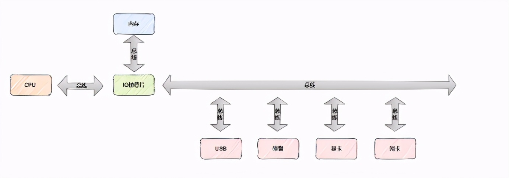

# 0 思维导图

# 1 基本概念
**CAS**（compareAndSwap）也叫比较交换，是一种无锁原子算法，映射到操作系统就是一条**cmpxchg**硬件汇编指令（**保证原子性**），其作用是让CPU将内存值更新为新值，但是有个条件，内存值必须与期望值相同，并且C A S操作无需用户态与内核态切换，直接在用户态对内存进行读写操作（**意味着不会阻塞/线程上下文切换**）。

它包含3个参数CAS（V，E，N），V表示待更新的内存值，E表示预期值，N表示新值，当 V值等于E值时，才会将V值更新成N值，如果V值和E值不等，不做更新，这就是一次CAS的操作。

简单说，CAS需要你额外给出一个期望值，也就是你认为这个变量现在应该是什么样子的，如果变量不是你想象的那样，说明它已经被别人修改过了，你只需要重新读取，设置新期望值，再次尝试修改就好了。

# 2 CAS如何保证原子性

原子性是指一个或者多个操作在CPU执行的过程中不被中断的特性，要么执行，要不执行，不能执行到一半（**不可被中断的一个或一系列操作**）。为了保证CAS的原子性，CPU提供了下面两种方式

- **总线锁定**
- **缓存锁定**

## 2.1 总线锁定

总线（BUS）是计算机组件间的传输数据方式，也就是说CPU与其他组件连接传输数据，就是靠总线完成的，比如CPU对内存的读写。

总线锁定是指CPU使用了总线锁，所谓总线锁就是使用CPU提供的LOCK#信号，当CPU在总线上输出LOCK#信号时，其他CPU的总线请求将被阻塞。

## 2.2 缓存锁定
总线锁定方式虽然保证了原子性，但是在锁定期间，会导致大量阻塞，增加系统的性能开销，所以现代CPU为了提升性能，通过锁定范围缩小的思想设计出了缓存行锁定（缓存行是CPU高速缓存存储的最小单位）。

所谓**缓存锁定**是指CPU对缓存行进行锁定，当缓存行中的共享变量回写到内存时，其他CPU会通过**总线嗅探机制**感知该共享变量是否发生变化，如果发生变化，让自己对应的共享变量缓存行失效，重新从内存读取最新的数据，缓存锁定是基于**缓存一致性机制**来实现的，因为缓存一致性机制会**阻止两个以上CPU同时修改同一个共享变量**（现代CPU基本都支持和使用缓存锁定机制）。

# 3 CAS的问题

CAS和锁都解决了原子性问题，和锁相比没有阻塞、线程上下文你切换、死锁，所以CAS要比锁拥有更优越的性能，但是CAS同样存在缺点。

CAS的问题如下：
- **只能保证一个共享变量的原子操作**
- **自旋时间太长（建立在自旋锁的基础上）**
- **ABA问题**

## 3.1 只能保证一个共享变量原子操作

CAS只能针对一个共享变量使用，如果多个共享变量就只能使用锁了，当然如果你有办法把多个变量整成一个变量，利用CAS也不错，例如读写锁中state的高低位。解决方法：从Java1.5开始JDK提供了**AtomicReference**类来保证引用对象之间的原子性，你可以把多个变量放在一个对象里来进行CAS操作。如：AtomicReference<User> ar = new AtomicReference<>();

## 3.2 自旋时间太长

当一个线程获取锁时失败，不进行阻塞挂起，而是间隔一段时间再次尝试获取，直到成功为止，这种循环获取的机制被称为自旋锁(**spinlock**)。

自旋锁好处是，持有锁的线程在短时间内释放锁，那些等待竞争锁的线程就不需进入阻塞状态（**无需线程上下文切换/无需用户态与内核态切换**），它们只需要等一等（**自旋**），等到持有锁的线程释放锁之后即可获取，这样就避免了用户态和内核态的切换消耗。

自旋锁坏处显而易见，线程在长时间内持有锁，等待竞争锁的线程一直自旋，即CPU一直空转，资源浪费在毫无意义的地方，所以一般会**限制自旋次数**。**自旋锁、适应性自旋锁**

最后来说自旋锁的实现，实现自旋锁可以基于CAS实现，先定义lockValue对象默认值1，1代表锁资源空闲，0代表锁资源被占用，代码如下：

上面定义了AtomicInteger类型的lockValue变量，AtomicInteger是Java基于C A S实现的Integer原子操作类，还定义了3个函数lock、tryLock、unLock

tryLock函数-获取锁：
期望值1，更新值0
CAS更新
如果期望值与lockValue值相等，则lockValue值更新为0，返回true，否则执行下面逻辑
如果期望值与lockValue值不相等，不做任何更新，返回false

unLock函数-释放锁：
期望值0，更新值1
CAS更新
如果期望值与lockValue值相等，则lockValue值更新为1，返回true，否则执行下面逻辑
如果期望值与lockValue值不相等，不做任何更新，返回false

lock函数-自旋获取锁：
**执行tryLock函数，返回true停止，否则一直循环**

从上图可以看出，只有tryLock成功的线程（把lockValue更新为0），才会执行代码块，其他线程个tryLock自旋等待lockValue被更新成1，tryLock成功的线程执行unLock（把lockValue更新为1），自旋的线程才会tryLock成功。

## 3.3 ABA问题
CAS需要检查待更新的内存值有没有被修改，如果没有则更新，但是存在这样一种情况，如果一个值原来是A，变成了B，然后又变成了A，在CAS检查的时候会发现没有被修改。

假设有两个线程，线程1读取到内存值A，线程1时间片用完，切换到线程2，线程2也读取到了内存值A，并把它修改为B值，然后再把B值还原到A值，简单说，修改次序是A->B->A，接着线程1恢复运行，它发现内存值还是A，然后执行CAS操作，这就是著名的ABA问题，但是好像又看不出什么问题。

只是简单的数据结构，确实不会有什么问题，如果是复杂的数据结构可能就会有问题了（使用AtomicReference可以把CAS使用在对象上），以链表数据结构为例，两个线程通过CAS去删除头节点，假设现在链表有A->B节点

线程1删除A节点，B节点成为头节点，正要执行CAS(A,A,B)时，时间片用完，切换到线程2
线程2删除A、B节点
线程2加入C、A节点，链表节点变成A->C
线程1重新获取时间片，执行CAS(A,A,B)
丢失C节点

要解决ABA问题也非常简单，只要追加版本号即可，每次改变时加1，即A —> B —> A，变成1A —> 2B —> 3A，在Java中提供了**AtomicStampedRdference/AtomicMarkableReference**可以实现这个方案（**面试只要问了CAS，就一定会问ABA，这块一定要搞明白**）。

# 4 原子变量

atomic包
