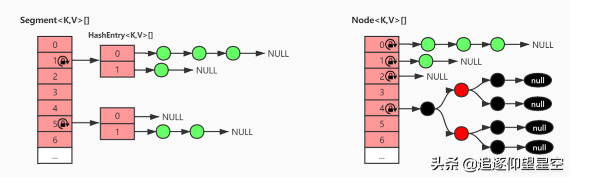
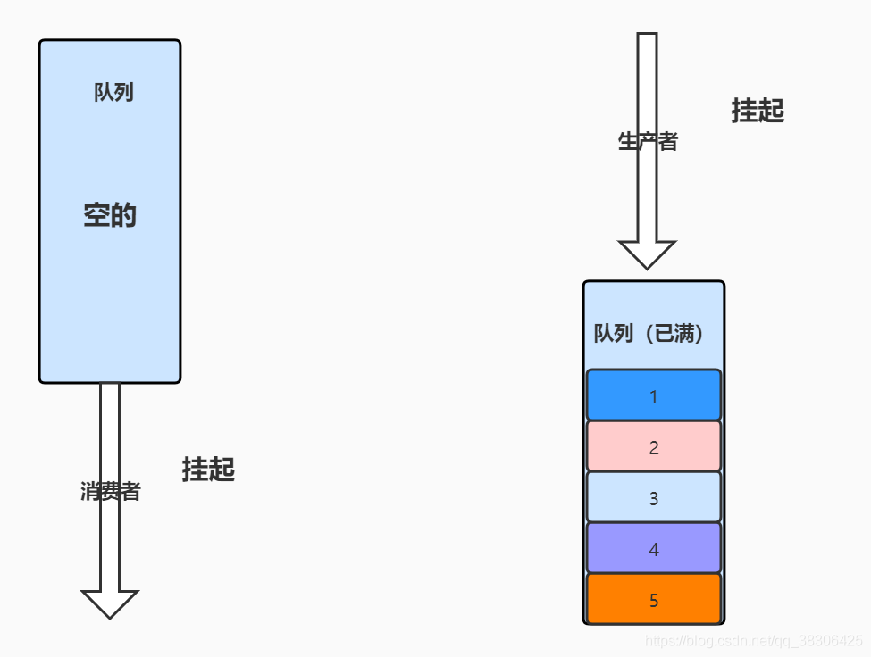
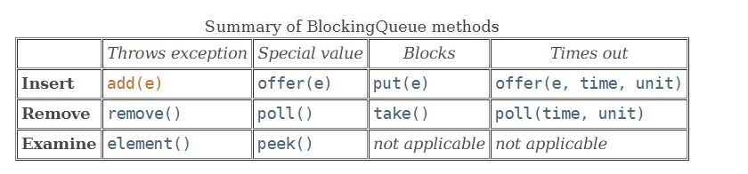

并发容器类

ConcurrentHashMap 

https://www.toutiao.com/a6903498529885438475/?channel=&source=search_tab


https://blog.csdn.net/qq_18661793/article/details/81161193?utm_medium=distribute.pc_relevant_t0.none-task-blog-2~default~BlogCommendFromMachineLearnPai2~default-1.control&depth_1-utm_source=distribute.pc_relevant_t0.none-task-blog-2~default~BlogCommendFromMachineLearnPai2~default-1.control


https://blog.csdn.net/weixin_43848065/article/details/107204950?utm_medium=distribute.pc_relevant.none-task-blog-2~default~baidujs_title~default-8.base&spm=1001.2101.3001.4242

https://blog.csdn.net/csdnsevenn/article/details/87485459?utm_medium=distribute.pc_relevant.none-task-blog-2~default~BlogCommendFromMachineLearnPai2~default-1.base&depth_1-utm_source=distribute.pc_relevant.none-task-blog-2~default~BlogCommendFromMachineLearnPai2~default-1.base

ConcurrentSkipListMap 、ConcurrentSkipListSet

CopyOnwriteArrayList、CopyOnwriteArraySet

线程不安全容器  

阻塞式队列blockqueue Synchronousqueue
delayqueue  

ConcurrentLinkedQueue、ConcurrentLinkedDeque


包装容器 同步容器 并发容器 


# 1 ConcurrentHashMap
1.7 1.8 实现区别

对JDK1.7中的ConcurrentHashMap而言

内部主要是一个Segment数组，而数组的每一项又是一个HashEntry数组，元素都存在HashEntry数组里。因为每次锁定的是Segment对象，也就是整个HashEntry数组，所以又叫分段锁。

对JDK1.8中的ConcurrentHashMap而言

舍弃了分段锁的实现方式，元素都存在Node数组中，每次锁住的是一个Node对象，而不是某一段数组，所以支持的写的并发度更高。再者它引入了红黑树，在hash冲突严重时，读操作的效率更高。

## 1.1  JDK8实现
在容器安全上，1.8 中的 ConcurrentHashMap 放弃了 JDK1.7 中的分段技术，而是采用了**CAS 机制 + synchronized** 来保证并发安全性，但是在 ConcurrentHashMap 实现里保留了 Segment 定义，这仅仅是为了保证序列化时的兼容性而已，并没有任何结构上的用处。

在存储结构上，JDK1.8 中 ConcurrentHashMap 放弃了 HashEntry 结构而是采用了跟 HashMap 结构非常相似，采用 **Node 数组+链表+红黑树**的形式。


```java
public class ConcurrentHashMap<K,V> extends AbstractMap<K,V>
    implements ConcurrentMap<K,V>, Serializable {
    private static final long serialVersionUID = 7249069246763182397L;

	// 最大容量
    private static final int MAXIMUM_CAPACITY = 1 << 30;

    // 默认容量
    private static final int DEFAULT_CAPACITY = 16;

    // 最大可能的数组大小
    static final int MAX_ARRAY_SIZE = Integer.MAX_VALUE - 8;

    // 默认的并发级别（不使用，为了兼容之前的版本）
    private static final int DEFAULT_CONCURRENCY_LEVEL = 16;

    // 默认加载因子
    private static final float LOAD_FACTOR = 0.75f;

    // 链表转红黑树阈值
    static final int TREEIFY_THRESHOLD = 8;

    // 红黑树退化成链表的阈值
    static final int UNTREEIFY_THRESHOLD = 6;

    // （红黑）树化时，table数组最小值
    // 至少是4倍的TREEIFY_THRESHOLD
    static final int MIN_TREEIFY_CAPACITY = 64;

    // 第一次新增元素时初始化，始终是2的幂
    transient volatile Node<K,V>[] table;

    // 扩容时用，代表扩容后的数组
    private transient volatile Node<K,V>[] nextTable;

	// 节点hash的特殊值
    static final int MOVED     = -1; // 转移节点的hash值
    static final int TREEBIN   = -2; // （红黑）树根节点的hash值
    static final int RESERVED  = -3; // 临时保留的hash值
    static final int HASH_BITS = 0x7fffffff; // 普通节点hash的可用位

    // 控制table初始化和扩容的字段
    // -1 初始化中
    // -n 表示n-1个线程正在扩容中
    // 0 使用默认容量进行初始化
    // >0 使用多少容量
    private transient volatile int sizeCtl;
}
// 跟 HashMap 一样 Key 字段被 final 修饰，说明在生命周期内，key 是不可变的， 
// val 字段被 volatile 修饰了，这就保证了 val 字段的可见性。
static class Node<K,V> implements Map.Entry<K,V> {
        final int hash;
        final K key;
        volatile V val;
        volatile Node<K,V> next;
}
```
### 构造方法
ConcurrentHashMap提供了5个构造方法，主要关注3个。

**注意：**构造方法基本只做了参数校验，计算合理的capacity值，并没有初始化数组table。

```java
public ConcurrentHashMap(int initialCapacity) {
    if (initialCapacity < 0)
    	// 传入的初始化容量不能小于0
        throw new IllegalArgumentException();
    // 根据传入的capacity计算合理的capacity
    int cap = ((initialCapacity >= (MAXIMUM_CAPACITY >>> 1)) ?
               MAXIMUM_CAPACITY :
               tableSizeFor(initialCapacity + (initialCapacity >>> 1) + 1));
    this.sizeCtl = cap;
}

public ConcurrentHashMap(int initialCapacity, float loadFactor) {
	// concurrencyLevel传入了1
    this(initialCapacity, loadFactor, 1);
}

public ConcurrentHashMap(int initialCapacity,
                         float loadFactor, int concurrencyLevel) {
    if (!(loadFactor > 0.0f) || initialCapacity < 0 || concurrencyLevel <= 0)
    	// loadFactor、initialCapacity、concurrencyLevel都不能小于0
        throw new IllegalArgumentException();
    if (initialCapacity < concurrencyLevel)   // Use at least as many bins
        initialCapacity = concurrencyLevel;   // as estimated threads
    long size = (long)(1.0 + (long)initialCapacity / loadFactor);
    // 根据传入的capacity和loadFactor计算合理的capacity
    int cap = (size >= (long)MAXIMUM_CAPACITY) ?
        MAXIMUM_CAPACITY : tableSizeFor((int)size);
    this.sizeCtl = cap;
}
```
### 核心方法
put/get/size/resize

#### put方法
```java
public V put(K key, V value) {
	// 调用自身putVal()方法
	// 第三个参数传false，表示map中有相同的key时（equals相等），直接覆盖其value值
    return putVal(key, value, false);
}

/** Implementation for put and putIfAbsent */
final V putVal(K key, V value, boolean onlyIfAbsent) {
	// key、value都不能为null
    if (key == null || value == null) throw new NullPointerException();
    // 计算hash值
    int hash = spread(key.hashCode());
    int binCount = 0;
    for (Node<K,V>[] tab = table;;) {
    	// 自旋
        Node<K,V> f; int n, i, fh;
        if (tab == null || (n = tab.length) == 0)
        	// 数组尚未初始化，进行初始化
            tab = initTable();
        else if ((f = tabAt(tab, i = (n - 1) & hash)) == null) {
        	// 当前槽为null（没有数据）
            if (casTabAt(tab, i, null,
                         new Node<K,V>(hash, key, value, null)))
                // CAS的方法把k、v包装成Node节点，放在这个槽上
                // 成功后就结束自旋，无需加锁
                // 不成功继续自旋
                break;              // no lock when adding to empty bin
        }
        else if ((fh = f.hash) == MOVED)
        	// 当前槽上的节点正在转移（扩容）
            tab = helpTransfer(tab, f);
        else {
        	// 当前槽上有值，并且不处于转移状态
            V oldVal = null;
            synchronized (f) {
            	// 锁住当前槽
            	// 因为只锁住了一个槽（链表头节点、红黑树根节点），也就是数组的一项，所以比JDK1.7中锁住一段（分段锁）的效率更高
                if (tabAt(tab, i) == f) {
                	// 当前槽上的节点没有被修改过，double-check
                    if (fh >= 0) {
                    	// 该槽上是单链表
                        binCount = 1;
                        for (Node<K,V> e = f;; ++binCount) {
                        	// 遍历当前槽
                            K ek;
                            if (e.hash == hash &&
                                ((ek = e.key) == key ||
                                 (ek != null && key.equals(ek)))) {
                                // 单链表上找到了相同的key，覆盖其value值
                                oldVal = e.val;
                                if (!onlyIfAbsent)
                                    e.val = value;
                                break;
                            }
                            Node<K,V> pred = e;
                            if ((e = e.next) == null) {
                            	// 【尾插法】把新增节点插入链表，退出自旋
                                pred.next = new Node<K,V>(hash, key,
                                                          value, null);
                                break;
                            }
                        }
                    }
                    else if (f instanceof TreeBin) {
                    	// 当前槽上存的是红黑树，按照红黑树的方式插入元素
                        Node<K,V> p;
                        binCount = 2;
                        if ((p = ((TreeBin<K,V>)f).putTreeVal(hash, key,
                                                       value)) != null) {
                            oldVal = p.val;
                            if (!onlyIfAbsent)
                                p.val = value;
                        }
                    }
                }
            }
            if (binCount != 0) {
                if (binCount >= TREEIFY_THRESHOLD)
                	// 链表需要转换成红黑树
                    treeifyBin(tab, i);
                if (oldVal != null)
                    return oldVal;
                break;
            }
        }
    }
    // 检检查是否需要扩容，如果需要就扩容
    addCount(1L, binCount);
    return null;
}
```
整个put方法大致分为以下几步：
1、校验K、V，并计算has值

2、进入自旋，判断table是否已经初始化，如果否，则进行初始化；如果是，执行3

3、判断当前槽上是否为null，如果是，通过CAS的方式新增节点；如果否，执行4

4、判断当前槽上的节点是否正在转移（扩容过程），如果是，辅助扩容；如果否，执行5

5、锁住当前槽，如果当前槽上是单链表，按照单链表的方式新增节点，如果是红黑树，按照红黑树方式新增节点

6、判断链表是否需要转换成红黑树，如果是，转换成红黑树

7、新增节点完成后，检测是否需要扩容，如果需要，就扩容

从源码来看，ConcurrentHashMap中的put方法和HashMap的put方法执行的逻辑相差无几。只是利用了自旋 + CAS、Synchronized等来保证线程安全。

接下来深入put方法中使用的一些内部方法：initTable、addCount等

#### initTable
initTable用于初始化table数组，其核心逻辑只有一行new操作，但是为了保证线程安全和高效，采用了**double-check + 自旋 + CAS**的方式，这也是多线程并发编程的常见手段。其实现如下：
```java
private final Node<K,V>[] initTable() {
    Node<K,V>[] tab; int sc;
    while ((tab = table) == null || tab.length == 0) {
    	// 自旋
    	// 外层putVal方法已经判断过这个条件，double-check
        if ((sc = sizeCtl) < 0)
        	// 有其他的线程正在初始table数组
            Thread.yield(); // lost initialization race; just spin
        else if (U.compareAndSwapInt(this, SIZECTL, sc, -1)) {
        	// CAS的方式抢到锁
            try {
                if ((tab = table) == null || tab.length == 0) {
                	// 再次double-check
                	// 执行初始
                    int n = (sc > 0) ? sc : DEFAULT_CAPACITY;
                    @SuppressWarnings("unchecked")
                    Node<K,V>[] nt = (Node<K,V>[])new Node<?,?>[n];
                    table = tab = nt;
                    sc = n - (n >>> 2);
                }
            } finally {
                sizeCtl = sc;
            }
            break;
        }
    }
    return tab;
}
```
延迟初始化，创建数组操作放在put方法中，当多个线程同时put时若不加线程安全处理则会出现线程安全问题。

#### addCount
addCount方法用来检测是否需要扩容，如果需要就扩容。
```java
private final void addCount(long x, int check) {
    CounterCell[] as; long b, s;
    if ((as = counterCells) != null ||
      !U.compareAndSwapLong(this, BASECOUNT, b = baseCount, s = b + x)) {
        CounterCell a; long v; int m;
        boolean uncontended = true;
        if (as == null || (m = as.length - 1) < 0 ||
            (a = as[ThreadLocalRandom.getProbe() & m]) == null ||
            !(uncontended =
              U.compareAndSwapLong(a, CELLVALUE, v = a.value, v + x))) {
            fullAddCount(x, uncontended);
            return;
        }
        if (check <= 1)
            return;
        s = sumCount();
    }
    if (check >= 0) {
        Node<K,V>[] tab, nt; int n, sc;
        while (s >= (long)(sc = sizeCtl) && (tab = table) != null &&
               (n = tab.length) < MAXIMUM_CAPACITY) {
            int rs = resizeStamp(n);
            if (sc < 0) {
                if ((sc >>> RESIZE_STAMP_SHIFT) != rs || sc == rs + 1 ||
                    sc == rs + MAX_RESIZERS || (nt = nextTable) == null ||
                    transferIndex <= 0)
                    break;
                if (U.compareAndSwapInt(this, SIZECTL, sc, sc + 1))
                	// 有别的线程正在扩容
                    transfer(tab, nt);
            }
            else if (U.compareAndSwapInt(this, SIZECTL, sc,
                                        (rs << RESIZE_STAMP_SHIFT) + 2))
                // 没有别的线程正在扩容
                transfer(tab, null);
            s = sumCount();
        }
    }
}
```
#### transfer
对于这个方法而言，就是判断要不要扩容，而真正的扩容方法是transfer，所以具体看下transfer方法的实现逻辑
```java
/**
 * tab表示扩容前的数组
 * nextTab表示扩容后的新数组（如果为null，表示并没有别的线程在扩容）
 */
private final void transfer(Node<K,V>[] tab, Node<K,V>[] nextTab) {
    int n = tab.length, stride;
    if ((stride = (NCPU > 1) ? (n >>> 3) / NCPU : n) < MIN_TRANSFER_STRIDE)
        stride = MIN_TRANSFER_STRIDE; // subdivide range
    if (nextTab == null) {            // initiating
        try {
        	// 初始化nextTab，大小为原数组的2倍
            @SuppressWarnings("unchecked")
            Node<K,V>[] nt = (Node<K,V>[])new Node<?,?>[n << 1];
            nextTab = nt;
        } catch (Throwable ex) {      // try to cope with OOME
            sizeCtl = Integer.MAX_VALUE;
            return;
        }
        nextTable = nextTab;
        transferIndex = n;
    }
    // 获取新数组的长度
    int nextn = nextTab.length;
    // 如果元素组槽上是转移节点，表示该槽上的节点正在转移
    ForwardingNode<K,V> fwd = new ForwardingNode<K,V>(nextTab);
    boolean advance = true;
    boolean finishing = false; // to ensure sweep before committing nextTab
    for (int i = 0, bound = 0;;) {
    	// 自旋
        Node<K,V> f; int fh;
        while (advance) {
            int nextIndex, nextBound;
            if (--i >= bound || finishing)
                advance = false;
            else if ((nextIndex = transferIndex) <= 0) {
            	// 拷贝已经完成
                i = -1;
                advance = false;
            }
            else if (U.compareAndSwapInt
                     (this, TRANSFERINDEX, nextIndex,
                      nextBound = (nextIndex > stride ?
                                   nextIndex - stride : 0))) {
                bound = nextBound;
                i = nextIndex - 1;
                advance = false;
            }
        }
        if (i < 0 || i >= n || i + n >= nextn) {
        	// 拷贝结束
            int sc;
            if (finishing) {
                nextTable = null;
                table = nextTab;
                sizeCtl = (n << 1) - (n >>> 1);
                return;
            }
            if (U.compareAndSwapInt(this, SIZECTL, sc = sizeCtl, sc - 1)) {
                if ((sc - 2) != resizeStamp(n) << RESIZE_STAMP_SHIFT)
                    return;
                finishing = advance = true;
                i = n; // recheck before commit
            }
        }
        else if ((f = tabAt(tab, i)) == null)
            advance = casTabAt(tab, i, null, fwd);
        else if ((fh = f.hash) == MOVED)
            advance = true; // already processed
        else {
            synchronized (f) {
            	// 加锁，进行节点拷贝
                if (tabAt(tab, i) == f) {
                	// 低位链表和高位链表（前文HashMap中讲过）
                    Node<K,V> ln, hn;
                    if (fh >= 0) {
                        int runBit = fh & n;
                        Node<K,V> lastRun = f;
                        for (Node<K,V> p = f.next; p != null; p = p.next) {
                            int b = p.hash & n;
                            if (b != runBit) {
                                runBit = b;
                                lastRun = p;
                            }
                        }
                        if (runBit == 0) {
                            ln = lastRun;
                            hn = null;
                        }
                        else {
                            hn = lastRun;
                            ln = null;
                        }
                        for (Node<K,V> p = f; p != lastRun; p = p.next) {
                        	// 循环拷贝链表节点
                        	// 原数组中的链表会被分成高、低位两个链表，放在新数组中不同的槽
                            int ph = p.hash; K pk = p.key; V pv = p.val;
                            if ((ph & n) == 0)
                                ln = new Node<K,V>(ph, pk, pv, ln);
                            else
                                hn = new Node<K,V>(ph, pk, pv, hn);
                        }
                        // 链表设置到新数组
                        setTabAt(nextTab, i, ln);
                        setTabAt(nextTab, i + n, hn);
                        // 旧数组上设置转移节点
                        // 其他线程发下槽上是转移节点后就会等待
                        setTabAt(tab, i, fwd);
                        advance = true;
                    }
                    else if (f instanceof TreeBin) {
                    	// 拷贝红黑树的节点
                        TreeBin<K,V> t = (TreeBin<K,V>)f;
                        TreeNode<K,V> lo = null, loTail = null;
                        TreeNode<K,V> hi = null, hiTail = null;
                        int lc = 0, hc = 0;
                        for (Node<K,V> e = t.first; e != null; e = e.next) {
                            int h = e.hash;
                            TreeNode<K,V> p = new TreeNode<K,V>
                                (h, e.key, e.val, null, null);
                            if ((h & n) == 0) {
                                if ((p.prev = loTail) == null)
                                    lo = p;
                                else
                                    loTail.next = p;
                                loTail = p;
                                ++lc;
                            }
                            else {
                                if ((p.prev = hiTail) == null)
                                    hi = p;
                                else
                                    hiTail.next = p;
                                hiTail = p;
                                ++hc;
                            }
                        }
                        ln = (lc <= UNTREEIFY_THRESHOLD) ? untreeify(lo) :
                            (hc != 0) ? new TreeBin<K,V>(lo) : t;
                        hn = (hc <= UNTREEIFY_THRESHOLD) ? untreeify(hi) :
                            (lc != 0) ? new TreeBin<K,V>(hi) : t;
                        setTabAt(nextTab, i, ln);
                        setTabAt(nextTab, i + n, hn);
                        setTabAt(tab, i, fwd);
                        advance = true;
                    }
                }
            }
        }
    }
}
```
可以看到ConcurrentHashMap中的扩容也是采用了**自旋 + CAS + Synchronized**来保证线程安全的，除此之外，还添加了转移节点，表示该槽上的节点正在被转移，此时别的线程不要往这个槽写数据。

#### get方法
get方法用于从map中根据key取value。其实现相比于put方法要简单得多
```java
public V get(Object key) {
    Node<K,V>[] tab; Node<K,V> e, p; int n, eh; K ek;
    // 根据key计算hash值
    int h = spread(key.hashCode());
    if ((tab = table) != null && (n = tab.length) > 0 &&
        (e = tabAt(tab, (n - 1) & h)) != null) {
        // table不为空，且当前槽上有数据
        if ((eh = e.hash) == h) {
            if ((ek = e.key) == key || (ek != null && key.equals(ek)))
            	// 槽上第一个节点就是要取的节点，直接返回value
                return e.val;
        }
        else if (eh < 0)
        	// 槽上的第一个节点红黑树的根节点或者转移节点，调用其find方法查找
            return (p = e.find(h, key)) != null ? p.val : null;
        while ((e = e.next) != null) {
        	// 槽上是单链表，遍历单查找
            if (e.hash == h &&
                ((ek = e.key) == key || (ek != null && key.equals(ek))))
                // 找到需要的节点，返回value
                return e.val;
        }
    }
    // table没有初始
    // 当前槽上没有数据
    // 红黑树/转移节点/单链表上未找到
    return null;
}
```
#### size方法
size方法用于返回map的节点个数，在HashMap中非常简单，因为定义了一个变量来维护size，但是ConcurrentHashMap并没有定义这样的变量，先来看下其size方法的实现
```java
public int size() {
	// 调用内部sumCount方法
    long n = sumCount();
    return ((n < 0L) ? 0 :
            (n > (long)Integer.MAX_VALUE) ? Integer.MAX_VALUE :
            (int)n);
}

final long sumCount() {
    CounterCell[] as = counterCells; CounterCell a;
    long sum = baseCount;
    if (as != null) {
        for (int i = 0; i < as.length; ++i) {
            if ((a = as[i]) != null)
                sum += a.value;
        }
    }
    return sum;
}
```
可以看到最后返回size的值就是baseCount的值 + counterCells数组中的所有值之和。counterCells数组中存的实际上就是table数组中每个槽上的节点个数。baseCount相当于counterCells的优化，在没有竞争的时候使用。实际上也就是分段求和，再汇总的思想。看到方法内部并没有加锁，说明**size方法返回的并不是一个准确值，而是一个近似值，因为在汇总的过程中，有可能map中新增或者删除了元素**。

## 1.2 JDK7实现

https://blog.csdn.net/zzu_seu/article/details/106675596

### 1.2.1 数据结构 
JDK1.7中ConcurrentHashMap是Segment数组 + HashEntry数组结构，HashEntry存储键值对。 
一个ConcurrentHashMap包含一个Segment数组，Segment里包含一个HashEntry数组，每个HashEntry数组中是一个链表结构的元素，每个Segment守护着一个HashEntry数组里的元素，当对HashEntry数组的数据进行修改时，必须首先获得与它对应的Segment锁。每个Segment元素相当于一个小的HashMap。

**HashEntry 类:**
HashEntry 用来封装散列映射表中的键值对。在 HashEntry 类中，key，hash 和 next 域都被声明为 final 型，value 域被声明为 volatile 型。
```java
static final class HashEntry<K,V> {
        final int hash;
        final K key;
        volatile V value;
        volatile HashEntry<K,V> next;

        HashEntry(int hash, K key, V value, HashEntry<K,V> next) {
            this.hash = hash;
            this.key = key;
            this.value = value;
            this.next = next;
        }
```
**Segment 类**
关于Segment内部的实现相对HashEntry肯定是要复杂一点的，这里分两部分介绍，首先介绍它内部的成员变量。
```java
 //scanAndLockForPut中自旋循环获取锁的最大自旋次数
    static final int MAX_SCAN_RETRIES =
        Runtime.getRuntime().availableProcessors() > 1 ? 64 : 1;

    //存储着一个HashEntry类型的数组
    transient volatile HashEntry<K,V>[] table;

    /存放元素的个数，这里没有加volatile修饰，所以只能在加锁或者确保可见性(如Unsafe.getObjectVolatile)的情况下进行访问，不然无法保证数据的正确性
    transient int count;

    /存放segment元素修改次数记录，由于未进行volatile修饰，所以访问规则和count类似
    transient int modCount;

    /当table大小超过阈值时,对table进行扩容,值为(int)(capacity *loadFactor)
    transient int threshold;

    /负载因子
    final float loadFactor;
```
### ConcurrentHashMap扩容分析
**Segment的rehash扩容分析**
```java
/**
 * Doubles size of table and repacks entries, also adding the
 * given node to new table
 * 对数组进行扩容，由于扩容过程需要将老的链表中的节点适用到新数组中，所以为了优化效率，可以对已有链表进行遍历，
 * 对于老的oldTable中的每个HashEntry，从头结点开始遍历，找到第一个后续所有节点在新table中index保持不变的节点fv，
 * 假设这个节点新的index为newIndex，那么直接newTable[newIndex]=fv，即可以直接将这个节点以及它后续的链表中内容全部直接复用copy到newTable中
 * 这样最好的情况是所有oldTable中对应头结点后跟随的节点在newTable中的新的index均和头结点一致，那么就不需要创建新节点，直接复用即可。
 * 最坏情况当然就是所有节点的新的index全部发生了变化，那么就全部需要重新依据k,v创建新对象插入到newTable中。
*/
@SuppressWarnings("unchecked")
private void rehash(HashEntry<K,V> node) {
    HashEntry<K,V>[] oldTable = table;
    int oldCapacity = oldTable.length;
    int newCapacity = oldCapacity << 1;
    threshold = (int)(newCapacity * loadFactor);
    HashEntry<K,V>[] newTable =
        (HashEntry<K,V>[]) new HashEntry[newCapacity];
    int sizeMask = newCapacity - 1;
    for (int i = 0; i < oldCapacity ; i++) {
        HashEntry<K,V> e = oldTable[i];
        if (e != null) {
            HashEntry<K,V> next = e.next;
            int idx = e.hash & sizeMask;
            if (next == null)   //  Single node on list 只有单个节点
                newTable[idx] = e;
            else { // Reuse consecutive sequence at same slot
                HashEntry<K,V> lastRun = e;
                int lastIdx = idx;
                for (HashEntry<K,V> last = next;
                     last != null;
                     last = last.next) {
                    int k = last.hash & sizeMask;
                    if (k != lastIdx) {
                        lastIdx = k;
                        lastRun = last;
                    }
                }//这个for循环就是找到第一个后续节点新的index不变的节点。
                newTable[lastIdx] = lastRun;
                // Clone remaining nodes
                //第一个后续节点新index不变节点前所有节点均需要重新创建分配。
                for (HashEntry<K,V> p = e; p != lastRun; p = p.next) {
                    int h = p.hash;
                    int k = h & sizeMask;
                    HashEntry<K,V> n = newTable[k];
                    newTable[k] = new HashEntry<K,V>(h, p.key, p.value, n);
                }
            }
        }
    }
    int nodeIndex = node.hash & sizeMask; // add the new node
    node.setNext(newTable[nodeIndex]);
    newTable[nodeIndex] = node;
    table = newTable;
}
```
ConcurrentHashMap 的扩容是仅仅和每个Segment元素中HashEntry数组的长度有关，但需要扩容时，只扩容当前Segment中HashEntry数组即可。也就是说ConcurrentHashMap中Segment[]数组的长度是在初始化的时候就确定了，后面扩容不会改变这个长度。

### ConcurrentHashMap 类 
ConcurrentHashMap 在默认并发级别会创建包含 16 个 Segment 对象的数组。每个 Segment 的成员对象 table 包含若干个散列表的桶。每个桶是由 HashEntry 链接起来的一个链表。如果键能均匀散列，每个 Segment 大约守护整个散列表中桶总数的 1/16。
成员变量
```java
/**
 * 在构造函数未指定初始大小时，默认使用的map大小
 */
static final int DEFAULT_INITIAL_CAPACITY = 16;

/**
 * 默认的扩容因子，当初始化构造器中未指定时使用。
 */
static final float DEFAULT_LOAD_FACTOR = 0.75f;

/**
 * 默认的并发度，这里所谓的并发度就是能同时操作ConcurrentHashMap（后文简称为chmap）的线程的最大数量，
 * 由于chmap采用的存储是分段存储，即多个segement，加锁的单位为segment，所以一个cmap的并行度就是segments数组的长度，
 * 故在构造函数里指定并发度时同时会影响到cmap的segments数组的长度，因为数组长度必须是大于并行度的最小的2的幂。
 */
static final int DEFAULT_CONCURRENCY_LEVEL = 16;

/**
 * 最大容量
 */
static final int MAXIMUM_CAPACITY = 1 << 30;

/**
 * 每个分段最小容量
 */
static final int MIN_SEGMENT_TABLE_CAPACITY = 2;

/**
 * 分段最大的容量
 */
static final int MAX_SEGMENTS = 1 << 16; // slightly conservative

/**
 * 默认自旋次数，超过这个次数直接加锁，防止在size方法中由于不停有线程在更新map
 * 导致无限的进行自旋影响性能，当然这种会导致ConcurrentHashMap使用了这一规则的方法
 * 如size、clear是弱一致性的。
 */
static final int RETRIES_BEFORE_LOCK = 2;

/**
 * 用于索引segment的掩码值，key哈希码的高位用于选择segment
 */
final int segmentMask;

/**
 * 用于索引segment偏移值
 */
final int segmentShift;

/**
 * Segment数组
 */
final Segment<K,V>[] segments;
```
**构造方法**
```java
public ConcurrentHashMap(int initialCapacity,
                             float loadFactor, int concurrencyLevel) {
    if (!(loadFactor > 0) || initialCapacity < 0 || concurrencyLevel <= 0)
        throw new IllegalArgumentException();
    if (concurrencyLevel > MAX_SEGMENTS)
        concurrencyLevel = MAX_SEGMENTS;
    // 找的2的整数次幂
    int sshift = 0;  //ssize从1变成大于等于concurrencyLevel的2次幂需要左移的次数
    int ssize = 1;  
    //依据给定的concurrencyLevel并行度，找到最适合的segments数组的长度，
    // 该长度为大于concurrencyLevel的最小的2的n次方
    while (ssize < concurrencyLevel) {
        ++sshift;
        ssize <<= 1;
    }
    this.segmentShift = 32 - sshift;
    this.segmentMask = ssize - 1;
    if (initialCapacity > MAXIMUM_CAPACITY)
        initialCapacity = MAXIMUM_CAPACITY;
        
  
    int c = initialCapacity / ssize;
    //如果使用默认参数，也就是initialCapacity是16，concurrencyLevel是16，那么ssize也就是16，c是1，下面c++这句就不会执行
    if (c * ssize < initialCapacity)
        ++c;
    //最后计算出来的c相当于initialCapacity / ssize向上取整
    
     //cap是每个分段锁中HashEntry数组的长度
    int cap = MIN_SEGMENT_TABLE_CAPACITY
    while (cap < c)
        cap <<= 1;
    // 新建segments 数组，初始化 segments[0]
    Segment<K,V> s0 =
        new Segment<K,V>(loadFactor, (int)(cap * loadFactor),
                         (HashEntry<K,V>[])new HashEntry[cap]);
    Segment<K,V>[] ss = (Segment<K,V>[])new Segment[ssize];
    UNSAFE.putOrderedObject(ss, SBASE, s0); // ordered write of segments[0]
    this.segments = ss;
}
```
构造方法分析： 
参数： 
- initialCapacity，代表的是HashEntry[]数组的大小，也就是ConcurrentHashMap的大小。初始化默认为16.
- loadFactor，负载因子，在判断扩容的时候用到，默认是0.75
- concurrencyLevel，并发级别，代表Segment[]数组的大小，也就是分段锁的个数，默认是16 

我们举一个例子，假如new ConcurrentHashMap(32, 0.75, 16)就是新建了一个ConcurrentHashMap，他的容量是32，分段锁的个数是16，也就是每个Segment里面HashEntry[]数组的长度是2。但是new ConcurrentHashMap()时，每个Segment里面HashEntry[]数组的长度也是2，因为ConcurrentHashMap规定了Segment数组中HashEntry数组的长度是2。 
下面这段代码保证了Segment数组的大小是大于concurrencyLevel的最小2的整数次幂(每左移一次都相当于乘上2，直到值大于concurrencyLevel才停止左移)，ssize是初始化Segment数组的大小。

下面这段代码保证了**Segment数组的大小是大于concurrencyLevel的最小2的整数次幂**(每左移一次都相当于乘上2，直到值大于concurrencyLevel才停止左移)，ssize是初始化Segment数组的大小。
```java
	int ssize = 1;
    while (ssize < concurrencyLevel) {
        ssize <<= 1;
    }
    Segment<K,V>[] ss = (Segment<K,V>[])new Segment[ssize];
```
Segment数组的大小为2的整数次幂是因为计算hash值的时候采用与运算(key.hashcode & length-1)，加快了计算速度，减少了哈希碰撞。

下面这段代码保证了每个HasHashEntry数组的长度也是2的整数次幂。并且数组长度最小为2。如果比2小就取2。
```java
   int cap = MIN_SEGMENT_TABLE_CAPACITY //最小值，常量2
   while (cap < c)
       cap <<= 1;
   new HashEntry[cap];
```
举例：new ConcurrentHashMap(33, 0.75, 16) ，那么Segment数组的大小是16，因为最后一个参数是16，16正好是2的整数次方，而HashEntry数组的长度：
```java
  int c = initialCapacity / ssize;   // 33/16=2
    
    if (c * ssize < initialCapacity)// 2*16<33
        ++c;                                    //  c=3
    //最后计算出来的c相当于initialCapacity / ssize向上取整
    
     //cap是每个分段锁中HashEntry数组的长度
    int cap = MIN_SEGMENT_TABLE_CAPACITY
    while (cap < c)  //  2<3
        cap <<= 1;   // cap=4
```
长度为4.

看初始化的这段代码：
```java
Segment<K,V> s0 =
        new Segment<K,V>(loadFactor, (int)(cap * loadFactor),
                         (HashEntry<K,V>[])new HashEntry[cap]);
    Segment<K,V>[] ss = (Segment<K,V>[])new Segment[ssize];
    UNSAFE.putOrderedObject(ss, SBASE, s0);
```
我们看到在构造方法中仅仅是新建了Segment[0]，而Segment数组的其他元素都默认为null，这属于懒加载。那么为啥要把Segment[0]创建出来，而不是都不初始化，都进行懒加载呢？这是因为Segment[0]中存储了HashEntry数组的长度，每次添加一个键值对的时候，如果发现Segment为null就要新建Segment对象，那么其中的HashEntry数组的长度就直接看Segment[0]中存储了HashEntry数组的长度就可以了，不用每次都按照公式计算一遍。Segment[0]相当于一个模板。 

UNSAFE类操作： 直接操作内存中的数据，这样就不会出现同步的问题，也就不会出现并发问题。

### ConcurrentHashMap的操作
**get**
```java
public V get(Object key) {
    Segment<K,V> s;
    HashEntry<K,V>[] tab;
    int h = hash(key);//获取key对应hash值
    long u = (((h >>> segmentShift) & segmentMask) << SSHIFT) + SBASE;//获取对应h值存储所在segments数组中内存偏移量
    if ((s = (Segment<K,V>)UNSAFE.getObjectVolatile(segments, u)) != null &&
        (tab = s.table) != null) {
        //通过Unsafe中的getObjectVolatile方法进行volatile语义的读，获取到segments在偏移量为u位置的分段Segment，
        //并且分段Segment中对应table数组不为空
        for (HashEntry<K,V> e = (HashEntry<K,V>) UNSAFE.getObjectVolatile
                 (tab, ((long)(((tab.length - 1) & h)) << TSHIFT) + TBASE);
             e != null; e = e.next) {//获取h对应这个分段中偏移量为xxx下的HashEntry的链表头结点，然后对链表进行 遍历
            //这里第一次初始化通过getObjectVolatile获取HashEntry时，获取到的是主存中最新的数据，但是在后续遍历过程中，有可能数据被其它线程修改
            //从而导致其实这里最终返回的可能是过时的数据，所以这里就是ConcurrentHashMap所谓的弱一致性的体现，containsKey方法也一样！！！！
            K k;
            if ((k = e.key) == key || (e.hash == h && key.equals(k)))
                return e.value;
        }
    }
    return null;
}
```
get 没有加锁,因此效率高 注意:get方法使用了getObjectVolatile方法读取segment和hashentry,保证是最新的,具有锁的语义,可见性。 
分析:为什么get不加锁可以保证线程安全 
(1) 首先获取value,我们要先定位到segment,使用了UNSAFE的getObjectVolatile具有读的volatile语义,也就表示在多线程情况下,我们依旧能获取最新的segment.
(2) 获取hashentry[],由于table是每个segment内部的成员变量,使用volatile修饰的,所以我们也能获取最新的table.
(3) 然后我们获取具体的hashentry,也时使用了UNSAFE的getObjectVolatile具有读的volatile语义,然后遍历查找返回. 
总结：我们发现整个get过程中使用了大量的volatile关键字,其实就是保证了可见性(加锁也可以,但是降低了性能),get只是读取操作,所以我们只需要保证读取的是最新的数据即可.

**put**
1.根据key计算出hashcode。
2.确定segment数组的位置：hashcode & segments.length-1
3.确定HashEntry数组的位置： hashcode & HashEntry.length-1
```java
public V put(K key, V value) {
	Segment<K,V> s;
	//value不能为空,否则空指针异常
	if (value == null)
		throw new NullPointerException();
		
	//计算key的HASH值
	int hash = hash(key);
	
	// 计算存储在segment数组的哪个位置
	//无符号右移segmentShift位(默认16),然后 & segmentMask(默认15)得到segment在内存中的地址，segmentMask=ssize-1
	int j = (hash >>> segmentShift) & segmentMask;
	
	//SSHIFT=31-Integer.numberOfLeadingZeros（ss），也就是转化成二进制后前面0的个数
	//UNSAFE.getObject(segments, (j << SSHIFT) + SBASE)就是取segments数组的第 j 个值
	if ((s = (Segment<K,V>)UNSAFE.getObject          
		 (segments, (j << SSHIFT) + SBASE)) == null) //如果获取到的要存储的segment位置为null
		s = ensureSegment(j);//初始化一个segment
		 
	//调用Segment的put方法
	return s.put(key, hash, value, false);
}
```
当执行put方法插入数据时，根据key的hash值，在Segment数组中找到相应的位置，如果相应位置的Segment还未初始化，则通过CAS进行赋值，接着执行Segment对象的put方法通过加锁机制插入数据。 
为什么先把hash值右移segmentShift位之后才和segmentMask(也就是ssize-1)进行与操作呢？经过右移之后保留hash值的高sshift 位，让原来hash值的高位和segmentMask进行与操作。而在后面调用Segment的put方法中，还有再使用hash值计算一次在HashEntry数组中的位置，那个是int index = (tab.length - 1) & hash，也就是用的hash值低位。 至于为啥第一次使用hash的高位第二次使用低位目前不太清楚。 
sshift 等于把ssize从1变成大于等于concurrencyLevel的2次幂需要左移的次数。segmentShift = 32 - sshift；例如ssize最终是16，那么sshift 就等于4(2的4次方是16)，segmentShift就是28。ssize最终是32，那么sshift 就等于5，segmentShift就是27。
hash >>> segmentShift 就是hash右移segmentShift位，也就是取高sshift 位。
```java
int j = (hash >>> segmentShift) & segmentMask;
```
看一下初始化segment的方法s = ensureSegment(j);
```java
private Segment<K,V> ensureSegment(int k) {
	//拿到Segments[]数组
	final Segment<K,V>[] ss = this.segments;
	//获取k所在的segment在内存中的偏移量
	long u = (k << SSHIFT) + SBASE; // raw offset
	Segment<K,V> seg;
	
	//第一次获取k所在的segmen,判断segmen是否为null
	if ((seg = (Segment<K,V>)UNSAFE.getObjectVolatile(ss, u)) == null) {
	
		//初始化一个segment，直接使用Segments[0]的属性，这就是为什么在构造方法中初始化Segments[0]的原因
		//Segments[0]在初始化ConcurrentHashMap时，已经初始化了一个segment放到Segments[0],用★标识的地方。
		Segment<K,V> proto = ss[0]; // use segment 0 as prototype
		//然后就是获取Segments[0]中HashEntry数组的数据
		int cap = proto.table.length;
		float lf = proto.loadFactor;
		int threshold = (int)(cap * lf);
		//初始化一个HashEntry数组,大小和Segments[0]中的HashEntry一样。
		HashEntry<K,V>[] tab = (HashEntry<K,V>[])new HashEntry[cap];
		
		//第二次获取k所在的segment(防止其他线程已经初始化好)
		if ((seg = (Segment<K,V>)UNSAFE.getObjectVolatile(ss, u))
		        == null) { // recheck
			//如果还是null，创建一个segment并通过cas设置到对应的位置
			Segment<K,V> s = new Segment<K,V>(lf, threshold, tab);
			
			//第三次获取k所在的segmen,判断segmen是否为null，自旋CAS来创建对应Segment
			while ((seg = (Segment<K,V>)UNSAFE.getObjectVolatile(ss, u))
			        == null) {
			    // CAS
				if (UNSAFE.compareAndSwapObject(ss, u, null, seg = s))
					break;
			}
		}
	}
	return seg;
}
```
这个方法核心思想就是利用自旋CAS来创建对应Segment，这种思想是之后不加锁保证线程安全的一个十分典型的实现方式。除了这个方法关于segments数组还有一些其它实现较为简单的例如:segmentAt、segmentForHash等方法，这些方法就是利用Unsafe中的方法去实现从主存中获取最新数据或是直接往主存中写入最新数据。
Segment的put方法:
```java
final V put(K key, int hash, V value, boolean onlyIfAbsent) {
    //先尝试对segment加锁，如果直接加锁成功，那么node=null；如果加锁失败，则会调用scanAndLockForPut方法去获取锁，
    //在这个方法中，获取锁后会返回对应HashEntry（要么原来就有要么新建一个）
    HashEntry<K,V> node = tryLock() ? null :
        scanAndLockForPut(key, hash, value);
    V oldValue;
    try {
        //这里是一个优化点，由于table自身是被volatile修饰的，然而put这一块代码本身是加锁了的，所以同一时间内只会有一个线程操作这部分内容，
        //所以不再需要对这一块内的变量做任何volatile修饰，因为变量加了volatile修饰后，变量无法进行编译优化等，会对性能有一定的影响
        //故将table赋值给put方法中的一个局部变量，从而使得能够减少volatile带来的不必要消耗。
        
        HashEntry<K,V>[] tab = table;
        int index = (tab.length - 1) & hash;
        
        //这里有一个问题：为什么不直接使用数组下标获取HashEntry，而要用entryAt来获取链表？
        //这里结合网上内容个人理解是：由于Segment继承的是ReentrantLock，所以它是一个可重入锁，那么是否存在某种场景下，
        //会导致同一个线程连续两次进入put方法，而由于put最终使用的putOrderedObject只是禁止了写写重排序无法保证内存可见性，
        //所以这种情况下第二次put在获取链表时必须用entryAt中的volatile语义的get来获取链表，因为这种情况下下标获取的不一定是最新数据。
       
        HashEntry<K,V> first = entryAt(tab, index);//先获取需要put的<k,v>对在当前这个segment中对应的链表的表头结点。

        for (HashEntry<K,V> e = first;;) {//开始遍历first为头结点的链表
            if (e != null) {//<1>
                //e不为空，说明当前键值对需要存储的位置有hash冲突，直接遍历当前链表，如果链表中找到一个节点对应的key相同，
                //依据onlyIfAbsent来判断是否覆盖已有的value值
                K k;
                if ((k = e.key) == key ||
                    (e.hash == hash && key.equals(k))) {  //说明键的Hash值一样，内容也一样
                    //进入这个条件内说明需要put的<k,y>对应的key节点已经存在，直接判断是否更新并最后break退出循环。
                    oldValue = e.value;
                    if (!onlyIfAbsent) {
                        e.value = value;
                        ++modCount;
                    }
                    break;
                }
                e = e.next;//未进入上面的if条件中，说明当前e节点对应的key不是需要的，直接遍历下一个节点。
            }
            else {//<2> 头插法
                //进入到这个else分支，说明e为空，对应有两种情况下e可能会为空，即：
                // 1>. <1>中进行循环遍历，遍历到了链表的表尾仍然没有满足条件的节点。
                // 2>. e=first一开始就是null（可以理解为即一开始就遍历到了尾节点）
                
                if (node != null) //这里有可能获取到锁是通过scanAndLockForPut方法内自旋获取到的，这种情况下依据找好或者说是新建好了对应节点，node不为空
                    node.setNext(first);
                else     // 当然也有可能是这里直接第一次tryLock就获取到了锁，从而node没有分配对应节点，即需要给依据插入的k,v来创建一个新节点
                    node = new HashEntry<K,V>(hash, key, value, first);
                int c = count + 1; //总数+1 在这里依据获取到了锁，即是线程安全的！对应了上述对count变量的使用规范说明。
                if (c > threshold && tab.length < MAXIMUM_CAPACITY)//判断是否需要进行扩容
                
                    //扩容是直接重新new一个新的HashEntry数组，这个数组的容量是老数组的两倍，
                    //新数组创建好后再依次将老的table中的HashEntry插入新数组中，所以这个过程是十分费时的，应尽量避免。
                    //扩容完毕后，还会将这个node插入到新的数组中。
                    
                    rehash(node);
                else
                    //数组无需扩容，那么就直接插入node到指定index位置，这个方法里用的是UNSAFE.putOrderedObject
                    //网上查阅到的资料关于使用这个方法的原因都是说因为它使用的是StoreStore屏障，而不是十分耗时的StoreLoad屏障
                    //给我个人感觉就是putObjectVolatile是对写入对象的写入赋予了volatile语义，但是代价是用了StoreLoad屏障
                    //而putOrderedObject则是使用了StoreStore屏障保证了写入顺序的禁止重排序，但是未实现volatile语义导致更新后的不可见性，
                    //当然这里由于是加锁了，所以在释放锁前会将所有变化从线程自身的工作内存更新到主存中。
                    //这一块对于putOrderedObject和putObjectVolatile的区别有点混乱，不是完全理解，网上也没找到详细解答，查看了C源码也是不大确定。
                    //希望有理解的人看到能指点一下，后续如果弄明白了再更新这一块。
                    setEntryAt(tab, index, node);
                ++modCount;
                count = c;
                oldValue = null;
                break;
            }
        }
    } finally {
        unlock();
    }
    return oldValue;
}
```
总结：首先是尝试获取segment的锁，获取到向下执行，获取不到就通过自旋操作去获取锁（下面说自旋操作scanAndLockForPut(key, hash, value)）。拿到锁之后，找到k所在的HashEntry数组的下标，然后获取头节点。向下遍历头结点，查找到就更新（默认），没查找到就新建一个HashEntry，通过头插法放入HashEntry数组，最后更新HashEntry。 
put方法首先要获取segment的锁，获取失败就去通过自旋的方式再次尝试获取锁scanAndLockForPut(key, hash, value)：
```java
private HashEntry<K,V> scanAndLockForPut(K key, int hash, V value) {
	//获取k所在的segment中的HashEntry的头节点(segment中放得是HashEntry数组,HashEntry又是个链表结构)
	HashEntry<K,V> first = entryForHash(this, hash);
	HashEntry<K,V> e = first;
	HashEntry<K,V> node = null;
	int retries = -1; // negative while locating node
	while (!tryLock()) {//尝试获取k所在segment的锁。成功就直接返回、失败进入while循环进行自旋尝试获取锁
		HashEntry<K,V> f; // to recheck first below
		if (retries < 0) {
			if (e == null) {//所在HashEntry链表不存在，则根据传过来的key-value创建一个HashEntry
				if (node == null) // speculatively create node
					node = new HashEntry<K,V>(hash, key, value, null);
				retries = 0;
			} else if (key.equals(e.key))//找到要放得值,则设置segment重试次数为0
				retries = 0;
			else //从头节点往下寻找key对应的HashEntry
				e = e.next;
		} else if (++retries > MAX_SCAN_RETRIES) {//超过最大重试次数就将当前操作放入到Lock的队列中
			lock();
			break;
		} else if ((retries & 1) == 0 &&
		           (f = entryForHash(this, hash)) != first) {//如果retries为偶数,就重新获取HashEntry链表的头结点
			e = first = f; // re-traverse if entry changed
			retries = -1;
		}
	}
	return node;
}
```
其中的核心思想就是通过MAX_SCAN_RETRIES控制自旋次数，防止无限制的重复自旋浪费资源。这个方法很显然见名知意，它的作用就是遍历获取锁然后进行数据插入，Segment中还有一个和这个方法十分类似的scanAndLock方法，它的实现思想和这个方法基本一致，不过这里的scanAndLockForPut主要是用在数据插入中，而scanAndLock则主要用在remove和replace方法中。 
场景：线程A和线程B同时执行相同Segment对象的put方法 
1、线程A执行tryLock()方法成功获取锁，则把HashEntry对象插入到相应的位置； 
2、线程B获取锁失败，则执行scanAndLockForPut()方法，在scanAndLockForPut方法中，会通过重复执行tryLock()方法尝试获取锁，在多处理器环境下，重复次数为64，单处理器重复次数为1，当执行tryLock()方法的次数超过上限时，则执行lock()方法挂起线程B； 
3、当线程A执行完插入操作时，会通过unlock()方法释放锁，接着唤醒线程B继续执行；

**size方法**
先采用不加锁的方式，连续计算元素的个数，最多计算3次：
1、如果前后两次计算结果相同，则说明计算出来的元素个数是准确的；
2、如果前后两次计算结果都不同，则给每个Segment进行加锁，再计算一次元素的个数；
```java
public int size() {
	// Try a few times to get accurate count. On failure due to
	// continuous async changes in table, resort to locking.
	final Segment<K,V>[] segments = this.segments;
	int size;
	boolean overflow; // true if size overflows 32 bits
	long sum;         // sum of modCounts
	long last = 0L;   // previous sum
	int retries = -1; // first iteration isn't retry
	try {
		for (;;) {
			//判断retries是否等于RETRIES_BEFORE_LOCK(值为2)
			//也就是默认有两次的机会，是不加锁来求size的
			if (retries++ == RETRIES_BEFORE_LOCK) {
				for (int j = 0; j < segments.length; ++j)
					ensureSegment(j).lock(); // force creation
			}
			sum = 0L;
			size = 0;
			overflow = false;
			//遍历Segments[]数组获取里面的每一个segment，然后对modCount进行求和
			//这个for嵌套在for(;;)中，默认会执行两次，如果两次值相同，就返回
			//如果两次值不同，就进入到上面的if中，进行加锁。之后在进行求和
			for (int j = 0; j < segments.length; ++j) {
				Segment<K,V> seg = segmentAt(segments, j);
				if (seg != null) {
					sum += seg.modCount;
					int c = seg.count;
					if (c < 0 || (size += c) < 0)
						overflow = true;
				}
			}
			if (sum == last)
				break;
			last = sum;
		}
	}
	finally {
		if (retries > RETRIES_BEFORE_LOCK) {
			for (int j = 0; j < segments.length; ++j)
				segmentAt(segments, j).unlock();
		}
	}
	return overflow ? Integer.MAX_VALUE : size;
}
```

# 2 CopyOnWrite
## 2.1 CopyOnWrite 思想
**写入时复制（CopyOnWrite，简称COW）**思想是计算机程序设计领域中的一种通用优化策略。其核心思想是，如果有多个调用者（Callers）同时访问相同的资源（如内存或者是磁盘上的数据存储），他们会共同获取相同的指针指向相同的资源，直到某个调用者修改资源内容时，系统才会真正复制一份专用副本（private copy）给该调用者，而其他调用者所见到的最初的资源仍然保持不变。这过程对其他的调用者都是透明的（transparently）。此做法主要的优点是如果调用者没有修改资源，就不会有副本（private copy）被创建，因此多个调用者只是读取操作时可以共享同一份资源。通俗易懂的讲，写入时复制技术就是不同进程在访问同一资源的时候，只有更新操作，才会去复制一份新的数据并更新替换，否则都是访问同一个资源。

JDK 的**CopyOnWriteArrayList**和**CopyOnWriteArraySet** 容器正是采用了 COW 思想，它是如何工作的呢？简单来说，就是平时查询的时候，都不需要加锁，随便访问，只有在更新的时候，才会从原来的数据复制一个副本出来，然后修改这个副本，最后把原数据替换成当前的副本。修改操作的同时，读操作不会被阻塞，而是继续读取旧的数据。这点要跟读写锁区分一下。

**优点和缺点**
**优点**
对于一些读多写少的数据，写入时复制的做法就很不错，例如配置、黑名单、物流地址等变化非常少的数据，这是一种无锁的实现。可以帮我们实现程序更高的并发。
CopyOnWriteArrayList 并发安全且性能比 Vector 好。Vector 是增删改查方法都加了synchronized 来保证同步，但是每个方法执行的时候都要去获得锁，性能就会大大下降，而 CopyOnWriteArrayList 只是在增删改上加锁，但是读不加锁，在读方面的性能就好于 Vector。
**缺点**
数据一致性问题：这种实现只是保证数据的最终一致性，在添加到拷贝数据而还没进行替换的时候，读到的仍然是旧数据。
内存占用问题：如果对象比较大，频繁地进行替换会消耗内存，从而引发 Java 的 GC 问题，这个时候，我们应该考虑其他的容器，例如 ConcurrentHashMap。

## 2.2 CopyOnWrite源码
我们先来看看 CopyOnWriteArrayList 的 add() 方法，其实也非常简单，就是在访问的时候加锁，拷贝出来一个副本，先操作这个副本，再把现有的数据替换为这个副本。
```java
public class CopyOnWriteArrayList implements List<E>, RandomAccess {
  // 修改时需要加锁
  final transient ReentrantLock lock = new ReentrantLock();
  // 内部通过数组实现
  private transient volatile Object[] array;  
  // add方法
  // 1. 修改操作先加锁
  // 2. 从原来的数组Arrays.copyOf一份到新的数组
  // 3. 在新的数组中设置元素
  // 4. 设置array引用为新的数组
  public boolean add(E e) {
        final ReentrantLock lock = this.lock;
        lock.lock();
        try {
            Object[] elements = getArray();
            int len = elements.length;
            Object[] newElements = Arrays.copyOf(elements, len + 1);
            newElements[len] = e;
            setArray(newElements);
            return true;
        } finally {
            lock.unlock();
        }
    }
  // remove方法
  // 1. 修改先加锁
  // 2. 分两次把index前后的元素都拷贝到新的数组里
  // 3. 设置array引用为新的数组
  public E remove(int index) {
        final ReentrantLock lock = this.lock;
        lock.lock();
        try {
            Object[] elements = getArray();
            int len = elements.length;
            E oldValue = get(elements, index);
            int numMoved = len - index - 1;
            if (numMoved == 0)
                setArray(Arrays.copyOf(elements, len - 1));
            else {
                Object[] newElements = new Object[len - 1];
                System.arraycopy(elements, 0, newElements, 0, index);
                System.arraycopy(elements, index + 1, newElements, index,
                                 numMoved);
                setArray(newElements);
            }
            return oldValue;
        } finally {
            lock.unlock();
        }
    }
  
  // get方法，无锁
  public E get(int index) {
        return get(getArray(), index);
    }
  @SuppressWarnings("unchecked")
  private E get(Object[] a, int index) {
        return (E) a[index];
  }   
}
```
下面是** CopyOnWriteArraySet** ：
```java
public class CopyOnWriteArraySet<E> extends AbstractSet<E> {
  // 内部使用CopyOnWriteArrayList实现
  private final CopyOnWriteArrayList<E> al;
  
  // add方法，实际调用CopyOnWriteArrayList的addIfAbsent方法
  public boolean add(E e) {
        return al.addIfAbsent(e);
    }
}
```

# 3 BlockingQueue

https://mp.weixin.qq.com/s/jKLPYpuV5cEQMTX-L08ZmA

## 3.1 基本概念
**什么是队列**
队列是一种特殊的线性表，特殊之处在于它只允许在表的前端（front）进行删除操作，而在表的后端（rear）进行插入操作，和栈一样，队列是一种操作受限制的线性表。进行插入操作的端称为队尾，进行删除操作的端称为队头。队列其实就是跟平时排队一样，按照顺序来，先排队的先买到东西，后排队的后买到东西，排队的第一个叫队头，最后一个叫队尾，这就是队列的先进先出，这是和栈最大的区别。

**阻塞式队列**
当队列为空时，消费者挂起，队列已满时，生产者挂起，这就是生产-消费者模型，堵塞其实就是将线程挂起。因为生产者的生产速度和消费者的消费速度之间的不匹配，就可以通过堵塞队列让速度快的暂时堵塞, 如生产者每秒生产两个数据，而消费者每秒消费一个数据，当队列已满时，生产者就会堵塞（挂起），等待消费者消费后，再进行唤醒。堵塞队列会通过挂起的方式来实现生产者和消费者之间的平衡，这是和普通队列最大的区别。


## 3.2 JDK工具类
**如何实现堵塞队列？**
jdk其实已经帮我们提供了实现方案，java5增加了concurrent包，concurrent包中的BlockingQueue就是堵塞队列，我们不需要关心BlockingQueue如何实现堵塞，一切都帮我们封装好了，只需要做一个没有感情的API调用者就行。

**BlockingQueue如何使用？**
BlockingQueue本身只是一个接口，规定了堵塞队列的方法，主要依靠几个实现类实现。

**BlockingQueue主要方法**

插入数据
- offer(E e)：如果队列没满，返回true，如果队列已满，返回false（不堵塞）
- offer(E e, long timeout, TimeUnit unit)：可以设置等待时间，如果队列已满，则进行等待。超过等待时间，则返回false （3）put(E e)：无返回值，一直等待，直至队列空出位置

获取数据
- poll()：如果有数据，出队，如果没有数据，返回null
- poll(long timeout, TimeUnit unit)：可以设置等待时间，如果没有数据，则等待，超过等待时间，则返回null （3）take()：如果有数据，出队。如果没有数据，一直等待（堵塞）

**BlockingQueue主要实现类**

- **ArrayBlockingQueue**：ArrayBlockingQueue是基于数组实现的，通过初始化时设置数组长度，是一个有界队列，而且ArrayBlockingQueue和LinkedBlockingQueue不同的是，ArrayBlockingQueue只有一个锁对象，而LinkedBlockingQueue是两个锁对象，一个锁对象会造成要么是生产者获得锁，要么是消费者获得锁，两者竞争锁，无法并行。

- **LinkedBlockingQueue**：LinkedBlockingQueue是基于链表实现的，和ArrayBlockingQueue不同的是，大小可以初始化设置，如果不设置，默认设置大小为Integer.MAX_VALUE，LinkedBlockingQueue有两个锁对象，可以并行处理。

- **DelayQueue**：DelayQueue是基于优先级的一个无界队列，队列元素必须实现Delayed接口，支持延迟获取，元素按照时间排序，只有元素到期后，消费者才能从队列中取出。

- **PriorityBlockingQueue**：PriorityBlockingQueue是基于优先级的一个无界队列，底层是基于数组存储元素的，元素按照优选级顺序存储，优先级是通过Comparable的compareTo方法来实现的（自然排序），和其他堵塞队列不同的是，其只会堵塞消费者，不会堵塞生产者，数组会不断扩容，这就是一个彩蛋，使用时要谨慎。

- **SynchronousQueue**：SynchronousQueue是一个特殊的队列，其内部是没有容器的，所以生产者生产一个数据，就堵塞了，必须等消费者消费后，生产者才能再次生产，称其为队列有点不合适，现实生活中，多个人才能称为队，一个人称为队有些说不过去。

## 3.3 手写阻塞式队列
我是参照了ArrayBlockingQueue的源码写的，欢迎大家斧正。
```java
 public class YzBlockingQuery {
    private Object[] tab; //队列容器
    private int takeIndex; //出队下标
    private int putIndex; //入队下标
    private int size;//元素数量

    private ReentrantLock reentrantLock = new ReentrantLock();
    private Condition notEmpty;//读条件
    private Condition notFull;//写条件

    public YzBlockingQuery(int tabCount) {
        if (tabCount <= 0) {
            new NullPointerException();
        }

        tab = new Object[tabCount];
        notEmpty = reentrantLock.newCondition();
        notFull = reentrantLock.newCondition();
    }

    public boolean offer(Object obj) {
        if (obj == null) { throw new NullPointerException(); }
        try {
            //获取锁
            reentrantLock.lock();
            //队列已满
            while (size==tab.length){
                System.out.println("队列已满");
                //堵塞
                notFull.await();
            }
            tab[putIndex]=obj;
            if(++putIndex==tab.length){
                putIndex=0;
            }
            size++;
            //唤醒读线程
            notEmpty.signal();
            return true;
        } catch (Exception e) {
            //唤醒读线程
            notEmpty.signal();
        } finally {
            reentrantLock.unlock();
        }
        return false;
    }

    public Object take(){
        try {
            reentrantLock.lock();
            while (size==0){
                System.out.println("队列空了");
                //堵塞
                notEmpty.await();
            }
            Object obj= tab[takeIndex];
            //如果到了最后一个，则从头开始
            if(++takeIndex==tab.length){
                takeIndex=0;
            }
            size--;
            //唤醒写线程
            notFull.signal();
            return obj;
        }catch (Exception e){
            //唤醒写线程
            notFull.signal();
        }finally {
            reentrantLock.unlock();
        }
        return null;
    }

    public static void main(String[] args) {
        Random random = new Random(100);
        YzBlockingQuery yzBlockingQuery=new YzBlockingQuery(5);
        Thread thread1 = new Thread(() -> {
            for (int i=0;i<100;i++) {
                try {
                    Thread.sleep(300);
                } catch (InterruptedException e) {
                    e.printStackTrace();
                }
                yzBlockingQuery.offer(i);
                System.out.println("生产者生产了："+i);
            }
        });

        Thread thread2 = new Thread(() -> {
            for (int i=0;i<100;i++) {
                try {
                    Thread.sleep(1000);
                } catch (InterruptedException e) {
                    e.printStackTrace();
                }
                Object take = yzBlockingQuery.take();
                System.out.println("消费者消费了："+take);
            }
        });

        thread1.start();
        thread2.start();
    }
}
```
## 3.4 生产者消费者模型


