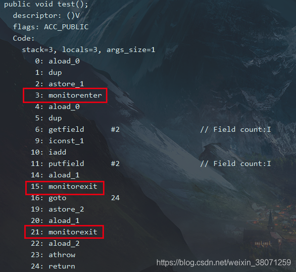

https://www.toutiao.com/a6916740022851060227/?channel=&source=search_tab

JDK内置隐式锁synchronized

synchronized   原理、锁升级、锁优化

# 1 简介
## 1.1 功能作用
在**并发场景**中，保证**同一时刻**只有**一个线程**对有**并发隐患的代码**进行操作。

## 1.2 错误案例
需求：两个线程对 count 变量进行200000次循环增加，预期结果是400000次
```java
public class SynchronizedDemo implements Runnable {
    private static int count = 0;
    static SynchronizedDemo synchronizedInstance = new SynchronizedDemo();
    public static void main(String[] args) {
        Thread t1 = new Thread(synchronizedInstance);
        Thread t2 = new Thread(synchronizedInstance);
        t1.start();
        t2.start();
        try {
            t1.join();
            t2.join();
            System.out.println("count 最终的值为： " + count);
        } catch (InterruptedException e) {
            e.printStackTrace();
        }
    }
    @Override
    public void run() {        
         for (int i = 0; i < 200000; i++) {
                count++;
         }        
    }
}
```
**结果** ：显然不等于400000次所以出现了运算错误
**原因**：count++;非原子操作，该语句包含三个操作：
1. 线程t1、t2 从主内存中获取共享变量count的值，到自己的工作内存中
2. 将自己的工作内存中的count值进行+1操作
3. 将修改完的count变量的值存入到主内存中

**注意**：他们是将自己工作内存中的值进行改变刷回主内存，假设当前count的值为8，t1、t2将count的值复制到自己的工作内存中进行修改，如果此时t1将count变成9、t2此时也将count的值变成9，当t1、t2两个线程都将值刷回主内存的时候count值为9，并不是10，这个时候就会造成最后的结果和预期的不一致。

## 1.3 正确案例
1. 代码块上加对象锁 this
```java
@Override
public void run() {
    synchronized (this) {
        for (int i = 0; i < 200000; i++) {
            count++;
        }
    }
}
```
2. 在普通方法上加锁
```java
@Override
public synchronized void run() {
    for (int i = 0; i < 200000; i++) {
            count++;
    }
}
```
3. 加.class锁
```java
@Override
public void run() {
    for (int i = 0; i < 200000; i++) {
        synchronized (SynchronizedDemo.class) {
            count++;
        }
    }
}
```

# 2 使用方式

对象锁、类锁

修饰代码块、普通方法、静态方法

**注意**：类锁和对象锁是两把不同的锁。
## 2.1 对象锁
### 2.1.1 修饰普通方法
**修饰普通方法默认锁对象为this当前实例对象**
public synchronized void method() ;在普通方法上面加synchronized
```java
public class SynchronizedDemo3 implements Runnable {
    static SynchronizedDemo3 synchronizedDemo3 = new SynchronizedDemo3();
    public synchronized void method() {
        System.out.println("线程名称" + Thread.currentThread().getName());
        try {
            Thread.sleep(3000);
        } catch (InterruptedException e) {
            e.printStackTrace();
        }
        System.out.println("线程名称" + Thread.currentThread().getName() + "运行完成");
    }
    @Override
    public void run() {
        method();
    }
    public static void main(String[] args) {
        Thread t1 = new Thread(synchronizedDemo3);
        t1.setName("我是线程 t1");
        Thread t2 = new Thread(synchronizedDemo3);
        t2.setName("我是线程 t2");
        t1.start();
        t2.start();
        try {
            t1.join();
            t2.join();
        } catch (InterruptedException e) {
            e.printStackTrace();
        }
    }
}
```
**输出结果**： 线程 t1 和线程 t2 执行过程是顺序执行的

### 2.1.2 修饰代码块
**锁对象是this当前对象**

**输出结果**：线程 t1 和线程 t2 执行过程是顺序执行的

**锁对象是自定义对象**

**输出结果**：线程 t1 和线程 t2 执行形成了顺序，这种情况下和this没有什么区别，但是如果是多个同步代码块的话就需要进行自定义对象锁了

**多个同步代码块使用自定义对象锁，（两个自定义对象锁对应两个同步代码块）**

**输出结果**：输出顺序线程t1 和线程t2 代码进行了交叉执行，出现了乱序

**多个同步代码块使用自定义对象锁（一个自定义对象锁对应两个同步代码块）**

**输出结果**：线程 t1 和线程 t2 执行形成了顺序

## 2.2 类锁
**特点**：类锁只能在同一时间被一个对象拥有（无论有多少个实例想访问也是一个对象持有它）
### 2.2.1 修饰静态方法
public static synchronized void method();
```java
public class SynchronizedDemo4 implements Runnable {
    private static SynchronizedDemo4 synchronizedInstance1 = new SynchronizedDemo4();
    private static SynchronizedDemo4 synchronizedInstance2 = new SynchronizedDemo4();
    public static synchronized void method() {
        System.out.println("线程名称" + Thread.currentThread().getName());
        try {
            Thread.sleep(3000);
        } catch (InterruptedException e) {
            e.printStackTrace();
        }
        System.out.println("线程名称" + Thread.currentThread().getName() + "运行完成");
    }
    @Override
    public void run() {
        method();
    }
    public static void main(String[] args) {
        Thread t1 = new Thread(synchronizedInstance1);
        t1.setName("我是线程 t1");
        Thread t2 = new Thread(synchronizedInstance2);
        t2.setName("我是线程 t2");
        t1.start();
        t2.start();
        try {
            t1.join();
            t2.join();
        } catch (InterruptedException e) {
            e.printStackTrace();
        }
    }
}
```
**输出结果**：线程 t1 和线程 t2 执行形成了顺序

### 2.2.1 指定锁对象为Class对象
synchronized (SynchronizedDemo5.class)
```java
public class SynchronizedDemo5 implements Runnable {
    private static SynchronizedDemo5 synchronizedInstance1 = new SynchronizedDemo5();
    private static SynchronizedDemo5 synchronizedInstance2 = new SynchronizedDemo5();
    void method() {
        synchronized (SynchronizedDemo5.class) { //类锁只有一把
            System.out.println("线程名称" + Thread.currentThread().getName());
            try {
                Thread.sleep(3000);
            } catch (InterruptedException e) {
                e.printStackTrace();
            }
            System.out.println("线程名称" + Thread.currentThread().getName() + "运行完成");
        }
    }
    @Override
    public void run() {
        method();
    }
    public static void main(String[] args) {
        Thread t1 = new Thread(synchronizedInstance1);
        t1.setName("我是线程 t1");
        Thread t2 = new Thread(synchronizedInstance2);
        t2.setName("我是线程 t2");
        t1.start();
        t2.start();
        try {
            t1.join();
            t2.join();
        } catch (InterruptedException e) {
            e.printStackTrace();
        }
    }
}
```
**输出结果**： 线程 t1 和线程 t2 执行形成了顺序

# 3 性质

可重入、不可中断（原子性）、是否公平？
## 3.1 可重入性
就是说你已经获取了一把锁，等想要再次请求的时候不需要释放这把锁和其他线程一起竞争该锁，可以直接使用该锁。好处：避免死锁；粒度：线程而非调用
demo1：证明同一个方法是可重入
```java
public class SynchronizedDemo6 {
    int count = 0;
    public static void main(String[] args) {
        SynchronizedDemo6 synchronizedDemo6 = new SynchronizedDemo6();
        synchronizedDemo6.method();
    }
    private synchronized void method() {
        System.out.println(count);
        if (count == 0) {
            count++;
            method();
        }
    }
}
```
输出：0 1
demo2：可重入不要求是同一个方法
```java
public class SynchronizedDemo7 {
    private synchronized void method1() {
        System.out.println("method1");
        method2();
    }
    private synchronized void method2() {
        System.out.println("method2");
    }
    public static void main(String[] args) {
        SynchronizedDemo7 synchronizedDemo7 = new SynchronizedDemo7();
        synchronizedDemo7.method1();
    }
}
```
输出：method1 method2
demo3：可重入不要求是同一个类中的
```java
public class SynchronizedDemo8 {
    public synchronized void doSomething() {
        System.out.println("我是父类方法");
    }
}
class childrenClass extends SynchronizedDemo8{
    public synchronized void doSomething() {
        System.out.println("我是子类方法");
        super.doSomething();
    }
    public static void main(String[] args) {
        childrenClass childrenClass = new childrenClass();
        childrenClass.doSomething();
    }
}
```
输出：我是子类方法  我是父类方法

## 3.2 不可中断
当A线程持有这把锁时，B线程如果也想要A线程持有的锁时只能等待，A永远不释放的话，那么B线程永远的等待下去。

# 4 底层实现原理

## 4.1 加锁和释放锁的原理
### 4.1.1 synchronized加在代码块上
```java
public void test() {
  synchronized(this){
    count++;
  }
}
```
利用 javap -verbose 类的名字查看编译后的文件：

**monitorenter**：每个对象都是一个监视器锁（monitor）。当monitor被占用时就会处于锁定状态，线程执行monitorenter指令时尝试获取monitor的所有权，过程如下:
1. 如果monitor的进入数为0，则该线程进入monitor，然后将进入数设置为1，该线程即为monitor的所有者
2. 如果线程已经占有该monitor，只是重新进入，则进入monitor的进入数加1**可重入性质**
3. 如果其他线程已经占用了monitor，则该线程进入阻塞状态，直到monitor的进入数为0，再重新尝试获取monitor的所有权。
**monitorexit**：执行monitorexit的线程必须是objectref所对应的monitor的所有者。指令执行时，monitor的进入数减1，如果减1后进入数为0，那线程退出monitor，不再是这个monitor的所有者。其他被这个monitor阻塞的线程可以尝试去获取这个 monitor 的所有权
**monitorexit指令出现了两次，第1次为同步正常退出释放锁；第2次为发生异步退出释放锁**

### 4.1.2  synchronized加在方法上
**无论时普通方法还是静态方法**

```java
public synchronized void test() {
  count++;
}
```
利用 javap -verbose 类的名字查看编译后的文件：

方法的同步并没有通过指令**monitorenter**和**monitorexit**来完成，不过相对于普通方法，其常量池中多了**ACC_SYNCHRONIZED**标示符。JVM就是根据该标示符来实现方法的同步的：当方法调用时，调用指令将会检查方法的** ACC_SYNCHRONIZED** 访问标志是否被设置，如果设置了，执行线程将先获取monitor，获取成功之后才能执行方法体，方法执行完后再释放monitor。在方法执行期间，其他任何线程都无法再获得同一个monitor对象，其实底层还是monitor对象锁。


# 5 JVM对synchronized的优化

从JDK6开始，就对synchronized的实现机制进行了较大调整，包括使用JDK5引进的CAS自旋之外，还增加了自适应的CAS自旋、锁消除、锁粗化、偏向锁、轻量级锁这些优化策略。所以synchronized关键字的优化使得性能极大提高，同时语义清晰、操作简单、无需手动关闭，所以推荐在允许的情况下尽量使用此关键字，同时在性能上此关键字还有优化的空间。
## 5.1 锁主要存在的四种状态
**无锁状态、偏向锁状态、轻量级锁状态、重量级锁状态**

**锁的膨胀过程：**
无锁状态 -> 偏向锁 -> 轻量级锁 -> 重量级锁
只能从低到高升级，不会出现锁的降级

## 5.2 自旋锁
所谓**自旋锁**，就是指当一个线程尝试获取某个锁时，如果该锁已被其他线程占用，就一直循环检测锁是否被释放，而不是进入线程挂起或睡眠状态。（减少线程切换）

**使用场景**： 自旋锁适用于锁保护的临界区很小的情况，临界区很小的话，锁占用的时间就很短。

**缺点**：虽然它可以避免线程切换带来的开销，但是它占用了CPU处理器的时间。如果持有锁的线程很快就释放了锁，那么自旋的效率就非常好，反之，自旋的线程就会白白消耗掉处理的资源，它不会做任何有意义的工作，所以增加了适应性自选锁

## 5.3 适应性自旋锁
所谓自适应就意味着自旋的次数不再是固定的，它是由前一次在同一个锁上的自旋时间及锁的拥有者的状态来决定。

线程如果自旋成功了，那么下次自旋的次数会更加多，因为上次成功了，那么此次自旋也很有可能会再次成功，那么它就会允许自旋等待持续的次数更多。反之，很少能够成功，那么以后自旋的次数会减少甚至省略掉自旋过程，以免浪费处理器资源。

## 5.4 锁消除
为了保证数据的完整性，在进行操作时需要对这部分操作进行同步控制，但是在有些情况下，JVM检测到不可能存在共享数据竞争，这是JVM会对这些同步锁进行锁消除。作为写程序的人应该会知道哪里存在数据竞争，不可能随便的加锁。

## 5.5 锁粗化
将多个连续的加锁、解锁操作连接在一起，扩展成一个范围更大的锁。虽然我们平时倡导把加锁的片段尽量小为了增加并发效率和性能。但是如果一系列的连续加锁解锁操作，可能会导致不必要的性能损耗，所以引入锁粗化。

## 5.6 偏向锁
在大多数情况下，锁不仅不存在多线程竞争，而且总是由同一线程多次获得，为了让线程获得锁的代价更低，引进了偏向锁。**偏向锁是在单线程执行代码块时使用的机制，如果在多线程并发的环境下（即线程A尚未执行完同步代码块，线程B发起了申请锁的申请），则一定会转化为轻量级锁或者重量级锁。**

引入偏向锁主要目的是：为了在没有多线程竞争的情况下尽量减少不必要的轻量级锁执行路径。因为轻量级锁的加锁解锁操作是需要依赖多次CAS原子指令的，而偏向锁只需要在置换ThreadID的时候依赖一次CAS原子指令。

当一个线程访问同步块并获取锁时，会在对象头和栈帧中的锁记录里存储锁偏向的线程ID，以后该线程进入和退出同步块时不需要花费CAS操作来争夺锁资源，只需要检查是否为偏向锁、锁标识为以及ThreadID即可，处理流程如下：
1. 暂停拥有偏向锁的线程
2. 判断锁对象是否还处于被锁定状态，否，则恢复到无锁状态（01），以允许其余线程竞争。是，则挂起持有锁的当前线程，并将指向当前线程的锁记录地址的指针放入对象头,升级为轻量级锁状态（00），然后恢复持有锁的当前线程，进入轻量级锁的竞争模式


## 5.7 轻量级锁
引入轻量级锁的主要目的是**在没有多线程竞争的前提下，减少传统的重量级锁使用操作系统互斥量产生的性能消耗**。当关闭偏向锁功能或者多个线程竞争偏向锁导致偏向锁升级为轻量级锁，则会尝试获取轻量级锁，其步骤如下：
1. 在线程进入同步块时，如果同步对象锁状态为无锁状态（锁标志位为“01”状态，是否为偏向锁为“0”），虚拟机首先将在当前线程的栈帧中建立一个名为锁记录（Lock Record）的空间，用于存储锁对象目前的Mark Word的复制。
2. 拷贝对象头中的Mark Word复制到锁记录（Lock Record）中。
3. 拷贝成功后，虚拟机将使用CAS操作尝试将对象Mark Word中的Lock Word更新为指向当前线程Lock Record的指针，并将Lock record里的owner指针指向object mark word。如果更新成功，则执行步骤（4），否则执行步骤（5）。
4. 如果这个更新动作成功了，那么当前线程就拥有了该对象的锁，并且对象Mark Word的锁标志位设置为“00”，即表示此对象处于轻量级锁定状态。
5. 如果这个更新操作失败了，虚拟机首先会检查对象Mark Word中的Lock Word是否指向当前线程的栈帧，如果是，就说明当前线程已经拥有了这个对象的锁，那就可以直接进入同步块继续执行。否则说明多个线程竞争锁，进入自旋执行（3），若自旋结束时仍未获得锁，轻量级锁就要膨胀为重量级锁，锁标志的状态值变为“10”，Mark Word中存储的就是指向重量级锁（互斥量）的指针，当前线程以及后面等待锁的线程也要进入阻塞状态。

**轻量级锁的释放也是通过CAS操作来进行的**，主要步骤如下：
1. 通过CAS操作尝试把线程中复制的Displaced Mark Word对象替换当前的Mark Word
2. 如果替换成功，整个同步过程就完成了，恢复到无锁状态（01）
3. 如果替换失败，说明有其他线程尝试过获取该锁（此时锁已膨胀），那就要在释放锁的同时，唤醒被挂起的线程

**问题**：为什么升级为轻量锁时要把对象头里的Mark Word复制到线程栈的锁记录中呢？
因为在申请对象锁时需要以该值作为CAS的比较条件，同时在升级到重量级锁时，能通过这个比较判定是否在持有锁的过程中此锁被其他线程申请过，如果被其他线程申请了，则在释放锁的时候要唤醒被挂起的线程。
为什么会尝试CAS不成功以及什么情况下会不成功？
CAS本身是不带锁机制的，其是通过比较来操作得。假设如下场景：线程A和线程B都在对象头里的锁标识为无锁状态进入，那么如线程A先更新对象头为其锁记录指针成功之后，线程B再用CAS去更新，就会发现此时的对象头已经不是其操作前的对象了，所以CAS会失败。也就是说，只有两个线程并发申请锁的时候会发生CAS失败。此时线程B进行CAS自旋，等待对象头的锁标识重新变回无锁状态或对象头内容等于对象，这也就意味着线程A执行结束，此时线程B的CAS操作终于成功了，于是线程B获得了锁以及执行同步代码的权限。如果线程A的执行时间较长，线程B经过若干次CAS时钟没有成功，则锁膨胀为重量级锁，即线程B被挂起阻塞、等待重新调度。

## 5.8 重量级锁
Synchronized是通过对象内部的一个叫做监视器锁（Monitor）来实现的。但是监视器锁本质又是依赖于底层的操作系统的Mutex Lock来实现的。而操作系统实现线程之间的切换这就需要从用户态转换到核心态，这个成本非常高,性能消耗特别严重。 因此，这种依赖于操作系统Mutex Lock所实现的锁我们称之为 “重量级锁”。

# 6  缺点
1. 效率低锁的释放情况少试图获取锁时不能设定超时不能中断一个正在试图获得锁的线程
2. 不够灵活加锁和释放锁的时候单一，每个锁仅有一个单一条件
3. 不知道是否成功获取锁