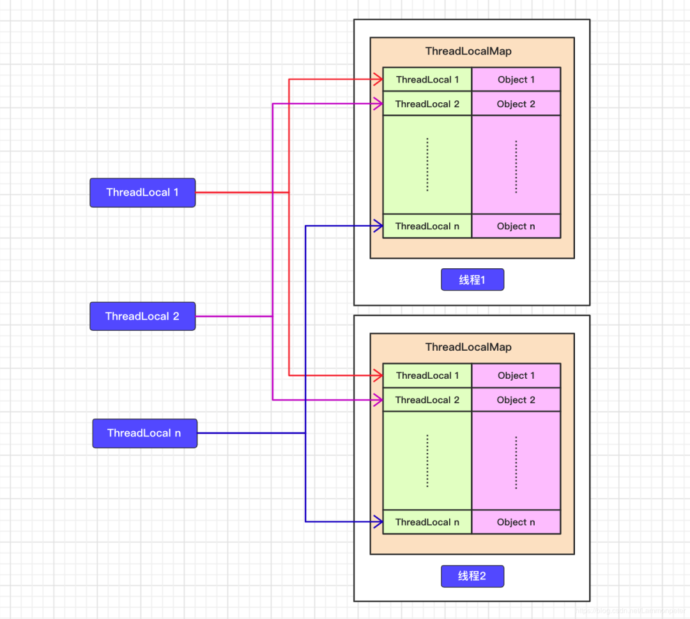
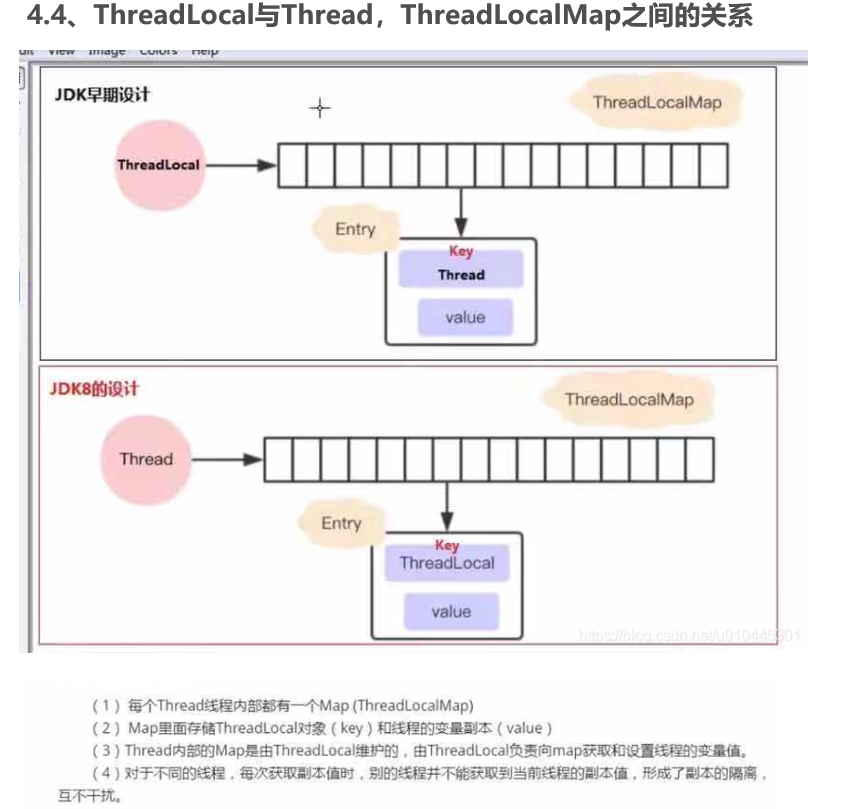

线程本地变量

https://www.toutiao.com/a6830638866429379080/?channel=&source=search_tab

https://www.toutiao.com/a6750511984854172173/?channel=&source=search_tab

https://blog.csdn.net/u010445301/article/details/111322569

[ThreadLocal的八个关键知识点](https://zhuanlan.zhihu.com/p/548757072)

`ThreadLocal`，即线程本地变量。如果你创建了一个`ThreadLocal`变量，那么访问这个变量的每个线程都会有这个变量的一个本地拷贝，多个线程操作这个变量的时候，实际是在操作自己本地内存里面的变量，从而起到**线程隔离**的作用，避免了并发场景下的线程安全问题。

# 1 问题场景

假如语文老师有一本书，但是班上有30名学生，老师将这本书送给学生们去阅读，30名学生都想阅读这本书。为保证每个学生都能阅读到书籍，那么基本可以有两种方案，一是按照某种排序（例如姓名首字母排序），让每个学生依次阅读。二是让30名学生同时争抢，谁抢到谁就去阅读，读完放回原处，剩下的29名学生再次争抢。显然第一种方案，基本表现为串行阅读，时间成本较大，第二种方案为多个学生争抢，容易发生安全问题（学生发生冲突或者书籍在争抢过程中被毁坏）。

为了解决这两个问题，那么有没有更加好的方案呢？当然有，老师可以将书籍复印30本，每个学生都发一本，这样既大大提高了阅读效率，节约了阅读时间，还能保证每个学生都能有自己的书籍，这样就不会发生争抢，避免了安全问题。

# 2 理解ThreadLocal的用法
使用固定线程数的线程池来执行格式化时间的任务。我们的基本思想是，使用ThreadLocal来给线程池中每个线程赋予一个SimpleDateFormat对象副本，该副本只能被当前线程使用，是当前线程独享的成员变量，当SimpleDateFormat对象不存在多线程共同访问的时候，也就不会产生线程安全问题了，我们使用ThreadLocal的目的是为了避免创建1000个SimpleDateFormat对象，且在不使用锁的情况下保证线程安全，那么如何实现只创建一个SimpleDateFormat对象且能被多个线程同时使用呢？改造后的案例代码如下所示：
```java
public class ThreadLocalUsage04 {
    public static ExecutorService THREAD_POOL = Executors.newFixedThreadPool(10);

    public static void main(String[] args) throws InterruptedException {
        for (int i = 0; i < 1000; i++) {
            int finalI = i;
            THREAD_POOL.submit(new Runnable() {
                @Override
                public void run() {
                    String date = new ThreadLocalUsage04().date(finalI);
                    System.out.println(date);
                }
            });
        }
        THREAD_POOL.shutdown();
    }

    private String date(int seconds) {
        // 参数的单位是毫秒，从1970.1.1 00:00:00 GMT计时
        Date date = new Date(1000 * seconds);
        SimpleDateFormat simpleDateFormat = ThreadSafeDateFormatter.dateFormatThreadLocal.get();
        return simpleDateFormat.format(date);
    }

}

class ThreadSafeDateFormatter {
    public static ThreadLocal<SimpleDateFormat> dateFormatThreadLocal = new ThreadLocal<SimpleDateFormat>() {
        @Override
        protected SimpleDateFormat initialValue() {
            return new SimpleDateFormat("yyyy-MM-dd HH:mm:ss");
        }
    };
}
```
上面的代码使用到了ThreadLocal，将SimpleDateFormat对象用ThreadLocal包装了一层，使得多个线程内部都有一个SimpleDateFormat对象副本，每个线程使用自己的SimpleDateFormat，这样就不会产生线程安全问题了。那么以上介绍的是ThreadLocal的第一大场景的使用，也就是利用到了ThreadLocal的initialValue()方法，使得每个线程内都具备了一个SimpleDateFormat副本。

**应用场景**

- 场景一：通常多线程之间需要拥有同一个对象的副本，那么通常就采用initialValue()方法进行初始化，直接将需要拥有的对象存储到ThreadLocal中。
- 场景二：如果多个线程中存储不同的信息，为了方便在其他方法里面获取到信息，那么这种场景适合使用set()方法。例如，在拦截器生成的用户信息，用ThreadLocal.set直接放入到ThreadLocal中去，以便在后续的方法中取出来使用。实例需要在多个方法中共享，但不希望被多线程共享。再比如数据库连接池，是将connection放进threadlocal里的，以保证每个线程从连接池中获得的都是线程自己的connection。

# 3 理解ThreadLocal原理
## 3.1 理解ThreadLocalMap数据结构
接下来，我们来一起阅读ThreadLocal源码，从源码角度来真正理解ThreadLocal。在阅读源码之前，先看一张图:




上图中基本描述出了Thread、ThreadLocalMap以及ThreadLocal三者之间的包含关系。Thread类对象中维护了ThreadLocalMap成员变量，而ThreadLocalMap维护了以ThreadLocal为key，需要存储的数据为value的Entry数组。这是它们三者之间的基本包含关系，我们需要进一步到源码中寻找踪迹。查看Thread类，内部维护了两个变量，threadLocals和inheritableThreadLocals，它们的默认值是null，它们的类型是ThreadLocal.ThreadLocalMap，也就是ThreadLocal类的一个静态内部类ThreadLocalMap。在静态内部类ThreadLocalMap维护一个数据结构类型为Entry的数组，节点类型如下代码所示：

```java
static class Entry extends WeakReference<ThreadLocal<?>> {
    /** The value associated with this ThreadLocal. */
    Object value;
    Entry(ThreadLocal<?> k, Object v) {
        super(k);	
        value = v;
    }
}
```
从源码中我们可以看到，Entry结构实际上是继承了一个ThreadLocal类型的弱引用并将其作为key，value为Object类型。这里使用弱引用是否会产生问题，我们这里暂时不讨论，在文章结束的时候一起讨论一下，暂且可以理解key就是ThreadLocal对象。对于ThreadLocalMap，我们一起来了解一下其内部的变量：
```java
// 默认的数组初始化容量
private static final int INITIAL_CAPACITY = 16;
// Entry数组，大小必须为2的幂
private Entry[] table;
// 数组内部元素个数
private int size = 0;
// 数组扩容阈值，默认为0，创建了ThreadLocalMap对象后会被重新设置
private int threshold;
```
这几个变量和HashMap中的变量十分类似，功能也类似。ThreadLocalMap的构造方法如下所示：
```java
/**
 * Construct a new map initially containing (firstKey, firstValue).
 * ThreadLocalMaps are constructed lazily, so we only create
 * one when we have at least one entry to put in it.
 */
ThreadLocalMap(ThreadLocal<?> firstKey, Object firstValue) {
    // 初始化Entry数组，大小 16
    table = new Entry[INITIAL_CAPACITY];
    // 用第一个键的哈希值对初始大小取模得到索引，和HashMap的位运算代替取模原理一样
    int i = firstKey.threadLocalHashCode & (INITIAL_CAPACITY - 1);
    // 将Entry对象存入数组指定位置
    table[i] = new Entry(firstKey, firstValue);
    size = 1;
    // 初始化扩容阈值，第一次设置为10
    setThreshold(INITIAL_CAPACITY);
}
```
从构造方法的注释中可以了解到，该构造方法是**懒加载**的，只有当我们创建一个Entry对象并需要放入到Entry数组的时候才会去初始化Entry数组。分析到这里，也许我们都有一个疑问，平常使用ThreadLocal功能都是借助ThreadLocal对象来操作的，比如set、get、remove等，使用上都屏蔽了ThreadLocalMap的API，那么到底是如何做到的呢？我们一起继续看下面的代码。

> 所以，怎么回答ThreadLocal原理？要答出这几个点： 

- Thread类有一个类型为ThreadLocal.ThreadLocalMap的实例变量threadLocals，每个线程都有一个属于自己的ThreadLocalMap。
- ThreadLocalMap内部维护着Entry数组，每个Entry代表一个完整的对象，key是ThreadLocal的弱引用，value是ThreadLocal的泛型值。
- 每个线程在往ThreadLocal里设置值的时候，都是往自己的ThreadLocalMap里存，读也是以某个ThreadLocal作为引用，在自己的map里找对应的key，从而实现了线程隔离。
- ThreadLocal本身不存储值，它只是作为一个key来让线程往ThreadLocalMap里存取值。

## 3.2 理解ThreadLocal类set方法
试想我们一个请求对应一个线程，我们可能需要在请求到达拦截器之后，可能需要校验当前请求的用户信息，那么校验通过的用户信息通常都放入到ThreadLocalMap中，以方便在后续的方法中直接从ThreadLocalMap中获取,但是我们并没有直接操作ThreadLocalMap来存取数据，而是通过一个静态的ThreadLocal变量来操作，我们从上面的图可以看出，ThreadLocalMap中存储的键其实就是ThreadLocal的弱引用所关联的对象，那么键是如何操作类似HashMap的值的呢？我们一起来分析一下set方法：
```java
public void set(T value) {
    // 首先获取调用此方法的线程
    Thread t = Thread.currentThread();
    // 将线程传递到getMap方法中来获取ThreadLocalMap，其实就是获取到当前线程的成员变量threadLocals所指向的ThreadLocalMap对象
    ThreadLocalMap map = getMap(t);
    // 判断Map是否为空
    if (map != null)
        // 如果Map为不空，说明当前线程内部已经有ThreadLocalMap对象了，那么直接将本ThreadLocal对象作为键，存入的value作为值存储到ThreadLocalMap中
        map.set(this, value);
    else
        // 创建一个ThreadLocalMap对象并将值存入到该对象中，并赋值给当前线程的threadLocals成员变量
        createMap(t, value);
}

// 获取到当前线程的成员变量threadLocals所指向的ThreadLocalMap对象
ThreadLocalMap getMap(Thread t) {
    return t.threadLocals;
}

// 创建一个ThreadLocalMap对象并将值存入到该对象中，并赋值给当前线程的threadLocals成员变量
void createMap(Thread t, T firstValue) {
    t.threadLocals = new ThreadLocalMap(this, firstValue);
}
```
上面的set方法是ThreadLocal的set方法，就是为了将指定的值存入到指定线程的threadLocals成员变量所指向的ThreadLocalMap对象中，那么具体是如何存取的，其实调用的还是ThreadLocalMap的set方法，源码分析如下：
```java
private void set(ThreadLocal<?> key, Object value) {

    // We don't use a fast path as with get() because it is at
    // least as common to use set() to create new entries as
    // it is to replace existing ones, in which case, a fast
    // path would fail more often than not.

    Entry[] tab = table;
    int len = tab.length;
    // 计算当前ThreadLocal对象作为键在Entry数组中的下标索引
    int i = key.threadLocalHashCode & (len-1);

    // 线性遍历，首先获取到指定下标的Entry对象，如果不为空，则进入到for循环体内，
    // 判断当前的ThreadLocal对象是否是同一个对象，如果是，那么直接进行值替换，并结束方法，
    // 如果不是，再判断当前Entry的key是否失效，如果失效，则直接将失效的key和值进行替换。
    // 这两点都不满足的话，那么就调用nextIndex方法进行搜寻下一个合适的位置，进行同样的操作，
    // 直到找到某个位置，内部数据为空，也就是Entry为null，那么就直接将键值对设置到这个位置上。
    // 最后判断是否达到了扩容的条件，如果达到了，那么就进行扩容。
    for (Entry e = tab[i]; e != null; e = tab[i = nextIndex(i, len)]) {
        ThreadLocal<?> k = e.get();

        if (k == key) {
            e.value = value;
            return;
        }

        if (k == null) {
            replaceStaleEntry(key, value, i);
            return;
        }
    }
    tab[i] = new Entry(key, value);
    int sz = ++size;
    if (!cleanSomeSlots(i, sz) && sz >= threshold)
        rehash();
}
```
这里的代码核心的地方就是for循环这一块，代码上面加了详细的注释，这里在复述一遍：

线性遍历，首先获取到指定下标的Entry对象，如果不为空，则进入到for循环体内，判断当前的ThreadLocal对象是否是同一个对象，如果是，那么直接进行值替换，并结束方法。如果不是，再判断当前Entry的key是否失效，如果失效，则直接将失效的key和值进行替换。这两点都不满足的话，那么就调用nextIndex方法进行搜寻下一个合适的位置，进行同样的操作，直到找到某个位置，内部数据为空，也就是Entry为null，那么就直接将键值对设置到这个位置上。最后判断是否达到了扩容的条件，如果达到了，那么就进行扩容。

这里有两点需要注意：一是nextIndex方法，二是key失效，这里先解释第一个注意点，第二个注意点涉及到弱引用JVM GC问题，文章最后做出解释。

nextIndex方法的具体代码如下所示：

```java
private static int nextIndex(int i, int len) {
    return ((i + 1 < len) ? i + 1 : 0);
}
```
其实就是寻找下一个合适位置，找到最后一个后还不合适的话，那么从数组头部重新开始找，且一定可以找到，因为存在扩容阈值，数组必定有冗余的位置存放当前键值对所对应的Entry对象。其实nextIndex方法就是大名鼎鼎的『开放寻址法』的应用。这一点和HashMap不一样，HashMap存储HashEntry对象发生哈希冲突的时候采用的是拉链法进行存储，而这里是去寻找下一个合适的位置，思想就是『开放寻址法』。

**ThreadLocalMap 采用开放地址法原因**

1. ThreadLocal 中看到一个属性 HASH_INCREMENT = 0x61c88647 ，0x61c88647 是一个神奇的数字，让哈希码能均匀的分布在2的N次方的数组里, 即 Entry[] table，关于这个神奇的数字google 有很多解析，这里就不重复说了。
```java
private static final int HASH_INCREMENT = 0x61c88647;    
private static int nextHashCode() {
    return nextHashCode.getAndAdd(HASH_INCREMENT);
}
```

2. ThreadLocal 往往存放的数据量不会特别大（而且key 是弱引用又会被垃圾回收，及时让数据量更小），这个时候开放地址法简单的结构会显得更省空间，同时数组的查询效率也是非常高，加上第一点的保障，冲突概率也低

**扩容**

在ThreadLocalMap.set()方法的最后，如果执行完启发式清理工作后，未清理到任何数据，且当前散列数组中`Entry`的数量已经达到了列表的扩容阈值`(len*2/3)`，就开始执行`rehash()`逻辑：

```java
if (!cleanSomeSlots(i, sz) && sz >= threshold)
    rehash();
```

再着看rehash()具体实现：这里会先去清理过期的Entry，然后还要根据条件判断`size >= threshold - threshold / 4` 也就是`size >= threshold* 3/4`来决定是否需要扩容。

```java
private void rehash() {
    //清理过期Entry
    expungeStaleEntries();
    //扩容
    if (size >= threshold - threshold / 4)
        resize();
}
```

接着看看具体的`resize()`方法，扩容后的`newTab`的大小为老数组的两倍，然后遍历老的table数组，散列方法重新计算位置，开放地址解决冲突，然后放到新的`newTab`，遍历完成之后，`oldTab`中所有的`entry`数据都已经放入到`newTab`中了，然后table引用指向`newTab`。


## 3.3 理解ThreadLocal类get方法

在实际的开发中，我们往往需要在代码中调用ThreadLocal对象的get方法来获取存储在ThreadLocalMap中的数据，具体的源码如下所示：
```java
public T get() {
    // 获取当前线程的ThreadLocalMap对象
    Thread t = Thread.currentThread();
    ThreadLocalMap map = getMap(t);
    if (map != null) {
        // 如果map不为空，那么尝试获取Entry数组中以当前ThreadLocal对象为键的Entry对象
        ThreadLocalMap.Entry e = map.getEntry(this);
        if (e != null) {
            // 如果找到，那么直接返回value
            @SuppressWarnings("unchecked")
            T result = (T)e.value;
            return result;
        }
    }
    // 如果Map为空或者在Entry数组中没有找到以当前ThreadLocal对象为键的Entry对象，
    // 那么就在这里进行值初始化，值初始化的过程是将null作为值，当前ThreadLocal对象作为键，
    // 存入到当前线程的ThreadLocalMap对象中
    return setInitialValue();
}

// 值初始化过程
private T setInitialValue() {
    T value = initialValue();
    Thread t = Thread.currentThread();
    ThreadLocalMap map = getMap(t);
    if (map != null)
        map.set(this, value);
    else
        createMap(t, value);
    return value;
}
```
值初始化过程是这样的一个过程，如果调用新的ThreadLocal对象的get方法，那么在当前线程的成员变量threadLocals中必定不存在key为当前ThreadLocal对象的Entry对象，那么这里值初始话就将此ThreadLocal对象作为key，null作为值存储到ThreadLocalMap的Entry数组中。

## 3.4 理解ThreadLocal的remove方法
使用ThreadLocal这个工具的时候，一般提倡使用完后及时清理存储在ThreadLocalMap中的值，防止内存泄露。这里一起来看下ThreadLocal的remove方法。
```java
public void remove() {
    ThreadLocalMap m = getMap(Thread.currentThread());
    if (m != null)
        m.remove(this);
}

// 具体的删除指定的值，也是通过遍历寻找，找到就删除，找不到就算了
private void remove(ThreadLocal<?> key) {
    Entry[] tab = table;
    int len = tab.length;
    int i = key.threadLocalHashCode & (len-1);
    for (Entry e = tab[i]; e != null; e = tab[i = nextIndex(i, len)]) {
        if (e.get() == key) {
            e.clear();
            expungeStaleEntry(i);
            return;
        }
    }
}
```
看了这么多ThreadLocal的源码实现，其实原理还是很简单的，基本上可以说是一看就懂，理解ThreadLocal原理，其实就是需要理清Thread、ThreadLocal、ThreadLocalMap三者之间的关系

这里加以总结：线程类Thread内部持有ThreadLocalMap的成员变量，而ThreadLocalMap是ThreadLocal的内部类，ThreadLocal操作了ThreadLocalMap对象内部的数据，对外暴露的都是ThreadLocal的方法API，隐藏了ThreadLocalMap的具体实现，理清了这一点，ThreadLocal就很容易理解了。

# 4 ThreadLocal常见问题

## 4.1 内存泄漏
**内存泄漏原因**：`ThreadLocalMap`使用`ThreadLocal`的**弱引用**作为`key`，当`ThreadLocal`变量被手动设置为`null`，即一个`ThreadLocal`没有外部强引用来引用它，当系统GC时，`ThreadLocal`一定会被回收。这样的话，`ThreadLocalMap`中就会出现`key`为`null`的`Entry`，就没有办法访问这些`key`为`null`的`Entry`的`value`，如果当前线程再迟迟不结束的话(比如线程池核心线程)，这些`key`为`null`的`Entry`的`value`就会一直存在一条强引用链：Thread变量 -> Thread对象 -> ThreaLocalMap -> Entry -> value -> Object 永远无法回收，造成内存泄漏。

ThreadLocal内存泄露问题，其实都是从ThreadLocalMap中的一段代码说起的，这段代码就是Entry的构造方法：

```java
static class Entry extends WeakReference<ThreadLocal<?>> {
    /** The value associated with this ThreadLocal. */
    Object value;

    Entry(ThreadLocal<?> k, Object v) {
        super(k);
        value = v;
    }
}
```
这里简单介绍一下Java内的四大引用：
- 强引用：Java中默认的引用类型，一个对象如果具有强引用那么只要这种引用还存在就不会被回收。比如String str = new String("Hello ThreadLocal");，其中str就是一个强引用，当然，一旦强引用出了其作用域，那么强引用随着方法弹出线程栈，那么它所指向的对象将在合适的时机被JVM垃圾收集器回收。
- 软引用：如果一个对象具有软引用，在JVM发生内存溢出之前（即内存充足够使用），是不会GC这个对象的；只有到JVM内存不足的时候才会调用垃圾回收期回收掉这个对象。软引用和一个引用队列联合使用，如果软引用所引用的对象被回收之后，该引用就会加入到与之关联的引用队列中。
- 弱引用：这里讨论ThreadLocalMap中的Entry类的重点，如果一个对象只具有弱引用，那么这个对象就会被垃圾回收器回收掉（被弱引用所引用的对象只能生存到下一次GC之前，当发生GC时候，无论当前内存是否足够，弱引用所引用的对象都会被回收掉）。弱引用也是和一个引用队列联合使用，如果弱引用的对象被垃圾回收期回收掉，JVM会将这个引用加入到与之关联的引用队列中。若引用的对象可以通过弱引用的get方法得到，当引用的对象被回收掉之后，再调用get方法就会返回null。
- 虚引用：虚引用是所有引用中最弱的一种引用，其存在就是为了将关联虚引用的对象在被GC掉之后收到一个通知。

我们从ThreadLocal的内部静态类Entry的代码设计可知，ThreadLocal的引用k通过构造方法传递给了Entry类的父类WeakReference的构造方法，从这个层面来说，可以理解ThreadLocalMap中的键是ThreadLocal的弱引用。当一个线程调用ThreadLocal的set方法设置变量的时候，当前线程的ThreadLocalMap就会存放一个记录，这个记录的键为ThreadLocal的弱引用，value就是通过set设置的值，这个value值被强引用。如果当前线程一直存在且没有调用该ThreadLocal的remove方法，如果这个时候别的地方还有对ThreadLocal的引用，那么当前线程中的ThreadLocalMap中会存在对ThreadLocal变量的引用和value对象的引用，是不会释放的，就会造成内存泄漏。考虑这个ThreadLocal变量没有其他强依赖，如果当前线程还存在，由于线程的ThreadLocalMap里面的key是弱引用，所以当前线程的ThreadLocalMap里面的ThreadLocal变量的弱引用在垃圾回收的时候就被回收，但是对应的value还是存在的这就可能造成内存泄漏（因为这个时候ThreadLocalMap会存在key为null但是value不为null的entry项）。

总结：ThreadLocalMap中的Entry的key使用的是ThreadLocal对象的弱引用，在没有其他地方对ThreadLocal依赖，ThreadLocalMap中的ThreadLocal对象就会被回收掉，但是对应的值不会被回收，这个时候Map中就可能存在key为null但是值不为null的项，所以在使用ThreadLocal的时候要养成及时remove的习惯。

> 连环炮：那为什么key还要设计成弱引用？ 

key设计成弱引用同样是为了防止内存泄漏。假如key被设计成强引用，如果ThreadLocal Reference被销毁，此时它指向ThreadLoca的强引用就没有了，但是此时key还强引用指向ThreadLoca，就会导致ThreadLocal不能被回收，这时候就发生了内存泄漏的问题。

- 如果`Key`使用强引用：当`ThreadLocal`的对象被回收了，但是`ThreadLocalMap`还持有`ThreadLocal`的强引用的话，如果没有手动删除，ThreadLocal就不会被回收，会出现Entry的内存泄漏问题。
- 如果`Key`使用弱引用：当`ThreadLocal`的对象被回收了，因为`ThreadLocalMap`持有ThreadLocal的弱引用，即使没有手动删除，ThreadLocal也会被回收。`value`则在下一次`ThreadLocalMap`调用`set,get，remove`的时候会被清除。

因此可以发现，使用弱引用作为`Entry`的`Key`，可以多一层保障：弱引用`ThreadLocal`不会轻易内存泄漏，对应的`value`在下一次`ThreadLocalMap`调用`set,get,remove`的时候会被清除。

> key是弱引用，GC回收会影响ThreadLocal的正常工作吗？

`ThreadLocal`的`key`既然是**弱引用**.会不会GC贸然把`key`回收掉，进而影响`ThreadLocal`的正常使用？

- **弱引用**:具有弱引用的对象拥有更短暂的生命周期。如果一个对象只有弱引用存在了，则下次GC**将会回收掉该对象**（不管当前内存空间足够与否）

其实不会的，因为有`ThreadLocal变量`引用着它，是不会被GC回收的，除非手动把`ThreadLocal变量设置为null`，我们可以跑个demo来验证一下：

```java
public class WeakReferenceTest {
    public static void main(String[] args) {
        Object object = new Object();
        WeakReference<Object> testWeakReference = new WeakReference<>(object);
        System.out.println("GC回收之前，弱引用："+testWeakReference.get());
        //触发系统垃圾回收
        System.gc();
        System.out.println("GC回收之后，弱引用："+testWeakReference.get());
        //手动设置为object对象为null
        object=null;
        System.gc();
        System.out.println("对象object设置为null，GC回收之后，弱引用："+testWeakReference.get());
    }
}
运行结果：
GC回收之前，弱引用：java.lang.Object@7b23ec81
GC回收之后，弱引用：java.lang.Object@7b23ec81
对象object设置为null，GC回收之后，弱引用：null
```

**ThreadLocal会发生内存泄漏吗？**

会，仔细看下ThreadLocal内存结构就会发现，Entry数组对象通过ThreadLocalMap最终被Thread持有，并且是强引用。也就是说Entry数组对象的生命周期和当前线程一样。即使ThreadLocal对象被回收了，Entry数组对象也不一定被回收，这样就有可能发生内存泄漏。ThreadLocal在设计的时候就提供了一些补救措施：Entry的key是弱引用的ThreadLocal对象，很容易被回收，导致key为null（但是value不为null）。所以在调用get()、set(T)、remove()等方法的时候，会自动清理key为null的Entity。remove()方法就是用来清理无用对象，防止内存泄漏的。所以每次用完ThreadLocal后需要手动remove()。

有些文章认为是弱引用导致了内存泄漏，其实是不对的。假设把弱引用变成强引用，这样无用的对象key和value都不为null，反而不利于GC，只能通过remove()方法手动清理，或者等待线程结束生命周期。也就是说**ThreadLocalMap的生命周期由持有它的线程来决定，线程如果不进入terminated状态，ThreadLocalMap就不会被GC回收，这才是ThreadLocal内存泄露的原因。**

## 4.2 与线程池
与线程池配合使用：由于线程复用，存在数据覆盖问题，使用前set初始化

**ThreadLocal 内存溢出问题**

通过上面的分析，我们知道expungeStaleEntry() 方法是帮助垃圾回收的，根据源码，我们可以发现 get 和set 方法都可能触发清理方法expungeStaleEntry()，所以正常情况下是不会有内存溢出的 但是如果我们没有调用get 和set 的时候就会可能面临着内存溢出，养成好习惯不再使用的时候调用remove(),加快垃圾回收，避免内存溢出。退一步说，就算我们没有调用get 和set 和remove 方法,线程结束的时候，也就没有强引用再指向ThreadLocal 中的ThreadLocalMap了，这样ThreadLocalMap 和里面的元素也会被回收掉，但是有一种危险是，如果线程是线程池的， 在线程执行完代码的时候并没有结束，只是归还给线程池，这个时候ThreadLocalMap 和里面的元素是不会回收掉的。

## 4.3 InheritableThreadLocal
父线程能用ThreadLocal来给子线程传值吗？毫无疑问，不能。那该怎么办？`InheritableThreadLocal`。

使用起来很简单，在主线程的InheritableThreadLocal实例设置值，在子线程中就可以拿到了。

```java
public class InheritableThreadLocalTest {    
    public static void main(String[] args) {
        final ThreadLocal threadLocal = new InheritableThreadLocal();
        // 主线程
        threadLocal.set("不擅技术");
        //子线程
        Thread t = new Thread() {
            @Override
            public void run() {
                super.run();
                System.out.println("鄙人三某 ，" + threadLocal.get());
            }
        };
        t.start();
    }
}
```

原理很简单，在Thread类里还有另外一个变量：

```text
ThreadLocal.ThreadLocalMap inheritableThreadLocals = null;
```

在Thread.init的时候，如果父线程的`inheritableThreadLocals`不为空，就把它赋给当前线程（子线程）的`inheritableThreadLocals`。

```java
if (inheritThreadLocals && parent.inheritableThreadLocals != null)
this.inheritableThreadLocals =ThreadLocal.createInheritedMap(parent.inheritableThreadLocals);
```

## 4.4 为什么用弱引用？
试问一个问题：如果应用程序觉得ThreadLocal对象的使命完成，将threadLocal ref 设置为null，如果Entry中引用ThreadLocald对象的引用类型设置为强引用的话，会发生什么问题？

答案是：ThreadLocal对象会无法被垃圾回收器回收，因为从thread对象出发，有强引用指向threadlocal obj。此时会违背用户的初衷，造成所谓的内存泄露。由于ThreadLocalMap中的key是指向ThreadLocal，故从设计角度来看，设计为弱引用，将不会干扰用户的释放ThreadLocal意图。

## 4.5 ThreadLocal和synchronized比较

其实它们的实现思想不一样。

1、Synchronized用于线程间的数据共享，而ThreadLocal则用于线程间的数据隔离。

2、Synchronized是利用锁的机制，使变量或代码块在某一时该只能被一个线程访问，所以变量只需要存一份，算是一种时间换空间的思想。而ThreadLocal为每一个线程都提供了变量的副本，使得每个线程在某一时间访问到的并不是同一个对象，这样就隔离了多个线程对数据的数据共享，多个线程互不影响，算是一种空间换时间的思想。而Synchronized却正好相反，它用于在多个线程间通信时能够获得数据共享。

## 4.6 为什么不直接用线程id作为ThreadLocalMap的key？

一个使用类，有两个共享变量，也就是说用了两个`ThreadLocal`成员变量的话。如果用线程`id`作为`ThreadLocalMap`的`key`，怎么区分哪个`ThreadLocal`成员变量呢？因此还是需要使用`ThreadLocal`作为`Key`来使用。每个`ThreadLocal`对象，都可以由`threadLocalHashCode`属性**唯一区分**的，每一个ThreadLocal对象都可以由这个对象的名字唯一区分。

# 5 其他ThreadLocal实现

**Netty 的 FastThreadLocal**：对 JDK 中 ThreadLocal 进行优化，由于 ThreadLocal 底层存储数据是一个 ThreadLocalMap 结构，是一个数组结构，通过 threadLocalHashCode 查找在数组中的元素 Entry, 当 hash 冲突时，继续向前检测查找，所以当 Hash 冲突时，检索的效率就会降低。而 FastThreadLocal 则正是处理了这个问题，使其时间复杂度一直为 O(1)。 

**TransmittableThreadLocal：TransmittableThreadLocal** 是 Alibaba 开源的、用于解决 **“在使用线程池等会缓存线程的组件情况下传递 ThreadLocal”** 问题的 InheritableThreadLocal 扩展。JDK 的 InheritableThreadLocal 类可以完成父线程到子线程的值传递。但对于使用线程池等会池化复用线程的组件的情况，线程由线程池创建好，并且线程是池化起来反复使用的；这时父子线程关系的 ThreadLocal 值传递已经没有意义，应用需要的实际上是把 **任务提交给线程池时的 ThreadLocal 值传递**到 **任务执行时**。原理是使用 TtlRunnable/Ttlcallable 包装了 Runnable/Callable 类。