线程池

https://www.toutiao.com/i6960567839778472460/

原理源码

线程池状态、池中线程状态、池中任务状态

JDK线程池 Executor Executors ThreadPoolExecutor CompletionService

参数

与ThreadLocal 

调优池大小设置

Spring中线程池 异步任务

手写实现

面试题 https://www.toutiao.com/i6922686849613840899/

# 1 初识线程池
我们知道，线程的创建和销毁都需要映射到操作系统，因此其代价是比较高昂的。出于避免频繁创建、销毁线程以及方便线程管理的需要，线程池应运而生。

# 2  线程池优势
- **降低资源消耗**：线程池通常会维护一些线程（数量为 corePoolSize），这些线程被重复使用来执行不同的任务，任务完成后不会销毁。在待处理任务量很大的时候，通过对线程资源的复用，避免了线程的频繁创建与销毁，从而降低了系统资源消耗。
- **提高响应速度**：由于线程池维护了一批 alive 状态的线程，当任务到达时，不需要再创建线程，而是直接由这些线程去执行任务，从而减少了任务的等待时间。
- **提高线程的可管理性**：使用线程池可以对线程进行统一的分配，调优和监控。

# 3 线程池设计思路
有句话叫做艺术来源于生活，编程语言也是如此，很多设计思想能映射到日常生活中，比如面向对象思想、封装、继承，等等。今天我们要说的线程池，它同样可以在现实世界找到对应的实体——工厂。
先假想一个工厂的生产流程：

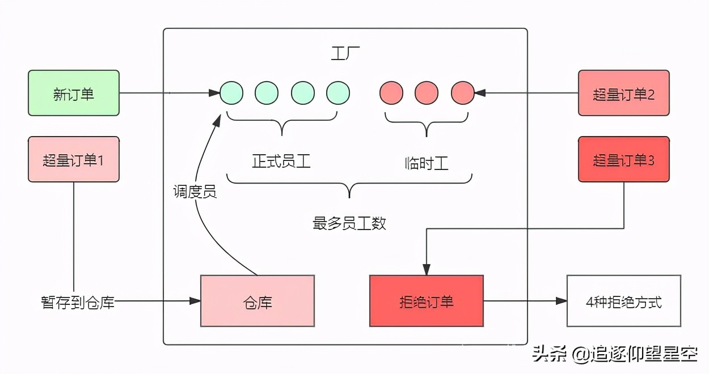
工厂中有固定的一批工人，称为正式工人，工厂接收的订单由这些工人去完成。当订单增加，正式工人已经忙不过来了，工厂会将生产原料暂时堆积在仓库中，等有空闲的工人时再处理（因为工人空闲了也不会主动处理仓库中的生产任务，所以需要调度员实时调度）。仓库堆积满了后，订单还在增加怎么办？工厂只能临时扩招一批工人来应对生产高峰，而这批工人高峰结束后是要清退的，所以称为临时工。当时临时工也已招满后（受限于工位限制，临时工数量有上限），后面的订单只能忍痛拒绝了。

我们做如下一番映射：

工厂——线程池

订单——任务（Runnable）

正式工人——核心线程

临时工——普通线程

仓库——任务队列

调度员——getTask()

getTask()是一个方法，将任务队列中的任务调度给空闲线程，在解读线程池有详细介绍。

映射后，形成线程池流程图如下，两者是不是有异曲同工之妙？

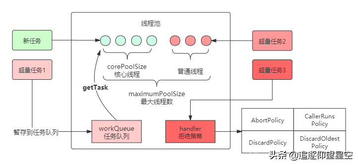

这样，线程池的**工作原理**或者说流程就很好理解了，提炼成一个简图：

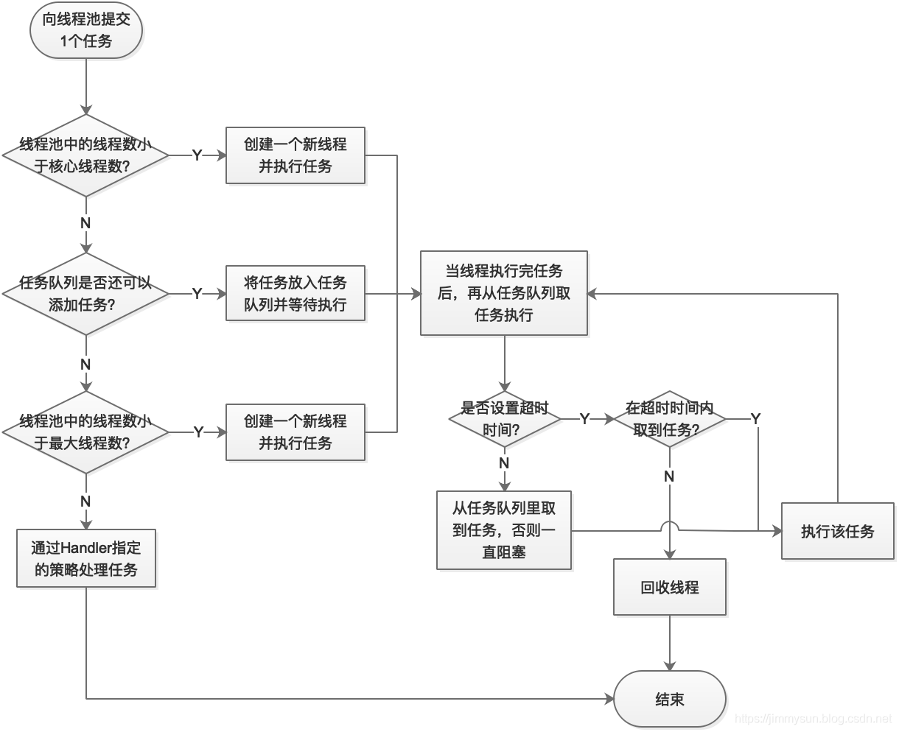

**线程池创建过程**：创建一个阻塞队列以容纳任务，在第一次执行任务时创建足够多的线程(不超过许可线程数)，并处理任务，之后每个工作线程自行从任务队列中获得任务，知道任务队列中的任务数量为0为止，此时线程将出于等待状态，一旦有任务再加入队列中，即唤醒工作线程进行处理，实现线程的可复用性。

**线程池的管理过程**：首先创建线程池，然后根据任务的数量逐步将线程增大到corePoolSize数量，如果此时仍有任务增加，则放置到workQueue中，直到workQueue爆满为止，然后继续增加池中的线程数量，最终到达maximumPoolSize，那如果此时还有任务要增加进来，就需要拒绝策略handler来处理了，或者丢弃新任务或者挤占已有任务或者抛异常。

# 4 深入线程池

JDK线程池类结构：

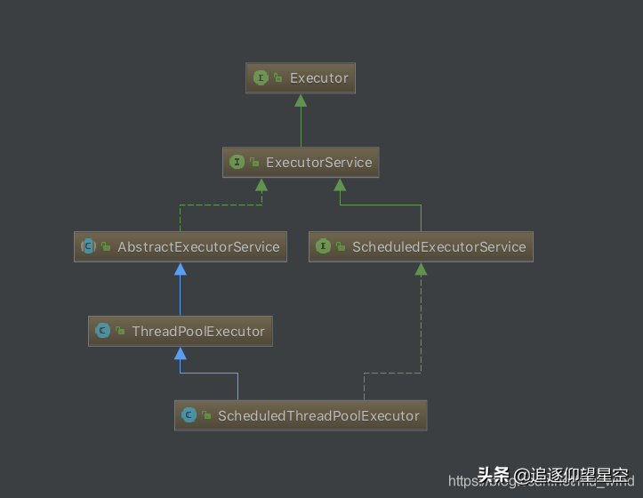

从Java线程池Executor框架体系可以看出：线程池的真正实现类是ThreadPoolExecutor，因此我们接下来重点研究这个类。

## 4.1 构造方法
```java
public ThreadPoolExecutor(int corePoolSize,
                          int maximumPoolSize,
                          long keepAliveTime,
                          TimeUnit unit,
                          BlockingQueue<Runnable> workQueue,
                          ThreadFactory threadFactory,
                          RejectedExecutionHandler handler) {
    if (corePoolSize < 0 ||
        maximumPoolSize <= 0 ||
        maximumPoolSize < corePoolSize ||
        keepAliveTime < 0)
        throw new IllegalArgumentException();
    if (workQueue == null || threadFactory == null || handler == null)
        throw new NullPointerException();
    this.corePoolSize = corePoolSize;
    this.maximumPoolSize = maximumPoolSize;
    this.workQueue = workQueue;
    this.keepAliveTime = unit.toNanos(keepAliveTime);
    this.threadFactory = threadFactory;
    this.handler = handler;
}
```
解释一下构造方法中涉及到的参数：
- **corePoolSize**（必需）：核心线程数。即池中一直保持存活的线程数，即使这些线程处于空闲。但将allowCoreT	hreadTimeOut参数设置为true后，核心线程处于空闲一段时间以上，也会被回收。
- **maximumPoolSize**（必需）：池中允许的最大线程数。当核心线程全部繁忙且任务队列打满之后，线程池会临时追加线程，直到总线程数达到maximumPoolSize这个上限。
- **keepAliveTime**（必需）：线程空闲超时时间。当非核心线程处于空闲状态的时间超过这个时间后，该线程将被回收。将allowCoreThreadTimeOut参数设置为true后，核心线程也会被回收。
- **unit**（必需）：keepAliveTime参数的时间单位。有：TimeUnit.DAYS（天）、TimeUnit.HOURS（小时）、TimeUnit.MINUTES（分钟）、TimeUnit.SECONDS（秒）、TimeUnit.MILLISECONDS（毫秒）、TimeUnit.MICROSECONDS（微秒）、TimeUnit.NANOSECONDS（纳秒）
- **workQueue**（必需）：任务队列，采用阻塞队列实现。当核心线程全部繁忙时，后续由execute方法提交的Runnable将存放在任务队列中，等待被线程处理。
- **threadFactory**（可选）：线程工厂。指定线程池创建线程的方式。
- **handler**（可选）：拒绝策略。当线程池中线程数达到maximumPoolSize且workQueue打满时，后续提交的任务将被拒绝，handler可以指定用什么方式拒绝任务。

**任务队列**

使用ThreadPoolExecutor需要指定一个实现了BlockingQueue接口的任务等待队列。在ThreadPoolExecutor线程池的API文档中，一共推荐了三种等待队列，它们是：SynchronousQueue、LinkedBlockingQueue和ArrayBlockingQueue；

1. SynchronousQueue：同步队列。这是一个内部没有任何容量的阻塞队列，任何一次插入操作的元素都要等待相对的删除/读取操作，否则进行插入操作的线程就要一直等待，反之亦然。
2. **LinkedBlockingQueue**：无界队列（严格来说并非无界，上限是Integer.MAX_VALUE），基于链表结构。使用无界队列后，当核心线程都繁忙时，后续任务可以无限加入队列，因此线程池中线程数不会超过核心线程数。这种队列可以提高线程池吞吐量，但代价是牺牲内存空间，甚至会导致内存溢出。另外，使用它时可以指定容量，这样它也就是一种有界队列了。
3. ArrayBlockingQueue：有界队列，基于数组实现。在线程池初始化时，指定队列的容量，后续无法再调整。这种有界队列有利于防止资源耗尽，但可能更难调整和控制。

另外，Java还提供了另外4种队列：
1. PriorityBlockingQueue：支持优先级排序的无界阻塞队列。存放在PriorityBlockingQueue中的元素必须实现Comparable接口，这样才能通过实现compareTo()方法进行排序。优先级最高的元素将始终排在队列的头部；PriorityBlockingQueue不会保证优先级一样的元素的排序，也不保证当前队列中除了优先级最高的元素以外的元素，随时处于正确排序的位置。
2. DelayQueue：延迟队列。基于二叉堆实现，同时具备：无界队列、阻塞队列、优先队列的特征。DelayQueue延迟队列中存放的对象，必须是实现Delayed接口的类对象。通过执行时延从队列中提取任务，时间没到任务取不出来。
3. LinkedBlockingDeque：双端队列。基于链表实现，既可以从尾部插入/取出元素，还可以从头部插入元素/取出元素。
4. LinkedTransferQueue：由链表结构组成的无界阻塞队列。这个队列比较特别的时，采用一种预占模式，意思就是消费者线程取元素时，如果队列不为空，则直接取走数据，若队列为空，那就生成一个节点（节点元素为null）入队，然后消费者线程被等待在这个节点上，后面生产者线程入队时发现有一个元素为null的节点，生产者线程就不入队了，直接就将元素填充到该节点，并唤醒该节点等待的线程，被唤醒的消费者线程取走元素。

**拒绝策略**

线程池有一个重要的机制：拒绝策略。当线程池workQueue已满且无法再创建新线程池时，就要拒绝后续任务了。拒绝策略需要实现RejectedExecutionHandler接口，不过Executors框架已经为我们实现了4种拒绝策略：
AbortPolicy（默认）：丢弃任务并抛出RejectedExecutionException异常。

CallerRunsPolicy：直接运行这个任务的run方法，但并非是由线程池的线程处理，而是交由任务的调用线程处理。

DiscardPolicy：直接丢弃任务，不抛出任何异常。

DiscardOldestPolicy：将当前处于等待队列列头的等待任务强行取出，然后再试图将当前被拒绝的任务提交到线程池执行。

## 4.2 线程池状态
**线程池有5种状态：**

```java
volatile int runState;
// runState is stored in the high-order bits
private static final int RUNNING    = -1 << COUNT_BITS;
private static final int SHUTDOWN   =  0 << COUNT_BITS;
private static final int STOP       =  1 << COUNT_BITS;
private static final int TIDYING    =  2 << COUNT_BITS;
private static final int TERMINATED =  3 << COUNT_BITS;
```
runState表示当前线程池的状态，它是一个 volatile 变量用来保证线程之间的可见性。

**RUNNING**：当创建线程池后，线程池的初始化状态，可以添加待执行的任务。

**SHUTDOWN**：如果调用了shutdown()方法，则线程池处于SHUTDOWN状态，此时线程池不能够接受新的任务，它会等待所有任务执行完毕；

**STOP**：如果调用了shutdownNow()方法，则线程池处于STOP状态，此时线程池不能接受新的任务，并且会去尝试终止正在执行的任务；

**TERMINATED**：当线程池处于SHUTDOWN或STOP状态，并且所有工作线程已经销毁，任务缓存队列已经清空或执行结束后，线程池被设置为TERMINATED状态。

**TIDYING**：线程池自主整理状态，调用 terminated() 方法进行线程池整理。

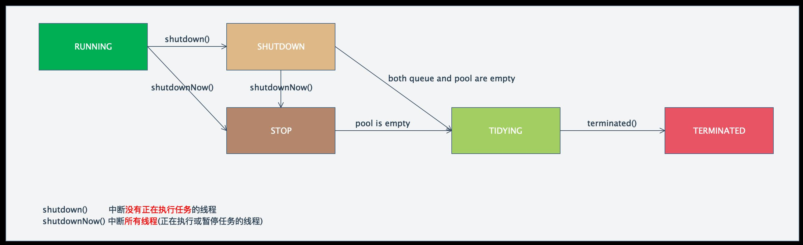

**线程池中任务状态**

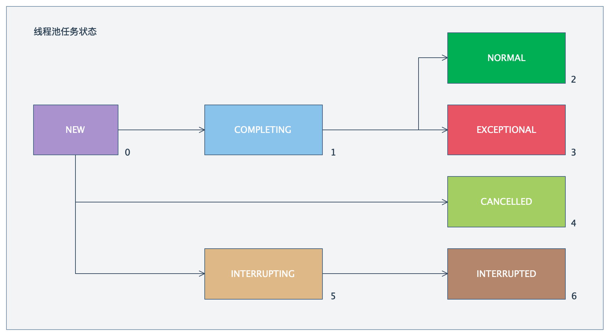

**线程池中工作线程Worker状态**

线程池中线程只有两种状态：可运行状态和等待状态。在没有任务时他们出于等待状态，运行时可以循环地执行任务。

**jvm中线程状态**

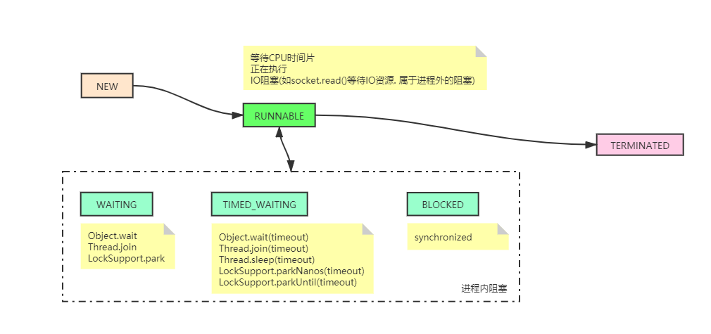

## 4.3 使用线程池

初始化&容量调整&任务提交&关闭

1、线程初始化

默认情况下，创建线程池之后，线程池中是没有线程的，需要提交任务之后才会创建线程。
在实际中如果需要线程池创建之后立即创建线程，可以通过以下两个方法办到：

- prestartCoreThread()：boolean prestartCoreThread()，初始化一个核心线程
- prestartAllCoreThreads()：int prestartAllCoreThreads()，初始化所有核心线程，并返回初始化的线程数

2、线程池容量调整

ThreadPoolExecutor提供了动态调整线程池容量大小的方法：

- setCorePoolSize：设置核心池大小

- setMaximumPoolSize：设置线程池最大能创建的线程数目大小

当上述参数从小变大时，ThreadPoolExecutor进行线程赋值，还可能立即创建新的线程来执行任务。

3、提交任务

- execute()：不能有返回方法，提交runnable

- submit()：可以使用 Future 接收线程池执行的返回值，提交callable

4、线程池关闭

ThreadPoolExecutor提供了两个方法，用于线程池的关闭：

- shutdown()：不会立即终止线程池，而是要等所有任务缓存队列中的任务都执行完后才终止，但再也不会接受新的任务

- shutdownNow()：立即终止线程池，并尝试打断正在执行的任务，并且清空任务缓存队列，返回尚未执行的任务

```java
import java.util.concurrent.ArrayBlockingQueue;
import java.util.concurrent.ThreadPoolExecutor;
import java.util.concurrent.TimeUnit;

public class MyTest {
	public static void main(String[] args) {
		// 1、创建线程池
		ThreadPoolExecutor threadPool = new ThreadPoolExecutor(3, 5, 5, TimeUnit.SECONDS,
				new ArrayBlockingQueue<Runnable>(5));
		// 2、向线程池提交任务
		for (int i = 0; i < threadPool.getCorePoolSize(); i++) {
			threadPool.execute(new Runnable() {
				@Override
				public void run() {
					for (int x = 0; x < 2; x++) {
						System.out.println(Thread.currentThread().getName() + ":" + x);
						try {
							Thread.sleep(2000);
						} catch (InterruptedException e) {
							e.printStackTrace();
						}
					}
				}
			});
		}
		// 3、关闭线程池
		threadPool.shutdown(); // 设置线程池的状态为SHUTDOWN，然后中断所有没有正在执行任务的线程
		// threadPool.shutdownNow(); // 设置线程池的状态为STOP，然后尝试停止所有的正在执行或暂停任务的线程，并返回等待执行任务的列表，该方法要慎用，容易造成不可控的后果
	}
}
```

## 4.4  Executors封装线程池
Executors工具类封装好了4种常见的功能线程池：

1、FixedThreadPool

固定容量线程池。其特点是最大线程数就是核心线程数，意味着线程池只能创建核心线程，keepAliveTime为0，即线程执行完任务立即回收。任务队列未指定容量，代表使用默认值Integer.MAX_VALUE。适用于需要控制并发线程的场景。

2、SingleThreadExecutor

单线程线程池。特点是线程池中只有一个线程（核心线程），线程执行完任务立即回收，使用有界阻塞队列（容量未指定，使用默认值Integer.MAX_VALUE）

3、 ScheduledThreadPool

定时线程池。指定核心线程数量，普通线程数量无限，线程执行完任务立即回收，任务队列为延时阻塞队列。这是一个比较特别的线程池，适用于执行定时或周期性的任务。

4、CachedThreadPool

缓存线程池。没有核心线程，普通线程数量为Integer.MAX_VALUE（可以理解为无限），线程闲置60s后回收，任务队列使用SynchronousQueue这种无容量的同步队列。适用于任务量大但耗时低的场景。

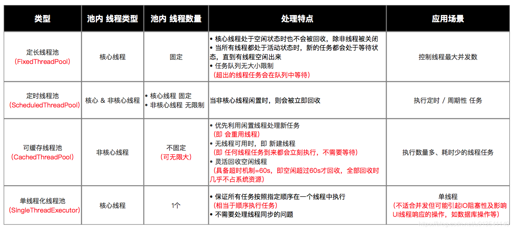

# 5 源码解读
OK，相信前面内容阅读起来还算轻松愉悦吧，那么从这里开始就进入深水区了，如果后面内容能吃透，那么线程池知识就真的被你掌握了。我们知道，向线程池提交任务是用ThreadPoolExecutor的execute()方法，但在其内部，线程任务的处理其实是相当复杂的，涉及到ThreadPoolExecutor、Worker、Thread三个类的6个方法：

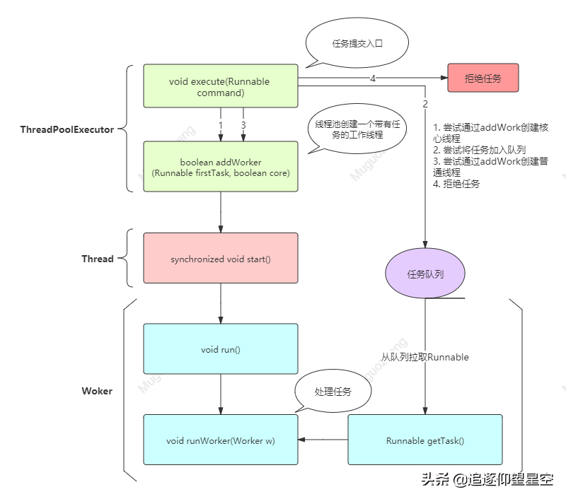

## 5.1 execute()
在ThreadPoolExecutor类中，任务提交方法的入口是execute(Runnable command)方法（submit()方法也是调用了execute()），该方法其实只在尝试做一件事：经过各种校验之后，调用 addWorker(Runnable command,boolean core)方法为线程池创建一个线程并执行任务，与之相对应，execute() 的结果有两个：

**参数说明**：

Runnable command：待执行的任务

**执行流程**：

1、通过 ctl.get() 得到线程池的当前线程数，如果线程数小于corePoolSize，则调用 addWorker(commond,true)方法创建新的线程执行任务，否则执行步骤2；

2、步骤1失败，说明已经无法再创建新线程，那么考虑将任务放入阻塞队列，等待执行完任务的线程来处理。基于此，判断线程池是否处于Running状态（只有Running状态的线程池可以接受新任务），如果任务添加到任务队列成功则进入步骤3，失败则进入步骤4；

3、来到这一步需要说明任务已经加入任务队列，这时要二次校验线程池的状态，会有以下情形：

线程池不再是Running状态了，需要将任务从任务队列中移除，如果移除成功则拒绝本次任务
线程池是Running状态，则判断线程池工作线程是否为0，是则调用 addWorker(commond,true)添加一个没有初始任务的线程（这个线程将去获取已经加入任务队列的本次任务并执行），否则进入步骤4；
线程池不是Running状态，但从任务队列移除任务失败（可能已被某线程获取？），进入步骤4；

4、将线程池扩容至maximumPoolSize并调用 addWorker(commond,false)方法创建新的线程执行任务，失败则拒绝本次任务。

**流程图**：

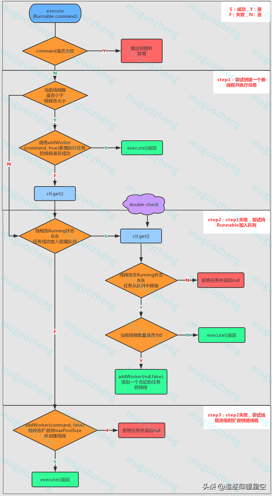

**源码解读**：

```java
/**
 * 在将来的某个时候执行给定的任务。任务可以在新线程中执行，也可以在现有的池线程中执行。
 * 如果由于此执行器已关闭或已达到其容量而无法提交任务以供执行，则由当前的{@code RejectedExecutionHandler}处理该任务。
 * 
 * @param command the task to execute  待执行的任务命令
 */
public void execute(Runnable command) {
    if (command == null)
        throw new NullPointerException();
    /*
     * Proceed in 3 steps:
     * 
     * 1. 如果运行的线程少于corePoolSize，将尝试以给定的命令作为第一个任务启动新线程。
     *
     * 2. 如果一个任务可以成功排队，那么我们仍然需要仔细检查两点，其一，我们是否应该添加一个线程
     * （因为自从上次检查至今，一些存在的线程已经死亡），其二，线程池状态此时已改变成非运行态。因此，我们重新检查状态，如果检查不通过，则移除已经入列的任务，如果检查通过且线程池线程数为0，则启动新线程。
     * 
     * 3. 如果无法将任务加入任务队列，则将线程池扩容到极限容量并尝试创建一个新线程，如果失败则拒绝任务。
     */
    int c = ctl.get();
   
    // 步骤1：判断线程池当前线程数是否小于线程池大小
    if (workerCountOf(c) < corePoolSize) {
        // 增加一个工作线程并添加任务，成功则返回，否则进行步骤2
        // true代表使用coreSize作为边界约束，否则使用maximumPoolSize
        if (addWorker(command, true))
            return;
        c = ctl.get();
    }
    // 步骤2：不满足workerCountOf(c) < corePoolSize或addWorker失败，进入步骤2
    // 校验线程池是否是Running状态且任务是否成功放入workQueue（阻塞队列）
    if (isRunning(c) && workQueue.offer(command)) {
        int recheck = ctl.get();
        // 再次校验，如果线程池非Running且从任务队列中移除任务成功，则拒绝该任务
        if (! isRunning(recheck) && remove(command))
            reject(command);
        // 如果线程池工作线程数量为0，则新建一个空任务的线程
        else if (workerCountOf(recheck) == 0)
            // 如果线程池不是Running状态，是加入不进去的
            addWorker(null, false);
    }
    // 步骤3：如果线程池不是Running状态或任务入列失败，尝试扩容maxPoolSize后再次addWorker，失败则拒绝任务
    else if (!addWorker(command, false))
        reject(command);
}
```

## 5.2  addWorker()
addWorker(Runnable firstTask, boolean core) 方法，顾名思义，向线程池添加一个带有任务的工作线程。

**参数说明**：

Runnable firstTask：新创建的线程应该首先运行的任务（如果没有，则为空）。

boolean core：该参数决定了线程池容量的约束条件，即当前线程数量以何值为极限值。参数为 true 则使用corePollSize 作为约束值，否则使用maximumPoolSize。

**执行流程**：

1、外层循环判断线程池的状态是否可以新增工作线程。这层校验基于下面两个原则：
线程池为Running状态时，既可以接受新任务也可以处理任务；

线程池为关闭状态时只能新增空任务的工作线程（worker）处理任务队列（workQueue）中的任务不能接受新任务

2、内层循环向线程池添加工作线程并返回是否添加成功的结果。

首先校验线程数是否已经超限制，是则返回false，否则进入下一步

通过CAS使工作线程数+1，成功则进入步骤3，失败则再次校验线程池是否是运行状态，是则继续内层循环，不是则返回外层循环

3、核心线程数量+1成功的后续操作：添加到工作线程集合，并启动工作线程

首先获取锁之后，再次校验线程池状态（具体校验规则见代码注解），通过则进入下一步，未通过则添加线程失败
线程池状态校验通过后，再检查线程是否已经启动，是则抛出异常，否则尝试将线程加入线程池，检查线程是否启动成功，成功则返回true，失败则进入 addWorkerFailed 方法。

**流程图**：

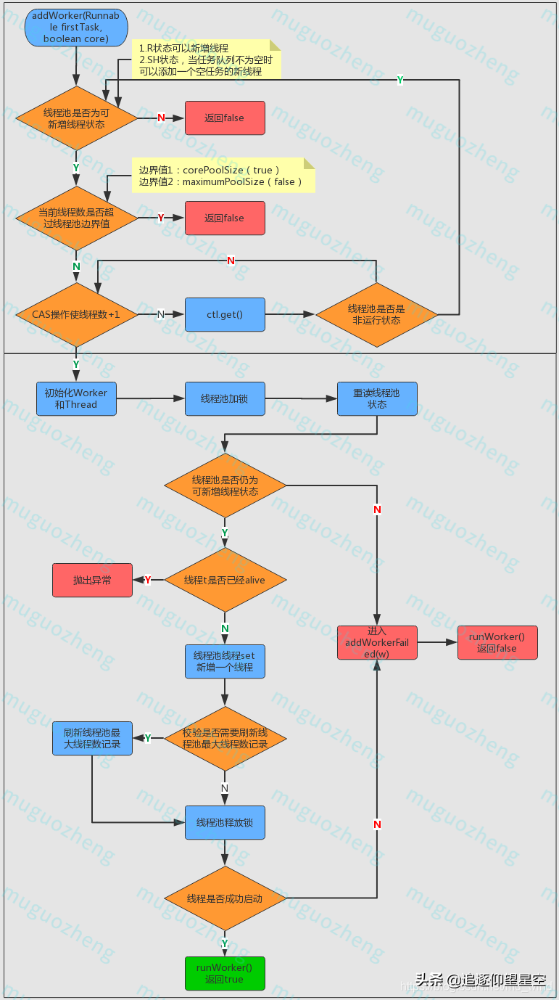

**源码解读**

```java
private boolean addWorker(Runnable firstTask, boolean core) {
    // 外层循环：判断线程池状态
    retry:
    for (;;) {
        int c = ctl.get();
        int rs = runStateOf(c);

        /** 
         * 1.线程池为非Running状态（Running状态则既可以新增核心线程也可以接受任务）
         * 2.线程为shutdown状态且firstTask为空且队列不为空
         * 3.满足条件1且条件2不满足，则返回false
         * 4.条件2解读：线程池为shutdown状态时且任务队列不为空时，可以新增空任务的线程来处理队列中的任务
         */
        if (rs >= SHUTDOWN &&
            ! (rs == SHUTDOWN &&
               firstTask == null &&
               ! workQueue.isEmpty()))
            return false;

		// 内层循环：线程池添加核心线程并返回是否添加成功的结果
        for (;;) {
            int wc = workerCountOf(c);
            // 校验线程池已有线程数量是否超限：
            // 1.线程池最大上限CAPACITY 
            // 2.corePoolSize或maximumPoolSize（取决于入参core）
            if (wc >= CAPACITY ||
                wc >= (core ? corePoolSize : maximumPoolSize)) 
                return false;
            // 通过CAS操作使工作线程数+1，跳出外层循环
            if (compareAndIncrementWorkerCount(c)) 
                break retry;
            // 线程+1失败，重读ctl
            c = ctl.get();   // Re-read ctl
            // 如果此时线程池状态不再是running，则重新进行外层循环
            if (runStateOf(c) != rs)
                continue retry;
            // 其他 CAS 失败是因为工作线程数量改变了，继续内层循环尝试CAS对线程数+1
            // else CAS failed due to workerCount change; retry inner loop
        }
    }

    /**
     * 核心线程数量+1成功的后续操作：添加到工作线程集合，并启动工作线程
     */
    boolean workerStarted = false;
    boolean workerAdded = false;
    Worker w = null;
    try {
        final ReentrantLock mainLock = this.mainLock;
        w = new Worker(firstTask);
        final Thread t = w.thread;
        if (t != null) {
            // 下面代码需要加锁：线程池主锁
            mainLock.lock(); 
            try {
                // 持锁期间重新检查，线程工厂创建线程失败或获取锁之前关闭的情况发生时，退出
                int c = ctl.get();
                int rs = runStateOf(c);

				// 再次检验线程池是否是running状态或线程池shutdown但线程任务为空
                if (rs < SHUTDOWN ||
                    (rs == SHUTDOWN && firstTask == null)) {
                    // 线程已经启动，则抛出非法线程状态异常
                    // 为什么会存在这种状态呢？未解决
                    if (t.isAlive()) // precheck that t is startable
                        throw new IllegalThreadStateException();
                    workers.add(w); //加入线程池
                    int s = workers.size();
                    // 如果当前工作线程数超过线程池曾经出现过的最大线程数，刷新后者值
                    if (s > largestPoolSize)
                        largestPoolSize = s; 
                    workerAdded = true;
                }
            } finally {
                mainLock.unlock();  // 释放锁
            }
            if (workerAdded) { // 工作线程添加成功，启动该线程
                t.start();
                workerStarted = true;
            }
        }
    } finally {
        //线程启动失败，则进入addWorkerFailed
        if (! workerStarted) 
            addWorkerFailed(w);
    }
    return workerStarted;
}
```

## 5.3 Worker类
Worker类是内部类，既实现了Runnable，又继承了AbstractQueuedSynchronizer（以下简称AQS），所以其既是一个可执行的任务，又可以达到锁的效果。

Worker类主要维护正在运行任务的线程的中断控制状态，以及其他次要的记录。这个类适时地继承了AbstractQueuedSynchronizer类，以简化获取和释放锁（该锁作用于每个任务执行代码）的过程。这样可以防止去中断正在运行中的任务，只会中断在等待从任务队列中获取任务的线程。我们实现了一个简单的不可重入互斥锁，而不是使用可重入锁，因为我们不希望工作任务在调用setCorePoolSize之类的池控制方法时能够重新获取锁。另外，为了在线程真正开始运行任务之前禁止中断，我们将锁状态初始化为负值，并在启动时清除它（在runWorker中）。

```java
private final class Worker
    extends AbstractQueuedSynchronizer
    implements Runnable
{
    /**
     * This class will never be serialized, but we provide a
     * serialVersionUID to suppress a javac warning.
     */
    private static final long serialVersionUID = 6138294804551838833L;
 
    /** Thread this worker is running in.  Null if factory fails. */
    final Thread thread; 
     
    /** Initial task to run.  Possibly null. */
    Runnable firstTask;
     
    /** Per-thread task counter */
    volatile long completedTasks;
 
    /**
     * Creates with given first task and thread from ThreadFactory.
     * @param firstTask the first task (null if none)
     */
    // 通过构造函数初始化，
    Worker(Runnable firstTask) {
        //设置AQS的同步状态
        // state：锁状态，-1为初始值，0为unlock状态，1为lock状态
        setState(-1); // inhibit interrupts until runWorker  在调用runWorker前，禁止中断
       
        this.firstTask = firstTask;
        // 线程工厂创建一个线程
        this.thread = getThreadFactory().newThread(this); 
    }
 
    /** Delegates main run loop to outer runWorker  */
    public void run() {
        runWorker(this); //runWorker()是ThreadPoolExecutor的方法
    }
 
    // Lock methods
    // The value 0 represents the unlocked state. 0代表“没被锁定”状态
    // The value 1 represents the locked state. 1代表“锁定”状态
 
    protected boolean isHeldExclusively() {
        return getState() != 0;
    }
 
    /**
     * 尝试获取锁的方法
     * 重写AQS的tryAcquire()，AQS本来就是让子类来实现的
     */
    protected boolean tryAcquire(int unused) {
        // 判断原值为0，且重置为1，所以state为-1时，锁无法获取。
        // 每次都是0->1，保证了锁的不可重入性
        if (compareAndSetState(0, 1)) {
            // 设置exclusiveOwnerThread=当前线程
            setExclusiveOwnerThread(Thread.currentThread()); 
            return true;
        }
        return false;
    }
 
    /**
     * 尝试释放锁
     * 不是state-1，而是置为0
     */
    protected boolean tryRelease(int unused) {
        setExclusiveOwnerThread(null); 
        setState(0);
        return true;
    }
 
    public void lock()        { acquire(1); }
    public boolean tryLock()  { return tryAcquire(1); }
    public void unlock()      { release(1); }
    public boolean isLocked() { return isHeldExclusively(); }
 
    /**
     * 中断（如果运行）
     * shutdownNow时会循环对worker线程执行
     * 且不需要获取worker锁，即使在worker运行时也可以中断
     */
    void interruptIfStarted() {
        Thread t;
        //如果state>=0、t!=null、且t没有被中断
        //new Worker()时state==-1，说明不能中断
        if (getState() >= 0 && (t = thread) != null && !t.isInterrupted()) {
            try {
                t.interrupt();
            } catch (SecurityException ignore) {
            }
        }
    }
}
```
## 5.4  runWorker()
可以说，runWorker(Worker w) 是线程池中真正处理任务的方法，前面的execute() 和 addWorker() 都是在为该方法做准备和铺垫。

**参数说明**：

Worker w：封装的Worker，携带了工作线程的诸多要素，包括Runnable（待处理任务）、lock（锁）、completedTasks（记录线程池已完成任务数）

**执行流程**：

1、判断当前任务或者从任务队列中获取的任务是否不为空，都为空则进入步骤2，否则进入步骤3

2、任务为空，则将completedAbruptly置为false（即线程不是突然终止），并执行processWorkerExit(w,completedAbruptly)方法进入线程退出程序

3、任务不为空，则进入循环，并加锁

4、判断是否为线程添加中断标识，以下两个条件满足其一则添加中断标识：
线程池状态>=STOP,即STOP或TERMINATED
一开始判断线程池状态<STOP，接下来检查发现Thread.interrupted()为true，即线程已经被中断，再次检查线程池状态是否>=STOP（以消除该瞬间shutdown方法生效，使线程池处于STOP或TERMINATED）

5、执行前置方法 beforeExecute(wt, task)（该方法为空方法，由子类实现）后执行task.run() 方法执行任务（执行不成功抛出相应异常）

6、执行后置方法 afterExecute(task, thrown)（该方法为空方法，由子类实现）后将线程池已完成的任务数+1，并释放锁。

7、再次进行循环条件判断。

**流程图**：

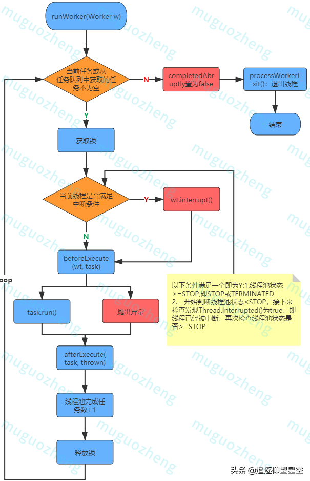

**源码解读**

```java
final void runWorker(Worker w) {
    Thread wt = Thread.currentThread();
    Runnable task = w.firstTask;
    w.firstTask = null;
    // allow interrupts
    // new Worker()是state==-1，此处是调用Worker类的tryRelease()方法，将state置为0，而interruptIfStarted()中只有state>=0才允许调用中断
    w.unlock(); 
            
    // 线程退出的原因，true是任务导致，false是线程正常退出
    boolean completedAbruptly = true; 
    try {
        // 当前任务和从任务队列中获取的任务都为空，方停止循环
        while (task != null || (task = getTask()) != null) {
            //上锁可以防止在shutdown()时终止正在运行的worker，而不是应对并发
            w.lock(); 
             
            // If pool is stopping, ensure thread is interrupted;
            // if not, ensure thread is not interrupted.  This
            // requires a recheck in second case to deal with
            // shutdownNow race while clearing interrupt
            /**
             * 判断1：确保只有在线程处于stop状态且wt未中断时，wt才会被设置中断标识
             * 条件1：线程池状态>=STOP,即STOP或TERMINATED
             * 条件2：一开始判断线程池状态<STOP，接下来检查发现Thread.interrupted()为true，即线程已经被中断，再次检查线程池状态是否>=STOP（以消除该瞬间shutdown方法生效，使线程池处于STOP或TERMINATED），
             * 条件1与条件2任意满意一个，且wt不是中断状态，则中断wt，否则进入下一步
             */
            if ((runStateAtLeast(ctl.get(), STOP) ||
                 (Thread.interrupted() &&
                  runStateAtLeast(ctl.get(), STOP))) &&
                !wt.isInterrupted())
                wt.interrupt(); //当前线程调用interrupt()中断
             
            try {
                //执行前（空方法，由子类重写实现）
                beforeExecute(wt, task);
                 
                Throwable thrown = null;
                try {
                    task.run();
                } 
                catch (RuntimeException x) {
                    thrown = x; throw x;
                } 
                catch (Error x) {
                    thrown = x; throw x;
                } 
                catch (Throwable x) {
                    thrown = x; throw new Error(x);
                } 
                finally {
                    //执行后（空方法，由子类重写实现）
                    afterExecute(task, thrown); 
                }
            } 
            finally {
                task = null; 
                w.completedTasks++; //完成任务数+1
                w.unlock(); //释放锁
            }
        }
        // 
        completedAbruptly = false;
    } 
    finally {
        //处理worker的退出
        processWorkerExit(w, completedAbruptly);
    }
}
```
## 5.5 getTask()
由函数调用关系图可知，在ThreadPoolExecutor类的实现中，Runnable getTask() 方法是为void runWorker(Worker w)方法服务的，它的作用就是在任务队列（workQueue）中获取 task（Runnable）。

**参数说明**：

无参数

**执行流程**：

1、将timedOut（上次获取任务是否超时）置为false（首次执行方法，无上次，自然为false），进入一个无限循环

2、如果线程池为Shutdown状态且任务队列为空（线程池shutdown状态可以处理任务队列中的任务，不再接受新任务，这个是重点）或者线程池为STOP或TERMINATED状态，则意味着线程池不必再获取任务了，当前工作线程数量-1并返回null，否则进入步骤3

3、如果线程池数量超限制或者时间超限且（任务队列为空或当前线程数>1），则进入步骤4，否则进入步骤5。

4、移除工作线程，成功则返回null，不成功则进入下轮循环。

5、尝试用poll() 或者 take()（具体用哪个取决于timed的值）获取任务，如果任务不为空，则返回该任务。如果为空，则将timeOut 置为 true进入下一轮循环。如果获取任务过程发生异常，则将 timeOut置为 false 后进入下一轮循环。

**流程图**：

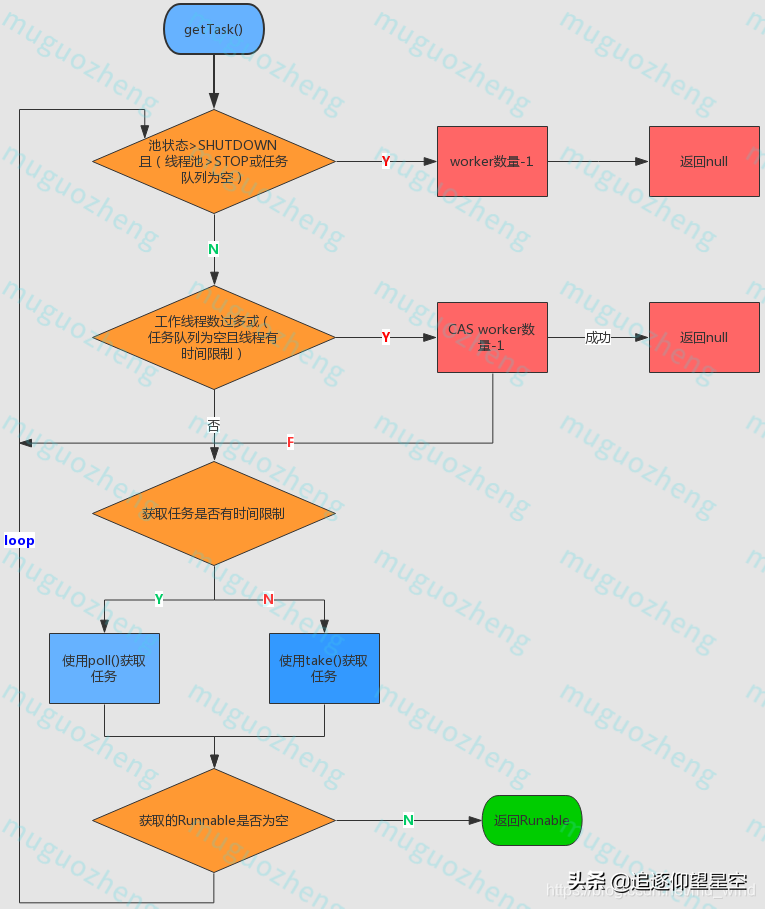

**源码解读**：

```java
private Runnable getTask() {
    // 最新一次poll是否超时
    boolean timedOut = false; // Did the last poll() time out?

    for (;;) {
        int c = ctl.get();
        int rs = runStateOf(c);

        // Check if queue empty only if necessary.
        /**
         * 条件1：线程池状态SHUTDOWN、STOP、TERMINATED状态
         * 条件2：线程池STOP、TERMINATED状态或workQueue为空
         * 条件1与条件2同时为true，则workerCount-1，并且返回null
         * 注：条件2是考虑到SHUTDOWN状态的线程池不会接受任务，但仍会处理任务
         */
        if (rs >= SHUTDOWN && (rs >= STOP || workQueue.isEmpty())) {
            decrementWorkerCount();
            return null;
        }

        int wc = workerCountOf(c);

        // Are workers subject to culling?
        /**
         * 下列两个条件满足任意一个，则给当前正在尝试获取任务的工作线程设置阻塞时间限制（超时会被销毁？不太确定这点），否则线程可以一直保持活跃状态
         * 1.allowCoreThreadTimeOut：当前线程是否以keepAliveTime为超时时限等待任务
         * 2.当前线程数量已经超越了核心线程数
         */
        boolean timed = allowCoreThreadTimeOut || wc > corePoolSize;
            
        // 两个条件全部为true，则通过CAS使工作线程数-1，即剔除工作线程
        // 条件1：工作线程数大于maximumPoolSize，或（工作线程阻塞时间受限且上次在任务队列拉取任务超时）
        // 条件2：wc > 1或任务队列为空
        if ((wc > maximumPoolSize || (timed && timedOut))
            && (wc > 1 || workQueue.isEmpty())) {
            // 移除工作线程，成功则返回null，不成功则进入下轮循环
            if (compareAndDecrementWorkerCount(c))
                return null;
            continue;
        }

	    // 执行到这里，说明已经经过前面重重校验，开始真正获取task了
        try {
            // 如果工作线程阻塞时间受限，则使用poll(),否则使用take()
            // poll()设定阻塞时间，而take()无时间限制，直到拿到结果为止
            Runnable r = timed ?
                workQueue.poll(keepAliveTime, TimeUnit.NANOSECONDS) :
                workQueue.take();
            // r不为空，则返回该Runnable
            if (r != null)
                return r;
            // 没能获取到Runable，则将最近获取任务是否超时设置为true
            timedOut = true;
        } catch (InterruptedException retry) {
            // 响应中断，进入下一次循环前将最近获取任务超时状态置为false
            timedOut = false;
        }
    }
}
```

## 5.6 processWorkerExit()
processWorkerExit(Worker w, boolean completedAbruptly)执行线程退出的方法

**参数说明**：

Worker w：要结束的工作线程。

boolean completedAbruptly： 是否突然完成（异常导致），如果工作线程因为用户异常死亡，则completedAbruptly参数为 true。

**执行流程**：

1、如果 completedAbruptly 为 true，即工作线程因为异常突然死亡，则执行工作线程-1操作。

2、主线程获取锁后，线程池已经完成的任务数追加 w（当前工作线程） 完成的任务数，并从worker的set集合中移除当前worker。

3、根据线程池状态进行判断是否执行tryTerminate()结束线程池。

4、是否需要增加工作线程，如果线程池还没有完全终止，仍需要保持一定数量的线程。

如果当前线程是突然终止的，调用addWorker()创建工作线程；

当前线程不是突然终止，但当前工作线程数量小于线程池需要维护的线程数量，则创建工作线程。需要维护的线程数量为corePoolSize（取决于成员变量 allowCoreThreadTimeOut是否为 false）或1。

**源码详读**：

```java
/**
 * Performs cleanup and bookkeeping for a dying worker. Called
 * only from worker threads. Unless completedAbruptly is set,
 * assumes that workerCount has already been adjusted to account
 * for exit.  This method removes thread from worker set, and
 * possibly terminates the pool or replaces the worker if either
 * it exited due to user task exception or if fewer than
 * corePoolSize workers are running or queue is non-empty but
 * there are no workers.
 *
 * @param w the worker
 * @param completedAbruptly if the worker died due to user exception
 */
private void processWorkerExit(Worker w, boolean completedAbruptly) {
    /**
     * 1.工作线程-1操作
     * 1）如果completedAbruptly 为true，说明工作线程发生异常，那么将正在工作的线程数量-1
     * 2）如果completedAbruptly 为false，说明工作线程无任务可以执行，由getTask()执行worker-1操作
     */
    if (completedAbruptly) // If abrupt, then workerCount wasn't adjusted
        decrementWorkerCount();

    // 2.从线程set集合中移除工作线程，该过程需要加锁
    final ReentrantLock mainLock = this.mainLock;
    mainLock.lock();
    try {
        // 将该worker已完成的任务数追加到线程池已完成的任务数
        completedTaskCount += w.completedTasks;
        // HashSet<Worker>中移除该worker
        workers.remove(w);
    } finally {
        mainLock.unlock();
    }
    
	// 3.根据线程池状态进行判断是否结束线程池
    tryTerminate();
	
	/**
     * 4.是否需要增加工作线程
     * 线程池状态是running 或 shutdown
     * 如果当前线程是突然终止的，addWorker()
     * 如果当前线程不是突然终止的，但当前线程数量 < 要维护的线程数量，addWorker()
     * 故如果调用线程池shutdown()，直到workQueue为空前，线程池都会维持corePoolSize个线程，然后再逐渐销毁这corePoolSize个线程
     */
    int c = ctl.get();
    if (runStateLessThan(c, STOP)) {
       if (!completedAbruptly) {
            int min = allowCoreThreadTimeOut ? 0 : corePoolSize;
            if (min == 0 && ! workQueue.isEmpty())
                min = 1;
            if (workerCountOf(c) >= min)
                return; // replacement not needed
        }
        addWorker(null, false);
    }
}
```

# 6 手写实现(待完成)


# 7 常见面试题 

