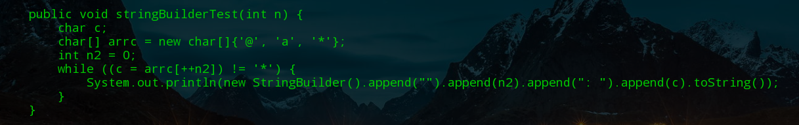

[JDK的前世今生：细数 Java5 - 15 的那些经典特性](https://www.toutiao.com/a6874008727758832131/?channel=&source=search_tab)

各版本主要特性


LTS版本有8、11、17

# 语法糖

语法糖（Syntactic sugar），也译为糖衣语法，是由英国计算机科学家彼得·兰丁发明的一个术语，指计算机语言中添加的某种语法，这种语法对语言的功能没有影响，但是更方便程序员使用。语法糖让程序更加简洁，有更高的可读性。

java中的语法糖只存在于编译期, 在编译器将 .java 源文件编译成 .class 字节码时, 会进行解语法糖操作, 还原最原始的基础语法结构。

这些语法糖包含条件编译、断言、Switch语句与枚举及字符串结合、可变参数、自动装箱/拆箱、枚举、内部类、泛型擦除、增强for循环、lambda表达式、try-with-resources语句、JDK10的局部变量类型推断等等。

举例：

```java
//字符串拼接
public void stringBuilderTest(int end) {
    char[] foo = new char[]{'@', 'a', '*'};
    char ch;
    int x = 0;
    while ((ch = foo[++x]) != '*') {
        System.out.println("" + x + ": " + ch);
    }
}
```

命令行: java -jar cfr_0_132.jar CFRDecompilerDemo.class --stringbuilder false



从反编译后的代码中能看出, 当我们使用+号进行字符串拼接操作时, 编译时会自动创建一个StringBuilder对象。所以当在循环中拼接字符串时, 应避免使用+号操作, 否则每次循环都会创建一个StringBuilder对象再回收, 造成较大的开销。

[[浅析java中的语法糖](https://www.cnblogs.com/qingshanli/p/9375040.html)](https://www.cnblogs.com/qingshanli/p/9375040.html)

# JDK17

switch模式匹配

内部强封装

增强伪随机数生成器

弃用安全管理器

# JDK16

instanceof模式匹配转正

record关键字转正

jpackage打包工具转正

弹性元空间

ZGC改进

Vector矢量计算API

# JDK15

准备禁用偏向锁

ZGC转正

Sealed Class封闭类

Hidden Class隐藏类

文本功能转正

Record二次预览

# JDK14 

switch表达式标准化

instanceof模式匹配预览

Record类型预览

删除CMS垃圾收集器

# JDK11

标准化httpclient

ZGC可伸缩低延迟垃圾收集器

# JDK10

局部变量类型推断 var关键字；

G1垃圾收集器

# JDK9

java模块系统moduleinfo

接口支持私有方法

Stream、Optional、try-with-resource改进

JShell

# JDK8

拉姆达表达式；函数式接口；方法引用

stream API; Optional

并发包优化: HashMap/ConcurrentHashMap

接口支持静态方法默认方法

JVM新特性：元空间

# JDK7

try-with-resouce；catch多个异常；ForkJoin框架；switch支持String


JDK15-JDK5