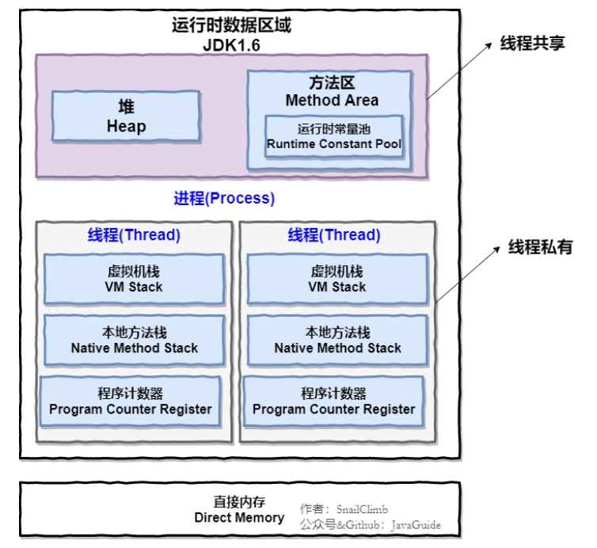
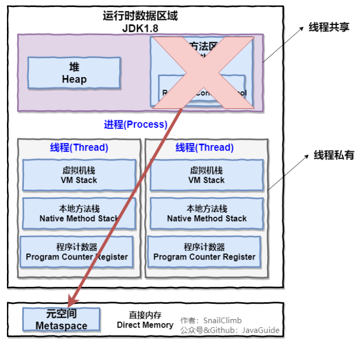
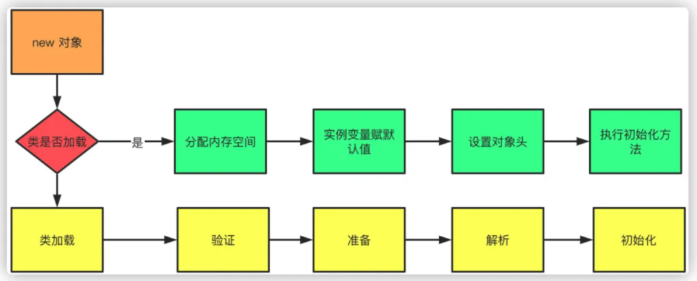
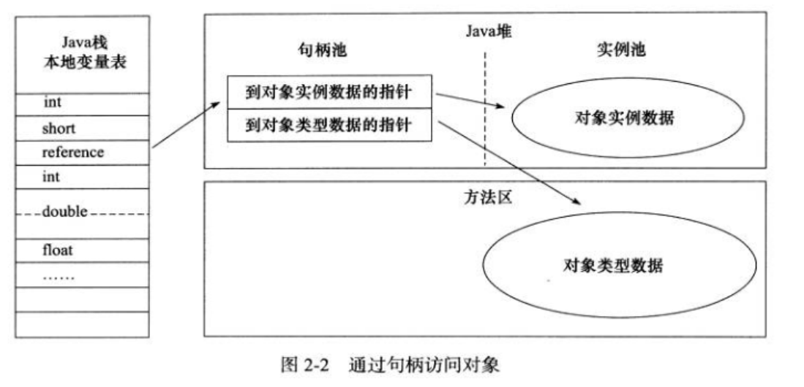
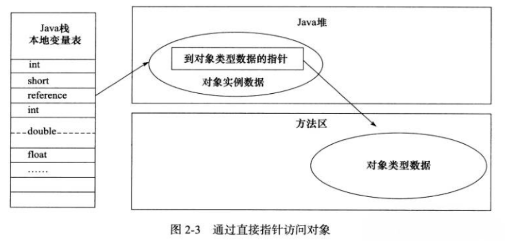
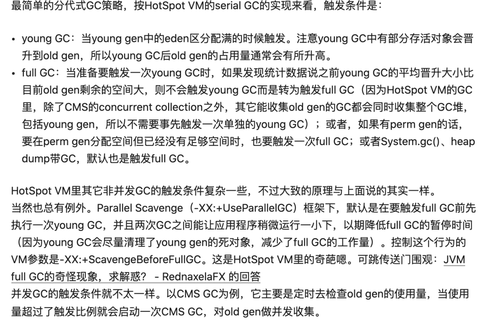
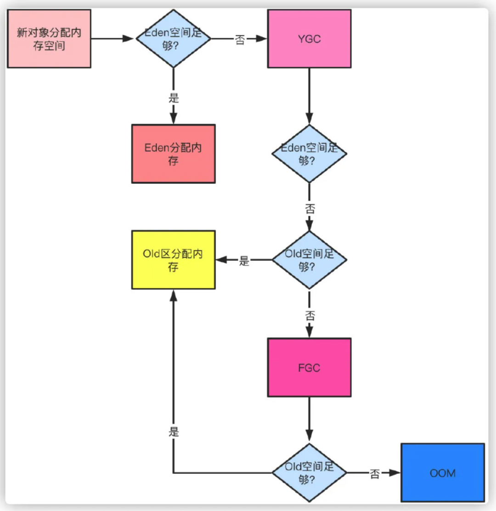
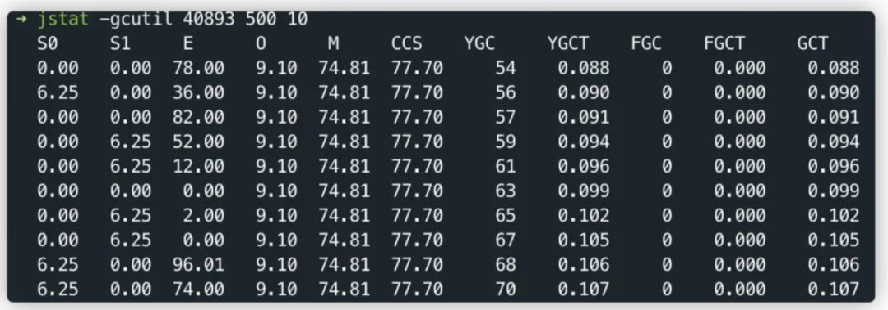

**重点**

1 CMS、G1原理，ZGC亮点

2 YGC、FGC、频繁gc问题处理

3 JVM参数调优、fullgc触发条件

4 JDK新特性

# 1  java当中的四种引用

强引用,软引用,弱引用,虚引用.不同的引用类型主要体现在GC上:

- 强引用：如果一个对象具有强引用，它就不会被垃圾回收器回收。即使当前内存空间不足，JVM也不会回收它，而是抛出 OutOfMemoryError 错误，使程序异常终止。如果想中断强引用和某个对象之间的关联，可以显式地将引用赋值为null，这样一来的话，JVM在合适的时间就会回收该对象
- 软引用：在使用软引用时，如果内存的空间足够，软引用就能继续被使用，而不会被垃圾回收器回收，只有在内存不足时，软引用才会被垃圾回收器回收。
- 弱引用：具有弱引用的对象拥有的生命周期更短暂。因为当 JVM 进行垃圾回收，一旦发现弱引用对象，无论当前内存空间是否充足，都会将弱引用回收。不过由于垃圾回收器是一个优先级较低的线程，所以并不一定能迅速发现弱引用对象
- 虚引用：顾名思义，就是形同虚设，如果一个对象仅持有虚引用，那么它相当于没有引用，在任何时候都可能被垃圾回收器回收。虚引⽤主要⽤来跟踪对象被垃圾回收的活动。虚引⽤与软引⽤和弱引⽤的⼀个区别在于： 虚引⽤必须和引⽤队列（ReferenceQueue）联合使⽤。当垃圾回收器准备回收⼀个对象时，如果发现它还有虚引⽤，就会在回收对象的内存之前，把这个虚引⽤加⼊到与之关联的引⽤队列中。程序可以通过判断引⽤队列中是 否已经加⼊了虚引⽤，来了解被引⽤的对象是否将要被垃圾回收。程序如果发现某个虚引⽤已经被加⼊到引⽤队列，那么就可以在所引⽤的对象的内存被回收之前采取必要的⾏动。特别注意，在程序设计中⼀般很少使⽤弱引⽤与虚引⽤，使⽤软引⽤的情况较多，这是因为软引⽤可以加速JVM对垃圾内存的回收速度，可以维护系统的运⾏安全，防⽌内存溢出（OutOfMemory）等问题的产⽣。

更多了解参见深入对象引用： `http://blog.csdn.net/dd864140130/article/details/49885811`

# 2 为什么要有不同的引用类型？

不像C语言,我们可以控制内存的申请和释放,在Java中有时候我们需要适当的控制对象被回收的时机,因此就诞生了不同的引用类型,可以说不同的引用类型实则是对GC回收时机不可控的妥协.有以下几个使用场景可以充分的说明:

利用软引用和弱引用解决OOM问题：用一个HashMap来保存图片的路径和相应图片对象关联的软引用之间的映射关系，在内存不足时，JVM会自动回收这些缓存图片对象所占用的空间，从而有效地避免了OOM的问题.

通过软引用实现Java对象的高速缓存:比如我们创建了一Person的类，如果每次需要查询一个人的信息,哪怕是几秒中之前刚刚查询过的，都要重新构建一个实例，这将引起大量Person对象的消耗,并且由于这些对象的生命周期相对较短,会引起多次GC影响性能。此时,通过软引用和 HashMap 的结合可以构建高速缓存,提供性能.

# 3 简述Java类加载机制

答：JVM中类的装载是由类加载器（ClassLoader）和它的子类来实现的，Java中的类加载器是一个重要的Java运行时系统组件，它负责在运行时查找和装入类文件中的类。

 由于Java的跨平台性，经过编译的Java源程序并不是一个可执行程序，而是一个或多个类文件。当Java程序需要使用某个类时，JVM会确保这个类已经被加载、连接（验证、准备和解析）和初始化。类的加载是指把类的.class文件中的数据读入到内存中，通常是创建一个字节数组读入.class文件，然后产生与所加载类对应的Class对象。加载完成后，Class对象还不完整，所以此时的类还不可用。当类被加载后就进入连接阶段，这一阶段包括验证、准备（为静态变量分配内存并设置默认的初始值）和解析（将符号引用替换为直接引用）三个步骤。最后JVM对类进行初始化，包括：1)如果类存在直接的父类并且这个类还没有被初始化，那么就先初始化父类；2)如果类中存在初始化语句，就依次执行这些初始化语句。

 类的加载是由类加载器完成的，类加载器包括：根加载器（BootStrap）、扩展加载器（Extension）、系统加载器（System）和用户自定义类加载器（java.lang.ClassLoader的子类）。从Java 2（JDK 1.2）开始，类加载过程采取了父亲委托机制（PDM）。PDM更好的保证了Java平台的安全性，在该机制中，JVM自带的Bootstrap是根加载器，其他的加载器都有且仅有一个父类加载器。类的加载首先请求父类加载器加载，父类加载器无能为力时才由其子类加载器自行加载。JVM不会向Java程序提供对Bootstrap的引用。下面是关于几个类加载器的说明：

•Bootstrap：一般用本地代码实现，负责加载JVM基础核心类库（rt.jar）；

•Extension：从java.ext.dirs系统属性所指定的目录中加载类库，它的父加载器是Bootstrap；

•System：又叫应用类加载器，其父类是Extension。它是应用最广泛的类加载器。它从环境变量classpath或者系统属性java.class.path所指定的目录中记载类，是用户自定义加载器的默认父加载器。

# 4 说说Java内存管理？heap和栈的区别？

java 的内存分为两类，一类是栈内存，一类是堆内存。栈内存是指程序进入一个方法时，会为这个方法单独分配一块私属存储空间，用于存储这个方法内部的局部变量，当这个方法结束时，分配给这个方法的栈会释放，这个栈中的变量也将随之释放。堆是与栈作用不同的内存，一般用于存放不放在当前方法栈中的那些数据，例如，使用 new 创建的对象都放在堆里，所以，它不会随方法的结束而消失。 方法中的局部变量使用 **final**修饰后，放在堆中，而不是栈中

# 5 什么是GC？为何要有GC？

答：GC是垃圾收集的意思，Java提供的GC功能可以自动监测对象是否超过作用域从而达到自动回收内存的目的，Java语言没有提供释放已分配内存的显示操作方法。Java程序员不用担心内存管理，因为垃圾收集器会自动进行管理。要请求垃圾收集，可以调用下面的方法之一：System.gc() 或Runtime.getRuntime().gc() ，但JVM可以屏蔽掉显示的垃圾回收调用。

   垃圾回收可以有效的防止内存泄露，有效的使用可以使用的内存。垃圾回收器通常是作为一个单独的低优先级的线程运行，不可预知的情况下对内存堆中已经死亡的或者长时间没有使用的对象进行清除和回收，程序员不能实时的调用垃圾回收器对某个对象或所有对象进行垃圾回收。

   垃圾回收机制有很多种，包括：分代复制垃圾回收、标记垃圾回收、增量垃圾回收等方式。标准的Java进程既有栈又有堆。栈保存了原始型局部变量，堆保存了要创建的对象。Java平台对堆内存回收和再利用的基本算法被称为标记和清除，但是Java对其进行了改进，采用“分代式垃圾收集”。这种方法会跟Java对象的生命周期将堆内存划分为不同的区域，在垃圾收集过程中，可能会将对象移动到不同区域：

\- 伊甸园（Eden）：这是对象最初诞生的区域，并且对大多数对象来说，这里是它们唯一存在过的区域。

\- 幸存者乐园（Survivor）：从伊甸园幸存下来的对象会被挪到这里。

\- 终身颐养园（Tenured）：这是足够老的幸存对象的归宿。年轻代收集（Minor-GC）过程是不会触及这个地方的。当年轻代收集不能把对象放进终身颐养园时，就会触发一次完全收集（Major-GC），这里可能还会牵扯到压缩，以便为大对象腾出足够的空间。

与垃圾回收相关的JVM参数：
•-Xms / -Xmx — 堆的初始大小 / 堆的最大大小

•-Xmn — 堆中年轻代的大小

•-XX:-DisableExplicitGC — 让System.gc()不产生任何作用

•-XX:+PrintGCDetails — 打印GC的细节

•-XX:+PrintGCDateStamps — 打印GC操作的时间戳

•-XX:NewSize / XX:MaxNewSize — 设置新生代大小/新生代最大大小

•-XX:NewRatio — 可以设置老生代和新生代的比例

•-XX:PrintTenuringDistribution — 设置每次新生代GC后输出幸存者乐园中对象年龄的分布

•-XX:InitialTenuringThreshold / -XX:MaxTenuringThreshold：设置老年代阀值的初始值和最大值

•-XX:TargetSurvivorRatio：设置幸存区的目标使用率

# 6 垃圾回收器基本原理？是否可以马上回收内存？有何方法主动通知JVM进行垃圾回收？

对于 GC 来说，当程序员创建对象时， GC 就开始监控这个对象的地址、大小以及使用情况。通常，GC 采用有向图的方式记录和管理堆(heap)中的所有对象。通过这种方式确定哪些对象是"可达的"，哪些对象是"不可达的"。当 GC 确定一些对象为"不可达"时， GC 就有责任回收这些内存空间。可以。程序员可以手动执行 **System.gc()**，通知 GC 运行，但是 Java 语言规范并不保证 GC 一定会执行。

# 7 Java会否存在内存泄漏？举例描述

所谓内存泄露就是指一个不再被程序使用的对象或变量一直被占据在内存中。 java 中有垃圾回收机制，它可以保证一对象不再被引用的时候，对象将自动被垃圾回收器从内存中清除掉。

java 中的内存泄露的情况： 长生命周期的对象持有短生命周期对象的引用就很可能发生内存泄露，尽管短生命周期对象已经不再需要，但是因为长生命周期对象持有它的引用而导致不能被回收，这就是 java 中内存泄露的发生场景，通俗地说，就是程序员可能创建了一个对象，以后一直不再使用这个对象，这个对象却一直被引用，即这个对象无用但是却无法被垃圾回收器回收的，这就是 java 中可能出现内存泄露的情况，例如，缓存系统，我们加载了一个对象放在缓存中(例如放在一个全局 map 对象中)，然后一直不再使用它，这个对象一直被缓存引用，但却不再被使用。检查 java 中的内存泄露，一定要让程序将各种分支情况都完整执行到程序结束，然后看某个对象是否被使用过，如果没有，则才能判定这个对象属于内存泄露。如果一个外部类的实例对象的方法返回了一个内部类的实例对象，这个内部类对象被长期引用了，即使那个外部类实例对象不再被使用，但由于内部类持久外部类的实例对象，这个外部类对象将不会被垃圾回收，这也会造成内存泄露

内存泄漏两种典型：一是堆栈pop操作只改指针不置null；而是hash集合存入后hashCode改变

# 8 能否自定义类java.lang.String?

可以，但在应用的时候，需要用自己的类加载器去加载，否则，系统的类加载器永远只是去加载 jre.jar 包中的那个 java.lang.String。

# 9 解释内存中栈(stack)、堆(heap)和静态区(static area)的用法。

答：通常我们定义一个基本数据类型的变量，一个对象的引用，还有就是函数调用的现场保存都使用内存中的栈空间；而通过new关键字和构造器创建的对象放在堆空间；程序中的字面量（literal）如直接书写的100、”hello”和常量都是放在静态区中。栈空间操作起来最快但是栈很小，通常大量的对象都是放在堆空间，理论上整个内存没有被其他进程使用的空间甚至硬盘上的虚拟内存都可以被当成堆空间来使用。String str = new String("hello"); 上面的语句中变量str放在栈上，用new创建出来的字符串对象放在堆上，而”hello”这个字面量放在静态区。

补充：较新版本的Java（从Java 6的某个更新开始）中使用了一项叫”逃逸分析”的技术，可以将一些局部对象放在栈上以提升对象的操作性能

# 11 JVM参数：哪个参数控制线程堆栈大小？

-Xss参数用来控制线程的堆栈大小

# 12  如何判断⼀个类是⽆⽤的类?
⽅法区主要回收的是⽆⽤的类，那么如何判断⼀个类是⽆⽤的类的呢？
判定⼀个常量是否是“废弃常量”⽐较简单，⽽要判定⼀个类是否是“⽆⽤的类”的条件则相对苛刻许
多。类需要同时满⾜下⾯ 3 个条件才能算是 “⽆⽤的类” ：
- 该类所有的实例都已经被回收，也就是 Java 堆中不存在该类的任何实例。
- 加载该类的 ClassLoader 已经被回收。
- 该类对应的 java.lang.Class 对象没有在任何地⽅被引⽤，⽆法在任何地⽅通过反射访问该类
的⽅法。
虚拟机可以对满⾜上述 3 个条件的⽆⽤类进⾏回收，这⾥说的仅仅是“可以”，⽽并不是和对象⼀
样不使⽤了就会必然被回收。 

# 13 如何判断对象是否死亡?哪些对象可作为GC Roots？
**引⽤计数法**
给对象中添加⼀个引⽤计数器，每当有⼀个地⽅引⽤它，计数器就加1；当引⽤失效，计数器就
减1；任何时候计数器为0的对象就是不可能再被使⽤的。
**可达性分析算法**
这个算法的基本思想就是通过⼀系列的称为 “GC Roots” 的对象作为起点，从这些节点开始向下
搜索，节点所⾛过的路径称为引⽤链，当⼀个对象到 GC Roots 没有任何引⽤链相连的话，则证
明此对象是不可⽤的。 

可以作为GC ROOT的对象包括：

1. 栈中引用的对象
2. 静态变量、常量引用的对象
3. 本地方法栈native方法引用的对象

# 14 垃圾收集有哪些算法，各⾃的特点？
**标记-清除算法**
该算法分为“标记”和“清除”阶段：⾸先标记出所有不需要回收的对象，在标记完成后统⼀回收掉所
有没有被标记的对象。它是最基础的收集算法，后续的算法都是对其不⾜进⾏改进得到。这种垃
圾收集算法会带来两个明显的问题：
1. 效率问题
2. 空间问题（标记清除后会产⽣⼤量不连续的碎⽚）

**标记-复制算法**
为了解决效率问题， “复制”收集算法出现了。它可以将内存分为⼤⼩相同的两块，每次使⽤其中
的⼀块。当这⼀块的内存使⽤完后，就将还存活的对象复制到另⼀块去，然后再把使⽤的空间⼀
次清理掉。这样就使每次的内存回收都是对内存区间的⼀半进⾏回收。

**标记-整理算法**
根据⽼年代的特点提出的⼀种标记算法，标记过程仍然与“标记-清除”算法⼀样，但后续步骤不是
直接对可回收对象回收，⽽是让所有存活的对象向⼀端移动，然后直接清理掉端边界以外的内存。

**分代收集算法**
当前虚拟机的垃圾收集都采⽤分代收集算法，这种算法没有什么新的思想，只是根据对象存活周期的不同将内存分为⼏块。⼀般将 java 堆分为新⽣代和⽼年代，这样我们就可以根据各个年代的特点选择合适的垃圾收集算法。⽐如在新⽣代中，每次收集都会有⼤量对象死去，所以可以选择复制算法，只需要付出少量对象的复制成本就可以完成每次垃圾收集。⽽⽼年代的对象存活⼏率是⽐较⾼的，⽽且没有额外的空间对它进⾏分配担保，所以我们必须选择“标记-清除”或“标记-整理”算法进⾏垃圾收集。
延伸⾯试问题： HotSpot 为什么要分为新⽣代和⽼年代？
主要是为了提升 GC 效率，根据上⾯的对分代收集算法的介绍回答。

# 15 常⻅的垃圾回收器有那些?
**Serial 收集器**
Serial（串⾏）收集器是最基本、历史最悠久的垃圾收集器了。⼤家看名字就知道这个收集器是
⼀个单线程收集器了。它的 “单线程” 的意义不仅仅意味着它只会使⽤⼀条垃圾收集线程去完成
垃圾收集⼯作，更重要的是它在进⾏垃圾收集⼯作的时候必须暂停其他所有的⼯作线程（ "Stop
The World" ），直到它收集结束。新⽣代采⽤复制算法，⽼年代采⽤标记-整理算法。优点是简单⽽⾼效（与其他收集器的单线程相⽐） 。 Serial 收集器由于没有线程交互的开销，⾃然可以获得很⾼的单线程收集效率。 Serial 收集器对于运⾏在 Client 模式下的虚拟机来说是个不错的选择。

**ParNew 收集器**
ParNew 收集器其实就是 Serial 收集器的多线程版本，除了使⽤多线程进⾏垃圾收集外，其余⾏
为（控制参数、收集算法、回收策略等等）和 Serial 收集器完全⼀样。新⽣代采⽤复制算法，⽼年代采⽤标记-整理算法。它是许多运⾏在 Server 模式下的虚拟机的⾸要选择，除了 Serial 收集器外，只有它能与 CMS 收集器（真正意义上的并发收集器，后⾯会介绍到）配合⼯作。

**Parallel Scavenge 收集器**
Parallel Scavenge 收集器关注点是吞吐量（⾼效率的利⽤ CPU）。 CMS 等垃圾收集器的关注点更多的是⽤户线程的停顿时间（提⾼⽤户体验）。所谓吞吐量就是 CPU 中⽤于运⾏⽤户代码的时间与 CPU 总消耗时间的⽐值。 Parallel Scavenge 收集器提供了很多参数供⽤户找到最合适的停顿时间或最⼤吞吐量，如果对于收集器运作不太了解，⼿⼯优化存在困难的时候，使⽤Parallel Scavenge 收集器配合⾃适应调节策略，把内存管理优化交给虚拟机去完成也是⼀个不错的选择。新⽣代采⽤复制算法，⽼年代采⽤标记-整理算法。JDK1.8 默认使⽤的是 Parallel Scavenge + Parallel Old，如果指定了-XX:+UseParallelGC 参数，则默认指定了-XX:+UseParallelOldGC，可以使⽤-XX:-UseParallelOldGC 来禁⽤该功能。

**Serial Old 收集器**
Serial 收集器的⽼年代版本，它同样是⼀个单线程收集器。它主要有两⼤⽤途：⼀种⽤途是在
JDK1.5 以及以前的版本中与 Parallel Scavenge 收集器搭配使⽤，另⼀种⽤途是作为 CMS 收集
器的后备⽅案。

**Parallel Old 收集器**
Parallel Scavenge 收集器的⽼年代版本。使⽤多线程和“标记-整理”算法。在注重吞吐量以及
CPU 资源的场合，都可以优先考虑 Parallel Scavenge 收集器和 Parallel Old 收集器。

**CMS 收集器**
CMS（Concurrent Mark Sweep）收集器是 HotSpot 虚拟机第⼀款真正意义上的并发收集器，它第⼀次实现了让垃圾收集线程与⽤户线程（基本上）同时⼯作，是⼀种以获取最短回收停顿时间为⽬标的收集器。从名字中的Mark Sweep这两个词可以看出， CMS 收集器是⼀种 “标记-清除”算法实现的，它的运作过程相⽐于前⾯⼏种垃圾收集器来说更加复杂⼀些。整个过程分为四个步骤：

- 初始标记： 暂停所有的其他线程，并记录下直接与 root 相连的对象，速度很快 ；
- 并发标记： 同时开启 GC 和⽤户线程，⽤⼀个闭包结构去记录可达对象。但在这个阶段结束，这个闭包结构并不能保证包含当前所有的可达对象。因为⽤户线程可能会不断的更新引⽤域，所以 GC 线程⽆法保证可达性分析的实时性。所以这个算法⾥会跟踪记录这些发⽣引⽤更新的地⽅。
- 重新标记： 重新标记阶段就是为了修正并发标记期间因为⽤户程序继续运⾏⽽导致标记产⽣变动的那⼀部分对象的标记记录，这个阶段的停顿时间⼀般会⽐初始标记阶段的时间稍⻓，远远⽐并发标记阶段时间短
- 并发清除： 开启⽤户线程，同时 GC 线程开始对未标记的区域做清扫。

从它的名字就可以看出它是⼀款优秀的垃圾收集器，主要优点： 并发收集、低停顿。但是它有下
⾯三个明显的缺点：
对 CPU 资源敏感；
⽆法处理浮动垃圾；
它使⽤的回收算法-“标记-清除”算法会导致收集结束时会有⼤量空间碎⽚产⽣。

**G1 收集器**
G1 (Garbage-First) 是⼀款⾯向服务器的垃圾收集器,主要针对配备多颗处理器及⼤容量内存的机器. 以极⾼概率满⾜ GC 停顿时间要求的同时,还具备⾼吞吐量性能特征.被视为 JDK1.7 中 HotSpot 虚拟机的⼀个重要进化特征。它具备⼀下特点：
- 并⾏与并发： G1 能充分利⽤ CPU、多核环境下的硬件优势，使⽤多个 CPU（CPU 或者CPU 核⼼）来缩短 Stop-The-World 停顿时间。部分其他收集器原本需要停顿 Java 线程执⾏的 GC 动作， G1 收集器仍然可以通过并发的⽅式让 java 程序继续执⾏。
- 分代收集：虽然 G1 可以不需要其他收集器配合就能独⽴管理整个 GC 堆，但是还是保留了分代的概念。
- 空间整合：与 CMS 的“标记--清理”算法不同， G1 从整体来看是基于“标记整理”算法实现的收集器；从局部上来看是基于“复制”算法实现的。
- 可预测的停顿：这是 G1 相对于 CMS 的另⼀个⼤优势，降低停顿时间是 G1 和 CMS 共同的关注点，但 G1 除了追求低停顿外，还能建⽴可预测的停顿时间模型，能让使⽤者明确指定在⼀个⻓度为 M 毫秒的时间⽚段内。

G1 收集器的运作⼤致分为以下⼏个步骤：
初始标记 并发标记 最终标记 筛选回收
G1 收集器在后台维护了⼀个优先列表，每次根据允许的收集时间，优先选择回收价值最⼤的Region(这也就是它的名字 Garbage-First 的由来)。这种使⽤ Region 划分内存空间以及有优先级的区域回收⽅式，保证了 G1 收集器在有限时间内可以尽可能⾼的收集效率（把内存化整为零）。

**ZGC 收集器**
与 CMS 中的 ParNew 和 G1 类似， ZGC 也采⽤标记-复制算法，不过 ZGC 对该算法做了重⼤改
进。在 ZGC 中出现 Stop The World 的情况会更少

并⾏和并发概念补充：
并⾏（Parallel） ：指多条垃圾收集线程并⾏⼯作，但此时⽤户线程仍然处于等待状态。
并发（Concurrent） ：指⽤户线程与垃圾收集线程同时执⾏（但不⼀定是并⾏，可能会交替执⾏），⽤户程序在继续运⾏，⽽垃圾收集器运⾏在另⼀个 CPU 上。

# 16 介绍下 Java 内存区域(运⾏时数据区)
Java 虚拟机在执⾏ Java 程序的过程中会把它管理的内存划分成若⼲个不同的数据区域。1.8 和之前的版本略有不同，下⾯会介绍到。

线程私有的：程序计数器 虚拟机栈 本地⽅法栈
线程共享的：堆 ⽅法区 直接内存 (⾮运⾏时数据区的⼀部分)

**程序计数器**
程序计数器是⼀块较⼩的内存空间，可以看作是当前线程所执⾏的字节码的⾏号指示器。 字节码解释器⼯作时通过改变这个计数器的值来选取下⼀条需要执⾏的字节码指令，分⽀、循环、跳转、异常处理、线程恢复等功能都需要依赖这个计数器来完成。另外， 为了线程切换后能恢复到正确的执⾏位置，每条线程都需要有⼀个独⽴的程序计数器，各线程之间计数器互不影响，独⽴存储，我们称这类内存区域为“线程私有”的内存。从上⾯的介绍中我们知道程序计数器主要有两个作⽤：
1. 字节码解释器通过改变程序计数器来依次读取指令，从⽽实现代码的流程控制，如：顺序执
    ⾏、选择、循环、异常处理。
2. 在多线程的情况下，程序计数器⽤于记录当前线程执⾏的位置，从⽽当线程被切换回来的时
    候能够知道该线程上次运⾏到哪⼉了。
注意：程序计数器是唯⼀⼀个不会出现 OutOfMemoryError 的内存区域，它的⽣命周期随着线 程的创建⽽创建，随着线程的结束⽽死亡。

**Java 虚拟机栈**
  与程序计数器⼀样， Java 虚拟机栈也是线程私有的，它的⽣命周期和线程相同，描述的是 Java
  ⽅法执⾏的内存模型，每次⽅法调⽤的数据都是通过栈传递的。  Java 内存可以粗糙的区分为堆内存（Heap）和栈内存 (Stack),其中栈就是现在说的虚拟机栈，  或者说是虚拟机栈中局部变量表部分。 （实际上， Java 虚拟机栈是由⼀个个栈帧组成，⽽每个 栈帧中都拥有：局部变量表、操作数栈、动态链接、⽅法出⼝信息。）  局部变量表主要存放了编译期可知的各种数据类型（boolean、 byte、 char、 short、 int、 float、  long、 double）、 对象引⽤（reference 类型，它不同于对象本身，可能是⼀个指向对象起始地址  的引⽤指针，也可能是指向⼀个代表对象的句柄或其他与此对象相关的位置）。
Java 虚拟机栈会出现两种错误：
- StackOverFlowError ： 若 Java 虚拟机栈的内存⼤⼩不允许动态扩展，那么当线程请求栈 的深度超过当前 Java 虚拟机栈的最⼤深度的时候，就抛出 StackOverFlowError 错误。
- OutOfMemoryError ： 若 Java 虚拟机堆中没有空闲内存，并且垃圾回收器也⽆法提供更多内存的话。就会抛出 OutOfMemoryError 错误。  Java 虚拟机栈也是线程私有的，每个线程都有各⾃的

**本地⽅法栈**
和虚拟机栈所发挥的作⽤⾮常相似，区别是： 虚拟机栈为虚拟机执⾏ Java⽅法服务，⽽本地⽅法栈则为虚拟机使⽤到的 Native ⽅法服务。 在 HotSpot 虚拟机中和 Java 虚拟机栈合⼆为⼀。  本地⽅法被执⾏的时候，在本地⽅法栈也会创建⼀个栈帧，⽤于存放该本地⽅法的局部变量表、  操作数栈、动态链接、出⼝信息。  ⽅法执⾏完毕后相应的栈帧也会出栈并释放内存空间，也会出现 StackOverFlowError 和  OutOfMemoryError 两种错误。

**堆**
Java 虚拟机所管理的内存中最⼤的⼀块， Java 堆是所有线程共享的⼀块内存区域，在虚拟机启 动时创建。 此内存区域的唯⼀⽬的就是存放对象实例，⼏乎所有的对象实例以及数组都在这⾥分配内存。  Java世界中“⼏乎”所有的对象都在堆中分配，但是，随着JIT编译期的发展与**逃逸分析**技术逐渐成熟，栈上分配、标量替换优化技术将会导致⼀些微妙的变化，所有的对象都分配到堆上也渐渐变得不那么“绝对”了。从jdk 1.7开始已经默认开启逃逸分析，如果某些⽅法中的对象引⽤没有被返回或者未被外⾯使⽤（也就是未逃逸出去），那么对象可以直接在栈上分配内存。

Java 堆是垃圾收集器管理的主要区域，因此也被称作GC 堆 .从垃圾回收的⻆度，由于现在收集器基本都采⽤分代垃圾收集算法，所以 Java 堆还可以细分为：新⽣代和⽼年代：再细致⼀点有： Eden 空间、 From Survivor、 To Survivor 空间等。 进⼀步划分的⽬的是更好地回收内存，或者更快地分配内存。 在 JDK 7 版本及JDK 7 版本之前，堆内存被通常被分为下⾯三部分：新⽣代内存、⽼⽣代、 永⽣代。JDK 8 版本之后⽅法区（HotSpot 的永久代）被彻底移除了（JDK1.7 就已经开始了），取⽽代之是元空间，元空间使⽤的是直接内存。 上图所示的 Eden 区、两个 Survivor 区都属于新⽣代，中间⼀层属于⽼年代。  

⼤部分情况，对象都会⾸先在 Eden 区域分配，在⼀次新⽣代垃圾回收后，如果对象还存活，则会进⼊ s0 或者 s1，并且对象的年龄还会加 1(Eden 区->Survivor 区后对象的初始年龄变为 1)， 当它的年龄增加到⼀定程度（默认为 15 岁），就会被晋升到⽼年代中。对象晋升到⽼年代的年 龄阈值，可以通过参数 -XX:MaxTenuringThreshold 来设置。 

>修正（issue552）： “Hotspot遍历所有对象时，按照年龄从⼩到⼤对其所占⽤的⼤⼩进⾏累 积，当累积的某个年龄⼤⼩超过了survivor区的⼀半时，取这个年龄和  MaxTenuringThreshold中更⼩的⼀个值，作为新的晋升年龄阈值”。 堆这⾥最容易出现的就是 OutOfMemoryError 错误，并且出现这种错误之后的表现形式还会有⼏种，⽐如：OutOfMemoryError: GC Overhead Limit Exceeded ： 当JVM花太多时间执⾏垃圾回收并且只能回收很少的堆空间时，就会发⽣此错误。

**方法区**
《Java 虚拟机规范》只是规定了有⽅法区这么个概念和它的作⽤，并没有规定如何去实现它。那么，在不同的 JVM 上⽅法区的实现肯定是不同的了。 ⽅法区和永久代的关系很像Java 中接⼝和类的关系，类实现了接⼝，⽽永久代就是 HotSpot 虚拟机对虚拟机规范中⽅法区的⼀种实现⽅式。 也就是说，永久代是 HotSpot 的概念，⽅法区是 Java 虚拟机规范中的定义，是⼀种规范，⽽永久代是⼀种实现，⼀个是标准⼀个是实现，其他的虚拟机实现并没有永久代这⼀说法。
JDK 1.8 之前永久代还没被彻底移除的时候通常通过下⾯这些参数来调节⽅法区⼤⼩
-XX:PermSize=N //⽅法区 (永久代) 初始⼤⼩
-XX:MaxPermSize=N //⽅法区 (永久代) 最⼤值,超过这个值将会抛出 OutOfMemoryError 异常
相对⽽⾔，垃圾收集⾏为在这个区域是⽐较少出现的，但并⾮数据进⼊⽅法区后就“永久存在”
了。JDK 1.8 的时候，⽅法区（HotSpot 的永久代）被彻底移除了（JDK1.7 就已经开始了），取⽽代之是元空间，元空间使⽤的是直接内存。
下⾯是⼀些常⽤参数：
-XX:MetaspaceSize=N //设置 Metaspace 的初始（和最⼩⼤⼩）
-XX:MaxMetaspaceSize=N //设置 Metaspace 的最⼤⼤⼩
与永久代很⼤的不同就是，如果不指定⼤⼩的话，随着更多类的创建，虚拟机会耗尽所有可⽤的系统内存。

**为什么要将永久代 (PermGen) 替换为元空间 (MetaSpace) 呢?**
1. 整个永久代有⼀个 JVM 本身设置固定⼤⼩上限，⽆法进⾏调整，⽽元空间使⽤的是直接内存，受本机可⽤内存的限制，虽然元空间仍旧可能溢出，但是⽐原来出现的⼏率会更⼩。当你元空间溢出时会得到如下错误： java.lang.OutOfMemoryError: MetaSpace
你可以使⽤ -XX MaxMetaspaceSize 标志设置最⼤元空间⼤⼩，默认值为 unlimited，这意味着
它只受系统内存的限制。 -XX MetaspaceSize 调整标志定义元空间的初始⼤⼩如果未指定此标志，则 Metaspace 将根据运⾏时的应⽤程序需求动态地重新调整⼤⼩。
2. 元空间⾥⾯存放的是类的元数据，这样加载多少类的元数据就不由 MaxPermSize 控制了,
⽽由系统的实际可⽤空间来控制，这样能加载的类就更多了。
3. 在 JDK8，合并 HotSpot 和 JRockit 的代码时, JRockit 从来没有⼀个叫永久代的东⻄, 合并
之后就没有必要额外的设置这么⼀个永久代的地⽅了。

**运⾏时常量池**
运⾏时常量池是⽅法区的⼀部分。 Class ⽂件中除了有类的版本、字段、⽅法、接⼝等描述信息
外，还有常量池表（⽤于存放编译期⽣成的各种字⾯量和符号引⽤）既然运⾏时常量池是⽅法区的⼀部分，⾃然受到⽅法区内存的限制，当常量池⽆法再申请到内存时会抛出 OutOfMemoryError 错误。
1. JDK1.7之前运⾏时常量池逻辑包含字符串常量池存放在⽅法区, 此时hotspot虚拟机对⽅法区的实现为永久代
2. JDK1.7 字符串常量池被从⽅法区拿到了堆中, 这⾥没有提到运⾏时常量池,也就是说字符串常量池被单独拿到堆,运⾏时常量池剩下的东⻄还在⽅法区, 也就是hotspot中的永久代 。
3. JDK1.8 hotspot移除了永久代⽤元空间(Metaspace)取⽽代之, 这时候字符串常量池还在堆, 运⾏时常量池还在⽅法区, 只不过⽅法区的实现从永久代变成了元空间(Metaspace)

**直接内存**
直接内存并不是虚拟机运⾏时数据区的⼀部分，也不是虚拟机规范中定义的内存区域，但是这部分内存也被频繁地使⽤。⽽且也可能导致 OutOfMemoryError 错误出现。本机直接内存的分配不会受到 Java 堆的限制，但是，既然是内存就会受到本机总内存⼤⼩以及处理器寻址空间的限制。

# 17 说⼀下Java对象的创建过程

当虚拟机遇见 new 关键字时候，实现判断当前类是否已经加载。如果类没有加载，首先执行类的加载机制，加载完成后再为对象分配空间、初始化等。
1.首先校验当前类是否被加载，如果没有加载，执行类加载机制；

2.加载：就是从字节码加载成二进制流的过程；

3.验证：当然加载完成之后，当然需要校验 class 文件是否符合虚拟机规范，跟我们接口请求一样，第一件事情当然是先做个参数校验了；

4.准备：为静态变量、常量赋默认值；

5.解析：把常量池中符号引用(以符号描述引用的目标)替换为直接引用(指向目标的指针或者句柄等)的过程；

6.初始化：执行 static 代码块 (cinit) 进行初始化，如果存在父类，先对父类进行初始化。

注意：静态代码块是绝对线程安全的，只能隐式被 Java 虚拟机在类加载过程中初始化调用！(此处该有问题：static 代码块线程安全吗？)

当类加载完成之后，紧接着就是对象分配内存空间和初始化的过程：

Step1:类加载检查
虚拟机遇到⼀条 new 指令时，⾸先将去检查这个指令的参数是否能在常量池中定位到这个类的符号引⽤，并且检查这个符号引⽤代表的类是否已被加载过、解析和初始化过。如果没有，那必须先执⾏相应的类加载过程。

Step2:分配内存
在类加载检查通过后，接下来虚拟机将为新⽣对象分配内存。对象所需的内存⼤⼩在类加载完成后便可确定，为对象分配空间的任务等同于把⼀块确定⼤⼩的内存从 Java 堆中划分出来。 分配⽅式有 “指针碰撞” 和 “空闲列表” 两种， 选择哪种分配⽅式由 Java 堆是否规整决定，⽽ Java堆是否规整⼜由所采⽤的垃圾收集器是否带有压缩整理功能决定。
内存分配的两种⽅式：（补充内容，需要掌握）
选择以上两种⽅式中的哪⼀种，取决于 Java 堆内存是否规整。⽽ Java 堆内存是否规整，取决于GC 收集器的算法是"标记-清除"，还是"标记-整理"（也称作"标记-压缩"），值得注意的是，复制算法内存也是规整的

**内存分配并发问题**（补充内容，需要掌握）在创建对象的时候有⼀个很重要的问题，就是线程安全，因为在实际开发过程中，创建对象是很频繁的事情，作为虚拟机来说，必须要保证线程是安全的，通常来讲，虚拟机采⽤两种⽅式来保证线程安全：
CAS+失败重试： CAS 是乐观锁的⼀种实现⽅式。所谓乐观锁就是，每次不加锁⽽是假设没有冲突⽽去完成某项操作，如果因为冲突失败就重试，直到成功为⽌。 虚拟机采⽤ CAS配上失败重试的⽅式保证更新操作的原⼦性。
TLAB： 为每⼀个线程预先在 Eden 区分配⼀块⼉内存， JVM 在给线程中的对象分配内存时，⾸先在 TLAB 分配，当对象⼤于 TLAB 中的剩余内存或 TLAB 的内存已⽤尽时，再采⽤上述的 CAS 进⾏内存分配

Step3:初始化零值
内存分配完成后，虚拟机需要将分配到的内存空间都初始化为零值（不包括对象头），这⼀步操
作保证了对象的实例字段在 Java 代码中可以不赋初始值就直接使⽤，程序能访问到这些字段的数据类型所对应的零值。

Step4:设置对象头
初始化零值完成之后， 虚拟机要对对象进⾏必要的设置，例如这个对象是哪个类的实例、如何才能找到类的元数据信息、对象的哈希码、对象的 GC 分代年龄等信息。 这些信息存放在对象头中。 另外，根据虚拟机当前运⾏状态的不同，如是否启⽤偏向锁等，对象头会有不同的设置⽅式。

Step5:执⾏ init ⽅法
在上⾯⼯作都完成之后，从虚拟机的视⻆来看，⼀个新的对象已经产⽣了，但从 Java 程序的视⻆来看，对象创建才刚开始，init ⽅法还没有执⾏，所有的字段都还为零。所以⼀般来说，执⾏ new 指令之后会接着执⾏ init ⽅法，把对象按照程序员的意愿进⾏初始化，这样⼀个真正可⽤的对象才算完全产⽣出来。

# 18 对象的访问定位有哪两种⽅式?
建⽴对象就是为了使⽤对象，我们的Java程序通过栈上的 reference 数据来操作堆上的具体对象。对象的访问⽅式有虚拟机实现⽽定，⽬前主流的访问⽅式有①使⽤句柄和②直接指针两种：
1. 句柄： 如果使⽤句柄的话，那么Java堆中将会划分出⼀块内存来作为句柄池， reference 中存储的就是对象的句柄地址，⽽句柄中包含了对象实例数据与类型数据各⾃的具体地址信息；

2. 直接指针： 如果使⽤直接指针访问，那么 Java 堆对象的布局中就必须考虑如何放置访问类型数据的相关信息，⽽reference 中存储的直接就是对象的地址。

这两种对象访问⽅式各有优势。使⽤句柄来访问的最⼤好处是 reference 中存储的是稳定的句柄地址，在对象被移动时只会改变句柄中的实例数据指针，⽽ reference 本身不需要修改。使⽤直接指针访问⽅式最⼤的好处就是速度快，它节省了⼀次指针定位的时间开销。

# 19 说⼀下堆内存中对象的分配的基本策略
**对象优先在 eden 区分配**
⽬前主流的垃圾收集器都会采⽤分代回收算法，因此需要将堆内存分为新⽣代和⽼年代，这样我们就可以根据各个年代的特点选择合适的垃圾收集算法。⼤多数情况下，对象在新⽣代中 eden 区分配。当 eden 区没有⾜够空间进⾏分配时，虚拟机将发起⼀次 Minor GC。YGC 之后，存活的对象将会被复制到未使用的 Survivor 区。如果 S 区放不下，则直接晋升至老年代。如果老年代也无法分配空间，触发 FGC，FGC 之后还是放不下则报出 OOM 异常。

**⼤对象直接进⼊⽼年代**
⼤对象就是需要⼤量连续内存空间的对象（⽐如：字符串、数组）。为什么要这样呢？为了避免为⼤对象分配内存时由于分配担保机制带来的复制⽽降低效率。

**⻓期存活的对象将进⼊⽼年代**
既然虚拟机采⽤了分代收集的思想来管理内存，那么内存回收时就必须能识别哪些对象应放在新⽣代，哪些对象应放在⽼年代中。为了做到这⼀点，虚拟机给每个对象⼀个对象年龄（Age）计数器。如果对象在 Eden 出⽣并经过第⼀次 Minor GC 后仍然能够存活，并且能被 Survivor 容纳的话，将被移动到 Survivor 空间中，并将对象年龄设为 1.对象在 Survivor 中每熬过⼀次 MinorGC,年龄就增加 1 岁，当它的年龄增加到⼀定程度（默认为 15 岁），就会被晋升到⽼年代中。对象晋升到⽼年代的年龄阈值，可以通过参数 -XX:MaxTenuringThreshold 来设置。
经过这次 GC 后， Eden 区和"From"区已经被清空。这个时候， "From"和"To"会交换他们的⻆⾊，也就是新的"To"就是上次 GC 前的“From”，新的"From"就是上次 GC 前的"To"。不管怎样，都会保证名为 To 的 Survivor 区域是空的。 Minor GC 会⼀直重复这样的过程，直到“To”区被填满， "To"区被填满之后，会将所有对象移动到⽼年代中。
Hotspot 遍历所有对象时，按照年龄从⼩到⼤对其所占⽤的⼤⼩进⾏累积，当累积的某个年龄所有对象⼤⼩总和超过了 survivor 区的⼀半时，取这个年龄和MaxTenuringThreshold 中更⼩的⼀个值，作为新的晋升年龄阈值。

针对 HotSpot VM 的实现，它⾥⾯的 GC 其实准确分类只有两⼤种：
部分收集 (Partial GC)：
新⽣代收集（Minor GC / Young GC）：只对新⽣代进⾏垃圾收集；
⽼年代收集（Major GC / Old GC）：只对⽼年代进⾏垃圾收集。需要注意的是 Major GC 在有的语境中也⽤于指代整堆收集；
混合收集（Mixed GC）：对整个新⽣代和部分⽼年代进⾏垃圾收集。
整堆收集 (Full GC)：收集整个 Java 堆和⽅法区。

# 20 什么时候会触发 YGC 和 FGC？对象什么时候会进入老年代？

当一个新的对象来申请内存空间的时候，如果 Eden 区无法满足内存分配需求，则触发 YGC。使用中的 Survivor 区和 Eden 区存活对象送到未使用的 Survivor 区。如果 YGC 之后还是没有足够空间，则直接进入老年代分配。如果老年代也无法分配空间，触发 FGC，FGC 之后还是放不下则报出 OOM 异常。

YGC 之后，存活的对象将会被复制到未使用的 Survivor 区。如果 S 区放不下，则直接晋升至老年代。而对于那些一直在 Survivor 区来回复制的对象，通过 -XX：MaxTenuringThreshold 配置交换阈值，默认15次。如果超过次数同样进入老年代。此外，还有一种动态年龄的判断机制，不需要等到 MaxTenuringThreshold 就能晋升老年代。如果在 Survivor 空间中相同年龄所有对象大小的总和大于 Survivor 空间的一半，年龄大于或等于该年龄的对象就可以直接进入老年代。

# 21 频繁 FullGC 怎么排查？ CPU 飙高，同时 FGC 怎么办？
这种问题最好的办法就是结合有具体的例子举例分析，如果没有就说一般的分析步骤。发生 FGC 有可能是内存分配不合理，比如 Eden 区太小，导致对象频繁进入老年代，这时候通过启动参数配置就能看出来，另外有可能就是存在内存泄露，可以通过以下的步骤进行排查：
**1. jstat -gcutil 或者查看 gc.log 日志，查看内存回收情况。**

- S0、S1 分别代表两个 Survivor 区占比；
- E 代表 Eden 区占比，图中可以看到使用了78%；
- O 代表老年代，M 代表元空间，YGC 发生54次，YGCT 代表 YGC 累计耗时，GCT 代表 GC 累计耗时。
- [GC 或 [FGC 开头代表垃圾回收的类型；
- PSYoungGen: 6130K->6130K(9216K)] 12274K->14330K(19456K), 0.0034895 secs 代表 YGC 前后内存使用情况；
- Times: user=0.02 sys=0.00, real=0.00 secs：user 表示用户态消耗的 CPU 时间，sys 表示内核态消耗的 CPU 时间，real 表示各种墙时钟的等待时间；

**2. dump 出内存文件在具体分析。**
比如通过 jmap 命令 jmap -dump:format=b,file=dumpfile pid。导出之后再通过 Eclipse Memory Analyzer 等工具进行分析，定位到代码、修复。

这里还会可能存在一个提问的点， CPU 飙高，同时 FGC 怎么办？比如办法比较类似：

1.找到当前进程的 pid，**top -p pid -H** 查看资源占用，找到问题线程；

2.**printf “%x\n” pid**，把线程 pid 转为16进制，比如 0x32d；

3.**jstack pid|grep -A 10 0x32d** 查看线程的堆栈日志，还找不到问题继续下一步；

4.**dump 出内存文件用 MAT 等工具进行分析**，定位到代码、修复。

