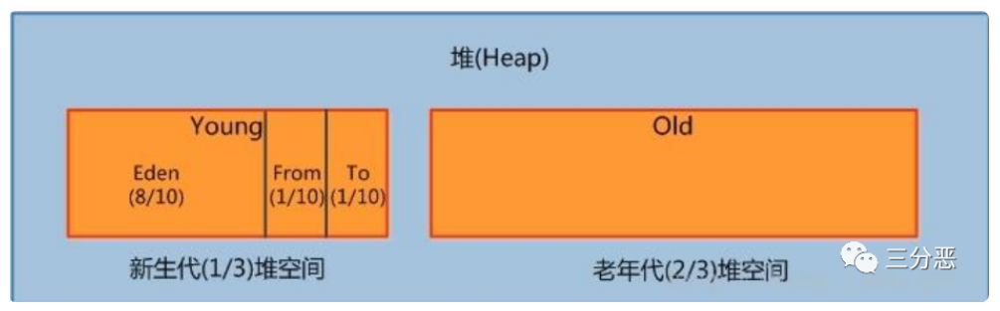
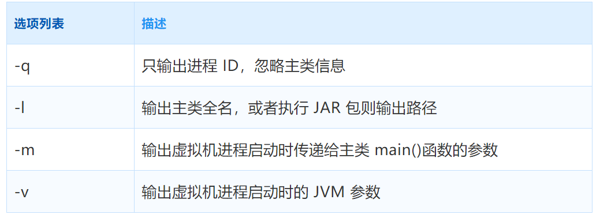

# 1 基本概念

## 1.1 JVM是什么
JVM的全称是「Java Virtual Machine」，Java 虚拟机。JVM具备着计算机的基本运算方式，它主要负责把 Java 程序生成的字节码文件，解释成具体系统平台上的机器指令，让其在各个平台运行。JVM是运行在操作系统上的，它与硬件没有直接的交互。严格来说JVM也是虚拟机规范，有很多不同的实现，Sun/OracleJDK和OpenJDK中的默认Java虚拟机是HotSpot虚拟机，是目前使用范围最广的Java虚拟机，一般讲到的JVM指的就是HotSpot虚拟机。

## 1.2 Java程序运行过程
 Java源文件通过编译器能够生成字节码文件，而字节码文件又通过Java虚拟机中的解释器，编译成特定机器上的机器码 。每一种平台的解释器是不同的，但是实现的虚拟机是相同的，这也就是 Java 为什么能够跨平台的原因了，当一个程序从开始运行，这时虚拟机就开始实例化了，多个程序启动就会存在多个虚拟机实例。程序退出或者关闭，则虚拟机实例消亡，多个虚拟机实例之间数据不能共享。
 

## 1.3 JDK、JRE、JVM

- JDK(Java Development Kit Java 开发工具包)，JDK 是提供给 Java 开发人员使用的，其中包含了 Java 的开发工具，也包括了 JRE。其中的开发工具包括编译工具(javac.exe) 打包工具(jar.exe)等。长期支持版本有8、11、17

- JRE(Java Runtime Environment Java 运行环境) 是 JDK 的子集，也就是包括 JRE 所有内容，以及开发应用程序所需的编译器和调试器等工具。JRE 提供了库、Java 虚拟机（JVM）和其他组件，用于运行 Java 编程语言、小程序、应用程序。

- JVM(Java Virtual Machine Java 虚拟机)，JVM 可以理解为是一个虚拟出来的计算机，具备着计算机的基本运算方式，它主要负责把 Java 程序生成的字节码文件，解释成具体系统平台上的机器指令，让其在各个平台运行。

范围关系：JDK>JRE>JVM。


# 2 JVM内存区域
根据《Java虚拟机规范》的规定，Java虚拟机所管理的内存将会包括以下几个运行时数据区域：

实际上，为了更好的适应 CPU 性能提升，最大限度提升JVM 运行效率，JDK中各个版本对JVM进行了一些迭代，示意图如下：

JDK1.6、JDK1.7、JDK1.8 JVM 内存模型主要有以下差异：

+ JDK 1.6：有永久代，静态变量存放在永久代上。

+ JDK 1.7：有永久代，但已经把字符串常量池、静态变量，存放在堆上。逐渐的减少永久代的使用。

+ JDK 1.8：无永久代，运行时常量池、类常量池，都保存在元数据区，也就是常说的元空间。但字符串常量池仍然存放在堆上。

## 2.1 程序计数器
一块较小的内存空间, 是当前线程所执行的字节码的行号指示器，每条线程都要有一个独立的程序计数器，这类内存也称为“线程私有”的内存。

正在执行 java 方法的话，计数器记录的是虚拟机字节码指令的地址（当前指令的地址）。如果还是 Native 方法，则为空。

这个内存区域是唯一一个在虚拟机中没有规定任何 OutOfMemoryError 情况的区域。

## 2.2 Java虚拟机栈
与程序计数器一样，Java虚拟机栈（Java Virtual Machine Stack）也是线程私有的，它的生命周期与线程相同。

虚拟机栈描述的是Java方法执行的线程内存模型：每个方法被执行的时候，Java虚拟机都会同步创建一个栈帧（Stack Frame）用于存储局部变量表、操作数栈、动态连接、方法出口等信息。每一个方法被调用直至执行完毕的过程，就对应着一个栈帧在虚拟机栈中从入栈到出栈的过程。

局部变量表存放了编译期可知的各种Java虚拟机基本数据类型、对象引用（reference类型，它并不等同于对象本身，可能是一个指向对象起始址的引用指针，也可能是指向一个代表对象的句柄或者其他与此对象相关的位置）和returnAddress 类型（指向了一条字节码指令的地址）。


## 2.3 本地方法栈
本地方法栈（Native Method Stacks）与虚拟机栈所发挥的作用是非常相似的，其区别只是虚拟机栈为虚拟机执行Java方法（也就是字节码）服务，而本地方法栈则是为虚拟机使用到的本地（Native） 方法服务。

Hot-Spot虚拟机直接把本地方法栈和虚拟机栈合二为一。与虚拟机栈一样，本地方法栈也会在栈深度溢出或者栈扩展失败时分别抛出StackOverflowError和OutOfMemoryError异常。

## 2.4 Java堆

对于Java应用程序来说，Java堆（Java Heap）是虚拟机所管理的内存中最大的一块。Java堆是被所有线程共享的一块内存区域，在虚拟机启动时创建。此内存区域的唯一目的就是存放对象实例，Java 世界里“几乎”所有的对象实例都在这里分配内存。Java堆是垃圾收集器管理的内存区域，因此一些资料中它也被称作“GC堆”。从回收内存的角度看，
+ Java 堆，由年轻代和年老代组成，分别占据 1/3 和 2/3。

+ 年轻代又分为三部分，Eden、From Survivor、To Survivor，占据比例为 8:1:1，可调。

需要注意的是这些区域划分仅仅是一部分垃圾收集器的共同特性或者说设计风格而已，而非某个Java虚拟机具体实现的固有内存布局，HotSpot里面已经出现了不采用分代设计的新垃圾收集器。



Java堆既可以被实现成固定大小的，也可以是可扩展的，不过当前主流的Java虚拟机都是按照可扩展来实现的（通过参数-Xmx和-Xms设定）。如果在Java堆中没有内存完成实例分配，并且堆也无法再扩展时，Java虚拟机将会抛出OutOfMemoryError异常。


## 2.5 方法区(JDK1.8移除)

方法区（Method Area）与Java堆一样，是各个线程共享的内存区域，它用于存储已被虚拟机加载的类型信息、常量、静态变量、即时编译器编译后的代码缓存等数据。

在JDK1.8以前，HotSpot使用永久代来实现方法区，所以某些场合也认为方法区和永久代是一个概念。

在JDK6的时候HotSpot开发团队就有放弃永久代，逐步改为采用本地内存（Native Memory）来实现方法区的计划了，到了JDK7的HotSpot，已经把原本放在永久代的字符串常量池、静态变量等移出，而到了 JDK8，终于完全废弃了永久代的概念，改用在本地内存中实现的元空间（Meta- space）来代替，把JDK7中永久代还剩余的内容（主要是类型信息）全部移到元空间中。

如果方法区无法满足新的内存分配需求时，将抛出OutOfMemoryError异常。

## 2.6 运行时常量池

运行时常量池（Runtime Constant Pool）是方法区的一部分——在JDK1.8已经被移到了元空间。

运行时常量池相对于Class文件常量池的一个重要特征是具备动态性，Java语言并不要求常量一定只有编译期才能产生，也就是说，并非预置入Class文件中常量池的内容才能进入运行时常量池，运行期间也可以将新的常量放入池中，这种特性被开发人员利用得比较多的便是String类的 intern()方法。

## 2.7 直接内存
直接内存（Direct Memory）并不是虚拟机运行时数据区的一部分。

显然，本机直接内存的分配不会受到Java堆大小的限制，但是，既然是内存，则肯定还是会受到本机总内存（包括物理内存、SWAP分区或者分页文件）大小以及处理器寻址空间的限制。

元空间从虚拟机 Java 堆中转移到本地内存，默认情况下，元空间的大小仅受本地内存的限制。jdk1.8 以前版本的 class 和 JAR 包数据存储在 PermGen 下面 ，PermGen 大小是固定的，而且项目之间无法共用，公有的 class，所以比较容易出现 OOM 异常。

升级 JDK1.8 后，元空间配置参数，-XX:MetaspaceSize=512M XX:MaxMetaspaceSize=1024M。

# 3 JVM中的对象

## 3.1 对象的创建
Java对象创建的大概过程如下：


①类加载检查：虚拟机遇到⼀条 new 指令时，⾸先将去检查这个指令的参数是否能在常量池中定位到这个类的符号引⽤，并且检查这个符号引⽤代表的类是否已被加载过、解析和初始化过。如果没有，那必须先执⾏相应的类加载过程。

②分配内存：在类加载检查通过后，接下来虚拟机将为新⽣对象分配内存。对象所需的内存⼤⼩在类加载完成后便可确定，为对象分配空间的任务等同于把⼀块确定⼤⼩的内存从 Java 堆中划分出来。分配⽅式有 “指针碰撞” 和 “空闲列表” 两种，选择那种分配⽅式由 Java 堆是否规整决定，⽽Java堆是否规整⼜由所采⽤的垃圾收集器是否带有压缩整理功能决定。

内存分配的两种⽅式：选择以上两种⽅式中的哪⼀种，取决于 Java 堆内存是否规整。⽽ Java 堆内存是否规整，取决于 GC收集器的算法是"标记-清除"，还是"标记-整理"（也称作"标记-压缩"），值得注意的是，复制算法内存也是规整的。


③初始化零值：内存分配完成后，虚拟机需要将分配到的内存空间都初始化为零值（不包括对象头），这⼀步操作保证了对象的实例字段在 Java 代码中可以不赋初始值就直接使⽤，程序能访问到这些字段的数据类型所对应的零值。

④设置对象头：初始化零值完成之后，虚拟机要对对象进⾏必要的设置，例如这个对象是那个类的实例、如何才能找到类的元数据信息、对象的哈希码、对象的 GC 分代年龄等信息。这些信息存放在对象头中。另外，根据虚拟机当前运⾏状态的不同，如是否启⽤偏向锁等，对象头会有不同的设置⽅式。

⑤执⾏ init ⽅法：在上⾯⼯作都完成之后，从虚拟机的视⻆来看，⼀个新的对象已经产⽣了，但从Java 程序的视⻆来看，对象创建才刚开始， ⽅法还没有执⾏，所有的字段都还为零。所以⼀般来说，执⾏ new 指令之后会接着执⾏⽅法，把对象按照程序员的意愿进⾏初始化，这样⼀个真正可⽤的对象才算完全产⽣出来。

>问题：JVM 里 new 对象时，堆会发生抢占吗？JVM是怎么设计来保证线程安全的？

会，假设JVM虚拟机上，每一次new 对象时，指针就会向右移动一个对象size的距离，一个线程正在给A对象分配内存，指针还没有来的及修改，另一个为B对象分配内存的线程，又引用了这个指针来分配内存，这就发生了抢占。


有两种可选方案来解决这个问题：

- 采用CAS分配重试的方式来保证更新操作的原子性 

- 每个线程在Java堆中预先分配一小块内存，也就是本地线程分配缓冲（Thread Local Allocation
   Buffer，TLAB），要分配内存的线程，先在本地缓冲区中分配，只有本地缓冲区用完了，分配新的缓存区时才需要同步锁定。


## 3.2 对象的内存布局

在HotSpot虚拟机里，对象在堆内存中的存储布局可以划分为三个部分：对象头（Header）、实例数据（Instance Data）和对齐填充（Padding）。

HotSpot虚拟机对象的对象头部分包括两类信息。第一类是用于存储对象自身的运行时数据，如哈希码、GC分代年龄、锁状态标志、线程持有的锁、偏向线程ID、偏向时间戳等，这部分数据的长度在32位和64位的虚拟机（未开启压缩指针）中分别为32个比特和64个比特，官方称它为“Mark Word”。

## 3.3 对象的访问定位
建⽴对象就是为了使⽤对象，我们的Java程序通过栈上的 reference 数据来操作堆上的具体对象。对象的访问⽅式有虚拟机实现⽽定，⽬前主流的访问⽅式有①使⽤句柄和②直接指针两种：

+ 句柄：如果使⽤句柄的话，那么Java堆中将会划分出⼀块内存来作为句柄池，reference 中存储的就是对象的句柄地址，⽽句柄中包含了对象实例数据与类型数据各⾃的具体地址信息。

+ 直接指针：如果使⽤直接指针访问，那么 Java 堆对象的布局中就必须考虑如何放置访问类型数据的相关信息，⽽reference 中存储的直接就是对象的地址。


# 4 GC垃圾回收
对于垃圾回收，主要考虑的就是完成三件事：

哪些内存需要回收？

什么时候回收？

如何回收？

> 什么是Stop The World ? 什么是 OopMap ？什么是安全点？

进行垃圾回收的过程中，会涉及对象的移动。为了保证对象引用更新的正确性，必须暂停所有的用户线程，像这样的停顿，虚拟机设计者形象描述为`Stop The World`。也简称为STW。

在HotSpot中，有个数据结构（映射表）称为`OopMap`。一旦类加载动作完成的时候，HotSpot就会把对象内什么偏移量上是什么类型的数据计算出来，记录到OopMap。在即时编译过程中，也会在`特定的位置`生成 OopMap，记录下栈上和寄存器里哪些位置是引用。

这些特定的位置主要在：

- 1.循环的末尾（非 counted 循环） 
- 2.方法临返回前 / 调用方法的call指令后 
- 3.可能抛异常的位置 

这些位置就叫作**安全点(safepoint)。** 用户程序执行时并非在代码指令流的任意位置都能够在停顿下来开始垃圾收集，而是必须是执行到安全点才能够暂停。

## 4.1 如何判断对象需要回收

### 4.1.1 引用计数法
引用计数法的算法：

在对象中添加一个引用计数器，每当有一个地方引用它时，计数器值就加一；
当引用失效时，计数器值就减一；
任何时刻计数器为零的对象就是不可能再被使用的。

客观地说，引用计数算法虽然占用了一些额外的内存空间来进行计数，但它的原理简单，判定效率也很高，在大多数情况下它都是一个不错的算法。也有一些比较著名的应用案例，例如微软COM技术、使用ActionScript 3的FlashPlayer、Python语言以及在游戏脚本领域得到许多应用的Squirrel中都使用了引用计数算法进行内存管理。

但是，在Java 领域，至少主流的Java虚拟机里面都没有选用引用计数算法来管理内存，主要原因是，这个看似简单的算法有很多例外情况要考虑，例如在处理处理一些相互依赖、循环引用时非常复杂。

### 4.1.2 可达性分析算法
当前主流的商用程序语言的内存管理子系统，都是通过可达性分析（Reachability Analysis）算法来判定对象是否存活的。这个算法的基本思路就是通过一系列称为“GC Roots”的根对象作为起始节点集，从这些节点开始，根据引用关系向下搜索，搜索过程所走过的路径称为“引用链”（Reference Chain），如果某个对象到GC Roots间没有任何引用链相连， 或者用图论的话来说就是从GC Roots到这个对象不可达时，则证明此对象是不可能再被使用的。

GC Roots 包括；

- 全局性引用，对方法区的静态对象、常量对象的引用
- 执行上下文，对 Java 方法栈帧中的局部对象引用、对 JNI handles 对象引用
- 本地方法栈 native 方法引用的对象。
- 已启动且未停止的 Java 线程

### 4.1.3 四种引用

无论是通过引用计数算法判断对象的引用数量，还是通过可达性分析算法判断对象是否引用链可达，判定对象是否存活都和“引用”离不开关系。

Java的引用分为四种：强引用（Strongly Re-ference）、软引用（Soft Reference）、弱引用（Weak Reference）和虚引用（Phantom Reference）。

+ 强引用是最传统的“引用”的定义，是指在程序代码之中普遍存在的引用赋值，即类似“Object obj=new Object()”这种引用关系。无论任何情况下，只要强引用关系还存在，垃圾收集器就永远不会回收掉被引用的对象。

+ 软引用是用来描述一些还有用，但非必须的对象。只被软引用关联着的对象，在系统将要发生内存溢出异常前，会把这些对象列进回收范围之中进行第二次回收，如果这次回收还没有足够的内存， 才会抛出内存溢出异常。Java提供提供了SoftReference类来实现软引用。

+ 弱引用也是用来描述那些非必须对象，但是它的强度比软引用更弱一些，被弱引用关联的对象只能生存到下一次垃圾收集发生为止。当垃圾收集器开始工作，无论当前内存是否足够，都会回收掉只被弱引用关联的对象。Java提供了WeakReference类来实现弱引用。

+ 虚引用也称为“幽灵引用”或者“幻影引用”，它是最弱的一种引用关系。一个对象是否有虚引用的存在，完全不会对其生存时间构成影响，也无法通过虚引用来取得一个对象实例。为一个对象设置虚引用关联的唯一目的只是为了能在这个对象被收集器回收时收到一个系统通知。Java提供了PhantomReference类来实现虚引用。

## 4.2 垃圾收集算法 

### 4.2.1 标记-清除算法
最早出现也是最基础的垃圾收集算法是“标记-清除”（Mark-Sweep）算法，

算法分为“标记”和“清除”两个阶段：首先标记出所有需要回收的对象，在标记完成后，统一回收掉所有被标记的对象，也可以反过来，标记存活的对象，统一回收所有未被标记的对象。标记过程就是对象是否属于垃圾的判定过程。

后续的收集算法大多都是以标记-清除算法为基础，对其缺点进行改进而得到的。

它的主要缺点有两个：

第一个是执行效率不稳定，如果Java堆中包含大量对象，而且其中大部分是需要被回收的，这时必须进行大量标记和清除的动作，导致标记和清除两个过程的执行效率都随对象数量增长而降低；

第二个是内存空间的碎片化问题，标记、清除之后会产生大量不连续的内存碎片，空间碎片太多可能会导致当以后在程序运行过程中需要分配较大对象时无法找到足够的连续内存而不得不提前触发另一次垃圾收集动作。

标记-清除算法的执行过程如图：


### 4.2.2 标记-复制算法
标记-复制算法常被简称为复制算法。为了解决标记-清除算法面对大量可回收对象时执行效率低的问题。它将可用内存按容量划分为大小相等的两块，每次只使用其中的一块。当这一块的内存用完了，就将还存活着的对象复制到另外一块上面，然后再把已使用过的内存空间一次清理掉。

这样实现简单，运行高效，不过其缺陷也显而易见，这种复制回收算法的代价是将可用内存缩小为了原来的一半，空间浪费较多。

标记-复制算法的执行过程如图所示。


### 4.2.3 标记-整理算法
标记-整理算法的标记过程仍然与“标记-清除”算法一样，但后续步骤不是直接对可回收对象进行清理，而是让所有存活的对象都向内存空间一端移动，然后直接清理掉边界以外的内存。

“标记-整理”算法的示意图如图：


## 4.3 分代收集理论
当前商业虚拟机的垃圾收集器，大多数都遵循了“分代收集”（Generational Collection）的理论进行设计，分代收集名为理论，实质是一套符合大多数程序运行实际情况的经验法则，它建立在两个分代假说之上：

1）弱分代假说（Weak Generational Hypothesis）：绝大多数对象都是朝生夕灭的。

2）强分代假说（Strong Generational Hypothesis）：熬过越多次垃圾收集过程的对象就越难以消亡。

基于这两个假说，收集器应该将Java堆划分出不同的区域，然后将回收对象依据其年龄（年龄即对象熬过垃圾收集过程的次数）分配到不同的区域之中存储。

设计者一般至少会把Java堆划分为新生代 （Young Generation）和老年代（Old Generation）两个区域。顾名思义，在新生代中，每次垃圾收集时都发现有大批对象死去，而每次回收后存活的少量对象，将会逐步晋升到老年代中存放。

基于这种分代，老年代和新生代具备不同的特点，可以采用不同的垃圾收集算法。

⽐如在新⽣代中，每次收集都会有⼤量对象死去，所以可以选择标记-复制算法，只需要付出少量对象的复制成本就可以完成每次垃圾收集。
⽽⽼年代的对象存活⼏率是⽐较⾼的，⽽且没有额外的空间对它进⾏分配担保，所以必须选择标记-清除或标记-整理算法进⾏垃圾收集。

因为有了分代收集理论，所以就有了了“Minor GC（新⽣代GC）”、“Major GC（⽼年代GC）”、“Full GC（全局GC）”这样的回收类型的划分。
## 4.4 垃圾收集器


### 4.4.1 Serial收集器
Serial收集器是最基础、历史最悠久的收集器，曾经（在JDK 1.3.1之前）是HotSpot虚拟机新生代收集器的唯一选择。这个收集器是一个单线程工作的收集器，但它的“单线程”的意义并不仅仅是说明它只会使用一个处理器或一条收集线程去完成垃圾收集工作，更重要的是强调在它进行垃圾收集时，必须暂停其他所有工作线程，直到它收集结束。

Serial/Serial Old收 集器的运行过程如下：


### 4.4.2 ParNew收集器
ParNew收集器实质上是Serial收集器的多线程并行版本，除了同时使用多条线程进行垃圾收集之外，其余的行为包括Serial收集器可用的所有控制参数（例如：-XX：SurvivorRatio、-XX：PretenureSizeThreshold、-XX：HandlePromotionFailure等）、收集算法、Stop The World、对象分配规则、回收策略等都与Serial收集器完全一致，在实现上这两种收集器也共用了相当多的代码。

ParNew收集器的工作过程如图所示：


### 4.4.3 Parallel Scavenge收集器
Parallel Scavenge收集器也是一款新生代收集器，它同样是基于标记-复制算法实现的收集器，也是能够并行收集的多线程收集器。

Parallel Scavenge收集器的目标则是达到一个可控制的吞吐量（Throughput）。由于与吞吐量关系密切，Parallel Scavenge收集器也经常被称作“吞吐量优先收集器”。

Parallel Scavenge收集器提供了两个参数用于精确控制吞吐量，分别是控制最大垃圾收集停顿时间的-XX：MaxGCPauseMillis参数以及直接设置吞吐量大小的-XX：GCTimeRatio参数。

### 4.4.4 Serial Old收集器
Serial Old是Serial收集器的老年代版本，它同样是一个单线程收集器，使用标记-整理算法。这个收集器的主要意义也是供客户端模式下的HotSpot虚拟机使用。如果在服务端模式下，它也可能有两种用途：一种是在JDK 5以及之前的版本中与Parallel Scavenge收集器搭配使用，另外一种就是作为CMS 收集器发生失败时的后备预案，在并发收集发生Concurrent Mode Failure时使用。这两点都将在后面的内容中继续讲解。

Serial Old收集器的工作过程如图所示。


### 4.4.5 Parallel Old收集器
Parallel Old是Parallel Scavenge收集器的老年代版本，支持多线程并发收集，基于标记-整理算法实现。这个收集器是直到JDK 6时才开始提供的。Parallel Old收集器的工作过程如图所示。


### 4.4.6 CMS收集器
CMS（Concurrent Mark Sweep）收集器是一种以获取最短回收停顿时间为目标的收集器。目前很大一部分的Java应用集中在互联网网站或者基于浏览器的B/S系统的服务端上，这类应用通常都会较为关注服务的响应速度，希望系统停顿时间尽可能短，以给用户带来良好的交互体验。CMS收集器就非常符合这类应用的需求。

Concurrent Mark Sweep收集器运行过程如图：


CMS 收集器是以获取最短停顿时间为目标的收集器。相对于其他的收集器 STW 的时间更短暂，可以并行收集是它的特点，同时它基于**标记-清除**算法。整个 GC 过程分为4步：

1. **初始标记**：标记 GC ROOT 能关联到的对象，需要 STW；
2. **并发标记**：从 GCRoots 的直接关联对象开始遍历整个对象图的过程，不需要 STW；
3. **重新标记**：为了修正并发标记期间，因用户程序继续运作而导致标记产生改变的标记，需要 STW；
4. **并发清除**：清理删除掉标记阶段判断的已经死亡的对象，不需要 STW。

从整个过程来看，并发标记和并发清除的耗时最长，但是不需要停止用户线程。而初始标记和重新标记的耗时较短，但是需要停止用户线程。总体而言，整个过程造成的停顿时间较短，大部分时候是可以和用户线程一起工作的。

### 4.4.7 Garbage First收集器

G1是一款主要面向服务端应用的垃圾收集器，是目前垃圾回收器的前沿成果。HotSpot开发团队最初赋予它的期望是（在比较长期的）未来可以替换掉JDK 5中发布的CMS收集器。现在这个期望目标已经实现过半了，JDK 9发布之日，G1宣告取代Parallel Scavenge加Parallel Old组合，成为服务端模式下的默认垃圾收集器。

G1收集器运行过程如图：


G1 作为 JDK9 之后的服务端默认收集器，不再区分年轻代和老年代进行垃圾回收。把内存划分为多个 Region，每个 Region 的大小可以通过 **-XX：G1HeapRegionSize** 设置，大小为1~32M。对于大对象的存储则衍生出 **Humongous** 的概念。超过 Region 大小一半的对象会被认为是大对象，而超过整个 Region 大小的对象被认为是超级大对象，将会被存储在连续的 N 个 Humongous Region 中。

G1 在进行回收的时候会在后台维护一个优先级列表，每次根据用户设定允许的收集停顿时间优先回收收益最大的 Region。G1 的回收过程分为以下四个步骤：

1. **初始标记**：标记 GC ROOT 能关联到的对象，需要 STW；
2. **并发标记**：从 GCRoots 的直接关联对象开始遍历整个对象图的过程，扫描完成后还会重新处理并发标记过程中产生变动的对象；
3. **最终标记**：短暂暂停用户线程，再处理一次，需要 STW；
4. **筛选回收**：更新 Region 的统计数据，对每个 Region 的回收价值和成本排序，根据用户设置的停顿时间制定回收计划。再把需要回收的 Region 中存活对象复制到空的 Region，同时清理旧的 Region。需要 STW。

总的来说除了并发标记之外，其他几个过程也还是需要短暂的 STW。G1 的目标是在停顿和延迟可控的情况下尽可能提高吞吐量。

### 4.4.8 ZGC

亮点

# 5 JVM类加载
Java虚拟机把描述类的数据从Class文件加载到内存，并对数据进行校验、转换解析和初始化，最终形成可以被虚拟机直接使用的Java类型，这个过程被称作虚拟机的类加载机制。

## 5.1 类加载过程
一个类型从被加载到虚拟机内存中开始，到卸载出内存为止，它的整个生命周期将会经历加载 （Loading）、验证（Verification）、准备（Preparation）、解析（Resolution）、初始化 （Initialization）、使用（Using）和卸载（Unloading）七个阶段，其中验证、准备、解析三个部分统称为连接（Linking）。

**加载**

“加载”（Loading）阶段是整个“类加载”（Class Loading）过程中的一个阶段，在加载阶段，Java虚拟机需要完成以下三件事情：

）通过一个类的全限定名来获取定义此类的二进制字节流。

2）将这个字节流所代表的静态存储结构转化为堆的运行时数据结构。

3）在内存中生成一个代表这个类的java.lang.Class对象，作为方法区这个类的各种数据的访问入口。

**验证**

验证是连接阶段的第一步，这一阶段的目的是确保Class文件的字节流中包含的信息符合《Java虚拟机规范》的全部约束要求，保证这些信息被当作代码运行后不会危害虚拟机自身的安全。验证阶段大致上会完成四个阶段的检验动作：文件格式验证、元数据验证、字节码验证和符号引用验证。

**准备**

准备阶段是正式为类中定义的变量（即静态变量，被static修饰的变量）分配内存并设置类变量初始值的阶段。

**解析**

解析阶段是Java虚拟机将常量池内的符号引用替换为直接引用的过程。

## 5.2 类加载器
Java虚拟机设计团队有意把类加载阶段中的“通过一个类的全限定名来获取描述该类的二进制字节流”这个动作放到Java虚拟机外部去实现，以便让应用程序自己决定如何去获取所需的类。实现这个动作的代码被称为“类加载器”（Class Loader）。
### 5.2.1 类与类加载器
类加载器虽然只用于实现类的加载动作，但它在Java程序中起到的作用却远超类加载阶段。对于任意一个类，都必须由加载它的类加载器和这个类本身一起共同确立其在Java虚拟机中的唯一性，每一个类加载器，都拥有一个独立的类名称空间。这句话可以表达得更通俗一些：比较两个类是否“相等”，只有在这两个类是由同一个类加载器加载的前提下才有意义，否则，即使这两个类来源于同一个Class文件，被同一个Java虚拟机加载，只要加载它们的类加载器不同，那这两个类就必定不相等。
### 5.2.2 双亲委派模型
JVM 中内置了三个重要的 ClassLoader，启动类加载器（Bootstrap ClassLoader），这个类加载器使用C++语言实现，是虚拟机自身的一部分，其他所有的类加载器，这些类加载器都由Java语言实现，独立存在于虚拟机外部，并且全都继承自抽象类java.lang.ClassLoader。

+ 启动类加载器（Bootstrap Class Loader）: 这个类加载器负责加载存放在 <JAVA_HOME>\lib目录，或者被-Xbootclasspath参数所指定的路径中存放的，而且是Java虚拟机能够识别的（按照文件名识别，如rt.jar、tools.jar，名字不符合的类库即使放在lib目录中也不会被加载）类库加载到虚拟机的内存中。

+ 扩展类加载器（Extension Class Loader）：这个类加载器是在类sun.misc.Launcher$ExtClassLoader 中以Java代码的形式实现的。它负责加载<JAVA_HOME>\lib\ext目录中，或者被java.ext.dirs系统变量所指定的路径中所有的类库。

+ 应用程序类加载器（Application Class Loader）：这个类加载器由 sun.misc.Launcher$AppClassLoader来实现。由于应用程序类加载器是ClassLoader类中的getSystem-ClassLoader()方法的返回值，所以有些场合中也称它为“系统类加载器”。它负责加载用户类路径 （ClassPath）上所有的类库，开发者同样可以直接在代码中使用这个类加载器。

+ 自定义类加载器

**双亲委派模型**: 

如果一个类加载器收到了类加载的请求，它首先不会自己去尝试加载这个类，而是把这个请求委派给父类加载器去完成，每一个层次的类加载器都是如此，因此所有的加载请求最终都应该传送到最顶层的启动类加载器中，只有当父加载器反馈自己无法完成这个加载请求（它的搜索范围中没有找到所需的类）时，子加载器才会尝试自己去完成加载。


**为什么要使用双亲委派模型来组织类加载器之间的关系？**

一个显而易见的好处就是Java中的类随着它的类加载器一起具备了一种带有优先级的层次关系。例如类java.lang.Object，它存放在rt.jar之中，无论哪一个类加载器要加载这个类，最终都是委派给处于模型最顶端的启动类加载器进行加载，因此Object类在程序的各种类加载器环境中都能够保证是同一个类。反之，如果没有使用双亲委派模型，都由各个类加载器自行去加载的话，如果用户自己也编写了一个名为java.lang.Object的类，并放在程序的 ClassPath中，那系统中就会出现多个不同的Object类，Java类型体系中最基础的行为也就无从保证，应用程序将会变得一片混乱。

[demo自定义String类](https://blog.csdn.net/bingxuesiyang/article/details/90053387)

### 5.2.3 破坏双亲委派模型
双亲委派模型并不是一个具有强制性约束的模型，而是Java设计者推荐给开发者们的类加载器实现方式。在Java的世界中大部分的类加载器都遵循这个模型，但也有例外的情况，直到Java模块化出现为止，双亲委派模型主要出现过3次较大规模“被破坏”的情况。

如果我们自己想定义一个类加载器，破坏双亲委派模型，**只需要重写重写其中的loadClass方法，使其不进行双亲委派即可。**

[真正理解线程上下文类加载器](https://blog.csdn.net/yangcheng33/article/details/52631940?utm_medium=distribute.pc_relevant.none-task-blog-BlogCommendFromMachineLearnPai2-3.control&dist_request_id=1328679.37176.16162927498290399&depth_1-utm_source=distribute.pc_relevant.none-task-blog-BlogCommendFromMachineLearnPai2-3.control)

[深入理解SPI机制](https://www.jianshu.com/p/3a3edbcd8f24)

#### 5.2.3.1 向前兼容
+ 第一次破坏：向前兼容，JDK1.2发布之前，兼容之前的代码。

#### 5.2.3.2 SPI机制
+ 第二次破坏：加载SPI接口实现类

第二次被破坏是这个模型自身的缺陷导致的。双亲委派模型很好的解决了各个类加载器的基础类的统一问题（越基础的类由越上层的加载器进行加载），基础类之所以称为“基础”，是因为它们总是作为被用户代码调用的API， 但没有绝对，如果基础类调用会用户的代码怎么办呢？

这不是没有可能的。一个典型的例子就是JNDI服务，JNDI现在已经是Java的标准服务，它的代码由启动类加载器去加载（在JDK1.3时就放进去的rt.jar）,但它需要调用由独立厂商实现并部署在应用程序的ClassPath下的JNDI接口提供者（SPI， Service Provider Interface）的代码，但启动类加载器不可能“认识“这些代码啊。因为这些类不在rt.jar中，但是启动类加载器又需要加载。怎么办呢？

为了解决这个问题，Java设计团队只好引入了一个不太优雅的设计：**线程上下文类加载器**（Thread Context ClassLoader）。这个类加载器可以通过java.lang.Thread类的setContextClassLoader方法进行设置。如果创建线程时还未设置，它将会从父线程中继承一个，如果在应用程序的全局范围内都没有设置过多的话，那这个类加载器默认即使应用程序类加载器。

有了线程上下文加载器，JNDI服务使用这个线程上下文加载器去加载所需要的SPI代码，也就是父类加载器请求子类加载器去完成类加载的动作，这种行为实际上就是打通了双亲委派模型的层次结构来逆向使用类加载器，实际上已经违背了双亲委派模型的一般性原则。但这无可奈何，Java中所有涉及SPI的加载动作基本都采用这种方式。例如JNDI，JDBC，JCE，JAXB，JBI等。

#### 5.2.3.3 热部署
•第三次破坏：热部署

双亲委派模型的第三次“被破坏”是由于用户对程序的动态性的追求导致的。为了实现热插拔，热部署，模块化，意思是添加一个功能或减去一个功能不用重启，只需要把这模块连同类加载器一起换掉就实现了代码的热替换。例如OSGi的出现。在OSGi环境下，类加载器不再是双亲委派模型中的树状结构，而是进一步发展为网状结构。JRebel

#### 5.2.3.4 TOMCAT类加载机制


Tomcat实际上也是破坏了双亲委派模型的。

Tomact是web容器，可能需要部署多个应用程序。不同的应用程序可能会依赖同一个第三方类库的不同版本，但是不同版本的类库中某一个类的全路径名可能是一样的。如多个应用都要依赖hollis.jar，但是A应用需要依赖1.0.0版本，但是B应用需要依赖1.0.1版本。这两个版本中都有一个类是com.hollis.Test.class。**如果采用默认的双亲委派类加载机制，那么无法加载多个相同的类。**

所以，**Tomcat破坏双亲委派原则，提供隔离的机制，为每个web容器单独提供一个WebAppClassLoader加载器。**

**Tomcat的类加载机制**：

为了实现隔离性，优先加载 Web 应用自己定义的类，所以没有遵照双亲委派的约定，每一个应用自己的类加载器——WebAppClassLoader负责加载本身的目录下的class文件，加载不到时再交给CommonClassLoader加载，这和双亲委派刚好相反。

# 6 JVM故障处理
FullGC
STW

https://mp.weixin.qq.com/s/ZSNaIBaA-wz2odBo89yS8A

- 操作系统工具 

- - top：显示系统整体资源使用情况
  - vmstat：监控内存和CPU
  - iostat：监控IO使用
  - netstat：监控网络使用

- JDK性能监控工具 

- - jps：虚拟机进程查看
  - jstat：虚拟机运行时信息查看
  - jinfo：虚拟机配置查看
  - jmap：内存映像（导出）
  - jhat：堆转储快照分析
  - jstack：Java堆栈跟踪
  - jcmd：实现上面除了jstat外所有命令的功能

## 6.1 基础故障处理工具

### 6.1.1 jps
jps（JVM Process Status Tool），它的功能与 ps 命令类似，可以列出正在运行的虚拟机进程，并显示虚拟机执行主类（Main Class，main()函数所在的类）

名称以及这些进程的本地虚拟机唯一 ID （ Local Virtual Machine Identifier,LVMID），类似于 ps -ef | grep java 的功能。

命令格式

jps [ options ] [ hostid ]

 options：选项、参数，不同的参数可以输出需要的信息

 hostid：远程查看


### 6.1.2 jstat
jstat（JVM Statistics Monitoring Tool），用于监视虚拟机各种运行状态信息。它可以查看本地或者远程虚拟机进程中，类加载、内存、垃圾收集、即时编译等运行时数据。

命令格式

jstat - [-t] [-h] [ []]

vmid：如果是查看远程机器，需要按照此格式：
[protocol:][//]lvmid[@hostname[:port]/servername]

interval 和 count，表示查询间隔和次数，比如每隔 1000 毫秒查询一次进程 ID 的gc 收集情况，每次查询 5 次。jstat -gc 111552 1000 5

**选项列表**:

### 6.1.3 jinfo
jinfo（Configuration Info for Java），实时查看和调整 JVM 的各项参数。在上面讲到 jps -v 指令时，可以看到它把虚拟机启动时显式的参数列表都打印出来了，但如果想更加清晰的看具体的一个参数或者想知道未被显式指定的参数时，就可以通过 jinfo -flag 来查询了。

命令格式：

jinfo [ option ] pid
### 6.1.4 jmap
jmap（Memory Map for Java），用于生成堆转储快照（heapdump 文件）。

jmap 的作用除了获取堆转储快照，还可以查询 finalize 执行队列、Java 堆和方法区的详细信息。

命令格式：

jmap [ option ] pid

 option：选项参数

 pid：需要打印配置信息的进程 ID

 executable：产生核心 dump 的 Java 可执行文件

 core：需要打印配置信息的核心文件

 server-id：可选的唯一 id，如果相同的远程主机上运行了多台调试服务器，用此选

项参数标识服务器

 remote server IP or hostname：远程调试服务器的 IP 地址或主机名


### 6.1.5 jhat
jhat（JVM Heap Analysis Tool），与 jmap 配合使用，用于分析 jmap 生成的堆转储快照。

jhat 内置了一个小型的 http/web 服务器，可以把堆转储快照分析的结果，展示在浏览器中查看。不过用途不大，基本大家都会使用其他第三方工具。

命令格式

jhat [-stack ] [-refs ] [-port ] [-baseline ] [-

debug ] [-version] [-h|-help]

### 6.1.6 jstack
jstack（Stack Trace for Java），用于生成虚拟机当前时刻的线程快照（threaddump、javacore）。

线程快照就是当前虚拟机内每一条线程正在执行的方法堆栈的集合，生成线程快照的目的通常是定位线程出现长时间停顿的原因，如：线程死锁、死循环、请求、外部资源耗时较长导致挂起等。

线程出现停顿时通过 jstack 来查看各个线程的调用堆栈，就可以获得没有响应的线程在搞什么鬼。

命令格式：

jstack [ option ] vmid

选项参数:


## 6.2 可视化故障处理工具
JDK中除了附带大量的命令行工具外，还提供了几个功能集成度更高的可视化工具，用户可以使用这些可视化工具以更加便捷的方式进行进程故障诊断和调试工作。这类工具主要包括JConsole、 JHSDB、VisualVM和JMC四个。
### 6.2.1 JHSDB：基于服务性代理的调试工具
JDK中提供了JCMD和JHSDB两个集成式的多功能工具箱，它们不仅整合了所有 基础工具所能提供的专项功能，而且由于有着“后发优势”，能够做得往往比之前的老工具们更好、更强大。

JHSDB是一款基于服务性代理（Serviceability Agent，SA）实现的进程外调试工具。

使用以下命令进入JHSDB的图形化模式，并使其附加进程11180：

jhsdb hsdb --pid 11180


### 6.2.2 JConsole：Java监视与管理控制台
JConsole（Java Monitoring and Management Console）是一款基于JMX（Java Manage-ment Extensions）的可视化监视、管理工具。它的主要功能是通过JMX的MBean（Managed Bean）对系统进 行信息收集和参数动态调整。

JConsole连接页面 :

通过JDK/bin目录下的jconsole.exe启动JCon-sole后，会自动搜索出本机运行的所有虚拟机进程


### 6.2.3 VisualVM：多合-故障处理工具
VisualVM（All-in-One Java Troubleshooting Tool）是功能最强大的运行监视和故障处理程序之一， 曾经在很长一段时间内是Oracle官方主力发展的虚拟机故障处理工具。

它除了常规的运行监视、故障处理外，还可以做性能分析等工作。因为它的通用性很强，对应用程序影响较小，所以可以直接接入到生产环境中。

VisualVM的插件可以手工进行安装，在网站上下载nbm包后，点击“工具->插件->已下载”菜单，然后在弹出对话框中指定nbm包路径便可完成安装。

VisualVM插件页签:

### 6.2.4 Java Mission Control：可持续在线的监控工具
JMC最初是BEA公司的产品，因此并没有像VisualVM那样一开始就基于自家的Net-Beans平台来开发，而是选择了由IBM捐赠的Eclipse RCP作为基础框架，现在的JMC不仅可以下载到独立程序，更常见的是作为Eclipse的插件来使用。JMC与虚拟机之间同样采取JMX协议进行通信，JMC一方面作为 JMX控制台，显示来自虚拟机MBean提供的数据；另一方面作为JFR的分析工具，展示来自JFR的数据。

JMC的主界面如图:

## 6.3 第三方工具

- **MAT**

Java 堆内存分析工具。

- **GChisto**

GC 日志分析工具。

- **GCViewer**

`GC` 日志分析工具。

- **JProfiler**

商用的性能分析利器。

- **arthas**

阿里开源诊断工具。

- **async-profiler**

Java 应用性能分析工具，开源、火焰图、跨平台。

### 阿里Arthas工具

[Arthas](https://gitee.com/arthas/arthas)是Alibaba开源的Java诊断工具，当你遇到以下类似问题而束手无策时，Arthas可以帮助你解决：

- 这个类从哪个 jar 包加载的？
- 为什么会报各种类相关的 Exception？
- 我改的代码为什么没有执行到？难道是我没 commit？分支搞错了？
- 遇到问题无法在线上 debug，难道只能通过加日志再重新发布吗？
- 线上遇到某个用户的数据处理有问题，但线上同样无法 debug，线下无法重现！
- 是否有一个全局视角来查看系统的运行状况？
- 有什么办法可以监控到JVM的实时运行状态？
- 怎么快速定位应用的热点，生成火焰图？

Arthas支持JDK 6+，支持Linux/Mac/Windows，采用命令行交互模式，同时提供丰富的 Tab 自动补全功能，进一步方便进行问题的定位和诊断。

# 7 JVM性能调优

要明白一点，所有的调优的目的都是为了用更小的硬件成本达到更高的吞吐，JVM 的调优也是一样。通过对垃圾收集器和内存分配的调优达到性能的最佳。

## 7.1 常见参数配置

**堆配置：**

- -Xms: 初始堆大小；  -Xmx：最大堆大小
- -XX:NewSize=n:设置年轻代大小，-XX:MaxNewSize 年轻代最大值，-Xmn 则是相当于同时配置 -XX:NewSize 和 -XX:MaxNewSize 为一样的值；
- -XX:NewRatio=n:设置年轻代和年老代的比值，默认值2。如：为3表示年轻代和年老代比值为1：3，年轻代占整个年轻代年老代和的1/4
- -XX:SurvivorRatio=n:年轻代中Eden区与两个Survivor区的比值。注意Survivor区有两个。默认值为8，代表比值为 8:1:1；
- -XX:MaxPermSize=n:设置持久代大小

**收集器设置：**

- -XX:+UseSerialGC:设置串行收集器
- -XX:+UseParallelGC:设置并行收集器
- -XX:+UseParalledlOldGC:设置并行年老代收集器
- -XX:+UseConcMarkSweepGC:设置并发收集器

**并行收集器设置**

- -XX:ParallelGCThreads=n:设置并行收集器收集时使用的CPU数。并行收集线程数
- -XX:MaxGCPauseMillis=n:设置并行收集最大的暂停时间（如果到这个时间了，垃圾回收器依然没有回收完，也会停止回收）
- -XX:GCTimeRatio=n:设置垃圾回收时间占程序运行时间的百分比。公式为：1/(1+n)
- -XX:+CMSIncrementalMode:设置为增量模式。适用于单CPU情况
- -XX:ParallelGCThreads=n:设置并发收集器年轻代手机方式为并行收集时，使用的CPU数。并行收集线程数

**打印GC回收的过程日志信息**

- -XX:+PrintGC
- -XX:+PrintGCDetails
- -XX:+PrintGCTimeStamps
- -Xloggc:gc.log

•-XX:PretenureSizeThreshold 当创建的对象超过指定大小时，直接把对象分配在老年代；

•-XX:MaxTenuringThreshold 设定对象在 Survivor 复制的最大年龄阈值，超过阈值转移到老年代；

•-XX:MaxDirectMemorySize 当 Direct ByteBuffer 分配的堆外内存到达指定大小后，即触发 Full GC。

## 7.2 JVM调优


实际上，JVM调优是不得已而为之，有那功夫，好好把烂代码重构一下不比瞎调JVM强。

但是，面试官非要问怎么办？可以从处理问题的角度来回答（对应图中事后），

这是一个中规中矩的案例：电商公司的运营后台系统，偶发性的引发OOM异常，堆内存溢出。

1、因为是偶发性的，所以第一次简单的认为就是堆内存不足导致，单方面的加大了堆内存从4G调整到8G   -Xms8g。

2、但是问题依然没有解决，只能从堆内存信息下手，通过开启了-XX:+HeapDumpOnOutOfMemoryError参数 获得堆内存的dump文件。

3、用JProfiler 对堆dump文件进行分析，通过JProfiler查看到占用内存最大的对象是String对象，本来想跟踪着String对象找到其引用的地方，但dump文件太大，跟踪进去的时候总是卡死，而String对象占用比较多也比较正常，最开始也没有认定就是这里的问题，于是就从线程信息里面找突破点。

4、通过线程进行分析，先找到了几个正在运行的业务线程，然后逐一跟进业务线程看了下代码，有个方法引起了我的注意，`导出订单信息`。

5、因为订单信息导出这个方法可能会有几万的数据量，首先要从数据库里面查询出来订单信息，然后把订单信息生成excel，这个过程会产生大量的String对象。

6、为了验证自己的猜想，于是准备登录后台去测试下，结果在测试的过程中发现导出订单的按钮前端居然没有做点击后按钮置灰交互事件，后端也没有做防止重复提交，因为导出订单数据本来就非常慢，使用的人员可能发现点击后很久后页面都没反应，然后就一直点，结果就大量的请求进入到后台，堆内存产生了大量的订单对象和EXCEL对象，而且方法执行非常慢，导致这一段时间内这些对象都无法被回收，所以最终导致内存溢出。

7、知道了问题就容易解决了，最终没有调整任何JVM参数，只是做了两个处理：

- 在前端的导出订单按钮上加上了置灰状态，等后端响应之后按钮才可以进行点击
- 后端代码加分布式锁，做防重处理。

这样双管齐下，保证导出的请求不会一直打到服务端，问题解决！

- 为了打印日志方便排查问题最好开启GC日志。开启GC日志对性能影响微乎其微，但是能帮助我们快速排查定位问题。**-XX:+PrintGCTimeStamps -XX:+PrintGCDetails -Xloggc:gc.log**
- 一般设置 **-Xms=-Xmx**。这样可以获得固定大小的堆内存，减少 GC 次数和耗时，可以使得堆相对稳定；
- **-XX:+HeapDumpOnOutOfMemoryError** 让 JVM 发生内存溢出的时候自动生成内存快照，方便排查问题；
- **-Xmn** 设置新生代的大小。太小会增加 YGC，太大会减小老年代大小，一般设置为**整个堆的1/4到1/3**；
- 设置 **-XX:+DisableExplicitGC** 禁止系统 System.gc()。防止手动误触发 FGC 造成问题。

## 7.3 常见问题排查

### 7.3.1 .线上服务CPU占用过高怎么排查？

问题分析：CPU高一定是某个程序长期占用了CPU资源。


1、所以先需要找出那个进程占用CPU高。

- top  列出系统各个进程的资源占用情况。

2、然后根据找到对应进行里哪个线程占用CPU高。

- top -Hp 进程ID   列出对应进程里面的线程占用资源情况

3、找到对应线程ID后，再打印出对应线程的堆栈信息

- printf "%x\n"  PID    把线程ID转换为16进制。
- jstack PID 打印出进程的所有线程信息，从打印出来的线程信息中找到上一步转换为16进制的线程ID对应的线程信息。

4、最后根据线程的堆栈信息定位到具体业务方法,从代码逻辑中找到问题所在。

查看是否有线程长时间的watting 或blocked，如果线程长期处于watting状态下， 关注watting on xxxxxx，说明线程在等待这把锁，然后根据锁的地址找到持有锁的线程。

### 7.3.2 内存飙高问题怎么排查？

分析： 内存飚高如果是发生在java进程上，一般是因为创建了大量对象所导致，持续飚高说明垃圾回收跟不上对象创建的速度，或者内存泄露导致对象无法回收。

1、先观察垃圾回收的情况

- jstat -gc PID 1000 查看GC次数，时间等信息，每隔一秒打印一次。
- jmap -histo PID | head -20   查看堆内存占用空间最大的前20个对象类型,可初步查看是哪个对象占用了内存。

如果每次GC次数频繁，而且每次回收的内存空间也正常，那说明是因为对象创建速度快导致内存一直占用很高；如果每次回收的内存非常少，那么很可能是因为内存泄露导致内存一直无法被回收。

2、导出堆内存文件快照

- jmap -dump:live,format=b,file=/home/myheapdump.hprof PID  dump堆内存信息到文件。

3、使用visualVM对dump文件进行离线分析，找到占用内存高的对象，再找到创建该对象的业务代码位置，从代码和业务场景中定位具体问题。

###  7.3.3 频繁 minor gc 怎么办？

优化Minor GC频繁问题：通常情况下，由于新生代空间较小，Eden区很快被填满，就会导致频繁Minor  GC，因此可以通过增大新生代空间`-Xmn`来降低Minor GC的频率。

### 7.3.4 频繁Full GC怎么办？

Full GC的排查思路大概如下：

1. 清楚从程序角度，有哪些原因导致FGC？

- **大对象**：系统一次性加载了过多数据到内存中（比如SQL查询未做分页），导致大对象进入了老年代。
- **内存泄漏**：频繁创建了大量对象，但是无法被回收（比如IO对象使用完后未调用close方法释放资源），先引发FGC，最后导致OOM.
- 程序频繁生成一些**长生命周期的对象**，当这些对象的存活年龄超过分代年龄时便会进入老年代，最后引发FGC. （即本文中的案例）
- **程序BUG**
- 代码中**显式调用了gc**方法，包括自己的代码甚至框架中的代码。
- JVM参数设置问题：包括总内存大小、新生代和老年代的大小、Eden区和S区的大小、元空间大小、垃圾回收算法等等。

1. 清楚排查问题时能使用哪些工具

- 公司的监控系统：大部分公司都会有，可全方位监控JVM的各项指标。
- JDK的自带工具，包括jmap、jstat等常用命令：

```text
# 查看堆内存各区域的使用率以及GC情况
jstat -gcutil -h20 pid 1000
# 查看堆内存中的存活对象，并按空间排序
jmap -histo pid | head -n20
# dump堆内存文件
jmap -dump:format=b,file=heap pid
```

- 可视化的堆内存分析工具：JVisualVM、MAT等

1. 排查指南

- 查看监控，以了解出现问题的时间点以及当前FGC的频率（可对比正常情况看频率是否正常）
- 了解该时间点之前有没有程序上线、基础组件升级等情况。
- 了解JVM的参数设置，包括：堆空间各个区域的大小设置，新生代和老年代分别采用了哪些垃圾收集器，然后分析JVM参数设置是否合理。
- 再对步骤1中列出的可能原因做排除法，其中元空间被打满、内存泄漏、代码显式调用gc方法比较容易排查。
- 针对大对象或者长生命周期对象导致的FGC，可通过 jmap -histo 命令并结合dump堆内存文件作进一步分析，需要先定位到可疑对象。
- 通过可疑对象定位到具体代码再次分析，这时候要结合GC原理和JVM参数设置，弄清楚可疑对象是否满足了进入到老年代的条件才能下结论。

### 7.3.5 有没有处理过内存泄漏问题？是如何定位的？

内存泄漏是内在病源，外在病症表现可能有：

- 应用程序长时间连续运行时性能严重下降
- CPU 使用率飙升，甚至到 100%
- 频繁 Full GC，各种报警，例如接口超时报警等
- 应用程序抛出 `OutOfMemoryError` 错误
- 应用程序偶尔会耗尽连接对象

严重**内存泄漏**往往伴随频繁的 **Full GC**，所以分析排查内存泄漏问题首先还得从查看 Full GC 入手。主要有以下操作步骤：

1. 使用 `jps` 查看运行的 Java 进程 ID 

2. 使用`top -p [pid]` 查看进程使用 CPU 和 MEM 的情况 

3. 使用 `top -Hp [pid]` 查看进程下的所有线程占 CPU 和 MEM 的情况 

4. 将线程 ID 转换为 16 进制：`printf "%x\n" [pid]`，输出的值就是线程栈信息中的 **nid**。
    例如：`printf "%x\n" 29471`，换行输出 **731f**。 

5. 抓取线程栈：`jstack 29452 > 29452.txt`，可以多抓几次做个对比。
    在线程栈信息中找到对应线程号的 16 进制值，如下是 **731f** 线程的信息。线程栈分析可使用 Visualvm 插件 **TDA**。
    "Service Thread" #7 daemon prio=9 os_prio=0 tid=0x00007fbe2c164000 nid=0x731f runnable [0x0000000000000000]
      java.lang.Thread.State: RUNNABLE

6. 使用`jstat -gcutil [pid] 5000 10` 每隔 5 秒输出 GC 信息，输出 10 次，查看 **YGC** 和 **Full GC** 次数。通常会出现 YGC 不增加或增加缓慢，而 Full GC 增加很快。
    或使用 `jstat -gccause [pid] 5000` ，同样是输出 GC 摘要信息。
    或使用 `jmap -heap [pid]` 查看堆的摘要信息，关注老年代内存使用是否达到阀值，若达到阀值就会执行 Full GC。

7. 如果发现 `Full GC` 次数太多，就很大概率存在内存泄漏了 

8. 使用 `jmap -histo:live [pid]` 输出每个类的对象数量，内存大小(字节单位)及全限定类名。 

9. 生成 `dump` 文件，借助工具分析哪 个对象非常多，基本就能定位到问题在那了
    使用 jmap 生成 dump 文件：
    \# jmap -dump:live,format=b,file=29471.dump 29471
   Dumping heap to /root/dump ...
   Heap dump file created

**dump 文件分析**

 可以使用 **jhat** 命令分析：`jhat -port 8000 29471.dump`，浏览器访问 jhat 服务，端口是 8000。
 通常使用图形化工具分析，如 JDK 自带的 **jvisualvm**，从菜单 > 文件 > 装入 dump 文件。
 或使用第三方式具分析的，如 **JProfiler** 也是个图形化工具，**GCViewer** 工具。Eclipse 或以使用 MAT 工具查看。或使用在线分析平台 **GCEasy**。
 **注意：**如果 dump 文件较大的话，分析会占比较大的内存。

在 dump 文析结果中查找存在大量的对象，再查对其的引用。 基本上就可以定位到代码层的逻辑了。

# 8 JVM面试题

[搞定大厂jvm面试](https://blog.csdn.net/qq_34337272/category_9788458.html)
[JVM夺命连环10问](https://mp.weixin.qq.com/s/hXXcp7JiNxpFeUxSuHyXhQ)

[多线程和 JVM 的面试题该怎么准备？](https://www.zhihu.com/question/485282584/answer/2290093798)

# 9 学习资料

深入理解Java虚拟机：JVM高级特性与最佳实践（第3版)

[JVM 史上最最最完整深入解析](https://mp.weixin.qq.com/s/4oXju-Snbozg4bgOYlihcw)

[这些不可不知的JVM知识，我都用思维导图整理好了](https://mp.weixin.qq.com/s/oyxKUxdJRLOjdM8a6fCQYA)

[JVM 面试题第二版，据说看完要一小时](https://zhuanlan.zhihu.com/p/446467369)