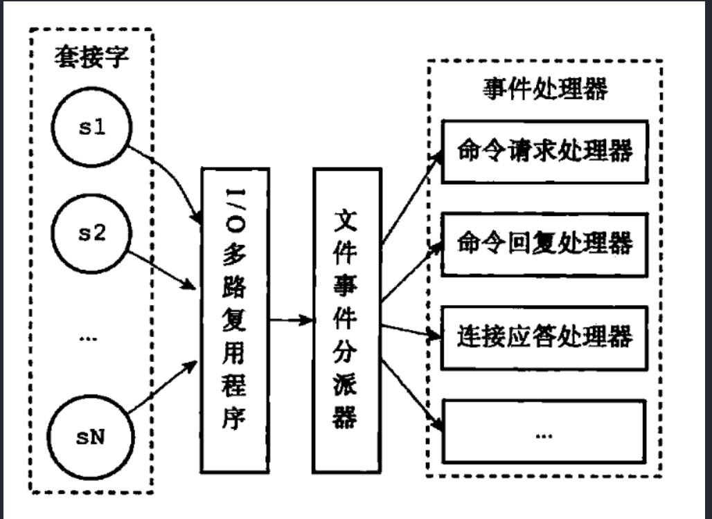

https://blog.lupf.cn/articles/2021/02/03/1612316917867.html#toc_h4_35

### 1.1 简单介绍下redis
简单来说 Redis 就是⼀个使⽤ C 语⾔开发的内存数据库，读写速度⾮常快，因此 Redis 被⼴泛应⽤于缓存⽅向。另外， Redis 除了做缓存之外， Redis 也经常⽤来做分布式锁，甚⾄是消息队列。Redis 提供了多种数据类型来⽀持不同的业务场景。 Redis 还⽀持事务 、持久化、 Lua 脚本、多种集群⽅案。Redis 本质上是一个 Key-Value 类型的内存数据库，定期通过异步操作把数据库数据 flush 到硬盘上进行保存。因为是纯内存操作，Redis 的性能非常出色，每秒可以处理超过 10 万次读写操作，是已知性能最快的 Key-Value DB。Redis 的出色之处不仅仅是性能，Redis 最大的魅力是支持保存多种数据结构，此外单个value 的最大限制是 1GB，不像 memcached 只能保存 1MB 的数据，因此 Redis 可以用来实现很多有用的功能，比方说用他的 List 来做FIFO 双向链表，实现一个轻量级的高性 能消息队列服务，用他的 Set 可以做高性能的 tag 系统等等。另外 Redis 也可以对存入的Key-Value 设置 expire 时间，因此也可以被当作一 个功能加强版的 memcached 来用。Redis 的主要缺点是数据库容量受到物理内存的限制，不能用作海量数据的高性能读写，因此 Redis 适合的场景主要局限在较小数据量的高性能操作和运算上。

### 1.2 分布式缓存常⻅的技术选型⽅案有哪些？redis和memcached对比？为什么选择redis做缓存？
分布式缓存的话，使⽤的⽐较多的主要是 Memcached 和 Redis。
1. memcached 所有的值均是简单的字符串，Redis 作为其替代者，支持更为丰富的数据类型
2. Redis 的速度比 memcached 快很多
3. Redis 可以持久化其数据
共同点 ：
1. 都是基于内存的数据库，⼀般都⽤来当做缓存使⽤。
2. 都有过期策略。
3. 两者的性能都⾮常⾼。
区别 ：
1. Redis ⽀持更丰富的数据类型（⽀持更复杂的应⽤场景） 。 Redis 不仅仅⽀持简单的 k/v 类
型的数据，同时还提供 list， set， zset， hash 等数据结构的存储。 Memcached 只⽀持最简
单的 k/v 数据类型。
2. Redis ⽀持数据的持久化，可以将内存中的数据保持在磁盘中，重启的时候可以再次加载进
⾏使⽤,⽽ Memecache 把数据全部存在内存之中。
3. Redis 有灾难恢复机制。 因为可以把缓存中的数据持久化到磁盘上。
4. Redis 在服务器内存使⽤完之后，可以将不⽤的数据放到磁盘上。但是， Memcached 在服
务器内存使⽤完之后，就会直接报异常。
5. Memcached 没有原⽣的集群模式，需要依靠客户端来实现往集群中分⽚写⼊数据；但是
Redis ⽬前是原⽣⽀持 cluster 模式的.
6. Memcached 是多线程，⾮阻塞 IO 复⽤的⽹络模型； Redis 使⽤单线程的多路 IO 复⽤模
型。 （Redis 6.0 引⼊了多线程 IO ）
7. Redis ⽀持发布订阅模型、 Lua 脚本、事务等功能，⽽ Memcached 不⽀持。并且， Redis
⽀持更多的编程语⾔。
8. Memcached过期数据的删除策略只⽤了惰性删除，⽽ Redis 同时使⽤了惰性删除与定期删
除。

### 1.3 Redis常用数据结构、存储模型及使用场景？
Redis 支持哪几种数据类型？String、List、Set、Sorted Set、hash
- 会话缓存（Session Cache）
最常用的一种使用 Redis 的情景是会话缓存（session cache）。用 Redis 缓存会话比其他存储（如 Memcached）的优势在于：Redis 提供持久化。
- 全页缓存（FPC）
除基本的会话 token 之外，Redis 还提供很简便的 FPC 平台。回到一致性问题，即使重启了 Redis 实例，因为有磁盘的持久化，用户也不会看到页面加载速度的下降，这是一个极大改进，类似 PHP 本地 FPC。再次以 Magento 为例，Magento 提供一个插件来使用 Redis 作为全页缓存后端。此外，对 WordPress 的用户来说，Pantheon 有一个非常好的插件 wp-Redis，这个插件能帮助你以最快速度加载你曾浏览过的页面。
- 队列 
Redis在内存存储引擎领域的一大优点是提供 list 和 set 操作，这使得 Redis 能作为一个很好的消息队列平台来使用。Redis 作为队列使用的操作，就类似于本地程序语言（如Python） 对 list 的 push/pop 操 作 。
- 排行榜/计数器
Redis 在内存中对数字进行递增或递减的操作实现的非常好。集合（Set）和有序集合（Sorted Set）也使得我们在执行这些操作的时候变的非常简单，Redis 只是正好提供了这两种数据结构。所以， 我们要从排序集合中获取到排名最靠前的 10 个用户– 我们称之为“user_scores”，我们只需要像下面一样执行即可：当然，这是假定你是根据你用户的分数做递增的排序。如果你想返回用户及用户的分数，你需要这样执行：ZRANGE user_scores 0 10 WITHSCORES Agora Games
就是一个很好的例子，用 Ruby 实现的，它的排行榜就是使用 Redis 来存储数据的，你可以在这里看到。⽐如：你可以将⼀个⽤户所有的关注⼈存在⼀个集合中，将其所有粉丝存在⼀个集合。 Redis 可以⾮常⽅便的实现如共同关注、共同粉丝、共同喜好等功能。这个过程也就是求交集的过程。set应⽤场景: 需要存放的数据不能重复以及需要获取多个数据源交集和并集等场景。 sortedset应⽤场景： 需要对数据根据某个权重进⾏排序的场景。⽐如在直播系统中，实时排⾏信息包含直播间在线⽤户列表，各种礼物排⾏榜，弹幕消息（可以理解为按消息维度的消息排⾏榜）等信息。
- 发布/订阅
发布/订阅的使用场景确实非常多。我已看见人们在社交网络连接中使用，还可作为基于发布/订阅的脚本触发器，甚至用 Redis 的发布/订阅功能来建立聊天系统。

 一个字符串类型的值能存储最大容量是多少？
512M
一个 Redis 实例最多能存放多少的 keys？List、Set、Sorted Set 他们最多能存放多少元素？
理论上 Redis 可以处理多达 2^32 的 keys，并且在实际中进行了测试，每个实例至少存放了 2亿 5 千万的 keys。我们正在测试一些较大的值。任何 list、set、和 sorted set 都可以放 232 个元素。换句话说，Redis 的存储极限是系统中的可用内存值。

### 1.4 Redis线程模型？为什么采用单线程？Redis6.0后为何引入多线程？
**Redis 单线程模型详解**
Redis 基于 Reactor 模式来设计开发了⾃⼰的⼀套⾼效的事件处理模型 （Netty 的线程模型也基
于 Reactor 模式， Reactor 模式不愧是⾼性能 IO 的基⽯），这套事件处理模型对应的是 Redis
中的⽂件事件处理器（file event handler）。由于⽂件事件处理器（file event handler）是单线程
⽅式运⾏的，所以我们⼀般都说 Redis 是单线程模型。
既然是单线程，那怎么监听⼤量的客户端连接呢？
Redis 通过IO 多路复⽤程序 来监听来⾃客户端的⼤量连接（或者说是监听多个 socket），它会
将感兴趣的事件及类型(读、写）注册到内核中并监听每个事件是否发⽣。这样的好处⾮常明显： I/O 多路复⽤技术的使⽤让 Redis 不需要额外创建多余的线程来监听客户端的⼤量连接，降低了资源的消耗（和 NIO 中的 Selector 组件很像）。另外， Redis 服务器是⼀个事件驱动程序，服务器需要处理两类事件： 1. ⽂件事件; 2. 时间事件。时间事件不需要多花时间了解，我们接触最多的还是 ⽂件事件（客户端进⾏读取写⼊等操作，涉及⼀系列⽹络通信）。《Redis 设计与实现》有⼀段话是如是介绍⽂件事件的，我觉得写得挺不错 

>Redis 基于 Reactor 模式开发了⾃⼰的⽹络事件处理器：这个处理器被称为⽂件事件处理器
（file event handler）。⽂件事件处理器使⽤ I/O 多路复⽤（multiplexing）程序来同时监听多个套接字，并根据 套接字⽬前执⾏的任务来为套接字关联不同的事件处理器。被监听的套接字准备好执⾏连接应答（accept）、读取（read）、写⼊（write）、关 闭（close）等操作时，与操作相对应的⽂件事件就会产⽣，这时⽂件事件处理器就会调⽤套接字之前关联好的事件处理器来处理这些事件。虽然⽂件事件处理器以单线程⽅式运⾏，但通过使⽤ I/O 多路复⽤程序来监听多个套接字，⽂件事件处理器既实现了⾼性能的⽹络通信模型，⼜可以很好地与 Redis 服务器中其他同样以单线程⽅式运⾏的模块进⾏对接，这保持了 Redis 内部单线程设计的简单性。

可以看出，⽂件事件处理器（file event handler）主要是包含 4 个部分：
- 多个 socket（客户端连接）
- IO 多路复⽤程序（⽀持多个客户端连接的关键）
- ⽂件事件分派器（将 socket 关联到相应的事件处理器）
- 事件处理器（连接应答处理器、命令请求处理器、命令回复处理器）

Redis 是单线程的，如何提高多核 CPU 的利用率？可以在同一个服务器部署多个 Redis 的实例，并把他们当作不同的服务器来使用，在某些时候，无论如何一个服务器是不够的，所以，如果你想使用多个 CPU，你可以考虑一下分片（shard）。

**Redis 没有使⽤多线程？为什么不使⽤多线程？ **
Redis 4.0 增加的多线程主要是针对⼀些⼤键值对的删除操作的命令，使⽤这些命令就会使⽤主处理之外的其他线程来“异步处理”。⼤体上来说， Redis 6.0 之前主要还是单线程处理。那， Redis6.0 之前 为什么不使⽤多线程？
我觉得主要原因有下⾯ 3 个：
1. 单线程编程容易并且更容易维护；纯内存操作速度快
2. Redis 的性能瓶颈不再 CPU ，主要在内存和⽹络；
3. 多线程就会存在死锁、线程上下⽂切换等问题，甚⾄会影响性能。 单线程无需上下文切换

**Redis6.0 之后为何引⼊了多线程？**
Redis6.0 引⼊多线程主要是为了提⾼⽹络 IO 读写性0能，因为这个算是 Redis 中的⼀个性能瓶颈
（Redis 的瓶颈主要受限于内存和⽹络）。虽然， Redis6.0 引⼊了多线程，但是 Redis 的多线程只是在⽹络数据的读写这类耗时操作上使⽤了， 执⾏命令仍然是单线程顺序执⾏。因此，你也不需要担⼼线程安全问题。Redis6.0 的多线程默认是禁⽤的，只使⽤主线程。如需开启需要修改 redis 配置⽂件 redis.conf： io-threads-reads yes
开启多线程后，还需要设置线程数，否则是不⽣效的。同样需要修改 redis 配置⽂件 redis.conf :
io-threads 3

### 1.5 过期的数据的删除策略了解么？Redis内存淘汰机制？Redis 回收进程如何工作的？
**Redis是如何判断数据是否过期的呢？**
Redis 通过⼀个叫做过期字典（可以看作是hash表）来保存数据过期的时间。过期字典的键指向
Redis数据库中的某个key(键)，过期字典的值是⼀个long long类型的整数，这个整数保存了key所
指向的数据库键的过期时间（毫秒精度的UNIX时间戳）。
**过期的数据的删除策略了解么？**
如果假设你设置了⼀批 key 只能存活 1 分钟，那么 1 分钟后， Redis 是怎么对这批 key 进⾏删除
的呢？常⽤的过期数据的删除策略就两个（重要！⾃⼰造缓存轮⼦的时候需要格外考虑的东⻄）：
- 惰性删除 ：只会在取出key的时候才对数据进⾏过期检查。这样对CPU最友好，但是可能会
造成太多过期 key 没有被删除。
- 定期删除 ： 每隔⼀段时间抽取⼀批 key 执⾏删除过期key操作。并且， Redis 底层会通过限
制删除操作执⾏的时⻓和频率来减少删除操作对CPU时间的影响。
定期删除对内存更加友好，惰性删除对CPU更加友好。两者各有千秋，所以Redis 采⽤的是 定期
删除+惰性/懒汉式删除 。但是，仅仅通过给 key 设置过期时间还是有问题的。因为还是可能存在定期删除和惰性删除漏掉了很多过期 key 的情况。这样就导致⼤量过期 key 堆积在内存⾥，然后就Out of memory了。怎么解决这个问题呢？答案就是： Redis 内存淘汰机制。

**Redis 提供 6 种数据淘汰策略：**
- no-eviction
返回错误当内存限制达到并且客户端尝试执行会让更多内存被使用的命令（大部分的写入指令，但 DEL 和几个例外）
- allkeys-lru
尝试回收最少使用的键（LRU），使得新添加的数据有空间存放。
- volatile-lru
尝试回收最少使用的键（LRU），但仅限于在过期集合的键,使得新添加的数据有空间存放。
- allkeys-random
回收随机的键使得新添加的数据有空间存放。
- volatile-random
回收随机的键使得新添加的数据有空间存放，但仅限于在过期集合的键。
- volatile-ttl
回收在过期集合的键，并且优先回收存活时间（TTL）较短的键,使得新添加的数据有空间存放。
4.0 版本后增加以下两种：
- volatile-lfu（least frequently used） ：从已设置过期时间的数据集(server.db[i].expires)中
挑选最不经常使⽤的数据淘汰
- allkeys-lfu（least frequently used） ：当内存不⾜以容纳新写⼊数据时，在键空间中，移
除最不经常使⽤的 key

**Redis 回收进程如何工作的？**
一个客户端运行了新的命令，添加了新的数据。Redis 检查内存使用情况，如果大于 maxmemory 的限制, 则根据设定好的策略进行回收。一个新的命令被执行，等等。所以我们不断地穿越内存限制的边界，通过不断达到边界然后不断地回收回到边界以下。如果一个命令的结果导致大量内存被使用（例如很大的集合的交集保存到一个新的键），不用多久内存限制就会被这个内存使用量超越。

### 1.6 Redis持久化机制？应用场景？如何选择合适的持久化方式？	
**Redis 持久化数据和缓存怎么做扩容？**
如果 Redis 被当做缓存使用，使用一致性哈希实现动态扩容缩容。如果 Redis 被当做一个持久化存储使用，必须使用固定的 keys-to-nodes 映射关系，节点的数量一旦确定不能变化。否则的话(即 Redis 节点需要动态变化的情况），必须使用可以在运行时进行数据再平衡的一套系统，而当前只有 Redis 集群可以做到这样。

**Redis 提供了哪几种持久化方式？**
RDB 持久化方式(默认)能够在指定的时间间隔能对你的数据进行快照存储.
AOF 持久化方式（手动开启）记录每次对服务器写的操作,当服务器重启的时候会重新执行这些命令来恢复原始的数据,AOF 命令以 Redis 协议追加保存每次写的操作到文件末尾.Redis 还能对AOF 文件进行后台重写,使得 AOF 文件的体积不至于过大.如果你只希望你的数据在服务器运行的时候存在,你也可以不使用任何持久化方式.你也可以同时开启两种持久化方式, 在这种情况下, 当 Redis 重启的时候会优先载入 AOF 文件来恢复原始的数据,因为在通常情况下AOF 文件保存的数据集要比RDB 文件保存的数据集要完整.最重要的事情是了解 RDB 和 AOF 持久化方式的不同,让我们以 RDB 持久化方式开始。

**如何选择合适的持久化方式？**
一般来说， 如果想达到足以媲美 PostgreSQL 的数据安全性， 你应该同时使用两种持久化功能。如果你非常关心你的数据， 但仍然可以承受数分钟以内的数据丢失，那么你可以只使用 RDB 持久化。
有很多用户都只使用 AOF 持久化， 但并不推荐这种方式： 因为定时生成 RDB 快照（snapshot）非常便于进行数据库备份， 并且 RDB 恢复数据集的速度也要比 AOF 恢复的速度要快，除此之外， 使用 RDB 还可以避免之前提到的 AOF 程序的 bug。Redis 4.0 开始⽀持 RDB 和 AOF 的混合持久化（默认关闭，可以通过配置项 aof-use-rdbpreamble 开启）。如果把混合持久化打开， AOF 重写的时候就直接把 RDB 的内容写到 AOF ⽂件开头。这样做的好处是可以结合 RDB 和 AOF 的优点, 快速加载同时避免丢失过多的数据。当然缺点也是有的，AOF ⾥⾯的 RDB 部分是压缩格式不再是 AOF 格式，可读性较差。
补充内容：** AOF 重写**
AOF 重写可以产⽣⼀个新的 AOF ⽂件，这个新的 AOF ⽂件和原有的 AOF ⽂件所保存的数据库
状态⼀样，但体积更⼩。AOF 重写是⼀个有歧义的名字，该功能是通过读取数据库中的键值对来实现的，程序⽆须对现有AOF ⽂件进⾏任何读⼊、分析或者写⼊操作。在执⾏ BGREWRITEAOF 命令时， Redis 服务器会维护⼀个 AOF 重写缓冲区，该缓冲区会在⼦进程创建新 AOF ⽂件期间，记录服务器执⾏的所有写命令。当⼦进程完成创建新 AOF ⽂件的⼯作之后，服务器会将重写缓冲区中的所有内容追加到新 AOF ⽂件的末尾，使得新旧两个 AOF ⽂件所保存的数据库状态⼀致。最后，服务器⽤新的 AOF ⽂件替换旧的 AOF ⽂件，以此来完成AOF ⽂件重写操作。

### 1.7 怎么理解 Redis 事务？
Redis 可以通过 MULTI， EXEC， DISCARD 和 WATCH 等命令来实现事务(transaction)功能。Redis 是不⽀持 roll back 的，因⽽不满⾜原⼦性的（⽽且不满⾜持久性）。Redis官⽹也解释了⾃⼰为啥不⽀持回滚。简单来说就是Redis开发者们觉得没必要⽀持回滚，这样更简单便捷并且性能更好。 Redis开发者觉得即使命令执⾏错误也应该在开发过程中就被发现⽽不是⽣产过程中。将Redis中的事务就理解为 ： Redis事务提供了⼀种将多个命令请求打包的功能。然后，再按顺序执⾏打包的所有命令，并且不会被中途打断。

### 1.8 缓存数据的处理流程？
前台请求，后台先从缓存中取数据，取到直接返回结果，取不到时从数据库中取，数据库取到更新缓存，并返回结果，数据库也没取到，那直接返回空结果。

### 1.9 缓存穿透
**问题描述：**
        缓存穿透是指缓存和数据库中都没有的数据，而用户不断发起请求，如发起为id为“-1”的数据或id为特别大不存在的数据。这时的用户很可能是攻击者，攻击会导致数据库压力过大。
**解决方案：**
1.接口层增加校验，如用户鉴权校验，id做基础校验，id<=0的直接拦截；
2.缓存无效的key

从缓存取不到的数据，在数据库中也没有取到，这时也可以将key-value对写为key-null，缓存有效时间可以设置短点，如30秒（设置太长会导致正常情况也没法使用）。这样可以防止攻击用户反复用同一个id暴力攻击。这种⽅式可以解决请求的 key 变化不频繁的情况 ，如果⿊客恶意攻击，每次构建不同的请求 key，会导致 Redis 中缓存⼤量⽆效的 key 。很明显，这种⽅案并不能从根本上解决此问题。如果⾮要⽤这种⽅式来解决穿透问题的话，尽量将⽆效的 key 的过期时间设置短⼀点⽐如 1 分钟。

3.布隆过滤器

[布隆过滤器](https://github.com/Snailclimb/JavaGuide/blob/master/docs/dataStructures-algorithms/data-structure/bloom-filter.md)

布隆过滤器是⼀个⾮常神奇的数据结构，通过它我们可以⾮常⽅便地判断⼀个给定数据是否存在于海量数据中。我们需要的就是判断 key 是否合法，有没有感觉布隆过滤器就是我们想要找的那个“⼈”。具体是这样做的：把所有可能存在的请求的值都存放在布隆过滤器中，当⽤户请求过来，先判断⽤户发来的请求的值是否存在于布隆过滤器中。不存在的话，直接返回请求参数错误信息给客户端，存在的话才会⾛下⾯的流程。但是，需要注意的是布隆过滤器可能会存在误判的情况。总结来说就是： 布隆过滤器说某个元素存在，⼩概率会误判。布隆过滤器说某个元素不在，那么这个元素⼀定不在。 

### 1.10 缓存击穿
**问题描述：**
缓存击穿是指缓存中没有但数据库中有的数据（一般是缓存时间到期），这时由于并发用户特别多，同时读缓存没读到数据，又同时去数据库去取数据，引起数据库压力瞬间增大，造成过大压力
**解决方案：**
1.设置热点数据永远不过期。
2.加互斥锁，最好按key加锁：

### 1.11 缓存雪崩
**问题描述：**
缓存雪崩是指缓存中数据大批量到过期时间，而查询数据量巨大，引起数据库压力过大甚至down机。和缓存击穿不同的是，缓存击穿指并发查同一条数据，缓存雪崩是不同数据都过期了，很多数据都查不到从而查数据库。
**解决方案：**
1.缓存数据的过期时间设置随机，防止同一时间大量数据过期现象发生。
2.如果缓存数据库是分布式部署，将热点数据均匀分布在不同搞得缓存数据库中。
3.设置热点数据永远不过期。
4.限流降级

### 1.12 如何保证缓存和数据库数据一致性？
Cache Aside Pattern（旁路缓存模式）来聊聊。Cache Aside Pattern 中遇到写请求是这样的：更新 DB，然后直接删除 cache 。如果更新数据库成功，⽽删除缓存这⼀步失败的情况的话，简单说两个解决⽅案：
1. 缓存失效时间变短（不推荐，治标不治本）：我们让缓存数据的过期时间变短，这样的话缓存就会从数据库中加载数据。另外，这种解决办法对于先操作缓存后操作数据库的场景不适⽤。
2. 增加cache更新重试机制（常⽤）：如果 cache 服务当前不可⽤导致缓存删除失败的话，我们就隔⼀段时间进⾏重试，重试次数可以⾃⼰定。如果多次重试还是失败的话，我们可以把当前更新失败的 key 存⼊队列中，等缓存服务可⽤之后，再将 缓存中对应的 key 删除即可。

### 1.13 热点key检查及如何处理热点问题？
可以用redis-faina工具进行热点key检测；

某个key访问非常频繁，

现象一：key对应的value存储在集群中某台机器上导致所有流浪涌向该台机器
参考方案：1 热点key分散为多个子key然后存储到集群的不同机器上；2客户端缓存热点key

现象二：热点key过期导致大量线程重建缓存
参考方案：1加锁只允许一个线程重建 2 永不过期 3 其他方案

引入本地缓存作为一级缓存，比如guava-cache，redis作为二级缓存

高可用 容灾 集群

### 1.14 redis分布式锁

### 1.15 Redis 如何设置密码及验证密码？
设置密码
config set requirepass 123456
授权密码
auth 123456

### 1.16  MySQL 里有 2000w 数据，Redis 中只存 20w 的数据，如何保证 Redis 中的数据都是热点数据？
Redis 内存数据集大小上升到一定大小的时候，就会施行数据淘汰策略。

### 1.17 Redis 支持的 Java 客户端有哪些？Jedis 与 Redisson 对比有什么优缺点？ 支持一致性哈希的客户端有哪些？
Redisson、Jedis、lettuce 等等。官方推荐使用 Redisson。Redisson是一个高级的分布式协调 Redis 客服端，能帮助用户在分布式环境中轻松实现一些Java 的对象 (Bloom filter, BitSet, Set, SetMultimap, ScoredSortedSet, SortedSet, Map, ConcurrentMap, List, ListMultimap, Queue, BlockingQueue, Deque, BlockingDeque, Semaphore, Lock, ReadWriteLock, AtomicLong, CountDownLatch, Publish / Subscribe, HyperLogLog) 

支持一致性哈希的客户端有哪些？Redis-rb、PRedis 等。

Jedis 是 Redis 的 Java 实现的客户端，其 API 提供了比较全面的 Redis 命令的支持；
Redisson 实现了分布式和可扩展的 Java 数据结构，和 Jedis 相比，功能较为简单，不支持字符串操作，不支持排序、事务、管道、分区等 Redis 特性。Redisson 的宗旨是促进使用者对 Redis 的关注分离，从而让使用者能够将精力更集中地放在处理业务逻辑上。

### 1.18 Redis 如何做大量数据插入？Redis 中的管道有什么用？
Redis2.6 开始 Redis-cli 支持一种新的被称之为pipe mode 的新模式用于执行大量数据插入工作。
一次请求/响应服务器能实现处理新的请求即使旧的请求还未被响应。这样就可以将多个命令发送到服务器，而不用等待回复，最后在一个步骤中读取该答复。这就是管道（pipelining），是一种几十年来广泛使用的技术。例如许多 POP3 协议已经实现支持这个功能，大大加快了从服务器下载新邮件的过程。

### 1.19 Redis key 的过期时间和永久有效分别怎么设置？Redis 给缓存数据设置过期时间有啥⽤？
EXPIRE 和 PERSIST 命令
注意： Redis中除了字符串类型有⾃⼰独有设置过期时间的命令 setex 外，其他⽅法都需要依靠
expire 命令来设置过期时间 。另外， persist 命令可以移除⼀个键的过期时间：过期时间除了有助于缓解内存的消耗，还有什么其他⽤么？很多时候，我们的业务场景就是需要某个数据只在某⼀时间段内存在，⽐如我们的短信验证码可能只在1分钟内有效，⽤户登录的 token 可能只在 1 天内有效。如果使⽤传统的数据库来处理的话，⼀般都是⾃⼰判断过期，这样更麻烦并且性能要差很多。

### 1.20 查看 Redis 使用情况及状态信息用什么命令？
info

### 1.21 Redis 常见性能问题和解决方案？
Master 最好不要做任何持久化工作，如 RDB 内存快照和 AOF 日志文件
如果数据比较重要，某个 Slave 开启 AOF 备份数据，策略设置为每秒同步一次
为了主从复制的速度和连接的稳定性，Master 和 Slave 最好在同一个局域网内<
尽量避免在压力很大的主库上增加从库
主从复制不要用图状结构，用单向链表结构更为稳定，即：Master <- Slave1 <- Slave2<- Slave3…

### 1.22 Redis 集群方案应该怎么做？都有哪些方案？
- Twemproxy
大概概念是，它类似于一个代理方式，使用方法和普通 Redis 无任何区别， 设置好它下属的多个 Redis 实例后， 使用时在本需要连接 Redis 的地方改为连接twemproxy，它会以一个代理的身份接收请求并使用一致性 hash 算法，将请求转接到具体 Redis，将结果再返回 twemproxy。使用方式简便(相对 Redis 只需修改连接端口)，对旧项目扩展的首选。 Twemproxy 支持自动分区，如果其代理的其中一个 Redis 节点不可用时，会自动将该节点排除（这将改变原来的 keys-instances 的映射关系，所以你应该仅在把 Redis 当缓存时使用 Twemproxy)。Twemproxy 本身不存在单点问题，因为你可以启动多个 Twemproxy 实例，然后让你的客户端去连接任意一个 Twemproxy 实例。Twemproxy 是 Redis 客户端和服务器端的一个中间层，由它来处理分区功能应该不算复杂，并且应该算比较可靠的。问题：twemproxy 自身单端口实例的压力，使用一致性 hash 后，对Redis 节点数量改变时候的计算值的改变，数据无法自动移动到新的节点。
- codis
目前用的最多的集群方案，基本和 twemproxy 一致的效果，但它支持在节点数量改变情况下，旧节点数据可恢复到新 hash 节点。
- Redis cluster
3.0 自带的集群，特点在于他的分布式算法不是一致性 hash，而是 hash 槽的概念，以及自身支持节点设置从节点。具体看官方文档介绍。
- 在业务代码层实现
起几个毫无关联的 Redis 实例，在代码层，对 key 进行 hash 计算， 然后去对应的 Redis 实例操作数据。 这种方式对 hash 层代码要求比较高，考虑部分包括， 节点失效后的替代算法方案，数据震荡后的自动脚本恢复，实例的监控，等等

### 1.23 Redis 集群方案什么情况下会导致整个集群不可用？
有 A，B，C 三个节点的集群,在没有复制模型的情况下,如果节点 B 失败了，那么整个集群就会以为缺少 5501-11000 这个范围的槽而不可用。

### 1.24  说说 Redis 哈希槽的概念？
Redis 集群没有使用一致性 hash,而是引入了哈希槽的概念，Redis 集群有 16384 个哈希槽， 每个 key 通过 CRC16 校验后对 16384 取模来决定放置哪个槽，集群的每个节点负责一部分hash 槽。

### 1.25 Redis 集群的主从复制模型是怎样的
为了使在部分节点失败或者大部分节点无法通信的情况下集群仍然可用，所以集群使用了主从复制模型,每个节点都会有 N-1 个复制品.

### 1.26  Redis 集群如何选择数据库？
Redis 集群目前无法做数据库选择 单节点，默认在 0 数据库。

### 1.27 分布式Redis 是前期做还是后期规模上来了再做好？为什么？
既然 Redis 是如此的轻量（单实例只使用 1M 内存）,为防止以后的扩容，最好的办法就是一开始就启动较多实例。即便你只有一台服务器，你也可以一开始就让 Redis 以分布式的方式运行，使用分区，在同一台服务器上启动多个实例。一开始就多设置几个 Redis 实例，例如 32 或者 64 个实例，对大多数用户来说这操作起来可能比较麻烦，但是从长久来看做这点牺牲是值得的。这样的话，当你的数据不断增长，需要更多的 Redis 服务器时，你需要做的就是仅仅将 Redis 实例从一台服务迁移到另外一台服务器而已（而不用考虑重新分区的问题）。一旦你添加了另一台服务器，你需要将你一半的 Redis 实例从第一台机器迁移到第二台机器。

### 1.28 高可用
单机、主从、哨兵、redis-clusterl

### 1.29 redis的key说如何寻址的？分布式寻址算法？一致性hash算法？

### 1.30 redis集群模式工作原理？

### 1.31 大key优化

