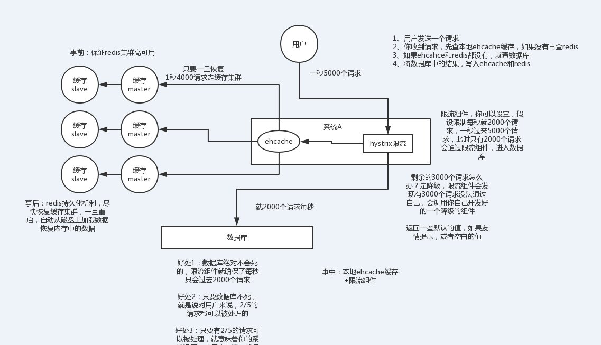

https://blog.lupf.cn/articles/2021/02/03/1612316917867.html#toc_h4_35

https://mp.weixin.qq.com/s/MQ_a6o1e9f2ZZSwelNt0oA

项目中怎么用的，为什么这么用，使用中遇到了什么问题，怎么解决的

https://mp.weixin.qq.com/s/zXf4YiOpFwYOrseWW5GWOA

**重点**

1 redis线程模型、存储模型 sortedSet 跳表，存入100和存入helloworld区别

2 缓存穿透、缓存击穿、缓存雪崩、双写一致性问题

3 热点key问题、大key优化

4 redis集群 主从复制原理、sentinel、redis cluster

5 布隆过滤器

6 一致性hash

说实话，这一套东西基本构成了缓存这块你必须知道的基础性的知识，如果你不知道，那么说明你有点失职，确实平时没好好积累。因为这些问题确实不难，如果我往深了问，可以问的很细，结合项目扣的很细，比如你们公司线上系统高峰QPS 3000？那请求主要访问哪些接口？redis抗了多少请求？mysql抗了多少请求？你到底是怎么实现高并发的？咱们聊聊redis的内核吧，看看你对底层了解的多么？如果要缓存几百GB的数据会有什么坑该这么弄？如果缓存出现热点现象该这么处理？某个value特别大把网卡给打死了怎么办？等等等等，可以深挖的东西其实有很多。。。。。 

但是如果你掌握好了这套东西的回答，那么你在面试的时候，如果面试官没有全都问到，你可以自己主动合盘脱出。比如你可以说，我们线上的缓存，做了啥啥机制，防止雪崩、防止穿透、保证双写时的数据一致性、保证并发竞争时的数据一致性，脑裂问题，我们线上咋部署的，啥架构，怎么玩儿的。这套东西你可以自己说出来，展示一下你对缓存这块的掌握。

### 1.1 简单介绍下redis
简单来说 Redis 就是⼀个使⽤ C 语⾔开发的内存数据库，读写速度⾮常快，因此 Redis 被⼴泛应⽤于缓存⽅向。另外， Redis 除了做缓存之外， Redis 也经常⽤来做分布式锁，甚⾄是消息队列。Redis 提供了多种数据类型来⽀持不同的业务场景。 Redis 还⽀持事务 、持久化、 Lua 脚本、多种集群⽅案。

Redis是一个 Key-Value 类型的内存数据库，定期通过异步操作把数据库数据 flush 到硬盘上进行保存。因为是纯内存操作，Redis 的性能非常出色，每秒可以处理超过 10 万次读写操作，是已知性能最快的 Key-Value DB。Redis最大的魅力是支持保存多种数据结构，此外单个value 的最大限制是 1GB，不像 memcached 只能保存 1MB 的数据，因此 Redis 可以用来实现很多有用的功能，比方说用他的 List 来做FIFO 双向链表，实现一个轻量级的高性能消息队列服务，用他的 Set 可以做高性能的 tag 系统等等。另外 Redis 也可以对存入的Key-Value 设置 expire 时间。

Redis 的主要缺点是数据库容量受到物理内存的限制，不能用作海量数据的高性能读写，因此 Redis 适合的场景主要局限在较小数据量的高性能操作和运算上。

### 1.2 分布式缓存常⻅的技术选型⽅案有哪些？redis和memcached对比？为什么选择redis做缓存？
分布式缓存的话，使⽤的⽐较多的主要是 Memcached 和 Redis。两者都是高性能内存数据库，都有过期策略。
1. Redis⽀持更丰富的数据类型 。 Redis 不仅⽀持简单的 k/v 类型的数据，同时还提供 list， set， zset， hash 等数据结构的存储。 Memcached 只⽀持最简单的 k/v 数据类型， 所有的值均是简单的字符串。
2. Redis 的速度比 memcached 快很多
3. Redis ⽀持数据持久化，可以将内存中数据保持在磁盘中，重启的时候可以再次加载,⽽ Memecache 把数据全部存在内存之中。
4. Memcached 没有集群模式，依靠客户端来实现往集群中分⽚写⼊数据；但Redis原⽣⽀持 cluster 模式的。
5. Memcached 是多线程，⾮阻塞 IO 复⽤的⽹络模型； Redis 使⽤单线程的多路 IO 复⽤模型。 
6. Redis ⽀持发布订阅模型、 Lua 脚本、事务等，⽽Memcached不⽀持。并且Redis⽀持更多的编程语⾔。
7. Memcached过期数据删除策略只⽤惰性删除，⽽ Redis 同时使⽤惰性删除与定期删除。

### 1.3 Redis常用数据结构及使用场景？存储模型？

面试题分析：要结合项目中的使用聊(String路由信息，知鸟直播间签到SortedSet，还有List用作队列等)，**连环炮**：底层存储模型，比如SortedSet底层怎么搞的，能答出来就是脱颖而出的加分点，vivo就问到了

Redis 支持哪几种数据类型？String、List、Set、Sorted Set、hash

list应用场景：比如可以通过list存储一些列表型的数据结构，类似粉丝列表了、文章的评论列表了之类的东西，比如可以通过lrange命令，就是从某个元素开始读取多少个元素，可以基于list实现分页查询，这个很棒的一个功能，基于redis实现简单的高性能分页，可以做类似微博那种下拉不断分页的东西，性能高，就一页一页走，比如可以搞个简单的消息队列，从list头怼进去，从list尾巴那里弄出来。

set应用场景：可以基于set玩儿交集、并集、差集的操作，比如交集吧，可以把两个人的粉丝列表整一个交集，看看俩人的共同好友是谁？对吧，把两个大v的粉丝都放在两个set中，对两个set做交集

SortedSet：排行榜，将每个用户以及其对应的什么分数写入进去，zadd board score username，接着zrevrange board 0 99，就可以获取排名前100的用户；zrank board username，可看到用户在排行榜里的排名

**Redis应用场景**

- 会话缓存（Session Cache）
最常用的一种使用 Redis 的情景是会话缓存（session cache）。用 Redis 缓存会话比其他存储（如 Memcached）的优势在于：Redis 提供持久化。
- 全页缓存（FPC）
除基本的会话 token 之外，Redis 还提供很简便的 FPC 平台。回到一致性问题，即使重启了 Redis 实例，因为有磁盘的持久化，用户也不会看到页面加载速度的下降，这是一个极大改进，类似 PHP 本地 FPC。再次以 Magento 为例，Magento 提供一个插件来使用 Redis 作为全页缓存后端。此外，对 WordPress 的用户来说，Pantheon 有一个非常好的插件 wp-Redis，这个插件能帮助你以最快速度加载你曾浏览过的页面。
- 队列 
Redis在内存存储引擎领域的一大优点是提供 list 和 set 操作，这使得 Redis 能作为一个很好的消息队列平台来使用。Redis 作为队列使用的操作，就类似于本地程序语言（如Python） 对 list 的 push/pop 操 作 。
- 排行榜/计数器
Redis 在内存中对数字进行递增或递减的操作实现的非常好。集合（Set）和有序集合（Sorted Set）也使得我们在执行这些操作的时候变的非常简单，Redis 只是正好提供了这两种数据结构。所以， 我们要从排序集合中获取到排名最靠前的 10 个用户– 我们称之为“user_scores”，我们只需要像下面一样执行即可：当然，这是假定你是根据你用户的分数做递增的排序。如果你想返回用户及用户的分数，你需要这样执行：ZRANGE user_scores 0 10 WITHSCORES Agora Games
就是一个很好的例子，用 Ruby 实现的，它的排行榜就是使用 Redis 来存储数据的，你可以在这里看到。⽐如：你可以将⼀个⽤户所有的关注⼈存在⼀个集合中，将其所有粉丝存在⼀个集合。 Redis 可以⾮常⽅便的实现如共同关注、共同粉丝、共同喜好等功能。这个过程也就是求交集的过程。set应⽤场景: 需要存放的数据不能重复以及需要获取多个数据源交集和并集等场景。 sortedset应⽤场景： 需要对数据根据某个权重进⾏排序的场景。⽐如在直播系统中，实时排⾏信息包含直播间在线⽤户列表，各种礼物排⾏榜，弹幕消息（可以理解为按消息维度的消息排⾏榜）等信息。
- 发布/订阅
发布/订阅的使用场景确实非常多。我已看见人们在社交网络连接中使用，还可作为基于发布/订阅的脚本触发器，甚至用 Redis 的发布/订阅功能来建立聊天系统。

 一个字符串类型的值能存储最大容量是多少？
512M
一个 Redis 实例最多能存放多少的 keys？List、Set、Sorted Set 他们最多能存放多少元素？
理论上 Redis 可以处理多达 2^32 的 keys，并且在实际中进行了测试，每个实例至少存放了 2亿 5 千万的 keys。我们正在测试一些较大的值。任何 list、set、和 sorted set 都可以放 232 个元素。换句话说，Redis 的存储极限是系统中的可用内存值。

**存储模型**

### 1.4 Redis线程模型？为什么采用单线程？为什么redis是单线程的但是还可以支撑高并发？Redis6.0后为何引入多线程？
**Redis 单线程模型详解**

Redis 基于 Reactor 模式来设计开发了⾃⼰的⼀套⾼效的事件处理模型 ，这套事件处理模型对应的是 Redis中的⽂件事件处理器（file event handler）。由于⽂件事件处理器是单线程⽅式运⾏的，所以我们⼀般都说 Redis 是单线程模型。

既然是单线程，那怎么监听⼤量的客户端连接呢？

Redis 通过IO 多路复⽤程序来监听来⾃客户端的⼤量连接（或者说是监听多个 socket），它会将感兴趣的事件及类型(读、写）注册到内核中并监听每个事件是否发⽣。这样的好处⾮常明显： I/O 多路复⽤技术的使⽤让 Redis 不需要额外创建多余的线程来监听客户端的⼤量连接，降低了资源的消耗（和 NIO 中的 Selector 组件很像）。另外， Redis 服务器是⼀个事件驱动程序，服务器需要处理两类事件：⽂件事件、时间事件。⽂件事件（客户端进⾏读取写⼊等操作，涉及⼀系列⽹络通信）。	

>Redis 基于 Reactor 模式开发了⾃⼰的⽹络事件处理器：这个处理器被称为⽂件事件处理器（file event handler）。⽂件事件处理器使⽤ I/O 多路复⽤（multiplexing）程序来同时监听多个套接字，并根据套接字⽬前执⾏的任务来为套接字关联不同的事件处理器。被监听的套接字准备好执⾏连接应答（accept）、读取（read）、写⼊（write）、关闭（close）等操作时，与操作相对应的⽂件事件就会产⽣，这时⽂件事件处理器就会调⽤套接字之前关联好的事件处理器来处理这些事件。虽然⽂件事件处理器以单线程⽅式运⾏，但通过使⽤ I/O 多路复⽤程序来监听多个套接字，⽂件事件处理器既实现了⾼性能的⽹络通信模型，⼜可以很好地与 Redis 服务器中其他同样以单线程⽅式运⾏的模块对接，这保持了 Redis 内部单线程设计的简单性。

可以看出，⽂件事件处理器（file event handler）主要是包含 4 个部分：
- 多个 socket（客户端连接）
- IO 多路复⽤程序（⽀持多个客户端连接的关键）
- ⽂件事件分派器（将 socket 关联到相应的事件处理器）
- 事件处理器（连接应答处理器、命令请求处理器、命令回复处理器）


Redis 是单线程的，如何提高多核 CPU 的利用率？可以在同一个服务器部署多个 Redis 的实例，并把他们当作不同的服务器来使用，在某些时候，无论如何一个服务器是不够的，所以，如果你想使用多个 CPU，你可以考虑一下分片（shard）。

**Redis 没有使⽤多线程？为什么不使⽤多线程？ **

Redis 4.0 增加的多线程主要是针对⼀些⼤键值对的删除操作的命令，使⽤这些命令就会使⽤主处理之外的其他线程来“异步处理”。⼤体上来说， Redis 6.0 之前主要还是单线程处理。那， Redis6.0 之前为什么不使⽤多线程？
我觉得主要原因有下⾯ 3 个：

1. 纯内存操作速度快，Redis 的性能瓶颈不再 CPU ，主要在内存和⽹络
2. 核心是基于非阻塞的IO多路复用机制，监听所有socket链接，然后压到队列中分派处理
3. 多线程会存在死锁、线程上下⽂切换等问题，甚⾄会影响性能。 而单线程无需上下文切换，编程简单易维护

**Redis6.0 之后为何引⼊了多线程？**

Redis6.0 引⼊多线程主要是为了提⾼⽹络 IO 读写性能，因为这个算是 Redis 中的⼀个性能瓶颈
（Redis 的瓶颈主要受限于内存和⽹络）。虽然， Redis6.0 引⼊了多线程，但是 Redis 的多线程只是在⽹络数据的读写这类耗时操作上使⽤了， 执⾏命令仍然是单线程顺序执⾏。因此，你也不需要担⼼线程安全问题。Redis6.0 的多线程默认是禁⽤的，只使⽤主线程。如需开启需要修改 redis 配置⽂件 redis.conf： io-threads-reads yes
开启多线程后，还需要设置线程数，否则是不⽣效的。同样需要修改 redis 配置⽂件 redis.conf :
io-threads 3

### 1.5 过期数据的删除策略了解么？Redis内存淘汰机制？Redis 回收进程如何工作的？手写LRU和LFU？
**Redis是如何判断数据是否过期的呢？**

Redis 通过⼀个叫做过期字典（可以看作是hash表）来保存数据过期的时间。过期字典的键指向Redis数据库中的某个key(键)，过期字典的值是⼀个long long类型的整数，这个整数保存了key所指向的数据库键的过期时间（毫秒精度的UNIX时间戳）。

**过期的数据的删除策略了解么？**

如果假设你设置了⼀批 key 只能存活 1 分钟，那么 1 分钟后， Redis 是怎么对这批 key 进⾏删除的呢？常⽤的过期数据的删除策略就两个：

- 惰性删除 ：只会在取出key的时候才对数据进⾏过期检查。这样对CPU最友好，但是可能会造成太多过期 key 没有被删除。
- 定期删除 ： 每隔⼀段时间抽取⼀批 key 执⾏删除过期key操作。并且， Redis 底层会通过限制删除操作执⾏的时⻓和频率来减少删除操作对CPU时间的影响。

定期删除对内存更加友好，惰性删除对CPU更加友好。两者各有千秋，所以Redis 采⽤的是定期删除+惰性删除 。但是，仅仅通过给 key 设置过期时间还是有问题的。因为还是可能存在定期删除和惰性删除漏掉了很多过期 key 的情况。这样就导致⼤量过期 key 堆积在内存⾥，然后就Out of memory了。怎么解决这个问题呢？答案就是： Redis 内存淘汰机制。回收进程执行设置的数据淘汰策略

**Redis 提供 6 种数据淘汰策略：**

- no-eviction
返回错误，当内存限制达到并且客户端尝试执行会让更多内存被使用的命令（大部分写入指令，但 DEL 和几个例外）
- allkeys-lru
尝试回收最少使用的键（LRU），使得新添加的数据有空间存放。
- volatile-lru
尝试回收最少使用的键（LRU），但仅限于在过期集合的键,使得新添加的数据有空间存放。
- allkeys-random
回收随机的键使得新添加的数据有空间存放。
- volatile-random
回收随机的键使得新添加的数据有空间存放，但仅限于在过期集合的键。
- volatile-ttl
回收在过期集合的键，并且优先回收存活时间（TTL）较短的键,使得新添加的数据有空间存放。4.0 版本后增加以下两种：
- volatile-lfu（least frequently used） ：从已设置过期时间的数据集(server.db[i].expires)中挑选最不经常使⽤的数据淘汰
- allkeys-lfu（least frequently used） ：当内存不⾜以容纳新写⼊数据时，在键空间中，移除最不经常使⽤的 key

**Redis 回收进程如何工作的？**

一个客户端运行了新的命令，添加了新的数据。Redis 检查内存使用情况，如果大于 maxmemory 的限制, 则根据设定好的策略进行回收。一个新的命令被执行，等等。所以我们不断地穿越内存限制的边界，通过不断达到边界然后不断地回收回到边界以下。如果一个命令的结果导致大量内存被使用（例如很大的集合的交集保存到一个新的键），不用多久内存限制就会被这个内存使用量超越。

**手写LRU**

可以考察一下编码功底

```java
public class LRUCache<K, V> extends LinkedHashMap<K, V> {    
private final int CACHE_SIZE; 
    // 这里就是传递进来最多能缓存多少数据
    public LRUCache(int cacheSize) {
        super((int) Math.ceil(cacheSize / 0.75) + 1, 0.75f, true); // 这块就是设置一个hashmap的初始大小，同时最后一个true指的是让linkedhashmap按照访问顺序来进行排序，最近访问的放在头，最老访问的就在尾
        CACHE_SIZE = cacheSize;
    } 
    @Override
    protected boolean removeEldestEntry(Map.Entry eldest) {
        return size() > CACHE_SIZE; // 这个意思就是说当map中的数据量大于指定的缓存个数的时候，就自动删除最老的数据
    } 
}
```

### 1.6 Redis持久化机制？优缺点及适用场景？如何选择合适的持久化方式？
**持久化的意义**

如果没有持久化的话，redis遇到灾难性故障的时候，就会丢失所有的数据；

如果通过持久化将数据搞一份儿在磁盘上去，然后定期比如说同步和备份到一些云存储服务（亚马逊S3，阿里云ODPS）上去，那么就可以保证数据不丢失全部，还是可以恢复一部分数据回来的。

**Redis 持久化数据和缓存怎么做扩容？**

如果 Redis 被当做缓存使用，使用一致性哈希实现动态扩容缩容。如果 Redis 被当做一个持久化存储使用，必须使用固定的 keys-to-nodes 映射关系，节点的数量一旦确定不能变化。否则的话(即 Redis 节点需要动态变化的情况），必须使用可以在运行时进行数据再平衡的一套系统，而当前只有 Redis 集群可以做到这样。

**Redis 提供了哪几种持久化方式？**

RDB 持久化方式(默认)能够在指定的时间间隔对你的数据进行快照存储。

AOF 持久化方式（手动开启）对每条写入命令作为日志，以append-only的模式写入一个日志文件中，当服务器重启的时候会重新执行这些命令来恢复原始的数据，AOF 命令以 Redis 协议追加保存每次写的操作到文件末尾。Redis 还能对AOF 文件进行后台重写，使得 AOF 文件的体积不至过大。

RDB持久化机制的优点

（1）RDB会生成多个数据文件，每个数据文件都代表了某一个时刻中redis的数据，这种多个数据文件的方式，非常适合做冷备，可以将这种完整的数据文件发送到一些远程的安全存储上去，比如说Amazon的S3云服务上去，在国内可以是阿里云的ODPS分布式存储上，以预定好的备份策略来定期备份redis中的数据

（2）RDB对redis对外提供的读写服务，影响非常小，可以让redis保持高性能，因为redis主进程只需要fork一个子进程，让子进程执行磁盘IO操作来进行RDB持久化即可

（3）相对于AOF持久化机制来说，直接基于RDB数据文件来重启和恢复redis进程，更加快速

-------------------------------------------------------------------------------------

RDB持久化机制的缺点

（1）如果想要在redis故障时，尽可能少的丢失数据，那么RDB没有AOF好。一般来说，RDB数据快照文件，都是每隔5分钟，或者更长时间生成一次，这个时候就得接受一旦redis进程宕机，那么会丢失最近5分钟的数据

（2）RDB每次在fork子进程来执行RDB快照数据文件生成的时候，如果数据文件特别大，可能会导致对客户端提供的服务暂停数毫秒，或者甚至数秒

AOF持久化机制的优点

（1）AOF可以更好的保护数据不丢失，一般AOF会每隔1秒，通过一个后台线程执行一次fsync操作，最多丢失1秒钟的数据

（2）AOF日志文件以append-only模式写入，所以没有任何磁盘寻址的开销，写入性能非常高，而且文件不容易破损，即使文件尾部破损，也很容易修复

（3）AOF日志文件即使过大的时候，出现后台重写操作，也不会影响客户端的读写。因为在rewrite log的时候，会对其中的指导进行压缩，创建出一份需要恢复数据的最小日志出来。再创建新日志文件的时候，老的日志文件还是照常写入。当新的merge后的日志文件ready的时候，再交换新老日志文件即可。

（4）AOF日志文件的命令通过非常可读的方式进行记录，这个特性非常适合做灾难性的误删除的紧急恢复。比如某人不小心用flushall命令清空了所有数据，只要这个时候后台rewrite还没有发生，那么就可以立即拷贝AOF文件，将最后一条flushall命令给删了，然后再将该AOF文件放回去，就可以通过恢复机制，自动恢复所有数据

-------------------------------------------------------------------------------------

AOF持久化机制的缺点

（1）对于同一份数据来说，AOF日志文件通常比RDB数据快照文件更大

（2）AOF开启后，支持的写QPS会比RDB支持的写QPS低，因为AOF一般会配置成每秒fsync一次日志文件，当然，每秒一次fsync，性能也还是很高的

（3）以前AOF发生过bug，就是通过AOF记录的日志，进行数据恢复的时候，没有恢复一模一样的数据出来。所以说，类似AOF这种较为复杂的基于命令日志/merge/回放的方式，比基于RDB每次持久化一份完整的数据快照文件的方式，更加脆弱一些，容易有bug。不过AOF就是为了避免rewrite过程导致的bug，因此每次rewrite并不是基于旧的指令日志进行merge的，而是基于当时内存中的数据进行指令的重新构建，这样健壮性会好很多。

**如何选择合适的持久化方式？**

如果你只希望你的数据在服务器运行的时候存在，你也可以不使用任何持久化方式。

你也可以同时开启两种持久化方式, 在这种情况下, 当 Redis 重启的时候会优先载入 AOF 文件来恢复原始的数据,因为在通常情况下AOF 文件保存的数据集要比RDB 文件保存的数据集要完整。

一般来说， 如果想达到足以媲美 PostgreSQL 的数据安全性， 你应该同时使用两种持久化功能。如果你非常关心你的数据， 但仍然可以承受数分钟以内的数据丢失，那么你可以只使用 RDB 持久化。
有很多用户都只使用 AOF 持久化， 但并不推荐这种方式： 因为定时生成 RDB 快照（snapshot）非常便于进行数据库备份， 并且 RDB 恢复数据集的速度也要比 AOF 恢复的速度要快，除此之外， 使用 RDB更健壮可以避免之前提到的 AOF 机制的 bug。

综合使用AOF和RDB两种持久化机制，用AOF来保证数据不丢失，作为数据恢复的第一选择; 用RDB来做不同程度的冷备，在AOF文件都丢失或损坏不可用的时候，还可以使用RDB来进行快速的数据恢复。Redis 4.0 开始⽀持 RDB 和 AOF 的混合持久化（默认关闭，可以通过配置项 aof-use-rdbpreamble 开启）。如果把混合持久化打开， AOF 重写的时候就直接把 RDB 的内容写到 AOF ⽂件开头。这样做的好处是可以结合 RDB 和 AOF 的优点, 快速加载同时避免丢失过多的数据。当然缺点也是有的，AOF ⾥⾯的 RDB 部分是压缩格式不再是 AOF 格式，可读性较差。

>AOF 重写可以产⽣⼀个新的 AOF ⽂件，这个新的 AOF ⽂件和原有的 AOF ⽂件所保存的数据库状态⼀样，但体积更⼩。AOF 重写是⼀个有歧义的名字，该功能是通过读取数据库中的键值对来实现的，程序⽆须对现有AOF ⽂件进⾏任何读⼊、分析或者写⼊操作。在执⾏ BGREWRITEAOF 命令时， Redis 服务器会维护⼀个 AOF 重写缓冲区，该缓冲区会在⼦进程创建新 AOF ⽂件期间，记录服务器执⾏的所有写命令。当⼦进程完成创建新 AOF ⽂件的⼯作之后，服务器会将重写缓冲区中的所有内容追加到新 AOF ⽂件的末尾，使得新旧两个 AOF ⽂件所保存的数据库状态⼀致。最后，服务器⽤新的 AOF ⽂件替换旧的 AOF ⽂件，以此来完成AOF ⽂件重写操作。

### 1.7 怎么理解 Redis 事务？
Redis 可以通过 MULTI， EXEC， DISCARD 和 WATCH 等命令来实现事务(transaction)功能。Redis 是不⽀持 roll back 的，因⽽不满⾜原⼦性的（⽽且不满⾜持久性）。Redis官⽹也解释了⾃⼰为啥不⽀持回滚。简单来说就是Redis开发者们觉得没必要⽀持回滚，这样更简单便捷并且性能更好。 Redis开发者觉得即使命令执⾏错误也应该在开发过程中就被发现⽽不是⽣产过程中。将Redis中的事务就理解为 ： Redis事务提供了⼀种将多个命令请求打包的功能。然后，再按顺序执⾏打包的所有命令，并且不会被中途打断。

### 1.8 缓存数据的处理流程？
前台请求，后台先从缓存中取数据，取到直接返回结果，取不到时从数据库中取，数据库取到更新缓存，并返回结果，数据库也没取到，那直接返回空结果。


### 1.9 缓存穿透
面试题分析：问你使用redis中有没有遇到啥问题，怎么解决的，可以说脑裂问题

**问题描述：**
        缓存穿透是指缓存和数据库中都没有的数据，而用户不断发起请求，如发起为id为“-1”的数据或id为特别大不存在的数据。这时的用户很可能是攻击者，攻击会导致数据库压力过大甚至宕机。

**解决方案：**

1.接口层增加校验，如用户鉴权校验，id做基础校验，id<=0的直接拦截；

2.缓存无效的key

从缓存取不到的数据，在数据库中也没有取到，这时也可以将key-value对写为key-null，缓存有效时间可以设置短点，如30秒（设置太长会导致正常情况也没法使用）。这样可以防止攻击用户反复用同一个id暴力攻击。这种⽅式可以解决请求的 key 变化不频繁的情况 ，如果⿊客恶意攻击，每次构建不同的请求 key，会导致 Redis 中缓存⼤量⽆效的 key 。很明显，这种⽅案并不能从根本上解决此问题。如果⾮要⽤这种⽅式来解决穿透问题的话，尽量将⽆效的 key 的过期时间设置短⼀点⽐如 1 分钟。

3.布隆过滤器

[布隆过滤器](https://github.com/Snailclimb/JavaGuide/blob/master/docs/dataStructures-algorithms/data-structure/bloom-filter.md)

布隆过滤器是⼀个⾮常神奇的数据结构，通过它我们可以⾮常⽅便地判断⼀个给定数据是否存在于海量数据中。我们需要的就是判断 key 是否合法，有没有感觉布隆过滤器就是我们想要找的那个“⼈”。具体是这样做的：把所有可能存在的请求的值都存放在布隆过滤器中，当⽤户请求过来，先判断⽤户发来的请求的值是否存在于布隆过滤器中。不存在的话，直接返回请求参数错误信息给客户端，存在的话才会⾛下⾯的流程。但是，需要注意的是布隆过滤器可能会存在误判的情况。总结来说就是： 布隆过滤器说某个元素存在，⼩概率会误判。布隆过滤器说某个元素不在，那么这个元素⼀定不在。 

### 1.10 缓存击穿
**问题描述：**

缓存击穿是指缓存中没有但数据库中有的数据（一般是缓存时间到期），这时由于并发用户特别多，同时读缓存没读到数据，又同时去数据库去取数据，引起数据库压力瞬间增大，造成过大压力

**解决方案：**

1.设置热点数据永远不过期。

2.加互斥锁，最好按key加锁：

### 1.11 缓存雪崩
**问题描述：**
缓存雪崩是指缓存中数据大批量到过期时间，而查询数据量巨大，引起数据库压力过大甚至down机。和缓存击穿不同的是，缓存击穿指并发查同一条数据，缓存雪崩是不同数据都过期了，很多数据都查不到从而查数据库。

**解决方案：**

1.缓存数据的过期时间设置随机，防止同一时间大量数据过期现象发生。

2.如果缓存数据库是分布式部署，将热点数据均匀分布在不同的缓存数据库中。

3.设置热点数据永远不过期。

4.限流降级

事前：redis高可用，主从+哨兵，redis cluster，避免全盘崩溃

事中：本地ehcache缓存 + hystrix限流&降级，避免MySQL被打死

事后：redis持久化，快速恢复缓存数据



### 1.12 如何保证缓存和数据库数据一致性？

选择更新缓存还是淘汰缓存主要取决于“更新缓存的复杂度”，如果更新缓存的代价很大，应该更倾向于淘汰缓存。  

最经典的缓存+数据库读写的模式，Cache Aside Pattern（旁路缓存模式）：

（1）读的时候，先读缓存，缓存没有的话，那么就读数据库，然后取出数据后放入缓存，同时返回响应

（2）更新的时候，先删除缓存，然后再更新数据库

如果更新数据库成功，⽽删除缓存这⼀步失败的情况的话，简单说两个解决⽅案：

1. 缓存失效时间变短（不推荐，治标不治本）：我们让缓存数据的过期时间变短，这样的话缓存就会从数据库中加载数据。另外，这种解决办法对于先操作缓存后操作数据库的场景不适⽤。
2. 增加cache更新重试机制（常⽤）：如果 cache 服务当前不可⽤导致缓存删除失败的话，我们就隔⼀段时间进⾏重试，重试次数可以⾃⼰定。如果多次重试还是失败的话，我们可以把当前更新失败的 key 存⼊队列中，等缓存服务可⽤之后，再将缓存中对应的 key 删除即可。

**双写不一致问题**

1、最初级的缓存不一致问题以及解决方案

问题：先修改数据库，再删除缓存，如果删除缓存失败了，那么会导致数据库中是新数据，缓存中是旧数据，数据出现不一致

解决思路：先删除缓存，再修改数据库，如果删除缓存成功了，如果修改数据库失败了，那么数据库中是旧数据，缓存中是空的，那么数据不会不一致，因为读的时候缓存没有，则读数据库中旧数据，然后更新到缓存中

2、比较复杂的数据不一致问题分析

数据发生了变更，先删除了缓存，然后要去修改数据库，此时还没修改，一个请求过来，去读缓存，发现缓存空了，去查询数据库，查到了修改前的旧数据，放到了缓存中，数据变更的程序完成了数据库的修改，完了，数据库和缓存中的数据不一样了。。。。高并发场景

解决思路：数据库与缓存更新与读取操作进行异步串行化，更新数据的时候，根据数据的唯一标识，将操作路由之后，发送到一个jvm内部的队列中，读取数据的时候，如果发现数据不在缓存中，那么将重新读取数据+更新缓存的操作，根据唯一标识路由之后，也发送同一个jvm内部的队列中，一个队列对应一个工作线程，每个工作线程串行拿到对应的操作，然后一条一条的执行。导致吞吐量降低，增加机器解决

> **缓存和数据库的强一致性无法实现！** 

CAP理论，缓存适用的场景属于CAP中的AP，是非强一致性的场景。**BASE**理论，强一致性保证不了，尽量保证最终一致性。最终一致性强调的是系统中所有的数据副本，在经过一段时间的同步后，最终能够达到一个一致的状态。因此，最终一致性的本质是需要系统保证最终数据能够达到一致，而不需要实时保证强一致性。

先更新数据库，再删除缓存，可能会出现什么问题呢？
假如，我们更新数据库成功，接下来还没来删除缓存，或者删除缓存失败怎么办？那么很明显，这时候其它线程进来读的就是脏数据。
**解决方案**

既然删除缓存失败会导致脏数据，那我们就想办法让它能删除成功呗。

**消息队列重试机制**

我们可以引入一个重试机制。如果删除缓存失败，向消息队列发送消息，把删除失败的key放进去，消费消息队列，获取要删除的key，然后去重试删除。

**监听binlog异步删除**

其实还有另外一种办法，我们可以用一个服务（比如阿里的 canal）去监听数据库的binlog，获取需要操作的数据。然后用另外一个服务获取订阅程序传来的信息，进行缓存删除操作。

先删除缓存，再更新数据库

**一致性问题**：我们看一下，如果先删除缓存，再更新数据库可能会带来什么问题。在并发情况下，先删除缓存，再更新数据库，此时数据库还未更新成功，这时候有其它线程进来了，读取缓存，缓存不存在，读取数据库，读取的是旧值，这时候，缓存不一致就发生了。

解决方案：延时双删，就是在删除缓存，更新数据库之后，休眠一段时间后，再次删除缓存。

删除缓存两种方式：

- 先更新数据库，在删除缓存。缓存不一致的两种处理方式是`消息队列重试机制`和`binlog异步删除`。
- 先删除缓存，再更新数据库。缓存不一致的处理方式是`延时双删`。

当然，这些方案无疑都增加了系统的复杂度。如果不是并发特别高的话，就没有必要过度设计。

### 1.13 热点key检查及如何处理热点问题？

可以用redis-faina工具进行热点key检测；

某个key访问非常频繁，

现象一：key对应的value存储在集群中某台机器上导致所有流浪涌向该台机器

参考方案：1 热点key分散为多个子key然后存储到集群的不同机器上；2客户端缓存热点key

现象二：热点key过期导致大量线程重建缓存

参考方案：1加锁只允许一个线程重建 2 永不过期 3 其他方案

引入本地缓存作为一级缓存，比如guava-cache，redis作为二级缓存

高可用 容灾 集群

### 1.14 redis并发竞争问题及redis分布式锁


业务场景：多客户端同时并发写一个key，可能本来应该先到的数据后到了，导致数据版本错了。或者是多客户端同时获取一个key，修改值之后再写回去，只要顺序错了，数据就错了。

解决思路：分布式锁+时间戳判断

### 1.15 Redis 如何设置密码及验证密码？Redis 集群如何选择数据库？

Redis 集群目前无法做数据库选择 单节点，默认在 0 数据库。

设置密码
config set requirepass 123456
授权密码
auth 123456

### 1.16  MySQL 里有 2000w 数据，Redis 中只存 20w 的数据，如何保证 Redis 中的数据都是热点数据？
Redis 内存数据集大小上升到一定大小的时候，就会施行数据淘汰策略。

### 1.17 Redis 支持的 Java 客户端有哪些？Jedis 与 Redisson 对比有什么优缺点？ 支持一致性哈希的客户端有哪些？
Redisson、Jedis、lettuce 等等。官方推荐使用 Redisson。Redisson是一个高级的分布式协调 Redis 客服端，能帮助用户在分布式环境中轻松实现一些Java 的对象 (Bloom filter, BitSet, Set, SetMultimap, ScoredSortedSet, SortedSet, Map, ConcurrentMap, List, ListMultimap, Queue, BlockingQueue, Deque, BlockingDeque, Semaphore, Lock, ReadWriteLock, AtomicLong, CountDownLatch, Publish / Subscribe, HyperLogLog) 

支持一致性哈希的客户端有哪些？Redis-rb、PRedis 等。

Jedis 是 Redis 的 Java 实现的客户端，其 API 提供了比较全面的 Redis 命令的支持；
Redisson 实现了分布式和可扩展的 Java 数据结构，和 Jedis 相比，功能较为简单，不支持字符串操作，不支持排序、事务、管道、分区等 Redis 特性。Redisson 的宗旨是促进使用者对 Redis 的关注分离，从而让使用者能够将精力更集中地放在处理业务逻辑上。

### 1.18 Redis 如何做大量数据插入？Redis 中的管道有什么用？
Redis2.6 开始 Redis-cli 支持一种新的被称之为pipe mode 的新模式用于执行大量数据插入工作。
一次请求/响应服务器能实现处理新的请求即使旧的请求还未被响应。这样就可以将多个命令发送到服务器，而不用等待回复，最后在一个步骤中读取该答复。这就是管道（pipelining），是一种几十年来广泛使用的技术。例如许多 POP3 协议已经实现支持这个功能，大大加快了从服务器下载新邮件的过程。

### 1.19 Redis key 的过期时间和永久有效分别怎么设置？Redis 给缓存数据设置过期时间有啥⽤？
EXPIRE 和 PERSIST 命令
注意： Redis中除了字符串类型有⾃⼰独有设置过期时间的命令 setex 外，其他⽅法都需要依靠expire 命令来设置过期时间 。另外， persist 命令可以移除⼀个键的过期时间：过期时间除了有助于缓解内存的消耗，还有什么其他⽤么？很多时候，我们的业务场景就是需要某个数据只在某⼀时间段内存在，⽐如我们的短信验证码可能只在1分钟内有效，⽤户登录的 token 可能只在 1 天内有效。如果使⽤传统的数据库来处理的话，⼀般都是⾃⼰判断过期，这样更麻烦并且性能要差很多。

### 1.20 查看 Redis 使用情况及状态信息用什么命令？
info

### 1.21 Redis 常见性能问题和解决方案？
Master 最好不要做任何持久化工作，如 RDB 内存快照和 AOF 日志文件。如果数据比较重要，某个 Slave 开启 AOF 备份数据，策略设置为每秒同步一次。

为了主从复制的速度和连接的稳定性，Master 和 Slave 最好在同一个局域网内。

尽量避免在压力很大的主库上增加从库。

主从复制不要用图状结构，用单向链表结构更为稳定，即：Master <- Slave1 <- Slave2<- Slave3…

### 1.22 Redis 集群方案应该怎么做？都有哪些方案？
- Twemproxy
大概概念是，它类似于一个代理方式，使用方法和普通 Redis 无任何区别， 设置好它下属的多个 Redis 实例后， 使用时在本需要连接 Redis 的地方改为连接twemproxy，它会以一个代理的身份接收请求并使用一致性 hash 算法，将请求转接到具体 Redis，将结果再返回 twemproxy。使用方式简便(相对 Redis 只需修改连接端口)，对旧项目扩展的首选。 Twemproxy 支持自动分区，如果其代理的其中一个 Redis 节点不可用时，会自动将该节点排除（这将改变原来的 keys-instances 的映射关系，所以你应该仅在把 Redis 当缓存时使用 Twemproxy)。Twemproxy 本身不存在单点问题，因为你可以启动多个 Twemproxy 实例，然后让你的客户端去连接任意一个 Twemproxy 实例。Twemproxy 是 Redis 客户端和服务器端的一个中间层，由它来处理分区功能应该不算复杂，并且应该算比较可靠的。问题：twemproxy 自身单端口实例的压力，使用一致性 hash 后，对Redis 节点数量改变时候的计算值的改变，数据无法自动移动到新的节点。
- codis
目前用的最多的集群方案，基本和 twemproxy 一致的效果，但它支持在节点数量改变情况下，旧节点数据可恢复到新 hash 节点。
- Redis cluster
3.0 自带的集群，特点在于他的分布式算法不是一致性 hash，而是 hash 槽的概念，以及自身支持节点设置从节点。具体看官方文档介绍。
- 在业务代码层实现
起几个毫无关联的 Redis 实例，在代码层，对 key 进行 hash 计算， 然后去对应的 Redis 实例操作数据。 这种方式对 hash 层代码要求比较高，考虑部分包括， 节点失效后的替代算法方案，数据震荡后的自动脚本恢复，实例的监控，等等

### 1.23 Redis 集群方案什么情况下会导致整个集群不可用？
有 A，B，C 三个节点的集群,在没有复制模型的情况下,如果节点 B 失败了，那么整个集群就会以为缺少 5501-11000 这个范围的槽而不可用。

### 1.24  说说 Redis 哈希槽的概念？
Redis 集群没有使用一致性 hash，而是引入了哈希槽的概念，Redis 集群有 16384 个哈希槽， 每个 key 通过 CRC16 校验后对 16384 取模来决定放置哪个槽，集群的每个节点负责一部分hash 槽。

### 1.25 redis的哨兵原理能介绍一下么？
什么是99.99%高可用？

系统可用的时间 / 总的时间 = 高可用性

365天，在365天 * 99.99%的时间内，你的系统都是可以哗哗对外提供服务的，那就是高可用性

对于redis主从架构，slave挂了不影响可用性，还有其他slave提供相同服务，如果master挂了则写缓存不可用

redis高可用：如果你做主从架构部署，其实就是加上哨兵就可以了，就可以实现，任何一个实例宕机，自动会进行主备切换。

**1、哨兵的介绍**

sentinal，中文名是哨兵

哨兵是redis集群架构中非常重要的一个组件，主要功能如下

（1）集群监控，负责监控redis master和slave进程是否正常工作

（2）消息通知，如果某个redis实例有故障，那么哨兵负责发送消息作为报警通知给管理员

（3）故障转移，如果master node挂掉了，会自动转移到slave node上

（4）配置中心，如果故障转移发生了，通知client客户端新的master地址

哨兵本身也是分布式的，作为一个哨兵集群去运行，互相协同工作

（1）故障转移时，判断一个master node是宕机了，需要大部分的哨兵都同意才行，涉及到了分布式选举的问题

（2）即使部分哨兵节点挂掉了，哨兵集群还是能正常工作的，因为如果一个作为高可用机制重要组成部分的故障转移系统本身是单点的，那就很坑爹了

目前采用的是sentinal 2版本，sentinal 2相对于sentinal 1来说，重写了很多代码，主要是让故障转移的机制和算法变得更加健壮和简单

**2、哨兵的核心知识**

（1）哨兵至少需要3个实例，来保证自己的健壮性
（2）哨兵 + redis主从的部署架构，是不会保证数据零丢失的，只能保证redis集群的高可用性
（3）对于哨兵 + redis主从这种复杂的部署架构，尽量在测试环境和生产环境，都进行充足的测试和故障演练

**3、为什么redis哨兵集群只有2个节点无法正常工作？**

哨兵集群必须部署2个以上节点。如果哨兵集群仅仅部署了个2个哨兵实例，quorum=1

+----+         +----+
| M1 |---------| R1 |
| S1 |         | S2 |
+----+         +----+

Configuration: quorum = 1

master宕机，s1和s2中只要有1个哨兵认为master宕机就可以还行切换，同时s1和s2中会选举出一个哨兵来执行故障转移，同时这个时候，需要majority，也就是大多数哨兵都是运行的，2个哨兵的majority就是2（2的majority=2，3的majority=2，5的majority=3，4的majority=2），2个哨兵都运行着，就可以允许执行故障转移

但是如果整个M1和S1运行的机器宕机了，那么哨兵只有1个了，此时就没有majority来允许执行故障转移，虽然另外一台机器还有一个R1，但是故障转移不会执行

**4、经典的3节点哨兵集群**

       +----+
       | M1 |
       | S1 |
       +----+
          |
+----+    |    +----+
| R2 |----+----| R3 |
| S2 |         | S3 |
+----+         +----+

Configuration: quorum = 2，majority

如果M1所在机器宕机了，那么三个哨兵还剩下2个，S2和S3可以一致认为master宕机，然后选举出一个来执行故障转移，同时3个哨兵的majority是2，所以还剩下的2个哨兵运行着，就可以允许执行故障转移

**5、两种数据丢失的情况**

主备切换的过程，可能会导致数据丢失

（1）异步复制导致的数据丢失

因为master -> slave的复制是异步的，所以可能有部分数据还没复制到slave，master就宕机了，此时这些部分数据就丢失了

（2）脑裂导致的数据丢失

脑裂，也就是说，某个master所在机器突然脱离了正常的网络，跟其他slave机器不能连接，但是实际上master还运行着，此时哨兵可能就会认为master宕机了，然后开启选举，将其他slave切换成了master，这个时候，集群里就会有两个master，也就是所谓的脑裂。此时虽然某个slave被切换成了master，但是可能client还没来得及切换到新的master，还继续写向旧master的数据可能也丢失了，因此旧master再次恢复的时候，会被作为一个slave挂到新的master上去，自己的数据会清空，重新从新的master复制数据

**6、解决异步复制和脑裂导致的数据丢失**

min-slaves-to-write 1
min-slaves-max-lag 10

要求至少有1个slave，数据复制和同步的延迟不能超过10秒

如果一旦所有的slave，数据复制和同步的延迟都超过了10秒钟，那么这个时候，master就不会再接收任何请求了

上面两个配置可以减少异步复制和脑裂导致的数据丢失

（1）减少异步复制的数据丢失

有了min-slaves-max-lag这个配置，就可以确保说，一旦slave复制数据和ack延时太长，就认为可能master宕机后损失的数据太多了，那么就拒绝写请求，这样可以把master宕机时由于部分数据未同步到slave导致的数据丢失降低的可控范围内


（2）减少脑裂的数据丢失

如果一个master出现了脑裂，跟其他slave丢了连接，那么上面两个配置可以确保说，如果不能继续给指定数量的slave发送数据，而且slave超过10秒没有给自己ack消息，那么就直接拒绝客户端的写请求，这样脑裂后的旧master就不会接受client的新数据，也就避免了数据丢失，上面的配置就确保了，如果跟任何一个slave丢了连接，在10秒后发现没有slave给自己ack，那么就拒绝新的写请求，因此在脑裂场景下，最多就丢失10秒的数据


**1、sdown和odown转换机制**

sdown和odown两种失败状态

sdown是主观宕机，就一个哨兵如果自己觉得一个master宕机了，那么就是主观宕机

odown是客观宕机，如果quorum数量的哨兵都觉得一个master宕机了，那么就是客观宕机

sdown达成的条件很简单，如果一个哨兵ping一个master，超过了is-master-down-after-milliseconds指定的毫秒数之后，就主观认为master宕机

sdown到odown转换的条件很简单，如果一个哨兵在指定时间内，收到了quorum指定数量的其他哨兵也认为那个master是sdown了，那么就认为是odown了，客观认为master宕机

**2、哨兵集群的自动发现机制**

哨兵互相之间的发现，是通过redis的pub/sub系统实现的，每个哨兵都会往__sentinel__:hello这个channel里发送一个消息，这时候所有其他哨兵都可以消费到这个消息，并感知到其他的哨兵的存在，每隔两秒钟，每个哨兵都会往自己监控的某个master+slaves对应的__sentinel__:hello channel里发送一个消息，内容是自己的host、ip和runid还有对这个master的监控配置，每个哨兵也会去监听自己监控的每个master+slaves对应的__sentinel__:hello channel，然后去感知到同样在监听这个master+slaves的其他哨兵的存在，每个哨兵还会跟其他哨兵交换对master的监控配置，互相进行监控配置的同步

**3、slave配置的自动纠正**

哨兵会负责自动纠正slave的一些配置，比如slave如果要成为潜在的master候选人，哨兵会确保slave在复制现有master的数据; 如果slave连接到了一个错误的master上，比如故障转移之后，那么哨兵会确保它们连接到正确的master上

**4、slave->master选举算法**

如果一个master被认为odown了，而且majority哨兵都允许了主备切换，那么某个哨兵就会执行主备切换操作，此时首先要选举一个slave来，会考虑slave的一些信息

（1）跟master断开连接的时长
（2）slave优先级
（3）复制offset
（4）run id

如果一个slave跟master断开连接已经超过了down-after-milliseconds的10倍，外加master宕机的时长，那么slave就被认为不适合选举为master

(down-after-milliseconds * 10) + milliseconds_since_master_is_in_SDOWN_state

接下来会对slave进行排序

（1）按照slave优先级进行排序，slave priority越低，优先级就越高
（2）如果slave priority相同，那么看replica offset，哪个slave复制了越多的数据，offset越靠后，优先级就越高
（3）如果上面两个条件都相同，那么选择一个run id比较小的那个slave

**5、quorum和majority**

每次一个哨兵要做主备切换，首先需要quorum数量的哨兵认为odown，然后选举出一个哨兵来做切换，这个哨兵还得得到majority哨兵的授权，才能正式执行切换

如果quorum < majority，比如5个哨兵，majority就是3，quorum设置为2，那么就3个哨兵授权就可以执行切换

但是如果quorum >= majority，那么必须quorum数量的哨兵都授权，比如5个哨兵，quorum是5，那么必须5个哨兵都同意授权，才能执行切换

**6、configuration epoch**

哨兵会对一套redis master+slave进行监控，有相应的监控的配置

执行切换的那个哨兵，会从要切换到的新master（salve->master）那里得到一个configuration epoch，这就是一个version号，每次切换的version号都必须是唯一的

如果第一个选举出的哨兵切换失败了，那么其他哨兵，会等待failover-timeout时间，然后接替继续执行切换，此时会重新获取一个新的configuration epoch，作为新的version号

**7、configuraiton传播**

哨兵完成切换之后，会在自己本地更新生成最新的master配置，然后同步给其他的哨兵，就是通过之前说的pub/sub消息机制

这里之前的version号就很重要了，因为各种消息都是通过一个channel去发布和监听的，所以一个哨兵完成一次新的切换之后，新的master配置是跟着新的version号的，其他的哨兵都是根据版本号的大小来更新自己的master配置的

### 1.26 分布式Redis 是前期做还是后期规模上来了再做好？为什么？

既然 Redis 是如此的轻量（单实例只使用 1M 内存）,为防止以后的扩容，最好的办法就是一开始就启动较多实例。即便你只有一台服务器，你也可以一开始就让 Redis 以分布式的方式运行，使用分区，在同一台服务器上启动多个实例。一开始就多设置几个 Redis 实例，例如 32 或者 64 个实例，对大多数用户来说这操作起来可能比较麻烦，但是从长久来看做这点牺牲是值得的。这样的话，当你的数据不断增长，需要更多的 Redis 服务器时，你需要做的就是仅仅将 Redis 实例从一台服务迁移到另外一台服务器而已（而不用考虑重新分区的问题）。一旦你添加了另一台服务器，你需要将你一半的 Redis 实例从第一台机器迁移到第二台机器。

### 1.27 如何保证Redis的高并发和高可用？redis的主从复制原理能介绍一下么？
单机、主从、哨兵、redis-cluster

redis高并发：主从架构，一主多从，一般来说，很多项目其实就足够了，单主用来写入数据，单机几万QPS，多从用来查询数据，多个从实例可以提供每秒10万的QPS。 

redis高并发的同时，还需要容纳大量的数据：一主多从，每个实例都容纳了完整的数据，比如redis主就10G的内存量，其实你就最对只能容纳10g的数据量。如果你的缓存要容纳的数据量很大，达到了几十g，甚至几百g，或者是几t，那你就需要redis集群，而且用redis集群之后，可以提供可能每秒几十万的读写并发。 

redis高可用：如果你做主从架构部署，其实就是加上哨兵就可以了，就可以实现，任何一个实例宕机，自动会进行主备切换。

如果redis要支撑超过10万+的并发，那应该怎么做？

redis不能支撑高并发的瓶颈在于单机，单机的redis几乎不太可能说QPS超过10万+，除非一些特殊情况，比如你的机器性能特别好；读多写少，主从架构 -> 读写分离 -> 支撑10万+读QPS的架构

**redis replication的核心机制**

（1）redis采用异步方式复制数据到slave节点，不过redis 2.8开始，slave node会周期性地确认自己每次复制的数据量
（2）一个master node是可以配置多个slave node的
（3）slave node也可以连接其他的slave node
（4）slave node做复制的时候，是不会block master node的正常工作的
（5）slave node在做复制的时候，也不会block对自己的查询操作，它会用旧的数据集来提供服务; 但是复制完成的时候，需要删除旧数据集，加载新数据集，这个时候就会暂停对外服务了
（6）slave node主要用来进行横向扩容，做读写分离，扩容的slave node可以提高读的吞吐量

**master持久化对于主从架构的安全保障的意义**

如果采用了主从架构，那么建议必须开启master node的持久化，不建议用slave node作为master node的数据热备，因为那样的话，如果你关掉master的持久化，可能在master宕机重启的时候数据是空的，然后可能一经过复制，salve node数据也丢了。

**主从架构的核心原理**

当启动一个slave node的时候，它会发送一个PSYNC命令给master node，如果这是slave node重新连接master node，那么master node仅仅会复制给slave部分缺少的数据; 否则如果是slave node第一次连接master node，那么会触发一次full resynchronization，开始full resynchronization的时候，master会启动一个后台线程，开始生成一份RDB快照文件，同时还会将从客户端收到的所有写命令缓存在内存中。RDB文件生成完毕之后，master会将这个RDB发送给slave，slave会先写入本地磁盘，然后再从本地磁盘加载到内存中。然后master会将内存中缓存的写命令发送给slave，slave也会同步这些数据。slave node如果跟master node有网络故障，断开了连接，会自动重连。master如果发现有多个slave node都来重新连接，仅仅会启动一个rdb save操作，用一份数据服务所有slave node。

**主从复制的断点续传**

从redis 2.8开始，就支持主从复制的断点续传，如果主从复制过程中，网络连接断掉了，那么可以接着上次复制的地方，继续复制下去，而不是从头开始复制一份，master node会在内存中创建一个backlog，master和slave都会保存一个replica offset还有一个master id，offset就是保存在backlog中的。如果master和slave网络连接断掉了，slave会让master从上次的replica offset开始继续复制。但是如果没有找到对应的offset，那么就会执行一次resynchronization

**无磁盘化复制**

master在内存中直接创建rdb，然后发送给slave，不会在自己本地落地磁盘了

repl-diskless-sync
repl-diskless-sync-delay，等待一定时长再开始复制，因为要等更多slave重新连接过来

**过期key处理**

slave不会过期key，只会等待master过期key。如果master过期了一个key，或者通过LRU淘汰了一个key，那么会发送一条del命令发送给slave。

**复制的完整流程**

（1）slave node启动，仅仅保存master node的信息，包括master node的host和ip，但是复制流程没开始

master host和ip是从哪儿来的，redis.conf里面的slaveof配置的

（2）slave node内部有个定时任务，每秒检查是否有新的master node要连接和复制，如果发现，就跟master node建立socket网络连接
（3）slave node发送ping命令给master node
（4）口令认证，如果master设置了requirepass，那么salve node必须发送masterauth的口令过去进行认证
（5）master node第一次执行全量复制，将所有数据发给slave node
（6）master node后续持续将写命令，异步复制给slave node

**数据同步相关的核心机制**

指的就是第一次slave连接msater的时候，执行的全量复制，那个过程里面你的一些细节的机制

（1）master和slave都会维护一个offset

master会在自身不断累加offset，slave也会在自身不断累加offset
slave每秒都会上报自己的offset给master，同时master也会保存每个slave的offset

这个倒不是说特定就用在全量复制的，主要是master和slave都要知道各自的数据的offset，才能知道互相之间的数据不一致的情况

（2）backlog

master node有一个backlog，默认是1MB大小
master node给slave node复制数据时，也会将数据在backlog中同步写一份

backlog主要是用来做全量复制中断候的增量复制的

（3）master run id

info server，可以看到master run id
如果根据host+ip定位master node，是不靠谱的，如果master node重启或者数据出现了变化，那么slave node应该根据不同的run id区分，run id不同就做全量复制
如果需要不更改run id重启redis，可以使用redis-cli debug reload命令

（4）psync

从节点使用psync从master node进行复制，psync runid offset
master node会根据自身的情况返回响应信息，可能是FULLRESYNC runid offset触发全量复制，可能是CONTINUE触发增量复制

**全量复制**

（1）master执行bgsave，在本地生成一份rdb快照文件
（2）master node将rdb快照文件发送给salve node，如果rdb复制时间超过60秒（repl-timeout），那么slave node就会认为复制失败，可以适当调节大这个参数
（3）对于千兆网卡的机器，一般每秒传输100MB，6G文件，很可能超过60s
（4）master node在生成rdb时，会将所有新的写命令缓存在内存中，在salve node保存了rdb之后，再将新的写命令复制给salve node
（5）client-output-buffer-limit slave 256MB 64MB 60，如果在复制期间，内存缓冲区持续消耗超过64MB，或者一次性超过256MB，那么停止复制，复制失败
（6）slave node接收到rdb之后，清空自己的旧数据，然后重新加载rdb到自己的内存中，同时基于旧的数据版本对外提供服务
（7）如果slave node开启了AOF，那么会立即执行BGREWRITEAOF，重写AOF

rdb生成、rdb通过网络拷贝、slave旧数据的清理、slave aof rewrite，很耗费时间

如果复制的数据量在4G~6G之间，那么很可能全量复制时间消耗到1分半到2分钟

**增量复制**

（1）如果全量复制过程中，master-slave网络连接断掉，那么salve重新连接master时，会触发增量复制
（2）master直接从自己的backlog中获取部分丢失的数据，发送给slave node，默认backlog就是1MB
（3）msater就是根据slave发送的psync中的offset来从backlog中获取数据的

**heartbeat**

主从节点互相都会发送heartbeat信息

master默认每隔10秒发送一次heartbeat，salve node每隔1秒发送一个heartbeat

**异步复制**

master每次接收到写命令之后，先在内部写入数据，然后异步发送给slave node

### 1.28 redis集群模式工作原理？集群模式下 redis的key如何寻址的？分布式寻址有哪些算法？一致性hash算法？

单master的redis（slave数据和master一样）无法存储海量数据，受单机内存限制。

**redis自带集群架构：redis cluster**

支撑N个redis master node，每个master node都可以挂载多个slave node；

读写分离的架构，对于每个master来说，写就写到master，然后读就从mater对应的slave去读

高可用，因为每个master都有salve节点，那么如果mater挂掉，redis cluster这套机制，就会自动将某个slave切换成master

redis cluster（多master + 读写分离 + 高可用）

我们只要基于redis cluster去搭建redis集群即可，不需要手工去搭建replication复制+主从架构+读写分离+哨兵集群+高可用

**redis cluster vs. replication + sentinal**

如果你的数据量很少，主要是承载高并发高性能的场景，比如你的缓存一般就几个G，单机足够了；

replication，一个mater，多个slave，要几个slave跟你要求的读吞吐量有关系，然后自己搭建一个sentinal集群，去保证redis主从架构的高可用性，就可以了；

redis cluster主要是针对海量数据+高并发+高可用的场景，支持横向扩容；

**数据分布的算法**

hash算法 -> 一致性hash算法（memcached） -> redis cluster，hash slot算法

用不同的算法，就决定了在多个master节点的时候，数据如何分布到这些节点上去，解决这个问题

redis cluster自动将数据进行分片，每个master上放一部分数据，在redis cluster架构下，每个redis要放开两个端口号，比如一个是6379，另外一个就是加10000的端口号，比如16379，16379端口号是用来进行节点间通信的，也就是cluster bus的东西，集群总线。cluster bus的通信，用来进行故障检测，配置更新，故障转移授权，cluster bus用了另外一种二进制的协议，主要用于节点间进行高效的数据交换，占用更少的网络带宽和处理时间

1、最老土的hash算法和弊端（大量缓存重建）


2、一致性hash算法（自动缓存迁移）+虚拟节点（自动负载均衡）


3、redis cluster的hash slot算法

redis cluster有固定的16384个hash slot，对每个key计算CRC16值，然后对16384取模，可以获取key对应的hash slot。redis cluster中每个master都会持有部分slot，比如有3个master，那么可能每个master持有5000多个hash slot。hash slot让node的增加和移除很简单，增加一个master，就将其他master的hash slot移动部分过去，减少一个master，就将它的hash slot移动到其他master上去，移动hash slot的成本是非常低的，客户端的api，可以对指定的数据，让他们走同一个hash slot，通过hash tag来实现。


**一、节点间的内部通信机制**

1、基础通信原理

（1）redis cluster节点间采取gossip协议进行通信

跟集中式不同，不是将集群元数据（节点信息，故障，等等）集中存储在某个节点上，而是互相之间不断通信，保持整个集群所有节点的数据是完整的

集中式：好处在于，元数据的更新和读取，时效性非常好，一旦元数据出现了变更，立即就更新到集中式的存储中，其他节点读取的时候立即就可以感知到; 不好在于，所有的元数据的更新压力全部集中在一个地方，可能会导致元数据的存储有压力

gossip：好处在于，元数据的更新比较分散，不是集中在一个地方，更新请求会陆陆续续，打到所有节点上去更新，有一定的延时，降低了压力; 缺点，元数据更新有延时，可能导致集群的一些操作会有一些滞后

我们刚才做reshard，去做另外一个操作，会发现说，configuration error，达成一致

（2）10000端口

每个节点都有一个专门用于节点间通信的端口，就是自己提供服务的端口号+10000，比如7001，那么用于节点间通信的就是17001端口。每个节点每隔一段时间都会往另外几个节点发送ping消息，同时其他几点接收到ping之后返回pong。

（3）交换的信息

故障信息，节点的增加和移除，hash slot信息，等等

2、gossip协议

gossip协议包含多种消息，包括ping，pong，meet，fail，等等

meet: 某个节点发送meet给新加入的节点，让新节点加入集群中，然后新节点就会开始与其他节点进行通信

redis-trib.rb add-node

其实内部就是发送了一个gossip meet消息，给新加入的节点，通知那个节点去加入我们的集群

ping: 每个节点都会频繁给其他节点发送ping，其中包含自己的状态还有自己维护的集群元数据，互相通过ping交换元数据

每个节点每秒都会频繁发送ping给其他的集群，ping，频繁的互相之间交换数据，互相进行元数据的更新

pong: 返回ping和meet，包含自己的状态和其他信息，也可以用于信息广播和更新

fail: 某个节点判断另一个节点fail之后，就发送fail给其他节点，通知其他节点，指定的节点宕机了

3、ping消息深入

ping很频繁，而且要携带一些元数据，所以可能会加重网络负担

每个节点每秒会执行10次ping，每次会选择5个最久没有通信的其他节点

当然如果发现某个节点通信延时达到了cluster_node_timeout / 2，那么立即发送ping，避免数据交换延时过长，落后的时间太长了

比如说，两个节点之间都10分钟没有交换数据了，那么整个集群处于严重的元数据不一致的情况，就会有问题

所以cluster_node_timeout可以调节，如果调节比较大，那么会降低发送的频率

每次ping，一个是带上自己节点的信息，还有就是带上1/10其他节点的信息，发送出去，进行数据交换

至少包含3个其他节点的信息，最多包含总节点-2个其他节点的信息

-------------------------------------------------------------------------------------------------------

**二、面向集群的jedis内部实现原理**

开发，jedis，redis的java client客户端，redis cluster，jedis cluster api

jedis cluster api与redis cluster集群交互的一些基本原理

1、基于重定向的客户端

redis-cli -c，自动重定向

（1）请求重定向

客户端可能会挑选任意一个redis实例去发送命令，每个redis实例接收到命令，都会计算key对应的hash slot

如果在本地就在本地处理，否则返回moved给客户端，让客户端进行重定向

cluster keyslot mykey，可以查看一个key对应的hash slot是什么

用redis-cli的时候，可以加入-c参数，支持自动的请求重定向，redis-cli接收到moved之后，会自动重定向到对应的节点执行命令

（2）计算hash slot

计算hash slot的算法，就是根据key计算CRC16值，然后对16384取模，拿到对应的hash slot

用hash tag可以手动指定key对应的slot，同一个hash tag下的key，都会在一个hash slot中，比如set mykey1:{100}和set mykey2:{100}

（3）hash slot查找

节点间通过gossip协议进行数据交换，就知道每个hash slot在哪个节点上

2、smart jedis

（1）什么是smart jedis

基于重定向的客户端，很消耗网络IO，因为大部分情况下，可能都会出现一次请求重定向，才能找到正确的节点

所以大部分的客户端，比如java redis客户端，就是jedis，都是smart的，本地维护一份hashslot -> node的映射表，缓存，大部分情况下，直接走本地缓存就可以找到hashslot -> node，不需要通过节点进行moved重定向

（2）JedisCluster的工作原理

在JedisCluster初始化的时候，就会随机选择一个node，初始化hashslot -> node映射表，同时为每个节点创建一个JedisPool连接池。每次基于JedisCluster执行操作，首先JedisCluster都会在本地计算key的hashslot，然后在本地映射表找到对应的节点，如果那个node正好还是持有那个hashslot，那么就ok; 如果说进行了reshard这样的操作，可能hashslot已经不在那个node上了，就会返回moved。重复上面几个步骤，直到找到对应的节点，如果重试超过5次，那么就报错，JedisClusterMaxRedirectionException

jedis老版本，可能会出现在集群某个节点故障还没完成自动切换恢复时，频繁更新hash slot，频繁ping节点检查活跃，导致大量网络IO开销

jedis最新版本，对于这些过度的hash slot更新和ping，都进行了优化，避免了类似问题

（3）hashslot迁移和ask重定向

如果hash slot正在迁移，那么会返回ask重定向给jedis。jedis接收到ask重定向之后，会重新定位到目标节点去执行，但是因为ask发生在hash slot迁移过程中，所以JedisCluster API收到ask是不会更新hashslot本地缓存

已经可以确定说，hashslot已经迁移完了，moved是会更新本地hashslot->node映射表缓存的

-------------------------------------------------------------------------------------------------------

**三、高可用性与主备切换原理**

redis cluster的高可用的原理，几乎跟哨兵是类似的

1、判断节点宕机

如果一个节点认为另外一个节点宕机，那么就是pfail，主观宕机

如果多个节点都认为另外一个节点宕机了，那么就是fail，客观宕机，跟哨兵的原理几乎一样，sdown，odown

在cluster-node-timeout内，某个节点一直没有返回pong，那么就被认为pfail

如果一个节点认为某个节点pfail了，那么会在gossip ping消息中，ping给其他节点，如果超过半数的节点都认为pfail了，那么就会变成fail

2、从节点过滤

对宕机的master node，从其所有的slave node中，选择一个切换成master node

检查每个slave node与master node断开连接的时间，如果超过了cluster-node-timeout * cluster-slave-validity-factor，那么就没有资格切换成master

这个也是跟哨兵是一样的，从节点超时过滤的步骤

3、从节点选举

哨兵：对所有从节点进行排序，slave priority，offset，run id

每个从节点，都根据自己对master复制数据的offset，来设置一个选举时间，offset越大（复制数据越多）的从节点，选举时间越靠前，优先进行选举

所有的master node开始slave选举投票，给要进行选举的slave进行投票，如果大部分master node（N/2 + 1）都投票给了某个从节点，那么选举通过，那个从节点可以切换成master

从节点执行主备切换，从节点切换为主节点

4、与哨兵比较

整个流程跟哨兵相比，非常类似，所以说，redis cluster功能强大，直接集成了replication和sentinal的功能

对于架构来说，核心的原理的基本思路，是要梳理清晰的，不是底层的细节

### 1.29 大key优化

newKey = oldKey + (hash(field)%10000)

分拆到不同redis实例，降低单个redis实例io压力

- 单个key存储大value

**每次都是整存整取**

这种操作一般都是每次整存整取，这种情况可以尝试将对象拆分成多个key-value，使用multiGet获取值，这样分拆意义在于分拆操作的压力，将操作压力平摊到多个redis实例，降低对于单个redis的io压力。

**每次只存取部分数据**

同样可以拆成几个key-value，也可以将这些存储在一个hash中，每个field代表具体属性，使用hget，hmget来获取部分value，使用hset，hmset来更新部分属性。

- hash，set，zset，list中存储过多数据

同样可以将这部分元素拆分，以hash为例，正常的流程是：hget(hashKey, field)；hset(hashKey, field, value)。现在可以固定一个桶数量，比如1w，每次存取的时候，先在本地计算field的hash值，对1w取模，确定field落在哪个key上。

set，zset，list做法类似。

- 一个集群存储了上亿的key

如果key个数过多会带来更多的内存占用空间：

1. key本身占用。

2. 集群中，服务端会建立slot2key的映射关系，这种指针占用在key多的情况下存在巨大的空间浪费，在key上亿时，内存消耗十分明显。

减少key个数可以减少对内存的消耗，可以参考hash结构存储，将多个key存储在一个hash结构中。组合那些key本身强相关性的，比如key代表一个对象，m每个key是对象的一个属性，按照这种方式设置一个新的key-hash的结构，原先的key作为这个新hash field。

比如：

如果key本身没有相关性，可以预估总量，对一些场景预分固定的桶数量。比如有2亿key，按照一个hash存储100个field来算，需要200w个桶，这样可以按照200w个固定桶数量做取模，ash(123456) % 200w，比如算出3个key的桶分别是1，2，3。调用存储api hset(key, field, value)，读取时用hget(key,field)。建议分桶数量100合适。

- Bitmap和Bloom拆分

使用Bloom的场景往往是数据量极大的情况，这种情况下，bitmap和bloom使用空间比较大。如果bitmap比较大，可以拆分成多个小的bitmap，可以通过结合hash方式，将key路由到hash上对应的bitmap上，将不同的key分配给不同的bitmap，而不是所有小的bitmap当作一个整体，这样每次请求都只要取redis中的一个key即可。

### 1.30 你们公司生产环境的redis集群的部署架构是什么样的？

面试官心里分析：看看你了解不了解你们公司的redis生产集群的部署架构，如果你不了解，那么确实你就很失职了，你的redis是主从架构？集群架构？用了哪种集群方案？有没有做高可用保证？有没有开启持久化机制确保可以进行数据恢复？线上redis给几个G的内存？设置了哪些参数？压测后你们redis集群承载多少QPS？

 兄弟，这些你必须是门儿清的，否则你确实是没好好思考过

 面试题剖析

redis cluster，10台机器，5台机器部署了redis主实例，另外5台机器部署了redis的从实例，每个主实例挂了一个从实例，5个节点对外提供读写服务，每个节点的读写高峰qps可能可以达到每秒5万，5台机器最多是25万读写请求/s。 

机器是什么配置？32G内存+8核CPU+1T磁盘，但是分配给redis进程的是10g内存，一般线上生产环境，redis的内存尽量不要超过10g，超过10g可能会有问题。5台机器对外提供读写，一共有50g内存。

因为每个主实例都挂了一个从实例，所以是高可用的，任何一个主实例宕机，都会自动故障迁移，redis从实例会自动变成主实例继续提供读写服务。 

你往内存里写的是什么数据？每条数据的大小是多少？商品数据，每条数据是10kb。100条数据是1mb，10万条数据是1g。常驻内存的是200万条商品数据，占用内存是20g，仅仅不到总内存的50%。

目前高峰期每秒就是3500左右的请求量 

比如我们吧，大型的公司，其实基础架构的team，会负责缓存集群的运维