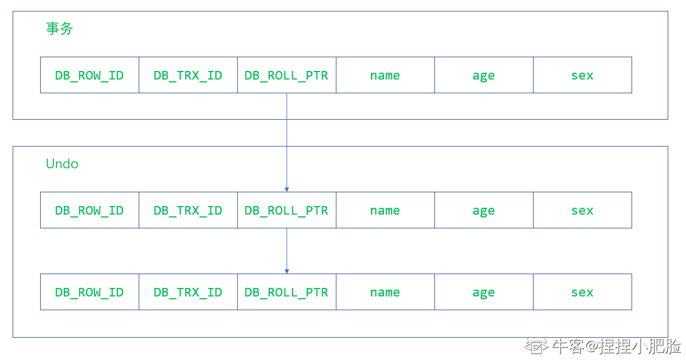
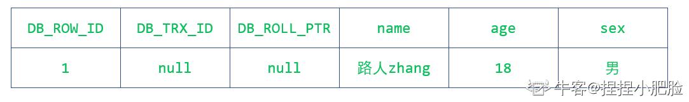
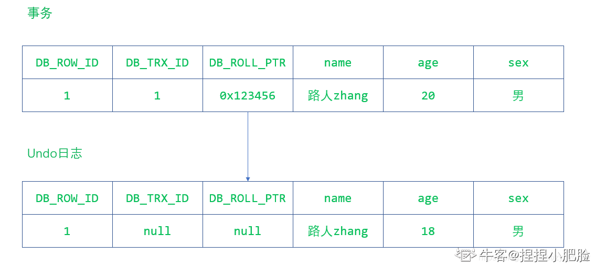
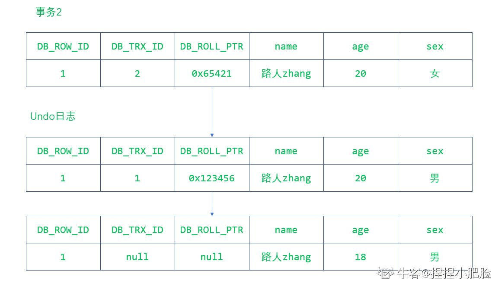
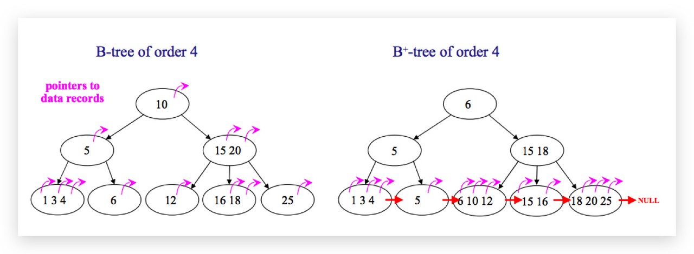
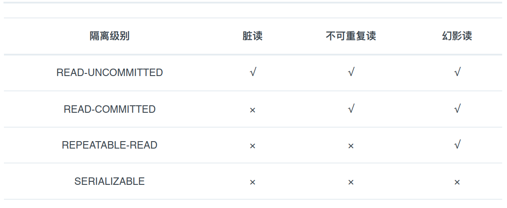
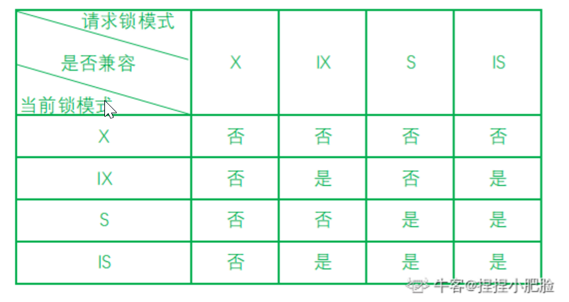
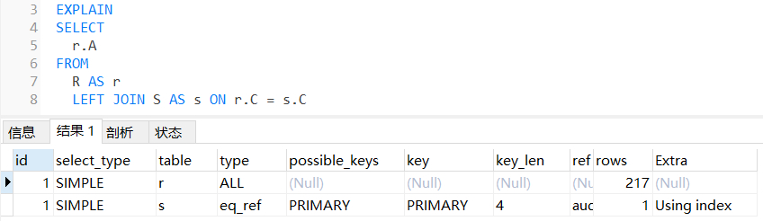
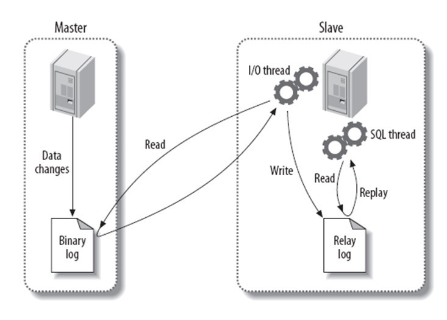
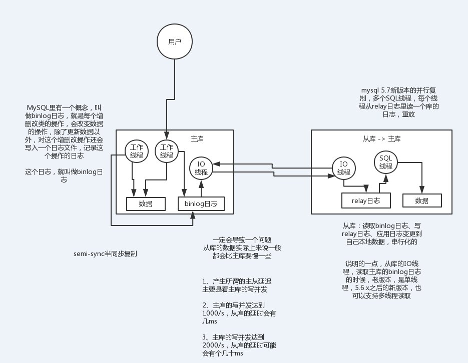

重点：索引、事务、锁、优化

innodb默认隔离级别是可重复读，要做分布式事务最高能到哪个级别？

abc三列建立组合索引，a单独再建索引，查询a=?会选择哪个索引？

[最新MySQL面试111题](https://blog.lupf.cn/articles/2021/02/03/1612317006386.html)

[MySQL高频面试题背诵版](https://www.zhihu.com/question/486204688/answer/2207943559)

[MySQL面试经典100题收藏版](https://www.cnblogs.com/setalone/p/14851000.html)

[八股文MySQL连环六十六问](https://mp.weixin.qq.com/s/-3C_shq3few06p8VzVOHkg)

[三天吃透MySQL面试八股文](https://www.toutiao.com/article/7213249551573254656/?log_from=628a5ebde3038_1679493781812)

# 1 什么是MySQL?

MySQL 是⼀种关系型数据库，在Java企业级开发中⾮常常⽤，因为 MySQL 是开源免费的，并且⽅便扩展。阿⾥巴巴数据库系统也⼤量⽤到了 MySQL，因此它的稳定性是有保障的。 MySQL是开放源代码的，因此任何⼈都可以在 GPL的许可下下载并根据个性化的需要对其进⾏修改。 MySQL的默认端⼝号是3306。 

# 2 存储引擎对比选型
⼀些常⽤命令:

查看MySQL提供的所有存储引擎：mysql> show engines;

在5.7版本所有的存储引擎中只有 InnoDB 是事务性存储引擎，也就是说只有 InnoDB ⽀持事务。

查看MySQL当前默认的存储引擎：mysql> show variables like '%storage_engine%';

查看表的存储引擎：show table status like "table_name" ;

**MyISAM和InnoDB区别**

MyISAM是MySQL的默认数据库引擎（5.5版之前）。虽然性能极佳⽽且提供了⼤量的特性，包括全⽂索引、压缩、空间函数等，但MyISAM不⽀持事务和⾏级锁，⽽且最⼤的缺陷就是崩溃后⽆法安全恢复。不过， 5.5版本之后， MySQL引⼊了InnoDB（事务性数据库引擎）， MySQL5.5版本后默认的存储引擎为InnoDB。⼤多数时候我们使⽤的都是 InnoDB 存储引擎，但是在某些情况下使⽤ MyISAM 也是合适的⽐如读密集的情况下。（如果你不介意 MyISAM 崩溃恢复问题的话）。
两者的对⽐：

1. 是否⽀持⾏级锁 : MyISAM 只有表级锁，⽽InnoDB ⽀持⾏级锁和表级锁,默认为⾏级锁。
2. 是否⽀持事务和崩溃后的安全恢复： MyISAM 强调的是性能，每次查询具有原⼦性,其执⾏速度⽐InnoDB类型更快，但是不提供事务⽀持。但是InnoDB 提供事务⽀持事务，外部键等⾼级数据库功能。 具有事务提交、回滚和崩溃修复能⼒的事务安全型表。
3. 是否⽀持外键： MyISAM不⽀持，⽽InnoDB⽀持。
4. 是否⽀持MVCC ：仅 InnoDB ⽀持。应对⾼并发事务, MVCC⽐单纯的加锁更⾼效;MVCC只在 READ COMMITTED 和 REPEATABLE READ 两个隔离级别下⼯作;MVCC可以使⽤乐观锁和悲观锁来实现;各数据库中MVCC实现并不统⼀。
5. 表主键
- MyISAM
  允许没有任何索引和主键的表存在，索引都是保存行的地址。
- InnoDB
  如果没有设定主键或者非空唯一索引，就会自动生成一个 6 字节的主键(用户不可见)，数据是主索引的一部分，附加索引保存的是主索引的值。
6. InnoDB 不支持全文索引，而 MyISAM 支持
7. 可移植性、备份及恢复
MyISAM：数据是以文件的形式存储，所以在跨平台的数据转移中会很方便。在备份和恢复时可单独针对某个表进行操作。
InnoDB：免费的方案可以是拷贝数据文件、备份binlog，或者用 mysqldump，在数据量达到几十 G 的时候就相对痛苦了
8. 存储结构
MyISAM：每个 MyISAM 在磁盘上存储成三个文件。第一个文件的名字以表的名字开始，扩展名指出文件类型。.frm 文件存储表定义。数据文件的扩展名为.MYD (MYData)。索引文件的扩展名是.MYI (MYIndex)。
InnoDB：所有的表都保存在同一个数据文件中（也可能是多个文件，或者是独立的表空间文件），InnoDB 表的大小只受限于操作系统文件的大小，一般为 2GB。

**注意**：

不要轻易相信MyISAM⽐InnoDB快之类的经验之谈，这个结论往往不是绝对的。在很多已知场景中， InnoDB的速度都可以让MyISAM望尘莫及，尤其是⽤到了聚簇索引，或者需要访问的数据都可以放⼊内存的应⽤。

**选型**

 ⼀般情况下我们选择 InnoDB 都是没有问题的，但是某些情况下你并不在乎可扩展能⼒和并发能⼒，也不需要事务⽀持，也不在乎崩溃后的安全恢复问题的话，选择MyISAM也是⼀个不错的选择。

**InnoDB引擎的4大特性是什么？**

  - 插入缓冲（insert buffer)
  - 二次写(double write)
  - 自适应哈希索引(ahi)
  - 预读(read ahead)

# 3 MVCC

**什么是MVCC？**

MVCC(multiple version concurrent control)是一种控制并发的方法，主要用来提高数据库的并发性能。

在了解MVCC时应该先了解当前读和快照读。

- 当前读：读取的是数据库的最新版本，并且在读取时要保证其他事务不会修该当前记录，所以会对读取的记录加锁。 
- 快照读：不加锁读取操作即为快照读，使用MVCC来读取快照中的数据，避免加锁带来的性能损耗。 

可以看到MVCC的作用就是在不加锁的情况下，解决数据库读写冲突问题，并且解决脏读、幻读、不可重复读等问题，但是不能解决丢失修改问题。

**MVCC实现原理**

- 版本号
   系统版本号：是一个自增的ID，每开启一个事务，系统版本号都会递增。
   事务版本号：事务版本号就是事务开始时的系统版本号，可以通过事务版本号的大小判断事务的时间顺序。 

- 行记录隐藏的列
   DB_ROW_ID：所需空间6byte，隐含的自增ID，用来生成聚簇索引，如果数据表没有指定聚簇索引，InnoDB会利用这个隐藏ID创建聚簇索引。
   DB_TRX_ID：所需空间6byte，最近修改的事务ID，记录创建这条记录或最后一次修改这条记录的事务ID。
   DB_ROLL_PTR：所需空间7byte，回滚指针，指向这条记录的上一个版本。
   它们大致长这样，省略了具体字段的值。


- undo日志
  MVCC做使用到的快照会存储在Undo日志中，该日志通过回滚指针将一个一个数据行的所有快照连接起来。它们大致长这样。



举一个简单的例子说明下，比如最开始的某条记录长这样:



现在来了一个事务对他的年龄字段进行了修改，变成了这样:



现在又来了一个事务2对它的性别进行了修改，它又变成了这样:



从上面的分析可以看出，事务对同一记录的修改，记录的各个会在Undo日志中连接成一个线性表，在表头的就是最新的旧纪录。

在重复读的隔离级别下，InnoDB的工作流程：

- SELECT   作为查询的结果要满足两个条件：

1. 当前事务所要查询的数据行快照的创建版本号必须小于当前事务的版本号，这样做的目的是保证当前事务读取的数据行的快照要么是在当前事务开始前就已经存在的，要么就是当前事务自身插入或者修改过的。 
2. 当前事务所要读取的数据行快照的删除版本号必须是大于当前事务的版本号，如果是小于等于的话，表示该数据行快照已经被删除，不能读取。 

- INSERT    将当前系统版本号作为数据行快照的创建版本号。 
- DELETE   将当前系统版本号作为数据行快照的删除版本号。 
- UPDATE   保存当前系统版本号为更新前的数据行快照创建行版本号，并保存当前系统版本号为更新后的数据行快照的删除版本号，其实就是，先删除在插入即为更新。

总结一下，MVCC的作用就是在避免加锁的情况下最大限度解决读写并发冲突的问题，它可以实现提交读和可重复度两个隔离级。

**MVCC最大的好处**：读不加锁，读写不冲突。在读多写少的OLTP应用中，读写不冲突是非常重要的，极大的增加了系统的并发性能，现阶段几乎所有的RDBMS，都支持了MVCC。

- LBCC：Lock-Based Concurrency Control 基于锁的并发控制

- MVCC：Multi-Version Concurrency Control 基于多版本的并发控制协议。纯粹基于锁的并发机制并发量低，MVCC是在基于锁的并发控制上的改进，主要是在读操作上提高了并发量。

# 4 字符集及校对规则
字符集指的是⼀种从⼆进制编码到某类字符符号的映射。校对规则则是指某种字符集下的排序规则。 MySQL中每⼀种字符集都会对应⼀系列的校对规则。MySQL采⽤的是类似继承的⽅式指定字符集的默认值，每个数据库以及每张数据表都有⾃⼰的默认值，他们逐层继承。⽐如：某个库中所有表的默认字符集将是该数据库所指定的字符集（这些表在没有指定字符集的情况下，才会采⽤默认字符集）

# 5 索引专题
MySQL索引使⽤的数据结构主要有BTree索引和哈希索引 。对于哈希索引来说，底层的数据结构就是哈希表，因此在绝⼤多数需求为单条记录查询的时候，可以选择哈希索引，查询性能最快；其余⼤部分场景，建议选择BTree索引。
MySQL的BTree索引使⽤的是B树中的B+Tree，但对于主要的两种存储引擎的实现⽅式是不同的。

MyISAM: B+Tree叶节点的data域存放的是数据记录的地址。在索引检索的时候，⾸先按照B+Tree搜索算法搜索索引，如果指定的Key存在，则取出其 data 域的值，然后以 data 域的值为地址读取相应的数据记录。这被称为“⾮聚簇索引”。

InnoDB: 其数据⽂件本身就是索引⽂件。相⽐MyISAM，索引⽂件和数据⽂件是分离的，其表数据⽂件本身就是按B+Tree组织的⼀个索引结构，树的叶节点data域保存了完整的数据记录。这个索引的key是数据表的主键，因此InnoDB表数据⽂件本身就是主索引。这被称为“聚簇索引（或聚集索引） ”。⽽其余的索引都作为辅助索引，辅助索引的data域存储相应记录主键的值⽽不是地址，这也是和MyISAM不同的地⽅。 在根据主索引搜索时，直接找到key所在的节点即可取出数据；在根据辅助索引查找时，则需要先取出主键的值，再⾛⼀遍主索引。 因此，在设计表的时候，不建议使⽤过⻓的字段作为主键，也不建议使⽤⾮单调的字段作为主键，这样会造成主索引频繁分裂。 

## 5.1 什么是索引？索引有哪些优缺点？
索引是一种特殊的文件(InnoDB数据表上的索引是表空间的一个组成部分)，它们包含着对数据表里所有记录的引用指针。索引是一种数据结构。数据库索引，是数据库管理系统中一个排序的数据结构，以协助快速查询、更新数据库表中数据。索引的实现通常使用B树及其变种B+树。更通俗的说，索引就相当于目录。为了方便查找书中的内容，通过对内容建立索引形成目录。索引是一个文件，它是要占据物理空间的。

**索引的优点**

可以加快数据的检索速度，这也是创建索引的最主要的原因。通过使用索引，可以在查询的过程中，使用优化隐藏器，提高系统的性能。

**索引的缺点**

时间方面：创建索引和维护索引要耗费时间，具体地，当对表中的数据进行增加、删除和修改的时候，索引也要动态的维护，会降低增/改/删的执行效率；

空间方面：索引需要占物理空间。

## 5.2 索引的基本原理是什么？
索引用来快速地寻找那些具有特定值的记录。如果没有索引，一般来说执行查询时遍历整张表。索引的原理很简单，就是把无序的数据变成有序的查询。
1. 把创建了索引的列的内容进行排序
2. 对排序结果生成倒排表
3. 在倒排表内容上拼上数据地址链
4. 在查询的时候，先拿到倒排表内容，再取出数据地址链，从而拿到具体数据

## 5.3 索引的使用场景？设计原则？如何对索引进行优化？

**索引使用场景**

- 对于中大型表建立索引非常有效，对于非常小的表，一般全部表扫描速度更快些。
- 对于超大型的表，建立和维护索引的代价也会变高，这时可以考虑分区技术。
- 如何表的增删改非常多，而查询需求非常少的话，那就没有必要建立索引了，因为维护索引也是需要代价的。
- 一般不会出现再where条件中的字段就没有必要建立索引了。
- 多个字段经常被查询的话可以考虑联合索引。
- 字段多且字段值没有重复的时候考虑唯一索引。
- 字段多且有重复的时候考虑普通索引。

**索引设计原则**

1. 适合索引的列是出现在where子句中的列，或者连接子句中指定的列
2. 基数较小的类，索引效果较差，没有必要在此列建立索引
3. 使用短索引，如果对长字符串列进行索引，应该指定一个前缀长度，这样能够节省大量索引空间
4. 不要过度索引。索引需要额外的磁盘空间，并降低写操作的性能。在修改表内容的时候，索引会进行更新甚至重构，索引列越多，这个时间就会越长。所以只保持需要的索引有利于查询即可。

索引虽好，但也不是无限制的使用，最好符合一下几个原则：
1. 最左前缀匹配原则，组合索引非常重要的原则，mysql会一直向右匹配直到遇到范围查询(>、<、between、like)就停止匹配，比如a = 1 and b = 2 and c > 3 and d = 4 如果建立(a,b,c,d)顺序的索引，d是用不到索引的，如果建立(a,b,d,c)的索引则都可以用到，a,b,d的顺序可以任意调整；
2. 较频繁作为查询条件的字段才去创建索引；更新频繁字段不适合创建索引；
3. 若是不能有效区分数据的列不适合做索引列(如性别，男女未知，最多也就三种，区分度太低)；
4. 尽量的扩展索引，不要新建索引。比如表中已经有a的索引，现在要加(a,b)的索引，那么只需要修改原来的索引即可；
5. 定义有外键的数据列一定要建立索引；
6. 对于那些查询中很少涉及的列，重复值比较多的列不要建立索引；
7. 对于定义为text、image和bit的数据类型的列不要建立索引。

在上面介绍了几种不符合最左匹配原则的情况会导致索引失效，除此之外，以下这几种情况也会导致**索引失效**。

- 条件中有or，例如`select * from table_name where a = 1 or b = 3` 
- 在索引上进行计算会导致索引失效，例如`select * from table_name where a + 1 = 2` 
- 在索引的类型上进行数据类型的隐形转换，会导致索引失效，例如字符串一定要加引号，假设 `select * from table_name where a = '1'`会使用到索引，如果写成`select * from table_name where a = 1`则会导致索引失效。 
- 在索引中使用函数会导致索引失效，例如`select * from table_name where abs(a) = 1` 
- 在使用like查询时以%开头会导致索引失效 
- 索引上使用！、=、<>进行判断时会导致索引失效，例如`select * from table_name where a != 1` 
- 索引字段上使用 is null/is not null判断时会导致索引失效，例如`select * from table_name where a is null`

对索引的优化其实最关键的就是要符合索引的设计原则和应用场景，将不符合要求的索引优化成符合索引设计原则和应用场景的索引。除了索引的设计原则和应用场景那几点外，还可以从以下两方面考虑。

- 在进行查询时，索引列不能是表达式的一部分，也不能是函数的参数，因为这样无法使用索引。例如`select * from table_name where a + 1 = 2`
- 将区分度最高的索引放在前面
- 尽量少使用select*

索引的使用场景、索引的设计原则和如何对索引进行优化可以看成一个问题。

## 5.4 索引算法有哪些？

索引算法有 BTree算法和 Hash算法
- BTree算法：BTree是最常用的mysql数据库索引算法，也是mysql默认的算法。因为它不仅可以被用在=,>,>=,<,<=和between这些比较操作符上，而且还可以用于like操作符，只要它的查询条件是一个不以通配符开头的常量， 例如：
-- 只要它的查询条件是一个不以通配符开头的常量
select * from user where name like 'jack%'; 
-- 如果一通配符开头，或者没有使用常量，则不会使用索引，例如： 
select * from user where name like '%jack'; 
- Hash算法：Hash索引只能用于对等比较，例如=,<=>（相当于=）操作符。由于是一次定位数据，不像BTree索引需要从根节点到枝节点，最后才能访问到页节点这样多次IO访问，所以检索效率远高于BTree索引。

## 5.5 请简述常用的索引有哪些种类?
- 普通索引
即针对数据库表创建索引

添加方式

创建普通索引：ALTER TABLE table_name ADD INDEX index_name (column);

创建组合索引：ALTER TABLE table_name ADD INDEX index_name(column1, column2, column3);

- 唯一索引

与普通索引类似，不同的就是：MySQL 数据库索引列的值必须唯一，但允许有空值

添加方式

创建唯一索引：ALTER TABLE table_name ADD UNIQUE (column);

创建唯一组合索引：ALTER TABLE table_name ADD UNIQUE (column1,column2);

- 主键索引

它是一种特殊的唯一索引，不允许有空值。一般是在建表的时候同时创建主键索引

- 全文索引

是目前搜索引擎使用的一种关键技术

添加方式：ALTER TABLE table_name ADD FULLTEXT (column);

## 5.6 索引都运用在那些地方？
- where
根据id查询记录，因为id字段仅建立了主键索引，因此此SQL执行可选的索引只有主键索引，如果有多个，最终会选一个较优的作为检索的依据。

- order by
当我们使用order by将查询结果按照某个字段排序时，如果该字段没有建立索引，那么执行计划会将查询出的所有数据使用外部排序（将数据从硬盘分批读取到内存使用内部排序，最后合并排序结果），这个操作是很影响性能的，因为需要将查询涉及到的所有数据从磁盘中读到内存（如果单条数据过大或者数据量过多都会降低效率），更无论读到内存之后的排序了。
但是如果我们对该字段建立索引alter table 表名 add index(字段名)，那么由于索引本身是有序的，因此直接按照索引的顺序和映射关系逐条取出数据即可。而且如果分页的，那么只用取出索引表某个范围内的索引对应的数据，而不用像上述那取出所有数据进行排序再返回某个范围内的数据。（从磁盘取数据是最影响性能的）
- join
对join语句匹配关系（on）涉及的字段建立索引能够提高效率
- 索引覆盖
如果要查询的字段都建立过索引，那么引擎会直接在索引表中查询而不会访问原始数据（否则只要有一个字段没有建立索引就会做全表扫描），这叫索引覆盖。因此我们需要尽可能的在select后只写必要的查询字段，以增加索引覆盖的几率。
这里值得注意的是不要想着为每个字段建立索引，因为优先使用索引的优势就在于其体积小。

## 5.7 索引如何创建、删除？创建索引时需要注意什么？
**添加索引**
- 第一种方式：在执行CREATE TABLE时创建索引
CREATE TABLE user_index2 (
	id INT auto_increment PRIMARY KEY,
	first_name VARCHAR (16),
	last_name VARCHAR (16),
	id_card VARCHAR (18),
	information text,
	KEY name (first_name, last_name),
	FULLTEXT KEY (information),
	UNIQUE KEY (id_card)
);
- 第二种方式：使用ALTER TABLE命令去增加索引
ALTER TABLE table_name ADD INDEX index_name (column_list);
ALTER TABLE用来创建普通索引、UNIQUE索引或PRIMARY KEY索引。
其中table_name是要增加索引的表名，column_list指出对哪些列进行索引，多列时各列之间用逗号分隔。索引名index_name可自己命名，缺省时，MySQL将根据第一个索引列赋一个名称。另外，ALTER TABLE允许在单个语句中更改多个表，因此可以在同时创建多个索引。
- 第三种方式：使用CREATE INDEX命令创建
CREATE INDEX index_name ON table_name (column_list);
CREATE INDEX可对表增加普通索引或UNIQUE索引。（但是，不能创建PRIMARY KEY索引）

**删除索引**
根据索引名删除普通索引、唯一索引、全文索引：alter table 表名 drop KEY 索引名
alter table user_index drop KEY name;
alter table user_index drop KEY id_card;
alter table user_index drop KEY information;
删除主键索引：alter table 表名 drop primary key（因为主键只有一个）。这里值得注意的是，如果主键自增长，那么不能直接执行此操作（自增长依赖于主键索引)
需要取消自增长再行删除：
alter table user_index
-- 重新定义字段
MODIFY id int,
drop PRIMARY KEY
但通常不会删除主键，因为设计主键一定与业务逻辑无关。

**创建索引时需要注意什么？**

- 非空字段：应该指定列为NOT NULL，除非你想存储NULL。在mysql中，含有空值的列很难进行查询优化，因为它们使得索引、索引的统计信息以及比较运算更加复杂。你应该用0、一个特殊的值或者一个空串代替空值；
- 取值离散大的字段：（变量各个取值之间的差异程度）的列放到联合索引的前面，可以通过count()函数查看字段的差异值，返回值越大说明字段的唯一值越多字段的离散程度高；
- 索引字段越小越好：数据库的数据存储以页为单位一页存储的数据越多一次IO操作获取的数据越大效率越高。

## 5.8 使用索引查询一定能提高查询的性能吗？为什么?
通常，通过索引查询数据比全表扫描要快。但是我们也必须注意到它的代价。
- 索引需要空间来存储，也需要定期维护， 每当有记录在表中增减或索引列被修改时，索引本身也会被修改。 这意味着每条记录的INSERT，DELETE，UPDATE将为此多付出4，5 次的磁盘I/O。 因为索引需要额外的存储空间和处理，那些不必要的索引反而会使查询反应时间变慢。使用索引查询不一定能提高查询性能，索引范围查询(INDEX RANGE SCAN)适用于两种情况:
- 基于一个范围的检索，一般查询返回结果集小于表中记录数的30%
- 基于非唯一性索引的检索

## 5.9 百万级别或以上的数据如何删除？
由于索引需要额外的维护成本，因为索引文件是单独存在的文件,所以当我们对数据的增加,修改,删除,都会产生额外的对索引文件的操作,这些操作需要消耗额外的IO,会降低增/改/删的执行效率。所以，在我们删除数据库百万级别数据的时候，查询MySQL官方手册得知删除数据的速度和创建的索引数量是成正比的。
1. 所以我们想要删除百万数据的时候可以先删除索引（此时大概耗时三分多钟）
2. 然后删除其中无用数据（此过程需要不到两分钟）
3. 删除完成后重新创建索引(此时数据较少了)创建索引也非常快，约十分钟左右。
4. 与之前的直接删除绝对是要快速很多，更别说万一删除中断,一切删除会回滚。那更是坑了。

## 5.10 什么是前缀索引？如何运用？
- 语法：index(field(10))，使用字段值的前10个字符建立索引，默认是使用字段的全部内容建立索引。
- 前提：前缀的标识度高。比如密码就适合建立前缀索引，因为密码几乎各不相同。
- 实操的难度：在于前缀截取的长度。我们可以利用以下sql

 select count(*)/count(distinct left(password,prefixLen));
通过从调整 prefixLen的值（从1自增）查看不同前缀长度的一个平均匹配度，接近1时就可以了（表示一个密码的前 prefixLen个字符几乎能确定唯一一条记录）

## 5.11 什么是最左前缀原则？什么是最左匹配原则？为什么需要注意联合索引中的顺序？
顾名思义，就是最左优先，在创建多列索引时，要根据业务需求，where子句中使用最频繁的一列放在最左边。
最左前缀匹配原则，mysql会一直向右匹配直到遇到范围查询(>、<、between、like)就停止匹配，比如a = 1 and b = 2 and c > 3 and d = 4 如果建立(a,b,c,d)顺序的索引，d是用不到索引的，如果建立(a,b,d,c)的索引则都可以用到，a,b,d的顺序可以任意调整。=和in可以乱序，比如a = 1 and b = 2 and c = 3 建立(a,b,c)索引可以任意顺序，mysql的查询优化器会帮你优化成索引可以识别的形式

**注意联合索引中的顺序**

MySQL可以使用多个字段同时建立一个索引，叫做联合索引。在联合索引中，如果想要命中索引，需要按照建立索引时的字段顺序挨个使用，否则无法命中索引。具体原因:MySQL使用索引时需要索引有序，假设现在建立了"name，age，school"的联合索引，那么索引的排序为: 先按照name排序，如果name相同，则按照age排序，如果age的值也相等，则按照school进行排序。当进行查询时，此时索引仅仅按照name严格有序，因此必须首先使用name字段进行等值查询，之后对于匹配到的列而言，其按照age字段严格有序，此时可以使用age字段用做索引查找，以此类推。因此在建立联合索引的时候应该注意索引列的顺序，一般情况下，将查询需求频繁或者字段选择性高的列放在前面。此外可以根据特例的查询或者表结构进行单独的调整。

## 5.12 B树和B+树有什么区别？
在B树中，你可以将键和值存放在内部节点和叶子节点；但在B+树中，内部节点都是键，没有值，叶子节点同时存放键和值。
B+树的叶子节点有一条链相连，而B树的叶子节点各自独立。

B树

B树可以在内部节点同时存储键和值，因此，把频繁访问的数据放在靠近根节点的地方将会大大提高热点数据的查询效率。这种特性使得B树在特定数据重复多次查询的场景中更加高效。

B+树

由于B+树的内部节点只存放键，不存放值，因此，一次读取，可以在内存页中获取更多的键，有利于更快地缩小查找范围。 B+树的叶节点由一条链相连，因此，当需要进行一次全数据遍历的时候，B+树只需要使用O(logN)时间找到最小的一个节点，然后通过链进行O(N)的顺序遍历即可。而B树则需要对树的每一层进行遍历，这会需要更多的内存置换次数，因此也就需要花费更多的时间

## 5.13 Hash索引和B+树索引有什么区别?
首先要知道Hash索引和B+树索引的底层实现原理：

hash索引

底层就是hash表，进行查找时，调用一次hash函数就可以获取到相应的键值，之后进行回表查询获得实际数据。hash索引进行等值查询更快(一般情况下)

B+树

底层实现是多路平衡查找树。对于每一次的查询都是从根节点出发，查找到叶子节点方可以获得所查键值，然后根据查询判断是否需要回表查询数据。天然支持范围查询

优劣势

- hash索引不支持使用索引进行排序，见原理。
- hash索引不支持模糊查询以及多列索引的最左前缀匹配。原理也是因为hash函数的不可预测。AAAA和AAAAB的索引没有相关性。
- hash索引任何时候都避免不了回表查询数据，而B+树在符合某些条件(聚簇索引，覆盖索引等)的时候可以只通过索引完成查询。
- hash索引虽然在等值查询上较快，但是不稳定。性能不可预测，当某个键值存在大量重复的时候，发生hash碰撞，此时效率可能极差。而B+树的查询效率比较稳定，对于所有的查询都是从根节点到叶子节点，且树的高度较低。
因此，大多数情况下，选择B+树索引可以获得稳定且较好的查询速度。而不需要使用hash索引。

## 5.14  为什么数据库使用B+树而不是B树？
- B树只适合随机检索，而B+树同时支持随机检索和顺序检索；
- B+树空间利用率更高，可减少I/O次数，磁盘读写代价更低。一般来说，索引本身也很大，不可能全部存储在内存中，因此索引往往以索引文件的形式存储的磁盘上。这样的话，索引查找过程中就要产生磁盘I/O消耗。B+树的内部结点并没有指向关键字具体信息的指针，只是作为索引使用，其内部结点比B树小，盘块能容纳的结点中关键字数量更多，一次性读入内存中可以查找的关键字也就越多，相对的，IO读写次数也就降低了。而IO读写次数是影响索引检索效率的最大因素；
- B+树的查询效率更加稳定。B树搜索有可能会在非叶子结点结束，越靠近根节点的记录查找时间越短，只要找到关键字即可确定记录的存在，其性能等价于在关键字全集内做一次二分查找。而在B+树中，顺序检索比较明显，随机检索时，任何关键字的查找都必须走一条从根节点到叶节点的路，所有关键字的查找路径长度相同，导致每一个关键字的查询效率相当。
- B-树在提高了磁盘IO性能的同时并没有解决元素遍历的效率低下的问题。B+树的叶子节点使用指针顺序连接在一起，只要遍历叶子节点就可以实现整棵树的遍历。而且在数据库中基于范围的查询是非常频繁的，而B树不支持这样的操作。
- 增删文件（节点）时，效率更高。因为B+树的叶子节点包含所有关键字，并以有序的链表结构存储，这样可很好提高增删效率。

## 5.15  什么是聚簇索引？何时使用聚簇索引与非聚簇索引？
聚簇索引：将数据存储与索引放到了一块，找到索引也就找到了数据

非聚簇索引：将数据存储于索引分开结构，索引结构的叶子节点指向了数据的对应行，myisam通过key_buffer把索引先缓存到内存中，当需要访问数据时（通过索引访问数据），在内存中直接搜索索引，然后通过索引找到磁盘相应数据，这也就是为什么索引不在key buffer命中时，速度慢的原因

澄清一个概念：innodb中，默认的索引为B+树索引，利用主键创建的索引为主索引，也是聚簇索引。在主索引之上创建的索引称之为辅助索引，辅助索引访问数据总是需要二次查找，非聚簇索引都是辅助索引，像复合索引、前缀索引、唯一索引，辅助索引的叶子节点存储的不再是行的物理位置，而是主键值。

在MyISAM存储引擎中，默认的索引也是B+树索引，但主索引和辅助索引都是非聚簇索引，也就是说索引结构的叶子节点存储的都是一个指向数据行的地址。并且使用辅助索引检索无需访问主键的索引。

何时使用聚簇索引与非聚簇索引


## 5.16 B+树在什么情况下不需要回表查询数据？
B+树在满足聚簇索引和覆盖索引的时候不需要回表查询数据；在B+树的索引中，叶子节点可能存储了当前的key值，也可能存储了当前的key值以及整行的数据，这就是聚簇索引和非聚簇索引。 在InnoDB中，只有主键索引是聚簇索引，如果没有主键，则挑选一个唯一键建立聚簇索引。如果没有唯一键，则隐式的生成一个键来建立聚簇索引。当查询使用聚簇索引时，在对应的叶子节点，可以获取到整行数据，因此不用再次进行回表查询。

## 5.17 非聚簇索引一定会回表查询吗？
非聚簇索引的叶子节点存储的是主键，也就是说要先通过非聚簇索引找到主键，再通过聚簇索引找到主键所对应的数据，后面这个再通过聚簇索引找到主键对应的数据的过程就是回表查询，那么非聚簇索引就一定会进行回表查询吗？

不一定，这里涉及到一个索引覆盖的问题，如果查询的数据再辅助索引上完全能获取到便不需要回表查询。即如果查询字段全部命中了索引，那么就不必再进行回表查询。

举个简单的例子，例如有一张表存储着个人信息包括id、name、age等字段。假设聚簇索引是以ID为键值构建的索引，非聚簇索引是以name为键值构建的索引，`select id,name from user where name = 'zhangsan';`这个查询便不需要进行回表查询因为，通过非聚簇索引已经能全部检索出数据，这就是索引覆盖的情况。如果查询语句是这样，`select id,name,age from user where name = 'zhangsan';`则需要进行回表查询，因为通过非聚簇索引不能检索出age的值。那应该如何解决那呢？只需要将索引覆盖即可，建立age和name的联合索引再使用`select id,name,age from user where name = 'zhangsan';`进行查询即可。

所以通过索引覆盖能解决非聚簇索引回表查询的问题。

## 5.18 索引类型

MySQL主要的索引类型主要有FULLTEXT，HASH，BTREE，RTREE。

- FULLTEXT
  FULLTEXT即全文索引，MyISAM存储引擎和InnoDB存储引擎在MySQL5.6.4以上版本支持全文索引，一般用于查找文本中的关键字，而不是直接比较是否相等，多在CHAR，VARCHAR，TAXT等数据类型上创建全文索引。全文索引主要是用来解决WHERE name LIKE "%zhang%"等针对文本的模糊查询效率低的问题。
- HASH
  HASH即哈希索引，哈希索引多用于等值查询，时间复杂夫为o(1)，效率非常高，但不支持排序、范围查询及模糊查询等。
- BTREE
  BTREE即B+树索引，INnoDB存储引擎默认的索引，支持排序、分组、范围查询、模糊查询等，并且性能稳定。
- RTREE
  RTREE即空间数据索引，多用于地理数据的存储，相比于其他索引，空间数据索引的优势在于范围查找

**索引的种类有哪些？**

- 主键索引：数据列不允许重复，不能为NULL，一个表只能有一个主键索引
- 组合索引：由多个列值组成的索引。
- 唯一索引：数据列不允许重复，可以为NULL，索引列的值必须唯一的，如果是组合索引，则列值的组合必须唯一。
- 全文索引：对文本的内容进行搜索。
- 普通索引：基本的索引类型，可以为NULL

# 6 查询缓存的使⽤

执⾏查询语句的时候，会先查询缓存。不过， MySQL 8.0 版本后移除，因为这个功能不太实⽤。
my.cnf加⼊以下配置，重启MySQL开启查询缓存
query_cache_type=1
query_cache_size=600000
MySQL执⾏以下命令也可以开启查询缓存
set global query_cache_type=1;
set global query_cache_size=600000;
如上， 开启查询缓存后在同样的查询条件以及数据情况下，会直接在缓存中返回结果。这⾥的查询条件包括查询本身、当前要查询的数据库、客户端协议版本号等⼀些可能影响结果的信息。因此任何两个查询在任何字符上的不同都会导致缓存不命中。此外，如果查询中包含任何⽤户⾃定义函数、存储函数、⽤户变量、临时表、 MySQL库中的系统表，其查询结果也不会被缓存。缓存建⽴之后， MySQL的查询缓存系统会跟踪查询中涉及的每张表，如果这些表（数据或结构）发⽣变化，那么和这张表相关的所有缓存数据都将失效。缓存虽然能够提升数据库的查询性能，但是缓存同时也带来了额外的开销，每次查询后都要做⼀次缓存操作，失效后还要销毁。 因此，开启缓存查询要谨慎，尤其对于写密集的应⽤来说更是如此。如果开启，要注意合理控制缓存空间⼤⼩，⼀般来说其⼤⼩设置为⼏⼗MB⽐较合适。此外， 还可以通过sql_cache和sql_no_cache来控制某个查询语句是否需要缓存：
select sql_no_cache count(*) from usr;

# 7 什么是事务?事务的四⼤特性(ACID)
事务是逻辑上的⼀组操作，要么都执⾏，要么都不执⾏。
事务最经典也经常被拿出来说例⼦就是转账了。假如⼩明要给⼩红转账1000元，这个转账会涉及到两个关键操作就是：将⼩明的余额减少1000元，将⼩红的余额增加1000元。万⼀在这两个操作之间突然出现错误⽐如银⾏系统崩溃，导致⼩明余额减少⽽⼩红的余额没有增加，这样就不对了。事务就是保证这两个关键操作要么都成功，要么都要失败。

**四⼤特性**

1. 原⼦性（Atomicity）： 事务是最⼩的执⾏单位，不允许分割。事务的原⼦性确保动作要么全部完成，要么完全不起作⽤；
2. ⼀致性（Consistency）： 执⾏事务前后，数据保持⼀致，多个事务对同⼀个数据读取的结果是相同的；
3. 隔离性（Isolation）： 并发访问数据库时，⼀个⽤户的事务不被其他事务所⼲扰，各并发事务之间数据库是独⽴的；
4. 持久性（Durability）： ⼀个事务被提交之后。它对数据库中数据的改变是持久的，即使数据库发⽣故障也不应该对其有任何影响。

# 8 并发事务带来哪些问题?
在典型的应⽤程序中，多个事务并发运⾏，经常会操作相同的数据来完成各⾃的任务（多个⽤户对同⼀数据进⾏操作）。并发虽然是必须的，但可能会导致以下的问题。

**脏读**（Dirty read） : 当⼀个事务正在访问数据并且对数据进⾏了修改，⽽这种修改还没有提交到数据库中，这时另外⼀个事务也访问了这个数据，然后使⽤了这个数据。因为这个数据是还没有提交的数据，那么另外⼀个事务读到的这个数据是“脏数据”，依据“脏数据”所做的操作可能是不正确的。

**不可重复读**（Unrepeatableread） : 指在⼀个事务内多次读同⼀数据。在这个事务还没有结束时，另⼀个事务也访问该数据。那么，在第⼀个事务中的两次读数据之间，由于第⼆个事务的修改导致第⼀个事务两次读取的数据可能不太⼀样。这就发⽣了在⼀个事务内两次读到的数据是不⼀样的情况，因此称为不可重复读。

**幻读**（Phantom read） : 幻读与不可重复读类似。它发⽣在⼀个事务（T1）读取了⼏⾏数据，接着另⼀个并发事务（T2）插⼊了⼀些数据时。在随后的查询中，第⼀个事务（T1）就会发现多了⼀些原本不存在的记录，就好像发⽣了幻觉⼀样，所以称为幻读。

**丢失修改**（Lost to modify） : 指在⼀个事务读取⼀个数据时，另外⼀个事务也访问了该数据，那么在第⼀个事务中修改了这个数据后，第⼆个事务也修改了这个数据。这样第⼀个事务内的修改结果就被丢失，因此称为丢失修改。 例如：事务1读取某表中的数据A=20，事务2也读取A=20，事务1修改A=A-1，事务2也修改A=A-1，最终结果A=19，事务1的修改被丢失。

**不可重复读和幻读区别**：

不可重复读的重点是修改⽐如多次读取⼀条记录发现其中某些列的值被修改，幻读的重点在于新增或者删除⽐如多次读取⼀条记录发现记录增多或减少了。

# 9 事务隔离级别有哪些?隔离级别如何实现？
SQL 标准定义了四个隔离级别：
**READ-UNCOMMITTED(读取未提交)**： 最低的隔离级别，允许读取尚未提交的数据变更，可能会导致脏读、幻读或不可重复读。

**READ-COMMITTED(读取已提交)**： 允许读取并发事务已经提交的数据， 可以阻⽌脏读，但是幻读或不可重复读仍有可能发⽣。这种隔离级别也支持所谓的不可重复读（Nonrepeatable Read），因为同一事务的其他实例在该实例处理其间可能会有新的 commit，所以同一 select 可能返回不同结果。

**REPEATABLE-READ(可重复读)**： 对同⼀字段的多次读取结果都是⼀致的，除⾮数据是被本身事务⾃⼰所修改， 可以阻⽌脏读和不可重复读，但幻读仍有可能发⽣。简单的说，幻读指当用户读取某一范围的数据行时，另一个事务又在该范围内插入了新行，当用户再读取该范围的数据行时，会发现有新的“幻影” 行。InnoDB 和 Falcon 存储引擎通过多版本并发控制（MVCC，Multiversion Concurrency Control 间隙锁）机制解决了该问题。注：其实多版本只是解决不可重复读问题，而加上间隙锁（也就是它这里所谓的并发控制）才解决了幻读问题。

**SERIALIZABLE(可串⾏化)**： 最⾼的隔离级别，完全服从ACID的隔离级别。所有的事务依次逐个执⾏，这样事务之间就完全不可能产⽣⼲扰，也就是说， 该级别可以防⽌脏读、不可重复读以及幻读。 它是在每个读的数据行上加上共享锁。在这个级别，可能导致大量的超时现象和锁竞争。



InnoDB默认隔离级别是**REPEATABLE-READ** 。可通过 SELECT @@tx_isolation; 命令来查看。

需要**注意**的是：与 SQL标准不同的地⽅在于InnoDB在 REPEATABLEREAD事务隔离级别下使⽤的是Next-Key Lock 锁算法，因此可以避免幻读的产⽣，这与其他数据库系统是不同的。所以说InnoDB默认的隔离级别REPEATABLE-READ已经可以完全保证事务的隔离性要求，即达到了SQL标准的SERIALIZABLE隔离级别。因为隔离级别越低，事务请求的锁越少，所以⼤部分数据库系统的隔离级别都是READ-COMMITTED ，但是你要知道的是InnoDB 存储引擎默认使⽤ REPEATABLE-READ并不会有任何性能损失。

**InnoDB 存储引擎在分布式事务的情况下⼀般会⽤到 SERIALIZABLE(可串⾏化) 隔离级别。**

**隔离级别是如何实现的？**

事务的隔离机制主要是依靠锁机制和MVCC(多版本并发控制)实现的，提交读和可重复读可以通过MVCC实现，串行化可以通过锁机制实现。

# 10 锁机制

## 10.1 什么是数据库的锁？

当数据库有并发事务的时候，保证数据访问顺序的机制称为锁机制。

## 10.2 什么是数据库的乐观锁和悲观锁，如何实现？

数据库管理系统（DBMS）中的并发控制的任务是确保在多个事务同时存取数据库中同一数据时不破坏事务的隔离性和统一性以及数据库的统一性。乐观并发控制（乐观锁）和悲观并发控制（悲观锁）是并发控制主要采用的技术手段。

乐观锁：系统假设数据的更新在大多数时候是不会产生冲突的，所以数据库只在更新操作提交的时候对数据检测冲突，如果存在冲突，则数据更新失败。

乐观锁实现方式：一般通过版本号和CAS算法实现。

悲观锁：假定会发生并发冲突，屏蔽一切可能违反数据完整性的操作。通俗讲就是在查询完数据的时候就把事务锁起来，直到提交事务。

悲观锁的实现方式：通过数据库的锁机制实现，对查询语句添加for updata。

两种锁的使用场景：

从上面对两种锁的介绍，我们知道两种锁各有优缺点，不可认为一种好于另一种，像乐观锁适用于写比较少的情况下（多读场景），即冲突真的很少发生的时候，这样可以省去了锁的开销，加大了系统的整个吞吐量。
但如果是多写的情况，一般会经常产生冲突，这就会导致上层应用会不断的进行retry，这样反倒是降低了性能，所以一般多写的场景下用悲观锁就比较合适。

## 10.3 什么是死锁？如何避免？如何处理死锁？

死锁是指两个或者两个以上进程在执行过程中，由于竞争资源或者由于彼此通信而造成的一种阻塞的现象。在MySQL中，MyISAM是一次获得所需的全部锁，要么全部满足，要么等待，所以不会出现死锁。在InnoDB存储引擎中，除了单个SQL组成的事务外，锁都是逐步获得的，所以存在死锁问题。

如何避免MySQL发生死锁或锁冲突：

- 如果不同的程序并发存取多个表，尽量以相同的顺序访问表。
  
- 在程序以批量方式处理数据的时候，如果已经对数据排序，尽量保证每个线程按照固定的顺序来处理记录。
  
- 在事务中，如果需要更新记录，应直接申请足够级别的排他锁，而不应该先申请共享锁，更新时在申请排他锁，因为在当前用户申请排他锁时，其他事务可能已经获得了相同记录的共享锁，从而造成锁冲突或者死锁。
  
- 尽量使用较低的隔离级别
  
- 尽量使用索引访问数据，使加锁更加准确，从而减少锁冲突的机会
  
- 合理选择事务的大小，小事务发生锁冲突的概率更低
  
- 尽量用相等的条件访问数据，可以避免Next-Key锁对并发插入的影响。
  
- 不要申请超过实际需要的锁级别，查询时尽量不要显示加锁

常见的解决死锁的方法：

如果不同程序会并发存取多个表，尽量约定以相同的顺序访问表，可以大大降低死锁机会。

在同一个事务中，尽可能做到一次锁定所需要的所有资源，减少死锁产生概率；

对于非常容易产生死锁的业务部分，可以尝试使用升级锁定颗粒度，通过表级锁定来减少死锁产生的概率；

如果业务处理不好可以用分布式事务锁或者使用乐观锁

## 10.4 数据库锁的类型有哪些？

MyISAM和InnoDB存储引擎使⽤的锁：MyISAM采⽤表级锁。InnoDB⽀持⾏级锁和表级锁,默认为⾏级锁。

表级锁和⾏级锁对⽐：

表级锁： MySQL中锁定粒度最⼤的⼀种锁，对当前操作的整张表加锁，实现简单，资源消耗也⽐较少，加锁快，不会出现死锁。其锁定粒度最⼤，触发锁冲突的概率最⾼，并发度最低， MyISAM和 InnoDB引擎都⽀持表级锁。

⾏级锁： MySQL中锁定 粒度最⼩的⼀种锁，只针对当前操作的⾏进⾏加锁。 ⾏级锁能⼤⼤减少数据库操作的冲突。其加锁粒度最⼩，并发度⾼，但加锁的开销也最⼤，加锁慢，会出现死锁。

详细内容可参考： MySQL锁机制简单了解⼀下： https://blog.csdn.net/qq_34337272/article/details/80611486

按照锁的粒度可以将MySQL锁分为三种：

| MySQL锁类别 | 资源开销 | 加锁速度 | 是否会出现死锁 | 锁的粒度 | 并发度 |
| ----------- | -------- | -------- | -------------- | -------- | ------ |
| 表级锁      | 小       | 快       | 不会           | 大       | 低     |
| 行级锁      | 大       | 慢       | 会             | 小       | 高     |
| 页面锁      | 一般     | 一般     | 不会           | 一般     | 一般   |

从锁的类别上区别可以分为共享锁和排他锁

- 共享锁：共享锁又称读锁，简写为S锁，一个事务对一个数据对象加了S锁，可以对这个数据对象进行读取操作，但不能进行更新操作。并且在加锁期间其他事务只能对这个数据对象加S锁，不能加X锁。 
- 排他锁：排他锁又称为写锁，简写为X锁，一个事务对一个数据对象加了X锁，可以对这个对象进行读取和更新操作，加锁期间，其他事务不能对该数据对象进行加X锁或S锁。

## 10.5 InnoDB引擎的行锁模式及其是如何实现的？

在存在行锁和表锁的情况下，一个事务想对某个表加X锁时，需要先检查是否有其他事务对这个表加了锁或对这个表的某一行加了锁，对表的每一行都进行检测一次这是非常低效率的，为了解决这种问题，实现多粒度锁机制，InnoDB还有两种内部使用的意向锁，两种意向锁都是表锁。

- 意向共享锁：简称IS锁，一个事务打算给数据行加共享锁前必须先获得该表的IS锁。 
- 意向排他锁：简称IX锁，一个事务打算给数据行加排他锁前必须先获得该表的IX锁。 

有了意向锁，一个事务想对某个表加X锁，只需要检查是否有其他事务对这个表加了X/IX/S/IS锁即可。



行锁实现方式：innoDB的行锁是通过给索引上的索引项加锁实现的，如果没有索引，InnoDB将通过隐藏的聚簇索引来对记录进行加锁。InnoDB 这种行锁实现特点意味着：只有通过索引条件检索数据，InnoDB 才使用行级锁，否则，InnoDB 将使用表锁。

InnoDB行锁主要分三种情况：

- Record lock：对索引项加锁 
- Grap lock：对索引之间的“间隙”、第一条记录前的“间隙”或最后一条后的间隙加锁。 锁定⼀个范围，不包括记录本身
- Next-key lock：前两种放入组合，对记录及前面的间隙加锁。 锁定⼀个范围，包含记录本身

InnoDB行锁的特性：如果不通过索引条件检索数据，那么InnoDB将对表中所有记录加锁，实际产生的效果和表锁是一样的。

MVCC不能解决幻读问题，在可重复读隔离级别下，使用MVCC+Next-Key Locks可以解决幻读问题。

相关知识点：

1. innodb对于⾏的查询使⽤next-key lock
2. Next-locking keying为了解决Phantom Problem幻读问题
3. 当查询的索引含有唯⼀属性时，将next-key lock降级为record key
4. Gap锁设计的⽬的是为了阻⽌多个事务将记录插⼊到同⼀范围内，⽽这会导致幻读问题的产⽣
5. 有两种⽅式显式关闭gap锁：（除了外键约束和唯⼀性检查外，其余情况仅使⽤recordlock） 
   A. 将事务隔离级别设置为RC B. 将参数innodb_locks_unsafe_for_binlog设置为1

##  10.6 事务隔离级别与锁的关系？

| 隔离级别 | 实现方式                                 |
| -------- | ---------------------------------------- |
| 未提交读 | 总是读取最新的数据，无需加锁             |
| 提交读   | 读取数据时加共享锁，读取数据后释放共享锁 |
| 可重复读 | 读取数据时加共享锁，事务结束后释放共享锁 |
| 串行化   | 锁定整个范围的键，一直持有锁直到事务结束 |

## 10.7 RC隔离级别下读A行数据，updateA行数据，读B行数据，updateB行数据，再updateA行数据，请问加了几次锁？对A加锁是在什么时候加了几次锁？

# 11 优化专题

## 11.1 大表优化
大表查询优化
1. 优化shema、sql语句+索引；
2. 第二加缓存，memcached, redis；
3. 主从复制，读写分离；
4. 垂直拆分，根据你模块的耦合度，将一个大的系统分为多个小的系统，也就是分布式系统；
5. 水平切分，针对数据量大的表，这一步最麻烦，最能考验技术水平，要选择一个合理的sharding key, 为了有好的查询效率，表结构也要改动，做一定的冗余，应用也要改，sql中尽量带sharding key，将数据定位到限定的表上去查，而不是扫描全部的表；
6. 加中间表；字段冗余

大表优化
当MySQL单表记录数过⼤时，数据库的CRUD性能会明显下降，⼀些常⻅的优化措施如下：

**限定数据的范围**

禁⽌不带任何限制数据范围条件的查询语句。⽐如：当查询订单历史的时候，可以控制在⼀个⽉的范围内；

**读/写分离**

经典的数据库拆分⽅案，主库负责写，从库负责读；

**垂直分区**

根据数据库⾥⾯数据表的相关性进⾏拆分。 例如，⽤户表中既有⽤户的登录信息⼜有⽤户的基本信息，可以将⽤户表拆分成两个单独的表，甚⾄放到单独的库做分库。简单来说垂直拆分是指数据表列的拆分，把⼀张列⽐较多的表拆分为多张表。

垂直拆分的优点： 可以使得列数据变⼩，在查询时减少读取的Block数，减少I/O次数。此外，垂直分区可以简化表的结构，易于维护。

垂直拆分的缺点： 主键会出现冗余，需要管理冗余列，并会引起Join操作，可以通过在应⽤层进⾏Join来解决。此外，垂直分区会让事务变得更加复杂；

**⽔平分区**

保持数据表结构不变，通过某种策略存储数据分⽚。这样每⼀⽚数据分散到不同的表或者库中，达到了分布式的⽬的。 ⽔平拆分是指数据表⾏的拆分，表的⾏数超过200万⾏时，就会变慢，这时可以把⼀张的表的数据拆成多张表来存放。举个例⼦：我们可以将⽤户信息表拆分成多个⽤户信息表，这样就可以避免单⼀表数据量过⼤对性能造成影响。
⽔平拆分可以⽀持⾮常⼤的数据量。需要注意的⼀点是：分表仅仅是解决了单⼀表数据过⼤的问题，但由于表的数据还是在同⼀台机器上，其实对于提升MySQL并发能⼒没有什么意义，所以⽔平拆分最好分库 。应⽤端改造也少，但分⽚事务难以解决 ，跨节点Join性能较差，逻辑复杂。⼀般的数据表在优化得当的情况下⽀撑千万以下的数据量是没有太⼤问题的。如果实在要分⽚，尽量选择客户端分⽚架构，这样可以减少⼀次和中间件的⽹络I/O。

**对单表进行优化：对表中的字段、索引、查询SQL进行优化。**

**添加缓存**

定期清理、转储

下⾯补充⼀下数据库分⽚的两种常⻅⽅案：

客户端代理： 分⽚逻辑在应⽤端，封装在jar包中，通过修改或者封装JDBC层来实现。 当当⽹的 Sharding-JDBC 、阿⾥的TDDL是两种⽐较常⽤的实现。

中间件代理： 在应⽤和数据中间加了⼀个代理层。分⽚逻辑统⼀维护在中间件服务中。 我们现在谈的 Mycat 、 360的Atlas、⽹易的DDB等等都是这种架构的实现。

详细内容可以参考： MySQL⼤表优化⽅案: https://segmentfault.com/a/1190000006158186

## 11.2 MySQL 分页如何优化？超大分页怎么优化？
LIMIT 子句可以被用于强制 SELECT 语句返回指定的记录数。LIMIT 接受一个或两个数字参数。参数必须是一个整数常量。如果给定两个参数，第一个参数指定第一个返回记录行的偏移量，第二个参数指定返回记录行的最大数目。初始记录行的偏移量是 0(而不是 1)
-- 检索记录行 6-15
SELECT * FROM table LIMIT 5,10;  
-- 检索从某一个偏移量到记录集的结束所有的记录行，可以指定第二个参数为 -1：
SELECT * FROM table LIMIT 95,-1;   检索记录行 96-last
-- 如果只给定一个参数，它表示返回最大的记录行数目，LIMIT n 等价于 LIMIT 0,n
SELECT * FROM table LIMIT 5;   检索前 5 个记录行 

**如何优化LIMIT分页？**

- 在LIMIT偏移量较大的时候，查询效率会变低，可以记录每次取出的最大ID，下次查询时可以利用ID进行查询
- 建立复合索引

超大的分页一般从两个方向上来解决.
- 数据库层面,这也是我们主要集中关注的(虽然收效没那么大),类似于
select * from table where age > 20 limit 1000000,10;
这种查询其实也是有可以优化的余地的. 这条语句需要加载 1000000数据然后基本上全部丢弃,只取10条当然比较慢. 我们可以修改为
select * from table where id in (select id from table where age > 20 limit 1000000,10)
这样虽然也load了一百万的数据,但是由于索引覆盖,要查询的所有字段都在索引中,所以速度会很快. 同时如果ID连续的好,我们还可以
select * from table where id > 1000000 limit 10
效率也是不错的,优化的可能性有许多种,但是核心思想都一样,就是减少加载的数据.
- 从需求的角度减少这种请求…主要是不做类似的需求(直接跳转到几百万页之后的具体某一页.只允许逐页查看或者按照给定的路线走,这样可预测,可缓存)以及防止ID泄漏且连续被人恶意攻击.解决超大分页,其实主要是靠缓存,可预测性的提前查到内容,缓存至redis等k-V数据库中,直接返回即可.

## 11.3如何使用慢查询日志？如何分析慢查询？对慢查询如何优化？
**SQL语句执行的很慢原因是什么？**

- 如果SQL语句只是偶尔执行很慢，可能是执行的时候遇到了锁，也可能是redo log日志写满了，要将redo log中的数据同步到磁盘中去。 
- 如果SQL语句一直都很慢，可能是字段上没有索引或者字段有索引但是没用上索引。

慢查询日志用于记录执行时间超过某个临界值的SQL日志，用于快速定位慢查询，为我们的优化做参考。

slow_query_log：是否开启慢日志查询，1表示开启，0表示关闭。 

slow_query_log_file：MySQL数据库慢查询日志存储路径。 

long_query_time：慢查询阈值，当SQL语句查询时间大于阈值，会被记录在日志上。 

log_queries_not_using_indexes：未使用索引的查询会被记录到慢查询日志中。 

log_output：日志存储方式。“FILE”表示将日志存入文件。“TABLE”表示将日志存入数据库。

- 开启慢查询日志
配置项：slow_query_log
查看：show variables like ‘slov_query_log’查看是否开启，如果状态值为OFF
设置：set GLOBAL slow_query_log = on来开启，它会在datadir下产生一个xxx-slow.log的文件。
- 设置临界时间
配置项：long_query_time
查看：show VARIABLES like 'long_query_time'，单位秒
设置：set long_query_time=0.5
实操时应该从长时间设置到短的时间，即将最慢的SQL优化掉
- 查看日志
一旦SQL超过了我们设置的临界时间就会被记录到 xxx-slow.log中

**慢查询的优化**

首先要搞明白慢的原因是什么？ 是查询条件没有命中索引？是load了不需要的数据列？还是数据量太大？所以优化也是针对这三个方向来的

- 首先分析语句，看看是否load了额外的数据，可能是查询了多余的行并且抛弃掉了，可能是加载了许多结果中并不需要的列，对语句进行分析以及重写。
- 分析语句的执行计划，然后获得其使用索引的情况，之后修改语句或者修改索引，使得语句可以尽可能的命中索引。
- 如果对语句的优化已经无法进行，可以考虑表中的数据量是否太大，如果是的话可以进行横向或者纵向的分表。

## 11.4 为什么要尽量设定一个主键？主键使用自增ID还是UUID？

主键是数据库确保数据行在整张表唯一性的保障，即使业务上本张表没有主键，也建议添加一个自增长的ID列作为主键。设定了主键之后，在后续的删改查的时候可能更加快速以及确保操作数据范围安全。

推荐使用自增ID，不要使用UUID。因为在InnoDB存储引擎中，主键索引是作为聚簇索引存在的，也就是说，主键索引的B+树叶子节点上存储了主键索引以及全部的数据(按照顺序)，如果主键索引是自增ID，那么只需要不断向后排列即可，如果是UUID，由于到来的ID与原来的大小不确定，会造成非常多的数据插入，数据移动，然后导致产生很多的内存碎片，进而造成插入性能的下降。总之，在数据量大一些的情况下，用自增主键性能会好一些。关于主键是聚簇索引，如果没有主键，InnoDB会选择一个唯一键来作为聚簇索引，如果没有唯一键，会生成一个隐式的主键。

## 11.5  优化查询过程中的数据可以从那些点入手？
从减少数据访问方面考虑：

- 正确使用索引，尽量做到索引覆盖 
- 优化SQL执行计划 

从返回更少的数据方面考虑：

- 数据分页处理 
- 只返回需要的字段、行 

从减少服务器CPU开销方面考虑：

- 合理使用排序 
- 减少比较的操作 
- 复杂运算在客户端处理 

从增加资源方面考虑：

- 客户端多进程并行访问 
- 数据库并行处理 

分析执行计划、索引优化、sql重写等

## 11.6 SQL语句优化可以从那些点入手？
一个复杂查询还是多个简单查询
MySQL内部每秒能扫描内存中上百万行数据，相比之下，响应数据给客户端就要慢得多
使用尽可能小的查询是好的，但是有时将一个大的查询分解为多个小的查询是很有必要的。
切分查询
将一个大的查询分为多个小的相同的查询
一次性删除1000万的数据要比一次删除1万，暂停一会的方案更加损耗服务器开销。
分解关联查询，让缓存的效率更高。
执行单个查询可以减少锁的竞争。
在应用层做关联更容易对数据库进行拆分。
查询效率会有大幅提升。
较少冗余记录的查询。

## 11.7 count汇总该如何优化？
count(*)会忽略所有的列，直接统计所有列数，不要使用count(列名)
MyISAM中，没有任何where条件的count(*)非常快。
当有where条件时，MyISAM的count统计不一定比其它引擎快。
可以使用explain查询近似值，用近似值替代count(*)
增加汇总表
使用缓存

## 11.8  如何优化关联查询？
确定ON或者USING子句中是否有索引。
确保GROUP BY和ORDER BY只有一个表中的列，这样MySQL才有可能使用索引。

## 11.9 如何优化子查询？
用关联查询替代
优化GROUP BY和DISTINCT
这两种查询据可以使用索引来优化，是最有效的优化方法
关联查询中，使用标识列分组的效率更高
如果不需要ORDER BY，进行GROUP BY时加ORDER BY NULL，MySQL不会再进行文件排序。
WITH ROLLUP超级聚合，可以挪到应用程序处理

## 11.10 如何优化WHERE子句？
- 对查询进行优化，应尽量避免全表扫描，首先应考虑在 where 及 order by 涉及的列上建立索引。
- 应尽量避免在 where 子句中对字段进行 null 值判断，否则将导致引擎放弃使用索引而进行全表扫描，如：
select id from t where num is null
可以在num上设置默认值0，确保表中num列没有null值，然后这样查询：
select id from t where num= 0
- 应尽量避免在 where 子句中使用!=或<>操作符，否则引擎将放弃使用索引而进行全表扫描。
- 应尽量避免在 where 子句中使用or 来连接条件，否则将导致引擎放弃使用索引而进行全表扫描，如：
select id from t where num=10 or num=20
-- 可以这样查询：
select id from t where num=10 union all select id from t where num=20
- in 和 not in 也要慎用，否则会导致全表扫描，如：
select id from t where num in(1,2,3) 
-- 对于连续的数值，能用 between 就不要用 in 了：
select id from t where num between 1 and 3
- 下面的查询也将导致全表扫描：select id from t where name like ‘%李%’若要提高效率，可以考虑全文检索。
- 如果在 where 子句中使用参数，也会导致全表扫描。因为SQL只有在运行时才会解析局部变量，但优化程序不能将访问计划的选择推迟到运行时；它必须在编译时进行选择。然而，如果在编译时建立访问计划，变量的值还是未知的，因而无法作为索引选择的输入项。如下面语句将进行全表扫描：
select id from t where num=@num
-- 可以改为强制查询使用索引：
select id from t with(index(索引名)) where num=@num
- 应尽量避免在 where 子句中对字段进行表达式操作，这将导致引擎放弃使用索引而进行全表扫描。如：

select id from t where num/2=100
-- 应改为:
select id from t where num=100*2
- 应尽量避免在where子句中对字段进行函数操作，这将导致引擎放弃使用索引而进行全表扫描。如：

select id from t where substring(name,1,3)=’abc’
-- name以abc开头的id应改为:
select id from t where name like ‘abc%’
- 不要在 where 子句中的“=”左边进行函数、算术运算或其他表达式运算，否则系统将可能无法正确使用索引。

## 11.11 ⼀条SQL语句执⾏得很慢的原因有哪些？慢SQL优化
如何发现慢SQL
慢SQL如何优化
如何查看执行计划
腾讯⾯试：⼀条SQL语句执⾏得很慢的原因有哪些
https://mp.weixin.qq.com/s?__biz=Mzg2OTA0Njk0OA==&mid=2247485185&idx=1&sn=66ef08b4ab6af5757792223a83fc0d45&chksm=cea248caf9d5c1dc72ec8a281ec16aa3ec3e8066dbb252e27362438a26c33fbe842b0e0adf47&token=79317275&lang=zh_CN%23rd

## 11.12 如何定位及优化SQL语句的性能问题？
对于低性能的SQL语句的定位，最重要也是最有效的方法就是使用执行计划，MySQL提供了 EXPLAIN命令来查看语句的执行计划。
```sql
EXPLAIN
SELECT
  r.A 
FROM
  R AS r
  LEFT JOIN S AS s ON r.C = s.C
```

- id
执行计划包含的信息 id 有一组数字组成。表示一个查询中各个子查询的执行顺序;
  - id相同执行顺序由上至下。
  - id不同，id值越大优先级越高，越先被执行。
  - id为null时表示一个结果集，不需要使用它查询，常出现在包含union等查询语句中。
- select_type
每个子查询的查询类型，一些常见的查询类型如下:
| id | select_type | description |
| - | - | - |
| 1 | SIMPLE | 不包含任何子查询或union等查询 |
| 2 | PRIMARY | 包含子查询最外层查询就显示为 PRIMARY |
| 3 | SUBQUERY | 在select或 where字句中包含的查询 |
| 4 | DERIVED | from字句中包含的查询 |
| 5 | UNION | 出现在union后的查询语句中 |
| 6 | UNION RESULT | 从UNION中获取结果集，例如上文的第三个例子 |

- table
>查询的数据表，当从衍生表中查数据时会显示 x 表示对应的执行计划id partitions 表分区、表创建的时候可以指定通过那个列进行表分区。 举个例子：
```sql
create table tmp (
  id int unsigned not null AUTO_INCREMENT,
  name varchar(255),
  PRIMARY KEY (id)
) engine = innodb
partition by key (id) partitions 5;
```

- type(非常重要)
可以看到有没有走索引
  - ALL 扫描全表数据
  - index 遍历索引
  - range 索引范围查找
  - index_subquery 在子查询中使用 ref
  - unique_subquery 在子查询中使用 eq_ref
  - ref_or_null 对Null进行索引的优化的 ref
  - fulltext 使用全文索引
  - ref 使用非唯一索引查找数据
  - eq_ref 在join查询中使用PRIMARY KEYorUNIQUE NOT NULL索引关联。
- possible_keys
可能使用的索引，注意不一定会使用。查询涉及到的字段上若存在索引，则该索引将被列出来。当该列为 NULL时就要考虑当前的SQL是否需要优化了。
- key
显示MySQL在查询中实际使用的索引，若没有使用索引，显示为NULL。
- TIPS:
查询中若使用了覆盖索引(覆盖索引：索引的数据覆盖了需要查询的所有数据)，则该索引仅出现在key列表中
- key_length
索引长度
- ref
表示上述表的连接匹配条件，即哪些列或常量被用于查找索引列上的值
- rows
返回估算的结果集数目，并不是一个准确的值。

- extra ：
常见信息如下
Using index 使用覆盖索引
Using where 使用了用where子句来过滤结果集
Using filesort 使用文件排序，使用非索引列进行排序时出现，非常消耗性能，尽量优化。
Using temporary 使用了临时表 sql优化的目标可以参考阿里开发手册

**SQL性能优化的目标：**
至少要达到 range 级别，要求是ref级别，如果可以是consts最好。
- consts 单表中最多只有一个匹配行（主键或者唯一索引），在优化阶段即可读取到数据。
- ref 指的是使用普通的索引（normal index）。
- range 对索引进行范围检索。
反例：explain表的结果，type=index，索引物理文件全扫描，速度非常慢，这个index级别比较range还低，与全表扫描是小巫见大巫。

## 11 13 MySQL数据库服务器CPU高占用，应该从那些方面进行分析？
使用top命令查看是否是MySQL高占用CPU；
show processlist，查看 session 情况，是不是有消耗资源的 sql 在运行。找出消耗高的 sql，看看执行计划是否准确， index 是否缺失，或者实在是数据量太大造成；
判断数据库连接是否激增，来判断是否遇到了流量洪峰.

# 12 分库分表后将面临那些棘手的问题？
- **事务支持**
  分库分表后，就成了分布式事务了。如果依赖数据库本身的分布式事务管理功能去执行事务，将付出高昂的性能代价； 如果由应用程序去协助控制，形成程序逻辑上的事务，又会造成编程方面的负担。
- **跨库join**
  只要是进行切分，跨节点Join的问题是不可避免的。但是良好的设计和切分却可以减少此类情况的发生。解决这一问题的普遍做法是分两次查询实现。在第一次查询的结果集中找出关联数据的id,根据这些id发起第二次请求得到关联数据。 分库分表方案产品
- **跨节点的count,order by,group by以及聚合函数问题**
  这些是一类问题，因为它们都需要基于全部数据集合进行计算。多数的代理都不会自动处理合并工作。解决方案：与解决跨节点join问题的类似，分别在各个节点上得到结果后在应用程序端进行合并。和join不同的是每个结点的查询可以并行执行，因此很多时候它的速度要比单一大表快很多。但如果结果集很大，对应用程序内存的消耗是一个问题。
- **跨分片的排序分页**
一般来讲，分页时需要按照指定字段进行排序。当排序字段就是分片字段的时候，我们通过分片规则可以比较容易定位到指定的分片，而当排序字段非分片字段的时候，情况就会变得比较复杂了。为了最终结果的准确性，我们需要在不同的分片节点中将数据进行排序并返回，并将不同分片返回的结果集进行汇总和再次排序，最后再返回给用户。
- **数据迁移，容量规划，扩容等问题**
  来自淘宝综合业务平台团队，它利用对2的倍数取余具有向前兼容的特性（如对4取余得1的数对2取余也是1）来分配数据，避免了行级别的数据迁移，但是依然需要进行表级别的迁移，同时对扩容规模和分表数量都有限制。总得来说，这些方案都不是十分的理想，多多少少都存在一些缺点，这也从一个侧面反映出了Sharding扩容的难度。
- **ID问题**
因为要是分成多个表之后，每个表都是从 1 开始累加，这样是不对的，我们需要⼀个全局唯⼀的
id 来⽀持。
⽣成全局 id 有下⾯这⼏种⽅式：
**UUID**：不适合作为主键，因为太⻓了，并且⽆序不可读，查询效率低。⽐较适合⽤于⽣成唯⼀的名字的标示⽐如⽂件的名字。
**数据库⾃增 id**: 两台数据库分别设置不同步⻓，⽣成不重复ID的策略来实现⾼可⽤。这种⽅式⽣成的 id 有序，但是需要独⽴部署数据库实例，成本⾼，还会有性能瓶颈。
**利⽤ redis ⽣成 id** : 性能⽐较好，灵活⽅便，不依赖于数据库。但是，引⼊了新的组件造成系统更加复杂，可⽤性降低，编码更加复杂，增加了系统成本。
**Twitter的snowflake算法** ： Github 地址： https://github.com/twitter-archive/snowflake。
**美团的Leaf分布式ID⽣成系统** ： Leaf 是美团开源的分布式ID⽣成器，能保证全局唯⼀性、趋势递增、单调递增、信息安全，⾥⾯也提到了⼏种分布式⽅案的对⽐，但也需要依赖关系数据库、 Zookeeper等中间件。感觉还不错。美团技术团队的⼀篇⽂章： https://tech.meitua
n.com/2017/04/21/mt-leaf.html 。
......

# 13 ⼀条SQL语句在MySQL中如何执⾏的？
[⼀条SQL语句在MySQL中如何执⾏的](https://mp.weixin.qq.com/s?__biz=Mzg2OTA0Njk0OA==&mid=2247485097&idx=1&sn=84c89da477b1338bdf3e9fcd65514ac1&chksm=cea24962f9d5c074d8d3ff1ab04ee8f0d6486e3d015cfd783503685986485c11738ccb542ba7&token=79317275&lang=zh_CN%23rd)

https://www.toutiao.com/i6745042677890286087/?tt_from=weixin&utm_campaign=client_share&wxshare_count=1&timestamp=1628470225&app=news_article&utm_source=weixin&utm_medium=toutiao_android&use_new_style=1&req_id=2021080908502401021203807214E1A098&share_token=bc62a584-56ab-4498-a050-653982120f79&group_id=6745042677890286087&wid=1628514737866

# 14 读写分离有哪些解决方案？

读写分离是依赖于主从复制，而主从复制又是为读写分离服务的。因为主从复制要求 slave不能写只能读（如果对 slave执行写操作，那么 show slave status将会呈现 Slave_SQL_Running=NO，此时你需要按照前面提到的手动同步一下 slave）。

- 方案一
使用mysql-proxy代理
优点：直接实现读写分离和负载均衡，不用修改代码，master和slave用一样的帐号，mysql官方不建议实际生产中使用
缺点：降低性能， 不支持事务
- 方案二
使用AbstractRoutingDataSource + aop + annotation在dao层决定数据源。
如果采用了mybatis， 可以将读写分离放在ORM层，比如mybatis可以通过mybatis plugin拦截sql语句，所有的insert/update/delete都访问master库，所有的select 都访问salve库，这样对于dao层都是透明。 plugin实现时可以通过注解或者分析语句是读写方法来选定主从库。不过这样依然有一个问题， 也就是不支持事务， 所以我们还需要重写一下DataSourceTransactionManager， 将read-only的事务扔进读库， 其余的有读有写的扔进写库。
- 方案三
使用AbstractRoutingDataSource + aop + annotation在service层决定数据源，可以支持事务.

# 15 解释⼀下什么是池化设计思想。什么是数据库连接池?为什么需要数据库连接池?
池化设计应该不是⼀个新名词。我们常⻅的如java线程池、 jdbc连接池、 redis连接池等就是这类设计的代表实现。这种设计会初始预设资源，解决的问题就是抵消每次获取资源的消耗，如创建线程的开销，获取远程连接的开销等。就好⽐你去⻝堂打饭，打饭的⼤妈会先把饭盛好⼏份放那⾥，你来了就直接拿着饭盒加菜即可，不⽤再临时⼜盛饭⼜打菜，效率就⾼了。除了初始化资源，池化设计还包括如下这些特征：池⼦的初始值、池⼦的活跃值、池⼦的最⼤值等，这些特征可以直接映射到java线程池和数据库连接池的成员属性中。这篇⽂章对池化设计思想介绍的还不错，直接复制过来，避免重复造轮⼦了。
数据库连接本质就是⼀个 socket 的连接。数据库服务端还要维护⼀些缓存和⽤户权限信息之类的 所以占⽤了⼀些内存。我们可以把数据库连接池是看做是维护的数据库连接的缓存，以便将来需要对数据库的请求时可以重⽤这些连接。为每个⽤户打开和维护数据库连接，尤其是对动态数据库驱动的⽹站应⽤程序的请求，既昂贵⼜浪费资源。 在连接池中，创建连接后，将其放置在池中，并再次使⽤它，因此不必建⽴新的连接。如果使⽤了所有连接，则会建⽴⼀个新连接并将其添加到池中。 连接池还减少了⽤户必须等待建⽴与数据库的连接的时间。 

# 16 MySQL⾼性能优化规范建议
MySQL⾼性能优化规范建议

# 17 书写⾼质量SQL的30条建议
后端程序员必备：书写⾼质量SQL的30条建议


# 18  请说一下MySQL的复制原理以及流程。主从同步延迟咋解决？
面试题连环炮：你们有没有做MySQL读写分离？如何实现mysql的读写分离？MySQL主从复制原理的是啥？如何解决mysql主从同步的延时问题？

**为什么做读写分离？**

高并发这个阶段，那肯定是需要做读写分离的，啥意思？因为实际上大部分的互联网公司，一些网站，或者是app，其实都是读多写少。所以针对这个情况，就是写一个主库，但是主库挂多个从库，然后从多个从库来读，那不就可以支撑更高的读并发压力了吗？

**如何实现mysql的读写分离？** 

其实很简单，就是基于主从复制架构，简单来说，就搞一个主库，挂多个从库，然后我们就单单只是写主库，然后主库会自动把数据给同步到从库上去。

**主从复制原理**

MySQL内建的复制功能是构建大型高性能应用程序的基础。将 MySQL 的数据分布到多个系统上去，这种分布的机制，是通过将 Mysql 的某一台主机的数据复制到其它主机（slaves）上，并重新执行一遍来实现的。复制过程中一个服务器充当主服务器，而一个或多个其它服务器充当从服务器。主服务器将更新写入二进制日志文件，并维护文件的一个索引以跟踪日志循环。这些日志可以记录发送到从服务器的更新。当一个从服务器连接主服务器时，它通知主服务器在日志中读取的最后一次成功更新的位置。从服务器接收从那时起发生的任何更新，然后封锁并等待主服务器通知新的更新。将主数据库中的DDL和DML操作通过二进制日志（BINLOG）传输到从数据库上，然后将这些日志重新执行（重做）；从而使得从数据库的数据与主数据库保持一致。

复制过程如下：

1. 主服务器把更新记录到二进制日志文件中；
2. 从服务器把主服务器的二进制日志拷贝到自己的中继日志（replay log）中；
3. 从服务器重做中继日志中的事件，把更新应用到自己的数据库上。

**基本原理流程，3个线程以及之间的关联**
主：binlog线程——记录下所有改变了数据库数据的语句，放进master上的binlog中；
从：io线程——在使用start slave 后，负责从master上拉取 binlog 内容，放进自己的relay log中；
从：sql执行线程——执行relay log中的语句；
**复制过程**


Master在每个事务更新数据完成之前，将操作记录写入到binlog中。

Slave从库连接Master主库，并且Master有多少个Slave就会创建多少个binlog dump线程。当Master节点的binlog发生变化时，binlog dump会通知所有的Slave，并将相应的binlog发送给Slave。 

I/O线程接收到binlog内容后，将其写入到中继日志（Relay log）中。 

SQL线程读取中继日志，并在从服务器中重放。

- 第一步：
  master在每个事务更新数据完成之前，将该操作记录串行地写入到binlog文件中。
- 第二步：
  salve开启一个I/O Thread，该线程在master打开一个普通连接，主要工作是binlog dump process。如果读取的进度已经跟上了master，就进入睡眠状态并等待master产生新的事件。I/O线程最终的目的是将这些事件写入到中继日志中。
- 第三步：
  SQL Thread会读取中继日志，并顺序执行该日志中的SQL事件，从而与主数据库中的数据保持一致。

>Binary log：主数据库的二进制日志
Relay log：从服务器的中继日志



**延迟和丢失问题**

这里有一个非常重要的一点，就是从库同步主库数据的过程是串行化的，也就是说主库上并行的操作，在从库上会串行执行。所以这就是一个非常重要的点了，由于从库从主库拷贝日志以及串行执行SQL的特点，在高并发场景下，从库的数据一定会比主库慢一些，是有延时的。所以经常出现，刚写入主库的数据可能是读不到的，要过几十毫秒，甚至几百毫秒才能读取到，与主库的写并发量有关。

而且这里还有另外一个问题，就是如果主库突然宕机，然后恰好数据还没同步到从库，那么有些数据可能在从库上是没有的，有些数据可能就丢失了。 

所以mysql实际上在这一块有两个机制，一个是**半同步复制**，用来解决主库数据丢失问题；一个是**并行复制**，用来解决主从同步延时问题。

 这个所谓**半同步复制**，semi-sync复制，指的就是主库写入binlog日志之后，就会将强制此时立即将数据同步到从库，从库将日志写入自己本地的relay log之后，接着会返回一个ack给主库，主库接收到至少一个从库的ack之后才会认为写操作完成了。 

所谓**并行复制**，指的是从库开启多个线程，并行读取relay log中不同库的日志，然后并行重放不同库的日志，这是库级别的并行。

show status，Seconds_Behind_Master，你可以看到从库复制主库的数据落后了几ms

所以实际上你要考虑好应该在什么场景下来用这个mysql主从同步，建议是一般在读远远多于写，而且读的时候一般对数据时效性要求没那么高的时候，用mysql主从同步。所以这个时候，我们可以考虑的一个事情就是，你可以用mysql的并行复制，但是问题是那是库级别的并行，所以有时候作用不是很大。通常来说，我们会对于那种写了之后立马就要保证可以查到的场景，采用强制读主库的方式，这样就可以保证你肯定的可以读到数据了吧。其实用一些数据库中间件是没问题的。

 一般来说，如果主从延迟较为严重，可以考虑一下方案： 

1、分库，将一个主库拆分为4个主库，每个主库的写并发就500/s，此时主从延迟可以忽略不计

2、打开mysql支持的并行复制，多个库并行复制，如果说某个库的写入并发就是特别高，单库写并发达到了2000/s，并行复制还是没意义。28法则，很多时候比如说，就是少数的几个订单表，写入了2000/s，其他几十个表10/s。

3、重写代码，写代码的同学，要慎重，当时我们其实短期是让那个同学重写了一下代码，插入数据之后，直接就更新，不要查询

4、如果确实是存在必须先插入，立马要求就查询到，然后立马就要反过来执行一些操作，对这个查询设置直连主库。不推荐这种方法，你这么搞导致读写分离的意义就丧失了

**主从复制的作用**
主数据库出现问题，可以切换到从数据库。可以进行数据库层面的读写分离。可以在从数据库上进行日常备份。

**主从复制解决的问题**
数据分布：随意开始或停止复制，并在不同地理位置分布数据备份；
负载均衡：降低单个服务器的压力；
高可用和故障切换：帮助应用程序避免单点失败；
升级测试：可以用更高版本的MySQL作为从库；

https://www.toutiao.com/i6738970930468356620/

# 19 数据库的三范式是什么？
第一范式（1NF）

字段具有原子性,不可再分。(所有关系型数据库系统都满足第一范式数据库表中的字段都是单一属性的，不可再分)

第二范式（2NF）

是在第一范式（1NF）的基础上建立起来的，即满足第二范式（2NF）必须先满足第一范式（1NF）。要求数据库表中的每个实例或行必须可以被惟一地区分。通常需要为表加上一个列，以存储各个实例的惟一标识。这个惟一属性列被称为主关键字或主键。

第三范式（3NF）

满足第三范式（3NF）必须先满足第二范式（2NF）。简而言之，第三范式（3NF）要求一个数据库表中不包含已在其它表中已包含的非主关键字信息。第三范式具有如下特征：每一列只有一个值 ；每一行都能区分；每一个表都不包含其他表已经包含的非主关键字信息。

# 20 【SELECT *】 和【SELECT 全部字段】的 2 种写法有何优缺点?count(*)和count(id)有何区别？

1. 前者要解析数据字典，后者不需要；
2. 结果输出顺序，前者与建表列顺序相同，后者按指定字段顺序；
3. 表字段改名，前者不需要修改，后者需要改；
4. 后者可以建立索引进行优化，前者无法优化；
5. 后者的可读性比前者要高。

# 21 HAVNG 子句 和 WHERE 的异同点?
- **语法上**
  where 用表中列名，having 用 select 结果别名；
- **影响结果范围**
  where 从表读出数据的行数，having 返回客户端的行数；
- **索引**
  where 可以使用索引，having 不能使用索引，只能在临时结果集操作；
- **where 后面不能使用聚集函数，having 是专门使用聚集函数的。**

# 22 MySQL有关权限的表都有哪几个?
MySQL服务器通过权限表来控制用户对数据库的访问，权限表存放在mysql数据库里，由mysql_install_db脚本初始化。这些权限表分别user，db，table_priv，columns_priv和host。下面分别介绍一下这些表的结构和内容：
- user权限表：
记录允许连接到服务器的用户帐号信息，里面的权限是全局级的。
- db权限表：
记录各个帐号在各个数据库上的操作权限。
- table_priv权限表：
记录数据表级的操作权限。
- columns_priv权限表：
记录数据列级的操作权限。
- host权限表：
配合db权限表对给定主机上数据库级操作权限作更细致的控制。这个权限表不受GRANT和REVOKE语句的影响。

# 23 MySQL的binlog有有几种录入格式？分别有什么区别？
有三种格式，statement，row和 mixed。
- statement模式下，每一条会修改数据的sql都会记录在binlog中。不需要记录每一行的变化，减少了binlog日志量，节约了IO，提高性能。由于sql的执行是有上下文的，因此在保存的时候需要保存相关的信息，同时还有一些使用了函数之类的语句无法被记录复制。
- row级别下，不记录sql语句上下文相关信息，仅保存哪条记录被修改。记录单元为每一行的改动，基本是可以全部记下来但是由于很多操作，会导致大量行的改动(比如alter table)，因此这种模式的文件保存的信息太多，日志量太大。
- mixed，一种折中的方案，普通操作使用statement记录，当无法使用statement的时候使用row。
此外，新版的MySQL中对row级别也做了一些优化，当表结构发生变化的时候，会记录语句而不是逐行记录。

# 24 SQL语句主要分为哪几类？
数据定义语言DDL（Data Ddefinition Language）：即对逻辑结构等有操作的，其中包括表结构，视图和索引。
CREATE DROP ALTER

数据查询语言DQL（Data Query Language）：即查询操作，以select关键字。各种简单查询，连接查询等 都属于DQL。SELECT

数据操纵语言DML（Data Manipulation Language）：即对数据进行操作的，对应上面所说的查询操作 DQL与DML共同构建了多数初级程序员常用的增删改查操作。而查询是较为特殊的一种 被划分到DQL中。INSERT UPDATE DELETE

数据控制功能DCL（Data Control Language）：即对数据库安全性完整性等有操作的，可以简单的理解为权限控制等。GRANT REVOKE COMMIT ROLLBACK

# 25 SQL 约束有哪几种？
NOT NULL: 用于控制字段的内容一定不能为空（NULL）。

UNIQUE: 控件字段内容不能重复，一个表允许有多个 Unique 约束。

PRIMARY KEY: 也是用于控件字段内容不能重复，但它在一个表只允许出现一个。

FOREIGN KEY: 用于预防破坏表之间连接的动作，也能防止非法数据插入外键列，因为它必须是它指向的那个表中的值之一。

CHECK: 用于控制字段的值范围。

# 26 MqSQL关联查询有哪些？
- 交叉连接（CROSS JOIN）
SELECT * FROM A,B(,C)或者SELECT * FROM A CROSS JOIN B (CROSS JOIN C)
没有任何关联条件，结果是笛卡尔积，结果集会很大，没有意义
- 内连接（INNER JOIN）
等值连接：ON A.id=B.id
不等值连接：ON A.id > B.id
自连接：SELECT * FROM A T1 INNER JOIN A T2 ON T1.id=T2.pid
- 外连接（LEFT JOIN/RIGHT JOIN）
左外连接：
LEFT OUTER JOIN, 以左表为主，先查询出左表，按照ON后的关联条件匹配右表，没有匹配到的用NULL填充，可以简写成LEFT JOIN
右外连接：
RIGHT OUTER JOIN, 以右表为主，先查询出右表，按照ON后的关联条件匹配左表，没有匹配到的用NULL填充，可以简写成RIGHT JOIN
- 联合查询（UNION与UNION ALL）
SELECT * FROM A UNION SELECT * FROM B UNION ...
就是把多个结果集集中在一起，UNION前的结果为基准，需要注意的是联合查询的列数要相等，相同的记录行会合并 如果使用UNION ALL，不会合并重复的记录行
效率 UNION 高于 UNION ALL
- 全连接（FULL JOIN）
MySQL不支持
可以使用LEFT JOIN 和UNION和RIGHT JOIN联合使用
SELECT * FROM A LEFT JOIN B ON A.id=B.id UNIONSELECT * FROM A RIGHT JOIN B ON A.id=B.id

# 27 MqSQL中 in 和 exists 区别是什么？
MySQL中的in语句是把外表和内表作hash 连接，而exists语句是对外表作loop循环，每次loop循环再对内表进行查询。一直大家都认为exists比in语句的效率要高，这种说法其实是不准确的。这个是要区分环境的。
1. 如果查询的两个表大小相当，那么用in和exists差别不大。
2. 如果两个表中一个较小，一个是大表，则子查询表大的用exists，子查询表小的用in。
3. not in 和not exists：如果查询语句使用了not in，那么内外表都进行全表扫描，没有用到索引；而not extsts的子查询依然能用到表上的索引。所以无论那个表大，用not exists都比not in要快。

使用exists时会先进行外表查询，将查询到的每行数据带入到内表查询中看是否满足条件；使用in一般会先进行内表查询获取结果集，然后对外表查询匹配结果集，返回数据。 

in在内表查询或者外表查询过程中都会用到索引。 exists仅在内表查询时会用到索引 

一般来说，当子查询的结果集比较大，外表较小使用exist效率更高；当子查询寻得结果集较小，外表较大时，使用in效率更高。 

对于not in和not exists，not exists效率比not in的效率高，与子查询的结果集无关，因为not in对于内外表都进行了全表扫描，没有使用到索引。not exists的子查询中可以用到表上的索引。

# 28 drop、delete与truncate的区别

三者都表示删除，但是三者有一些差别：

| | Delete | Truncate | Drop |
| - | - | - | - |
| 类型 | 属于DML | 属于DDL | 属于DDL |
| 回滚 | 可回滚 | 不可回滚 | 不可回滚 |
| 删除内容 | 表结构还在，删除表的全部或者一部分数据行 | 表结构还在，删除表中的所有数据 | 从数据库中删除表，所有的数据行，索引和权限也会被删除 |
| 删除速度 | 删除速度慢，需要逐行删除 | 删除速度快 | 删除速度最快 |

总结：
彻底删除一张表的时候，用drop；
在想删除部分数据行时候，用delete；
在保留表而删除所有数据的时候用truncate。

# 29 SQL的生命周期？执行过程
1. 应用服务器与数据库服务器建立一个连接
2. 数据库进程拿到请求sql
3. 解析并生成执行计划，执行
4. 读取数据到内存并进行逻辑处理
5. 通过步骤一的连接，发送结果到客户端
6. 关掉连接，释放资源

# 30 CHAR 和 VARCHAR 的区别？
**char的特点**

char表示定长字符串，长度固定；如果插入数据的长度小于char的固定长度时，则用空格填充；
因为长度固定，所以存取速度要比varchar快很多，甚至能快50%，但正因为其长度固定，所以会占据多余的空间，是空间换时间的做法；
对于char来说，最多能存放的字符个数为255，和编码无关

**varchar的特点**

varchar表示可变长字符串，长度是可变的；插入的数据是多长，就按照多长来存储；
varchar在存取方面与char相反，它存取慢，因为长度不固定，但正因如此，不占据多余的空间，是时间换空间的做法；
对于varchar来说，最多能存放的字符个数为65532
总结：结合性能角度（char更快）和节省磁盘空间角度（varchar更小），具体情况还需具体来设计数据库才是妥当的做法。

# 31 BLOB 和 TEXT 有什么区别？
BLOB

BLOB 是一个二进制对象，可以容纳可变数量的数据。有四种类型的BLOB：
TINYBLOB BLOB MEDIUMBLOB LONGBLOB
它们只能在所能容纳价值的最大长度上有所不同。

TEXT

TEXT是一个不区分大小写的BLOB；有四种TEXT类型：
TINYTEXT TEXT MEDIUMTEXT LONGTEXT
它们对应于四种 BLOB 类型，并具有相同的最大长度和存储要求。
BLOB 和 TEXT 类型之间的唯一区别在于对 BLOB 值进行排序和比较时区分大小写，对 TEXT 值不区分大小写。

blob ⽤存储二进制数据，而 text 用于存储大字符串。
blob 没有字符集， text 有一个字符集，并且根据字符集的校对规则对值进行排序和比较 

# 32 若一张表中只有一个字段 VARCHAR(N)类型，utf8 编码，则 N 最大值为多少(精确到数量级即可)?
由于 utf8 的每个字符最多占用 3 个字节。而 MySQL 定义行的长度不能超过65535，因此 N 的最大值计算方法为：(65535-1-2)/3。
减去 1 的原因是实际存储从第二个字节开始；
减去 2 的原因是因为要在列表长度存储实际的字符长度；
除以 3 是因为 utf8 限制；
每个字符最多占用 3 个字节。

# 


