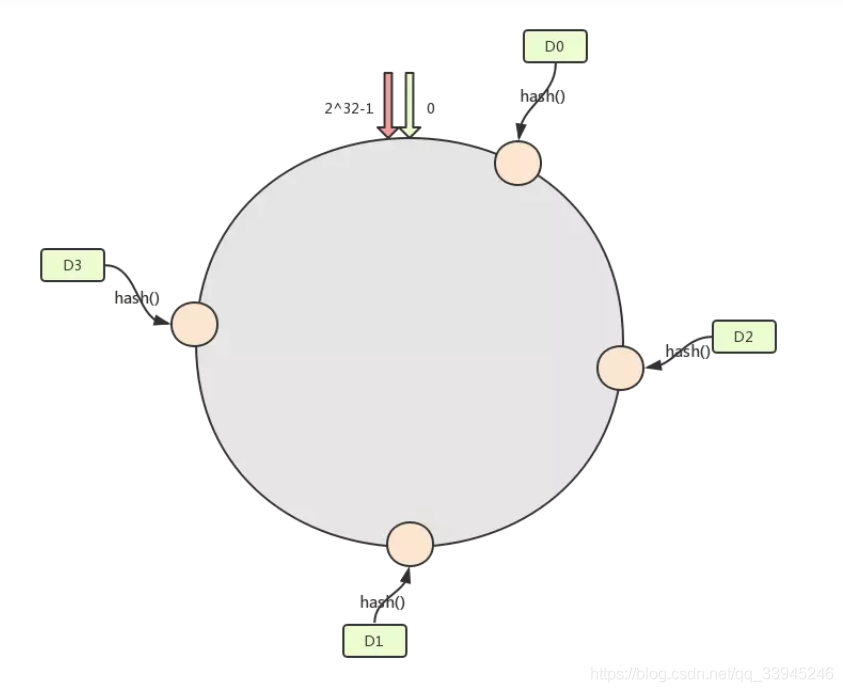
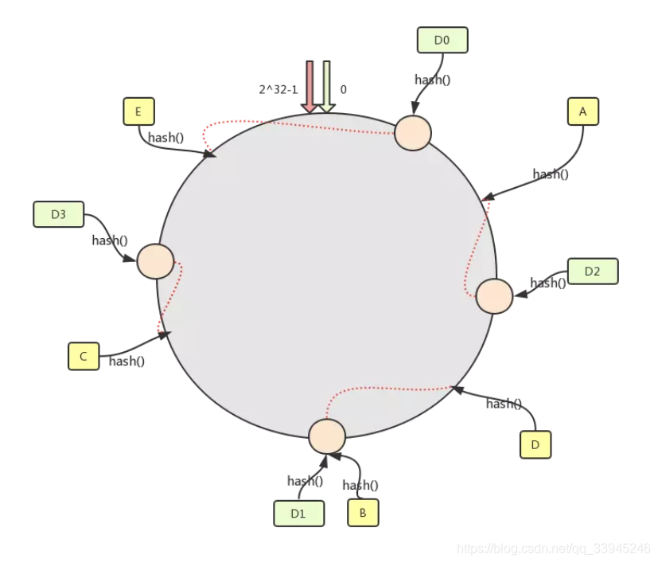
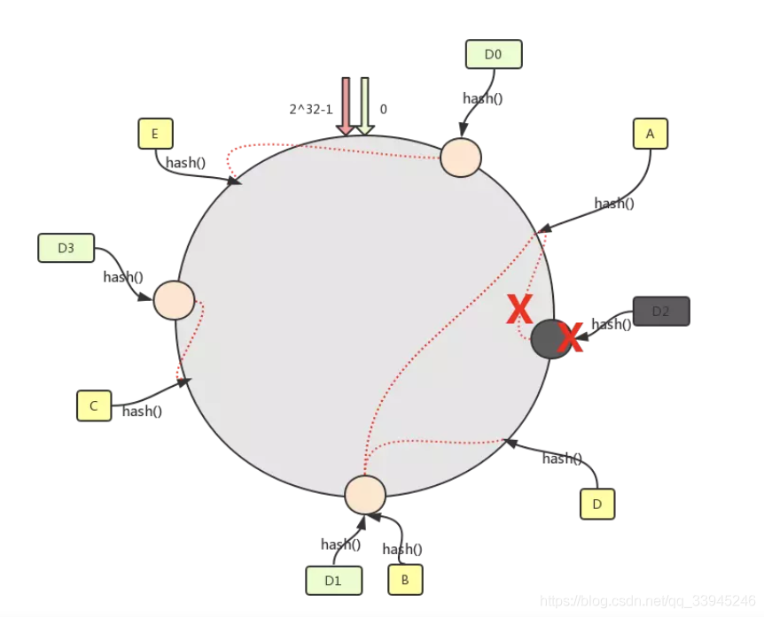
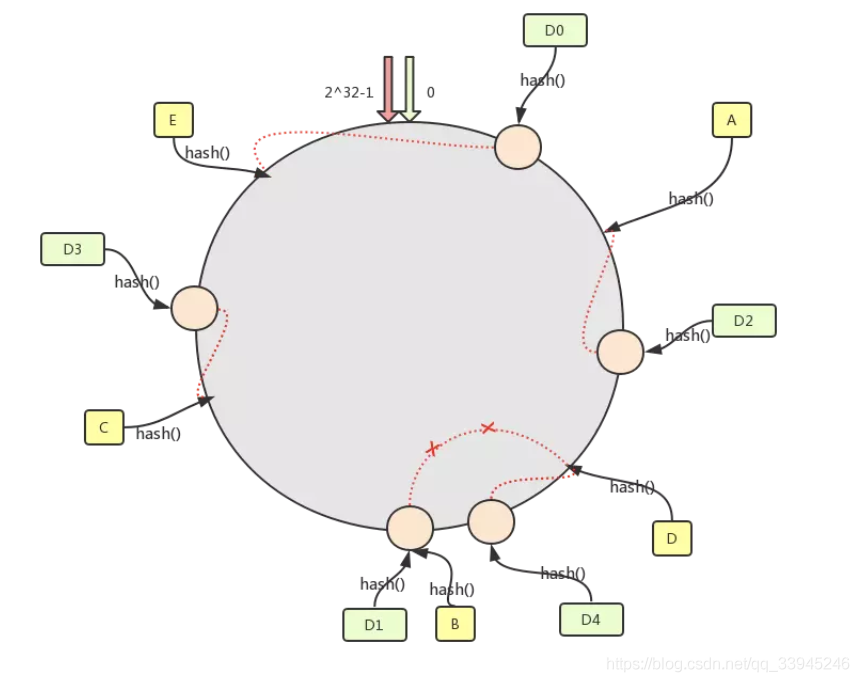
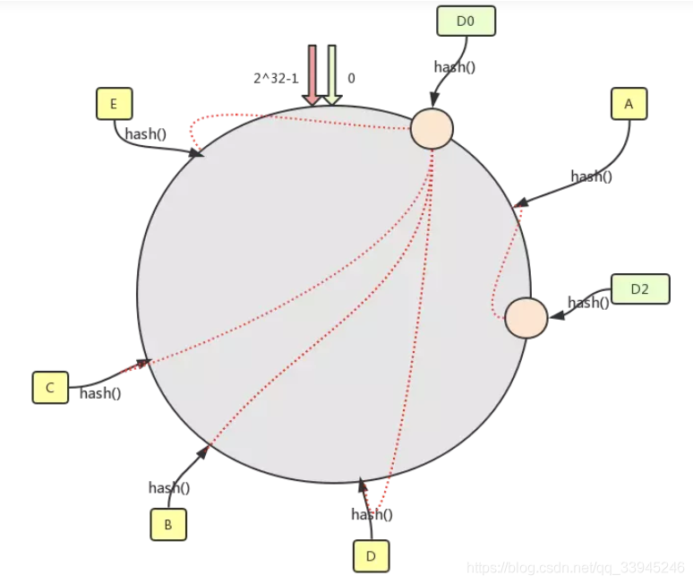
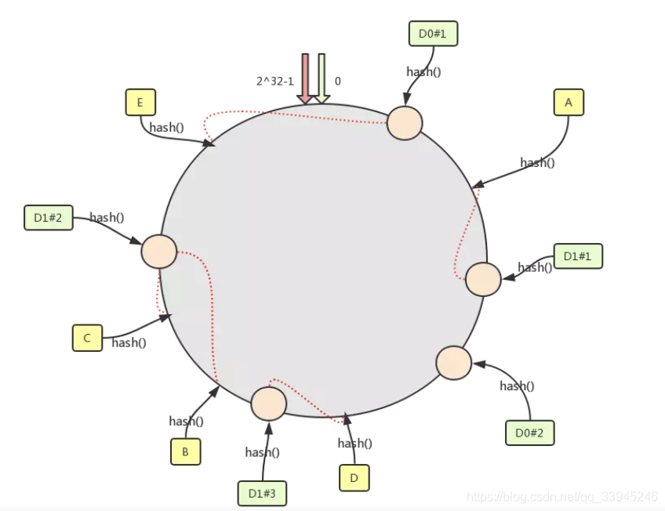

[一致性Hash原理与实现](https://www.jianshu.com/p/528ce5cd7e8f)
[什么是一致性Hash](https://blog.csdn.net/qq_33945246/article/details/105113417)
[16 张图解带你掌握一致性哈希算法](https://zhuanlan.zhihu.com/p/471822951)

# 如何分配请求？

分布式场景下，多节点请求分发及负载均衡问题；

常见的负载均衡算法：轮询、加权轮询、IP Hash、URL Hash、一致性Hash等；

# 一致性Hash

## 简单Hash取模的不足

哈希算法最简单的做法就是进行取模运算，比如分布式系统中有3个节点，可以基于` hash(key)%3`公式对数据进行映射。**但是如果节点数量发生了变化，也就是在对系统做扩容或者缩容时，必须迁移改变了映射关系的数据，否则会出现查询不到数据的问题**。

举个例子，假设我们有一个由 A、B、C 三个节点组成分布式 KV 缓存系统，基于计算公式` hash(key)%3 `将数据进行映射，每个节点存储了不同的数据。当3个节点不能满足业务需求了，这时我们增加了一个节点，节点的数量从3变化为4，意味取模哈希函数中基数的变化，计算公式变为` hash(key)%4`，这样会导致**大部分映射关系改变**，需要迁移数据来解决问题，假设总数据条数为M，哈希算法在面对节点数量变化时，**最坏情况下所有数据都需要迁移，所以它的数据迁移规模是 O(M)**，数据的迁移成本很高。

## 基本概念

分布式系统中，每个节点存储的数据是不同的。当我们想提高系统的容量，就会将数据水平切分到不同的节点来存储，也就是将数据分布到了不同的节点。比如一个分布式 KV（key-value） 缓存系统，某个 key 应该到哪个或者哪些节点上获得，应该是确定的，不是说任意访问一个节点都可以得到缓存结果的。因此，我们要想一个能应对分布式系统的负载均衡算法。

一致性Hash算法也是使用取模的思想，简单Hash取模法是对节点数量进行取模，而一致性 Hash 算法是对 `2^32` 取模，什么意思呢？简单来说，**一致性 Hash 算法将整个哈希值空间组织成一个虚拟的圆环，如假设某哈希函数 H 的值空间为 0-2^32-1，整个哈希环如下，从 0 ~ 2^32-1 代表的分别是一个个的节点，这个环也叫哈希环。**

一致性哈希是指将「存储节点」和「数据」都映射到一个首尾相连的哈希环上。首先我们将我们的节点进行一次哈希，按照一定的规则，比如按照 ip 地址的哈希值，让节点落在哈希环上。比如此时我们可能得到了如下图的环:



然后就是需要通过数据 key 找到对应的服务器然后存储了，我们约定，通过数据 key 的哈希值落在哈希环上的节点，如果命中了机器节点就落在这个机器上，否则落在顺时针直到碰到第一个机器。如下图所示 : A 的哈希值落在了 D2 节点的前面，往下找落在了 D2 机器上，D 的哈希值 在 D1 节点的前面，往下找到了 D1 机器，B 的哈希值刚好落在了 D1 节点上，依次类推。



## 场景分析

一致性哈希主要就是解决当机器减少或增加的时候，大面积的数据重新哈希的问题，主要从下面 2 个方向去考虑的，当节点宕机时，数据记录会被定位到下一个节点上，当新增节点的时候 ，相关区间内的数据记录就需要重新哈希。**在一致哈希算法中，如果增加或者移除一个节点，仅影响该节点在哈希环上顺时针相邻的后继节点，其它数据也不会受到影响**。

### 节点宕机

我们假设上图中的 节点 D2 因为一些原因宕机了，可以看到，只有数据 A 的记录需要重新重新定位存储到节点 D1 上，因为 D1 是 D2 的下一个节点，其它的数据都没有被影响到，此时被影响的仅仅是 图中的 D0-D2 这段区间的记录，也就是之前落在 D2 上的数据现在都要落到 D1 上面了。如下图




### 新增节点

我们假设我们需要增加一台机器，也就是增加一个节点 D4，如下图所示，这个节点落在 D2-D1 之间，按照上述的哈希环上的哈希值落在节点的规则，那么此时之前落在 D2 到 D4 之间的数据都需要重新定位到新的节点上面了，而其它位置的数据是不需要有改变的。



## 数据倾斜

**一致性哈希算法并不保证节点能够在哈希环上分布均匀**，这样就会带来一个问题，会有大量的请求集中在一个节点上。一致性 Hash 算法在服务节点太少时，容易因为节点分部不均匀而造成数据倾斜（被缓存的对象大部分集中缓存在某一台服务器上）问题。比如只有 2 台机器，这 2 台机器离的很近，那么顺时针第一个机器节点上将存在大量的数据，第二个机器节点上数据会很少。如下图所示，D0 机器承载了绝大多数的数据。



## 虚拟节点

为了避免出现数据倾斜问题，一致性 Hash 算法引入了虚拟节点的机制，也就是每个机器节点会进行多次哈希，最终每个机器节点在哈希环上会有多个虚拟节点存在，使用这种方式来大大削弱甚至避免数据倾斜问题。同时数据定位算法不变，只是多了一步虚拟节点到实际节点的映射，例如定位到 “D1#1”、“D1#2”、“D1#3” 三个虚拟节点的数据均定位到 D1 上。这样就解决了服务节点少时数据倾斜的问题。在实际应用中，通常将虚拟节点数设置为 32 甚至更大，因此即使很少的服务节点也能做到相对均匀的数据分布。这也是 Dubbo 负载均衡中有一种一致性哈希负载均衡的实现思想。



## 应用案例

一致性哈希用到的地方很多，特别是中间件里面，比如 Dubbo 的负载均衡也有一种策略是一致性哈希策略，使用的就是虚拟节点实现的。Redis 集群中也用到了相关思想但是没有用它而是根据实际情况改进了一下。而对于存储数据的节点水平切分的时候它的作用就更不可代替了。and so on・・・

## 代码示例

```java
public interface IHashService {
    Long hash(String key);
}

public class HashService implements IHashService {
    // MurMurHash算法,性能高,碰撞率低
    public Long hash(String key) {
        ByteBuffer buf = ByteBuffer.wrap(key.getBytes());
        int seed = 0x1234ABCD;
        ByteOrder byteOrder = buf.order();
        buf.order(ByteOrder.LITTLE_ENDIAN);
        long m = 0xc6a4a7935bd1e995L;
        int r = 47;
        long h = seed ^ (buf.remaining() * m);
        long k;
        while (buf.remaining() >= 8) {
            k = buf.getLong();
            k *= m;
            k ^= k >>> r;
            k *= m;
            h ^= k;
            h *= m;
        }

        if (buf.remaining() > 0) {
            ByteBuffer finish = ByteBuffer.allocate(8).order(ByteOrder.LITTLE_ENDIAN);
            finish.put(buf).rewind();
            h ^= finish.getLong();
            h *= m;
        }

        h ^= h >>> r;
        h *= m;
        h ^= h >>> r;
        buf.order(byteOrder);
        return h;
    }
}

public class Node<T> {
    private String ip;
    private String name;

    public Node(String ip, String name) {
        this.ip = ip;
        this.name = name;
    }
    // 使用IP当做hash的Key
    @Override
    public String toString() {
        return ip;
    }
}

// 一致性hash
public class ConsistentHash<T> {
    // Hash函数接口
    private final IHashService iHashService;
    // 每个机器节点关联的虚拟节点数量
    private final int numberOfReplicas;
    // 环形虚拟节点
    private final SortedMap<Long, T> circle = new TreeMap<Long, T>();

    public ConsistentHash(IHashService iHashService, int numberOfReplicas, Collection<T> nodes) {
        this.iHashService = iHashService;
        this.numberOfReplicas = numberOfReplicas;
        for (T node : nodes) {
            add(node);
        }
    }
    // 增加真实机器节点
    public void add(T node) {
        for (int i = 0; i < this.numberOfReplicas; i++) {
            circle.put(this.iHashService.hash(node.toString() + i), node);
        }
    }

    // 删除真实机器节点
    public void remove(T node) {
        for (int i = 0; i < this.numberOfReplicas; i++) {
            circle.remove(this.iHashService.hash(node.toString() + i));
        }
    }

    public T get(String key) {
        if (circle.isEmpty()) return null;
        long hash = iHashService.hash(key);
        // 沿环的顺时针找到一个虚拟节点
        if (!circle.containsKey(hash)) {
            SortedMap<Long, T> tailMap = circle.tailMap(hash);
            hash = tailMap.isEmpty() ? circle.firstKey() : tailMap.firstKey();
        }
        return circle.get(hash);
    }
}
// 测试类
public class TestHashCircle {
    // 机器节点IP前缀
    private static final String IP_PREFIX = "192.168.0.";
    public static void main(String[] args) {
        // 每台真实机器节点上保存的记录条数
        Map<String, Integer> map = new HashMap<String, Integer>();
        // 真实机器节点, 模拟10台
        List<Node<String>> nodes = new ArrayList<Node<String>>();
        for (int i = 1; i <= 10; i++) {
            map.put(IP_PREFIX + i, 0); // 初始化记录
            Node<String> node = new Node<String>(IP_PREFIX + i, "node" + i);
            nodes.add(node);
        }
        IHashService iHashService = new HashService();
        // 每台真实机器引入100个虚拟节点
        ConsistentHash<Node<String>> consistentHash = new ConsistentHash<Node<String>>(iHashService, 500, nodes);
        // 将5000条记录尽可能均匀的存储到10台机器节点上
        for (int i = 0; i < 5000; i++) {
            // 产生随机一个字符串当做一条记录，可以是其它更复杂的业务对象,比如随机字符串相当于对象的业务唯一标识
            String data = UUID.randomUUID().toString() + i;
            // 通过记录找到真实机器节点
            Node<String> node = consistentHash.get(data);
            // 再这里可以能过其它工具将记录存储真实机器节点上，比如MemoryCache等
            // ...
            // 每台真实机器节点上保存的记录条数加1
            map.put(node.getIp(), map.get(node.getIp()) + 1);
        }
        // 打印每台真实机器节点保存的记录条数
        for (int i = 1; i <= 10; i++) {
            System.out.println(IP_PREFIX + i + "节点记录条数：" + map.get(IP_PREFIX + i));
        }
    }
}
```

# 补充知识

##  hash slot

Redis 集群并没有直接使用一致性哈希，而是使用了哈希槽 `（slot）` 的概念，Redis 没有直接使用哈希算法 hash ()，而是使用了 `crc16` 校验算法。槽位其实就是一个个的空间的单位。其实哈希槽的本质和一致性哈希算法非常相似，不同点就是对于哈希空间的定义。一致性哈希的空间是一个圆环，节点分布是基于圆环的，无法很好的控制数据分布，可能会产生数据倾斜问题。而 Redis 的槽位空间是自定义分配的，类似于 Windows 盘分区的概念。这种分区是可以自定义大小，自定义位置的。Redis 集群包含了 `16384` 个哈希槽，每个 Key 经过计算后会落在一个具体的槽位上，而槽位具体在哪个机器上是用户自己根据自己机器的情况配置的，机器硬盘小的可以分配少一点槽位，硬盘大的可以分配多一点。如果节点硬盘都差不多则可以平均分配。所以哈希槽这种概念很好地解决了一致性哈希的弊端。
另外在容错性和扩展性上与一致性哈希一样，都是对受影响的数据进行转移而不影响其它的数据。而哈希槽本质上是对槽位的转移，把故障节点负责的槽位转移到其他正常的节点上。扩展节点也是一样，把其他节点上的槽位转移到新的节点上。

```
`slot = crc16(key) % 16384
```

## hash算法

hash冲突：开放地址法、拉链法、再hash法