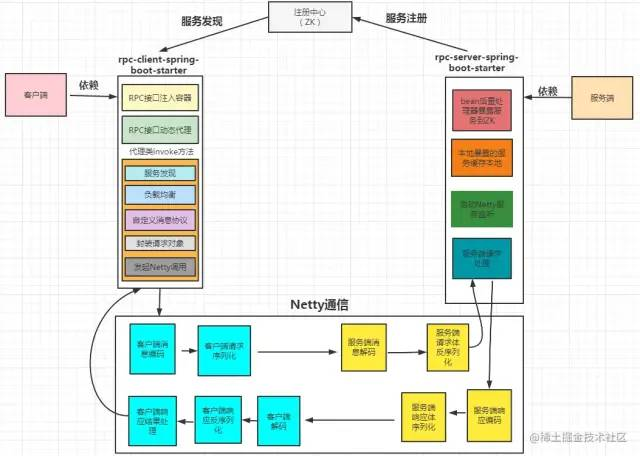

RPC原理

# 为什么要用RPC?

服务化/微服务

分布式系统架构

服务可重用

系统间交互调用

# RPC概念

RPC 称远程过程调用（**Remote Procedure Call** ），用于解决分布式系统中服务之间的调用问题。通俗地讲，就是开发者能够像调用本地方法一样调用远程的服务。所以，RPC的作用主要体现在这两个方面：

- 屏蔽远程调用跟本地调用的区别，让我们感觉就是调用项目内的方法；
- 隐藏底层网络通信的复杂性，让我们更专注于业务逻辑。

RPC— 远程过程调用协议，一种通过网络从远程计算机程序上请求服务，而不需要了解底层网络技术的协议。RPC协议假定某些传输协议的存在，如TCP或UDP，为通信程序之间携带信息数据。在OSI网络通信模型中，RPC跨越了**传输层**和**应用层**。RPC使得开发包括网络分布式多程序在内的应用程序更加容易。过程就是业务处理、计算任务，更直白理解，就是程序。像调用本地方法一样调用远程的过程。

RPC 框架包含三个最重要的组件，分别是**客户端** 、**服务端**和**注册中心** 。在一次 RPC 调用流程中，这三个组件是这样交互的：

- 服务端在启动后，会将它提供的服务列表发布到注册中心，客户端向注册中心订阅服务地址；
- 客户端会通过本地代理模块 Proxy 调用服务端，Proxy 模块收到负责将方法、参数等数据转化成网络字节流；
- 客户端从服务列表中选取其中一个的服务地址，并将数据通过网络发送给服务端；
- 服务端接收到数据后进行解码，得到请求信息；
- 服务端根据解码后的请求信息调用对应的服务，然后将调用结果返回给客户端。


> **RPC 框架通信流程以及涉及到的角色**


从上面这张图中，可以看见 RPC 框架一般有这些组件：**服务治理(注册发现)、负载均衡、容错、序列化/反序列化、编解码、网络传输、线程池、动态代理等角色，当然有的RPC框架还会有连接池、日志、安全** 等角色。

RPC采用Client-Server结构，通过request-response消息模式实现。


RPC三个过程：

通信协议、寻址方式：比如ip地址及端口、序列化

RPC核心术语：

Client、Server、calls、replies、services，programs，procedures，version，marshalling、unmarshalling
 一个网络服务由一个或多个远程程序集构成；  一个远程程序实现一个或多个远程过程； 过程、过程的参数、结果在程序协议说明书中定义说明； 为兼容程序协议变更、一个服务端可能支持多个版本的远程程序。

# RPC协议

RPC调用过程中需要将参数编组为消息进行发送，接收方需要解组消息为参数，过程处理结果同样需要经编组、解组。消息由哪些部分构成及消息的表示形式就构成了消息协议。RPC调用过程中采用的消息协议称为RPC协议。

RPC是要做的事，RPC协议规定请求、响应消息的格式。在TCP之上我们可以选用或自定义消息协议来完成我们的RPC消息交互。我们可以选用通用的标准协议，如：http、https。也可根据自身的需要定义自己的消息协议！

> RPC与RMI有什么区别？我们熟悉的webservice、restfull接口调用是RPC吗？

RMI(remote method invocation) 远程方法调用是OOP领域中RPC的一种具体实现。

都是RPC，只是消息的组织方式、消息协议不同罢了！

> **RPC vs MQ**

在架构上，RPC和MQ的差异点是，Message Queue有一个中间结点Queue，可以把消息存储。

RPC的特性：

同步调用，对于要等待返回结果的场景，RPC可以非常自然直觉的使用 (RPC也可以是异步调用)。由于等待结果， Consumer会有线程消耗。如果以异步RPC的方式使用，Consumer线程消耗可以去掉。但不能做到像MQ一样暂存请求，压力会直接传导到服务Provider。

消息的特性：

1.Message Queue把请求的压力保存一下，逐渐释放出来，让处理者按照自己的节奏来处理。

2.Message Queue引入一下新的结点，系统的可靠性会受Message Queue结点的影响。

3.Message Queue是异步单向的消息。发送消息设计成是不需要等待消息处理的完成。

所以对于有同步返回需求，用Message Queue则变得麻烦了。

RPC和MQ适用场景：

1.希望同步得到结果的场合，RPC合适。

2.希望使用简单，则RPC；RPC操作基于接口，使用简单，使用方式模拟本地调用。异步的方式编程比较复杂。

3.不希望发送端受限于处理端的速度时，使用Message Queue。

4.随着业务增长，有的处理端处理量会成为瓶颈，会进行同步调用到异步消息的改造。


# RPC流程


> RPC流程

1.客户端处理过程中调用Client stub（就像调用本地方法一样），传入参数；

2.Client stub 将参数**编组**为消息，然后通过系统调用向服务端发送消息；


3.客户端本地操作系统将消息从客户端机器发送到服务端机器；

4.服务端操作系统将接收到的数据包传递给Server stub；

5.Server stub **解组**消息为参数；

6.Sever stub 根据解码结果再调用服务端的过程，过程执行结果以反方向的相同步骤响应给客户端。

stub（存根）：分布式计算中存根是一段代码，它转换在远程过程调用期间Client和server之间传递的参数。

> RPC流程中需要处理的问题

1.Client stub 、Server stub的开发；

2.参数如何编组为消息，以及解组消息；

3.消息如何发送；

4.过程结果如何表示、异常情况如何处理；

5.如何实现安全的访问控制。


# RPC框架

封装好了参数编组、消息解组、底层网络通信的RPC程序开发框架，让我们可以直接在其基础上只需专注于我们的过程代码编写。

常用RPC框架：

java领域：

传统webservice框架：Apache CXF、Apache Axis2、java 自带的 JAX-WS等等。webService框架大多基于标准的SOAP协议。

新兴的微服务框架：Dubbo、spring cloud、Apache Thrift 、ICE、gRPC等等

# RPC涉及关键技术

## 动态代理

服务调用者用的服务实际是远程服务的本地代理。说白了就是通过动态代理来实现。

java 里至少提供了两种技术来提供动态代码生成，一种是 jdk 动态代理，另外一种是字节码生成。


动态代理相比字节码生成使用起来更方便，但动态代理方式在性能上是要逊色于直接的字节码生成的，而字节码生成在代码可读性上要差很多。


两者权衡起来，牺牲一些性能来获得代码可读性和可维护性显得更重要。

## 网络通信

RPC框架通信与具体的协议无关。RPC 可基于 HTTP 或 TCP 协议，Web Service 就是基于 HTTP 协议的 RPC，它具有良好的跨平台性，但其性能却不如基于TCP 协议的 RPC。


## 序列化

两方面会直接影响 RPC 的性能，一是传输方式，二是序列化


Protobuf是跨语言的。

## 服务暴露

远程提供者需要以某种形式提供服务调用相关的信息，包括但不限于服务接口定义、数据结构、或者中间态的服务定义文件。例如Facebook的Thrift的IDL文件，Web service的WSDL文件；服务的调用者需要通过一定的途径获取远程服务调用相关的信息。


## 服务注册与发现

注册中心

## RPC调用方式

 RPC 框架一般会提供四种调用方式，分别为**同步 Sync** 、**异步 Future** 、**回调 Callback** 和**单向 Oneway** 。

### Sync 同步调用

客户端线程发起 RPC 调用后，当前线程会一直阻塞，直至服务端返回结果或者处理超时异常。


### Future 异步调用

客户端发起调用后不会再阻塞等待，而是拿到 RPC 框架返回的 Future 对象，调用结果会被服务端缓存，客户端自行决定后续何时获取返回结果。当客户端主动获取结果时，该过程是阻塞等待的


### Callback 回调调用

客户端发起调用时，将 Callback 对象传递给 RPC 框架，无须同步等待返回结果，直接返回。当获取到服务端响应结果或者超时异常后，再执行用户注册的 Callback 回调


### Oneway 单向调用

客户端发起请求之后直接返回，忽略返回结果。


## TCP粘包拆包

> 什么是TCP粘包、拆包

**TCP** 传输协议是面向流的，没有数据包界限，也就是说消息无边界。客户端向服务端发送数据时，可能将一个完整的报文拆分成多个小报文进行发送，也可能将多个报文合并成一个大的报文进行发送。因此就有了拆包和粘包。

在网络通信的过程中，每次可以发送的数据包大小是受多种因素限制的，如 **MTU** 传输单元大小、滑动窗口等。

所以如果一次传输的网络包数据大小超过传输单元大小，那么我们的数据可能会拆分为多个数据包发送出去。

如果每次请求的网络包数据都很小，比如一共请求了 **10000** 次，**TCP** 并不会分别发送 **10000** 次。TCP采用的 **Nagle** （批量发送，主要用于解决频繁发送小数据包而带来的网络拥塞问题） 算法对此作出了优化。

所以，网络传输会出现这样：


- 服务端恰巧读到了两个完整的数据包 A 和 B，没有出现拆包/粘包问题；
- 服务端接收到 A 和 B 粘在一起的数据包，服务端需要解析出 A 和 B；
- 服务端收到完整的 A 和 B 的一部分数据包 B-1，服务端需要解析出完整的 A，并等待读取完整的 B 数据包；
- 服务端接收到 A 的一部分数据包 A-1，此时需要等待接收到完整的 A 数据包；
- 数据包 A 较大，服务端需要多次才可以接收完数据包 A。

> ##### 如何解决TCP粘包、拆包问题

**解决问题的根本手段:** 找出消息的边界：

- 消息长度固定

  每个数据报文都需要一个固定的长度。当接收方累计读取到固定长度的报文后，就认为已经获得一个完整的消息。当发送方的数据小于固定长度时，则需要空位补齐。

  消息定长法使用非常简单，但是缺点也非常明显，无法很好设定固定长度的值，如果长度太大会造成字节浪费，长度太小又会影响消息传输，所以在一般情况下消息定长法不会被采用。

- 特定分隔符

  在每次发送报文的尾部加上特定分隔符，接收方就可以根据特殊分隔符进行消息拆分。分隔符的选择一定要避免和消息体中字符相同，以免冲突。否则可能出现错误的消息拆分。比较推荐的做法是将消息进行编码，例如 base64 编码，然后可以选择 64 个编码字符之外的字符作为特定分隔符。

- 消息长度 + 消息内容

  消息长度 + 消息内容是项目开发中最常用的一种协议，接收方根据消息长度来读取消息内容。所以在解码时要判断数据是否够长度读取，没有不够说明数据没有准备好，继续读取数据并解码，这里这种方式可以获取一个个完整的数据包。

# RPC实战

手写实现；dubbo源码学习；

客户端 依赖接口， clientStub动态代理对象（接口代理），请求消息编组（包括接口类、方法、及参数等），发送网络请求，对响应消息解组

服务端 实现接口，serverStub动态代理对象（实现代理），请求消息解组，执行方法，响应消息（包括响应结果等）编组

[基于netty实现rpc](https://zhuanlan.zhihu.com/p/459707752)

[淦！如何手撸一个较为完整的RPC框架？](https://mp.weixin.qq.com/s/aXVtWIwIEwOPonZkGLn-lQ)

## 设计要点

从上面的概念我们知道一个RPC框架大概有哪些部分组成，所以在设计一个RPC框架也需要从这些组成部分考虑。从RPC的定义中可以知道，RPC框架需要屏蔽底层细节，让用户感觉调用远程服务像调用本地方法一样简单，所以需要考虑这些问题：

- 用户使用我们的RPC框架时如何尽量少的配置
- 如何将服务注册到ZK(这里注册中心选择ZK)上并且让用户无感知
- 如何调用透明(尽量用户无感知)的调用服务提供者
- 启用多个服务提供者如何做到动态负载均衡
- 框架如何做到能让用户自定义扩展组件(比如扩展自定义负载均衡策略)
- 如何定义消息协议，以及编解码
- ...等等

上面这些问题在设计这个RPC框架中都会给予解决。

## 技术选型

- **注册中心** 目前成熟的注册中心有Zookeeper，Nacos，Consul，Eureka，这里使用ZK作为注册中心，没有提供切换以及用户自定义注册中心的功能。
- **IO通信框架** 本实现采用 Netty 作为底层通信框架，因为Netty 是一个高性能事件驱动型的非阻塞的IO(NIO)框架，没有提供别的实现，也不支持用户自定义通信框架。
- **消息协议** 本实现使用自定义消息协议，后面会具体说明。
- **序列化**  Protobuf

参考dubbo，微内核+插件扩展，支持SPI扩展

## 项目结构

模块、依赖


从这个结构中可以知道，以rpc命名开头的是rpc框架的模块，也是本项目RPC框架的内容，而**consumer是服务消费者** ，**provider是服务提供者** ，**provider-api是暴露的服务API** 。


> 基于starter机制设计

要让用户使用RPC框架时尽量少的配置，把rpc框架设计成一个starter，用户只要依赖这个starter,基本就可以。

消费者依赖客户端，服务提供者依赖服务端，还有就是最小化依赖。

基于spring boot自动装配机制，会加载starter中的 spring.factories 文件，在文件中配置以下代码，这里我们starter的配置类就生效了，在配置类里面配置一些需要的bean。

```
org.springframework.boot.autoconfigure.EnableAutoConfiguration=com.lyn.rpc.client.config.RpcClientAutoConfiguration
```

**发布服务**

服务提供者需要在暴露的服务上增加注解 @RpcService，这个自定义注解是基于 @service 的，是一个复合注解，具备@service注解的功能，在@RpcService注解中指明服务接口和服务版本，发布服务到ZK上，会根据这个两个元数据注册。

服务提供者启动之后，根据spring boot自动装配机制，server-starter的配置类就生效了，在一个 bean 的后置处理器（RpcServerProvider）中**获取被注解 @RpcService** 修饰的bean，将注解的**元数据** **注册到ZK** 上。

```java
@RpcService(interfaceType = IHelloWorldService.class, version = "1.0")
public class HelloWorldServiceImpl implements IHelloWorldService {
    @Override
    public UserOutputDto sayHello(UserInputDto userInputDto) {
        UserOutputDto outputDto = new UserOutputDto();
        outputDto.setKey(userInputDto.toString());
        return outputDto;
    }
}

public class RpcServerProvider implements BeanPostProcessor, CommandLineRunner {
    private IRegistryService registryService;
    private RpcServerProperties properties;
    private RpcServer rpcServer;

    public RpcServerProvider(IRegistryService registryService, RpcServer rpcServer, RpcServerProperties properties) {
        this.registryService = registryService;
        this.properties = properties;
        this.rpcServer = rpcServer;
    }

    /**
     * 所有bean 实例化之后处理，暴露服务注册到注册中心，容器启动后开启netty服务处理请求     
     */
    @Override
    public Object postProcessAfterInitialization(Object bean, String beanName) throws BeansException {
        RpcService rpcService = bean.getClass().getAnnotation(RpcService.class);
        if (rpcService != null) {
            try {
                String serviceName = rpcService.interfaceType().getName();
                String version = rpcService.version();
                LocalServerCache.store(ServiceUtil.serviceKey(serviceName, version), bean);

                ServiceInfo serviceInfo = new ServiceInfo();
                serviceInfo.setServiceName(ServiceUtil.serviceKey(serviceName, version));
                serviceInfo.setPort(properties.getPort());
                serviceInfo.setAddress(InetAddress.getLocalHost().getHostAddress());
                serviceInfo.setAppName(properties.getAppName());

                // 服务注册
                registryService.register(serviceInfo);
            } catch (Exception ex) {
                log.error("服务注册出错:{}", ex);
            }
        }
        return bean;
    }

    /**
     * 启动rpc服务 处理请求
     */
    @Override
    public void run(String... args) {
        new Thread(() -> rpcServer.start(properties.getPort())).start();
        log.info(" rpc server :{} start, appName :{} , port :{}", rpcServer, properties.getAppName(), properties.getPort());
        Runtime.getRuntime().addShutdownHook(new Thread(() -> {
            try {
                // 关闭之后把服务从ZK上清除
                registryService.destroy();
            }catch (Exception ex){
                log.error("", ex);
            }
        }));
    }
}
```

**消费服务**

消费服务需要使用自定义的 @RpcAutowired 注解标识，是一个复合注解，基于 @Autowired。基于**spring boot自动装配** ，服务消费者启动，bean 后置处理器 **RpcClientProcessor** 开始工作。它主要是遍历所有的bean，判断每个bean中的属性是否有被 **@RpcAutowired** 注解修饰，有的话把该属性动态赋值代理类，这个再调用时会调用代理类的 **invoke** 方法。代理类 **invoke** 方法通过服务发现获取服务端元数据，封装请求，通过**netty** 发起调用。

```java
public class RpcClientProcessor implements BeanFactoryPostProcessor, ApplicationContextAware {
    private ClientStubProxyFactory clientStubProxyFactory;
    private IDiscoveryService discoveryService;
    private RpcClientProperties properties;
    private ApplicationContext applicationContext;

    public RpcClientProcessor(ClientStubProxyFactory clientStubProxyFactory, IDiscoveryService discoveryService, RpcClientProperties properties) {
        this.clientStubProxyFactory = clientStubProxyFactory;
        this.discoveryService = discoveryService;
        this.properties = properties;
    }

    @Override
    public void postProcessBeanFactory(ConfigurableListableBeanFactory beanFactory) throws BeansException {
        for (String beanDefinitionName : beanFactory.getBeanDefinitionNames()) {
            BeanDefinition beanDefinition = beanFactory.getBeanDefinition(beanDefinitionName);
            String beanClassName = beanDefinition.getBeanClassName();
            if (beanClassName != null) {
                Class<?> clazz = ClassUtils.resolveClassName(beanClassName, this.getClass().getClassLoader());
                ReflectionUtils.doWithFields(clazz, field -> {
                    RpcAutowired rpcAutowired = AnnotationUtils.getAnnotation(field, RpcAutowired.class);
                    if (rpcAutowired != null) {
                        Object bean = applicationContext.getBean(clazz);
                        field.setAccessible(true);
                        // 修改为代理对象
                        ReflectionUtils.setField(field, bean, clientStubProxyFactory.getProxy(field.getType(), rpcAutowired.version(), discoveryService, properties));
                    }
                });
            }
        }
    }

    @Override
    public void setApplicationContext(ApplicationContext applicationContext) throws BeansException {
        this.applicationContext = applicationContext;
    }
}

public class ClientStubInvocationHandler implements InvocationHandler {
    private IDiscoveryService discoveryService;
    private RpcClientProperties properties;
    private Class<?> calzz;
    private String version;

    public ClientStubInvocationHandler(IDiscoveryService discoveryService, RpcClientProperties properties, Class<?> calzz, String version) {
        super();
        this.calzz = calzz;
        this.version = version;
        this.discoveryService = discoveryService;
        this.properties = properties;
    }

    @Override
    public Object invoke(Object proxy, Method method, Object[] args) throws Throwable {
        // 1、获得服务信息
        ServiceInfo serviceInfo = discoveryService.discovery(ServiceUtil.serviceKey(this.calzz.getName(), this.version));
        if (serviceInfo == null) {
            throw new ResourceNotFoundException("404");
        }

        MessageProtocol<RpcRequest> messageProtocol = new MessageProtocol<>();
        // 设置请求头
        messageProtocol.setHeader(MessageHeader.build(properties.getSerialization()));
        // 设置请求体
        RpcRequest request = new RpcRequest();
        request.setServiceName(ServiceUtil.serviceKey(this.calzz.getName(), this.version));
        request.setMethod(method.getName());
        request.setParameterTypes(method.getParameterTypes());
        request.setParameters(args);
        messageProtocol.setBody(request);

        // 发送网络请求 拿到结果
        MessageProtocol<RpcResponse> responseMessageProtocol = NetClientTransportFactory.getNetClientTransport()
                .sendRequest(RequestMetadata.builder().protocol(messageProtocol).address(serviceInfo.getAddress())
                        .port(serviceInfo.getPort()).timeout(properties.getTimeout()).build());
        if (responseMessageProtocol == null) {
            log.error("请求超时");
            throw new RpcException("rpc调用结果失败， 请求超时 timeout:" + properties.getTimeout());
        }

        if (!MsgStatusEnum.isSuccess(responseMessageProtocol.getHeader().getStatus())) {
            log.error("rpc调用结果失败， message：{}", responseMessageProtocol.getBody().getMessage());
            throw new RpcException(responseMessageProtocol.getBody().getMessage());
        }
        return responseMessageProtocol.getBody().getData();
    }
}
```

**注册中心**

注册中心使用**ZK** ，由于注册中心被服务消费者和服务提供者都使用。所以把ZK放在rpc-core模块。

```java
public interface IRegistryService {
    void register(ServiceInfo serviceInfo) throws Exception;
    void unRegister(ServiceInfo serviceInfo) throws Exception;
    void destroy() throws IOException;
}
```

**@ConditionalOnMissingBean** ，会优先加载用户自定义的 **bean** 

**自定义消息协议、编解码**

- 自定义消息协议


**魔数** ：魔数是通信双方的一个暗号，通常采用固定的几个字节表示。作用是防止随便向服务器端口上发送数据。

**协议版本号** ：随着业务需求的变化，协议可能需要进行改动，不同版本的协议对应的解析方法也是不同的。

**序列化算法** ：序列化算法表示数据发送方应该采用何种方法将请求的对象转化为二进制，以及如何再将二进制转化为对象。如 JSON、Hessian、Java 自带序列化等。

**报文类型** ：在不同的业务场景中，报文可能存在不同的类型。RPC 框架中有请求、响应、心跳等类型的报文。

**状态** ：状态字段用于标识请求是否正常（SUCCESS、FAIL）。

**消息ID** ：请求唯一ID，通过这个请求ID将响应关联起来，也可以通过请求ID做链路追踪。

**数据长度** ：标明数据的长度，用于判断是否是一个完整的数据包。

**数据内容** ：请求体内容。

- 编解码

```java
    @Override
    protected void encode(ChannelHandlerContext channelHandlerContext, MessageProtocol<T> messageProtocol, ByteBuf byteBuf) throws Exception {
        MessageHeader header = messageProtocol.getHeader();
        // 魔数
        byteBuf.writeShort(header.getMagic());
        // 协议版本号
        byteBuf.writeByte(header.getVersion());
        // 序列化算法
        byteBuf.writeByte(header.getSerialization());
        // 报文类型
        byteBuf.writeByte(header.getMsgType());
        // 状态
        byteBuf.writeByte(header.getStatus());
        // 消息 ID
        byteBuf.writeCharSequence(header.getRequestId(), Charset.forName("UTF-8"));
        ISerializer rpcSerialization = SerializerFactory.getRpcSerialization(SerializationTypeEnum.parseByType(header.getSerialization()));
        byte[] data = rpcSerialization.serialize(messageProtocol.getBody());
        // 数据长度
        byteBuf.writeInt(data.length);
        // 数据内容
        byteBuf.writeBytes(data);
    }

    @Override
    protected void decode(ChannelHandlerContext ctx, ByteBuf in, List<Object> out) throws Exception {
        if (in.readableBytes() < ProtocolConstants.HEADER_TOTAL_LEN) {
            // 可读的数据小于请求头总的大小 直接丢弃
            return;
        }
        // 标记 ByteBuf 读指针位置
        in.markReaderIndex();
        // 魔数
        short magic = in.readShort();
        if (magic != ProtocolConstants.MAGIC) {
            throw new IllegalArgumentException("magic number is illegal, " + magic);
        }
        byte version = in.readByte();
        byte serializeType = in.readByte();
        byte msgType = in.readByte();
        byte status = in.readByte();
        CharSequence requestId = in.readCharSequence(ProtocolConstants.REQ_LEN, Charset.forName("UTF-8"));
        int dataLength = in.readInt();
        if (in.readableBytes() < dataLength) {
            // 可读的数据长度小于请求体长度 直接丢弃并重置 读指针位置
            in.resetReaderIndex();
            return;
        }
        byte[] data = new byte[dataLength];
        in.readBytes(data);
        MsgTypeEnum msgTypeEnum = MsgTypeEnum.findByType(msgType);
        if (msgTypeEnum == null) {
            return;
        }
        MessageHeader header =  MessageHeader.builder()
                .magic(magic).version(version).serialization(serializeType)
                .status(status).requestId(String.valueOf(requestId))
                .msgType(msgType).msgLen(dataLength).build();
        ISerializer rpcSerialization = SerializerFactory.getRpcSerialization(SerializationTypeEnum.parseByType(serializeType));
        switch (msgTypeEnum) {
            case REQUEST:
                RpcRequest request = rpcSerialization.deserialize(data, RpcRequest.class);
                if (request != null) {
                    MessageProtocol<RpcRequest> protocol = new MessageProtocol<>();
                    protocol.setHeader(header);
                    protocol.setBody(request);
                    out.add(protocol);
                }
                break;
            case RESPONSE:
                RpcResponse response = rpcSerialization.deserialize(data, RpcResponse.class);
                if (response != null) {
                    MessageProtocol<RpcResponse> protocol = new MessageProtocol<>();
                    protocol.setHeader(header);
                    protocol.setBody(response);
                    out.add(protocol);
                }
                break;
        }
    }
```


## 整体架构



流程分为三块：**服务提供者启动** 、**服务消费者启动** 、**调用过程。**

- 服务提供者启动**-** 服务提供者 **provider** 会依赖 **rpc-server-spring-boot-starter。**

  **-** **ProviderApplication** 启动，根据**springboot** 自动装配机制，**RpcServerAutoConfiguration** 自动配置生效。

  **-** **RpcServerProvider** 是一个bean后置处理器，会发布服务，将服务元数据注册到ZK上。

  **-** **RpcServerProvider.run** 方法会开启一个 netty 服务。

- 服务消费者启动**-** 服务消费者 **consumer** 会依赖 **rpc-client-spring-boot-starter**

  **-** **ConsumerApplication** 启动，根据**springboot** 自动装配机制，**RpcClientAutoConfiguration** 自动配置生效

  **-** 将服务发现、负载均衡、代理等bean加入**IOC容器**

  **-** 后置处理器 **RpcClientProcessor** 会扫描 bean ,将被 **@RpcAutowired** 修饰的属性动态赋值为代理对象

- 调用过程**-** 服务消费者 发起请求 **http://localhost‍:9090/users/test**

  **-** 服务消费者 调用 **helloWordService.sayHello()** 方法，会被代理到执行 **ClientStubInvocationHandler.invoke()** 方法

  **-** 服务消费者 通过ZK服务发现获取服务元数据，找不到报错404

  **-** 服务消费者 自定义协议，封装请求头和请求体，通过自定义编码器 **RpcEncoder** 将消息编码

  **-** 服务消费者 通过 服务发现获取到服务提供者的ip和端口， 通过Netty网络传输层发起调用

  **-** 服务消费者 通过 **RpcFuture** 进入返回结果（超时）等待

  **-** 服务提供者 收到消费者请求，将消息通过自定义解码器 **RpcDecoder** 解码

  **-** 服务提供者 解码之后的数据发送到 **RpcRequestHandler** 中进行处理，通过反射调用执行服务端本地方法并获取结果

  **-** 服务提供者 将执行的结果通过 编码器 **RpcEncoder** 将消息编码。

  **-** 服务消费者 将消息通过自定义解码器 **RpcDecoder** 解码

  **-** 服务消费者 通过**RpcResponseHandler** 将消息写入 请求和响应池中，并设置 **RpcFuture** 的响应结果

  **-** 服务消费者 获取到结果

## 环境搭建

- 操作系统：Windows
- 集成开发工具：IntelliJ IDEA
- 项目技术栈：SpringBoot 2.5.2 + JDK 1.8 + Netty 4.1.75.Final
- 项目依赖管理工具：Maven 4.0.0
- 注册中心：Zookeeeper 3.7.0

## 项目测试

- 启动 Zookeeper 服务器：**bin/zkServer.cmd**
- 启动 provider 模块 **ProviderApplication**
- 启动 consumer 模块 **ConsumerApplication**
- 测试：浏览器输入 **http://localhost:9090/users/test** ，成功返回 , rpc 调用成功