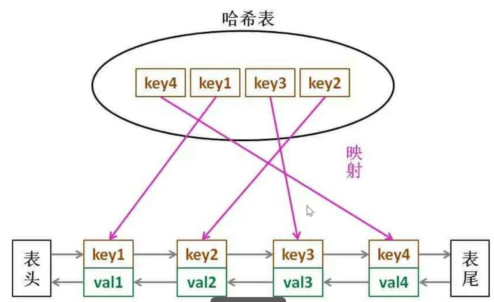

# LRU

[实现LRU缓存机制](https://www.toutiao.com/i7005048942614315531/?tt_from=weixin&utm_campaign=client_share&wxshare_count=1&timestamp=1631290826&app=news_article&utm_source=weixin&utm_medium=toutiao_android&use_new_style=1&req_id=20210911002026010212205224011A2945&share_token=5519b469-4034-43a8-98cd-b61481b7c0b9&group_id=7005048942614315531)

## 基本概念

LRU, Least Recently Used，即最近最少使用，当容量不足时，优先淘汰最久未使用的数据。

## 核心方法

用一个双链表来存储数据，最近使用的数据存在表头，最久未使用的数据存在表尾。

1、get (key)    2、put (key, value)

要求put、get操作为O(1)的时间复杂度。

## 实现方法

### 方法1，双链表 + 哈希表



LRU 缓存机制可以通过哈希表辅以双向链表实现，用一个哈希表和一个双向链表维护所有在缓存中的键值对。

双向链表按照被使用的顺序存储了这些键值对，靠近头部的键值对是最近使用的，而靠近尾部的键值对是最久未使用的。哈希表即为普通的哈希映射（HashMap），通过缓存数据的键映射到其在双向链表中的位置。

首先使用哈希表进行定位，找出缓存项在双向链表中的位置，随后将其移动到双向链表的头部，即可在 O(1)的时间内完成 get 或者 put 操作。具体的方法如下：

- 对于 get 操作，首先判断 key 是否存在：

如果 key 不存在，则返回 -1；

如果 key 存在，则 key 对应的节点是最近被使用的节点。通过哈希表定位到该节点在双向链表中的位置，并将其移动到双向链表的头部，最后返回该节点的值。

- 对于 put 操作，首先判断 key 是否存在：

如果 key 不存在，使用 key 和 value 创建一个新的节点，在双向链表的头部添加该节点，并将 key 和该节点添加进哈希表中。然后判断双向链表的节点数是否超出容量，如果超出容量，则删除双向链表的尾部节点，并删除哈希表中对应的项；

如果 key 存在，则与 get 操作类似，先通过哈希表定位，再将对应的节点的值更新为 value，并将该节点移到双向链表的头部。

上述各项操作中，访问哈希表的时间复杂度为 O(1)，在双向链表的头部添加节点、在双向链表的尾部删除节点的复杂度也为 O(1)。而将一个节点移到双向链表的头部，可以分成「删除该节点」和「在双向链表的头部添加节点」两步操作，都可以在 O(1)时间内完成。

在双向链表的实现中，使用一个伪头部（dummy head）和伪尾部（dummy tail）标记界限，这样在添加节点和删除节点的时候就不需要检查相邻的节点是否存在

hash表中已存key为何双链表中还存？淘汰数据时需要先删除链表节点然后删除hash表中key。

```java
class DLinkedNode {
        int key;
        int value;
        DLinkedNode prev;
        DLinkedNode next;
        public DLinkedNode() {}
        public DLinkedNode(int _key, int _value) {key = _key; value = _value;}
}

public class LRUCache {
    private Map<Integer, DLinkedNode> cache = new HashMap<Integer, DLinkedNode>();
    private int size;
    private int capacity;
    private DLinkedNode head, tail;

    public LRUCache(int capacity) {
        this.size = 0;
        this.capacity = capacity;
        // 使用伪头部和伪尾部节点
        head = new DLinkedNode();
        tail = new DLinkedNode();
        head.next = tail;
        tail.prev = head;
    }

    public int get(int key) {
        DLinkedNode node = cache.get(key);
        if (node == null) {
            return -1;
        }
        // 如果 key 存在，先通过哈希表定位，再移到头部
        moveToHead(node);
        return node.value;
    }

    public void put(int key, int value) {
        DLinkedNode node = cache.get(key);
        if (node == null) {
            // 如果 key 不存在，创建一个新的节点
            DLinkedNode newNode = new DLinkedNode(key, value);
            // 添加进哈希表
            cache.put(key, newNode);
            // 添加至双向链表的头部
            addToHead(newNode);
            ++size;
            if (size > capacity) {
                // 如果超出容量，删除双向链表的尾部节点
                DLinkedNode tail = removeTail();
                // 删除哈希表中对应的项
                cache.remove(tail.key);
                --size;
            }
        }
        else {
            // 如果 key 存在，先通过哈希表定位，再修改 value，并移到头部
            node.value = value;
            moveToHead(node);
        }
    }

    private void addToHead(DLinkedNode node) {
        node.prev = head;
        node.next = head.next;
        head.next.prev = node;
        head.next = node;
    }

    private void removeNode(DLinkedNode node) {
        node.prev.next = node.next;
        node.next.prev = node.prev;
    }

    private void moveToHead(DLinkedNode node) {
        removeNode(node);
        addToHead(node);
    }

    private DLinkedNode removeTail() {
        DLinkedNode res = tail.prev;
        removeNode(res);
        return res;
    }
}
```

### 方法2，借助 LinkedHashMap

```java
public class LinkedLruCache {
    private LinkedHashMap<Integer, Integer> cacheMap = new LinkedHashMap<>();
    private int cap;

    public LinkedLruCache(int cap) {
        this.cap = cap;
    }

    public int get(int key) {
        if (!cacheMap.containsKey(key)) {
            return -1;
        }
        Integer val = cacheMap.get(key);
        //先删除，再添加
        cacheMap.remove(key);
        cacheMap.put(key, val);
        return val;
    }

    public void put(int key, int val) {
        if (cacheMap.containsKey(key)) {
            //先删除，再添加
            cacheMap.remove(key);
            cacheMap.put(key, val);
            return;
        }
        //达到容量后，删除第一个元素
        if (cacheMap.size() == cap) {
            Integer firstKey = cacheMap.keySet().iterator().next();
            cacheMap.remove(firstKey);
        }
        cacheMap.put(key, val);
    }
}
```

### 方式3，继承 LinkedHashMap

需要设置 accessOrder = true，在元素被访问后会被移至队尾。

```java
class LRUCache extends LinkedHashMap<Integer, Integer>{
    private int capacity;

    public LRUCache(int capacity) {
        super(capacity, 0.75F, true);
        this.capacity = capacity;
    }

    public int get(int key) {
        return super.getOrDefault(key, -1);
    }

    public void put(int key, int value) {
        super.put(key, value);
    }

    @Override
    protected boolean removeEldestEntry(Map.Entry<Integer, Integer> eldest) {
        return size() > capacity;
    }
}
```

# LFU