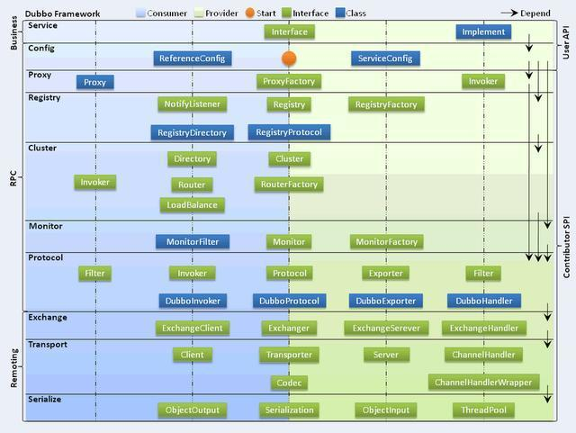
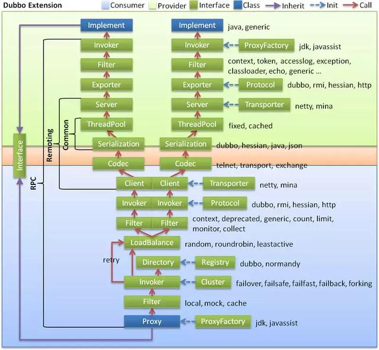
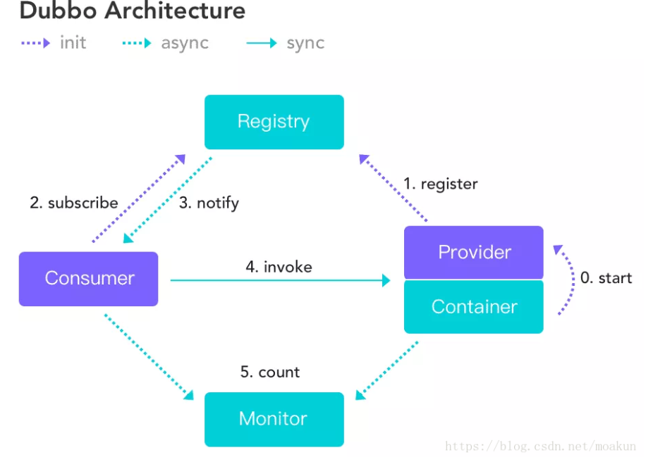
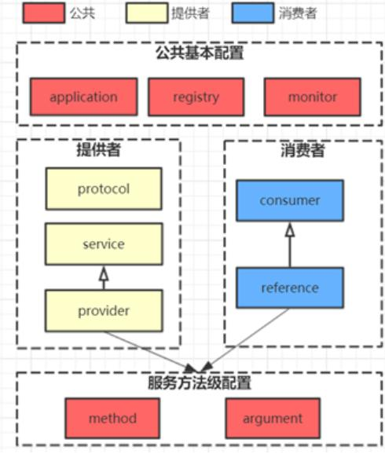
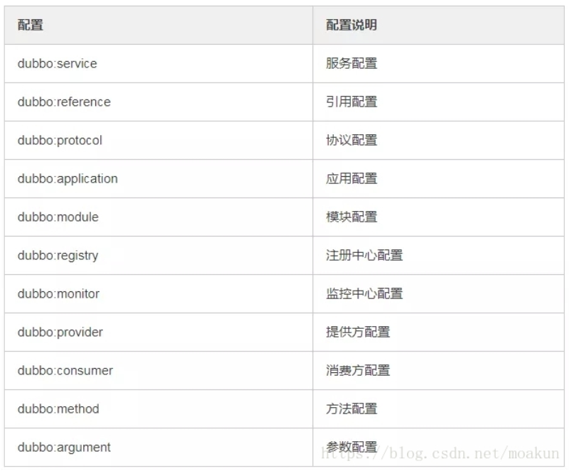
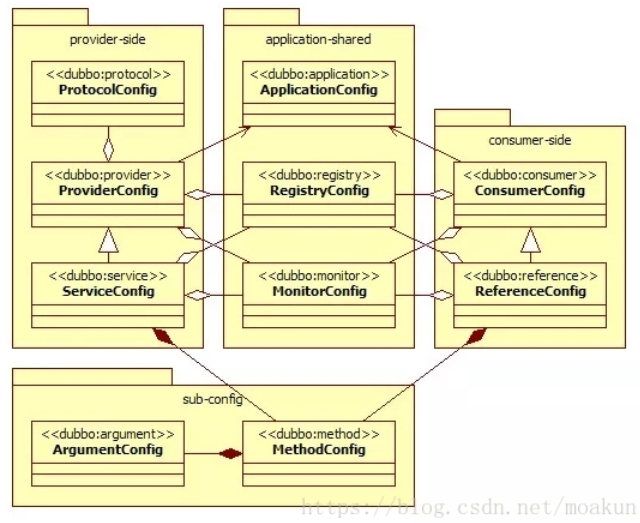
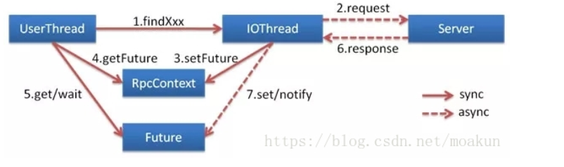
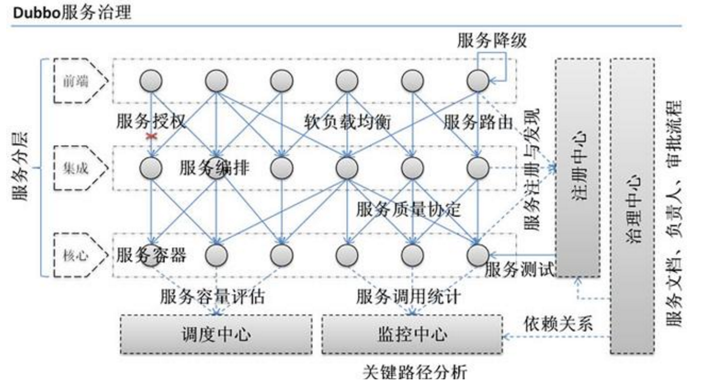
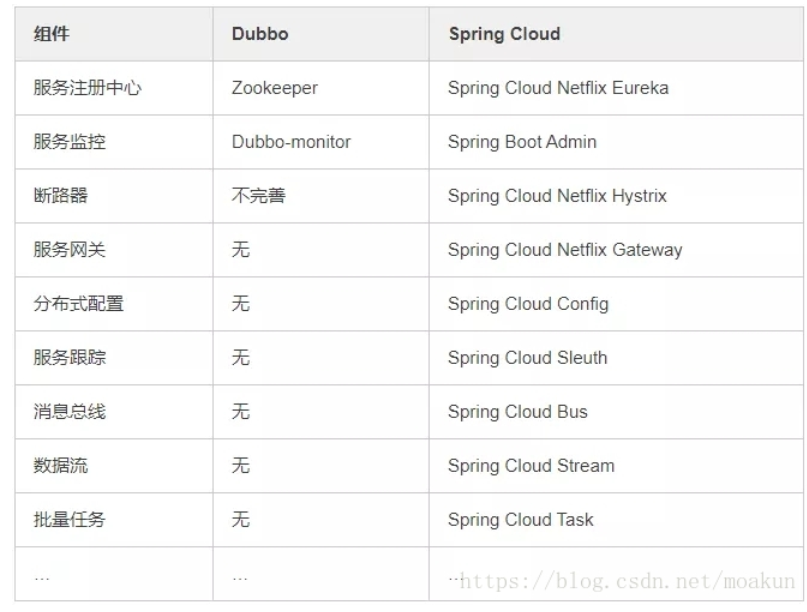

1. 如何实现负载均衡，有哪些算法可以实现。
2. 限流的算法有哪些？如何做限流策略，令牌桶和漏斗算法的使用场景。
3. 如何做到接口的幂等性。
4. 后台系统怎么防止请求重复提交。
5. 为什么要分布式 id ？分布式 id ⽣成策略有哪些？
6. 如何使用redis和zookeeper实现分布式锁？有什么区别优缺点，会有什么问题，分别适用什么场景。（延伸：如果知道redlock，讲讲他的算法实现，争议在哪里）
7. 分布式事务的原理，优缺点，如何使用分布式事务，2pc 3pc 的区别，解决了哪些问题，还有
哪些问题没解决，如何解决，你自己项目里涉及到分布式事务是怎么处理的。
8. 什么是一致性hash。
9. 说说你知道的几种HASH算法，简单的也可以。
10. 什么是paxos算法， 什么是zab协议。
11. 什么是restful，讲讲你理解的restful
12. 解释什么是MESI协议(缓存一致性)。
13. 什么叫数据一致性，你怎么理解数据一致性。

1. Zookeeper的用途，选举的原理是什么。
2. Zookeeper watch机制原理。

1. 了解RPC吗？有哪些常⻅的 RPC 框架？
2. 一次RPC请求的流程是什么。
3. 自己实现过rpc么，原理可以简单讲讲。Rpc要解决什么问题。
4. 如果让你⾃⼰设计 RPC 框架你会如何设计？

2.说说你平时用到的设计模式。
3.编程中自己都怎么考虑一些设计原则的，比如开闭原则，以及在工作中的应用。

1. 聊下曾经参与设计的服务器架构并画图，谈谈遇到的问题，怎么解决的。
2. 应用服务器怎么监控性能，各种方式的区别。
3. 设计一个秒杀系统，30分钟没付款就自动关闭交易。
4. 如何设计一套高并发支付方案，架构如何设计。
5. 设计一个社交网站中的“私信”功能，要求高并发、可扩展等等。 画一下架构图。
6. 如何设计一个良好的API。
7. 如何设计建立和保持100w的长连接。
8. 请思考一个方案，实现分布式环境下的countDownLatch。
9. 一个在线文档系统，文档可以被编辑，如何防止多人同时对同一份文档进行编辑更新。
10. 线上系统突然变得异常缓慢，你如何查找问题。
11. 如果有人恶意创建非法连接，怎么解决。

# dubbo面试题

待补充

https://mp.weixin.qq.com/s/uI5l5EMeiIxeZWBzma9Nhg

## 什么是dubbo？
Dubbo 是一个分布式、高性能、透明化的 RPC 服务框架，提供服务自动注册、自动发现等高效服务治理方案， 可以和 Spring 框架无缝集成。
RPC 指的是远程调用协议，也就是说两个服务器交互数据。

## Dubbo的主要应用场景？
透明化的远程方法调用，就像调用本地方法一样调用远程方法，只需简单配置，没有任何API侵入。
软负载均衡及容错机制，可在内网替代F5等硬件负载均衡器，降低成本，减少单点。
服务自动注册与发现，不再需要写死服务提供方地址，注册中心基于接口名查询服务提供者的IP地址，并且能够平滑添加或删除服务提供者。

## Dubbo的核心功能？
主要就是如下3个核心功能：
- Remoting：网络通信框架，提供对多种NIO框架抽象封装，包括“同步转异步”和“请求-响应”模式的信息交换方式。
- Cluster：服务框架，提供基于接口方法的透明远程过程调用，包括多协议支持，以及软负载均衡，失败容错，地址路由，动态配置等集群支持。
- Registry：服务注册，基于注册中心目录服务，使服务消费方能动态的查找服务提供方，使地址透明，使服务提供方可以平滑增加或减少机器。

## Dubbo的架构设计？

Dubbo框架设计一共划分了10个层：
- 服务接口层（Service）：该层是与实际业务逻辑相关的，根据服务提供方和服务消费方的业务设计对应的接口和实现。
- 配置层（Config）：对外配置接口，以ServiceConfig和ReferenceConfig为中心。
- 服务代理层（Proxy）：服务接口透明代理，生成服务的客户端Stub和服务器端Skeleton。
- 服务注册层（Registry）：封装服务地址的注册与发现，以服务URL为中心。
- 集群层（Cluster）：封装多个提供者的路由及负载均衡，并桥接注册中心，以Invoker为中心。
- 监控层（Monitor）：RPC调用次数和调用时间监控。
- 远程调用层（Protocol）：封将RPC调用，以Invocation和Result为中心，扩展接口为Protocol、Invoker和Exporter。
- 信息交换层（Exchange）：封装请求响应模式，同步转异步，以Request和Response为中心。
- 网络传输层（Transport）：抽象mina和netty为统一接口，以Message为中心。

## Dubbo的服务调用流程？

## Dubbo的核心组件？Dubbo服务注册与发现的流程？描述一个服务从发布到被消费的详细过程。

**流程说明：**
- Provider(提供者)绑定指定端口并启动服务
- Provider连接注册中心，并发本机IP、端口、应用信息和提供服务信息发送至注册中心存储
- Consumer(消费者），连接注册中心 ，并发送应用信息、所求服务信息至注册中心
- 注册中心根据 消费 者所求服务信息匹配对应的提供者列表发送至Consumer 应用缓存。
- Consumer 在发起远程调用时基于缓存的消费者列表择其一发起调用。
- Provider 状态变更会实时通知注册中心、
**设计的原因：**
- Consumer 与Provider 解偶，双方都可以横向增减节点数。
- 注册中心对本身可做对等集群，可动态增减节点，并且任意一台宕掉后，将自动切换到另一台
- 去中心化，双方不直接依懒注册中心，即使注册中心全部宕机短时间内也不会影响服务的调用
- 服务提供者无状态，任意一台宕掉后，不影响使用

## Dubbo有哪几种配置方式？Dubbo 核心的配置有哪些？
1）Spring 配置方式       2）Java API 配置方式
核心配置：

配置之间的关系：

**在 Provider 上可以配置的 Consumer 端的属性有哪些？**
1）timeout：方法调用超时
2）retries：失败重试次数，默认重试 2 次
3）loadbalance：负载均衡算法，默认随机
4）actives 消费者端，最大并发调用限制

## Dubbo SPI与JDK SPI区别？

## Dubbo的管理控制台能做什么？
管理控制台主要包含：路由规则，动态配置，服务降级(2.2.0 以上版本)，访问控制，权重调整，负载均衡，等管理功能。

## Dubbo启动时如果依赖的服务不可用会怎样？
Dubbo 缺省会在启动时检查依赖的服务是否可用，不可用时会抛出异常，阻止 Spring 初始化完成，默认 check="true"，可以通过 check="false" 关闭检查。

## Dubbo如何优雅停机？
Dubbo 是通过 JDK 的 ShutdownHook 来完成优雅停机的，所以如果使用 kill -9 PID 等强制关闭指令，是不会执行优雅停机的，只有通过 kill PID 时，才会执行。

## 服务提供者能实现失效踢出是什么原理？
服务失效踢出基于 Zookeeper 的临时节点原理。

## 如何解决服务调用链过长的问题？
Dubbo 可以使用 Pinpoint 和 Apache Skywalking(Incubator) 实现分布式服务追踪，当然还有其他很多方案。

## Dubbo服务之间的调用是阻塞的吗？
默认是同步等待结果阻塞的，支持异步调用。
Dubbo 是基于 NIO 的非阻塞实现并行调用，客户端不需要启动多线程即可完成并行调用多个远程服务，相对多线程开销较小，异步调用会返回一个 Future 对象。
异步调用流程图如下：

## 说说 Dubbo 服务暴露的过程。
Dubbo 会在 Spring 实例化完 bean 之后，在刷新容器最后一步发布 ContextRefreshEvent 事件的时候，通知实现了 ApplicationListener 的 ServiceBean 类进行回调 onApplicationEvent 事件方法，Dubbo 会在这个方法中调用 ServiceBean 父类 ServiceConfig 的 export 方法，而该方法真正实现了服务的（异步或者非异步）发布。

## Dubbo有些哪些注册中心？如果注册中心集群挂掉，发布者和订阅者之间还能通信么？
- Multicast注册中心： Multicast注册中心不需要任何中心节点，只要广播地址，就能进行服务注册和发现。基于网络中组播传输实现；
- Zookeeper注册中心： 基于分布式协调系统Zookeeper实现，采用Zookeeper的watch机制实现数据变更；（推荐）
- redis注册中心： 基于redis实现，采用key/Map存储，住key存储服务名和类型，Map中key存储服务URL，value服务过期时间。基于redis的发布/订阅模式通知数据变更；
- Simple注册中心
**如果注册中心集群挂掉，发布者和订阅者之间还能通信么？**
可以的，启动dubbo时，消费者会从zookeeper拉取注册的生产者的地址接口等数据，缓存在本地。每次调用时，按照本地存储的地址进行调用。

## Dubbo使用的是什么通信框架?
默认使用NIO Netty框架

## Dubbo支持哪些协议，每种协议的应用场景，优缺点？
Dubbo 允许配置多协议，在不同服务上支持不同协议或者同一服务上同时支持多种协议。
- dubbo： 单一长连接和NIO异步通讯，适合大并发小数据量的服务调用，以及消费者远大于提供者。传输协议TCP，异步，Hessian序列化；
- rmi： 采用JDK标准的rmi协议实现，传输参数和返回参数对象需要实现Serializable接口，使用java标准序列化机制，使用阻塞式短连接，传输数据包大小混合，消费者和提供者个数差不多，可传文件，传输协议TCP。
多个短连接，TCP协议传输，同步传输，适用常规的远程服务调用和rmi互操作。在依赖低版本的Common-Collections包，java序列化存在安全漏洞；
- webservice： 基于WebService的远程调用协议，集成CXF实现，提供和原生WebService的互操作。多个短连接，基于HTTP传输，同步传输，适用系统集成和跨语言调用；
- http： 基于Http表单提交的远程调用协议，使用Spring的HttpInvoke实现。多个短连接，传输协议HTTP，传入参数大小混合，提供者个数多于消费者，需要给应用程序和浏览器JS调用；
- hessian： 集成Hessian服务，基于HTTP通讯，采用Servlet暴露服务，Dubbo内嵌Jetty作为服务器时默认实现，提供与Hession服务互操作。多个短连接，同步HTTP传输，Hessian序列化，传入参数较大，提供者大于消费者，提供者压力较大，可传文件；
- memcache： 基于memcached实现的RPC协议
- redis： 基于redis实现的RPC协议

## Dubbo内置了哪几种服务容器？Dubbo需要 Web 容器吗？
Spring Container、Jetty Container、Log4j Container
Dubbo 的服务容器只是一个简单的 Main 方法，并加载一个简单的 Spring 容器，用于暴露服务。

Dubbo不需要Web容器，如果硬要用 Web 容器，只会增加复杂性，也浪费资源。

## 当一个服务接口有多种实现时怎么做？
当一个接口有多种实现时，可以用 group 属性来分组，服务提供方和消费方都指定同一个 group 即可。

## 注册了多个同一样的服务，如果测试指定的某一个服务呢？
可以配置环境点对点直连，绕过注册中心，将以服务接口为单位，忽略注册中心的提供者列表。

## 服务上线怎么兼容旧版本？
可以用版本号（version）过渡，多个不同版本的服务注册到注册中心，版本号不同的服务相互间不引用。这个和服务分组的概念有一点类似。

## Dubbo可以对结果进行缓存吗？
可以，Dubbo 提供了声明式缓存，用于加速热门数据的访问速度，以减少用户加缓存的工作量。

## Dubbo集群提供了哪些负载均衡策略？
- Random LoadBalance: 随机选取提供者策略，有利于动态调整提供者权重。截面碰撞率高，调用次数越多，分布越均匀；
- RoundRobin LoadBalance: 轮循选取提供者策略，平均分布，但是存在请求累积的问题；
- LeastActive LoadBalance: 最少活跃调用策略，解决慢提供者接收更少的请求；
- ConstantHash LoadBalance: 一致性Hash策略，使相同参数请求总是发到同一提供者，一台机器宕机，可以基于虚拟节点，分摊至其他提供者，避免引起提供者的剧烈变动；
缺省时为Random随机调用

## Dubbo的集群容错方案有哪些？服务读写推荐的容错策略是怎样的？
- Failover Cluster
失败自动切换，当出现失败，重试其它服务器。通常用于读操作，但重试会带来更长延迟。(默认)
- Failfast Cluster
快速失败，只发起一次调用，失败立即报错。通常用于非幂等性的写操作，比如新增记录。
- Failsafe Cluster
失败安全，出现异常时，直接忽略。通常用于写入审计日志等操作。
- Failback Cluster
失败自动恢复，后台记录失败请求，定时重发。通常用于消息通知操作。
- Forking Cluster
并行调用多个服务器，只要一个成功即返回。通常用于实时性要求较高的读操作，但需要浪费更多服务资源。可通过 forks=”2″ 来设置最大并行数。
- Broadcast Cluster
广播调用所有提供者，逐个调用，任意一台报错则报错 。通常用于通知所有提供者更新缓存或日志等本地资源信息。

**服务读写推荐的容错策略是怎样的？**
读操作建议使用 Failover 失败自动切换，默认重试两次其他服务器。
写操作建议使用 Failfast 快速失败，发一次调用失败就立即报错。

## Dubbo支持哪些序列化方式？
默认使用Hessian序列化，还有Duddo、FastJson、Java自带序列化。

## Dubbo超时时间怎样设置？
Dubbo超时时间设置有两种方式：
- 服务提供者端设置超时时间，在Dubbo的用户文档中，推荐如果能在服务端多配置就尽量多配置，因为服务提供者比消费者更清楚自己提供的服务特性。
- 服务消费者端设置超时时间，如果在消费者端设置了超时时间，以消费者端为主，即优先级更高。因为服务调用方设置超时时间控制性更灵活。如果消费方超时，服务端线程不会定制，会产生警告。

## 服务调用超时问题怎么解决？如果做到优雅的控制，JDK自带的超时机制有哪些，怎么实现的。
dubbo在调用服务不成功时，默认是会重试两次的。

## Dubbo的泛化调用怎么实现的，如果是你，你会怎么做。

## Dubbo在安全机制方面是如何解决？
Dubbo通过Token令牌防止用户绕过注册中心直连，然后在注册中心上管理授权。Dubbo还提供服务黑白名单，来控制服务所允许的调用方。

## Dubbo服务治理？讲讲你理解的服务治理。

- 过多的服务URL配置困难
- 负载均衡分配节点压力过大的情况下也需要部署集群
- 服务依赖混乱，启动顺序不清晰
- 过多服务导致性能指标分析难度较大，需要监控

## 分布式服务调用方，不依赖服务提供方的话，怎么处理服务方挂掉后，大量无效资源请求的浪费，如果只是服务提供方吞吐不高的时候该怎么做，如果服务挂了，那么一会重启，该怎么做到最小的资源浪费，流量半开的实现机制是什么。

## dubbo 和 dubbox 之间的区别？

dubbox 基于 dubbo 上做了一些扩展，如加了服务可 restful 调用，更新了开源组件等。

## Dubbo与Spring的关系？
Dubbo采用全Spring配置方式，透明化接入应用，对应用没有任何API侵入，只需用Spring加载Dubbo的配置即可，Dubbo基于Spring的Schema扩展进行加载。

## 在使用过程中都遇到了些什么问题？
Dubbo 的设计目的是为了满足高并发小数据量的 rpc 调用，在大数据量下的性能表现并不好，建议使用 rmi 或 http 协议。坑、bug、怎么解决的、优化
- 1) 同时配置了 XML 和 properties 文件，则 properties 中的配置无效
只有 XML 没有配置时，properties 才生效。
- 2) dubbo 缺省会在启动时检查依赖是否可用，不可用就抛出异常，阻止 spring 初始化完成，check 属性默认为 true。测试时有些服务不关心或者出现了循环依赖，将 check 设置为 false
- 3) 为了方便开发测试，线下有一个所有服务可用的注册中心，这时，如果有一个正在开发中的服务提供者注册，可能会影响消费者不能正常运行。解决：让服务提供者开发方，只订阅服务，而不注册正在开发的服务，通过直连测试正在开发的服务。设置 dubbo:registry 标签的 register 属性为 false。
- 4) spring 2.x 初始化死锁问题。
在 spring 解析到 dubbo:service 时，就已经向外暴露了服务，而 spring 还在接着初始化其他 bean，如果这时有请求进来，并且服务的实现类里有调用 applicationContext.getBean() 的用法。getBean 线程和 spring 初始化线程的锁的顺序不一样，导致了线程死锁，不能提供服务，启动不了。解决：不要在服务的实现类中使用 applicationContext.getBean(); 如果不想依赖配置顺序，可以将 dubbo:provider 的 deplay 属性设置为 - 1，使 dubbo 在容器初始化完成后再暴露服务。
- 5) 服务注册不上
检查 dubbo 的 jar 包有没有在 classpath 中，以及有没有重复的 jar 包
检查暴露服务的 spring 配置有没有加载
在服务提供者机器上测试与注册中心的网络是否通
- 6) 出现 RpcException: No provider available for remote service 异常
表示没有可用的服务提供者，
a. 检查连接的注册中心是否正确
b. 到注册中心查看相应的服务提供者是否存在
c. 检查服务提供者是否正常运行
- 7) 出现” 消息发送失败” 异常
通常是接口方法的传入传出参数未实现 Serializable 接口。

## 你读过 Dubbo 的源码吗？
要了解 Dubbo 就必须看其源码，了解其原理，花点时间看下吧，网上也有很多教程，后续有时间我也会在公众号上分享 Dubbo 的源码。Dubbo的原理，有看过源码么，数据怎么流转的，怎么实现集群，负载均衡，服务注册
和发现，重试转发，快速失败的策略是怎样的 。

## 除了Dubbo还有哪些分布式框架？
大家熟知的就是Spring cloud，当然国外也有类似的多个框架。

## dubbo与springcloud比较
Dubbo是 SOA 时代的产物，它的关注点主要在于服务的调用，流量分发、流量监控和熔断。而 Spring Cloud诞生于微服务架构时代，考虑的是微服务治理的方方面面，另外由于依托了 Spirng、Spirng Boot的优势之上，两个框架在开始目标就不一致，Dubbo 定位服务治理、Spirng Cloud 是一个生态。
最大的区别：Dubbo底层是使用Netty这样的NIO框架，是基于TCP协议传输的，配合以Hession序列化完成RPC通信。而SpringCloud是基于Http协议+Rest接口调用远程过程的通信，相对来说，Http请求会有更大的报文，占的带宽也会更多。但是REST相比RPC更为灵活，服务提供方和调用方的依赖只依靠一纸契约，不存在代码级别的强依赖，这在强调快速演化的微服务环境下，显得更为合适，至于注重通信速度还是方便灵活性，具体情况具体考虑。

# springcloud面试题

注册中心

hystrix

feign

链路追踪