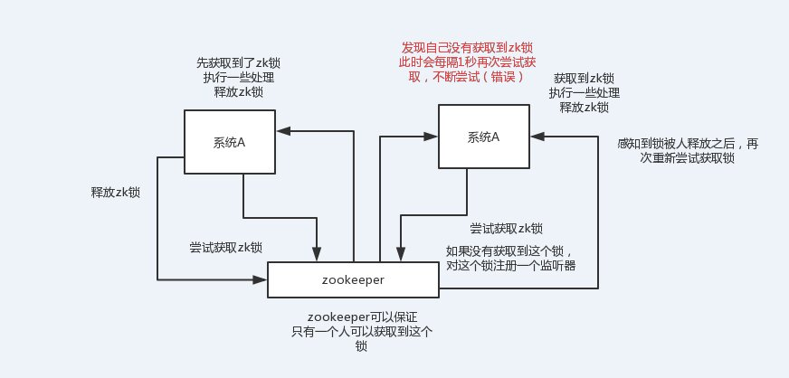

1. 如何实现负载均衡，有哪些算法可以实现。
2. 限流的算法有哪些？如何做限流策略，令牌桶和漏斗算法的使用场景。
5. 为什么要分布式 id ？分布式 id ⽣成策略有哪些？
6. 如何使用redis和zookeeper实现分布式锁？有什么区别优缺点，会有什么问题，分别适用什么场景。（延伸：如果知道redlock，讲讲他的算法实现，争议在哪里）
7. 分布式事务的原理，优缺点，如何使用分布式事务，2pc 3pc 的区别，解决了哪些问题，还有
哪些问题没解决，如何解决，你自己项目里涉及到分布式事务是怎么处理的。
8. 什么是一致性hash。说说你知道的几种HASH算法，简单的也可以。
10. 什么是paxos算法， 什么是zab协议。
11. 什么是restful，讲讲你理解的restful
12. 解释什么是MESI协议(缓存一致性)。
12. 什么叫数据一致性，你怎么理解数据一致性。
15. 为什么不直接使用http调用而使用RPC？
16. 了解RPC吗？有哪些常⻅的 RPC 框架？
17. 一次RPC请求的流程是什么。
18. 自己实现过rpc么，原理可以简单讲讲。Rpc要解决什么问题。
19. 如果让你⾃⼰设计 RPC 框架你会如何设计？

2.说说你平时用到的设计模式。

3.编程中自己都怎么考虑一些设计原则的，比如开闭原则，以及在工作中的应用。

1. 聊下曾经参与设计的服务器架构并画图，谈谈遇到的问题，怎么解决的。
2. 应用服务器怎么监控性能，各种方式的区别。
3. 设计一个秒杀系统，30分钟没付款就自动关闭交易。
4. 如何设计一套高并发支付方案，架构如何设计。
5. 设计一个社交网站中的“私信”功能，要求高并发、可扩展等等。 画一下架构图。
6. 如何设计一个良好的API。
7. 如何设计建立和保持100w的长连接。
8. 请思考一个方案，实现分布式环境下的countDownLatch。
9. 一个在线文档系统，文档可以被编辑，如何防止多人同时对同一份文档进行编辑更新。
10. 线上系统突然变得异常缓慢，你如何查找问题。
11. 如果有人恶意创建非法连接，怎么解决。


面试官心里分析

MQ、ES、Redis、Dubbo，上来先问你一些思考的问题，原理（kafka高可用架构原理、es分布式架构原理、redis线程模型原理、Dubbo工作原理），生产环境里可能会碰到的一些问题（每种技术引入之后生产环境都可能会碰到一些问题），系统设计（设计MQ，设计搜索引擎，设计一个缓存，设计rpc框架） 

当然比如说，hard面试官，死扣，结合项目死扣细节，百度（深入底层，基础性），阿里（结合项目死扣细节，扣很深的技术底层），小米（数据结构和算法）。

# 分布式

## 为什么进行系统拆分？如何进行系统拆分？

单体应用-》垂直应用-》SOA-》微服务

1）要是不拆分，一个大系统几十万行代码，20个人维护一份代码，简直是悲剧啊。代码经常改着改着就冲突了，各种代码冲突和合并要处理，非常耗费时间；经常我改动了我的代码，你调用了我，导致你的代码也得重新测试，麻烦的要死；

2）拆分了以后，整个世界清爽了，几十万行代码的系统，拆分成20个服务，平均每个服务就1~2万行代码，每个服务部署到单独的机器上。20个工程，20个git代码仓库里，20个码农，每个人维护自己的那个服务就可以了，是自己独立的代码，跟别人没关系。再也没有代码冲突了，爽。每次就测试我自己的代码就可以了，爽。每次就发布我自己的一个小服务就可以了，爽。技术上想怎么升级就怎么升级，保持接口不变就可以了，爽。

一句话总结，如果是那种代码量多达几十万行的中大型项目，团队里有几十个人，那么如果不拆分系统，开发效率极其低下，问题很多。但是拆分系统之后，每个人就负责自己的一小部分就好了，可以随便玩儿随便弄。分布式系统拆分之后，可以大幅度提升复杂系统大型团队的开发效率。但是同时，也要提醒的一点是，系统拆分成分布式系统之后，大量的分布式系统面临的问题也是接踵而来，所以后面的问题都是在围绕分布式系统带来的复杂技术挑战在说。

如何进行系统拆分？ 拆分原则

这个问题说大可以很大，可以扯到领域驱动模型设计上去，说小了也很小，我不太想给大家太过于学术的说法，因为你也不可能背这个答案，过去了直接说吧。还是说的简单一点，大家自己到时候知道怎么回答就行了。 

系统拆分分布式系统，拆成多个服务，拆成微服务的架构，拆很多轮的。上来一个架构师第一轮就给拆好了，第一轮；团队继续扩大，拆好的某个服务，刚开始是1个人维护1万行代码，后来业务系统越来越复杂，这个服务是10万行代码，5个人；第二轮，1个服务 -> 5个服务，每个服务2万行代码，每人负责一个服务。

我个人建议，一个服务的代码不要太多，1万行左右，两三万撑死了吧 

大部分的系统，是要进行多轮拆分的，第一次拆分，可能就是将以前的多个模块该拆分开来了，比如说将电商系统拆分成订单系统、商品系统、采购系统、仓储系统、用户系统，等等吧。但是后面可能每个系统又变得越来越复杂了，比如说采购系统里面又分成了供应商管理系统、采购单管理系统，订单系统又拆分成了购物车系统、价格系统、订单管理系统。

（3）拆分后不用dubbo可以吗？ 

当然可以了，大不了最次，就是各个系统之间，直接基于spring mvc，就纯http接口互相通信呗，还能咋样。但是这个肯定是有问题的，因为http接口通信维护起来成本很高，你要考虑超时重试、负载均衡等等各种乱七八糟的问题，比如说你的订单系统调用商品系统，商品系统部署了5台机器，你怎么把请求均匀地甩给那5台机器？这不就是负载均衡？你要是都自己搞那是可以的，但是确实很痛苦。所以dubbo说白了，是一种rpc框架，就是本地就是进行接口调用，但是dubbo会代理这个调用请求，跟远程机器网络通信，给你处理掉负载均衡了、服务实例上下线自动感知了、超时重试了，等等乱七八糟的问题。那你就不用自己做了，用dubbo就可以了。

## 分布式系统的幂等性问题
什么是幂等性、为什么需要幂等性、幂等性方案

所谓幂等性，就是说一个接口，多次发起同一个请求，你这个接口得保证结果是准确的，比如不能多扣款，不能多插入一条数据，不能将统计值多加了1。这就是幂等性，不给大家来学术性词语了。

假如你有个服务提供一个接口，结果这服务部署在了5台机器上，接着有个接口就是付款接口。然后人家用户在前端上操作的时候，不知道为啥，总之就是一个订单不小心发起了两次支付请求，然后这俩请求分散在了这个服务部署的不同的机器上，好了，结果一个订单扣款扣两次？尴尬了。。。

其实保证幂等性主要是三点： 

（1）对于每个请求必须有一个唯一的标识，举个例子：订单支付请求，肯定得包含订单id，一个订单id最多支付一次，对吧 

（2）每次处理完请求之后，必须有一个记录标识这个请求处理过了，比如说常见的方案是在mysql中记录个状态啥的，比如支付之前记录一条这个订单的支付流水，而且支付流水采 

（3）每次接收请求需要进行判断之前是否处理过的逻辑处理，比如说，如果有一个订单已经支付了，就已经有了一条支付流水，那么如果重复发送这个请求，则此时先插入支付流水，orderId已经存在了，唯一键约束生效，报错插入不进去的。然后你就不用再扣款了。

​       上面只是给大家举个例子，实际运作过程中，你要结合自己的业务来，比如说用redis用orderId作为唯一键。只有成功插入这个支付流水，才可以执行实际的支付扣款。

## 如何防止重复提交？


## 分布式服务接口请求的顺序性如何保证？
分布式系统接口的调用顺序，也是个问题，一般来说是不用保证顺序的。但是有的时候可能确实是需要严格的顺序保证。给大家举个例子，你服务A调用服务B，先插入再删除。好，结果俩请求过去了，落在不同机器上，可能插入请求因为某些原因执行慢了一些，导致删除请求先执行了，此时因为没数据所以啥效果也没有；结果这个时候插入请求过来了，好，数据插入进去了，那就尴尬了。
本来应该是先插入 -> 再删除，这条数据应该没了，结果现在先删除 -> 再插入，数据还存在，最后你死都想不明白是怎么回事。

所以这都是分布式系统一些很常见的问题

首先，一般来说，我个人给你的建议是，你们从业务逻辑上最好设计的这个系统不需要这种顺序性的保证，因为一旦引入顺序性保障，会导致系统复杂度上升，而且会带来效率低下，热点数据压力过大等问题。下面我给个我们用过的方案吧，简单来说，首先你得**用dubbo的一致性hash负载均衡策略，将比如某一个订单id对应的请求都给分发到某个机器上去，接着就是在那个机器上因为可能还是多线程并发执行的，你可能得立即将某个订单id对应的请求扔一个内存队列里去，强制排队，这样来确保他们的顺序性**。但是这样引发的后续问题就很多，比如说要是某个订单对应的请求特别多，造成某台机器成热点怎么办？解决这些问题又要开启后续一连串的复杂技术方案。。。曾经这类问题弄的我们头疼不已，所以，还是建议什么呢？最好是比如说刚才那种，一个订单的插入和删除操作，能不能合并成一个操作，就是一个删除，或者是什么，避免这种问题的产生。


## 分布式session如何实现？

session是啥？浏览器有个cookie，在一段时间内这个cookie都存在，然后每次发请求过来都带上一个特殊的jsessionid cookie，就根据这个东西，在服务端可以维护一个对应的session域，里面可以放点儿数据。一般只要你没关掉浏览器，cookie还在，那么对应的那个session就在，但是cookie没了，session就没了。常见于什么购物车之类的东西，还有登录状态保存之类的。


分布式session常见常用的是两种：

（1）tomcat + redis

这个其实还挺方便的，就是使用session的代码跟以前一样，还是基于tomcat原生的session支持即可，然后就是用一个叫做Tomcat RedisSessionManager的东西，让所有我们部署的tomcat都将session数据存储到redis即可。

在tomcat的配置文件中，配置一下

```xml
<Valve className="com.orangefunction.tomcat.redissessions.RedisSessionHandlerValve" />

<Manager className="com.orangefunction.tomcat.redissessions.RedisSessionManager"
         host="{redis.host}"
         port="{redis.port}"
         database="{redis.dbnum}"
         maxInactiveInterval="60"/>
<!--sentinel场景 -->
<Valve className="com.orangefunction.tomcat.redissessions.RedisSessionHandlerValve" />
<Manager className="com.orangefunction.tomcat.redissessions.RedisSessionManager"
	 sentinelMaster="mymaster"
	 sentinels="<sentinel1-ip>:26379,<sentinel2-ip>:26379,<sentinel3-ip>:26379"
	 maxInactiveInterval="60"/>
```

（2）spring session + redis 

分布式会话的这个东西重耦合在tomcat中，如果我要将web容器迁移成jetty，难道你重新把jetty都配置一遍吗？

```xml
<!-- 依赖配置 -->
<dependency>
  <groupId>org.springframework.session</groupId>
  <artifactId>spring-session-data-redis</artifactId>
  <version>1.2.1.RELEASE</version>
</dependency>
<dependency>
  <groupId>redis.clients</groupId>
  <artifactId>jedis</artifactId>
  <version>2.8.1</version>
</dependency>
<!--bean配置 -->
<bean id="redisHttpSessionConfiguration"     class="org.springframework.session.data.redis.config.annotation.web.http.RedisHttpSessionConfiguration">
    <property name="maxInactiveIntervalInSeconds" value="600"/>
</bean>

<bean id="jedisPoolConfig" class="redis.clients.jedis.JedisPoolConfig">
    <property name="maxTotal" value="100" />
    <property name="maxIdle" value="10" />
</bean>

<bean id="jedisConnectionFactory"
      class="org.springframework.data.redis.connection.jedis.JedisConnectionFactory" destroy-method="destroy">
    <property name="hostName" value="${redis_hostname}"/>
    <property name="port" value="${redis_port}"/>
    <property name="password" value="${redis_pwd}" />
    <property name="timeout" value="3000"/>
    <property name="usePool" value="true"/>
    <property name="poolConfig" ref="jedisPoolConfig"/>
</bean>

<!--web.xml -->
<filter>
    <filter-name>springSessionRepositoryFilter</filter-name>
    <filter-class>org.springframework.web.filter.DelegatingFilterProxy</filter-class>
</filter>
<filter-mapping>
    <filter-name>springSessionRepositoryFilter</filter-name>
    <url-pattern>/*</url-pattern>
</filter-mapping>
```

```java
// 示例代码
@Controller
@RequestMapping("/test")
public class TestController {
@RequestMapping("/putIntoSession")
@ResponseBody
    public String putIntoSession(HttpServletRequest request, String username){
        request.getSession().setAttribute("name",  “leo”);
        return "ok";
    }

@RequestMapping("/getFromSession")
@ResponseBody
    public String getFromSession(HttpServletRequest request, Model model){
        String name = request.getSession().getAttribute("name");
        return name;
    }
}

```

## zk的使用场景？

（1）分布式协调：这个其实是zk很经典的一个用法，简单来说，就好比，你A系统发送个请求到mq，然后B消息消费之后处理了。那A系统如何知道B系统的处理结果？用zk就可以实现分布式系统之间的协调工作。A系统发送请求之后可以在zk上对某个节点的值注册个监听器，一旦B系统处理完了就修改zk那个节点的值，A立马就可以收到通知，完美解决。


（2）分布式锁：对某一个数据连续发出两个修改操作，两台机器同时收到了请求，但是只能一台机器先执行另外一个机器再执行。那么此时就可以使用zk分布式锁，一个机器接收到了请求之后先获取zk上的一把分布式锁，就是可以去创建一个znode，接着执行操作；然后另外一个机器也尝试去创建那个znode，结果发现自己创建不了，因为被别人创建了。。。。那只能等着，等第一个机器执行完了自己再执行。



（3）元数据/配置信息管理：zk可以用作很多系统的配置信息的管理，比如kafka、storm等等很多分布式系统都会选用zk来做一些元数据、配置信息的管理，包括dubbo注册中心不也支持zk么


（4）HA高可用性：这个应该是很常见的，比如hadoop、hdfs、yarn等很多大数据系统，都选择基于zk来开发HA高可用机制，就是一个重要进程一般会做主备两个，主进程挂了立马通过zk感知到切换到备用进程


## zk的选举原理

## zk的watch机制


## 如果让你⾃⼰设计 RPC 框架你会如何设计？
面试官心里分析：说实话，这问题其实就跟问你，如何自己设计一个MQ，一样道理，就考两个：

1）你有没有对某个rpc框架原理有非常深入的理解

2）你能不能从整体上来思考一下，如何设计一个rpc框架，考考你的系统设计能力

其实一般问到你这问题，你起码不能认怂，我给大家一个建议，遇到这类问题，起码从你了解的类似框架的原理入手，自己说说参照dubbo的原理，你来设计一下，举个例子，dubbo不是有那么多分层么？而且每个分层是干啥的，你大概是不是知道？那就按照这个思路大致说一下吧，起码你不能懵逼，要比那些上来就懵，啥也说不出来的人要好一些

举个例子，我给大家说个最简单的回答思路：

（1）上来你的服务就得去注册中心注册吧，得有个注册中心保留各个服务的信息，可以用zookeeper来做，对吧

（2）然后你的消费者需要去注册中心拿对应的服务信息吧，对吧，而且每个服务可能会存在于多台机器上

（3）接着你就该发起一次请求了，咋发起？蒙圈了是吧。当然是基于动态代理了，你面向接口获取到一个动态代理，这个动态代理就是接口在本地的一个代理，然后这个代理会找到服务对应的机器地址

（4）然后找哪个机器发送请求？那肯定得有个负载均衡算法了，比如最简单的可以随机轮询是不是

（5）接着找到一台机器，就可以跟他发送请求了，第一个问题咋发送？你可以说用netty了，nio方式；第二个问题发送啥格式数据？你可以说用hessian序列化协议了，或者是别的，对吧。然后请求过去了。

（6）服务器那边一样的，需要针对你自己的服务生成一个动态代理，监听某个网络端口了，然后代理你本地的服务代码。接收到请求的时候，就调用对应的服务代码，对吧。

这就是一个最基本的rpc框架的思路，先不说你有多牛逼的技术功底，哪怕这个最简单的思路你先给出来行不行？

## 如何设计一个高可用系统？

用hystrix去实现一整套的高可用保障机制，基于hystrix去做了限流、熔断和降级。

HA，HAProxy，主备服务间的切换，这就做到了高可用性，主备实例，多冗余实例，高可用最最基础的东西

高可用系统架构

资源隔离、限流、熔断、降级、运维监控

资源隔离：让你的系统里，某一块东西，在故障的情况下，不会耗尽系统所有的资源，比如线程资源

限流：高并发流量涌入，比如说突然间一秒钟100万QPS，废掉了，10万QPS进入系统，其他90万QPS被拒绝了

熔断：系统后端的一些依赖，出了一些故障，比如说mysql挂掉了，每次请求都是报错的，熔断了，后续的请求过来直接不接收了，拒绝访问，10分钟之后再尝试去看看mysql恢复没有

降级：mysql挂了，系统发现了，自动降级，从内存里存的少量数据中，去提取一些数据出来

运维监控：监控+报警+优化，各种异常的情况，有问题就及时报警，优化一些系统的配置和参数，或者代码


# dubbo面试题

待补充

https://mp.weixin.qq.com/s/uI5l5EMeiIxeZWBzma9Nhg

（1）dubbo工作原理：服务注册，注册中心，消费者，代理通信，负载均衡

（2）网络通信、序列化：dubbo协议，长连接，NIO，hessian序列化协议

（3）负载均衡策略，集群容错策略，动态代理策略：dubbo跑起来的时候一些功能是如何运转的，怎么做负载均衡？怎么做集群容错？怎么生成动态代理？

（4）dubbo SPI机制：你了解不了解dubbo的SPI机制？如何基于SPI机制对dubbo进行扩展？

（5）dubbo的服务治理、降级、重试

## 什么是dubbo？
Dubbo 是一个分布式、高性能、透明化的 RPC 服务框架，提供服务自动注册、自动发现等高效服务治理方案， 可以和 Spring 框架无缝集成。
RPC 指的是远程调用协议，也就是说两个服务器交互数据。

## Dubbo的主要应用场景？
透明化的远程方法调用，就像调用本地方法一样调用远程方法，只需简单配置，没有任何API侵入。
软负载均衡及容错机制，可在内网替代F5等硬件负载均衡器，降低成本，减少单点。
服务自动注册与发现，不再需要写死服务提供方地址，注册中心基于接口名查询服务提供者的IP地址，并且能够平滑添加或删除服务提供者。

## Dubbo的核心功能？
主要就是如下3个核心功能：
- Remoting：网络通信框架，提供对多种NIO框架抽象封装，包括“同步转异步”和“请求-响应”模式的信息交换方式。
- Cluster：服务框架，提供基于接口方法的透明远程过程调用，包括多协议支持，以及软负载均衡，失败容错，地址路由，动态配置等集群支持。
- Registry：服务注册，基于注册中心目录服务，使服务消费方能动态的查找服务提供方，使地址透明，使服务提供方可以平滑增加或减少机器。

## Dubbo的架构设计？工作原理？

Dubbo框架设计一共划分了10个层：

- 服务接口层（Service）：该层是与实际业务逻辑相关的，根据服务提供方和服务消费方的业务设计对应的接口和实现。

- 配置层（Config）：对外配置接口，以ServiceConfig和ReferenceConfig为中心。

- 服务代理层（Proxy）：服务接口透明代理，生成服务的客户端Stub和服务器端Skeleton。

- 服务注册层（Registry）：封装服务地址的注册与发现，以服务URL为中心。

- 集群层（Cluster）：封装多个提供者的路由及负载均衡，并桥接注册中心，以Invoker为中心。

- 监控层（Monitor）：RPC调用次数和调用时间监控。

- 远程调用层（Protocol）：封将RPC调用，以Invocation和Result为中心，扩展接口为Protocol、Invoker和Exporter。

- 信息交换层（Exchange）：封装请求响应模式，同步转异步，以Request和Response为中心。

- 网络传输层（Transport）：抽象mina和netty为统一接口，以Message为中心。

- serialize层，数据序列化层

工作流程：

1）第一步，provider向注册中心去注册

2）第二步，consumer从注册中心订阅服务，注册中心会通知consumer注册好的服务

3）第三步，consumer调用provider

4）第四步，consumer和provider都异步的通知监控中心


## Dubbo的服务调用流程？


## Dubbo的核心组件？Dubbo服务注册与发现的流程？描述一个服务从发布到被消费的详细过程。

**流程说明：**

- Provider(提供者)绑定指定端口并启动服务
- Provider连接注册中心，并发本机IP、端口、应用信息和提供服务信息发送至注册中心存储
- Consumer(消费者），连接注册中心 ，并发送应用信息、所求服务信息至注册中心
- 注册中心根据消费者所求服务信息匹配对应的提供者列表发送至Consumer 应用缓存。
- Consumer 在发起远程调用时基于缓存的消费者列表择其一发起调用。
- Provider 状态变更会实时通知注册中心、
**设计的原因：**
- Consumer 与Provider 解偶，双方都可以横向增减节点数。
- 注册中心对本身可做对等集群，可动态增减节点，并且任意一台宕掉后，将自动切换到另一台
- 去中心化，双方不直接依懒注册中心，即使注册中心全部宕机短时间内也不会影响服务的调用
- 服务提供者无状态，任意一台宕掉后，不影响使用


## Dubbo有哪几种配置方式？Dubbo 核心的配置有哪些？
1）Spring 配置方式       2）Java API 配置方式
核心配置：

配置之间的关系：

**在 Provider 上可以配置的 Consumer 端的属性有哪些？**
1）timeout：方法调用超时
2）retries：失败重试次数，默认重试 2 次
3）loadbalance：负载均衡算法，默认随机
4）actives 消费者端，最大并发调用限制

## Dubbo SPI与JDK SPI区别？

## Dubbo的管理控制台能做什么？
管理控制台主要包含：路由规则，动态配置，服务降级(2.2.0 以上版本)，访问控制，权重调整，负载均衡，等管理功能。

## Dubbo启动时如果依赖的服务不可用会怎样？
Dubbo 缺省会在启动时检查依赖的服务是否可用，不可用时会抛出异常，阻止 Spring 初始化完成，默认 check="true"，可以通过 check="false" 关闭检查。

## Dubbo如何优雅停机？
Dubbo 是通过 JDK 的 ShutdownHook 来完成优雅停机的，所以如果使用 kill -9 PID 等强制关闭指令，是不会执行优雅停机的，只有通过 kill PID 时，才会执行。

## 服务提供者能实现失效踢出是什么原理？
服务失效踢出基于 Zookeeper 的临时节点原理。

## 如何解决服务调用链过长的问题？
Dubbo 可以使用 Pinpoint 和 Apache Skywalking(Incubator) 实现分布式服务追踪，当然还有其他很多方案。

## Dubbo服务之间的调用是阻塞的吗？
默认是同步等待结果阻塞的，支持异步调用。
Dubbo 是基于 NIO 的非阻塞实现并行调用，客户端不需要启动多线程即可完成并行调用多个远程服务，相对多线程开销较小，异步调用会返回一个 Future 对象。
异步调用流程图如下：


## 说说 Dubbo 服务暴露的过程。
Dubbo 会在 Spring 实例化完 bean 之后，在刷新容器最后一步发布 ContextRefreshEvent 事件的时候，通知实现了 ApplicationListener 的 ServiceBean 类进行回调 onApplicationEvent 事件方法，Dubbo 会在这个方法中调用 ServiceBean 父类 ServiceConfig 的 export 方法，而该方法真正实现了服务的（异步或者非异步）发布。

## Dubbo有些哪些注册中心？如果注册中心集群挂掉，发布者和订阅者之间还能通信么？
- Multicast注册中心： Multicast注册中心不需要任何中心节点，只要广播地址，就能进行服务注册和发现。基于网络中组播传输实现；
- Zookeeper注册中心： 基于分布式协调系统Zookeeper实现，采用Zookeeper的watch机制实现数据变更；（推荐）
- redis注册中心： 基于redis实现，采用key/Map存储，住key存储服务名和类型，Map中key存储服务URL，value服务过期时间。基于redis的发布/订阅模式通知数据变更；
- Simple注册中心
**如果注册中心集群挂掉，发布者和订阅者之间还能通信么？**
可以的，启动dubbo时，消费者会从zookeeper拉取注册的生产者的地址接口等数据，缓存在本地。每次调用时，按照本地存储的地址进行调用。

## Dubbo使用的是什么通信框架?
默认使用NIO Netty框架

## Dubbo支持哪些协议，每种协议的应用场景，优缺点？
Dubbo 允许配置多协议，在不同服务上支持不同协议或者同一服务上同时支持多种协议。
- dubbo： 单一长连接和NIO异步通讯，适合大并发小数据量的服务调用，以及消费者远大于提供者。传输协议TCP，异步，Hessian序列化；如果上亿次请求每次都是短连接的话，服务提供者会扛不住，而且因为走的是单一长连接，所以传输数据量太大的话，会导致并发能力降低。所以一般建议是传输数据量很小，支撑高并发访问。长连接NIO处理多请求而不是每个请求一个短链接
- rmi： 采用JDK标准的rmi协议实现，传输参数和返回参数对象需要实现Serializable接口，使用java标准序列化机制，使用阻塞式短连接，传输数据包大小混合，消费者和提供者个数差不多，可传文件，传输协议TCP。
  多个短连接，TCP协议传输，同步传输，适用常规的远程服务调用和rmi互操作。在依赖低版本的Common-Collections包，java序列化存在安全漏洞；
- webservice： 基于WebService的远程调用协议，集成CXF实现，提供和原生WebService的互操作。多个短连接，基于HTTP传输，同步传输，适用系统集成和跨语言调用；
- http： 基于Http表单提交的远程调用协议，使用Spring的HttpInvoke实现。多个短连接，传输协议HTTP，传入参数大小混合，提供者个数多于消费者，需要给应用程序和浏览器JS调用；
- hessian： 集成Hessian服务，基于HTTP通讯，采用Servlet暴露服务，Dubbo内嵌Jetty作为服务器时默认实现，提供与Hession服务互操作。多个短连接，同步HTTP传输，Hessian序列化，传入参数较大，提供者大于消费者，提供者压力较大，可传文件；
- memcache： 基于memcached实现的RPC协议
- redis： 基于redis实现的RPC协议

## Dubbo内置了哪几种服务容器？Dubbo需要 Web 容器吗？
Spring Container、Jetty Container、Log4j Container
Dubbo 的服务容器只是一个简单的 Main 方法，并加载一个简单的 Spring 容器，用于暴露服务。

Dubbo不需要Web容器，如果硬要用 Web 容器，只会增加复杂性，也浪费资源。

## 当一个服务接口有多种实现时怎么做？
当一个接口有多种实现时，可以用 group 属性来分组，服务提供方和消费方都指定同一个 group 即可。

## 注册了多个同一样的服务，如果测试指定的某一个服务呢？
可以配置环境点对点直连，绕过注册中心，将以服务接口为单位，忽略注册中心的提供者列表。

## 服务上线怎么兼容旧版本？
可以用版本号（version）过渡，多个不同版本的服务注册到注册中心，版本号不同的服务相互间不引用。这个和服务分组的概念有一点类似。

## dubbo动态代理策略

默认使用javassist动态字节码生成，创建代理类，但可以通过spi扩展机制配置自己的动态代理策略

## Dubbo可以对结果进行缓存吗？
可以，Dubbo 提供了声明式缓存，用于加速热门数据的访问速度，以减少用户加缓存的工作量。

## Dubbo集群提供了哪些负载均衡策略？
- Random LoadBalance: 随机选取提供者策略，有利于动态调整提供者权重。截面碰撞率高，调用次数越多，分布越均匀；缺省时为Random随机调用
- RoundRobin LoadBalance: 轮循选取提供者策略，平均分布，但是存在请求累积的问题；
- LeastActive LoadBalance: 最少活跃调用策略，解决慢提供者接收更少的请求；
- ConstantHash LoadBalance: 一致性Hash策略，使相同参数请求总是发到同一提供者，一台机器宕机，可以基于虚拟节点，分摊至其他提供者，避免引起提供者的剧烈变动；


## Dubbo的集群容错方案有哪些？服务读写推荐的容错策略是怎样的？
- Failover Cluster
失败自动切换，当出现失败，重试其它服务器。通常用于读操作，但重试会带来更长延迟。(默认)
- Failfast Cluster
快速失败，只发起一次调用，失败立即报错。通常用于非幂等性的写操作，比如新增记录。
- Failsafe Cluster
失败安全，出现异常时，直接忽略。通常用于写入审计日志等操作。
- Failback Cluster
失败自动恢复，后台记录失败请求，定时重发。通常用于消息通知操作。
- Forking Cluster
并行调用多个服务器，只要一个成功即返回。通常用于实时性要求较高的读操作，但需要浪费更多服务资源。可通过 forks=”2″ 来设置最大并行数。
- Broadcast Cluster
广播调用所有提供者，逐个调用，任意一台报错则报错 。通常用于通知所有提供者更新缓存或日志等本地资源信息。

**服务读写推荐的容错策略是怎样的？**
读操作建议使用 Failover 失败自动切换，默认重试两次其他服务器。
写操作建议使用 Failfast 快速失败，发一次调用失败就立即报错。

## Dubbo支持哪些序列化方式？
默认使用Hessian序列化，还有Duddo、FastJson、Java自带序列化。

## Dubbo超时时间怎样设置？
Dubbo超时时间设置有两种方式：
- 服务提供者端设置超时时间，在Dubbo的用户文档中，推荐如果能在服务端多配置就尽量多配置，因为服务提供者比消费者更清楚自己提供的服务特性。
- 服务消费者端设置超时时间，如果在消费者端设置了超时时间，以消费者端为主，即优先级更高。因为服务调用方设置超时时间控制性更灵活。如果消费方超时，服务端线程不会定制，会产生警告。

## 服务调用超时问题怎么解决？如果做到优雅的控制，JDK自带的超时机制有哪些，怎么实现的。
dubbo在调用服务不成功时，默认是会重试两次的。

## Dubbo的泛化调用怎么实现的，如果是你，你会怎么做。


## Dubbo在安全机制方面是如何解决？
Dubbo通过Token令牌防止用户绕过注册中心直连，然后在注册中心上管理授权。Dubbo还提供服务黑白名单，来控制服务所允许的调用方。

## Dubbo服务治理？讲讲你理解的服务治理。

- 过多的服务URL配置困难

- 负载均衡分配节点压力过大的情况下也需要部署集群

- 服务依赖混乱，启动顺序不清晰

- 过多服务导致性能指标分析难度较大，需要监控

服务治理，这个问题如果问你，其实就是看看你有没有服务治理的思想，因为这个是做过复杂微服务的人肯定会遇到的一个问题。

服务降级，这个是涉及到复杂分布式系统中必备的一个话题，因为分布式系统互相来回调用，任何一个系统故障了，你不降级，直接就全盘崩溃？那就太坑爹了吧

失败重试，分布式系统中网络请求如此频繁，要是因为网络问题不小心失败了一次，是不是要重试？

超时重试，同上，如果不小心网络慢一点，超时了，如何重试？

1、服务治理

  1）调用链路自动生成

一个大型的分布式系统，或者说是用现在流行的微服务架构来说吧，分布式系统由大量的服务组成。那么这些服务之间互相是如何调用的？调用链路是啥？说实话，几乎到后面没人搞的清楚了，因为服务实在太多了，可能几百个甚至几千个服务。那就需要基于dubbo做的分布式系统中，对各个服务之间的调用自动记录下来，然后自动将各个服务之间的依赖关系和调用链路生成出来，做成一张图，显示出来，大家才可以看到对吧。

2）服务访问压力以及时长统计

需要自动统计各个接口和服务之间的调用次数以及访问延时，而且要分成两个级别。一个级别是接口粒度，就是每个服务的每个接口每天被调用多少次，TP50，TP90，TP99，三个档次的请求延时分别是多少；第二个级别是从源头入口开始，一个完整的请求链路经过几十个服务之后，完成一次请求，每天全链路走多少次，全链路请求延时的TP50，TP90，TP99，分别是多少。

这些东西都搞定了之后，后面才可以来看当前系统的压力主要在哪里，如何来扩容和优化啊

 3）其他的 

服务分层（避免循环依赖），调用链路失败监控和报警，服务鉴权，每个服务的可用性的监控（接口调用成功率？几个9？）99.99%，99.9%，99%

2、服务降级

比如说服务A调用服务B，结果服务B挂掉了，服务A重试几次调用服务B，还是不行，直接降级，走一个备用的逻辑，给用户返回响应
```java
public interface HelloService {
   void sayHello();
}

public class HelloServiceImpl implements HelloService {
    public void sayHello()  {
        System.out.println("hello world......");
    }
}
```

```xml
<dubbo:application name="dubbo-provider" />
    <dubbo:registry address="zookeeper://127.0.0.1:2181" />
    <dubbo:protocol name="dubbo" port="20880" />
    <dubbo:service interface="com.zhss.service.HelloService" ref="helloServiceImpl" timeout="10000" />
    <bean id="helloServiceImpl" class="com.zhss.service.HelloServiceImpl" />


<dubbo:application name="dubbo-consumer"  />
<dubbo:registry address="zookeeper://127.0.0.1:2181" />
 <dubbo:reference id="fooService" interface="com.test.service.FooService"  timeout="10000" check="false" mock="return null">
 </dubbo:reference>
```

现在就是mock，如果调用失败统一返回null。可以将mock修改为true，然后在跟接口同一个路径下实现一个Mock类，命名规则是接口名称加Mock后缀。然后在Mock类里实现自己的降级逻辑。
```java
public class HelloServiceMock implements HelloService {
   public void sayHello() {
         // 降级逻辑
   }
}
```

3、失败重试和超时重试

所谓失败重试，就是consumer调用provider要是失败了，比如抛异常了，此时应该是可以重试的，或者调用超时了也可以重试。 

<dubbo:reference id="xxxx" interface="xx" check="true" async="false" retries="3" timeout="2000"/> 

某个服务的接口，要耗费5s，你这边不能干等着，你这边配置了timeout之后，我等待2s，还没返回，我直接就撤了，不能干等你 

如果是超时了，timeout就会设置超时时间；如果是调用失败了自动就会重试指定的次数 

你就结合你们公司的具体的场景来说说你是怎么设置这些参数的，timeout，一般设置为200ms，我们认为不能超过200ms还没返回

 retries，3次，设置retries，还一般是在读请求的时候，比如你要查询个数据，你可以设置个retries，如果第一次没读到，报错，重试指定的次数，尝试再次读取2次

## 分布式服务调用方，不依赖服务提供方的话，怎么处理服务方挂掉后，大量无效资源请求的浪费，如果只是服务提供方吞吐不高的时候该怎么做，如果服务挂了，那么一会重启，该怎么做到最小的资源浪费，流量半开的实现机制是什么。


## dubbo 和 dubbox 之间的区别？

dubbox 基于 dubbo 上做了一些扩展，如加了服务可 restful 调用，更新了开源组件等。

## Dubbo与Spring的关系？
Dubbo采用全Spring配置方式，透明化接入应用，对应用没有任何API侵入，只需用Spring加载Dubbo的配置即可，Dubbo基于Spring的Schema扩展进行加载。

## 在使用过程中都遇到了些什么问题？
Dubbo 的设计目的是为了满足高并发小数据量的 rpc 调用，在大数据量下的性能表现并不好，建议使用 rmi 或 http 协议。坑、bug、怎么解决的、优化
- 1) 同时配置了 XML 和 properties 文件，则 properties 中的配置无效
只有 XML 没有配置时，properties 才生效。
- 2) dubbo 缺省会在启动时检查依赖是否可用，不可用就抛出异常，阻止 spring 初始化完成，check 属性默认为 true。测试时有些服务不关心或者出现了循环依赖，将 check 设置为 false
- 3) 为了方便开发测试，线下有一个所有服务可用的注册中心，这时，如果有一个正在开发中的服务提供者注册，可能会影响消费者不能正常运行。解决：让服务提供者开发方，只订阅服务，而不注册正在开发的服务，通过直连测试正在开发的服务。设置 dubbo:registry 标签的 register 属性为 false。
- 4) spring 2.x 初始化死锁问题。
在 spring 解析到 dubbo:service 时，就已经向外暴露了服务，而 spring 还在接着初始化其他 bean，如果这时有请求进来，并且服务的实现类里有调用 applicationContext.getBean() 的用法。getBean 线程和 spring 初始化线程的锁的顺序不一样，导致了线程死锁，不能提供服务，启动不了。解决：不要在服务的实现类中使用 applicationContext.getBean(); 如果不想依赖配置顺序，可以将 dubbo:provider 的 deplay 属性设置为 - 1，使 dubbo 在容器初始化完成后再暴露服务。
- 5) 服务注册不上
检查 dubbo 的 jar 包有没有在 classpath 中，以及有没有重复的 jar 包
检查暴露服务的 spring 配置有没有加载
在服务提供者机器上测试与注册中心的网络是否通
- 6) 出现 RpcException: No provider available for remote service 异常
表示没有可用的服务提供者，
a. 检查连接的注册中心是否正确
b. 到注册中心查看相应的服务提供者是否存在
c. 检查服务提供者是否正常运行
- 7) 出现” 消息发送失败” 异常
通常是接口方法的传入传出参数未实现 Serializable 接口。

## 你读过 Dubbo 的源码吗？
要了解 Dubbo 就必须看其源码，了解其原理，花点时间看下吧，网上也有很多教程，后续有时间我也会在公众号上分享 Dubbo 的源码。Dubbo的原理，有看过源码么，数据怎么流转的，怎么实现集群，负载均衡，服务注册
和发现，重试转发，快速失败的策略是怎样的 。

## 除了Dubbo还有哪些分布式框架？
大家熟知的就是Spring cloud，当然国外也有类似的多个框架。

## dubbo与springcloud比较
Dubbo是 SOA 时代的产物，它的关注点主要在于服务的调用，流量分发、流量监控和熔断。而 Spring Cloud诞生于微服务架构时代，考虑的是微服务治理的方方面面，另外由于依托了 Spirng、Spirng Boot的优势之上，两个框架在开始目标就不一致，Dubbo 定位服务治理、Spirng Cloud 是一个生态。
最大的区别：Dubbo底层是使用Netty这样的NIO框架，是基于TCP协议传输的，配合以Hession序列化完成RPC通信。而SpringCloud是基于Http协议+Rest接口调用远程过程的通信，相对来说，Http请求会有更大的报文，占的带宽也会更多。但是REST相比RPC更为灵活，服务提供方和调用方的依赖只依靠一纸契约，不存在代码级别的强依赖，这在强调快速演化的微服务环境下，显得更为合适，至于注重通信速度还是方便灵活性，具体情况具体考虑。


# springcloud面试题

注册中心

hystrix

feign

链路追踪