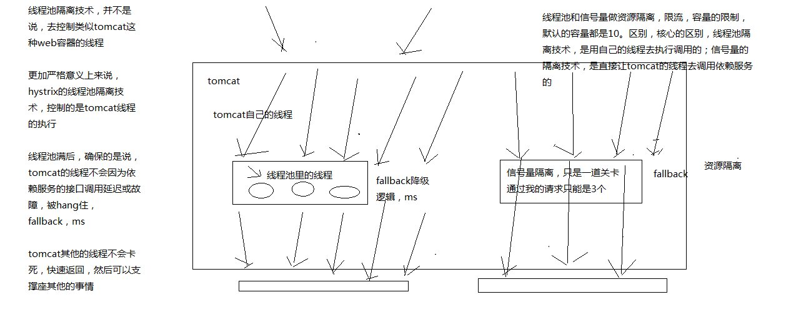

# 1、Hystrix是什么？

在分布式系统中，每个服务都可能会调用很多其他服务，被调用的那些服务就是依赖服务，有的时候某些依赖服务出现故障也是很正常的。

Hystrix可以让我们在分布式系统中对服务间的调用进行控制，加入一些调用延迟或者依赖故障的容错机制。

Hystrix通过将依赖服务进行资源隔离，进而阻止某个依赖服务出现故障的时候，这种故障在整个系统所有的依赖服务调用中进行蔓延，同时Hystrix还提供故障时的fallback降级机制

总而言之，Hystrix通过这些方法帮助我们提升分布式系统的可用性和稳定性。

分布式系统服务间调用示意图


故障蔓延示意图


资源隔离


# 2、Hystrix的历史

hystrix，就是一种高可用保障的一个框架，类似于spring，mybatis，activiti，lucene，框架，预先封装好的为了解决某个特定领域的特定问题的一套代码库。用了框架之后，来解决这个领域的特定的问题，就可以大大减少我们的工作量，提升我们的工作质量和工作效率。

hystrix，高可用性保障的一个框架

Netflix（国外视频网站）API团队从2011年开始做一些提升系统可用性和稳定性的工作，Hystrix就是从那时候开始发展出来的。在2012年的时候，Hystrix就变得比较成熟和稳定了，Netflix中，除了API团队以外，很多其他的团队都开始使用Hystrix。时至今日，Netflix中每天都有数十亿次的服务间调用，通过Hystrix框架在进行，而Hystrix也帮助Netflix网站提升了整体的可用性和稳定性。

# 3、初看Hystrix的设计原则是什么？

hystrix为了实现高可用性的架构，设计hystrix的时候，一些设计原则是什么？

（1）对依赖服务调用时出现的调用延迟和调用失败进行控制和容错保护

（2）在复杂的分布式系统中，阻止某一个依赖服务的故障在整个系统中蔓延，服务A->服务B->服务C，服务C故障了，服务B也故障了，服务A故障了，整套分布式系统全部故障，整体宕机。

（3）提供fail-fast（快速失败）和快速恢复的支持

（4）提供fallback优雅降级的支持

（5）支持近实时的监控、报警以及运维操作

完全描述了hystrix的功能，提供整个分布式系统的高可用的架构

# 4、Hystrix要解决的问题是什么？

在复杂的分布式系统架构中，每个服务都有很多的依赖服务，而每个依赖服务都可能会故障。如果服务没有和自己的依赖服务进行隔离，那么可能某一个依赖服务的故障就会拖垮当前这个服务。

举例来说，某个服务有30个依赖服务，每个依赖服务的可用性非常高，已经达到了99.99%的高可用性，那么该服务的可用性就是99.99%的30次方，也就是99.7%的可用性。99.7%的可用性就意味着3%的请求可能会失败，因为3%的时间内系统可能出现了故障不可用了。对于1亿次访问来说，3%的请求失败，也就意味着300万次请求会失败，也意味着每个月有2个小时的时间系统是不可用的

# 5、再看Hystrix的更加细节的设计原则是什么？

（1）阻止任何一个依赖服务耗尽所有的资源，比如tomcat中的所有线程资源

（2）避免请求排队和积压，采用限流和fail fast来控制故障

（3）提供fallback降级机制来应对故障

（4）使用资源隔离技术，比如bulkhead（舱壁隔离技术），swimlane（泳道技术），circuit breaker（短路技术），来限制任何一个依赖服务的故障的影响

（5）通过近实时的统计/监控/报警功能，来提高故障发现的速度

（6）通过近实时的属性和配置热修改功能，来提高故障处理和恢复的速度

（7）保护依赖服务调用的所有故障情况，而不仅仅只是网络故障情况

调用这个依赖服务的时候，client调用包有bug，阻塞，等等，依赖服务的各种各样的调用的故障，都可以处理

# 6、Hystrix是如何实现它的目标的？

（1）通过HystrixCommand或者HystrixObservableCommand来封装对外部依赖的访问请求，这个访问请求一般会运行在独立的线程中，资源隔离

（2）对于超出我们设定阈值的服务调用，直接进行超时，不允许其耗费过长时间阻塞住。这个超时时间默认是99.5%的访问时间，但是一般我们可以自己设置一下

（3）为每一个依赖服务维护一个独立的线程池，或者是semaphore，当线程池满时，直接拒绝对这个服务的调用

（4）对依赖服务的调用的成功次数，失败次数，拒绝次数，超时次数，进行统计

（5）如果对一个依赖服务的调用失败次数超过了一定的阈值，自动进行熔断，在一定时间内对该服务的调用直接降级，一段时间后再自动尝试恢复

（6）当一个服务调用出现失败，被拒绝，超时，短路等异常情况时，自动调用fallback降级机制

（7）对属性和配置的修改提供近实时的支持


1、pom.xml

```xml
<dependency>
    <groupId>com.netflix.hystrix</groupId>
    <artifactId>hystrix-core</artifactId>
    <version>1.5.12</version>
</dependency>
```

2、将商品服务接口调用的逻辑进行封装

hystrix进行资源隔离，其实是提供了一个抽象，叫做command，就是说，你如果要把对某一个依赖服务的所有调用请求，全部隔离在同一份资源池内。对这个依赖服务的所有调用请求，全部走这个资源池内的资源，不会去用其他的资源了，这个就叫做资源隔离。

hystrix最最基本的资源隔离的技术，线程池隔离技术，对某一个依赖服务，商品服务，所有的调用请求，全部隔离到一个线程池内，对商品服务的每次调用请求都封装在一个command里面，每个command（每次服务调用请求）都是使用线程池内的一个线程去执行的，所以哪怕是对这个依赖服务，商品服务，现在同时发起的调用量已经到了1000了，但是线程池内就10个线程，最多就只会用这10个线程去执行，不会说，对商品服务的请求，因为接口调用延迟，将tomcat内部所有的线程资源全部耗尽，不会出现了。不让超出这个量的请求去执行了，保护说，不要因为某一个依赖服务的故障，导致耗尽了缓存服务中的所有的线程资源去执行

```java
public class CommandHelloWorld extends HystrixCommand<String> {

    private final String name;

    public CommandHelloWorld(String name) {
        super(HystrixCommandGroupKey.Factory.asKey("ExampleGroup"));
        this.name = name;
    }

    @Override
    protected String run() {
        return "Hello " + name + "!";
    }

}
```

HystrixCommand：是用来获取一条数据的
HystrixObservableCommand：是设计用来获取多条数据的

```java
public class ObservableCommandHelloWorld extends HystrixObservableCommand<String> {

    private final String name;

    public ObservableCommandHelloWorld(String name) {
        super(HystrixCommandGroupKey.Factory.asKey("ExampleGroup"));
        this.name = name;
    }

    @Override
    protected Observable<String> construct() {
        return Observable.create(new Observable.OnSubscribe<String>() {
            @Override
            public void call(Subscriber<? super String> observer) {
                try {
                    if (!observer.isUnsubscribed()) {
                        observer.onNext("Hello " + name + "!");
                        observer.onNext("Hi " + name + "!");
                        observer.onCompleted();
                    }
                } catch (Exception e) {
                    observer.onError(e);
                }
            }
         } ).subscribeOn(Schedulers.io());
    }
}
```

3、command的四种调用方式

同步：new CommandHelloWorld("World").execute()，

new ObservableCommandHelloWorld("World").toBlocking().toFuture().get()

如果你认为observable command只会返回一条数据，那么可以调用上面的模式，去同步执行，返回一条数据

异步：new CommandHelloWorld("World").queue()，

new ObservableCommandHelloWorld("World").toBlocking().toFuture()

对command调用queue()，仅仅将command放入线程池的一个等待队列，就立即返回，拿到一个Future对象，后面可以做一些其他的事情，然后过一段时间对future调用get()方法获取数据

// observe()：hot，已经执行过了
// toObservable(): cold，还没执行过

```java
Observable<String> fWorld = new CommandHelloWorld("World").observe();
assertEquals("Hello World!", fWorld.toBlocking().single());
fWorld.subscribe(new Observer<String>() {
    @Override
    public void onCompleted() {    
    }
    
    @Override
    public void onError(Throwable e) {
        e.printStackTrace();
    }
    
    @Override
    public void onNext(String v) {
        System.out.println("onNext: " + v);
    }
});

Observable<String> fWorld = new ObservableCommandHelloWorld("World").toObservable();
assertEquals("Hello World!", fWorld.toBlocking().single());
fWorld.subscribe(new Observer<String>() {
    @Override
    public void onCompleted() {    
    }
    
    @Override
    public void onError(Throwable e) {
        e.printStackTrace();
    }
    
    @Override
    public void onNext(String v) {
        System.out.println("onNext: " + v);
    }
});
```


hystrix里面，核心的一项功能，其实就是所谓的资源隔离，要解决的最最核心的问题，就是将多个依赖服务的调用分别隔离到各自自己的资源池内，避免说对某一个依赖服务的调用，因为依赖服务的接口调用的延迟或者失败，导致服务所有的线程资源全部耗费在这个服务的接口调用上，一旦说某个服务的线程资源全部耗尽的话，可能就导致服务就会崩溃，甚至说这种故障会不断蔓延。

hystrix，资源隔离，两种技术，线程池的资源隔离，信号量的资源隔离

信号量跟线程池，两种资源隔离的技术，区别到底在哪儿呢？

2、线程池隔离技术和信号量隔离技术，分别在什么样的场景下去使用呢？？

线程池：适合绝大多数的场景，99%的，线程池，对依赖服务的网络请求的调用和访问，timeout这种问题

信号量：适合，你的访问不是对外部依赖的访问，而是对内部的一些比较复杂的业务逻辑的访问，但是像这种访问，系统内部的代码，其实不涉及任何的网络请求，那么只要做信号量的普通限流就可以了，因为不需要去捕获timeout类似的问题，算法+数据结构的效率不是太高，并发量突然太高，因为这里稍微耗时一些，导致很多线程卡在这里的话，不太好，所以进行一个基本的资源隔离和访问，避免内部复杂的低效率的代码，导致大量的线程被hang住

优点在于，不用自己管理线程池拉，不用care timeout超时了，信号量做隔离的话，性能会相对来说高一些



