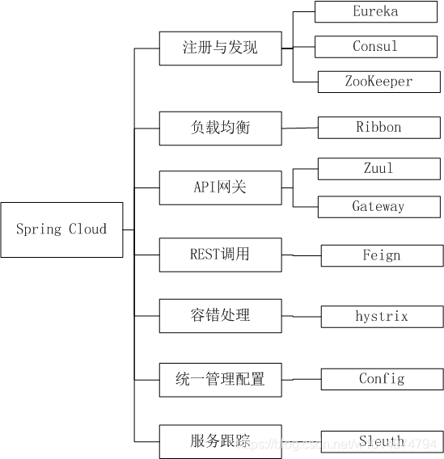
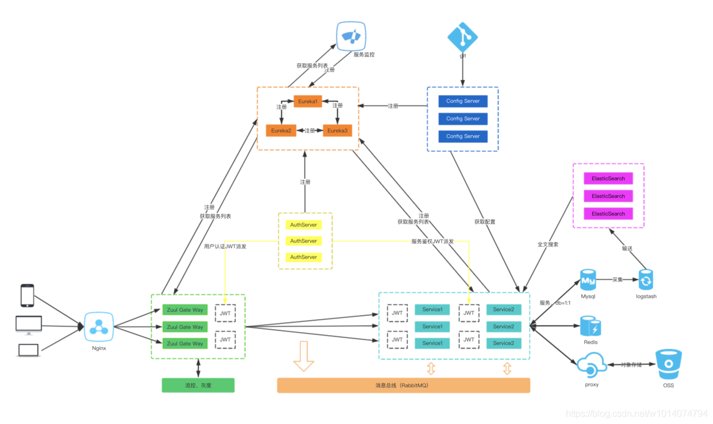
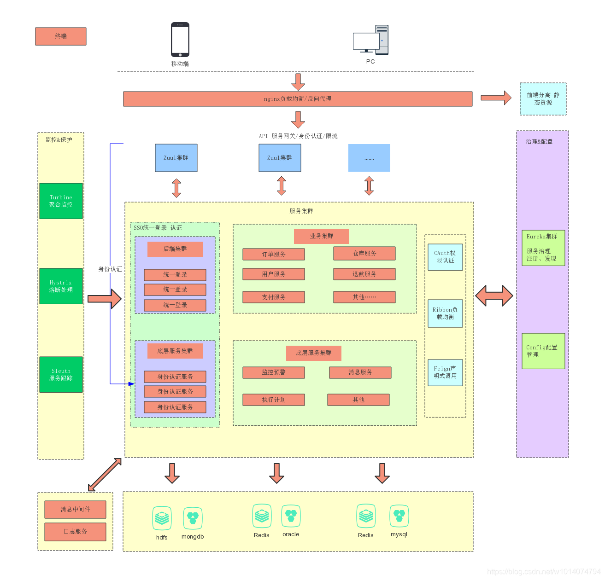
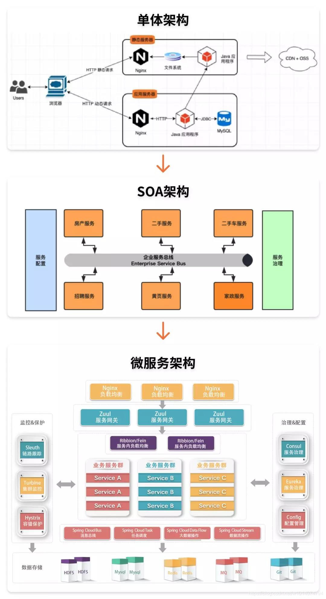

DDD、服务拆分

注册中心（zk、eureka、nacos、consul、ectd）

服务保护（hystrix、sentinel）

链路追踪（skywalking、zipkin、sleuth）

负载均衡（ribbon）

REST调用（feign）

统一配置（config、nacos）

API网关（gateway、zuul）

其他组件（ELK日志、监控等）

springcloud架构

springcloud核心组件

2张微服务的架构图

后端架构演变

