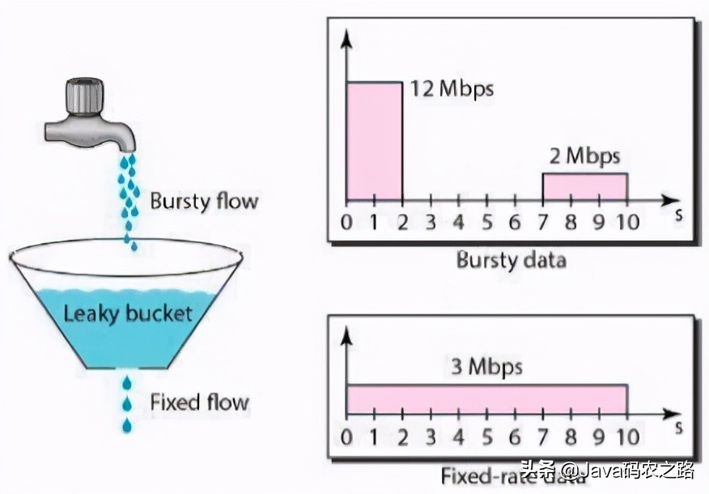

[5种常用限流算法](https://www.toutiao.com/i6982119290774241823/?tt_from=weixin&utm_campaign=client_share&wxshare_count=1&timestamp=1631431217&app=news_article&utm_source=weixin&utm_medium=toutiao_android&use_new_style=1&req_id=202109121520170102120631605877748E&share_token=7353732b-1c49-49c7-8982-6793af1c24d3&group_id=6982119290774241823)

[主流的四种限流策略，我都可以通过redis实现](https://www.toutiao.com/i6967956383346180616/?tt_from=weixin&utm_campaign=client_share&wxshare_count=1&timestamp=1630012397&app=news_article&utm_source=weixin&utm_medium=toutiao_android&use_new_style=1&req_id=20210827051317010212042056262CFAD2&share_token=fe2d1fba-6c01-47bb-8a71-4356848d391a&group_id=6967956383346180616)

# 01 固定窗口

固定窗口又称固定窗口（又称计数器算法，Fixed Window）限流算法，是最简单的限流算法，通过在单位时间内维护的计数器来控制该时间单位内的最大访问量。

假设限制每分钟请求量不超过60，设置一个计数器，当请求到达时如果计数器到达阈值，则拒绝请求，否则计数器加1；每分钟重置计数器为0。代码实现如下：

```java
public class CounterRateLimiter extends MyRateLimiter {
    /**
     * 每秒限制请求数
     */
    private final long permitsPerSecond;
    /**
     * 上一个窗口的开始时间
     */
    public long timestamp = System.currentTimeMillis();
    /**
     * 计数器
     */
    private int counter;

    public CounterRateLimiter(long permitsPerSecond) {
        this.permitsPerSecond = permitsPerSecond;
    }

    @Override
    public synchronized boolean tryAcquire() {
        long now = System.currentTimeMillis();
        // 窗口内请求数量小于阈值，更新计数放行，否则拒绝请求
        if (now - timestamp < 1000) {
            if (counter < permitsPerSecond) {
                counter++;
                return true;
            } else {
                return false;
            }
        }
        // 时间窗口过期，重置计数器和时间戳
        counter = 0;
        timestamp = now;
        return true;
    }
}
```

固定窗口最大的优点在于**易于实现**；并且**内存占用小**，我们只需要存储时间窗口中的计数即可；它能够确保处理更多的最新请求，不会因为旧请求的堆积导致新请求被饿死。当然也面临着**临界问题**，当两个窗口交界处，瞬时流量可能为2n。


# 02 滑动窗口

为了防止瞬时流量，可以把固定窗口近一步划分成多个格子，每次向后移动一小格，而不是固定窗口大小，这就是滑动窗口（Sliding Window）。

比如每分钟可以分为6个10秒中的单元格，每个格子中分别维护一个计数器，窗口每次向前滑动一个单元格。每当请求到达时，只要窗口中所有单元格的计数总和不超过阈值都可以放行。TCP协议中数据包的传输，同样也是采用滑动窗口来进行流量控制。


实现如下

```java
public class SlidingWindowRateLimiter extends MyRateLimiter {
    /**
     * 每分钟限制请求数
     */
    private final long permitsPerMinute;
    /**
     * 计数器, k-为当前窗口的开始时间值秒，value为当前窗口的计数
     */
    private final TreeMap<Long, Integer> counters;

    public SlidingWindowRateLimiter(long permitsPerMinute) {
        this.permitsPerMinute = permitsPerMinute;
        this.counters = new TreeMap<>();
    }

    @Override
    public synchronized boolean tryAcquire() {
        // 获取当前时间的所在的子窗口值； 10s一个窗口
        long currentWindowTime = LocalDateTime.now().toEpochSecond(ZoneOffset.UTC) / 10 * 10;
        // 获取当前窗口的请求总量
        int currentWindowCount = getCurrentWindowCount(currentWindowTime);
        if (currentWindowCount >= permitsPerMinute) {
            return false;
        }
        // 计数器 + 1
        counters.merge(currentWindowTime, 1, Integer::sum);
        return true;
    }
    /**
     * 获取当前窗口中的所有请求数（并删除所有无效的子窗口计数器）
     *
     * @param currentWindowTime 当前子窗口时间
     * @return 当前窗口中的计数
     */
    private int getCurrentWindowCount(long currentWindowTime) {
        // 计算出窗口的开始位置时间
        long startTime = currentWindowTime - 50;
        int result = 0;

        // 遍历当前存储的计数器，删除无效的子窗口计数器，并累加当前窗口中的所有计数器之和
        Iterator<Map.Entry<Long, Integer>> iterator = counters.entrySet().iterator();
        while (iterator.hasNext()) {
            Map.Entry<Long, Integer> entry = iterator.next();
            if (entry.getKey() < startTime) {
                iterator.remove();
            } else {
                result += entry.getValue();
            }
        }
        return result;
    }
}
```

滑动窗口解决了计数器中的瞬时流量高峰问题，其实计数器算法也是滑动窗口的一种，只不过窗口没有进行更细粒度单元的划分。对比计数器可见，当窗口划分的粒度越细，则流量控制更加精准和严格。

不过当窗口中流量到达阈值时，流量会瞬间切断，在实际应用中我们要的限流效果往往不是把流量一下子掐断，而是让流量平滑地进入系统当中。

# 03 漏桶算法

如何更加平滑的限流？不妨看看漏桶算法（Leaky Bucket），请求就像水一样以任意速度注入漏桶，而桶会按照固定的速率将水漏掉；当注入速度持续大于漏出的速度时，漏桶会变慢，此时新进入的请求将会被丢弃。**限流**和**整形**是漏桶算法的两个核心能力。



实现如下：

```java
public class LeakyBucketRateLimiter extends MyRateLimiter {
    // 桶的容量
    private final int capacity;
    // 漏出速率
    private final int permitsPerSecond;
    // 剩余水量
    private long leftWater;
    // 上次注入时间
    private long timeStamp = System.currentTimeMillis();

    public LeakyBucketRateLimiter(int permitsPerSecond, int capacity) {
        this.capacity = capacity;
        this.permitsPerSecond = permitsPerSecond;
    }

    @Override
    public synchronized boolean tryAcquire() {
        //1. 计算剩余水量
        long now = System.currentTimeMillis();
        long timeGap = (now - timeStamp) / 1000;
        leftWater = Math.max(0, leftWater - timeGap * permitsPerSecond);
        timeStamp = now;
        
        // 如果未满，则放行；否则限流
        if (leftWater < capacity) {
            leftWater += 1;
            return true;
        }
        return false;
    }
}
```

这并不是一个完整的漏桶算法的实现，以上代码中只是对流量是否会被抛弃进行校验，即tryAcquire返回true表示漏桶未满，否则表示漏桶已满丢弃请求。

想要以恒定的速率漏出流量，通常还应配合一个FIFO队列来实现，当tryAcquire返回true时，将请求入队，然后再以固定频率从队列中取出请求进行处理。示例代码如下：

```java
@Test
public void testLeakyBucketRateLimiter() throws InterruptedException {
    ScheduledExecutorService scheduledExecutorService = Executors.newSingleThreadScheduledExecutor();
    ExecutorService singleThread = Executors.newSingleThreadExecutor();

    LeakyBucketRateLimiter rateLimiter = new LeakyBucketRateLimiter(20, 20);
    // 存储流量的队列
    Queue<Integer> queue = new LinkedList<>();
    // 模拟请求  不确定速率注水
    singleThread.execute(() -> {
        int count = 0;
        while (true) {
            count++;
            boolean flag = rateLimiter.tryAcquire();
            if (flag) {
                queue.offer(count);
                System.out.println(count + "--------流量被放行--------");
            } else {
                System.out.println(count + "流量被限制");
            }
            try {
                Thread.sleep((long) (Math.random() * 1000));
            } catch (InterruptedException e) {
                e.printStackTrace();
            }
        }
    });
  
    // 模拟处理请求 固定速率漏水
    scheduledExecutorService.scheduleAtFixedRate(() -> {
        if (!queue.isEmpty()) {
            System.out.println(queue.poll() + "被处理");
        }
    }, 0, 100, TimeUnit.MILLISECONDS);

    // 保证主线程不会退出
    while (true) {
        Thread.sleep(10000);
    }
}
```

漏桶算法存在目的主要是用来**平滑突发的流量**，提供一种机制来确保网络中突发流量被整合成平滑稳定的额流量。

不过由于漏桶对流量的控制过于严格，在有些场景下**不能充分使用系统资源**，因为漏桶的漏出速率是固定的，即使在某一时刻下游能够处理更大的流量，漏桶也不允许突发流量通过。

# 04 令牌桶

如何在够限制流量速率的前提下，又能够允许突发流量呢？令牌桶算法了解一下！令牌桶算法是以恒定速率向令牌桶发送令牌，请求到达时，尝试从令牌桶中拿令牌，只有拿到令牌才能够放行，否则将会被拒绝。


令牌桶具有以下特点：

1. 以恒定的速率发放令牌，假设限流速率为v/s，则表示每1/v秒发放一个令牌
2. 假设令牌桶容量是b，如果令牌桶已满，则新的令牌会被丢弃
3. 请求能够通过限流器的前提是令牌桶中有令牌

令牌桶算法中值得关注的参数有两个，即限流速率v/s，和令牌桶容量b；速率a表示限流器一般情况下的限流速率，而b则是burst的简写，表示限流器允许的最大突发流量。

比如b=10，当令牌桶满的时候有10个可用令牌，此时允许10个请求同时通过限流器（**允许流量一定程度的突发**），这10个请求瞬间消耗完令牌后，后续的流量只能按照速率r通过限流器。

实现如下：

```java
public class TokenBucketRateLimiter extends MyRateLimiter {
    /**
     * 令牌桶的容量「限流器允许的最大突发流量」
     */
    private final long capacity;
    /**
     * 令牌发放速率
     */
    private final long generatedPerSeconds;
    /**
     * 最后一个令牌发放的时间
     */
    long lastTokenTime = System.currentTimeMillis();
    /**
     * 当前令牌数量
     */
    private long currentTokens;

    public TokenBucketRateLimiter(long generatedPerSeconds, int capacity) {
        this.generatedPerSeconds = generatedPerSeconds;
        this.capacity = capacity;
    }

    /**
     * 尝试获取令牌
     *
     * @return true表示获取到令牌，放行；否则为限流
     */
    @Override
    public synchronized boolean tryAcquire() {
          /**
           * 计算令牌当前数量
           * 请求时间在最后令牌是产生时间相差大于等于额1s（为啥时1s？因为生成令牌的最小时间单位时s），则
           * 1. 重新计算令牌桶中的令牌数
           * 2. 将最后一个令牌发放时间重置为当前时间
           */
        long now = System.currentTimeMillis();
        if (now - lastTokenTime >= 1000) {
            long newPermits = (now - lastTokenTime) / 1000 * generatedPerSeconds;
            currentTokens = Math.min(currentTokens + newPermits, capacity);
            lastTokenTime = now;
        }
        if (currentTokens > 0) {
            currentTokens--;
            return true;
        }
        return false;
    }
}
```

需要注意的是，非常容易被想到的实现是生产者消费者模式；用一个生产者线程定时向阻塞队列中添加令牌，而试图通过限流器的线程则作为消费者线程，只有从阻塞队列中获取到令牌，才允许通过限流器。

由于**线程调度的不确定性**，在高并发场景时，定时器误差非常大，同时定时器本身会创建调度线程，也会对**系统的性能**产生影响。

# 05 滑动日志

滑动日志是一个比较“冷门”，但是确实好用的限流算法。滑动日志限速算法需要记录请求的时间戳，通常使用**有序集合**来存储，我们可以在单个有序集合中跟踪用户在一个时间段内所有的请求。

假设我们要限制给定T时间内的请求不超过N，我们只需要存储最近T时间之内的请求日志，每当请求到来时判断最近T时间内的请求总数是否超过阈值。


实现如下：

```java
public class SlidingLogRateLimiter extends MyRateLimiter {
    /**
     * 每分钟限制请求数
     */
    private static final long PERMITS_PER_MINUTE = 60;
    /**
     * 请求日志计数器, k-为请求的时间（秒），value当前时间的请求数量
     */
    private final TreeMap<Long, Integer> requestLogCountMap = new TreeMap<>();

    @Override
    public synchronized boolean tryAcquire() {
        // 最小时间粒度为s
        long currentTimestamp = LocalDateTime.now().toEpochSecond(ZoneOffset.UTC);
        // 获取当前窗口的请求总数
        int currentWindowCount = getCurrentWindowCount(currentTimestamp);
        if (currentWindowCount >= PERMITS_PER_MINUTE) {
            return false;
        }
        // 请求成功，将当前请求日志加入到日志中
        requestLogCountMap.merge(currentTimestamp, 1, Integer::sum);
        return true;
    }

    /**
     * 统计当前时间窗口内的请求数
     *
     * @param currentTime 当前时间
     * @return -
     */
    private int getCurrentWindowCount(long currentTime) {
        // 计算出窗口的开始位置时间
        long startTime = currentTime - 59;
        // 遍历当前存储的计数器，删除无效的子窗口计数器，并累加当前窗口中的所有计数器之和
        return requestLogCountMap.entrySet()
                .stream()
                .filter(entry -> entry.getKey() >= startTime)
                .mapToInt(Map.Entry::getValue)
                .sum();
    }
}
```

滑动日志能够避免突发流量，实现较为精准的限流；同样**更加灵活，能够支持更加复杂的限流策略**，如多级限流，每分钟不超过100次，每小时不超过300次，每天不超过1000次，我们只需要保存最近24小时所有的请求日志即可实现。

灵活并不是没有代价的，带来的缺点就是**占用存储空间要高于其他限流算法**。

# 07 总结

以上几种限流算法的实现都仅适合单机限流。虽然给每台机器平均分配限流配额可以达到限流的目的，但是由于机器性能，流量分布不均以及计算数量动态变化等问题，单机限流在分布式场景中的效果总是差强人意。

分布式限流最简单的实现就是利用中心化存储，即将单机限流存储在本地的数据存储到同一个存储空间中，如常见的Redis等。

1. 固定窗口算法实现简单，性能高，但是会有临界突发流量问题，瞬时流量最大可以达到阈值的2倍。
2. 为了解决临界突发流量，可以将窗口划分为多个更细粒度的单元，每次窗口向右移动一个单元，于是便有了滑动窗口算法。 滑动窗口当流量到达阈值时会瞬间掐断流量，所以导致流量不够平滑。
3. 想要达到限流的目的，又不会掐断流量，使得流量更加平滑？可以考虑漏桶算法！需要注意的是，漏桶算法通常配置一个FIFO的队列使用以达到允许限流的作用。 由于速率固定，即使在某个时刻下游处理能力过剩，也不能得到很好的利用，这是漏桶算法的一个短板。
4. 限流和瞬时流量其实并不矛盾，在大多数场景中，短时间突发流量系统是完全可以接受的。令牌桶算法就是不二之选了，令牌桶以固定的速率v产生令牌放入一个固定容量为n的桶中，当请求到达时尝试从桶中获取令牌。 当桶满时，允许最大瞬时流量为n；当桶中没有剩余流量时则限流速率最低，为令牌生成的速率v。
5. 如何实现更加灵活的多级限流呢？滑动日志限流算法了解一下！这里的日志则是请求的时间戳，通过计算指定时间段内请求总数来实现灵活的限流。 当然，由于需要存储时间戳信息，其占用的存储空间要比其他限流算法要大得多。

不管黑猫白猫，能抓到老鼠的就是好猫。限流算法并没有绝对的好劣之分，如何选择合适的限流算法呢？不妨从性能，是否允许超出阈值，落地成本，流量平滑度，是否允许突发流量以及系统资源大小限制多方面考虑。

当然，市面上也有比较成熟的限流工具和框架。如Google出品的Guava中基于令牌桶实现的限流组件，拿来即用；以及alibaba开源的面向分布式服务架构的流量控制框架Sentinel更会让你爱不释手，它是基于滑动窗口实现的。