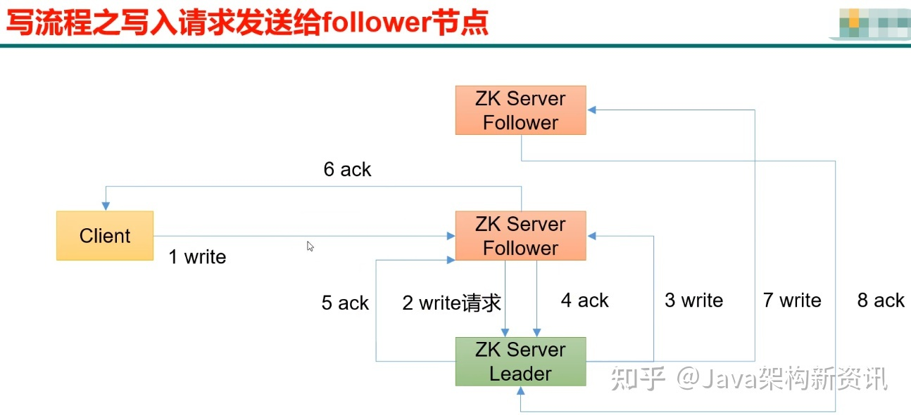

分布式协调工具  分布式指挥官

https://zhuanlan.zhihu.com/p/466890533

# 基本概念

Apache ZooKeeper是一种用于分布式应用程序的高性能协调服务。提供一种集中式信息存储服务。

特点：数据存在内存中，类似文件系统的树形结构，高吞吐量和低延迟，集群高可靠。

- 是一个开源的分布式协调服务。使用分布式系统就无法避免对节点管理的问题(需要实时感知节点的状态、对节点进行统一管理等等)，而由于这些问题处理起来可能相对麻烦和提高了系统的复杂性，ZooKeeper作为一个能够通用解决这些问题的中间件就应运而生了。
- 从设计模式角度来理解：是一个基于观察者模式设计的分布式服务管理框架，它负责存储和管理大家都关心的数据，一旦这些数据的状态发生变化，Zookeeper 就 将负责通知已经在Zookeeper上注册的那些观察者做出相应的反应。
- 实现原理：zookeeper=文件系统+通知机制。

# 应用场景

- 统一配置管理：比如现在有A.yml，B.yml配置文件，里面有一些公共的配置，但是如果后期对这些公共的配置进行修改，就需要修改每一个文件，还要重启服务器。比较麻烦，现在将这些公共配置信息放到ZK中，修改ZK的信息，会通知A，B配置文件。

- 统一命名服务：这个的理解其实跟域名一样，在某一个节点下放一些ip地址，我现在只需要访问ZK的一个Znode节点就可以获取这些ip地址。

- 同一集群管理：分布式集群中状态的监控和管理，使用Zookeeper来存储。

- 分布式协调：这个是我们最常用的，比如把多个服务提供者的信息放在某个节点上，服务的消费者就可以通过ZK调用。

- - 服务节点动态上下线：如何提供者宕机，就会删除在ZK的节点，然后ZK通知给消费者。（注册中心）
  - 软负载均衡
  - 动态选举Master：Zookeeper会每次选举最小编号的作为Master，如果Master挂了，自然对应的Znode节点就会删除。然后让新的最小编号作为Master，这样就可以实现动态选举的功能了。

- 分布式锁、分布式栅栏、分布式countdownlatch等功能的实现。

# 工作原理

## 文件系统

ZooKeeper的数据结构，跟Unix文件系统非常类似，可以看做是一颗树，每个节点叫做Znode。每一个Znode只能存1MB数据。数据只是配置信息。每一个节点可以通过路径来标识，结构图如下：

Znode节点主要有4中类型：

- 临时目录节点：客户端与Zookeeper断开连接后，该节点被删除
- 临时顺序编号目录节点：基本特性同临时节点，只是增加了顺序属性，节点名后边会追加一个由父节点维护的自增整型数字。
- 持久化目录节点：客户端与Zookeeper断开连接后，该节点依旧存在
- 持久化顺序编号目录节点：基本特性同持久节点，只是增加了顺序属性，节点名后边会追加一个由父节点维护的自增整型数字。

## 通知机制

Zookeeper可以提供分布式数据的发布/订阅功能，依赖的就是Wather监听机制。

客户端可以向服务端注册Wather监听，服务端的指定事件触发之后，就会向客户端发送一个事件通知。

1、客户端向服务端注册Wather监听

2、保存Wather对象到客户端本地的WatherManager中

3、服务端Wather事件触发后，客户端收到服务端通知，从WatherManager(watcher管理器)中取出对应Wather对象执行回调逻辑。

主要监听2方面内容：

- 监听Znode节点的数据变化：就是那个节点信息更新了。
- 监听子节点的增减变化：就是增加了一个Znode或者删除了一个Znode。

几个特性：

- 一次性：一旦一个Wather触发之后，Zookeeper就会将它从存储中移除
- 客户端串行：客户端的Wather回调处理是串行同步的过程，不要因为一个Wather的逻辑阻塞整个客户端
- 轻量：Wather通知的单位是WathedEvent，只包含通知状态、事件类型和节点路径，不包含具体的事件内容，具体的时间内容需要客户端主动去重新获取数据

## ZK集群

ZK节点角色

- Leader：负责写数据。(写数据都有事务)
- Follower：负责读数据，节点的选举和过半写成功。(读数据没有事务)
- Observer：只负责读。不参与选举

ZK节点的工作状态(服务状态)

- LOOKING：寻找 Leader 状态。当服务器处于该状态时，它会认为当前集群中没有 Leader，因此需要进入 Leader 选举状态。
- FOLLOWING：跟随者状态。表明当前服务器角色是 Follower。
- LEADING：领导者状态。表明当前服务器角色是 Leader。
- OBSERVING：观察者状态。表明当前服务器角色是 Observer。

其他概念：

- zxid：全局事务ID，分为两部分：

- - 纪元（epoch）部分：epoch代表当前集群所属的哪个leader，leader的选举就类似一个朝代的更替，你前朝的剑不能斩本朝的官，用epoch代表当前命令的有效性。
  - 计数器（counter）部分，是一个全局有序的数字，是一个递增的数字。

- 写给leader，leader再通知其他节点
- 写给follower,follower没有写的权限，交给leader写,leader再通知。
- 半数机制：比如上图,zookeeper在通知其他节点写的时候,达到半数就通知客户端写完成。 不需要全部写完成。所以集群的数量一般是奇数。

> ZK怎么保证数据一致性？

由于ZK只有Leader节点可以写入数据，如果是其他节点收到写入数据的请求，则会将之转发给Leader节点。ZK通过ZAB协议来实现数据的最终顺序一致性，他是一个类似2PC两阶段提交的过程。ZAB有2种模式：消息广播，崩溃恢复(选举)。

消息广播

- 第一阶段：广播事务阶段：对应图上的1，2

- - Leader收到请求之后，将它转换为一个proposal提议，并且为每个提议分配一个事务ID：zxid，然后把提议放入到一个FIFO的队列中，按照FIFO的策略发送给所有的Follower。
  - Follower收到提议之后，以事务日志的形式写入到本地磁盘中，写入成功后返回ACK给Leader

- 第二阶段：广播提交操作：对应图上的3

- - Leader在收到超过半数的Follower的ACK之后，即可认为数据写入成功，就会发送commit命令给Follower告诉他们可以提交proposal了。

> Leader宕机了如何进行选举？

崩溃恢复模式(选举机制)

> 选举后数据如何同步？

实际上Zookeeper在选举之后，Follower和Observer（统称为Learner）就会去向Leader注册，然后就会开始数据同步的过程。

数据同步包含3个主要值和4种形式。

- PeerLastZxid：Learner服务器最后处理的ZXID
- minCommittedLog：Leader提议缓存队列中最小ZXID
- maxCommittedLog：Leader提议缓存队列中最大ZXID

同步策略：

- 直接差异化同步 (DIFF同步)：如果PeerLastZxid在minCommittedLog和maxCommittedLog之间，那么则说明Learner服务器还没有完全同步最新的数据。

1. 首先Leader向Learner发送DIFF指令，代表开始差异化同步，然后把差异数据（从PeerLastZxid到maxCommittedLog之间的数据）提议proposal发送给Learner
2. 发送完成之后发送一个NEWLEADER命令给Learner，同时Learner返回ACK表示已经完成了同步
3. 接着等待集群中过半的Learner响应了ACK之后，就发送一个UPTODATE命令，Learner返回ACK，同步流程结束

- 先回滚再差异化同步(Trunc+DIFF同步)：特殊场景：如果Leader刚生成一个proposal，还没有来得及发送出去，此时Leader宕机，重新选举之后作为Follower，但是新的Leader没有这个proposal数据。

- - 举个栗子：假设现在的Leader是A，minCommittedLog=1，maxCommittedLog=3，刚好生成的一个proposal的ZXID=4，然后挂了。重新选举出来的Leader是B，B之后又处理了2个提议，然后minCommittedLog=1，maxCommittedLog=5。这时候A的PeerLastZxid=4，在(1,5)之间。那么这一条只存在于A的提议怎么处理？
  - A要进行事务回滚，相当于抛弃这条数据，并且回滚到最接近于PeerLastZxid的事务，对于A来说，也就是PeerLastZxid=3。流程和DIFF一致，只是会先发送一个TRUNC命令，然后再执行差异化DIFF同步。

- 仅回滚同步(TRUNC同步)：

- - 针对PeerLastZxid大于maxCommittedLog的场景，流程和上述一致，事务将会被回滚到maxCommittedLog的记录。
  - 这个其实就更简单了，也就是你可以认为TRUNC+DIFF中的例子，新的Leader B没有处理提议，所以B中minCommittedLog=1，maxCommittedLog=3。
  - 所以A的PeerLastZxid=4就会大于maxCommittedLog了，也就是A只需要回滚就行了，不需要执行差异化同步DIFF了。

- 全量同步 (SNAP同步)：

- - 适用于两个场景：

1. PeerLastZxid小于minCommittedLog
2. Leader服务器上没有提议缓存队列，并且PeerLastZxid不等于Leader的最大ZXID

- - 这两种场景下，Leader将会发送SNAP命令，把全量的数据都发送给Learner进行同步。

> 有可能会出现数据不一致的问题吗？

还是会存在的，我们可以分成3个场景来描述这个问题。

- 查询不一致**：**

- - 因为Zookeeper是过半成功即代表成功，假设我们有5个节点，如果123节点写入成功，如果这时候请求访问到4或者5节点，那么有可能读取不到数据，因为可能数据还没有同步到4、5节点中，也可以认为这算是数据不一致的问题。
  - 解决方案可以在读取前使用sync命令。

- leader未发送proposal宕机**：**

- - 这也就是数据同步说过的问题。leader刚生成一个proposal，还没有来得及发送出去，此时leader宕机，重新选举之后作为follower，但是新的leader没有这个proposal。
  - 这种场景下的日志将会被丢弃。

- leader发送proposal成功，发送commit前宕机**：**

- - 如果发送proposal成功了，但是在将要发送commit命令前宕机了，如果重新进行选举，还是会选择zxid最大的节点作为leader，因此，这个日志并不会被丢弃，会在选举出leader之后重新同步到其他节点当中。

> zookeeper 是如何保证事务的顺序一致性的？

- 使用zxid来保证顺序性。

> 集群最少要几台机器，集群规则是怎样的？集群中有 3 台服务器，其中一个节点宕机，这个时候 Zookeeper 还可以使用吗？

- 集群规则为 2N+1 (奇数)台，N>0，即 3 台。可以继续使用，单数服务器只要没超过一半的服务器宕机就可以继续使用。

会话Session：

- 会话自然就是指Zookeeper客户端和服务端之间的通信，他们使用TCP长连接的方式保持通信，通常，肯定会有心跳检测的机制，同时他可以接受来自服务器的Watch事件通知。

# 常用命令

ls path：查看当前 znode 的子节点

get path：获取节点的值

set：设置节点的值

create，delete：创建/删除节点

客户端

zkclient、curator

https://www.iteye.com/blog/jxauwxj-2391032

zk面试题

https://mp.weixin.qq.com/s/YawG0GqznDHaiHXZuTsCjA

https://segmentfault.com/a/1190000014479433

