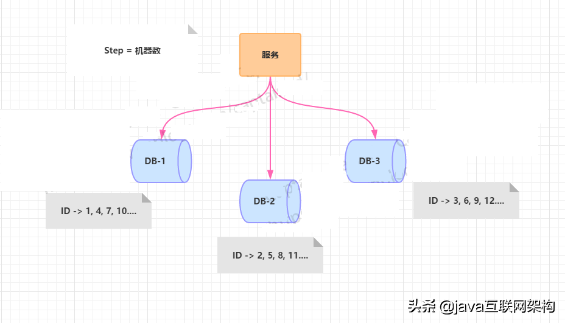
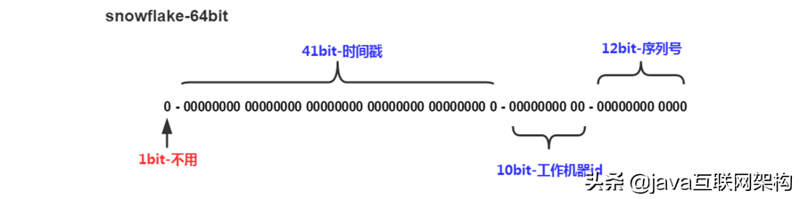
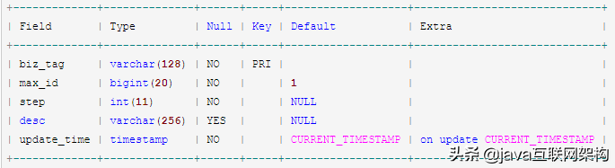

# 1 需求背景
​        一般单机或者单库项目规模比较小，适应的场景也比较有限，平台的访问量和业务量都较小，业务ID的生成方式比较原始但是够用，它并没有给这样的系统带来问题和瓶颈。但是对于大厂的那种大规模复杂业务、分布式高并发的应用场景，显然这种ID的生成方式不会像小项目一样仅仅依靠简单的数据自增序列来完成，而且在分布式环境下这种方式已经无法满足业务的需求，不仅无法完成业务能力，业务ID生成的速度或者重复问题可能给系统带来严重的故障。

# 2 分布式ID特点
+ **全局唯一**，这是基本要求，不能出现重复。

+ 数字类型，**趋势递增**，后面的ID必须比前面的大，这是从MySQL存储引擎来考虑的，需要保证写入数据的性能。

+ **长度短**，能够提高查询效率，这也是从MySQL数据库规范出发的，尤其是ID作为主键时。

+ **信息安全**，如果ID连续生成，势必会泄露业务信息，甚至可能被猜出，所以需要无规则不规则。

+ **高可用低延时**，ID生成快，能够扛住高并发，延时足够低不至于成为业务瓶颈。

# 3 分布式ID生成方案
没有完美的实现方案，只有适合自己所处具体业务的方案。
## 3.1 基于JDK UUID
**优点**
代码实现足够简单易用。本地生成没有性能问题。
因为具备全球唯一的特性，所以对于数据库迁移这种情况不存在问题。
**缺点**
每次生成的ID都是无序的，而且不是全数字，且无法保证趋势递增。
UUID生成的是字符串，字符串存储性能差，查询效率慢，长度过长，不适用于存储，耗费数据库性能。
ID无一定业务含义，可读性差。
**适用场景**
可以用来生成如token令牌一类的场景，足够没辨识度，而且无序可读，长度足够。
可以用于无纯数字要求、无序自增、无可读性要求的场景。

## 3.2 基于数据库主键
### 3.2.1 基于数据库主键自增
使用数据库主键自增的方式算是比较常用的了，以MySQL为例，在新建表时指定主键以auto_increment的方式自动增长生成，或者再指定个增长步长，这在小规模单机部署的业务系统里面足够使用了，使用简单而且具备一定业务性，但是在分布式高并发的系统里面，却是不适用的，分布式系统涉及到分库分表，跨机器甚至跨机房部署的环境下，数据库自增的方式满足不了业务需求，同时在高并发大量访问的情况之下，数据库的承受能力是有限的，我们简单的陈列一下这种方式的优缺点。

**优点**
实现简单，依靠数据库即可，成本小。
ID数字化，单调自增，满足数据库存储和查询性能。
具有一定的业务可读性。
**缺点**
强依赖DB，存在单点问题，如果数据库宕机，则业务不可用。
DB生成ID性能有限，单点数据库压力大，无法扛高并发场景。
**适用场景**
小规模的，数据访问量小的业务场景。
无高并发场景，插入记录可控的场景。

### 3.2.2 基于数据库多实例主键自增
上面我们大致讲解了数据库主键自增的方式，讨论的时单机部署的情况，如果要以此提高ID生成的效率，可以横向扩展机器，平衡单点数据库的压力，这种方案如何实现呢？那就是在auto_increment的基础之上，设置step增长步长，让DB之前生成的ID趋势递增且不重复。

从上图可以看出，水平扩展的数据库集群，有利于解决数据库单点压力的问题，同时为了ID生成特性，将自增步长按照机器数量来设置，但是，这里有个缺点就是不能再扩容了，如果再扩容，ID就没法儿生成了，步长都用光了，那如果你要解决新增机器带来的问题，你或许可以将第三台机器的ID起始生成位置设定离现在的ID比较远的位置，同时把新的步长设置进去，同时修改旧机器上ID生成的步长，但必须在ID还没有增长到新增机器设置的开始自增ID值，否则就要出现重复了。
**优点**
解决了ID生成的单点问题，同时平衡了负载。
**缺点**
一定确定好步长，将对后续的扩容带来困难，而且单个数据库本身的压力还是大，无法满足高并发。
**适用场景**
数据量不大，数据库不需要扩容的场景。这种方案，除了难以适应大规模分布式和高并发的场景，普通的业务规模还是能够胜任的，所以这种方案还是值得积累。

### 3.2.3 基于数据库的号段模式
号段模式是当下分布式ID生成器的主流实现方式之一，号段模式可以理解为从数据库批量的获取自增ID，每次从数据库取出一个号段范围，例如 (1,1000] 代表1000个ID，具体的业务服务将本号段，生成1~1000的自增ID并加载到内存。表结构如下：	
```sql
CREATE TABLE id_generator (
  id int(10) NOT NULL,
  max_id bigint(20) NOT NULL COMMENT '当前最大id',
  step int(20) NOT NULL COMMENT '号段的布长',
  biz_type    int(20) NOT NULL COMMENT '业务类型',
  version int(20) NOT NULL COMMENT '版本号',
  PRIMARY KEY (`id`)
) 
```
biz_type ：代表不同业务类型
max_id ：当前最大的可用id
step ：代表号段的长度
version ：是一个乐观锁，每次都更新version，保证并发时数据的正确性


等这批号段ID用完，再次向数据库申请新号段，对max_id字段做一次update操作，update max_id= max_id + step，update成功则说明新号段获取成功，新的号段范围是(max_id ,max_id +step]。

```sql
update id_generator set max_id = #{max_id+step}, version = version + 1 where version = # {version} and biz_type = XXX
```

由于多业务端可能同时操作，所以采用版本号version乐观锁方式更新，这种分布式ID生成方式不强依赖于数据库，不会频繁的访问数据库，对数据库的压力小很多。

## 3.3 基于Redis生成

Redis的INCR命令能够将key中存储的数字值增一，得益于此操作的原子特性，我们能够巧妙地使用此来做分布式ID地生成方案，还可以配合其他如时间戳值、机器标识等联合使用。
**优点**
有序递增，可读性强。性能优于数据库，能够满足一定性能要求。
**缺点**
强依赖于Redis，可能存在单点问题。
占用宽带，而且需要考虑网络延时等问题带来地性能冲击。
**适用场景**
对性能要求不是太高，而且规模较小业务较轻的场景，而且Redis的运行情况有一定要求，注意网络问题和单点压力问题，如果是分布式情况，那考虑的问题就更多了，所以一帮情况下这种方式用的比较少。Redis的方案其实可靠性有待考究，毕竟依赖于网络，延时故障或者宕机都可能导致服务不可用，这种风险是不得不考虑在系统设计内的。

## 3.4 基于类Snowflake算法

我们现在的项目都不大，使用的是IdWorker——国内开源的基于snowflake算法思想实现的一款分布式ID生成器，snowflake雪花算法是twitter公司内部分布式项目采用的ID生成算法，现在开源并流行了起来，下面是Snowflake算法的ID构成图。



这种方案巧妙地把64位分别划分成多段，分开表示时间戳差值、机器标识和随机序列，先以此生成一个64位地二进制正整数，然后再转换成十进制进行存储。

其中，

**1位标识符**，不使用且标记为0；

**41位时间戳**，用来存储时间戳的差值，精确到毫秒级，存储的是由当前时间戳减去设置的开始时间戳(由我们程序来指定的startTime字段)，得到的时间戳。得到的41位的长度的时间戳可以使用69年；；

**10位机器码**，可以标识1024个机器节点，如果机器分机房部署（IDC），这10位还可以拆分，比如5位表示机房ID，5位表示机器ID，这样就有32*32种组合，一般来说是足够了；

**12位随机序列**，用来记录毫秒内的计数，可以支持同一节点同一毫秒生成多个ID序号，12位的计数序列号支持每个节点每毫秒产生4096个ID序号。

所以综上所述，综合计算下来，理论上Snowflake算法方案的QPS大约为409.6w/s，性能足够强悍了，而且这种方式，能够确保集群中每个节点生成的ID都是不同的，且区间内递增。

**优点**

- 每秒能够生成百万个不同的ID，性能佳。
- 时间戳值在高位，中间是固定的机器码，自增的序列在地位，整个ID是趋势递增的。
- 能够根据业务场景数据库节点布置灵活挑战bit位划分，灵活度高。

**缺点**

- **强依赖于机器时钟**，如果时钟回拨，会导致重复的ID生成，所以一般基于此的算法发现时钟回拨，都会抛异常处理，阻止ID生成，这可能导致服务不可用。

**适用场景**

- 雪花算法有很明显的缺点就是时钟依赖，如果确保机器不存在时钟回拨情况的话，那使用这种方式生成分布式ID是可行的，当然小规模系统完全是能够使用的。

```java
/**
 * 工具类：snowflake(雪花算法)方案生成ID
 * @author 杨工
 * @date 2020/7/4 20:35
 */
public class SnowflakeIdWorker {
    /**
     * 开始时间截
     */
    private final long startTime = 1480166465631L;
    /**
     * 机器标识所占的位数，5位
     */
    private final long machineBits = 5L;
    /**
     * 数据中心标识所占的位数，5位
     */
    private final long dataCenterBits = 5L;
    /**
     * 序列号占的位数，12位
     */
    private final long sequenceBits = 12L;
    /**
     * 机器标识部分支持的最大值，结果是31 (这个移位算法可以很快的计算出几位二进制数所能表示的最大十进制数)
     */
    private final long maxMachineNum = -1L ^ (-1L << machineBits);
    /**
     * 数据中心标识部分支持的最大值，结果是31
     */
    private final long maxDataCenterNum = -1L ^ (-1L << dataCenterBits);
    /**
     * 序列号部分支持的最大值
     */
    private final long maxSequenceNum = -1L ^ (-1L << sequenceBits);
    /**
     * 数据标识部分向左移17位(12+5)
     */
    private final long dataCenterLeft = sequenceBits + machineBits;
    /**
     * 时间截部分向左移22位(17+5)
     */
    private final long timestampLeft = dataCenterLeft + dataCenterBits;
    /**
     * 机器部分向左移动12位
     */
    private final long machineLeft = sequenceBits;
    /**
     * 机器ID(0~31)
     */
    private long machineId;
    /**
     * 数据中心ID(0~31)
     */
    private long dataCenterId;
    /**
     * 毫秒内序列(0~4095)
     */
    private long sequence = 0L;
    /**
     * 上次生成ID的时间截
     */
    private long lastTimestamp = -1L;

    /**
     * 构造函数
     * @param machineId 机器ID (0~31)
     * @param dataCenterId 数据中心ID (0~31)
     */
    public SnowflakeIdWorker(long machineId, long dataCenterId) {
        if (machineId > maxMachineNum || machineId < 0) {
            throw new IllegalArgumentException(String.format("machineId can't be greater than %d or less than 0", maxMachineNum));
        }
        if (dataCenterId > maxDataCenterNum || dataCenterId < 0) {
            throw new IllegalArgumentException(String.format("dataCenterId can't be greater than %d or less than 0", maxDataCenterNum));
        }
        this.machineId = machineId;
        this.dataCenterId = dataCenterId;
    }

    /**
     * 获得下一个ID (该方法是线程安全的)
     * @return SnowflakeId
     */
    public synchronized long nextId() {
        long timestamp = timeGen();
        //如果当前时间小于上一次ID生成的时间戳，说明系统时钟回退过这个时候应当抛出异常
        if (timestamp < lastTimestamp) {
            throw new RuntimeException(
                    String.format("Clock moved backwards. Refusing to generate id for %d milliseconds", lastTimestamp - timestamp));
        }
        //如果是同一时间生成的，则进行毫秒内序列
        if (lastTimestamp == timestamp) {
            sequence = (sequence + 1) & maxSequenceNum;
            //毫秒内序列溢出
            if (sequence == 0) {
                //阻塞到下一个毫秒,获得新的时间戳
                timestamp = tilNextMillis(lastTimestamp);
            }
        }
        //时间戳改变，毫秒内序列重置
        else {
            sequence = 0L;
        }
        //上次生成ID的时间截
        lastTimestamp = timestamp;
        //移位并通过或运算拼到一起组成64位的ID
        return ((timestamp - startTime) << timestampLeft)
                | (dataCenterId << dataCenterLeft)
                | (machineId << machineLeft)
                | sequence;
    }

    /**
     * 阻塞到下一个毫秒，直到获得新的时间戳
     * @param lastTimestamp 上次生成ID的时间截
     * @return 当前时间戳
     */
    protected long tilNextMillis(long lastTimestamp) {
        long timestamp = timeGen();
        while (timestamp <= lastTimestamp) {
            timestamp = timeGen();
        }
        return timestamp;
    }

    /**
     * 返回以毫秒为单位的当前时间
     * @return 当前时间(毫秒)
     */
    protected long timeGen() {
        return System.currentTimeMillis();
    }
    // 测试方法
    public static void main(String[] args) {
       //机器ID和数据中心ID必须唯一，这样就能保证每个节点生成的全局ID是唯一的
       //比如数据中心第2个机房的第10台机器
       SnowflakeIdWorker idWorker = new SnowflakeIdWorker(10, 2);
       for (int i = 0; i < 10; i++) {
           //输出18位long类型的数字
           System.out.println(idWorker.nextId());
       }
    }
}
```
## 3.5 基于美团的Leaf方案

从上面的几种分布式ID方案可以看出，能够解决一定问题，但是都有明显缺陷，为此，美团在数据库的方案基础上做了一个优化，提出了一个叫做Leaf-segment的数据库方案。原方案我们每次获取ID都需要去读取一次数据库，这在高并发和大数据量的情况下很容易造成数据库的压力，那能不能一次性获取一批ID呢，这样就无需频繁的造访数据库了。Leaf-segment的方案就是采用每次获取一个ID区间段的方式来解决，区间段用完之后再去数据库获取新的号段，这样一来可以大大减轻数据库的压力，那怎么做呢？很简单，我们设计一张表如下：



其中biz_tag用来区分业务，max_id表示该biz_tag目前所被分配的ID号段的最大值，step表示每次分配的号段长度，后面的desc和update_time分别表示业务描述和上一次更新号段的时间。原来每次获取ID都要访问数据库，现在只需要把Step设置的足够合理如1000，那么现在可以在1000个ID用完之后再去访问数据库了，看起来真的很酷。

我们现在可以这样设计整个获取分布式ID的流程了：

1. **用户服务在注册一个用户时，需要一个用户ID；会请求生成ID服务(是独立的应用)的接口**
2. **生成ID的服务会去查询数据库，找到user_tag的id，现在的max_id为0，step=1000**
3. **生成ID的服务把max_id和step返回给用户服务，并且把max_id更新为max_id = max_id + step，即更新为1000**
4. **用户服务获得max_id=0，step=1000；**
5. **这个用户服务可以用[max_id + 1，max_id+step]区间的ID，即为[1，1000]**
6. **用户服务把这个区间保存到jvm中**
7. **用户服务需要用到ID的时候，在区间[1，1000]中依次获取id，可采用AtomicLong中的getAndIncrement方法。**
8. **如果把区间的值用完了，再去请求生产ID的服务的接口，获取到max_id为1000，即可以用[max_id + 1，max_id+step]区间的ID，即为[1001，2000]**

显而易见，这种方式很好的解决了数据库自增的问题，而且可以自定义max_id的起点，可以自定义步长，非常灵活易于扩容，于此同时，这种方式也很好的解决了数据库压力问题，而且ID号段是存储在JVM中的，性能获得极大的保障，可用性也过得去，即时数据库宕机了，因为JVM缓存的号段，系统也能够因此撑住一段时间。
**优点**
扩张灵活，性能强能够撑起大部分业务场景。
ID号码是趋势递增的，满足数据库存储和查询性能要求。
可用性高，即使ID生成服务器不可用，也能够使得业务在短时间内可用，为排查问题争取时间。
可以自定义max_id的大小，方便业务迁移，方便机器横向扩张。
**缺点**
ID号码不够随机，完整的顺序递增可能带来安全问题。
DB宕机可能导致整个系统不可用，仍然存在这种风险，因为号段只能撑一段时间。
可能存在分布式环境各节点同一时间争抢分配ID号段的情况，这可能导致并发问题而出现ID重复生成。

**双Buffer改进方案**

上面的缺点同样需要引起足够的重视，美团技术团队同样想出了一个妙招——双Buffer。

正如上所述，既然可能存在多个节点同时请求ID区间的情况，那么避免这种情况就好了，Leaf-segment对此做了优化，将获取一个号段的方式优化成获取两个号段，在一个号段用完之后不用立马去更新号段，还有一个缓存号段备用，这样能够有效解决这种冲突问题，而且采用双buffer的方式，在当前号段消耗了10%的时候就去检查下一个号段有没有准备好，如果没有准备好就去更新下一个号段，当当前号段用完了就切换到下一个已经缓存好的号段去使用，同时在下一个号段消耗到10%的时候，又去检测下一个号段有没有准备好，如此往复。

下面简要梳理下流程：

1. **当前获取ID在buffer1中，每次获取ID在buffer1中获取**
2. **当buffer1中的Id已经使用到了100，也就是达到区间的10%**
3. **达到了10%，先判断buffer2中有没有去获取过，如果没有就立即发起请求获取ID线程，此线程把获取到的ID，设置到buffer2中。**
4. **如果buffer1用完了，会自动切换到buffer2**
5. **buffer2用到10%了，也会启动线程再次获取，设置到buffer1中**
6. **依次往返**

双buffer的方案考虑的很完善，有单独的线程去观察下一个buffer何时去更新，两个buffer之间的切换使用也解决了临时去数据库更新号段可能引起的并发问题。这样的方式能够增加JVM中业务ID的可用性，而且建议segment的长度为业务高峰期QPS的100倍（经验值，具体可根据自己业务来设定），这样即使DB宕机了，业务ID的生成也能够维持相当长的时间，而且可以有效的兼容偶尔的网络抖动等问题。

**优点**

- 基本的数据库问题都解决了，而且行之有效。
- 基于JVM存储双buffer的号段，减少了数据库查询，减少了网络依赖，效率更高。

**缺点**

- segment号段长度是固定的，业务量大时可能会频繁更新号段，因为原本分配的号段会一下子用完。
- 如果号段长度设置的过长，但凡缓存中有号段没有消耗完，其他节点重新获取的号段与之前相比可能跨度会很大。

针对上面的缺点，美团有重新提出动态调整号段长度的方案。

**动态调整Step**

一般情况下，如果你的业务不会有明显的波峰波谷，可以不用太在意调整Step，因为平稳的业务量长期运行下来都基本上固定在一个步长之间，但是如果是像美团这样有明显的活动期，那么Step是要具备足够的弹性来适应业务量不同时间段内的暴增或者暴跌。

假设服务QPS为Q，号段长度为L，号段更新周期为T，那么Q * T = L。最开始L长度是固定的，导致随着Q的增长，T会越来越小。但是本方案本质的需求是希望T是固定的。那么如果L可以和Q正相关的话，T就可以趋近一个定值了。所以本方案每次更新号段的时候，会根据上一次更新号段的周期T和号段长度step，来决定下一次的号段长度nextStep，下面是一个简单的算法，意在说明动态更新的意思：
T < 15min，nextStep = step * 215min < T < 30min，nextStep = stepT > 30min，nextStep = step / 2
至此，满足了号段消耗稳定趋于某个时间区间的需求。当然，面对瞬时流量几十、几百倍的暴增，该种方案仍不能满足可以容忍数据库在一段时间不可用、系统仍能稳定运行的需求。因为本质上来讲，此方案虽然在DB层做了些容错方案，但是ID号段下发的方式，最终还是需要强依赖DB，最后，还是需要在数据库高可用上下足工夫。

## 3.6 百度开源UidGenerator

uid-generator是基于Snowflake算法实现的，与原始的snowflake算法不同在于，uid-generator支持自定义时间戳、工作机器ID和 序列号 等各部分的位数，而且uid-generator中采用用户自定义workId的生成策略。

uid-generator需要与数据库配合使用，需要新增一个WORKER_NODE表。当应用启动时会向数据库表中去插入一条数据，插入成功后返回的自增ID就是该机器的workId数据由host，port组成。

**对于uid-generator ID组成结构**：

workId，占用了22个bit位，时间占用了28个bit位，序列化占用了13个bit位，需要注意的是，和原始的snowflake不太一样，时间的单位是秒，而不是毫秒，workId也不一样，而且同一应用每次重启就会消费一个workId。

## 3.7 滴滴Tinyid
https://github.com/didi/tinyid。

Tinyid是基于号段模式原理实现的与Leaf如出一辙，每个服务获取一个号段（1000,2000]、（2000,3000]、（3000,4000]

# 4 参考资料

[分布式系统ID的生成方法之UUID、数据库、算法、Redis、Leaf方案](https://www.toutiao.com/i6799541297808933387/)
[分布式架构设计实践：全局ID生成方案](https://www.toutiao.com/i6845593196982960643/)
[9种分布式ID生成方案](https://www.toutiao.com/i6832140864697926158/)

