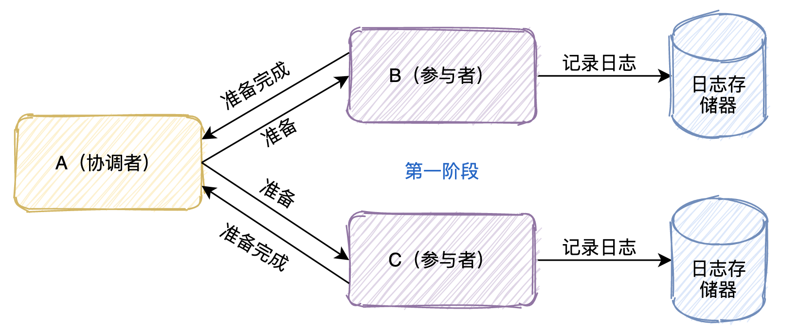
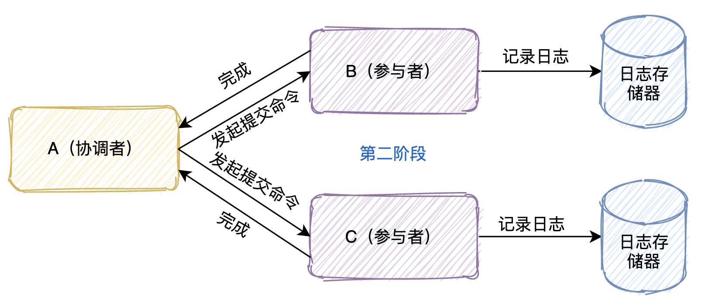
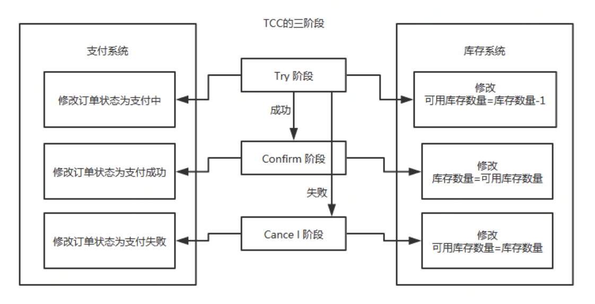
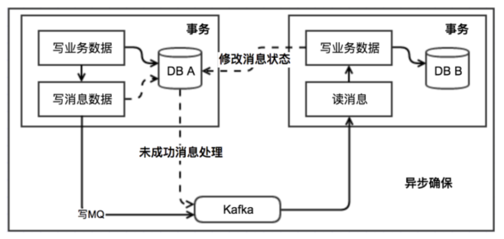
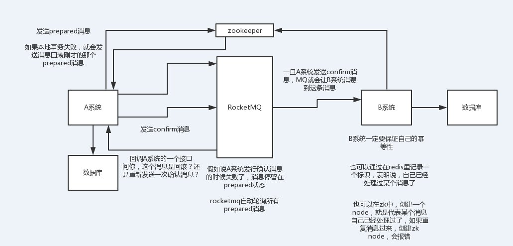
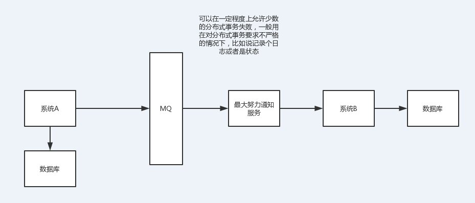

数据库事务 定义 ACID 提交 回滚 不同db区别

JDBC事务   ORM支持  redis事务 JTA JPA等

隔离级别 脏读 幻读 不可重复读 第一类丢失 第二类丢失
传播行为  同一类中，不同类中 不同应用件 不同库

spring事务 编程式 声明式  事务失效场景 AOP @Transaction

why分布式事务 

 TCC 2PC 3PC  XA SAGAS模式 Atomiks  LCN Seata

RocketMQ事务消息  最大努力通知 本地消息表
对比 选型

异步线程与事务区别

https://www.cnblogs.com/dyzcs/p/13780668.html

https://zhuanlan.zhihu.com/p/183753774

微信收藏

https://mp.weixin.qq.com/s/_VdDBBsnej4uombcZtcs2A

https://mp.weixin.qq.com/s/Y9d_xyU9xw05QsHz9cYkVQ

https://mp.weixin.qq.com/s/CO9SBEyhh62rwpRqKCi9Tw


# 1. 基础概念

## 1.1 什么是事务
事务可以看做是一次大的活动，它由不同的小活动组成，这些活动要么全部成功，要么全部失败。

## 1.2 数据库事务
在计算机系统中，更多的是通过关系型数据库来控制事务，这是利用数据库本身的事务特性来实现的，因此叫数据库事务，由于应用主要靠关系数据库来控制事务，而数据库通常和应用在同一个服务器，所以基于关系型数据库的事务又被称为本地事务。

数据库事务的四大特性：ACID
**A（Atomic）**：原子性，构成事务的所有操作，要么都执行完成，要么全部不执行，不可能出现部分成功部分失败的情况。
**C（Consistency）**：一致性，在事务执行前后，数据库的一致性约束没有被破坏。比如：张三向李四转 100 元，转账前和转账后的数据是正确状态这叫一致性，如果出现张三转出 100 元，李四账户没有增加 100 元这就出现了数 据错误，就没有达到一致性。
**I（Isolation）**：隔离性，数据库中的事务一般都是并发的，隔离性是指并发的两个事务的执行互不干扰，一个事务不能看到其他事务的运行过程的中间状态。通过配置事务隔离级别可以比避免脏读、重复读问题。
**D（Durability）**：持久性，事务完成之后，该事务对数据的更改会持久到数据库，且不会被回滚。

数据库事务在实现时会将一次事务的所有操作全部纳入到一个不可分割的执行单元，该执行单元的所有操作要么都成功，要么都失败，只要其中任一操作执行失败，都将导致整个事务的回滚。

## 1.3 隔离级别

## 1.4 传播行为

# 2 Spring事务

# 3 分布式事务

https://www.toutiao.com/a6934602543481963016/?channel=&source=search_tab

https://www.toutiao.com/a6872523766392422926/?channel=&source=search_tab

分布式系统会把一个应用系统拆分为可独立部署的多个服务，因此需要服务与服务之间远程协作才能完成事务操作，这种分布式系统环境下由不同的服务之间通过网络远程协作完成事务称之为**分布式事务**，例如用户注册送积分事务、创建订单减库存事务，银行转账事务等都是分布式事务。

我们知道本地事务依赖数据库本身提供的事务特性来实现，因此以下逻辑可以控制本地事务：
```
begin transaction；    //1.本地数据库操作：张三减少金额    //2.本地数据库操作：李四增加金额commit transation;
```
但是在分布式环境下，会变成下边这样：
```
begin transaction；    //1.本地数据库操作：张三减少金额    //2.远程调用：让李四增加金额commit transation;
```
可以设想，当远程调用让李四增加金额成功了，由于网络问题远程调用并没有返回，此时本地事务提交失败就回滚了张三减少金额的操作，此时张三和李四的数据就不一致了。

因此在分布式架构的基础上，传统数据库事务就无法使用了，张三和李四的账户不在一个数据库中甚至不在一个应用系统里，实现转账事务需要通过远程调用，由于网络问题就会导致分布式事务问题。

## 1.4 产生场景
1. **跨JVM进程产生分布式事务**
   典型的场景就是微服务架构：微服务之间通过远程调用完成事务操作。比如：订单微服务和库存微服务，下单的同时订单微服务请求库存微服务减少库存。订单微服务和库存微服务即使访问同一个数据库也会产生分布式事务，原因就是跨JVM进程，两个微服务持有了不同的数据库链接进行数据库操作，此时产生分布式事务。
2. **跨数据库实例产生分布式事务**
   单体系统访问多个数据库实例当单体系统需要访问多个数据库（实例）时就会产生分布式事务。比如：用户信息和订单信息分别在两个MySQL实例存储，用户管理系统删除用户信息，需要分别删除用户信息及用户的订单信息，由于数据分布在不同的数据实例，需要通过不同的数据库链接去操作数据，此时产生分布式事务。

若起新线程操作数据库，则数据库链接不同，属于不同事务。

## 2 解决方案

### 2.1 两阶段提交(2PC)

即XA方案，熟悉mysql的同学对两阶段提交应该颇为熟悉，mysql的事务就是通过**日志系统**来完成两阶段提交的。两阶段协议可以用于单机集中式系统，由事务管理器协调多个资源管理器；也可以用于分布式系统，**由一个全局的事务管理器协调各个子系统的局部事务管理器完成两阶段提交**。
这个协议有两个角色，A节点是事务的协调者，B和C是事务的参与者。
事务的提交分成两个阶段
第一个阶段是**投票阶段**
1.协调者首先将命令写入日志
2 发一个prepare命令给B和C节点这两个参与者
3.B和C收到消息后，根据自己的实际情况，判断自己的实际情况是否可以提交
4.将处理结果记录到日志系统
5.将结果返回给协调者


第二个阶段是**决定阶段**
当A节点收到B和C参与者所有的确认消息后
判断所有协调者是否都可以提交如果可以则写入日志并且发起commit命令有一个不可以则写入日志并且发起abort命令
参与者收到协调者发起的命令，执行命令
将执行命令及结果写入日志
返回结果给协调者


**可能会存在哪些问题？**
- 单点故障：一旦事务管理器出现故障，整个系统不可用
- 数据不一致：在阶段二，如果事务管理器只发送了部分 commit 消息，此时网络发生异常，那么只有部分参与者接收到 commit 消息，也就是说只有部分参与者提交了事务，使得系统数据不一致。
- 响应时间较长：整个消息链路是串行的，要等待响应结果，不适合高并发的场景
- 不确定性：当协事务管理器发送 commit 之后，并且此时只有一个参与者收到了 commit，那么当该参与者与事务管理器同时宕机之后，重新选举的事务管理器无法确定该条消息是否提交成功。

一般来说，我们的规定和规范，是要求说每个服务只能操作自己对应的一个数据库。如果你要操作别的服务对应的库，不允许直连别的服务的库，违反微服务架构的规范，你随便交叉胡乱访问，几百个服务的话，全体乱套，这样的一套服务是没法管理的，没法治理的，经常数据被别人改错，自己的库被别人写挂。如果你要操作别人的服务的库，你必须是通过调用别的服务的接口来实现，绝对不允许你交叉访问别人的数据库！

### 2.2 三阶段提交(3PC)

三阶段提交又称3PC，相对于2PC来说增加了CanCommit阶段和超时机制。 如果段时间内没有收到协调者的commit请求，那么就会自动进行commit，解决了2PC单点故障的问题。
但是性能问题和不一致问题仍然没有根本解决。下面我们还是一起看下三阶段流程的是什么样的？

- 第一阶段：**CanCommit阶段** 这个阶段所做的事很简单，就是协调者询问事务参与者，你是否有能力完成此次事务。如果都返回yes，则进入第二阶段，有一个返回no或等待响应超时，则中断事务，并向所有参与者发送abort请求
- 第二阶段：**PreCommit阶段** 此时协调者会向所有的参与者发送PreCommit请求，参与者收到后开始执行事务操作，并将Undo和Redo信息记录到事务日志中。参与者执行完事务操作后（此时属于未提交事务的状态），就会向协调者反馈“Ack”表示我已经准备好提交了，并等待协调者的下一步指令。
- 第三阶段：**DoCommit阶段** 在阶段二中如果所有的参与者节点都可以进行PreCommit提交，那么协调者就会从“预提交状态”转变为“提交状态”。然后向所有的参与者节点发送"doCommit"请求，参与者节点在收到提交请求后就会各自执行事务提交操作，并向协调者节点反馈“Ack”消息，协调者收到所有参与者的Ack消息后完成事务。 相反，如果有一个参与者节点未完成PreCommit的反馈或者反馈超时，那么协调者都会向所有的参与者节点发送abort请求，从而中断事务。

### 2.3 补偿事务TCC

TCC其实就是采用的补偿机制，其核心思想是：**针对每个操作，都要注册一个与其对应的确认和补偿（撤销）操作**。它分为三个阶段：

**Try,Confirm,Cancel**

- Try阶段主要是对**业务系统做检测及资源预留**
- Confirm 阶段主要是对**业务系统做确认提交**，Try阶段执行成功并开始执行 Confirm阶段时，默认 Confirm阶段是不会出错的。即：只要Try成功，Confirm一定成功。
- Cancel 阶段主要是在业务执行错误，需要回滚的状态下执行的业务取消，**预留资源释放**。

比如下一个订单减一个库存：


执行流程：

- Try阶段：订单系统将当前订单状态设置为支付中，库存系统校验当前剩余库存数量是否大于1，然后将可用库存数量设置为库存剩余数量-1，如果Try阶段**执行成功**，执行Confirm阶段，将订单状态修改为支付成功，库存剩余数量修改为可用库存数量如果Try阶段**执行失败**，执行Cancel阶段，将订单状态修改为支付失败，可用库存数量修改为库存剩余数量

比如说跨银行转账的时候，要涉及到两个银行的分布式事务，如果用TCC方案来实现，思路是这样：

1）Try阶段：先把两个银行账户中的资金给它冻结住就不让操作了

2）Confirm阶段：执行实际的转账操作，A银行账户的资金扣减，B银行账户的资金增加

3）Cancel阶段：如果任何一个银行的操作执行失败，那么就需要回滚进行补偿，就是比如A银行账户如果已经扣减了，但是B银行账户资金增加失败了，那么就得把A银行账户资金给加回去


TCC 事务机制相比于上面介绍的2PC，解决了其几个缺点：

- 1.**解决了协调者单点**，由主业务方发起并完成这个业务活动。业务活动管理器也变成多点，引入集群。
- 2.**同步阻塞**：引入超时，超时后进行补偿，并且不会锁定整个资源，将资源转换为业务逻辑形式，粒度变小。
- 3.**数据一致性**，有了补偿机制之后，由业务活动管理器控制一致性

总之，TCC 就是通过代码人为实现了两阶段提交，不同的业务场景所写的代码都不一样，并且很大程度的**增加**了业务代码的**复杂度**，因此，这种模式并不能很好地被复用。

### 2.4 本地消息表



执行流程：

- 消息生产方，需要额外建一个消息表，并**记录消息发送状态**。消息表和业务数据要在一个事务里提交，也就是说他们要在一个数据库里面。然后消息会经过MQ发送到消息的消费方。如果消息发送失败，会进行重试发送。
- 消息消费方，需要**处理**这个**消息**，并完成自己的业务逻辑。此时如果本地事务处理成功，表明已经处理成功了如果处理失败，那么就会重试执行。如果是**业务上面的失败**，可以给生产方**发送一个业务补偿消息**，通知生产方进行回滚等操作。
- 生产方和消费方定时扫描本地消息表，把还没处理完成的消息或者失败的消息再发送一遍。

1）A系统在自己本地一个事务里操作同时，插入一条数据到消息表

2）接着A系统将这个消息发送到MQ中去

3）B系统接收到消息之后，在一个事务里，往自己本地消息表里插入一条数据，同时执行其他的业务操作，如果这个消息已经被处理过了，那么此时这个事务会回滚，这样保证不会重复处理消息

4）B系统执行成功之后，就会更新自己本地消息表的状态以及A系统消息表的状态

5）如果B系统处理失败了，那么就不会更新消息表状态，那么此时A系统会定时扫描自己的消息表，如果有没处理的消息，会再次发送到MQ中去，让B再次处理

6）这个方案保证了最终一致性，哪怕B事务失败了，但是A会不断重发消息，直到B那边成功为止

这个方案说实话最大的问题就在于严重依赖于数据库的消息表来管理事务啥的？？？这个会导致如果是高并发场景咋办呢？咋扩展呢？所以一般确实很少用。


### 2.5 消息事务
即可靠消息最终一致性方案，消息事务的原理是将两个事务**通过消息中间件进行异步解耦**，和上述的本地消息表有点类似，但是是通过消息中间件的机制去做的，其本质就是'将本地消息表封装到了消息中间件中'。

执行流程：

- 发送prepare消息到消息中间件
- 发送成功后，执行本地事务如果事务执行成功，则commit，消息中间件将消息下发至消费端；如果事务执行失败，则回滚，消息中间件将这条prepare消息删除
- 消费端接收到消息进行消费，如果消费失败，则不断重试



大概的意思就是：

1）A系统先发送一个prepared消息到mq，如果这个prepared消息发送失败那么就直接取消操作别执行了

2）如果这个消息发送成功了，那么接着执行本地事务，如果成功就告诉mq发送确认消息，如果失败就告诉mq回滚消息

3）如果发送了确认消息，那么此时B系统会接收到确认消息，然后执行本地的事务

4）mq会自动定时轮询所有prepared消息回调你的接口，问你，这个消息是不是本地事务处理失败了，所有没发送确认消息？那是继续重试还是回滚？一般来说这里你就可以查下数据库看之前本地事务是否执行，如果回滚了，那么这里也回滚吧。这个就是避免可能本地事务执行成功了，别确认消息发送失败了。

5）这个方案里，要是系统B的事务失败了咋办？重试咯，自动不断重试直到成功，如果实在是不行，要么就是针对重要的资金类业务进行回滚，比如B系统本地回滚后，想办法通知系统A也回滚；或者是发送报警由人工来手工回滚和补偿


这种方案也是实现了**最终一致性**，对比本地消息表实现方案，不需要再建消息表，**不再依赖本地数据库事务**了，所以这种方案更适用于高并发的场景。目前市面上实现该方案的**只有阿里的 RocketMQ**。

### 2.6 最大努力通知

最大努力通知的方案实现比较简单，适用于一些最终一致性要求较低的业务。



执行流程：

- 系统 A 本地事务执行完之后，发送个消息到 MQ；

- 这里会有个专门消费 MQ 的服务，这个服务会消费 MQ 并调用系统 B 的接口；

- 要是系统 B 执行成功就 ok 了；要是系统 B 执行失败了，那么最大努力通知服务就定时尝试重新调用系统 B, 反复 N 次，最后还是不行就放弃。

适用场景：

### 2.7 SAGA事务模型

Saga事务模型又叫做长时间运行的事务，其核心思想是**将长事务拆分为多个本地短事务**，由Saga事务协调器协调，如果正常结束那就正常完成，如果**某个步骤失败，则根据相反顺序一次调用补偿操作**。

Seata框架中一个分布式事务包含3中角色：

**Transaction Coordinator (TC)**： 事务协调器，维护全局事务运行状态，负责协调并驱动全局事务提交或回滚。 **Transaction Manager (TM)**： 控制全局事务边界，负责开启一个全局事务，并最终发起全局提交或全局回滚的决议。 

**Resource Manager (RM)**： 控制分支事务，负责分支注册、状态汇报，并接收事务协调器的指令，驱动分支（本地）事务的提交和回滚。

seata框架**为每一个RM维护了一张UNDO_LOG表**，其中保存了每一次本地事务的回滚数据。

具体流程： 

1.首先TM 向 TC 申请**开启一个全局事务**，全局事务**创建**成功并生成一个**全局唯一的 XID**。

2.XID 在微服务调用链路的上下文中传播。

3.RM 开始执行这个分支事务，RM首先解析这条SQL语句，**生成对应的UNDO_LOG记录**。下面是一条UNDO_LOG中的记录，UNDO_LOG表中记录了分支ID，全局事务ID，以及事务执行的redo和undo数据以供二阶段恢复。

4.RM在同一个本地事务中**执行业务SQL和UNDO_LOG数据的插入**。在提交这个本地事务前，RM会向TC**申请关于这条记录的全局锁**。如果申请不到，则说明有其他事务也在对这条记录进行操作，因此它会在一段时间内重试，重试失败则回滚本地事务，并向TC汇报本地事务执行失败。

5.RM在事务提交前，**申请到了相关记录的全局锁**，然后直接提交本地事务，并向TC**汇报本地事务执行成功**。此时全局锁并没有释放，全局锁的释放取决于二阶段是提交命令还是回滚命令。

6.TC根据所有的分支事务执行结果，向RM**下发提交或回滚**命令。

- RM如果**收到TC的提交命令**，首先**立即释放**相关记录的全局**锁**，然后把提交请求放入一个异步任务的队列中，马上返回提交成功的结果给 TC。异步队列中的提交请求真正执行时，只是删除相应 UNDO LOG 记录而已。
- RM如果**收到TC的回滚命令**，则会开启一个本地事务，通过 XID 和 Branch ID 查找到相应的 UNDO LOG 记录。将 UNDO LOG 中的后镜与当前数据进行比较，如果不同，说明数据被当前全局事务之外的动作做了修改。这种情况，需要根据配置策略来做处理。如果相同，根据 UNDO LOG 中的前镜像和业务 SQL 的相关信息生成并执行回滚的语句并执行，然后提交本地事务达到回滚的目的，最后释放相关记录的全局锁。

总结
可以看出 2PC 和 3PC 是一种强一致性事务，不过还是有数据不一致，阻塞等风险，而且只能用在数据库层面。而 TCC 是一种补偿性事务思想，适用的范围更广，在业务层面实现，因此对业务的侵入性较大，每一个操作都需要实现对应的三个方法。本地消息表、事务消息和最大努力通知其实都是最终一致性事务，因此适用于一些对时间不敏感的业务。

99%的分布式接口调用，不要做分布式事务，直接就是监控（发邮件、发短信）、记录日志（一旦出错，完整的日志）、事后快速的定位、排查和出解决方案、修复数据。

要用分布式事务的时候，一定是有成本，代码会很复杂，开发很长时间，性能和吞吐量下跌，系统更加复杂更加脆弱反而更加容易出bug；好处，如果做好了，TCC、可靠消息最终一致性方案，一定可以100%保证你那快数据不会出错。1%，0.1%，0.01%的业务，资金、交易、订单，我们会用分布式事务方案来保证，会员积分、优惠券、商品信息，其实不要这么搞了。

## 3 分布式事务框架
TX-LCN
SEATA


