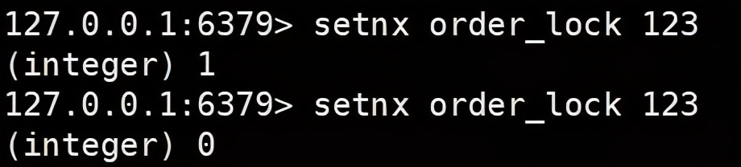

why分布式锁

https://mp.weixin.qq.com/s/yXe54xs5iPe2hlL5wsunbg

# 1 需求背景

​        为保证一个方法或属性在高并发情况下的同一时间只能被同一个线程执行，在传统单体应用单机部署的情况下，可以使用Java并发API进行互斥控制。但是，随着业务发展的需要，原单体单机部署的系统被演化成分布式集群系统后，由于分布式系统多线程、多进程并且分布在不同机器上，这将使原单机部署情况下的并发控制锁策略失效，单纯的Java API并不能提供分布式锁的能力。为了解决这个问题就需要一种跨JVM的互斥机制来控制共享资源的访问，这就是分布式锁要解决的问题。

分布式锁应具备如下条件：
> 1、排他性，在分布式系统环境下，一个方法在同一时间只能被一个机器的一个线程执行； 
> 2、高可用的获取锁与释放锁； 
> 3、高性能的获取锁与释放锁； 
> 4、具备可重入特性； 
> 5、具备锁失效机制，防止死锁； 
> 6、具备非阻塞锁特性，即没有获取到锁将直接返回获取锁失败
> 7、排队机制，多节点获取同一把锁时可能需要排队机制
> 8、自动续期，避免代码没执行完锁就释放
> 

# 2  常见方案

## 2.1 基于db

乐观锁/悲观锁(select for update)/唯一性索引

```sql
CREATE TABLE `lock_table` (
  `id` int(11) unsigned NOT NULL COMMENT '主键',
  `key_id` bigint(20) NOT NULL COMMENT '分布式key',
  `memo` varchar(43) NOT NULL DEFAULT '' COMMENT '可记录操作内容',
  `update_time` datetime NOT NULL COMMENT '更新时间',
  PRIMARY KEY (`id`,`key_id`),
  UNIQUE KEY `key_id` (`key_id`) USING BTREE
) ENGINE=InnoDB DEFAULT CHARSET=utf8;
```

key_id作为分布式key用来并发控制，memo可用来记录一些操作内容（比如memo可用来支持重入特性，标记下当前加锁的client和加锁次数）。将key_id设置为唯一索引，保证了针对同一个key_id只有一个加锁（数据插入）能成功。此时lock和unlock伪代码如下：

```java
def lock ：
    exec sql: insert into lock_table(key_id, memo, update_time) values (key_id, memo, NOW())
    if result == true :
        return true
    else :
        return false

def unlock ：
    exec sql: delete from lock_table where key_id = 'key_id' and memo = 'memo'
```

注意，伪代码中的lock操作是非阻塞锁，也就是tryLock，如果想实现阻塞（或者阻塞超时）加锁，只修反复执行lock伪代码直到加锁成功为止即可。

1、死锁问题：基于DB的分布式锁其实有一个问题，那就是如果加锁成功后，client端宕机或者由于网络原因导致没有解锁，那么其他client就无法对该key_id进行加锁并且无法释放了。为了能够让锁失效，需要在应用层加上定时任务，去删除过期还未解锁的记录，比如删除2分钟前未解锁的伪代码如下：

```java
def clear_timeout_lock :
    exec sql : delete from lock_table where update_time <  ADDTIME(NOW(),'-00:02:00')
```

2、性能问题：因为单实例DB的TPS一般为几百，所以基于DB的分布式性能上限一般也是1k以下，一般在并发量不大的场景下该分布式锁是满足需求的，不会出现性能问题。不过DB作为分布式锁服务需要考虑单点问题，对于分布式系统来说是不允许出现单点的，一般通过数据库的同步复制，以及使用vip切换Master就能解决这个问题。

3、不支持可重入：如果想要实现可重入锁，还需要增加主机、线程名等字段来进行标注，通过这几个字段来判断和当前信息是否一致，如果一致则认为已经获取到了锁。

以上DB分布式锁是通过insert来实现的，如果加锁的数据已经在数据库中存在，那么用select xxx where key_id = xxx for udpate方式来做也是可以的。

## 2.2 基于redis

redission lua
https://www.toutiao.com/a6977609639743504907/

### 2.2.1 基于setnx实现
为实现分布式锁，在 Redis 中存在 SETNX key value 命令，意为 set if not exists(如果不存在该 key，才去 set 值)，就比如说是张三去上厕所，看厕所门锁着，他就不进去了，厕所门开着他才去。



可以看到，第一次 set 返回了 1，表示成功，但是第二次返回 0，表示 set 失败，因为已经存在这个 key 了。
当然只靠 setnx 这个命令可以吗?当然是不行的，试想一种情况，张三在厕所里，但他在里面一直没有释放，一直在里面蹲着，那外面人想去厕所全部都去不了，都想锤死他了。Redis 同理，假设已经进行了加锁，但是因为宕机或者出现异常未释放锁，就造成了所谓的“死锁”。

聪明的你们肯定早都想到了，为它设置过期时间不就好了，可以 SETEX key seconds value 命令，为指定 key 设置过期时间，单位为秒。但这样又有另一个问题，刚加锁成功，还没设置过期时间，Redis 宕机了不就又死锁了，所以说要保证原子性，要么一起成功，要么一起失败。当然我们能想到的 Redis 肯定早都为你实现好了，在 Redis 2.8 的版本后，Redis 就为我们提供了一条组合命令 SET key value ex seconds nx，加锁的同时设置过期时间。

但这样就没有问题了吗?怎么可能。试想又一种情况，厕所门肯定只能从里面开啊，张三上完厕所后张四进去锁上门，但是外面人以为还是张三在里面，而且已经过了 3 分钟了，就直接把门给撬开了，一看里面却是张四，这就很尴尬啊。换成 Redis 就是说比如一个业务执行时间很长，锁已经自己过期了，别人已经设置了新的锁，但是当业务执行完之后直接释放锁，就有可能是删除了别人加的锁，这不是乱套了吗。

所以在加锁时候，要设一个随机值，在删除锁时进行比对，如果是自己的锁，才删除。

```java
//基于jedis和lua脚本来实现 
privatestaticfinal String LOCK_SUCCESS = "OK"; 
privatestaticfinal Long RELEASE_SUCCESS = 1L; 
privatestaticfinal String SET_IF_NOT_EXIST = "NX"; 
privatestaticfinal String SET_WITH_EXPIRE_TIME = "PX"; 
 
@Override 
public String acquire() { 
    try { 
        // 获取锁的超时时间，超过这个时间则放弃获取锁 
        long end = System.currentTimeMillis() + acquireTimeout; 
        // 随机生成一个 value 
        String requireToken = UUID.randomUUID().toString(); 
        while (System.currentTimeMillis() < end) { 
            String result = jedis 
                .set(lockKey, requireToken, SET_IF_NOT_EXIST, SET_WITH_EXPIRE_TIME, expireTime); 
            if (LOCK_SUCCESS.equals(result)) { 
                return requireToken; 
            } 
            try { 
                Thread.sleep(100); 
            } catch (InterruptedException e) { 
                Thread.currentThread().interrupt(); 
            } 
        } 
    } catch (Exception e) { 
        log.error("acquire lock due to error", e); 
    }  
    return null; 
} 
 
@Override 
public boolean release(String identify) { 
    if (identify == null) { 
        return false; 
    } 
    //通过lua脚本进行比对删除操作，保证原子性 
    String script = "if redis.call('get', KEYS[1]) == ARGV[1] then return redis.call('del', KEYS[1]) else return 0 end"; 
    Object result = new Object(); 
    try { 
        result = jedis.eval(script, Collections.singletonList(lockKey), 
            Collections.singletonList(identify)); 
        if (RELEASE_SUCCESS.equals(result)) { 
            log.info("release lock success, requestToken:{}", identify); 
            return true; 
        } 
    } catch (Exception e) { 
        log.error("release lock due to error", e); 
    } finally { 
        if (jedis != null) { 
            jedis.close(); 
        } 
    } 
 
    log.info("release lock failed, requestToken:{}, result:{}", identify, result); 
    return false; 
} 
```

可能问题：

死锁问题（设置过期时间）

原子问题（lua脚本执行）

释放错锁（设置value值绑定，删除时判断）

单点问题（如果redis是单实例）

同步问题（redis主从异步复制，若主节点挂且key还没同步到从节点，此时从节点切换为主节点，别人会拿到锁）

续期问题（无自动续期机制，可能任务没有执行完成锁却已经过期其他线程可以获取锁造成业务问题）

排队问题（多节点请求同一把锁无排队控制）

### 2.2.2 使用redisson

https://www.toutiao.com/a6907120405061042692/?channel=&source=search_tab

思考：加锁和释放锁的原子性可以用 lua 脚本来保证，那锁的自动续期改如何实现呢?

Redisson ，顾名思义，Redis 的儿子，本质上还是 Redis 加锁，不过是对 Redis 做了很多封装，它不仅提供了一系列的分布式的 Java 常用对象，还提供了许多分布式服务。在引入 Redisson 的依赖后，就可以直接进行调用：

```xml
<dependency> 
    <groupId>org.redisson</groupId> 
    <artifactId>redisson</artifactId> 
    <version>3.13.4</version> 
</dependency> 
```
先来一段 Redisson 的加锁代码：
```java
private void test() { 
    //分布式锁名  锁的粒度越细，性能越好 
    RLock lock = redissonClient.getLock("test_lock"); 
    lock.lock(); 
    try { 
        //具体业务...... 
    } finally { 
        lock.unlock(); 
    } 
} 
```
就是这么简单，使用方法 jdk 的 ReentrantLock 差不多，并且也支持 ReadWriteLock(读写锁)、Reentrant Lock(可重入锁)、Fair Lock(公平锁)、RedLock(红锁)等各种锁，详细可以参照redisson官方文档来查看。

Redisson 到底有哪些优势呢? 锁的**自动续期**(默认30秒)，如果业务超长，运行期间会自动给锁续上新的 30s，不用担心业务执行时间超长而锁被自动删掉。加锁的业务只要运行完成，就不会给当前续期，即便不手动解锁，锁默认在 30s 后删除，不会造成死锁问题。前面也提到了锁的自动续期，我们来看看 Redisson 是如何来实现的。

先说明一下，这里主要讲的是 Redisson 中的 RLock，也就是可重入锁，有两种实现方法：

```java
// 最常见的使用方法 
lock.lock(); 
 
// 加锁以后10秒钟自动解锁 
// 无需调用unlock方法手动解锁 
lock.lock(10, TimeUnit.SECONDS); 
```
而只有无参的方法是提供锁的自动续期操作的，内部使用的是“看门狗”机制。

总结一下，就是当我们指定锁过期时间，那么锁到时间就会自动释放。如果没有指定锁过期时间，就使用看门狗的默认时间 30s，只要占锁成功，就会启动一个定时任务，每隔10s给锁设置新的过期时间，时间为看门狗的默认时间，直到锁释放。

小结：虽然 lock() 有自动续锁机制，但是开发中还是推荐使用 lock(time，timeUnit)，因为它省掉了整个续期带来的性能损，可以设置过期时间长一点，搭配 unlock()。若业务执行完成，会手动释放锁，若是业务执行超时，那一般我们服务也都会设置业务超时时间，就直接报错了，报错后就会通过设置的过期时间来释放锁。

```java
public void test() { 
    RLock lock = redissonClient.getLock("test_lock"); 
    lock.lock(30, TimeUnit.SECONDS); 
    try { 
        //.......具体业务 
    } finally { 
        //手动释放锁 
        lock.unlock(); 
    } 
} 
```

**RedLock算法**

这个场景是假设有一个redis cluster，有5个redis master实例。然后执行如下步骤获取一把锁： 

1）获取当前时间戳，单位是毫秒

2）跟上面类似，轮流尝试在每个master节点上创建锁，过期时间较短，一般就几十毫秒

3）尝试在大多数节点上建立一个锁，比如5个节点就要求是3个节点（n / 2 +1）

4）客户端计算建立好锁的时间，如果建立锁的时间小于超时时间，就算建立成功了

5）要是锁建立失败了，那么就依次删除这个锁

6）只要别人建立了一把分布式锁，你就得不断轮询去尝试获取锁

## 2.3 基于zk

**ZK是啥？**

他是个数据库，文件存储系统，并且有监听通知机制（观察者模式）。

**应用场景**：

服务注册与订阅（共用节点）、分布式通知（监听znode）、服务命名（znode特性）
数据订阅、发布（watcher）、分布式锁（临时节点）、元数据存储

**ZK节点**

zk的节点类型有4大类:

持久化节点（zk断开节点还在）、持久化顺序编号目录节点、临时目录节点（客户端断开后节点删除）、临时目录编号目录节点

节点名称都是唯一的。

**创建节点**

ZK 中存在 create [-s] [-e] path [data] 命令，-s 为创建有序节点，-e 创建临时节点。

Zk性能上可能并没有缓存服务高。每次在加锁和释放锁的过程中，都要动态创建、销毁瞬时节点来实现锁功能。

ZK中创建和删除节点只能通过Leader服务器来执行，然后将数据同步到所有的Follower机器上。

使用Zookeeper也有可能带来并发问题，只是并不常见而已。由于网络抖动，客户端可ZK集群的session连接断了，那么zk以为客户端挂了，就会删除临时节点，这时候其他客户端就可以获取到分布式锁了。就可能产生并发问题，这个问题不常见是因为zk有重试机制，一旦zk集群检测不到客户端的心跳，就会重试，Curator客户端支持多种重试策略。多次重试之后还不行的话才会删除临时节点。

### 2.3.1 基本原理

基于ZK的分布式锁就是使用它的**临时有序节点**和**事件监听机制**来实现的。

原理就是：当某客户端要进行加锁时，就在zookeeper上的某个指定节点的目录下，去生成一个唯一的临时有序节点， 然后判断自己是否是这些有序节点中序号最小的一个，如果是，则算是获取了锁。如果不是，则说明没有获取到锁，那么就需要在序列中找到比自己小的那个节点，并对其调用exist()方法，对其注册事件监听，当监听到这个节点被删除了，那就再去判断一次自己当初创建的节点是否变成了序列中最小的。如果是，则获取锁，如果不是，则重复上述步骤。

当释放锁的时候，只需将这个临时节点删除即可。

**主要流程**：

当第一个线程进来时会去父节点上创建一个临时的顺序节点。

第二个线程进来发现锁已经被持有了，就会为当前持有锁的节点注册一个 watcher 监听器。

第三个线程进来发现锁已经被持有了，因为是顺序节点的缘故，就会为上一个节点去创建一个 watcher 监听器。
当第一个线程释放锁后，删除节点，由它的下一个节点去占有锁。

为什么是临时节点？和Redis过期时间一个道理，就算 ZK 服务器宕机，临时节点会随着服务器的宕机而消失，避免了死锁的情况。

为什么是顺序节点？非顺序节点的话，每进来一个线程都会去持有锁的节点上注册监听器，容易引发“羊群效应”。

```java
public class ZooKeeperDistributedLock implements Watcher {  
    private ZooKeeper zk; 
    private String locksRoot = "/locks"; 
    private String productId; 
    private String waitNode; 
    private String lockNode; 
    private CountDownLatch latch; 
    private CountDownLatch connectedLatch = new CountDownLatch(1); 
    private int sessionTimeout = 30000; 
 
    public ZooKeeperDistributedLock(String productId) { 
        this.productId = productId; 
        try { 
            String address = "192.168.189.131:2181,192.168.189.132:2181"; 
            zk = new ZooKeeper(address, sessionTimeout, this); 
            connectedLatch.await(); 
        } catch (IOException e) { 
            throw new LockException(e); 
        } catch (KeeperException e) { 
            throw new LockException(e); 
        } catch (InterruptedException e) { 
            throw new LockException(e); 
        } 
    } 
 
    public void process(WatchedEvent event) { 
        if (event.getState() == KeeperState.SyncConnected) { 
            connectedLatch.countDown(); 
            return; 
        } 
 
        if (this.latch != null) { 
            this.latch.countDown(); 
        } 
    } 
 
    public void acquireDistributedLock() { 
        try { 
            if (this.tryLock()) { 
                return; 
            } else { 
                waitForLock(waitNode, sessionTimeout); 
            } 
        } catch (KeeperException e) { 
            throw new LockException(e); 
        } catch (InterruptedException e) { 
            throw new LockException(e); 
        } 
    } 
    // 获取锁 
    public boolean tryLock() { 
        try { 
        // 传入进去的locksRoot + “/” + productId 
        // 假设productId代表了一个商品id，比如说1 
        // locksRoot = locks 
        // /locks/10000000000，/locks/10000000001，/locks/10000000002 
        lockNode = zk.create(locksRoot + "/" + productId, new byte[0], ZooDefs.Ids.OPEN_ACL_UNSAFE, CreateMode.EPHEMERAL_SEQUENTIAL); 
 
        // 看看刚创建的节点是不是最小的节点 
        // locks：10000000000，10000000001，10000000002 
        List<String> locks = zk.getChildren(locksRoot, false); 
        Collections.sort(locks); 
 
        if(lockNode.equals(locksRoot+"/"+ locks.get(0))){ 
            //如果是最小的节点,则表示取得锁 
            return true; 
        } 
 
        //如果不是最小的节点，找到比自己小1的节点 
      int previousLockIndex = -1; 
            for(int i = 0; i < locks.size(); i++) { 
        if(lockNode.equals(locksRoot + “/” + locks.get(i))) { 
                    previousLockIndex = i - 1; 
            break; 
        } 
       } 
 
       this.waitNode = locks.get(previousLockIndex); 
        } catch (KeeperException e) { 
            throw new LockException(e); 
        } catch (InterruptedException e) { 
            throw new LockException(e); 
        } 
        return false; 
    } 
 
    private boolean waitForLock(String waitNode, long waitTime) throws InterruptedException, KeeperException { 
        Stat stat = zk.exists(locksRoot + "/" + waitNode, true); 
        if (stat != null) { 
            this.latch = new CountDownLatch(1); 
            this.latch.await(waitTime, TimeUnit.MILLISECONDS); 
            this.latch = null; 
        } 
        return true; 
    } 
 
    //释放锁 
    public void unlock() { 
        try { 
            System.out.println("unlock " + lockNode); 
            zk.delete(lockNode, -1); 
            lockNode = null; 
            zk.close(); 
        } catch (InterruptedException e) { 
            e.printStackTrace(); 
        } catch (KeeperException e) { 
            e.printStackTrace(); 
        } 
    } 
    // 异常 
    public class LockException extends RuntimeException { 
        private static final long serialVersionUID = 1L;  
        public LockException(String e) { 
            super(e); 
        }  
        public LockException(Exception e) { 
            super(e); 
        } 
    } 
    
    // 如果有一把锁，被多个人给竞争，此时多个人会排队，第一个拿到锁的人会执行，然后释放锁，后面的每个人都会去监听排在自己前面的那个人创建的node上，一旦某个人释放了锁，排在自己后面的人就会被zookeeper给通知，一旦被通知了之后，就ok了，自己就获取到了锁，就可以执行代码了
} 
```
**总结**

zk通过**临时节点**，解决掉了**死锁**的问题，一旦客户端获取到锁之后突然挂掉（Session连接断开），那么这个临时节点就会自动删除掉，其他客户端自动获取锁，该场景也可能产生并发安全问题。

zk通过节点排队监听的机制，也实现了**阻塞**的原理，其实就是个递归在那无限等待最小节点释放的过程。

上面没实现锁的**可重入**，但是也很好实现，可以带上线程信息就可以了，或者机器信息这样的唯一标识，获取的时候判断一下。

zk的集群也是**可用**的，只要半数以上的或者，就可以对外提供服务了。

### 2.3.2 使用Curator

和 Redisson 类似，我们在实际使用 Zookeeper 作为分布式锁的时候可以用**Curator** 来作为开发 SDK，它同样封装了很多实现，包括可重入锁的实现，减轻了使用者的负担。

## 2.4 基于其他分布式中间件

比如consul、ectd等


# 3 对比选型
从上面介绍的3种分布式锁的设计与实现中，我们可以看出每种实现都有各自的特点，针对潜在的问题有不同的解决方案，归纳如下：
- 性能：redis > zookeeper > db。
- 避免死锁：DB通过应用层设置定时任务来删除过期还未释放的锁，redis通过设置超时时间来解决，而zookeeper是通过临时节点来解决。
- 可用性：DB可通过数据库同步复制，vip切换master来解决，redis可通过集群或者master-slave方式来解决，zookeeper本身自己是通过zab协议集群部署来解决的。注意，DB和redis的复制一般都是异步的，也就是说某些时刻分布式锁发生故障可能存在数据不一致问题，而zookeeper本身通过zab协议保证集群内(至少n/2+1个)节点数据一致性。
- 锁唤醒：DB和redis分布式锁一般不支持唤醒机制（也可以通过应用层自己做轮询检测锁是否空闲，空闲就唤醒内部加锁线程），zookeeper可通过本身的watcher/notify机制来做。

实际应用中应根据具体情况选择合适的分布式锁，若并发量不高可使用基于db的实现。

[参考资料](https://blog.csdn.net/wuzhiwei549/article/details/80692278)