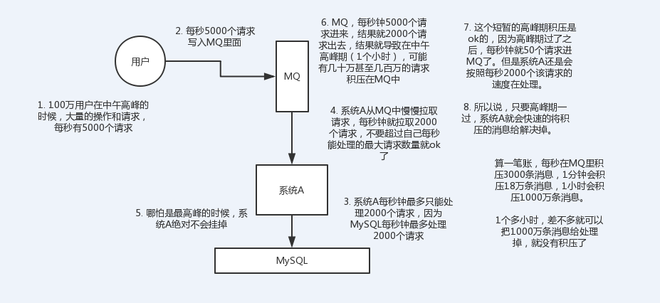
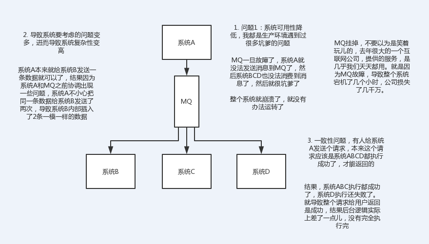
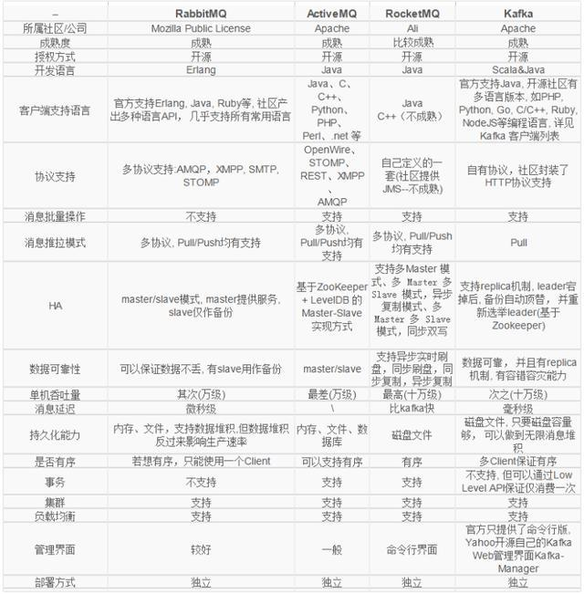
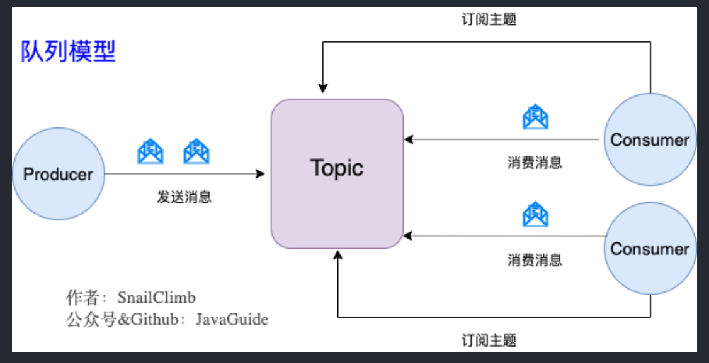
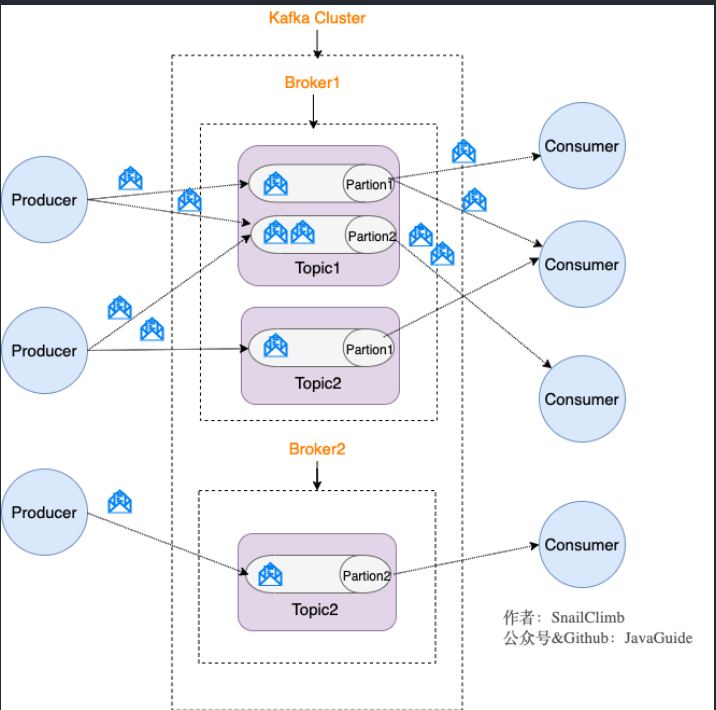
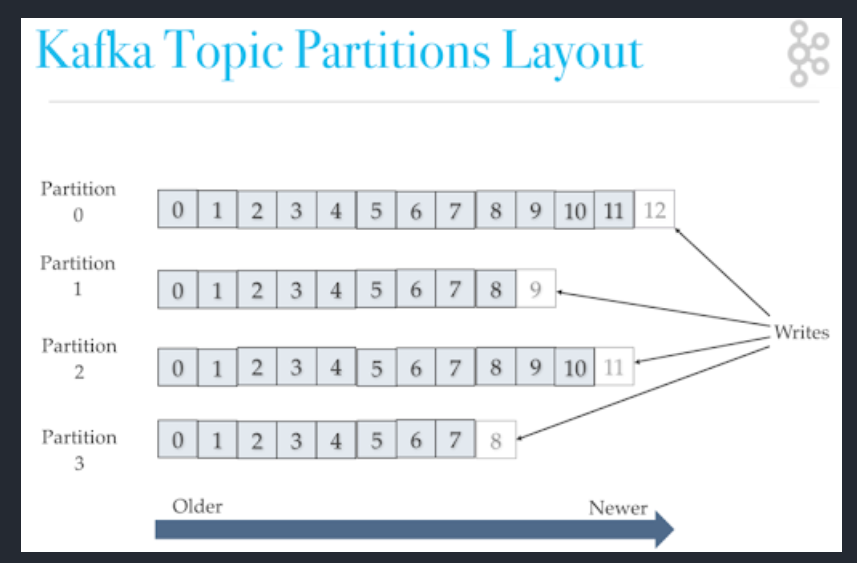
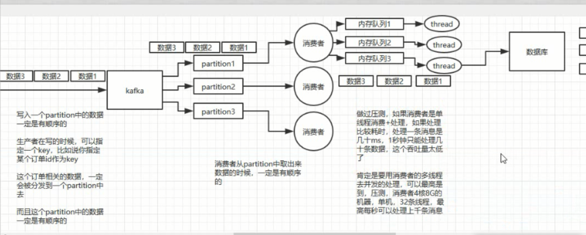
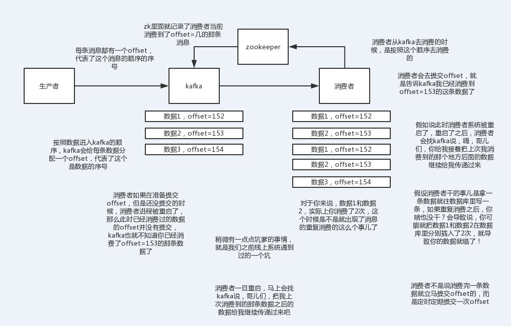
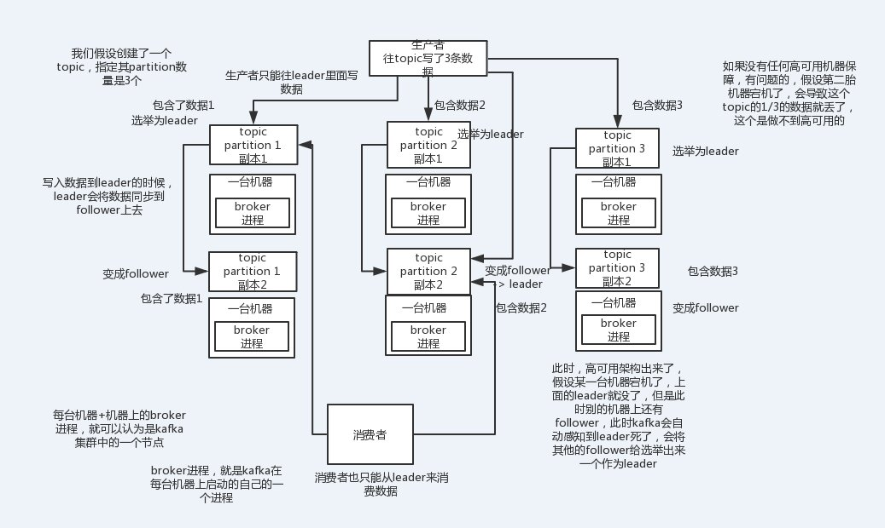

死信队列、延迟队列、推拉模式

https://www.toutiao.com/i6990332319282381319/

https://cloud.tencent.com/developer/article/1683304  消息队列问题

https://cloud.tencent.com/developer/article/1371156 选型

延迟消息如何实现

优先级消息

推拉模式：push更关注实时性。pull更关注消费者消费能力。

consumer group：同一条Message能同时被多个消费组消费，但同一group中，一条Message只会被一个consumer消费

面试官：我之前面试就见过大量的候选人，说自己项目里用了redis、mq，但是其实他并不知道自己为什么要用这个东西。其实说白了，就是为了用而用，或者是别人设计的架构，他从头到尾没思考过。

没有对自己的架构问过为什么的人，一定是平时没有思考的人，面试官对这类候选人印象通常很不好。因为进了团队担心你就木头木脑的干呆活儿，不会自己思考。

# 0 为什么使用MQ？优缺点？常用场景？项目中怎么用的MQ？
答题思路：公司项目有什么业务场景，业务场景有什么技术挑战，如果不用MQ会怎样，用了之后有什么好处和缺点？

MQ应用场景：异步处理、应用解耦、流量削锋、日志处理、消息通讯



缺点：系统可用性降低、系统复杂度提高、一致性问题

**系统可用性降低**：系统引入的外部依赖越多，越容易挂掉，本来你就是A系统调用BCD三个系统的接口就好了，人ABCD四个系统好好的，没啥问题，你偏加个MQ进来，万一MQ挂了咋整？MQ挂了，整套系统崩溃了。

 **系统复杂性提高**：硬生生加个MQ进来，你怎么保证消息没有重复消费？怎么处理消息丢失的情况？怎么保证消息传递的顺序性？堆积问题？头大头大，问题一大堆，痛苦不已 

**一致性问题**：A系统处理完了直接返回成功了，人都以为你这个请求就成功了；但是问题是，要是BCD三个系统那里，BD两个系统写库成功了，结果C系统写库失败了，咋整？你这数据就不一致了。

 所以消息队列实际是一种非常复杂的架构，你引入它有很多好处，但是也得针对它带来的坏处做各种额外的技术方案和架构来规避掉，最好之后，你会发现，妈呀，系统复杂度提升了一个数量级，也许是复杂了10倍。但是关键时刻，用，还是得用的。。。



# 1 Kafka 是什么？主要应⽤场景有哪些？ 

Kafka 是⼀个分布式流式处理平台。这到底是什么意思呢？
流平台具有三个关键功能：

1. 消息队列：发布和订阅消息流，这个功能类似于消息队列，这也是 Kafka 也被归类为消息队
列的原因。
2. 容错的持久⽅式存储记录消息流： Kafka 会把消息持久化到磁盘，有效避免了消息丢失的⻛
险·。
3. 流式处理平台： 在消息发布的时候进⾏处理， Kafka 提供了⼀个完整的流式处理类库。
Kafka 主要有两⼤应⽤场景：
1. 消息队列 ：建⽴实时流数据管道，以可靠地在系统或应⽤程序之间获取数据。
2. 数据处理： 构建实时的流数据处理程序来转换或处理数据流。

# 2 和其他消息队列相⽐,Kafka的优势在哪⾥？MQ选型？
我们现在经常提到 Kafka 的时候就已经默认它是⼀个⾮常优秀的消息队列了，我们也会经常拿它
给 RocketMQ、 RabbitMQ 对⽐。我觉得 Kafka 相⽐其他消息队列主要的优势如下：
1. 极致的性能 ：基于 Scala 和 Java 语⾔开发，设计中⼤量使⽤了批量处理和异步的思想，最
    ⾼可以每秒处理千万级别的消息。

2. ⽣态系统兼容性⽆可匹敌 ： Kafka 与周边⽣态系统的兼容性是最好的没有之⼀，尤其在⼤数
    据和流计算领域。

**MQ选型：**   


1. 如果消息队列不是将要构建系统的重点，对消息队列功能和性能没有很高的要求，只需要一个快速上手易于维护的消息队列，建议使用RabbitMQ

2. 如果系统使用消息队列主要场景是处理在线业务，比如在交易系统中用消息队列传递订单，需要低延迟和高稳定性，建议使用RocketMQ

3. 如果需要处理海量的消息，像收集日志、监控信息或是埋点这类数据，或是你的应用场景大量使用了大数据、流计算相关的开源产品，那kafka是最合适的消息队列

**kafka高性能的原因**
- 磁盘顺序读写：kafka消息不能修改以及不会从文件中间删除保证了磁盘顺序读，kafka的消息写入文件都是追加在文件末尾，不会写入文件中的某个位置(随机写)保证了磁盘顺序写。
- 数据传输的**零拷贝**
- 读写数据的批量batch处理以及压缩传输
- Pull拉模式 使用拉模式进行消息的获取消费，与消费端处理能力相符

# 3 队列模型了解吗？ Kafka 的消息模型知道吗？
发布-订阅模型:Kafka 消息模型
发布-订阅模型主要是为了解决队列模型存在的问题。

发布订阅模型（Pub-Sub） 使⽤主题（Topic） 作为消息通信载体，类似于⼴播模式；发布者发
布⼀条消息，该消息通过主题传递给所有的订阅者， 在⼀条消息⼴播之后才订阅的⽤户则是收不
到该条消息的。在发布 - 订阅模型中，如果只有⼀个订阅者，那它和队列模型就基本是⼀样的了。所以说，发布- 订阅模型在功能层⾯上是可以兼容队列模型的。
Kafka 采⽤的就是发布 - 订阅模型。
>RocketMQ 的消息模型和 Kafka 基本是完全⼀样的。唯⼀的区别是 Kafka 中没有队列这个
概念，与之对应的是 Partition（分区）。

# 4 什么是Producer、 Consumer、 Broker、 Topic、Partition？
Kafka 将⽣产者发布的消息发送到 Topic（主题） 中，需要这些消息的消费者可以订阅这些
Topic（主题） ，如下图所示：

上⾯这张图也为我们引出了， Kafka ⽐较重要的⼏个概念：
1. Producer（⽣产者） : 产⽣消息的⼀⽅。
2. Consumer（消费者） : 消费消息的⼀⽅。
3. Broker（代理） : 可以看作是⼀个独⽴的 Kafka 实例。多个 Kafka Broker 组成⼀个 Kafka
Cluster。
同时，你⼀定也注意到每个 Broker 中⼜包含了 Topic 以及 Partition 这两个重要的概念：
Topic（主题） : Producer 将消息发送到特定的主题， Consumer 通过订阅特定的 Topic(主
题) 来消费消息。
Partition（分区） : Partition 属于 Topic 的⼀部分。⼀个 Topic 可以有多个 Partition ，并且
同⼀ Topic 下的 Partition 可以分布在不同的 Broker 上，这也就表明⼀个 Topic 可以横跨多
个 Broker 。这正如我上⾯所画的图⼀样。

# 5 Kafka 的多副本机制了解吗？带来了什么好处？ 
还有⼀点我觉得⽐较重要的是 Kafka 为分区（Partition）引⼊了多副本（Replica）机制。分区
（Partition）中的多个副本之间会有⼀个叫做 leader 的家伙，其他副本称为 follower。我们发送
的消息会被发送到 leader 副本，然后 follower 副本才能从 leader 副本中拉取消息进⾏同步。
>⽣产者和消费者只与 leader 副本交互。你可以理解为其他副本只是 leader 副本的拷⻉，它
们的存在只是为了保证消息存储的安全性。当 leader 副本发⽣故障时会从 follower 中选举出⼀个 leader,但是 follower 中如果有和 leader 同步程度达不到要求的参加不了 leader 的竞选

Kafka 的多分区（Partition）以及多副本（Replica）机制有什么好处呢？
1. Kafka 通过给特定 Topic 指定多个 Partition, ⽽各个 Partition 可以分布在不同的 Broker 上,
这样便能提供⽐较好的并发能⼒（负载均衡）。
2. Partition 可以指定对应的 Replica 数, 这也极⼤地提⾼了消息存储的安全性, 提⾼了容灾能
⼒，不过也相应的增加了所需要的存储空间。

# 6 zk在kafka中的作用？新版本为何去掉了zk？
ZooKeeper 主要为 Kafka 提供元数据的管理的功能。
从图中我们可以看出， Zookeeper 主要为 Kafka 做了下⾯这些事情：
1. **Broker 注册** ：在 Zookeeper 上会有⼀个专⻔⽤来进⾏ Broker 服务器列表记录的节点。每个 Broker 在启动时，都会到 Zookeeper 上进⾏注册，即到/brokers/ids 下创建属于⾃⼰的节
点。每个 Broker 就会将⾃⼰的 IP 地址和端⼝等信息记录到该节点中去
2. **Topic 注册** ： 在 Kafka 中，同⼀个Topic 的消息会被分成多个分区并将其分布在多个
Broker 上， 这些分区信息及与 Broker 的对应关系也都是由 Zookeeper 在维护。⽐如我创
建了⼀个名字为 my-topic 的主题并且它有两个分区，对应到 zookeeper 中会创建这些⽂件
夹： /brokers/topics/my-topic/Partitions/0 、 /brokers/topics/my-topic/Partitions/1
3. **负载均衡** ：上⾯也说过了 Kafka 通过给特定 Topic 指定多个 Partition, ⽽各个 Partition 可以分布在不同的 Broker 上, 这样便能提供⽐较好的并发能⼒。 对于同⼀个 Topic 的不同
Partition， Kafka 会尽⼒将这些 Partition 分布到不同的 Broker 服务器上。当⽣产者产⽣消息
后也会尽量投递到不同 Broker 的 Partition ⾥⾯。当 Consumer 消费的时候， Zookeeper 可
以根据当前的 Partition 数量以及 Consumer 数量来实现动态负载均衡。
4. ......

# 7 kafka如何保证消息不丢失？

如何保证消息可靠传输

**⽣产者丢失消息的情况**
⽣产者(Producer) 调⽤ send ⽅法发送消息之后，消息可能因为⽹络问题并没有发送过去。所以，我们不能默认在调⽤ send ⽅法发送消息之后消息消息发送成功了。为了确定消息是发送成功，我们要判断消息发送的结果。但是要注意的是 Kafka ⽣产者(Producer) 使⽤ send ⽅法发送消息实际上是异步的操作，我们可以通过 get() ⽅法获取调⽤结果，但是这样也让它变为了同步操作，示例代码如下：

```java
SendResult<String, Object> sendResult = kafkaTemplate.send(topic, o).get();
if (sendResult.getRecordMetadata() != null) {
logger.info("⽣产者成功发送消息到" + sendResult.getProducerRecord().topic() +
"-> " + sendResult.getProducerRecord().value().toString());
}
```
但是⼀般不推荐这么做！可以采⽤为其添加回调函数的形式，示例代码如下：
```java
ListenableFuture<SendResult<String, Object>> future =
kafkaTemplate.send(topic, o);
future.addCallback(result -> logger.info("⽣产者成功发送消息到topic:{}
partition:{}的消息", result.getRecordMetadata().topic(),
result.getRecordMetadata().partition()),
ex -> logger.error("⽣产者发送消失败，原因： {}",
ex.getMessage()));
```
如果消息发送失败的话，我们检查失败的原因之后重新发送即可！
另外这⾥推荐为 Producer 的 retries （重试次数）设置⼀个⽐较合理的值，⼀般是 3 ，但是为
了保证消息不丢失的话⼀般会设置⽐较⼤⼀点。设置完成之后，当出现⽹络问题之后能够⾃动重
试消息发送，避免消息丢失。另外，建议还要设置重试间隔，因为间隔太⼩的话重试的效果就不
明显了，⽹络波动⼀次你3次⼀下⼦就重试完了。

**消费者丢失消息的情况**
我们知道消息在被追加到 Partition(分区)的时候都会分配⼀个特定的偏移量（offset）。偏移量（offset)表示 Consumer 当前消费到的 Partition(分区)的所在的位置。 Kafka 通过偏移量（offset）可以保证消息在分区内的顺序性。当消费者拉取到了分区的某个消息之后，消费者会⾃动提交了 offset。⾃动提交的话会有⼀个问题，试想⼀下，当消费者刚拿到这个消息准备进⾏真正消费的时候，突然挂掉了，消息实际上并没有被消费，但是 offset 却被⾃动提交了。解决办法也⽐较粗暴，我们⼿动关闭⾃动提交 offset，每次在真正消费完消息之后之后再⾃⼰⼿动提交 offset 。 但是，细⼼的朋友⼀定会发现，这样会带来消息被重新消费的问题。⽐如你刚刚消费完消息之后，还没提交 offset，结果⾃⼰挂掉了，那么这个消息理论上就会被消费两次。

**Kafka 弄丢了消息**
我们知道 Kafka 为分区（Partition）引⼊了多副本（Replica）机制。分区（Partition）中的多个副本之间会有⼀个叫做 leader 的家伙，其他副本称为 follower。我们发送的消息会被发送到leader 副本，然后 follower 副本才能从 leader 副本中拉取消息进⾏同步。⽣产者和消费者只与leader 副本交互。你可以理解为其他副本只是 leader 副本的拷⻉，它们的存在只是为了保证消息存储的安全性。
试想⼀种情况：假如 leader 副本所在的 broker 突然挂掉，那么就要从 follower 副本重新选出⼀个 leader ，但是 leader 的数据还有⼀些没有被 follower 副本的同步的话，就会造成消息丢失。
- 设置 acks = all
解决办法就是我们设置 acks = all。 acks 是 Kafka ⽣产者(Producer) 很重要的⼀个参数。acks 的默认值即为1，代表我们的消息被leader副本接收之后就算被成功发送。当我们配置 acks= all 代表则所有副本都要接收到该消息之后该消息才算真正成功被发送。

- 设置 replication.factor >= 3
为了保证 leader 副本能有 follower 副本能同步消息，我们⼀般会为 topic 设置 replication.factor
>= 3。这样就可以保证每个 分区(partition) ⾄少有 3 个副本。虽然造成了数据冗余，但是带来了
数据的安全性。

- 设置 min.insync.replicas > 1
⼀般情况下我们还需要设置 min.insync.replicas> 1 ，这样配置代表消息⾄少要被写⼊到 2 个副
本才算是被成功发送。 min.insync.replicas 的默认值为 1 ，在实际⽣产中应尽量避免默认值1。
但是，为了保证整个 Kafka 服务的⾼可⽤性，你需要确保 replication.factor >
min.insync.replicas 。为什么呢？设想⼀下加⼊两者相等的话，只要是有⼀个副本挂掉，整个
分区就⽆法正常⼯作了。这明显违反⾼可⽤性！⼀般推荐设置成 replication.factor =
min.insync.replicas + 1。

- 设置 unclean.leader.election.enable = false
我们最开始也说了我们发送的消息会被发送到 leader 副本，然后 follower 副本才能从 leader 副
本中拉取消息进⾏同步。多个 follower 副本之间的消息同步情况不⼀样，当我们配置了
unclean.leader.election.enable = false 的话，当 leader 副本发⽣故障时就不会从 follower 副
本中和 leader 同步程度达不到要求的副本中选择出 leader ，这样降低了消息丢失的可能性。

（1）acks=0： 表示producer不需要等待任何broker确认收到消息的回复，就可以继续发送下一条消息。性能最高，但是最容易丢消息。大数据统计报表场景，对性能要求很高，对数据丢失不敏感的情况可以用这种。

（2）acks=1： 至少要等待leader已经成功将数据写入本地log，但是不需要等待所有follower是否成功写入。就可以继续发送下一条消息。这种情况下，如果follower没有成功备份数据，而此时leader又挂掉，则消息会丢失。

（3）acks=-1或all： 这意味着leader需要等待所有备份(min.insync.replicas配置的备份个数)都成功写入日志，这种策略会保证只要有一个备份存活就不会丢失数据。这是最强的数据保证。一般除非是金融级别，或跟钱打交道的场景才会使用这种配置。当然如果min.insync.replicas配置的是1则也可能丢消息，跟acks=1情况类似。

# 8 kafka如何保证消息的消费顺序？

我们在使⽤消息队列的过程中经常有业务场景需要严格保证消息的消费顺序，⽐如我们同时发了
2 个消息，这 2 个消息对应的操作分别对应的数据库操作是：更改⽤户会员等级、根据会员等级
计算订单价格。假如这两条消息的消费顺序不⼀样造成的最终结果就会截然不同。
我们知道 Kafka 中 Partition(分区)是真正保存消息的地⽅，我们发送的消息都被放在了这⾥。⽽
我们的 Partition(分区) ⼜存在于 Topic(主题) 这个概念中，并且我们可以给特定 Topic 指定多个
Partition。 

每次添加消息到 Partition(分区) 的时候都会采⽤尾加法，如上图所示。 Kafka 只能为我们保证
Partition(分区) 中的消息有序，⽽不能保证 Topic(主题) 中的 Partition(分区) 的有序。

>消息在被追加到 Partition(分区)的时候都会分配⼀个特定的偏移量（offset）。 Kafka 通过偏
移量（offset）来保证消息在分区内的顺序性。

所以，我们就有⼀种很简单的保证消息消费顺序的⽅法： 1 个 Topic 只对应⼀个 Partition。这样
当然可以解决问题，但是破坏了 Kafka 的设计初衷。Kafka 中发送 1 条消息的时候，可以指定 topic, partition, key,data（数据） 4 个参数。如果你发送消息的时候指定了 Partition 的话，所有消息都会被发送到指定的 Partition。并且，同⼀个 key的消息可以保证只发送到同⼀个 partition，这个我们可以采⽤表/对象的 id 来作为 key 。总结⼀下，对于如何保证 Kafka 中消息消费的顺序，有了下⾯两种⽅法：
1. 1 个 Topic 只对应⼀个 Partition。
2. （推荐）发送消息的时候指定 key/Partition。
当然不仅仅只有上⾯两种⽅法，上⾯两种⽅法是我觉得⽐较好理解的

如果发送端配置了重试机制，kafka不会等之前那条消息完全发送成功才去发送下一条消息，这样可能会出现，发送了1，2，3条消息，第一条超时了，后面两条发送成功，再重试发送第1条消息，这时消息在broker端的顺序就是2，3，1了。所以，是否一定要配置重试要根据业务情况而定。也可以用同步发送的模式去发消息，当然acks不能设置为0，这样也能保证消息发送的有序。kafka保证全链路消息顺序消费，需要从发送端开始，将所有有序消息发送到同一个分区，然后用一个消费者去消费，但是这种性能比较低，可以在消费者端接收到消息后将需要保证顺序消费的几条消费发到内存队列(可以搞多个)，一个内存队列开启一个线程顺序处理消息。比如按订单id进行hash取模将消息分发到多个内存队列中，然后启用多线程处理。



每个partition只能被一个consumer消费

# 9 kafka如何保证消息不重复消费？幂等性？

面试官心里分析：其实这个很常见的一个问题，这俩问题基本可以连起来问。既然是消费消息，那肯定要考虑考虑会不会重复消费？能不能避免重复消费？或者重复消费了也别造成系统异常可以吗？这个是MQ领域的基本问题，其实本质上还是问你使用消息队列如何保证幂等性，这个是你架构里要考虑的一个问题

**消息发送端**：

发送消息如果配置了重试机制，比如网络抖动时间过长导致发送端发送超时，实际broker可能已经接收到消息，但发送方会重新发送消息

**消息消费端**：

如果消费这边配置的是自动提交，刚拉取了一批数据处理了一部分，但还没来得及提交，服务挂了，下次重启又会拉取相同的一批数据重复处理。kafka实际上有个offset的概念，就是每个消息写进去，都有一个offset，代表他的序号，然后consumer消费了数据之后，每隔一段时间，会把自己消费过的消息的offset提交一下，代表我已经消费过了，下次我要是重启啥的，你就让我继续从上次消费到的offset来继续消费吧。但是凡事总有意外，比如我们之前生产经常遇到的，就是你有时候重启系统，看你怎么重启了，如果碰到点着急的，直接kill进程了，再重启。这会导致consumer有些消息处理了，但是没来得及提交offset，尴尬了。重启之后，少数消息会再次消费一次。



对于重复消息的问题，一般消费端都是要做**消费幂等**处理的。

**幂等性方案**

其实还是得结合业务来思考，我这里给几个思路： 

1）比如你拿个数据要写库，你先根据主键查一下，如果这数据都有了，你就别插入了，update一下好吧

2）比如你是写redis，那没问题了，反正每次都是set，天然幂等性

3）比如你不是上面两个场景，那做的稍微复杂一点，你需要让生产者发送每条数据的时候，里面加一个全局唯一的id，类似订单id之类的东西，然后你这里消费到了之后，先根据这个id去比如redis里查一下，之前消费过吗？如果没有消费过，你就处理，然后这个id写redis。如果消费过了，就别处理了，保证别重复处理相同的消息即可。 

4）还有比如基于数据库的唯一键来保证重复数据不会重复插入多条，我们之前线上系统就有这个问题，就是拿到数据的时候，每次重启可能会有重复，因为kafka消费者还没来得及提交offset，重复数据拿到了以后我们插入的时候，因为有唯一键约束了，所以重复数据只会插入报错，不会导致数据库中出现脏数据

 如何保证MQ的消费是幂等性的，需要结合具体的业务来看

# 10 kafka消息堆积怎么处理？

如何解决消息队列的延时以及过期失效问题？消息队列满了以后该怎么处理？有几百万消息持续积压几小时，说说怎么解决？

1）线上有时因为发送方发送消息速度过快，或者消费方处理消息过慢，可能会导致broker积压大量未消费消息。
此种情况如果积压了上百万未消费消息需要紧急处理，可以修改消费端程序，让其将收到的消息快速转发到其他topic(可以设置很多分区)，然后再启动多个消费者同时消费新主题的不同分区。

2）由于消息数据格式变动或消费者程序有bug，导致消费者一直消费不成功，也可能导致broker积压大量未消费消息。
此种情况可以将这些消费不成功的消息转发到其它队列里去(类似死信队列)，后面再慢慢分析死信队列里的消息处理问题。

# 11 延时队列

延时队列存储的对象是延时消息。所谓的“延时消息”是指消息被发送以后，并不想让消费者立刻获取，而是等待特定的时间后，消费者才能获取这个消息进行消费，延时队列的使用场景有很多， 比如 ：

1）在订单系统中， 一个用户下单之后通常有 30 分钟的时间进行支付，如果 30 分钟之内没有支付成功，那么这个订单将进行异常处理，这时就可以使用延时队列来处理这些订单了。

2）订单完成1小时后通知用户进行评价。

实现思路：发送延时消息时先把消息按照不同的延迟时间段发送到指定的队列中（topic_1s，topic_5s，topic_10s，...topic_2h，这个一般不能支持任意时间段的延时），然后通过定时器进行轮训消费这些topic，查看消息是否到期，如果到期就把这个消息发送到具体业务处理的topic中，队列中消息越靠前的到期时间越早，具体来说就是定时器在一次消费过程中，对消息的发送时间做判断，看下是否延迟到对应时间了，如果到了就转发，如果还没到这一次定时任务就可以提前结束了。

# 12 消息回溯

如果某段时间对已消费消息计算的结果觉得有问题，可能是由于程序bug导致的计算错误，当程序bug修复后，这时可能需要对之前已消费的消息重新消费，可以指定从多久之前的消息回溯消费，这种可以用consumer的offsetsForTimes、seek等方法指定从某个offset偏移的消息开始消费


# 13 分区数越多吞吐量越高吗
可以用kafka压测工具自己测试分区数不同，各种情况下的吞吐量

往test里发送一百万消息，每条设置1KB # throughput 用来进行限流控制，当设定的值小于 0 时不限流，当设定的值大于 0 时，当发送的吞吐量大于该值时就会被阻塞一段时间 
bin/kafka-producer-perf-test.sh --topic test --num-records 1000000 --record-size 1024 --throughput -1 --producer-props bootstrap.servers=192.168.65.60:9092 acks=1

网络上很多资料都说分区数越多吞吐量越高 ， 但从压测结果来看，分区数到达某个值吞吐量反而开始下降，实际上很多事情都会有一个临界值，当超过这个临界值之后，很多原本符合既定逻辑的走向又会变得不同。一般情况分区数跟集群机器数量相当就差不多了。

当然吞吐量的数值和走势还会和磁盘、文件系统、 I/O调度策略等因素相关。

注意：如果分区数设置过大，比如设置10000，可能会设置不成功，后台会报错"java.io.IOException : Too many open files"。

异常中最关键的信息是“ Too many open flies”，这是一种常见的 Linux 系统错误，通常意味着文件描述符不足，它一般发生在创建线程、创建 Socket、打开文件这些场景下 。 在 Linux系统的默认设置下，这个文件描述符的个数不是很多 ，通过 ulimit -n 命令可以查看：一般默认是1024，可以将该值增大，比如：ulimit -n 65535

# 14 消息传递保障

at most once(消费者最多收到一次消息，0--1次)：acks = 0 可以实现。
at least once(消费者至少收到一次消息，1--多次)：ack = all 可以实现。
exactly once(消费者刚好收到一次消息)：at least once 加上消费者幂等性可以实现，还可以用kafka生产者的幂等性来实现。
kafka生产者的幂等性：因为发送端重试导致的消息重复发送问题，kafka的幂等性可以保证重复发送的消息只接收一次，只需在生产者加上参数 props.put(“enable.idempotence”, true) 即可，默认是false不开启。

具体实现原理是，kafka每次发送消息会生成PID和Sequence Number，并将这两个属性一起发送给broker，broker会将PID和Sequence Number跟消息绑定一起存起来，下次如果生产者重发相同消息，broker会检查PID和Sequence Number，如果相同不会再接收。

PID：每个新的 Producer 在初始化的时候会被分配一个唯一的 PID，这个PID 对用户完全是透明的。生产者如果重启则会生成新的PID。 Sequence Number：对于每个 PID，该 Producer 发送到每个 Partition 的数据都有对应的序列号，这些序列号是从0开始单调递增的。

# 15 kafka的事务
Kafka的事务不同于Rocketmq，Rocketmq是保障本地事务(比如数据库)与mq消息发送的事务一致性，Kafka的事务主要是保障一次发送多条消息的事务一致性(要么同时成功要么同时失败)，一般在kafka的流式计算场景用得多一点，比如，kafka需要对一个topic里的消息做不同的流式计算处理，处理完分别发到不同的topic里，这些topic分别被不同的下游系统消费(比如hbase，redis，es等)，这种我们肯定希望系统发送到多个topic的数据保持事务一致性。Kafka要实现类似Rocketmq的分布式事务需要额外开发功能。

# 16 如何保证MQ的高可用？

有水平的面试官，问的是MQ的高可用性怎么保证？这样就是你用过哪个MQ，你就说说你对那个MQ的高可用性的理解。**连环炮**：kafka的leader选举机制是怎样的？

kafka一个最基本的架构认识：多个broker组成，每个broker是一个节点；你创建一个topic，这个topic可以划分为多个partition，每个partition可以存在于不同的broker上，每个partition就放一部分数据。 

这就是天然的分布式消息队列，就是说一个topic的数据，是分散放在多个机器上的，每个机器就放一部分数据。

 实际上rabbitmq之类的，并不是分布式消息队列，他就是传统的消息队列，只不过提供了一些集群、HA的机制而已，因为无论怎么玩儿，rabbitmq一个queue的数据都是放在一个节点里的，镜像集群下，也是每个节点都放这个queue的完整数据。

kafka 0.8以后，提供了HA机制，就是replica副本机制。每个partition的数据都会同步到吉他机器上，形成自己的多个replica副本。然后所有replica会选举一个leader出来，那么生产和消费都跟这个leader打交道，然后其他replica就是follower。写的时候，leader会负责把数据同步到所有follower上去，读的时候就直接读leader上数据即可。只能读写leader？很简单，要是你可以随意读写每个follower，那么就要care数据一致性的问题，系统复杂度太高，很容易出问题。kafka会均匀的将一个partition的所有replica分布在不同的机器上，这样才可以提高容错性。这么搞，就有所谓的高可用性了，因为如果某个broker宕机了，没事儿，那个broker上面的partition在其他机器上都有副本的，如果这上面有某个partition的leader，那么此时会重新选举一个新的leader出来，大家继续读写那个新的leader即可。这就有所谓的高可用性了。写数据的时候，生产者就写leader，然后leader将数据落地写本地磁盘，接着其他follower自己主动从leader来pull数据。一旦所有follower同步好数据了，就会发送ack给leader，leader收到所有follower的ack之后，就会返回写成功的消息给生产者。（当然，这只是其中一种模式，还可以适当调整这个行为）消费的时候，只会从leader去读，但是只有一个消息已经被所有follower都同步成功返回ack的时候，这个消息才会被消费者读到。



# 17 如果让你写一个消息队列，该如何进行架构设计啊？说一下你的思路