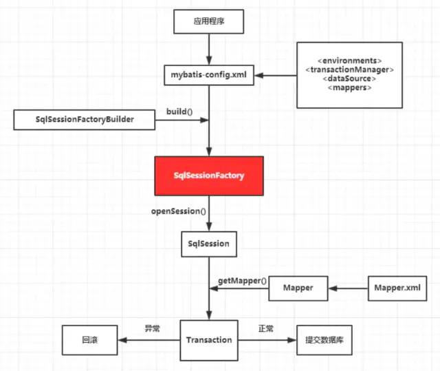

mybatis一二级缓存

数据源/JDBC/数据库连接池/ORM

# 0 mybatis原理
MyBatis也有四大核心类：

SqlSession对象，该对象中包含了执行SQL语句的所有方法。类似于JDBC里面的Connection。

Executor接口，它将根据SqlSession传递的参数动态地生成需要执行的SQL语句，同时负责查询缓存的维护。类似于JDBC里面的Statement/PrepareStatement。

MappedStatement对象，该对象是对映射SQL的封装，用于存储要映射的SQL语句的id、参数等信息。

ResultHandler对象，用于对返回的结果进行处理，最终得到自己想要的数据格式或类型。可以自定义返回类型。

https://blog.csdn.net/zhangcongyi420/article/details/89597995

# 1 #{}和${}的区别是什么？

注：这道题是⾯试官⾯试我同事的。
答：${} 是 Properties ⽂件中的变量占位符，它可以⽤于标签属性值和 sql 内部，属于静态⽂本替换，⽐如${driver}会被静态替换为 com.mysql.jdbc.Driver 。#{} 是 sql 的参数占位符， Mybatis 会将 sql 中的 #{} 替换为?号，在 sql 执⾏前会使⽤PreparedStatement 的参数设置⽅法，按序给 sql 的?号占位符设置参数值，⽐如ps.setInt(0, parameterValue)， #{item.name} 的取值⽅式为使⽤反射从参数对象中获取item 对象的 name 属性值，相当于 param.getItem().getName() 。 #将传入的数据都当成一个字符串，会对传入的数据自动加上引号；

$将传入的数据直接显示生成在SQL中。注意：使用$占位符可能会导致SQL注入攻击，能用#的地方就不要使用$，写order by子句的时候应该用$而不是#。

#{}：是预编译处理。${}：是字符串替换。Mybatis在处理#{}时，会将sql中的#{}替换为？号，调用PreparedStatement的set方法来赋值；mybatis在处理${}时，就是将${}替换成变量的值.使用#{}可以有效的防止SQL注入，提高系统的安全性！

# 2 xml 映射⽂件中常用标签？
注：这道题是京东⾯试官⾯试我时问的。
答：除了常⻅的 select|insert|updae|delete 标签之外还有很多其他的标签， resultMap、 parameterMap 、 sql 、 include 、 selectKey ，加上动态 sql 的 9个标签， trim|where|set|foreach|if|choose|when|otherwise|bind 等，其中为 sql ⽚段标签，通过include 标签引⼊ sql ⽚段， selectKey 为不⽀持⾃增的主键⽣成策略标签。

# 3 通常⼀个 xml 映射⽂件都会写⼀个 Dao 接⼝与之对应，这个 Dao 接⼝的⼯作原理是什么？ Dao 接⼝⾥的⽅法，参数不同时，⽅法能重载吗？
注：这道题也是京东⾯试官⾯试我时问的。
答： Dao 接⼝，就是⼈们常说的 Mapper 接⼝，接⼝的全限名，就是映射⽂件中的 namespace的值，接⼝的⽅法名，就是映射⽂件中 MappedStatement 的 id 值，接⼝⽅法内的参数，就是传递给 sql 的参数。 Mapper 接⼝是没有实现类的，当调⽤接⼝⽅法时，接⼝全限名+⽅法名拼接字符串作为 key 值，可唯⼀定位⼀个 MappedStatement ，

举例： com.mybatis3.mappers.StudentDao.findStudentById ，可以唯⼀找到 namespace
为 com.mybatis3.mappers.StudentDao 下⾯ id = findStudentById 的 MappedStatement 。在 Mybatis中，每⼀个 selec> 、 inser> 、update 、 delete 标签，都会被解析为⼀个 MappedStatement 对象。

Dao 接⼝⾥的⽅法，是不能重载的，因为是全限名+⽅法名的保存和寻找策略。

Dao 接⼝的⼯作原理是 JDK 动态代理， Mybatis 运⾏时会使⽤ JDK 动态代理为 Dao 接⼝⽣成代理 proxy 对象，代理对象 proxy 会拦截接⼝⽅法，转⽽执⾏ MappedStatement 所代表的 sql，然后将 sql 执⾏结果返回。 

在spring中，Mapper接口我们都没有实现的方法却可以通过依赖注册的方式使用，是为什么呢？
- mybatis使用动态代理的方式实现了Mapper接口
- MapperFactoryBean，spring动态代理的方式将实现的mapper对象又进行了一层分装
- 最终，当执行mapper时，将先去获取ThreadLocal中获取sqlSession，无则创建，然后调用sqlsession.Mapper的方式获得到最终的Mapper对象。

# 4 Mybatis 是如何进⾏分⻚的？分⻚插件的原理是什么？
注：我出的。
答： Mybatis 使⽤ RowBounds 对象进⾏分⻚，它是针对 ResultSet 结果集执⾏的内存分⻚，⽽⾮物理分⻚，可以在 sql 内直接书写带有物理分⻚的参数来完成物理分⻚功能，也可以使⽤分⻚插件来完成物理分⻚。分⻚插件的基本原理是使⽤ Mybatis 提供的插件接⼝，实现⾃定义插件，在插件的拦截⽅法内拦截待执⾏的 sql，然后重写 sql，根据 dialect ⽅⾔，添加对应的物理分⻚语句和物理分⻚参数。举例： select _ from student ，拦截 sql 后重写为： select t._ from select \* from student t limit 0 10

# 5 简述 Mybatis 的插件运⾏原理，以及如何编写⼀个插件。
注：我出的。
答： Mybatis 仅可以编写针对ParameterHandler 、 ResultSetHandler 、 StatementHandler 、 Executor 这 4 种接⼝的插件，Mybatis 使⽤ JDK 的动态代理，为需要拦截的接⼝⽣成代理对象以实现接⼝⽅法拦截功能，每当执⾏这 4 种接⼝对象的⽅法时，就会进⼊拦截⽅法，具体就是 InvocationHandler 的 invoke() ⽅法，当然，只会拦截那些你指定需要拦截的⽅法。实现 Mybatis 的 Interceptor 接⼝并复写 intercept() ⽅法，然后在给插件编写注解，指定要拦截哪⼀个接⼝的哪些⽅法即可，记住，别忘了在配置⽂件中配置你编写的插件。

[插件原理](https://www.toutiao.com/i7007476775697629734/?tt_from=weixin&utm_campaign=client_share&wxshare_count=1&timestamp=1631636479&app=news_article&utm_source=weixin&utm_medium=toutiao_android&use_new_style=1&req_id=202109150021180102120631570B1C0C7C&share_token=690e03f7-6828-4bfe-b8ef-5f4c35adabd3&group_id=7007476775697629734)

# 6 Mybatis 执⾏批量插⼊，能返回数据库主键列表吗？
注：我出的。
答：能， JDBC 都能， Mybatis 当然也能。

# 7 Mybatis 动态 sql 是做什么的？都有哪些动态 sql？能简述⼀下动态 sql 的执⾏原理不？
注：我出的。
答： Mybatis 动态 sql 可以让我们在 Xml 映射⽂件内，以标签的形式编写动态 sql，完成逻辑判断
和动态拼接 sql 的功能， Mybatis 提供了 9 种动态 sql 标签trim|where|set|foreach|if|choose|when|otherwise|bind 。
其执⾏原理为，使⽤ OGNL 从 sql 参数对象中计算表达式的值，根据表达式的值动态拼接 sql，
以此来完成动态 sql 的功能。 

# 8 Mybatis 是如何将 sql 执⾏结果封装为⽬标对象并返回的？都有哪些映射形式？
注：我出的。
答：第⼀种是使⽤ resultMap 标签，逐⼀定义列名和对象属性名之间的映射关系。

第⼆种是使⽤ sql 列的别名功能，将列别名书写为对象属性名，⽐如 T_NAME AS NAME，对象属性名⼀般
是 name，⼩写，但是列名不区分⼤⼩写， Mybatis 会忽略列名⼤⼩写，智能找到与之对应对象属性名，你甚⾄可以写成 T_NAME AS NaMe， Mybatis ⼀样可以正常⼯作。有了列名与属性名的映射关系后， Mybatis 通过反射创建对象，同时使⽤反射给对象的属性逐⼀赋值并返回，那些找不到映射关系的属性，是⽆法完成赋值的。

# 9 Mybatis 能执⾏⼀对⼀、⼀对多的关联查询吗？都有哪些实现⽅式，以及它们之间的区别。
注：我出的。
答：能， Mybatis 不仅可以执⾏⼀对⼀、⼀对多的关联查询，还可以执⾏多对⼀，多对多的关联
查询，多对⼀查询，其实就是⼀对⼀查询，只需要把 selectOne() 修改为 selectList() 即可；多对
多查询，其实就是⼀对多查询，只需要把 selectOne() 修改为 selectList() 即可。

关联对象查询，有两种实现⽅式，⼀种是单独发送⼀个 sql 去查询关联对象，赋给主对象，然后返回主对象。另⼀种是使⽤嵌套查询，嵌套查询的含义为使⽤ join 查询，⼀部分列是 A 对象的属性值，另外⼀部分列是关联对象 B 的属性值，好处是只发⼀个 sql 查询，就可以把主对象和其关联对象查出来。那么问题来了， join 查询出来 100 条记录，如何确定主对象是 5 个，⽽不是 100 个？其去重复的原理是 resultMap 标签内的 id ⼦标签，指定了唯⼀确定⼀条记录的 id 列， Mybatis 根据列值来完成 100 条记录的去重复功能，id 可以有多个，代表了联合主键的语意。同样主对象的关联对象，也是根据这个原理去重复的，尽管⼀般情况下，只有主对象会有重复记录，关联对象⼀般不会重复。举例：下⾯ join 查询出来 6 条记录，⼀、⼆列是 Teacher 对象列，第三列为 Student 对象列，Mybatis 去重复处理后，结果为 1 个⽼师 6 个学⽣，⽽不是 6 个⽼师 6 个学⽣。
t_id t_name s_id
| 1 | teacher | 38 |
| 1 | teacher | 39 |
| 1 | teacher | 40 |
| 1 | teacher | 41 |
| 1 | teacher | 42 |
| 1 | teacher | 43 |

# 10 Mybatis 是否⽀持延迟加载？如果⽀持，它的实现原理是什么？
注：我出的。
答： Mybatis 仅⽀持 association 关联对象和 collection 关联集合对象的延迟加载， association 指的就是⼀对⼀， collection 指的就是⼀对多查询。在 Mybatis 配置⽂件中，可以配置是否启⽤延
迟加载 lazyLoadingEnabled=true|false它的原理是，使⽤ CGLIB 创建⽬标对象的代理对象，当调⽤⽬标⽅法时，进⼊拦截器⽅法，⽐如调⽤ a.getB().getName() ，拦截器 invoke() ⽅法发现 a.getB() 是 null 值，那么就会单独发送事先保存好的查询关联 B 对象的 sql，把 B 查询上来，然后调⽤ a.setB(b)，于是 a 的对象 b 属性就有值了，接着完成 a.getB().getName() ⽅法的调⽤。这就是延迟加载的基本原理。

# 11 Mybatis 的 Xml 映射⽂件中，不同的 Xml 映射⽂件， id 是否可以重复？
不同的 Xml 映射⽂件，如果配置了 namespace，那么 id 可以重复；如果没有配置namespace，那么 id 不能重复；毕竟 namespace 不是必须的，只是最佳实践⽽已。原因就是 namespace+id 是作为 Map<String, MappedStatement> 的 key 使⽤的，如果没有namespace，就剩下 id，那么， id 重复会导致数据互相覆盖。有了 namespace，⾃然 id 就可以重复， namespace 不同， namespace+id ⾃然也就不同。

# 12 Mybatis 中如何执⾏批处理？
使⽤ BatchExecutor 完成批处理。

# 13 Mybatis 都有哪些 Executor 执⾏器？它们之间的区别是什么？

Mybatis 有三种基本的 Executor 执⾏器， SimpleExecutor 、 ReuseExecutor 、 BatchExecutor 。

SimpleExecutor ： 每执⾏⼀次 update 或 select，就开启⼀个 Statement 对象，⽤完⽴刻关闭Statement 对象。

ReuseExecutor ： 执⾏ update 或 select，以 sql 作为 key 查找 Statement 对象，存在就使⽤，不存在就创建，⽤完后，不关闭 Statement 对象，⽽是放置于 Map<String, Statement>内，供下⼀次使⽤。简⾔之，就是重复使⽤ Statement 对象。

BatchExecutor ： 执⾏ update（没有 select， JDBC 批处理不⽀持 select），将所有 sql 都添加到批处理中addBatch()），等待统⼀执⾏（executeBatch()），它缓存了多个 Statement 对象，每个 Statement 对象都是 addBatch()完毕后，等待逐⼀执⾏ executeBatch()批处理。与JDBC 批处理相同。作⽤范围： Executor 的这些特点，都严格限制在 SqlSession ⽣命周期范围内。

# 14 Mybatis 中如何指定使⽤哪⼀种 Executor 执⾏器？
在 Mybatis 配置⽂件中，可以指定默认的 ExecutorType 执⾏器类型，也可以⼿动给
DefaultSqlSessionFactory 的创建 SqlSession 的⽅法传递 ExecutorType 类型参数。

# 15 Mybatis 是否可以映射 Enum 枚举类？
Mybatis 可以映射枚举类，不单可以映射枚举类， Mybatis 可以映射任何对象到表的⼀列上。映射⽅式为⾃定义⼀个 TypeHandler ，实现 TypeHandler 的 setParameter() 和 getResult()接⼝⽅法。 TypeHandler 有两个作⽤，⼀是完成从 javaType ⾄ jdbcType 的转换，⼆是完成jdbcType ⾄ javaType 的转换，体现为 setParameter() 和 getResult() 两个⽅法，分别代表设置sql 问号占位符参数和获取列查询结果。

# 16 Mybatis 映射⽂件中，如果 A 标签通过 include 引⽤了 B 标签的内容，请问， B 标签能否定义在 A 标签的后⾯，还是说必须定义在 A 标签的前⾯？
虽然 Mybatis 解析 Xml 映射⽂件是按照顺序解析的，但是，被引⽤的 B 标签依然可以定义在任何地⽅， Mybatis 都可以正确识别。原理是， Mybatis 解析 A 标签，发现 A 标签引⽤了 B 标签，但是 B 标签尚未解析到，尚不存在，此时， Mybatis 会将 A 标签标记为未解析状态，然后继续解析余下的标签，包含 B 标签，待所有标签解析完毕， Mybatis 会重新解析那些被标记为未解析的标签，此时再解析 A 标签时， B标签已经存在， A 标签也就可以正常解析完成了。

# 17 简述 Mybatis 的 Xml 映射⽂件和 Mybatis 内部数据结构之间的映射关系？
Mybatis 将所有 Xml 配置信息都封装到 All-In-One 重量级对象 Configuration 内部。在 Xml映射⽂件中， parameterMap 标签会被解析为 ParameterMap 对象，其每个⼦元素会被解析为ParameterMapping 对象。resultMap 标签会被解析为 ResultMap 对象，其每个⼦元素会被解析为 ResultMapping 对象。每⼀个 select insert update delete 标签均会被解析为MappedStatement 对象，标签内的 sql 会被解析为 BoundSql 对象。

# 18 为什么说 Mybatis 是半⾃动 ORM 映射⼯具？它与全⾃动的区别在哪⾥？
Hibernate 属于全⾃动 ORM 映射⼯具，使⽤ Hibernate 查询关联对象或者关联集合对象时，可以根据对象关系模型直接获取，所以它是全⾃动的。⽽ Mybatis 在查询关联对象或关联集合对象时，需要⼿动编写 sql 来完成，所以，称之为半⾃动 ORM 映射⼯具。

# 19 什么是ORM？ORM原理
 对象关系映射（Object-Relational Mapping，简称ORM）是一种为了解决程序的面向对象模型与数据库的关系模型互不匹配问题的技术；简单的说，ORM是通过使用描述对象和数据库之间映射的元数据（在Java中可以用XML或者是注解），将程序中的对象自动持久化到关系数据库中或者将关系数据库表中的行转换成Java对象，其本质上就是将数据从一种形式转换到另外一种形式。

# 20 持久层设计要考虑的问题？用过的持久层框架有哪些？
所谓”持久”就是将数据保存到可掉电式存储设备中以便今后使用，简单的说，就是将内存中的数据保存到关系型数据库、文件系统、消息队列等提供持久化支持的设备中。持久层就是系统中专注于实现数据持久化的相对独立的层面。

持久层设计的目标包括：

- 数据存储逻辑的分离，提供抽象化的数据访问接口。
- 数据访问底层实现的分离，可以在不修改代码的情况下切换底层实现。
- 资源管理和调度的分离，在数据访问层实现统一的资源调度（如缓存机制）。
- 数据抽象，提供更面向对象的数据操作。

持久层框架有：- Hibernate – MyBatis

# 21  什么是MyBatis的接口绑定？有哪些实现方式？

接口绑定就是在mybatis中任意定义接口，然后把接口里面的方法和sql语句绑定，我们直接调用接口方法就可以，这样比起原来sqlsession提供的方法我们可以有更加灵活的选择和设置。有两种实现方式：

1. 在接口的方法上面加上@select，@update等注解，里面包含sql语句来绑定
2. 通过xml里面写sql语句来绑定，在这种情况下，要指定xml映射文件里面的namespace必须为接口的全路径名，当sql语句比较简单的时候，用注解绑定，当sql语句比较复杂的时候，用xml绑定，一般使用xml绑定的比较多！

# 22 什么是Mybatis的一级、二级缓存,如何开启?什么样的数据适合缓存?

[聊聊MyBatis缓存机制](https://tech.meituan.com/2018/01/19/mybatis-cache.html)

一级缓存是基于PerpetualCache的hashmap本地缓存，其存储作用域为Session，当Session flush后，默认打开一级缓存！二级缓存和一级缓存的机制是相同的，默认也是采用PerpetualCache的hashmap本地缓存，不过他的储存作用于在Mapper，而且可自定义存储源，要开启二级缓存，需要使用二级缓存属性类实现Serializable序列化的接口，可在它的映射文件中配置<cache/>缓存数据的更新机制，当某一个作用域（一级缓存session/二级缓存namespace）的进行了c/u/d操作后，默认该作用域下所有select中的缓存将被clear

- 一级缓存是sqlsession级别的缓存，当调用close/clearCache或udpate时清空缓存，由于无事务时，一条sql的执行就会调用close方法，所以一级缓存只作用无同一事务中。
- 二级缓存是应用级别的缓存，以namespace为维度。当namespace下发生增删改操作时清空缓存，分布式环境和多表操作存在问题，不推荐使用。

# 23 Mybatis全局配置文件中有哪些标签?分别代表什么意思?
configuration 配置
properties 属性:可以加载properties配置文件的信息
settings 设置：可以设置mybatis的全局属性
typeAliases 类型命名
typeHandlers 类型处理器
objectFactory 对象工厂
plugins 插件
environments 环境
environment 环境变量
transactionManager 事务管理器
dataSource 数据源
mappers 映射器

