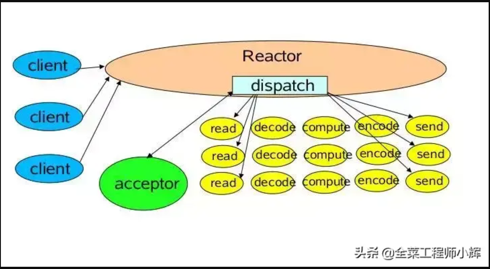
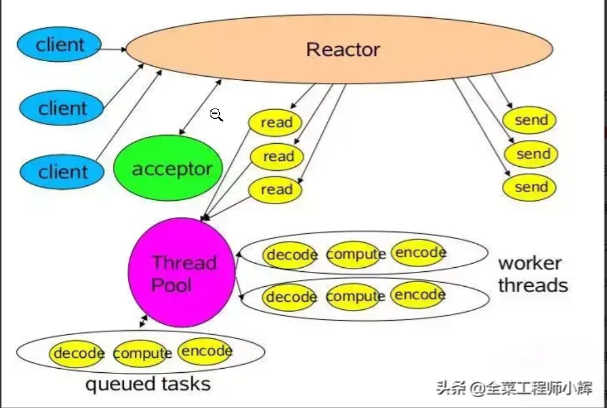
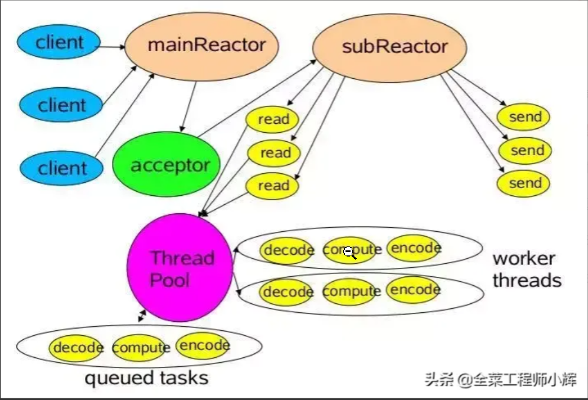
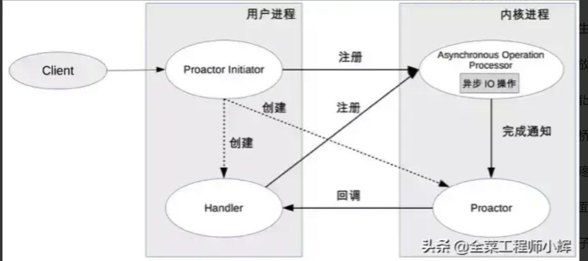
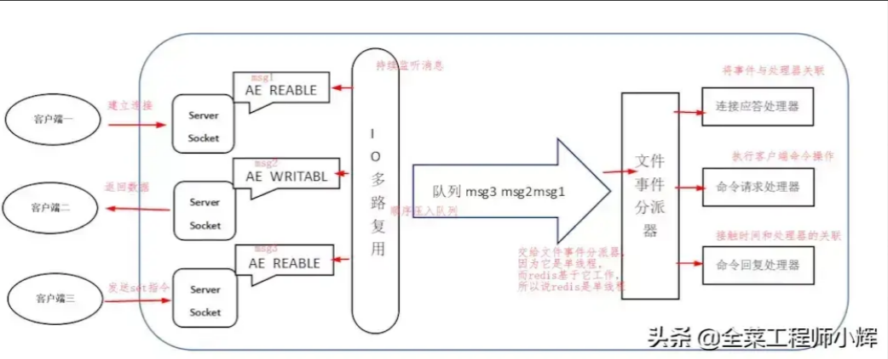

[彻底搞懂Reactor模型和Proactor模型](https://www.toutiao.com/article/6724069070448099851/?log_from=44d2110c84eb9_1688904846420)

# IO多路复用

select、poll、epoll

IO多路复用

让单个线程监听多个网络连接，一旦某个连接就绪也就是触发读写事件的时候就会通知应用程序主动获取就绪的连接进行读写操作，也就是在应用程序里面可以用单个线程同时处理多个客户端连接，在对系统资源消耗比较小的情况下去提升服务端的连接处理数量，在io多路复用机制的实现原理，客户端请求到服务端后，此时客户端在传输数据过程中，为了避免server端在read客户端数据的时候阻塞，服务端会把请求注册到一个selector
的一个复路器上，服务端此时不需要等待，只需要启用一个线程通过selector.select方法去阻塞轮询复路器上就绪的channel，也就是说如果某个客户端数据传输完成以后，select方法就会返回这个就绪的channel，然后执行相关的处理逻辑。

Linux上有三种多路复用技术实现，select和poll是基于轮询方式获取就绪的连接，epoll基于事件驱动的方式。

# JavaIO

BIO、NIO、AIO

IO流 装饰者模式

# 线程模型

Reactor、Proactor

## Reactor模型

无论是C++还是Java编写的网络框架，大多数都是基于Reactor模型进行设计和开发，Reactor模型基于事件驱动，特别适合处理海量的I/O事件。

#### **Reactor模式思想：分而治之+事件驱动**

分而治之

一个连接里完整的网络处理过程一般分为accept、read、decode、process、encode、send这几步。

Reactor模式将每个步骤映射为一个Task，服务端线程执行的最小逻辑单元不再是一次完整的网络请求，而是Task，且采用非阻塞方式执行。

事件驱动

每个Task对应特定网络事件。当Task准备就绪时，Reactor收到对应的网络事件通知，并将Task分发给绑定了对应网络事件的Handler执行。

Reactor模型定义的三种角色：

- Reactor：负责监听和分配事件，将I/O事件分派给对应的Handler。新的事件包含连接建立就绪、读就绪、写就绪等。
- Acceptor：处理客户端新连接，并分派请求到处理器链中。
- Handler：将自身与事件绑定，执行非阻塞读/写任务，完成channel的读入，完成处理业务逻辑后，负责将结果写出channel。可用资源池来管理。

Reactor模型处理请求的流程：

读取操作：

1. 应用程序注册读就绪事件和相关联的事件处理器
2. 事件分离器等待事件的发生
3. 当发生读就绪事件的时候，事件分离器调用第一步注册的事件处理器

写入操作类似于读取操作，只不过第一步注册的是写就绪事件。

Reactor模型具有如下的优点：

1. 响应快，不必为单个同步时间所阻塞，虽然Reactor本身依然是同步的；
2. 编程相对简单，可以最大程度的避免复杂的多线程及同步问题，并且避免了多线程/进程的切换开销；
3. 可扩展性，可以方便地通过增加Reactor实例个数来充分利用CPU资源；
4. 可复用性，Reactor模型本身与具体事件处理逻辑无关，具有很高的复用性。

### 单Reactor单线程

Reactor线程负责多路分离套接字，accept新连接，并分派请求到handler。**Redis使用单Reactor单进程的模型**。



消息处理流程：

1. Reactor对象通过select监控连接事件，收到事件后通过dispatch进行转发。
2. 如果是连接建立的事件，则由acceptor接受连接，并创建handler处理后续事件。
3. 如果不是建立连接事件，则Reactor会分发调用Handler来响应。
4. handler会完成read->业务处理->send的完整业务流程。

单Reactor单线程模型只是在代码上进行了组件的区分，但是整体操作还是单线程，不能充分利用硬件资源。handler业务处理部分没有异步。

对于一些小容量应用场景，可以使用单Reactor单线程模型。但是对于高负载、大并发的应用场景却不合适，主要原因如下：

1. 即便Reactor线程的CPU负荷达到100%，也无法满足海量消息的编码、解码、读取和发送。
2. 当Reactor线程负载过重之后，处理速度将变慢，这会导致大量客户端连接超时，超时之后往往会进行重发，这更加重Reactor线程的负载，最终会导致大量消息积压和处理超时，成为系统的性能瓶颈。
3. 一旦Reactor线程意外中断或者进入死循环，会导致整个系统通信模块不可用，不能接收和处理外部消息，造成节点故障。

为了解决这些问题，演进出单Reactor多线程模型。

### 单Reactor多线程模型

该模型在事件处理器（Handler）部分采用了多线程（线程池）。



消息处理流程：

1. Reactor对象通过Select监控客户端请求事件，收到事件后通过dispatch进行分发。
2. 如果是建立连接请求事件，则由acceptor通过accept处理连接请求，然后创建一个Handler对象处理连接完成后续的各种事件。
3. 如果不是建立连接事件，则Reactor会分发调用连接对应的Handler来响应。
4. Handler只负责响应事件，不做具体业务处理，通过Read读取数据后，会分发给后面的Worker线程池进行业务处理。
5. Worker线程池会分配独立的线程完成真正的业务处理，如何将响应结果发给Handler进行处理。
6. Handler收到响应结果后通过send将响应结果返回给Client。

相对于第一种模型来说，在处理业务逻辑，也就是获取到IO的读写事件之后，交由线程池来处理，handler收到响应后通过send将响应结果返回给客户端。这样可以降低Reactor的性能开销，从而更专注的做事件分发工作了，提升整个应用的吞吐。

但是这个模型存在的问题：

1. 多线程数据共享和访问比较复杂。如果子线程完成业务处理后，把结果传递给主线程Reactor进行发送，就会涉及共享数据的互斥和保护机制。
2. Reactor承担所有事件的监听和响应，只在主线程中运行，可能会存在性能问题。例如并发百万客户端连接，或者服务端需要对客户端握手进行安全认证，但是认证本身非常损耗性能。

为了解决性能问题，产生了第三种主从Reactor多线程模型。

### 主从Reactor多线程模型

比起第二种模型，它是将Reactor分成两部分：

1. mainReactor负责监听server socket，用来处理网络IO连接建立操作，将建立的socketChannel指定注册给subReactor。
2. subReactor主要做和建立起来的socket做数据交互和事件业务处理操作。通常，subReactor个数上可与CPU个数等同。

**Nginx、Swoole、Memcached和Netty都是采用这种实现。**



消息处理流程：

1. 从主线程池中随机选择一个Reactor线程作为acceptor线程，用于绑定监听端口，接收客户端连接

2. acceptor线程接收客户端连接请求之后创建新的SocketChannel，将其注册到主线程池的其它Reactor线程上，由其负责接入认证、IP黑白名单过滤、握手等操作

3. 步骤2完成之后，业务层的链路正式建立，将SocketChannel从主线程池的Reactor线程的多路复用器上摘除，重新注册到Sub线程池的线程上，并创建一个Handler用于处理各种连接事件

4. 当有新的事件发生时，SubReactor会调用连接对应的Handler进行响应

5. Handler通过Read读取数据后，会分发给后面的Worker线程池进行业务处理

6. Worker线程池会分配独立的线程完成真正的业务处理，如何将响应结果发给Handler进行处理

7. Handler收到响应结果后通过Send将响应结果返回给Client。

## Proactor模型



模块关系：

1. Procator Initiator负责创建Procator和Handler，并将Procator和Handler都通过Asynchronous operation processor注册到内核。
2. Asynchronous operation processor负责处理注册请求，并完成IO操作。完成IO操作后会通知procator。
3. procator根据不同的事件类型回调不同的handler进行业务处理。handler完成业务处理，handler也可以注册新的handler到内核进程。

消息处理流程：

读取操作：

1. 应用程序初始化一个异步读取操作，然后注册相应的事件处理器，此时事件处理器不关注读取就绪事件，而是关注读取完成事件，这是区别于Reactor的关键。
2. 事件分离器等待读取操作完成事件
3. 在事件分离器等待读取操作完成的时候，操作系统调用内核线程完成读取操作，并将读取的内容放入用户传递过来的缓存区中。这也是区别于Reactor的一点，Proactor中，应用程序需要传递缓存区。
4. 事件分离器捕获到读取完成事件后，激活应用程序注册的事件处理器，事件处理器直接从缓存区读取数据，而不需要进行实际的读取操作。

> 异步IO都是操作系统负责将数据读写到应用传递进来的缓冲区供应用程序操作。

Proactor中写入操作和读取操作，只不过感兴趣的事件是写入完成事件。

Proactor有如下缺点：

1. 编程复杂性，由于异步操作流程的事件的初始化和事件完成在时间和空间上都是相互分离的，因此开发异步应用程序更加复杂。应用程序还可能因为反向的流控而变得更加难以Debug；
2. 内存使用，缓冲区在读或写操作的时间段内必须保持住，可能造成持续的不确定性，并且每个并发操作都要求有独立的缓存，相比Reactor模型，在Socket已经准备好读或写前，是不要求开辟缓存的；
3. 操作系统支持，Windows下通过IOCP实现了真正的异步 I/O，而在Linux系统下，Linux2.6才引入，并且异步I/O使用epoll实现的，所以还不完善。

因此在 Linux 下实现高并发网络编程都是以Reactor模型为主。

# Redis线程模型

https://zhuanlan.zhihu.com/p/639750217

https://www.toutiao.com/article/6723727695361868295/?group_id=6723727695361868295

Redis基于Reactor模式开发了网络事件处理器，这个处理器被称为文件事件处理器。它的组成结构为4部分：多个套接字、IO多路复用程序、文件事件分派器、事件处理器。因为文件事件分派器队列的消费是单线程的，所以Redis才叫单线程模型。 Redis内部使用文件事件处理器 file event handler，它是单线程的，所以redis才叫做单线程模型。它采用IO多路复用机制同时监听多个 socket，将产生事件的 socket 压入内存队列中，事件分派器根据 socket 上的事件类型来选择对应的事件处理器进行处理。



**消息处理流程**

- 文件事件处理器使用I/O多路复用(multiplexing)程序来同时监听多个套接字，并根据套接字目前执行的任务来为套接字关联不同的事件处理器。
- 当被监听的套接字准备好执行连接应答(accept)、读取(read)、写入(write)、关闭(close)等操作时，与操作相对应的文件事件就会产生，这时文件事件处理器就会调用套接字之前关联好的事件处理器来处理这些事件。

尽管多个文件事件可能会并发地出现，但I/O多路复用程序总是会将所有产生事件的套接字都推到一个队列里面，然后通过这个队列，以有序（sequentially）、同步（synchronously）、每次一个套接字的方式向文件事件分派器传送套接字：当上一个套接字产生的事件被处理完毕之后（该套接字为事件所关联的事件处理器执行完毕）， I/O多路复用程序才会继续向文件事件分派器传送下一个套接字。

**一次完整的客户端与服务器连接事件示例**

假设Redis服务器正在运作，那么这个服务器的监听套接字的AE_READABLE事件应该正处于监听状态之下，而该事件所对应的处理器为连接应答处理器。

如果这时有一个Redis客户端向Redis服务器发起连接，那么监听套接字将产生AE_READABLE事件， 触发连接应答处理器执行：处理器会对客户端的连接请求进行应答， 然后创建客户端套接字，以及客户端状态，并将客户端套接字的 AE_READABLE 事件与命令请求处理器进行关联，使得客户端可以向主服务器发送命令请求。

之后，客户端向Redis服务器发送一个命令请求，那么客户端套接字将产生 AE_READABLE事件，引发命令请求处理器执行，处理器读取客户端的命令内容， 然后传给相关程序去执行。

执行命令将产生相应的命令回复，为了将这些命令回复传送回客户端，服务器会将客户端套接字的AE_WRITABLE事件与命令回复处理器进行关联：当客户端尝试读取命令回复的时候，客户端套接字将产生AE_WRITABLE事件， 触发命令回复处理器执行， 当命令回复处理器将命令回复全部写入到套接字之后， 服务器就会解除客户端套接字的AE_WRITABLE事件与命令回复处理器之间的关联。

> 采用多路 I/O 复用技术可以让单个线程高效的处理多个连接请求（尽量减少网络 IO 的时间消耗），多路I/O复用模型是利用 select、poll、epoll 可以同时监察多个流的 I/O 事件的能力，在空闲的时候，会把当前线程阻塞掉，当有一个或多个流有 I/O 事件时，就从阻塞态中唤醒，于是程序就会轮询一遍所有的流（epoll 是只轮询那些真正发出了事件的流），并且只依次顺序的处理就绪的流，这种做法就避免了大量的无用操作，从而提高效率。
> Redis客户端对服务端的每次调用都经历了发送命令，执行命令，返回结果三个过程。其中执行命令阶段，由于Redis是单线程来处理命令的，所有每一条到达服务端的命令不会立刻执行，所有的命令都会进入一个队列中，然后逐个被执行。并且多个客户端发送的命令的执行顺序是不确定的。但是可以确定的是不会有两条命令被同时执行，不会产生并发问题，这就是Redis的单线程基本模型。

# Tomcat线程模型

Tomcat支持四种接收请求的处理方式：BIO、NIO、APR和AIO

- NIO
  同步非阻塞，比传统BIO能更好的支持大并发，tomcat 8.0 后默认采用该模型。
  使用方法(配置server.xml)：<Connector port="8080" protocol="HTTP/1.1"/> 改为 protocol="org.apache.coyote.http11.Http11NioProtocol"
- BIO
  阻塞式IO，tomcat7之前默认，采用传统的java IO进行操作，该模型下每个请求都会创建一个线程，适用于并发量小的场景。
  使用方法(配置server.xml)：protocol =" org.apache.coyote.http11.Http11Protocol"
- APR
  tomcat 以JNI形式调用http服务器的核心动态链接库来处理文件读取或网络传输操作，需要编译安装APR库。
  使用方法(配置server.xml)：protocol ="org.apache.coyote.http11.Http11AprProtocol"
- AIO
  异步非阻塞 (NIO2)，tomcat8.0后支持。多用于连接数目多且连接比较长（重操作）的架构，比如相册服务器，充分调用OS参与并发操作，编程比较复杂，JDK7开始支持。
  使用方法(配置server.xml)：protocol ="org.apache.coyote.http11.Http11Nio2Protocol"

# Nginx线程模型

Nginx采用的是多进程（单线程）&多路IO复用模型。

工作模型：

1. Nginx在启动后，会有一个master进程和多个相互独立的worker进程。
2. 接收来自外界的信号，向所有worker进程发送信号，每个进程都有可能来处理这个连接。
3. master进程能监控worker进程的运行状态，当worker进程退出后(异常情况下)，会自动启动新worker进程。

# Netty线程模型

Netty服务端代码demo

```java
        // 1.bossGroup 用于接收连接，workerGroup 用于具体的处理
        EventLoopGroup bossGroup = new NioEventLoopGroup(1);
        EventLoopGroup workerGroup = new NioEventLoopGroup();
        try {
            //2.创建服务端启动引导/辅助类：ServerBootstrap
            ServerBootstrap b = new ServerBootstrap();
            //3.给引导类配置两大线程组,确定了线程模型
            b.group(bossGroup, workerGroup)
                     // (非必备)打印日志
                    .handler(new LoggingHandler(LogLevel.INFO))
                    // 4.指定 IO 模型
                    .channel(NioServerSocketChannel.class)
                    .childHandler(new ChannelInitializer<SocketChannel>() {
                        @Override
                        public void initChannel(SocketChannel ch) {
                            ChannelPipeline p = ch.pipeline();
                            //5.可以自定义客户端消息的业务处理逻辑
                            p.addLast(new HelloServerHandler());
                        }
                    });
            // 6.绑定端口,调用sync方法阻塞知道绑定完成
            ChannelFuture f = b.bind(port).sync();
            // 7.阻塞等待直到服务器Channel关闭
            f.channel().closeFuture().sync();
        } finally {
            //8.优雅关闭相关线程组资源
            bossGroup.shutdownGracefully();
            workerGroup.shutdownGracefully();
        }
```

对Netty示例代码进行分析：

1. 定义了两个EventLoopGroup，其中bossGroup对应的就是主线程池，只接收客户端的连接（注册，初始化逻辑），具体的工作由workerGroup这个从线程池来完成。可以理解为老板负责招揽接待，员工负责任务完成。线程池和线程组是一个概念，所以名称里有group。之后就采用ServerBootstrap启动类，传入这两个主从线程组。
2. 客户端和服务器建立连接后，NIO会在两者之间建立Channel，所以启动类调用channel方法就是为了指定建立什么类型的通道。这里指定的是NioServerSocketChannel这个通道类。
3. 启动类还调用了handler()和childHandler()方法，这两个方法中提及的handler是一个处理类的概念，他负责处理连接后的一个个通道的相应处理。handler()指定的处理类是主线程池中对通道的处理类，childHandler()方法指定的是从线程池中对通道的处理类。
4. 执行ServerBootstrap的bind方法进行绑定端口的同时也执行了sync()方法进行同步阻塞调用。
5. 关闭通道采用Channel的closeFuture()方法关闭。
6. 最终优雅地关闭两个线程组，执行shutdownGracefully()方法完成关闭线程组。

> 如果需要在客户端连接前的请求进行handler处理，则需要配置handler()；如果是处理客户端连接之后的handler，则需要配置在childHandler()。option和childOption也是一样的道理。

boss线程池作用：

1. 接收客户端的连接，初始化Channel参数。
2. 将链路状态变更时间通知给ChannelPipeline。

worker线程池作用：

1. 异步读取通信对端的数据报，发送读事件到ChannelPipeline。
2. 异步发送消息到通信对端，调用ChannelPipeline的消息发送接口。
3. 执行系统调用Task。
4. 执行定时任务Task。

通过配置boss和worker线程池的线程个数以及是否共享线程池等方式，Netty的线程模型可以在以上三种Reactor模型之间进行切换。

```java
//1.eventGroup既用于处理客户端连接，又负责具体的处理。  
EventLoopGroup eventGroup = new NioEventLoopGroup(1);
//2.创建服务端启动引导/辅助类：ServerBootstrap
ServerBootstrap b = new ServerBootstrap();
boobtstrap.group(eventGroup, eventGroup)   --单线程模型
```

```java
// 1.bossGroup 用于接收连接，workerGroup 用于具体的处理
EventLoopGroup bossGroup = new NioEventLoopGroup(1);
EventLoopGroup workerGroup = new NioEventLoopGroup();
try {
//2.创建服务端启动引导/辅助类：ServerBootstrap
ServerBootstrap b = new ServerBootstrap();
//3.给引导类配置两大线程组,确定了线程模型
b.group(bossGroup, workerGroup)            --多线程模型
```

```java
// 1.bossGroup 用于接收连接，workerGroup 用于具体的处理
EventLoopGroup bossGroup = new NioEventLoopGroup();
EventLoopGroup workerGroup = new NioEventLoopGroup();
try {
//2.创建服务端启动引导/辅助类：ServerBootstrap
ServerBootstrap b = new ServerBootstrap();
//3.给引导类配置两大线程组,确定了线程模型
b.group(bossGroup, workerGroup)            --主从多线程模型
```

# Netty面试题

## 对Netty的理解？

Netty是一款高性能的NIO网络通信框架，是对NIO的封装，提供了简单易用的API，可以利用这些API开发网络应用程序；Netty在nio的基础上做了很多优化，比如零拷贝、高性能无锁队列、内存池等，性能比NIO高；Netty支持多种通信协议，内置多种拆包策略，使用方便。

## 为什么使用Netty？

- 统一的 API，支持多种传输类型，阻塞和非阻塞的。
- 简单而强大的线程模型。
- 自带编解码器解决 TCP 粘包/拆包问题。
- 自带各种协议栈。真正的无连接数据包套接字支持。
- 比直接使用 Java 核心 API 有更高的吞吐量、更低的延迟、更低的资源消耗和更少的内存复制。
- 安全性不错，有完整的 SSL/TLS 以及 StartTLS 支持。
- 社区活跃，成熟稳定，经历了大型项目的使用和考验，而且很多开源项目都使用到了
  Netty， 比如我们经常接触的 Dubbo、RocketMQ 等等。 


## Netty应用场景

RPC框架网络通信、http服务器、微服务网关、消息推送系统等。

## Netty核心组件及作用

Netty是由三层结构构成，网络通信层、事件调度层、服务编排层。网络通信层有三个核心组件，Bootstrap、ServerBootstrap、Channel。Bootstrap负责客户端启动并且连接远程的NettyServer，ServerBootstrap是服务端启动引导类，负责服务端端口监听，Channel是网络连接的抽象。

Channel 接口是 Netty 对网络操作抽象，除了包括基本的 IO 操作，如 bind() 、 connect() 、 read() 、write() 等。比较常用的 Channel 接口实现类是 NioServerSocketChannel （服务端）和 NioSocketChannel
（客户端），这两个 Channel 可以和 BIO 编程模型中的 ServerSocket 以及 Socket 两个概念对应上。Netty 的 Channel 接口所提供的 API，大大地降低了直接使用 Socket 类的复杂性。

事件调度器有两个核心角色EventLoopGroup和EventLoop，EventLoopGroup本质上是一个线程池，主要负责接收IO请求并分配线程去执行处理请求，EventLoop是线程池里面的一个具体线程。EventLoop 的主要作用实际就是负责监听网络事件并调用事件处理器进行相关I/O 操作的处理。 Channel 为 Netty 网络操作(读写等操作)抽象类， EventLoop 负责处理注册到其上的 Channel 处理 I/O 操作，两者配合参与 I/O 操作。EventLoop里面有Selector。

服务编排层有三个核心组件，ChannelPipeline、ChannelHandler和ChannelHandlerContext、ChannelFuture。ChannelPipeline负责处理多个ChannelHandler，把多个ChannelHandler构成一个链，根据入站还是出站按照从head到tail和从tail到head执行Handler，ChannelHandler是针对IO数据的一个具体处理器，数据接收后通过指定的Handler进行处理。ChannelHandlerContext是用来保存ChannelHandler的一个上下文信息。Netty 是异步非阻塞的，所有的 I/O 操作都为异步的。因此，我们不能立刻得到操作是否执行成功，但是，你可以通过 ChannelFuture 接口的 addListener() 方法注册一个 ChannelFutureListener ，当操作执行成功或者失败时，监听就会自动触发返回结果。并且还可以通过 ChannelFuture 的 channel() 方法获取关联的 Channel。

入站  head--》tail  解码 二进制流转成对象 反序列化
出站  tail--》head  编码 对象转成二进制流 序列化

## Netty零拷贝机制


## Netty实现RPC框架


## 高性能网关Gateway


## 百万连接架构

  

  

  

  