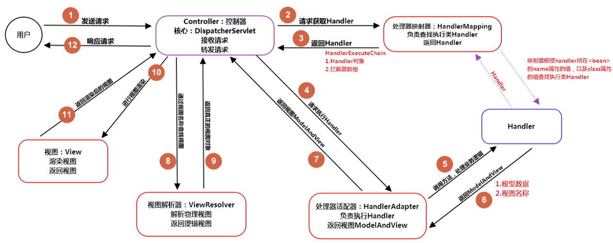

spring/springmvc/springboot
https://www.cnblogs.com/pengfeilu/p/14350135.html

springmvc学习

https://www.toutiao.com/a7002412183980130827/

**重点掌握几遍**

Spring：IOC原理、AOP原理、事务原理失效传播行为隔离级别@Transaction实现原理

​               bean加载过程、循环依赖、注解原理及常用注解  beanfactory factorybean，aware接口

​               如何动态添加bean、如何添加外部jar中的bean；动态代理对象添加到容器中？动态数据源

​               设计模式、源码

SpringMVC：实现原理、手写

SpringBoot：自动配置、starter及手写、启动过程、配置加载

# 0 Spring，SpringMVC，SpringBoot，SpringCloud有什么区别和联系？

Spring是一个轻量级的控制反转(IoC)和面向切面(AOP)的容器框架。Spring使你能够编写更干净、更可管理、并且更易于测试的代码。

Spring MVC是Spring的一个模块，一个web框架。通过Dispatcher Servlet, ModelAndView 和 View Resolver，开发web应用变得很容易。主要针对的是网站应用程序或者服务开发——URL路由、Session、模板引擎、静态Web资源等等。

Spring配置复杂，繁琐，所以推出了Spring boot，约定优于配置，简化了spring的配置流程。

Spring Cloud构建于Spring Boot之上，是一个关注全局的服务治理框架。

**Spring VS SpringMVC：**

Spring是一个一站式的轻量级的java开发框架，核心是控制反转（IOC）和面向切面（AOP），针对于开发的WEB层(springMvc)、业务层(Ioc)、持久层(jdbcTemplate)等都提供了多种配置解决方案；

SpringMVC是Spring基础之上的一个MVC框架，主要处理web开发的路径映射和视图渲染，属于Spring框架中WEB层开发的一部分；

**SpringMVC VS SpringBoot：**

SpringMVC属于一个企业WEB开发的MVC框架，涵盖面包括前端视图开发、文件配置、后台接口逻辑开发等，XML、config等配置相对比较繁琐复杂；

SpringBoot框架相对于SpringMVC框架来说，更专注于开发微服务后台接口，不开发前端视图；

**SpringBoot和SpringCloud：**

SpringBoot使用了默认大于配置的理念，集成了快速开发的Spring多个插件，同时自动过滤不需要配置的多余的插件，简化了项目的开发配置流程，一定程度上取消xml配置，是一套快速配置开发的脚手架，能快速开发单个微服务；

SpringCloud大部分的功能插件都是基于SpringBoot去实现的，SpringCloud关注于全局的微服务整合和管理，将多个SpringBoot单体微服务进行整合以及管理；SpringCloud依赖于SpringBoot开发，而SpringBoot可以独立开发；

**总结下来：**

- Spring是核心，提供了基础功能；
- Spring MVC 是基于Spring的一个 MVC 框架 ；
- Spring Boot 是为简化Spring配置的快速开发整合包；
- Spring Cloud是构建在Spring Boot之上的服务治理框架。

# 1 Spring

## 1.1 什么是 Spring?

Spring是**一个轻量级Java开发框架**，最早有**Rod Johnson**创建，目的是为了解决企业级应用开发的业务逻辑层和其他各层的耦合问题。它是一个分层的JavaSE/JavaEE full-stack（一站式）轻量级开源框架，为开发Java应用程序提供全面的基础架构支持。Spring负责基础架构，因此Java开发者可以专注于应用程序的开发。

Spring最根本的使命是**解决企业级应用开发的复杂性，即简化Java开发**。

Spring可以做很多事情，它为企业级开发提供给了丰富的功能，但是这些功能的底层都依赖于它的两个核心特性，也就是**依赖注入**（dependency injection，DI）和**面向切面编程**（aspect-oriented programming，AOP）。

为了降低Java开发的复杂性，Spring采取了以下4种关键策略：
- 基于POJO的轻量级和最小侵入性编程；
- 通过依赖注入和面向接口实现松耦合；
- 基于切面和惯例进行声明式编程；
- 通过切面和模板减少样板式代码。

Spring设计目标：Spring为开发者提供一个一站式轻量级应用开发平台；

Spring设计理念：在JavaEE开发中，支持POJO和JavaBean开发方式，使应用面向接口开发，充分支持面向对象设计方法；Spring通过IoC容器实现对象耦合关系的管理，并实现依赖反转，将对象之间的依赖关系交给IoC容器，实现解耦；

Spring框架的核心：IoC容器和AOP模块。通过IoC容器管理POJO对象以及他们之间的耦合关系；通过AOP以动态非侵入的方式增强服务。IoC让相互协作的组件保持松散的耦合，而AOP编程允许你把遍布于应用各层的功能分离出来形成可重用的功能组件。

## 1.2 选择使用Spring框架的原因？ Spring的优缺点是什么?
- 非侵入式：支持基于POJO的编程模式，不强制要求实现Spring框架中的接口或继承Spring框架中的类。
- IoC容器：IoC容器帮助应用程序管理对象以及对象之间的依赖关系，对象间依赖关系如改变只需修改配置文件而不是修改代码。IoC容器，程序员不需要编写工厂、单例，特别符合Spring的精神”不要重复的发明轮子”。
- AOP（面向切面编程）：将所有的横切关注功能封装到切面（aspect）中，通过配置的方式将横切关注功能动态添加到目标代码上，进一步实现了业务逻辑和系统服务的分离。程序员可以省去很多自己写代理类的工作。
- MVC：Spring的MVC框架是非常优秀的，为Web表示层提供了更好的解决方案。
- 事务管理：Spring以宽广的胸怀接纳多种持久层技术，并且为其提供了声明式的事务管理，在不需要任何一行代码的情况下就能够完成事务管理。
- 其他： Spring为Java企业级开发提供了一站式选择，你可以在需要的时候使用它的部分和全部，更重要的是，你甚至可以在感觉不到Spring存在的情况下，在你的项目中使用Spring提供的各种优秀的功能。

**优点:**

方便解耦，简化开发，Spring就是一个大工厂，可以将所有对象的创建和依赖关系的维护，交给Spring管理。

AOP编程的支持，Spring提供面向切面编程，可以方便的实现对程序进行权限拦截、运行监控等功能。

声明式事务的支持，只需要通过配置就可以完成对事务的管理，而无需手动编程。

方便程序的测试，Spring对Junit4支持，可以通过注解方便的测试Spring程序。

方便集成各种优秀框架，Spring不排斥各种优秀的开源框架，其内部提供了对各种优秀框架的直接支持。

降低JavaEE API的使用难度，Spring对JavaEE开发中非常难用的一些API（JDBC、JavaMail、远程调用等），都提供了封装，使这些API应用难度大大降低。

**缺点:**

Spring明明一个很轻量级的框架，却给人感觉大而全；

Spring依赖反射，反射影响性能；

使用门槛升高，入门Spring需要较长时间；
## 1.3 Spring 框架中都用到了哪些设计模式？源码看过吗？
工厂模式：BeanFactory就是简单工厂模式的体现，用来创建对象的实例；

单例模式：Bean默认为单例模式。

代理模式：Spring的AOP功能用到了JDK的动态代理和CGLIB字节码生成技术；

模板方法：用来解决代码重复的问题。比如. RestTemplate, JmsTemplate, JpaTemplate。

观察者模式：定义对象键一种一对多的依赖关系，当一个对象的状态发生改变时，所有依赖于它的对象都会得到通知被自动更新，如Spring中listener的实现ApplicationListener。

## 1.4 Spring Framework 中有多少个模块，它们分别是什么？
Spring 总共大约有 20 个模块， 由 1300 多个不同的文件构成。 而这些组件被分别整合在 核心容器（Core Container） 、 AOP（Aspect Oriented Programming）和设备支持（Instrmentation） 、数据访问与集成（Data Access/Integeration） 、 Web、 消息（Messaging）、Test等 几 个模块中。

 以下是 Spring 5 的模块结构图：


Spring 核心容器：提供了框架的基本组成部分，包括控制反转（Inversion of Control，IOC）和依赖注入（Dependency Injection，DI）功能。 它包含以下模块：

Spring Core、Spring Bean、SpEL (Spring Expression Language)、Spring Context

AOP：该层支持面向切面编程

数据访问/集成：该层提供与数据库交互的支持。它包含以下模块：

JDBC、ORM、OXM、JMS

Transaction：事务管理

Web：该层提供了创建 Web 应用程序的支持 。 它包含以下模块：

Web、Servlet、WSocket、Portlet
Instrumentation：该层为类检测和类加载器实现提供支持。
Test：该层为使用 JUnit 和 TestNG 进行测试提供支持。

其他模块：

Messaging：该模块为 STOMP 提供支持 。 它还支持注解编程模型，该模型用于从
WebSocket：客户端路由和处理 STOMP 消息。
Aspects：该模块为与AspectJ的集成提供支持 。

## 1.5 Spring context应用上下文有什么作用？
这是基本的Spring模块，提供spring 框架的基础功能，BeanFactory 是任何以spring为基础的应用的核心。Spring 框架建立在此模块之上，它使Spring成为一个容器。

Bean 工厂是工厂模式的一个实现，提供了控制反转功能，用来把应用的配置和依赖从真正的应用代码中分离。最常用的就是org.springframework.beans.factory.xml.XmlBeanFactory ，它根据XML文件中的定义加载beans。该容器从XML 文件读取配置元数据并用它去创建一个完全配置的系统或应用。


## 1.6 Spring框架中有哪些不同类型的事件？
Spring 提供了以下5种标准的事件：

上下文更新事件（ContextRefreshedEvent）：在调用ConfigurableApplicationContext 接口中的refresh()方法时被触发。

上下文开始事件（ContextStartedEvent）：当容器调用ConfigurableApplicationContext的Start()方法开始/重新开始容器时触发该事件。

上下文停止事件（ContextStoppedEvent）：当容器调用ConfigurableApplicationContext的Stop()方法停止容器时触发该事件。

上下文关闭事件（ContextClosedEvent）：当ApplicationContext被关闭时触发该事件。容器被关闭时，其管理的所有单例Bean都被销毁。

请求处理事件（RequestHandledEvent）：在Web应用中，当一个http请求（request）结束触发该事件。如果一个bean实现了ApplicationListener接口，当一个ApplicationEvent 被发布以后，bean会自动被通知。

## 1.7 什么是IoC和DI？DI是如何实现的？

IoC叫控制反转，是Inversion of Control的缩写，DI（Dependency Injection）叫依赖注入，是对IoC更简单的诠释。所谓的控制反转就是对组件对象控制权的转移，从程序代码本身转移到了外部容器，由容器来创建对象并管理对象之间的依赖关系。依赖注入的基本原则是应用组件不应该负责查找资源或者其他依赖的协作对象。配置对象的工作应该由容器负责，查找资源的逻辑应该从应用组件的代码中抽取出来，交给容器来完成。DI是对IoC更准确的描述，即组件之间的依赖关系由容器在运行期决定，由容器动态的将某种依赖关系注入到组件之中。

依赖注入可以通过setter方法注入、构造器注入和接口注入（由于在灵活性和易用性比较差，现在从Spring4开始已被废弃）三种方式来实现，Spring支持setter注入和构造器注入，通常使用构造器注入来注入必须的依赖关系，对于可选的依赖关系，则setter注入是更好的选择，setter注入需要类提供无参构造器或者无参的静态工厂方法来创建对象。

**IOC的作用：**

- 管理对象的创建和依赖关系的维护。对象的创建并不是一件简单的事，在对象关系比较复杂时，如果依赖关系需要程序猿来维护的话，那是相当头疼的
- 解耦，由容器去维护具体的对象
- 托管了类的产生过程，比如我们需要在类的产生过程中做一些处理，最直接的例子就是代理，如果有容器程序可以把这部分处理交给容器，应用程序则无需去关心类是如何完成代理的

**IoC 的好处：**

它将最小化应用程序中的代码量。

它将使您的应用程序易于测试，因为它不需要单元测试用例中的任何单例或JNDI 查找机制。

它以最小的影响和最少的侵入机制促进松耦合。

它支持即时的实例化和延迟加载服务。

**依赖注入的主要优势：**

查找定位操作与应用代码完全无关。

不依赖于容器的API，可以很容易地在任何容器以外使用应用对象。

不需要特殊的接口，绝大多数对象可以做到完全不必依赖容器。

## 1.8 什么是 Spring IOC 容器？ Spring IoC 的实现原理？Spring 的 IoC支持哪些功能?

控制反转即IoC (Inversion of Control)，它把传统上由程序代码直接操控的对象的调用权交给容器，通过容器来实现对象组件的装配和管理。所谓的“控制反转”概念就是对组件对象控制权的转移，从程序代码本身转移到了外部容器。Spring IOC 负责创建对象，管理对象（通过依赖注入（DI），装配对象，配置对象，并且管理这些对象的整个生命周期。

Spring 的 IoC 设计支持以下功能：

依赖注入、依赖检查、自动装配、支持集合、指定初始化方法和销毁方法、支持回调方法（需实现Spring接口）。其中，最重要的就是依赖注入，从XML的配置上说，即 ref 标签。对应 Spring RuntimeBeanReference 对象。

Spring 中的IoC 的实现原理就是工厂模式加反射机制 。示例：

```java
interface Fruit {
  public abstract void eat();
}
class Apple implements Fruit {
  public void eat(){
    System.out.println("Apple");
  }
}
class Orange implements Fruit {
  public void eat(){
    System.out.println("Orange");
  }
}
class Factory {
  public static Fruit getInstance(String ClassName) { 
    Fruit f=null;
    try {
      f=(Fruit)Class.forName(ClassName).newInstance(); 
    } catch (Exception e)  {
      e.printStackTrace();
    }
    return f;
  }
}

class Client {
  public static void main(String[] a) {
    Fruit f=Factory.getInstance("com.xxx.xxx.Apple");
    f.eat();    
  }
}
```
## 1.9 BeanFactory 和 ApplicationContext有什么区别?和FactoryBean有什么区别？
BeanFactory和ApplicationContext是Spring的两大核心接口，都可以当做Spring的容器。其中ApplicationContext是BeanFactory的子接口。
- 依赖关系
BeanFactory：是Spring里面最底层的接口，包含了各种Bean的定义，读取bean配置文档，管理bean的加载、实例化，控制bean的生命周期，维护bean之间的依赖关系。
ApplicationContext接口作为BeanFactory的派生，除了提供BeanFactory所具有的功能外，还提供了更完整的框架功能：继承MessageSource，因此支持国际化。统一的资源文件访问方式。提供在监听器中注册bean的事件。同时加载多个配置文件。载入多个（有继承关系）上下文 ，使得每一个上下文都专注于一个特定的层次，比如应用的web层。
- 加载方式
BeanFactroy采用的是延迟加载形式来注入Bean的，即只有在使用到某个Bean时(调用getBean())，才对该Bean进行加载实例化。缺点是不能发现一些存在的Spring的配置问题。如果Bean的某一个属性没有注入，BeanFacotry加载后，直至第一次使用调用getBean方法才会抛出异常。
ApplicationContext在容器启动时一次性创建了所有的Bean。这样在容器启动时就可以发现Spring中存在的配置错误，有利于检查所依赖属性是否注入。 ApplicationContext启动后预载入所有的单实例Bean。相对于BeanFactory，ApplicationContext 唯一的不足是占用内存空间。当配置的Bean较多时，程序启动较慢。
- 创建方式
BeanFactory通常以编程方式被创建，ApplicationContext还能以声明方式创建，如使用ContextLoader。
- 注册方式
BeanFactory和ApplicationContext都支持BeanPostProcessor、BeanFactoryPostProcessor的使用，但两者之间的区别是：BeanFactory需要手动注册，而ApplicationContext则是自动注册。

**BeanFactory和FactoryBean的区别**

BeanFactory是Spring容器中的一个很重要的类，它对于Bean的创建有一个统一的流程；

FactoryBean是一个工厂Bean，可以生成某一个类型Bean实例，它最大的一个作用是：可以让我们自定义Bean的创建过程。

## 1.10 ApplicationContext通常的实现是什么？
- FileSystemXmlApplicationContext ：
此容器从一个XML文件中加载beans的定义，XML Bean 配置文件的全路径名必须提供给它的构造函数。
- ClassPathXmlApplicationContext：
此容器也从一个XML文件中加载beans的定义，这里，你需要正确设置classpath因为这个容器将在classpath里找bean配置。
- WebXmlApplicationContext：
此容器加载一个XML文件，此文件定义了一个WEB应用的所有bean。

## 1.11 构造器依赖注入和 Setter方法注入有什么区别？
| 构造函数注入 | setter 注入 |
| - | - |
| 没有部分注入 | 有部分注入 |
| 不会覆盖 setter 属性 | 会覆盖 setter 属性 |
| 任意修改都会创建一个新实例 | 任意修改不会创建一个新实例 |
| 适用于设置很多属性 | 适用于设置少量属性 |

两种依赖方式都可以使用，构造器注入和Setter方法注入。

最好的解决方案是用构造器参数实现强制依赖，setter方法实现可选依赖。

## 1.12 Spring 如何设计容器的，BeanFactory和ApplicationContext的关系详解?
BeanFactory 简单粗暴，可以理解为就是个 HashMap，Key 是 BeanName，Value 是 Bean 实例。通常只提供注册（put），获取（get）这两个功能。我们可以称之为 “低级容器”。

ApplicationContext 可以称之为 “高级容器”。因为他比 BeanFactory 多了更多的功能。例如资源的获取，支持多种消息（例如 JSP tag 的支持），对 BeanFactory 多了工具级别的支持等待。该接口定义了一个 refresh 方法，此方法是所有阅读 Spring 源码的人的最熟悉的方法，用于刷新整个容器，即重新加载/刷新所有的 bean。

BeanFactory和ApplicationContext的关系

最上面的是 BeanFactory，下面的 3 个绿色的，都是功能扩展接口，这里就不展开讲。

看下面的隶属 ApplicationContext 粉红色的 “高级容器”，依赖着 “低级容器”，这里说的是依赖，不是继承哦。他依赖着 “低级容器” 的 getBean 功能。而高级容器有更多的功能：支持不同的信息源头，可以访问文件资源，支持应用事件（Observer 模式）。

左边灰色区域的是 “低级容器”， 只负载加载 Bean获取 Bean。容器其他的高级功能是没有的。例如上图画的 refresh 刷新 Bean 工厂所有配置，生命周期事件回调等。

**小结**

IoC 在 Spring 里，只需要低级容器就可以实现，2 个步骤：

加载配置文件，解析成 BeanDefinition 放在 Map 里。调用 getBean 的时候，从 BeanDefinition 所属的 Map 里，拿出 Class 对象进行实例化，同时，如果有依赖关系，将递归调用 getBean 方法 —— 完成依赖注入。
上面就是 Spring 低级容器（BeanFactory）的 IoC。

至于高级容器 ApplicationContext，他包含了低级容器的功能，当他执行 refresh 模板方法的时候，将刷新整个容器的 Bean。同时其作为高级容器，包含了太多的功能。他支持不同信息源头，支持 BeanFactory 工具类，支持层级容器，支持访问文件资源，支持事件发布通知，支持接口回调等等。

## 1.13 什么是 Spring bean？bean的实例化过程？
https://www.cnblogs.com/wyq178/p/11415877.html

https://blog.csdn.net/caoyuanyenang/article/details/110505166

Bean由Spring IoC 容器实例化，配置，装配和管理。Bean 是基于用户提供给容器的配置元数据创建。

**bean的实例化过程**

1. 执行实例化前操作

2. 创建Bean实例

3. 将Bean缓存起来

4. 给Bean填充属性值

5. 初始化Bean
   (1) 执行BeanPostProcessor-postProcessBeforeInitialization
   
   (2) 执行InitializingBean->afterPropertiesSet
   
   (3) 执行initMethod
   
   (4) 执行BeanPostProcessor-postProcessAfterInitialization

## 1.14 Spring 提供了哪些配置方式？
- 基于xml配置：bean 所需的依赖项和服务在 XML 格式的配置文件中指定 。 
```xml
<bean id="studentbean" class="org.edureka.firstSpring.StudentBean"> 
  <property name="name" value="Edureka"></property>
</bean>
<bean id=“StudentBean" class="com.lupf.Student"> 
  <property name="person">
    <!--内部bean：只有将 bean 用作另一个 bean 的属性时，才能将 bean 声明为内部 bean。 内部 bean 总是匿名的，它们总是作为原型。-->
    <bean class="com.lupf.Person">
      <property name="name" value=“Scott"></property> <property name="address" value="Bangalore"></property>
    </bean>
  </property>
</bean>
```
- 基于注解配置：在相关的类，方法或字段声明上使用注解，将 bean 配置为组件类本身。 默认情况下， Spring 容器中未打开注解装配。需要在使用它之前在 Spring 配置文件中启用它。 例如：
```xml
<beans>
   <context:annotation-config/>
   <!-- bean definitions go here -->
</beans>
```
- 基于Java API 配置：Spring的Java配置是通过使用@Bean和@Configuration来实现 。@Bean 注解扮演与元素相同的角色 。@Configuration 允许通过简单地调用同一个类中的其他@Bean方法来定义bean间依赖关系。
```java
@Configuration
public class StudentConfig {
  @Bean
  public StudentBean myStudent() {
    return new StudentBean();
  }
}
```

## 1.15 Spring 支持几种 bean scope？
Spring bean 支持5种scope：
- Singleton：每个 Spring IoC 容器仅有一个单实例 。
- Prototype：每次请求都会产生一个新的实例。
- Request：每一次 HTTP 请求都会产生一个新的实例，并且该 bean 仅在当前 HTTP 请求内有效。
- Session：每一次 HTTP 请求都会产生一个新的 bean，同时该 bean 仅在当前 HTTP session 内有效。
- Global-session
类似于标准的 HTTP Session 作用域，不过它仅仅在基于 portlet 的 web 应用中才有意义， Spring5已经没有了 。 Portlet 规范定义了全局 Session 的概念，它被所有构成某个 portlet web 应用的各种不同的 portlet 所共享。 在 global session 作用域中定义的 bean 被限定于全局 portlet Session 的生命周期范围内。 如果你在 web 中使用 global session 作用域来标识 bean，那么 web 会自动当成 session 类型来使用。仅当用户使用支持Web的ApplicationContext时，最后三个才可用 。

## 1.16 Spring bean 容器的生命周期是什么样的？
spring bean 容器的生命周期流程如下：

1、Spring 容器根据配置中的 bean 定义中实例化 bean。

2、Spring 使用依赖注入填充所有属性，如 bean 中所定义的配置。

3、如果 bean 实现 BeanNameAware 接口，则工厂通过传递 bean 的 ID 来调用setBeanName()。

4、如果 bean 实现 BeanFactoryAware 接口，工厂通过传递自身的实例来调用 setBeanFactory()。

5、如果存在与 bean 关联的任何BeanPostProcessors，则调用 preProcessBeforeInitialization() 方法 。

6、如果为 bean 指定了 init 方法（ 的 init-method 属性），那么将调用它。如果Bean实现了InitializingBean接口，则调用其afterPropertySet方法。

7、最后，如果存在与 bean 关联的任何 BeanPostProcessors，则将调用 postProcessAfterInitialization() 方法。

8、如果 bean 实现 DisposableBean 接口，当 spring 容器关闭时，会调用 destory()。

9、如果为 bean 指定了 destroy 方法（ 的 destroy-method 属性），那么将调用它。


## 1.17 什么是bean装配？什么是bean的自动装配？自动装配有哪些方式？ 自动装配有什么局限？
bean装配是指在Spring容器中把bean组装到一起，前提是容器需要知道bean的依赖关系，如何通过依赖注入来把它们装配到一起。

在Spring框架中，在配置文件中设定bean的依赖关系是一个很好的机制，Spring 容器能够自动装配相互合作的bean，这意味着容器不需要和配置，能通过Bean工厂自动处理bean之间的协作。这意味着 Spring可以通过向Bean Factory中注入的方式自动搞定bean之间的依赖关系。自动装配可以设置在每个bean上，也可以设定在特定的bean上。

Spring容器能够自动装配bean，通过检查BeanFactory内容让Spring自动解析bean的协作者。

**自动装配的不同模式：**

- no：这是默认设置，表示没有自动装配 。 应使用显式 bean 引用进行装配 。
- byName：根据bean 的名称注入对象依赖项 。它匹配并装配其属性与 XML 文件中由相同名称定义的 bean。
- byType：根据类型注入对象依赖项。若属性类型与XML文件中的一个 bean 名称匹配，则匹配并装配属性。
- 构造函数：它通过调用类的构造函数来注入依赖项 。它有大量的参数 。
- autodetect：首先容器尝试通过构造函数使用 autowire 装配，如果不能，则尝试通过 byType 自动装配。

**自动装配的局限**

- 覆盖的可能性：您始终可以使用和设置指定依赖项，这将覆盖自动装配。
- 基本元数据类型：简单属性（如原数据类型，字符串和类）无法自动装配。模糊特性
- 自动装配不如显式装配精确，如果有可能，建议使用显式装配。

## 1.18 Spring Bean的加载过程？循环依赖怎么解决？
https://www.zhihu.com/question/438247718

三级缓存机制

Bean实例化的过程：执行实例化前操作，创建Bean实例，将Bean缓存起来，给Bean填充属性值，初始化Bean

(1) 执行BeanPostProcessor-postProcessBeforeInitialization

(2) 执行InitializingBean->afterPropertiesSet

(3) 执行initMethod

(4) 执行BeanPostProcessor-postProcessAfterInitialization

例如：A与B属性循环依赖。

A执行第二，三步，调用构造函数并将实例加入缓存；

A执行第四步填充属性时找不到B实例，于是先去执行B的实例化；

B执行到第4步时从缓存中能够找到A实例，于是B实例化成功；

接着再执行A的实例化。

为什么spring无法解决构造方法中的循环依赖？

调用构造函数后是第二步创建实例就要执行的事情，第二步都通过不了，自然就无法执行第三步加入缓存中。

二级缓存能否解决循环依赖？为很么引入三级缓存？

## 1.19 @Autowired注解作用？自动装配的原理过程是怎样的？
@Autowired默认是按照类型装配注入的，默认情况下它要求依赖对象必须存在（可以设置它required属性为false）。@Autowired 注解提供了更细粒度的控制，包括在何处以及如何完成自动装配。

使用@Autowired注解来自动装配指定的bean。在使用@Autowired注解之前需要在Spring配置文件进行配置，<context:annotation-config />。在启动spring IoC时，容器自动装载了一个AutowiredAnnotationBeanPostProcessor后置处理器，当容器扫描到@Autowied、@Resource或@Inject时，就会在IoC容器自动查找需要的bean，并装配给该对象的属性。在使用@Autowired时，首先在容器中查询对应类型的bean：

如果查询结果刚好为一个，就将该bean装配给@Autowired指定的数据；

如果查询的结果不止一个，那么@Autowired会根据名称来查找；

如果上述查找的结果为空，那么会抛出异常。解决方法时，使用required=false。

## 1.20 Spring基于xml注入bean的几种方式
1、Set方法注入；

2、构造器注入：通过index设置参数的位置；通过type设置参数类型；

3、静态工厂注入；

4、实例工厂；

## 1.21 Spring框架中的单例bean是线程安全的吗？Spring如何处理线程并发问题？
不是，Spring框架中的单例bean不是线程安全的。
spring 中的 bean 默认是单例模式，spring 框架并没有对单例 bean 进行多线程的封装处理。
实际上大部分时候 spring bean 无状态的（比如 dao 类），所有某种程度上来说 bean 也是安全的，但如果 bean 有状态的话（比如 view model 对象），那就要开发者自己去保证线程安全，最简单的就是改变 bean 的作用域，把“singleton”变更为“prototype”。

- 有状态就是有数据存储功能。
- 无状态就是不会保存数据。

在一般情况下，只有无状态的Bean才可以在多线程环境下共享，在Spring中，绝大部分Bean都可以声明为singleton作用域，因为Spring对一些Bean中非线程安全状态采用ThreadLocal进行处理，解决线程安全问题。ThreadLocal和线程同步机制都是为了解决多线程中相同变量的访问冲突问题。同步机制采用了“时间换空间”的方式，仅提供一份变量，不同的线程在访问前需要获取锁，没获得锁的线程则需要排队。而ThreadLocal采用了“空间换时间”的方式。ThreadLocal会为每一个线程提供一个独立的变量副本，从而隔离了多个线程对数据的访问冲突。因为每一个线程都拥有自己的变量副本，从而也就没有必要对该变量进行同步了。ThreadLocal提供了线程安全的共享对象，在编写多线程代码时，可以把不安全的变量封装进ThreadLocal。

## 1.22 bean生命周期方法有哪些？ 你能重载它们吗？
有两个重要的bean 生命周期方法：
- 第一个是setup ：它是在容器加载bean的时候被调用。
- 第二个方法是 teardown ：它是在容器卸载类的时候被调用。

bean 标签有两个重要的属性（**init-method**和**destroy-method**）。用它们你可以自己定制初始化和注销方法。它们也有相应的注解（**@PostConstruct**和**@PreDestroy**）。

## 1.23 Spring中如何使用注解来配置Bean？有哪些相关的注解？
首先需要在Spring配置文件中增加如下配置：<context:component-scan base-package="org.example"/> 

然后可以用@Component、@Controller、@Service、@Repository注解来标注需要由Spring IoC容器进行对象托管的类。这几个注解没有本质区别，只是标记意图。@Scope指定作用域。

- @Component：是任何 Spring 管理组件的通用构造型。
- @Controller：这将一个类标记为 Spring Web MVC 控制器。标有它的 Bean 会自动导入到 IoC 容器中。
- @Service：此注解是组件注解的特化，可以在服务层类中使用 @Service 而不是 @Component，因为它以更好的方式指定了意图。
- @Repository：这个注解是具有类似用途和功能的 @Component 注解的特化。它将DAO导入IoC容器，并使未经检查的异常有资格转换为 Spring DataAccessException。

## 1.24 @Required 注解有什么作用？@Qualifier注解呢？
这个注解表明bean的属性必须在配置的时候设置，通过一个bean定义的显式的属性值或通过自动装配，若@Required注解的bean属性未被设置，容器将抛出BeanInitializationException。示例：
```java
public class Employee {
    private String name;
    @Required
    public void setName(String name){
        this.name=name;
    }
    public string getName(){
        return name;
    }
}
```

当您创建多个相同类型的 bean 并希望仅使用属性装配其中一个 bean 时，您可以使用@Qualifier 注解和 @Autowired 通过指定应该装配哪个确切的 bean 来消除歧义。

## 1.25 @Autowired和@Resource和@Inject有什么区别？

@Autowired可用于：构造函数、成员变量、Setter方法

@Autowired和@Resource之间的区别:

@Autowired默认是按照类型装配注入的，默认情况下它要求依赖对象必须存在（可以设置它required属性为false）。

@Resource默认是按照名称来装配注入的，只有当找不到与名称匹配的bean才会按照类型来装配注入。

@Resource是JDK的，@Autowired是spring的

## 1.26 什么是 Spring Data?
Spring Data 是 Spring 的一个子项目。用于简化数据库访问，支持NoSQL 和 关系数据存储。其主要目标是使数据库的访问变得方便快捷。

Spring Data 具有如下特点：

SpringData 项目支持 NoSQL 存储：MongoDB、Neo4j（图形数据库）、Redis、Hbase（列族数据库）

SpringData 项目所支持的关系数据存储技术：JDBC、JPA

## 1.27 解释对象/关系映射集成模块
Spring 通过提供ORM模块，支持我们在直接JDBC之上使用一个对象/关系映射映射(ORM)工具，Spring 支持集成主流的ORM框架，如Hiberate，JDO和 iBATIS，JPA，TopLink，JDO，OJB 。Spring的事务管理同样支持以上所有ORM框架及JDBC。

## 1.28 Spring DAO 有什么用？
Spring DAO（数据访问对象） 使得 JDBC，Hibernate 或 JDO 这样的数据访问技术更容易以一种统一的方式工作。这使得用户容易在持久性技术之间切换。它还允许您在编写代码时，无需考虑捕获每种技术不同的异常。

通过使用JDBC抽象和DAO模块，保证数据库代码的简洁，并能避免数据库资源错误关闭导致的问题，它在各种不同的数据库的错误信息之上，提供了一个统一的异常访问层。它还利用Spring的AOP 模块给Spring应用中的对象提供事务管理服务。

## 1.29 Spring JDBC API 中存在哪些类？JdbcTemplate是什么？
JdbcTemplate、SimpleJdbcTemplate、NamedParameterJdbcTemplate、SimpleJdbcInsert、SimpleJdbcCall

JdbcTemplate 类提供了很多便利的方法解决诸如把数据库数据转变成基本数据类型或对象，执行写好的或可调用的数据库操作语句，提供自定义的数据错误处理。

## 1.30 Spring事务
### 1 Spring事务实现原理是什么？Spring 事务实现方式有哪些？
Spring事务的本质其实就是数据库对事务的支持，没有数据库的事务支持，spring是无法提供事务功能的。真正的数据库层的事务提交和回滚是通过binlog或者redo log实现的。

事务分为全局事务和局部事务。全局事务由应用服务器管理，需要底层服务器JTA支持（如WebLogic、WildFly等）。局部事务和底层采用的持久化方案有关，例如使用JDBC进行持久化时，需要使用Connetion对象来操作事务；而采用Hibernate进行持久化时，需要使用Session对象来操作事务。Spring提供了如下所示的事务管理器。

事务管理器实现类           目标对象
DataSourceTransactionManager  注入DataSource 

HibernateTransactionManager  注入SessionFactory 

JdoTransactionManager      管理JDO事务 

JtaTransactionManager       使用JTA管理事务 

PersistenceBrokerTransactionManager 管理Apache的OJB事务 

这些事务的父接口都是PlatformTransactionManager。Spring的事务管理机制是一种典型的策略模式，PlatformTransactionManager代表事务管理接口，该接口定义了三个方法，该接口并不知道底层如何管理事务，但是它的实现类必须提供getTransaction()方法（开启事务）、commit()方法（提交事务）、rollback()方法（回滚事务）的多态实现，这样就可以用不同的实现类代表不同的事务管理策略。使用JTA全局事务策略时，需要底层应用服务器支持，而不同的应用服务器所提供的JTA全局事务可能存在细节上的差异，因此实际配置全局事务管理器是可能需要使用JtaTransactionManager的子类，如：WebLogicJtaTransactionManager、UowJtaTransactionManager等。

### 2 Spring支持的事务管理类型是什么？你更倾向用那种事务管理类型？

Spring支持两种类型的事务管理：

编程式事务管理：这意味你通过编程的方式管理事务，给你带来极大的灵活性，但是难维护。

声明式事务管理：这意味着你可以将业务代码和事务管理分离，你只需用注解和XML配置来管理事务。

大多数Spring框架的用户选择声明式事务管理，因为它对应用代码的影响最小，更符合一个无侵入的轻量级容器的思想。声明式事务管理要优于编程式事务管理，虽然比编程式事务管理少了一点灵活性。唯一不足地方是，最细粒度只能作用到方法级别，无法做到像编程式事务那样可以作用到代码块级别。

### 3 Spring的事务传播行为有那些？
Spring事务的传播行为说的是，当多个事务同时存在的时候，spring如何处理这些事务的行为。
- PROPAGATION_REQUIRED：
如果当前没有事务，就创建一个新事务，如果当前存在事务，就加入该事务，该设置是最常用的设置。
- PROPAGATION_SUPPORTS：
支持当前事务，如果当前存在事务，就加入该事务，如果当前不存在事务，就以非事务执行。
- PROPAGATION_MANDATORY：
支持当前事务，如果当前存在事务，就加入该事务，如果当前不存在事务，就抛出异常。
- PROPAGATION_REQUIRES_NEW：
创建新事务，无论当前存不存在事务，都创建新事务。
- PROPAGATION_NOT_SUPPORTED：
以非事务方式执行操作，如果当前存在事务，就把当前事务挂起。
- PROPAGATION_NEVER：
以非事务方式执行，如果当前存在事务，则抛出异常。
- PROPAGATION_NESTED：
如果当前存在事务，则在嵌套事务内执行。如果当前没有事务，则按REQUIRED属性执行。

### 4 说一下 Spring 的事务隔离？
Spring 有五大隔离级别，默认值为 ISOLATION_DEFAULT（使用数据库的设置），其他四个隔离级别和数据库的隔离级别一致：

**ISOLATION_DEFAULT**：用底层数据库的设置隔离级别，数据库设置的是什么我就用什么；

**ISOLATION_READ_UNCOMMITTED**：未提交读，最低隔离级别、事务未提交前，就可被其他事务读取（会出现幻读、脏读、不可重复读）；

**ISOLATION_READ_COMMITTED**：提交读，一个事务提交后才能被其他事务读取到（会造成幻读、不可重复读），SQL server 的默认级别；

**ISOLATION_REPEATABLE_READ**：可重复读，保证多次读取同一个数据时，其值都和事务开始时候的内容是一致，禁止读取到别的事务未提交的数据（会造成幻读），MySQL 的默认级别；

**ISOLATION_SERIALIZABLE**：序列化，代价最高最可靠隔离级别，该隔离级别能防止脏读、不可重复读、幻读。

**脏读** ：表示一个事务能够读取另一个事务中还未提交的数据。比如，某个事务尝试插入记录 A，此时该事务还未提交，然后另一个事务尝试读取到了记录 A。

**不可重复读** ：是指在一个事务内，多次读同一数据。

**幻读** ：指同一个事务内多次查询返回的结果集不一样。比如同一个事务 A 第一次查询时候有 n 条记录，但是第二次同等条件下查询却有 n+1 条记录，这就好像产生了幻觉。发生幻读的原因也是另外一个事务新增或者删除或者修改了第一个事务结果集里面的数据，同一个记录的数据内容被修改了，所有数据行的记录就变多或者变少了。

### 5 Spring框架的事务管理有哪些优点？
为不同的事务API 如 JTA，JDBC，Hibernate，JPA 和JDO，提供一个不变的编程模式。

为编程式事务管理提供了一套简单的API而不是一些复杂的事务API

支持声明式事务管理。

和Spring各种数据访问抽象层很好得集成。

### 7 如何配置事务增强？


### 8 Spring 什么情况下进行事务回滚？
Spring事务回滚机制：当所拦截的方法有指定异常抛出，事务才会自动进行回滚，默认配置下，事务只会对Error与RuntimeException及其子类这些异常，做出回滚。一般的Exception这些Checked异常不会发生回滚（如果一般Exception想回滚要做出配置），如下所示：

@Transactional(rollbackFor = Exception.class)

但是在实际开发中，我们会遇到一种情况就是并没有异常发生，但是由于事务结果未满足具体业务需求，所以我们需要手动回滚事务，于是乎方法也很简单：

(1) 自己在代码里抛出一个自定义异常(常用)

(2) 通过编程代码回滚(不常用)：TransactionAspectSupport.currentTransactionStatus().setRollbackOnly();

### 9 Spring事务什么时候失效?


Spring事务的原理是AOP，进行了切面增强，那么失效的根本原因是这个AOP不起作用了。常见情况有如下几种：

1、访问权限问题

java的访问权限主要有四种：private、default、protected、public，它们的权限从左到右，依次变大。

但如果我们在开发过程中，把有某些事务方法，定义了错误的访问权限，就会导致事务功能出问题，例如：

```java
@Service 
public class UserService { 
     
    @Transactional 
    private void add(UserModel userModel) { 
         saveData(userModel); 
         updateData(userModel); 
    } 
} 
```

我们可以看到add方法的访问权限被定义成了private，这样会导致事务失效，spring要求被代理方法必须是public的。说白了，在AbstractFallbackTransactionAttributeSource类的computeTransactionAttribute方法中有个判断，如果目标方法不是public，则TransactionAttribute返回null，即不支持事务。

```java
protected TransactionAttribute computeTransactionAttribute(Method method, @Nullable Class<?> targetClass) { 
    // Don't allow no-public methods as required. 
    if (allowPublicMethodsOnly() && !Modifier.isPublic(method.getModifiers())) { 
      return null; 
    } 
 
    // The method may be on an interface, but we need attributes from the target class. 
    // If the target class is null, the method will be unchanged. 
    Method specificMethod = AopUtils.getMostSpecificMethod(method, targetClass); 
 
    // First try is the method in the target class. 
    TransactionAttribute txAttr = findTransactionAttribute(specificMethod); 
    if (txAttr != null) { 
      return txAttr; 
    } 
 
    // Second try is the transaction attribute on the target class. 
    txAttr = findTransactionAttribute(specificMethod.getDeclaringClass()); 
    if (txAttr != null && ClassUtils.isUserLevelMethod(method)) { 
      return txAttr; 
    } 
 
    if (specificMethod != method) { 
      // Fallback is to look at the original method. 
      txAttr = findTransactionAttribute(method); 
      if (txAttr != null) { 
        return txAttr; 
      } 
      // Last fallback is the class of the original method. 
      txAttr = findTransactionAttribute(method.getDeclaringClass()); 
      if (txAttr != null && ClassUtils.isUserLevelMethod(method)) { 
        return txAttr; 
      } 
    } 
    return null; 
  } 
```

2、 方法用final修饰

有时候，某个方法不想被子类重写，这时可以将该方法定义成final的。普通方法这样定义是没问题的，但如果将事务方法定义成final，例如：

```java
@Service 
public class UserService {  
    @Transactional 
    public final void add(UserModel userModel){ 
        saveData(userModel); 
        updateData(userModel); 
    } 
} 
```

我们可以看到add方法被定义成了final的，这样会导致事务失效。为什么?

如果你看过spring事务的源码，可能会知道spring事务底层使用了aop，也就是通过jdk动态代理或者cglib，帮我们生成了代理类，在代理类中实现的事务功能。但如果某个方法用final修饰了，那么在它的代理类中，就无法重写该方法，而添加事务功能。

注意：如果某个方法是static的，同样无法通过动态代理，变成事务方法。

3、方法内部调用

有时候我们需要在某个Service类的某个方法中，调用另外一个事务方法，比如：

```java
@Service 
public class UserService { 
 
    @Autowired 
    private UserMapper userMapper; 
 
    @Transactional  // 待确认，add是事务方法和非事务方法场景
    public void add(UserModel userModel) { 
        userMapper.insertUser(userModel); 
        updateStatus(userModel); 
    } 
 
    @Transactional 
    public void updateStatus(UserModel userModel) { 
        doSameThing(); 
    } 
} 
```
我们看到在事务方法add中，直接调用事务方法updateStatus。从前面介绍的内容可以知道，updateStatus方法拥有事务的能力是因为spring aop生成代理了对象，但是这种方法直接调用了this对象的方法，所以updateStatus方法不会生成事务。

由此可见，在同一个类中的方法直接内部调用，会导致事务失效。

那么问题来了，如果有些场景，确实想在同一个类的某个方法中，调用它自己的另外一个方法，该怎么办呢?

方法一：新加一个Service方法

这个方法非常简单，只需要新加一个Service方法，把@Transactional注解加到新Service方法上，把需要事务执行的代码移到新方法中。具体代码如下：

```java
@Servcie 
public class ServiceA { 
   @Autowired 
   prvate ServiceB serviceB; 
 
   public void save(User user) { 
         queryData1(); 
         queryData2(); 
         serviceB.doSave(user); 
   } 
 } 
 
 @Servcie 
 public class ServiceB { 
 
    @Transactional(rollbackFor=Exception.class) 
    public void doSave(User user) { 
       addData1(); 
       updateData2(); 
    }  
 } 

```

方法二：在该Service类中注入自己

```java
@Servcie 
public class ServiceA { 
   @Autowired 
   prvate ServiceA serviceA; 
 
   public void save(User user) { 
         queryData1(); 
         queryData2(); 
         serviceA.doSave(user); 
   } 
 
   @Transactional(rollbackFor=Exception.class) 
   public void doSave(User user) { 
       addData1(); 
       updateData2(); 
    } 
 } 
```

方法三：通过AopContent类

```java
@Servcie 
public class ServiceA {  
   public void save(User user) { 
         queryData1(); 
         queryData2(); 
         ((ServiceA)AopContext.currentProxy()).doSave(user); 
   }  
   @Transactional(rollbackFor=Exception.class) 
   public void doSave(User user) { 
       addData1(); 
       updateData2(); 
    } 
 } 
```

4、 未被spring管理

在我们平时开发过程中，有个细节很容易被忽略。即使用spring事务的前提是：对象要被spring管理，需要创建bean实例。

5、多线程调用

在实际项目中，多线程的使用场景还是挺多的。如果spring事务用在多线程场景中，会有问题吗?

```java
@Slf4j 
@Service 
public class UserService {  
    @Autowired 
    private UserMapper userMapper; 
    @Autowired 
    private RoleService roleService;  
    @Transactional 
    public void add(UserModel userModel) throws Exception { 
        userMapper.insertUser(userModel); 
        new Thread(() -> { 
            roleService.doOtherThing(); 
        }).start(); 
    } 
} 
 
@Service 
public class RoleService {  
    @Transactional 
    public void doOtherThing() { 
        System.out.println("保存role表数据"); 
    } 
} 
```
从上面的例子中，我们可以看到事务方法add中，调用了事务方法doOtherThing，但是事务方法doOtherThing是在另外一个线程中调用的。这样会导致两个方法不在同一个线程中，获取到的数据库连接不一样，从而是两个不同的事务。如果想doOtherThing方法中抛了异常，add方法也回滚是不可能的。

如果看过spring事务源码的朋友，可能会知道spring的事务是通过数据库连接来实现的。当前线程中保存了一个map，key是数据源，value是数据库连接。

```java
private static final ThreadLocal<Map<Object, Object>> resources = 
 
  new NamedThreadLocal<>("Transactional resources"); 
```
我们说的同一个事务，其实是指同一个数据库连接，只有拥有同一个数据库连接才能同时提交和回滚。如果在不同的线程，拿到的数据库连接肯定是不一样的，所以是不同的事务。

6、表不支持事务

众所周知，在mysql5之前，默认的数据库引擎是myisam。它的好处就不用多说了：索引文件和数据文件是分开存储的，对于查多写少的单表操作，性能比innodb更好。在创建表的时候，只需要把ENGINE参数设置成MyISAM即可：myisam好用，但有个很致命的问题是：不支持事务。

7、未开启事务

有时候，事务没有生效的根本原因是没有开启事务。如果你使用的是springboot项目，那么你很幸运。因为springboot通过DataSourceTransactionManagerAutoConfiguration类，已经默默的帮你开启了事务。你所要做的事情很简单，只需要配置spring.datasource相关参数即可。

但如果你使用的还是传统的spring项目，则需要在applicationContext.xml文件中，手动配置事务相关参数。如果忘了配置，事务肯定是不会生效的。具体配置如下信息：

```xml
<!-- 配置事务管理器 -->  
<bean class="org.springframework.jdbc.datasource.DataSourceTransactionManager" id="transactionManager">  
    <property name="dataSource" ref="dataSource"></property>  
</bean>  
<tx:advice id="advice" transaction-manager="transactionManager">  
    <tx:attributes>  
        <tx:method name="*" propagation="REQUIRED"/> 
    </tx:attributes>  
</tx:advice>  
<!-- 用切点把事务切进去 -->  
<aop:config>  
    <aop:pointcut expression="execution(* com.susan.*.*(..))" id="pointcut"/>  
    <aop:advisor advice-ref="advice" pointcut-ref="pointcut"/>  
</aop:config>  
```

8、错误的传播特性

其实，我们在使用@Transactional注解时，是可以指定propagation参数的。

9、自己吞了异常

事务不会回滚，最常见的问题是：开发者在代码中手动try...catch了异常。

10、手动抛了别的异常

即使开发者没有手动捕获异常，但如果抛的异常不正确，spring事务也不会回滚。因为spring事务默认情况下只会回滚RuntimeException(运行时异常)和Error(错误)，对于普通的Exception(非运行时异常)，它不会回滚。

11、自定义了回滚异常

在使用@Transactional注解声明事务时，有时我们想自定义回滚的异常，spring也是支持的。可以通过设置rollbackFor参数，来完成这个功能。但如果这个参数的值设置错了，就会引出一些莫名其妙的问题，例如：

```java
@Slf4j 
@Service 
public class UserService { 
     
    @Transactional(rollbackFor = BusinessException.class) 
    public void add(UserModel userModel) throws Exception { 
       saveData(userModel); 
       updateData(userModel); 
    } 
} 
```

如果在执行上面这段代码，保存和更新数据时，程序报错了，抛了SqlException等异常。而BusinessException是我们自定义的异常，报错的异常不属于BusinessException，所以事务也不会回滚。即使rollbackFor有默认值，但阿里巴巴开发者规范中，还是要求开发者重新指定该参数。这是为什么呢?

因为如果使用默认值，一旦程序抛出了Exception，事务不会回滚，这会出现很大的bug。所以，建议一般情况下，将该参数设置成：Exception或Throwable。

12、嵌套事务回滚多了

```java
public class UserService { 
 
    @Autowired 
    private UserMapper userMapper; 
 
    @Autowired 
    private RoleService roleService; 
 
    @Transactional 
    public void add(UserModel userModel) throws Exception { 
        userMapper.insertUser(userModel); 
        roleService.doOtherThing(); 
    } 
} 
 
@Service 
public class RoleService { 
 
    @Transactional(propagation = Propagation.NESTED) 
    public void doOtherThing() { 
        System.out.println("保存role表数据"); 
    } 
} 
```

这种情况使用了嵌套的内部事务，原本是希望调用roleService.doOtherThing方法时，如果出现了异常，只回滚doOtherThing方法里的内容，不回滚 userMapper.insertUser里的内容，即回滚保存点。但事实是，insertUser也回滚了。why?

因为doOtherThing方法出现了异常，没有手动捕获，会继续往上抛，到外层add方法的代理方法中捕获了异常。所以，这种情况是直接回滚了整个事务，不只回滚单个保存点。

怎么样才能只回滚保存点呢?

```java
@Slf4j 
@Service 
public class UserService { 
 
    @Autowired 
    private UserMapper userMapper; 
 
    @Autowired 
    private RoleService roleService; 
 
    @Transactional 
    public void add(UserModel userModel) throws Exception { 
 
        userMapper.insertUser(userModel); 
        try { 
            roleService.doOtherThing(); 
        } catch (Exception e) { 
            log.error(e.getMessage(), e); 
        } 
    } 
} 
```

可以将内部嵌套事务放在try/catch中，并且不继续往上抛异常。这样就能保证，如果内部嵌套事务中出现异常，只回滚内部事务，而不影响外部事务。

另外，数据源没有配置事务管理器也会导致事务失效，Springboot中的Application类上不加注解@EnableTransactionManagement，也会使事务不生效;

传播行为配置成@Transactional(propagation = Propagation.NOT_SUPPORTED)

### 10 Spring大事务问题


比如：

```java
@Service 
public class UserService {      
    @Autowired  
    private RoleService roleService; 
     
    @Transactional 
    public void add(UserModel userModel) throws Exception { 
       query1(); 
       query2(); 
       query3(); 
       roleService.save(userModel); 
       update(userModel); 
    } 
}  
 
@Service 
public class RoleService {      
    @Autowired  
    private RoleService roleService;      
    @Transactional 
    public void save(UserModel userModel) throws Exception { 
       query4(); 
       query5(); 
       query6(); 
       saveData(userModel); 
    } 
} 
```

但@Transactional注解，如果被加到方法上，有个缺点就是整个方法都包含在事务当中了。

上面的这个例子中，在UserService类中，其实只有这两行才需要事务：

```java
roleService.save(userModel); 
update(userModel); 
```

这种写法，会导致所有的query方法也被包含在同一个事务当中。如果query方法非常多，调用层级很深，而且有部分查询方法比较耗时的话，会造成整个事务非常耗时，而从造成大事务问题。

### 11 Spring事务隔离和数据库事务隔离是一个概念么？

OK，是一回事！我们先明确一点，数据库一般有四种隔离级别数据库有四种隔离级别分别为：

read uncommitted、read committed、repeatable read、serializable（可串行化）

而spring只是在此基础上抽象出一种隔离级别为default，表示以数据库默认配置的为主。例如，mysql默认的事务隔离级别为repeatable-read。而Oracle 默认隔离级别为读已提交。

于是乎，有一个经典问题是这么问的：我数据库的配置隔离级别是Read Commited,而Spring配置的隔离级别是Repeatable Read，请问这时隔离级别是以哪一个为准？OK，以Spring配置的为准。源码中证明如果spring定义的隔离级别和数据库的不一样，则以spring定义的为准。另外，如果Spring设置的隔离级别数据库不支持，效果取决于数据库。

### 12 Spring事务控制放在service层，在service方法中一个方法调用service中的另一个方法，默认开启几个事务？
此题考查的是spring的事务传播行为我们都知道，默认的传播行为是PROPAGATION_REQUIRED，如果外层有事务，则当前事务加入到外层事务，一块提交，一块回滚。如果外层没有事务，新建一个事务执行！也就是说，默认情况下只有一个事务！当然这种时候如果面试官继续追问其他传播行为的情形，如何回答？那我们应该？我们应该？把每种传播机制都拿出来讲一遍？没必要，这种时候直接掀桌子走人。因为你就算背下来了，过几天还是忘记。用到的时候，再去查询即可。


### 13 怎么保证Spring事务内的连接唯一性？这道题很多种问法，例如Spring 是如何保证事务获取同一个Connection的?
答案只有一句话，因为那个Connection在事务开始时封装在了ThreadLocal里，后面事务执行过程中，都是从ThreadLocal中取的，肯定能保证唯一，因为都是在一个线程中执行的。至于代码。。。以JDBCTemplate的execute方法为例，看看下面那张图就懂了。

## 1.31 AOP

### 1 什么是AOP？你是如何理解”横切关注”这个概念的？
OOP(Object-Oriented Programming)面向对象编程，允许开发者定义纵向的关系，但并适用于定义横向的关系，导致了大量代码的重复，而不利于各个模块的重用。

AOP(Aspect-Oriented Programming)，一般称为面向切面编程，作为面向对象的一种补充，用于将那些与业务无关，但却对多个对象产生影响的公共行为和逻辑，抽取并封装为一个可重用的模块，这个模块被命名为“切面”（Aspect），减少系统中的重复代码，降低了模块间的耦合度，同时提高了系统的可维护性。可用于权限认证、日志、事务处理等。

AOP（Aspect-Oriented Programming）指一种程序设计范型，该范型以一种称为切面（aspect）的语言构造为基础，切面是一种新的模块化机制，用来描述分散在对象、类或方法中的横切关注点（crosscutting concern）。

”横切关注”是会影响到整个应用程序的关注功能，它跟正常的业务逻辑是正交的，没有必然的联系，但是几乎所有的业务逻辑都会涉及到这些关注功能。通常，事务、日志、安全性等关注就是应用中的横切关注功能。

### 2 Spring AOP and AspectJ AOP 有什么区别？AOP 有哪些实现方式？
AOP实现的关键在于 代理模式，AOP代理主要分为静态代理和动态代理。静态代理的代表为AspectJ；动态代理则以Spring AOP为代表。

AspectJ是静态代理的增强，所谓静态代理，就是AOP框架会在编译阶段生成AOP代理类，因此也称为编译时增强，他会在编译阶段将AspectJ(切面)织入到Java字节码中，运行的时候就是增强之后的AOP对象。

Spring AOP使用的动态代理，所谓的动态代理就是说AOP框架不会去修改字节码，而是每次运行时在内存中临时为方法生成一个AOP对象，这个AOP对象包含了目标对象的全部方法，并且在特定的切点做了增强处理，并回调原对象的方法。

### 3 JDK动态代理和CGLIB动态代理的区别是什么？
Spring AOP中的动态代理主要有两种方式，JDK动态代理和CGLIB动态代理：

JDK动态代理只提供接口的代理，不支持类的代理。核心InvocationHandler接口和Proxy类，InvocationHandler 通过invoke()方法反射来调用目标类中的代码，动态地将横切逻辑和业务编织在一起；接着，Proxy利用 InvocationHandler动态创建一个符合某一接口的的实例, 生成目标类的代理对象。

如果代理类没有实现 InvocationHandler 接口，那么Spring AOP会选择使用CGLIB来动态代理目标类。CGLIB（Code Generation Library），是一个代码生成的类库，可以在运行时动态的生成指定类的一个子类对象，并覆盖其中特定方法并添加增强代码，从而实现AOP。CGLIB是通过继承的方式做的动态代理，因此如果某个类被标记为final，那么它是无法使用CGLIB做动态代理的。

静态代理与动态代理区别在于生成AOP代理对象的时机不同，相对来说AspectJ的静态代理方式具有更好的性能，但是AspectJ需要特定的编译器进行处理，而Spring AOP则无需特定的编译器处理。

>InvocationHandler 的 invoke(Object proxy,Method method,Object[] args)：proxy是最终生成的代理实例; method 是被代理目标实例的某个具体方法; args 是被代理目标实例某个方法的具体入参, 在方法反射调用时使用。

JDK动态代理，生成被代理接口的匿名类作为代理类，动态代理类实现InvocationHandler接口，Proxy.newProxyInstance生成代理对象，被代理类需要有接口。

CGLib动态代理，生成被代理类的子类作为代理类
创建Enhancer、创建MethodInterceptor接口实现类、Enhancer.setSuperclass(被代理类)、

Enhancer.setCallback、Enhancer.create生成代理类

JDK动态代理的原理

为接口创建代理类的字节码文件，使用ClassLoader将字节码文件加载到JVM，创建代理类实例对象，执行对象的目标方法，通过反射方式调用被代理类相应的方法。

Springboot如何选择代理模式：

有接口，使用JDK动态代理（1.8后JDK动态代理效率高于CGLib动态代理）

无接口，使用CGLib动态代理

### 4 请解释一下Spring AOP核心的名称分别是什么意思？
- 切面（Aspect）：
切面是通知和切点的结合。通知和切点共同定义了切面的全部内容。 在Spring AOP中，切面可以使用通用类（基于模式的风格） 或者在普通类中以 @AspectJ 注解来实现。
- 连接点（Join point）：
指方法，在Spring AOP中，一个连接点总是 代表一个方法的执行。 应用可能有数以千计的时机应用通知。这些时机被称为连接点。连接点是在应用执行过程中能够插入切面的一个点。这个点可以是调用方法时、抛出异常时、甚至修改一个字段时。切面代码可以利用这些点插入到应用的正常流程之中，并添加新的行为。
- 通知（Advice）：在AOP术语中，切面的工作被称为通知。
- 切入点（Pointcut）：
切点的定义会匹配通知所要织入的一个或多个连接点。我们通常使用明确的类和方法名称，或是利用正则表达式定义所匹配的类和方法名称来指定这些切点。
- 引入（Introduction）：引入允许我们向现有类添加新方法或属性。
- 目标对象（Target Object）：
被一个或者多个切面（aspect）所通知（advise）的对象。通常是一个代理对象。也有人把它叫做被通知对象。 既然Spring AOP是通过运行时代理实现的，这个对象永远是一个 被代理（proxied） 对象。
- 织入（Weaving）：织入是把切面应用到目标对象并创建新的代理对象的过程。在目标对象的生命周期里有多少个点可以进行织入：
 + 编译期：切面在目标类编译时被织入。AspectJ的织入编译器是以这种方式织入切面的。
   + 类加载期：切面在目标类加载到JVM时被织入。需要特殊的类加载器，它可以在目标类被引入应用之前增强该目标类的字节码。AspectJ5的加载时织入就支持以这种方式织入切面。
   + 运行期：切面在应用运行的某个时刻被织入。一般情况下，在织入切面时，AOP容器会为目标对象动态地创建一个代理对象。SpringAOP就是以这种方式织入切面。

a. 连接点（Joinpoint）：程序执行的某个特定位置（如：某个方法调用前、调用后，方法抛出异常后）。一个类或一段程序代码拥有一些具有边界性质的特定点，这些代码中的特定点就是连接点。Spring仅支持方法的连接点。

b. 切点（Pointcut）：如果连接点相当于数据中的记录，那么切点相当于查询条件，一个切点可以匹配多个连接点。Spring AOP的规则解析引擎负责解析切点所设定的查询条件，找到对应的连接点。

c. 增强（Advice）：增强是织入到目标类连接点上的一段程序代码。Spring提供的增强接口都是带方位名的，如：BeforeAdvice、AfterReturningAdvice、ThrowsAdvice等。

d. 引介（Introduction）：引介是一种特殊的增强，它为类添加一些属性和方法。这样，即使一个业务类原本没有实现某个接口，通过引介功能，可以动态的未该业务类添加接口的实现逻辑，让业务类成为这个接口的实现类。

e. 织入（Weaving）：织入是将增强添加到目标类具体连接点上的过程，AOP有三种织入方式：①编译期织入：需要特殊的Java编译期（例如AspectJ的ajc）；②装载期织入：要求使用特殊的类加载器，在装载类的时候对类进行增强；③运行时织入：在运行时为目标类生成代理实现增强。Spring采用了动态代理的方式实现了运行时织入，而AspectJ采用了编译期织入和装载期织入的方式。

f. 切面（Aspect）：切面是由切点和增强（引介）组成的，它包括了对横切关注功能的定义，也包括了对连接点的定义。

### 5 为什么Spring只支持方法级别的连接点？
因为Spring基于动态代理，所以Spring只支持方法连接点。Spring缺少对字段连接点的支持，而且它不支持构造器连接点。方法之外的连接点拦截功能，我们可以利用Aspect来补充。

### 6 Spring AOP 中，关注点和横切关注的区别是什么？
关注点（concern）是应用中一个模块的行为，一个关注点可能会被定义成一个我们想实现的一个功能。

横切关注点（cross-cutting concern）是一个关注点，此关注点是整个应用都会使用的功能，并影响整个应用，比如日志，安全和数据传输，几乎应用的每个模块都需要的功能。因此这些都属于横切关注点。

### 7 Spring通知有哪些类型？
在AOP术语中，切面的工作被称为通知，实际上是程序执行时要通过SpringAOP框架触发的代码段。

Spring切面可以应用5种类型的通知：

- 前置通知（Before）：在目标方法被调用之前调用通知功能；
- 后置通知（After）：在目标方法完成之后调用通知，此时不会关心方法的输出是什么；
- 返回通知（After-returning ）：在目标方法成功执行之后调用通知；
- 异常通知（After-throwing）：在目标方法抛出异常后调用通知；
- 环绕通知（Around）：通知包裹了被通知的方法，在被通知的方法调用之前和调用之后执行自定义的行为。
同一个aspect，不同advice的执行顺序：
- 没有异常情况下的执行顺序：
    + around before advice
    + before advice
    + target method 执行
    + around after advice
    + after advice
    + afterReturning
- 有异常情况下的执行顺序：
    + around before advice
    + before advice
    + target method 执行
    + around after advice
    + after advice
    + afterThrowing:异常发生
    + java.lang.RuntimeException: 异常发生

### 8 什么是切面 Aspect？实现方式？
aspect 由 pointcount 和 advice 组成，切面是通知和切点的结合。 它既包含了横切逻辑的定义, 也包括了连接点的定义. Spring AOP 就是负责实施切面的框架, 它将切面所定义的横切逻辑编织到切面所指定的连接点中.
AOP 的工作重心在于如何将增强编织目标对象的连接点上, 这里包含两个工作:

如何通过 pointcut 和 advice 定位到特定的 joinpoint 上

如何在 advice 中编写切面代码

可以简单地认为, 使用 @Aspect 注解的类就是切面.

- 基于XML Schema方式的切面实现

在这种情况下，切面由常规类以及基于XML的配置实现。

- 基于注解的切面实现：

在这种情况下(基于@AspectJ的实现)，涉及到的切面声明的风格与带有java5标注的普通java类一致。

## 1.32 什么是 Spring Batch？
Spring Boot Batch 提供可重用的函数，这些函数在处理大量记录时非常重要，包括日志/跟踪，事务管理，作业处理统计信息，作业重新启动，跳过和资源管理。它还提供了更先进的技术服务和功能，通过优化和分区技术，可以实现极高批量和高性能批处理作业。简单以及复杂的大批量批处理作业可以高度可扩展的方式利用框架处理重要大量的信息。

## 1.33 Spring延迟加载(lazy-init属性)
ApplicationContext实现的默认行为就是在启动时将所有singleton bean提前进行实例化。提前实例化意味着作为初始化过程的一部分，ApplicationContext实例会创建并配置所有的singleton bean。通常情况下这是件好事，因为这样在配置中的任何错误就会即刻被发现（否则的话可能要花几个小时甚至几天）；

Spring默认对singleton bean进行非延迟加载(即创建容器读取配置时就创建bean实例，而不是首次使用getBean时创建bean实例)，可以通过bean的lazy-init属性设置是否延迟加载(true或false)，也可通过beans元素的default-lazy-init属性对所有bean设置默认是否延迟加载；若一个立即加载的bean1引用一个延迟加载的bean2则bean2也将立即加载(同样符合首次使用才加载的延迟加载概念)

## 1.34 如何在Web项目中配置Spring的IoC容器？如何获取？
如果需要在Web项目中使用Spring的IoC容器，可以在Web项目配置文件web.xml中做出如下配置：
```xml
<context-param>
   <param-name>contextConfigLocation</param-name>  
   <param-value>classpath:applicationContext.xml</param-value>
</context-param> 

<listener>
    <listener-class>        
            org.springframework.web.context.ContextLoaderListener    
    </listener-class>
</listener>
```
**在Web项目中如何获得Spring的IoC容器？**
WebApplicationContext ctx  = WebApplicationContextUtils.getWebApplicationContext(servletContext);

## 1.35 如何在SpringIoC容器中配置数据源？

C3P0配置
```xml
<!-- 导入资源文件 -->
<context:property-placeholder location=*"classpath:db.properties"*/>

<!-- 配置C3P0数据源 -->
<bean id=*"dataSource"* class=*"com.mchange.v2.c3p0.ComboPooledDataSource"*>
  <property name=*"user"* value=*"${jdbc.user}"*></property>
  <property name=*"password"* value=*"${jdbc.password}"*></property>
  <property name=*"jdbcUrl"* value=*"${jdbc.jdbcUrl}"*></property>
  <property name=*"driverClass"* value=*"${jdbc.driverClass}"*></property>
  <property name=*"initialPoolSize"* value=*"${jdbc.initPoolSize}"*></property>
  <property name=*"maxPoolSize"* value=*"${jdbc.maxPoolSize}"*></property>
</bean>
```
DBCP配置：
```xml
<context:property-placeholder location="jdbc.properties"/> 

<bean id="dataSource" class="org.apache.commons.dbcp.BasicDataSource" destroy-method="close">
 <property name="driverClassName" value="${jdbc.driverClassName}"/>    
 <property name="url" value="${jdbc.url}"/>    
 <property name="username" value="${jdbc.username}"/>    
 <property name="password" value="${jdbc.password}"/>
</bean> 
```

# 2 Spring MVC
原理、手写实现
DispatcherServlet工作流程

https://blog.lupf.cn/articles/2021/02/03/1612317246414.html#toc_h4_21

## 2.1 什么是Spring MVC？ Spring MVC的优点有那些？
Spring MVC是一个基于Java的实现了MVC设计模式的请求驱动类型的轻量级Web框架，通过把模型-视图-控制器分离，将web层进行职责解耦，把复杂的web应用分成逻辑清晰的几部分，简化开发，减少出错，方便组内开发人员之间的配合。

**Spring MVC的优点有那些？**

1. 可以支持各种视图技术,而不仅仅局限于JSP；
2. 与Spring框架集成（如IoC容器、AOP等）；
3. 清晰的角色分配：
   - 前端控制器(dispatcherServlet) ；
   - 请求到处理器映射（handlerMapping)；
   - 处理器适配器（HandlerAdapter)；
   - 视图解析器（ViewResolver）。
4. 支持各种请求资源的映射策略。

## 2.2 Spring MVC的主要组件？
1. DispatcherServlet：   中央控制器，把请求给转发到具体的控制类
2. Controller：   具体处理请求的控制器
3. HandlerMapping：   映射处理器，负责映射中央处理器转发给controller时的映射策略
4. ModelAndView：   服务层返回的数据和视图层的封装类
5. ViewResolver：   视图解析器，解析具体的视图
6. Interceptors ：   拦截器，负责拦截我们定义的请求然后做处理工作

## 2.3 什么是DispatcherServlet? 简述DispatcherServlet 的工作流程
Spring的MVC框架是围绕DispatcherServlet来设计的，它用来处理所有的HTTP请求和响应。

1. 用户发送请求至前端控制器DispatcherServlet；
2. DispatcherServlet收到请求后，调用HandlerMapping处理器映射器，请求获取Handle；
3. 处理器映射器根据请求url找到具体的处理器，生成处理器对象及处理器拦截器(如果有则生成)一并返回给DispatcherServlet；
4. DispatcherServlet 调用 HandlerAdapter处理器适配器；
5. HandlerAdapter 经过适配调用 具体处理器(Handler，也叫后端控制器)；
6. Handler执行完成返回ModelAndView；
7. HandlerAdapter将Handler执行结果ModelAndView返回给DispatcherServlet；
8. DispatcherServlet将ModelAndView传给ViewResolver视图解析器进行解析；
9. ViewResolver解析后返回具体View；
10. DispatcherServlet对View进行渲染视图（即将模型数据填充至视图中）
11. DispatcherServlet响应用户。


① 客户端的所有请求都交给前端控制器DispatcherServlet来处理，它会负责调用系统的其他模块来真正处理用户的请求。

② DispatcherServlet收到请求后，将根据请求的信息（包括URL、HTTP协议方法、请求头、请求参数、Cookie等）以及HandlerMapping的配置找到处理该请求的Handler（任何一个对象都可以作为请求的Handler）。

③在这个地方Spring会通过HandlerAdapter对该处理器进行封装。

④ HandlerAdapter是一个适配器，它用统一的接口对各种Handler中的方法进行调用。

⑤ Handler完成对用户请求的处理后，会返回一个ModelAndView对象给DispatcherServlet，ModelAndView顾名思义，包含了数据模型以及相应的视图的信息。

⑥ ModelAndView的视图是逻辑视图，DispatcherServlet还要借助ViewResolver完成从逻辑视图到真实视图对象的解析工作。

⑦ 当得到真正的视图对象后，DispatcherServlet会利用视图对象对模型数据进行渲染。

⑧ 客户端得到响应，可能是一个普通的HTML页面，也可以是XML或JSON字符串，还可以是一张图片或者一个PDF文件。


## 2.4 什么是Spring MVC框架的控制器？Spring MVC的控制器是单例的吗？单例会带来什么问题？如何处理？
控制器提供一个访问应用程序的行为，此行为通常通过服务接口实现。控制器解析用户输入并将其转换为一个由视图呈现给用户的模型。Spring用一个非常抽象的方式实现了一个控制层，允许用户创建多种用途的控制器。

是单例的。问题：多线程访问的时候有线程安全问题；解决方案：在控制器里面不能写字段。	

## 2.5 MVC是什么？MVC设计模式的好处有哪些？
MVC是一种设计模式：
- 模型（model）
- 视图（view）
- 控制器（controller）

三层架构的设计模式。用于实现前端页面的展现与后端业务数据处理的分离。

**MVC设计模式的好处**

1. 分层设计，实现了业务系统各个组件之间的解耦，有利于业务系统的可扩展性，可维护性。
2. 有利于系统的并行开发，提升开发效率。

## 2.6 WebApplicationContext有什么作用？

WebApplicationContext 继承了ApplicationContext 并增加了一些WEB应用必备的特有功能，它不同于一般的ApplicationContext ，因为它能处理主题，并找到被关联的servlet。

## 2.7 注解原理是什么？Spring MVC常用的注解有哪些？

注解本质是一个继承了Annotation的特殊接口，其具体实现类是Java运行时生成的动态代理类。我们通过反射获取注解时，返回的是Java运行时生成的动态代理对象。通过代理对象调用自定义注解的方法，会最终调用AnnotationInvocationHandler的invoke方法。该方法会从memberValues这个Map中索引出对应的值。而memberValues的来源是Java常量池。

**Spring MVC常用的注解有哪些？**

@RequestMapping：用于处理请求 url 映射的注解，可用于类或方法上。用于类上，则表示类中的所有响应请求的方法都是以该地址作为父路径。

@RequestBody：注解实现接收http请求的json数据，将json转换为java对象。

@ResponseBody：注解实现将conreoller方法返回对象转化为json对象响应给客户。

## 2.8 Sping MVC中的控制器注解是什么 ？@Controller注解的作用？@RestController？区别？
一般用@Controller注解; 也可以使用@RestController，

@RestController注解相当于@ResponseBody ＋ @Controller区别是什么？

**@Controller注解的作用**

在Spring MVC 中，控制器Controller 负责处理由DispatcherServlet 分发的请求，它把用户请求的数据经过业务处理层处理之后封装成一个Model ，然后再把该Model 返回给对应的View 进行展示。

在Spring MVC 中提供了一个非常简便的定义Controller 的方法，无需继承特定的类或实现特定接口，只需使用@Controller 标记一个类是Controller ，然后使用@RequestMapping 和@RequestParam 等一些注解用以定义URL 请求和Controller 方法之间的映射，这样的Controller 就能被外界访问到。此外Controller 不会直接依赖于HttpServletRequest 和HttpServletResponse 等HttpServlet 对象，它们可通过Controller 方法参数灵活获取。

@Controller 用于标记在一个类上，使用它标记的类就是一个Spring MVC Controller 对象。分发处理器将会扫描使用了该注解的类的方法，并检测该方法是否使用了@RequestMapping 注解。@Controller 只是定义了一个控制器类，而使用@RequestMapping 注解的方法才是真正处理请求的处理器。单单使用@Controller 标记在一个类上还不能真正意义上的说它就是Spring MVC 的一个控制器类，因为这个时候Spring 还不认识它。那么要如何做Spring 才能认识它呢？这个时候就需要我们把这个控制器类交给Spring 来管理。有两种方式：

在Spring MVC 的配置文件中定义MyController 的bean 对象。

在Spring MVC 的配置文件中告诉Spring 该到哪里去找标记为@Controller 的Controller控制器。

## 2.9 @RequestMapping注解的作用?
RequestMapping是一个用来处理请求地址映射的注解，可用于类或方法上。用于类上，表示类中的所有响应请求的方法都是以该地址作为父路径。RequestMapping注解有六个属性：

value：指定请求的实际地址，指定的地址可以是URI Template 模式（后面将会说明）；

method：指定请求的method类型， GET、POST、PUT、DELETE等；

consumes：指定处理请求的提交内容类型（Content-Type），例如application/json, text/html;

produces: 指定返回的内容类型，仅当request请求头中的(Accept)类型中包含该指定类型才返回；

params：指定request中必须包含某些参数值是，才让该方法处理。

headers：指定request中必须包含某些指定的header值，才能让该方法处理请求。

## 2.10 @ResponseBody注解的作用是什么？原理？@RequestBody
作用：该注解用于将Controller的方法返回的对象，通过适当的HttpMessageConverter转换为指定格式后，写入到Response对象的body数据区。

使用时机：返回的数据不是html标签的页面，而是其他某种格式的数据时（如json、xml等）使用；

https://www.cnblogs.com/java-chen-hao/p/11187914.html

## 2.11 @PathVariable和@RequestParam的区别?

@PathVariable：可以用来获取请求路线上面的变量；如请求路径：http://127.0.0.1/user/1
可以通过@PathVariable

@RequestMapping(value = "/user/{id}", method = RequestMethod.GET) 来获取路径在的变量id

@RequestParam：用来获得静态的URL请求入参 spring注解时action里用到。

参数绑定

- 不同注解修饰的参数都有支持的方法参数处理器，例如@RequestParam对应的是RequestParamMethodArgumentResolver
- 在请求处理流程中的调用目标方法环节，会使用对应的参数处理器解析参数

## 2.12 Spring MVC怎么样设定重定向和转发的？

- **转发**：
  在返回值前面加"**forward:**"，如："forward:user.do?name=method4"
- **重定向**：
  在返回值前面加"**redirect:**"，如："redirect:[http://www.baidu.com](http://www.baidu.com/)"

## 2.13 Spring MVC如何解决GET、POST请求中文乱码问题？
GET乱码：

方式一：修改tomcat配置文件添加编码与工程编码一致，如下：
<ConnectorURIEncoding="utf-8" connectionTimeout="20000" port="8080" protocol="HTTP/1.1" redirectPort="8443"/>

方式二：	参数进行重新编码：
String userName = new String(request.getParamter(“userName”).getBytes(“ISO8859-1”),“utf-8”)
ISO8859-1是tomcat默认编码，需要将tomcat编码后的内容按utf-8编码。

POST请求乱码问题：

在web.xml中配置一个CharacterEncodingFilter过滤器，设置成utf-8；

```xml
<filter>
    <filter-name>CharacterEncodingFilter</filter-name>
    <filter-class>org.springframework.web.filter.CharacterEncodingFilter</filter-class>
    <init-param>
        <param-name>encoding</param-name>
        <param-value>utf-8</param-value>
    </init-param>
</filter>
<filter-mapping>
    <filter-name>CharacterEncodingFilter</filter-name>
    <url-pattern>/*</url-pattern>
</filter-mapping>
```
## 2.14 Spring MVC如何处理异常？统一异常处理？

可以将异常抛给Spring框架，由Spring框架来处理；我们只需要配置简单的异常处理器，在异常处理器中添视图页面即可

## 2.15  如何在方法里面得到Request或者Session？Spring MVC如何获取请求传参？ SpringMVC多个参数如何优雅接收？
直接在方法的形参中声明request, Spring MVC就自动把request对象传入。

直接在方法的形参里面声明这个参数就可以,名字和传过来的参数一样。

直接在方法中声明这个对象,Spring MVC就自动会把属性赋值到这个对象里面。

## 2.16 Spring MVC中函数的返回值是什么？ Spring MVC用什么对象从后台向前台传递数据的？
返回值可以有很多类型,有String, ModelAndView。ModelAndView类把视图和数据都合并的一起的，但一般用String比较好。

**Spring MVC用什么对象从后台向前台传递数据的？**

通过ModelMap对象,可以在这个对象里面调用put方法,把对象加到里面,前台就可以通过el表达式拿到。

## 2.17 怎么把ModelMap里面的数据放入Session里面？
可以在类上面加上@SessionAttributes注解,里面包含的字符串就是要放入session里面的key。

## 2.18 过滤器拦截器AOP区别及执行顺序？
https://www.toutiao.com/i6727212676704895499/?tt_from=weixin&utm_campaign=client_share&wxshare_count=1&timestamp=1629302424&app=news_article&utm_source=weixin&utm_medium=toutiao_android&use_new_style=1&req_id=202108190000230102120770460C1EF4A7&share_token=5026fe5f-af84-4068-b8c7-2f297265716c&group_id=6727212676704895499


过滤器、拦截器、切面，印象上都**能够起到截断拦截的作用**，应该如何选择？

**Filter过滤器**

过滤器可以**拦截到方法的请求和响应**(ServletRequest request, ServletResponse response),并对**请求响应**做出过滤操作。

> 过滤器**依赖于servlet容器**。在实现上，基于函数回调，它可以对几乎所有请求进行过滤，一个过滤器实例只能在**容器初始化时调用一次。**

使用过滤器的目的是用来**做一些过滤操作**，获取我们想要获取的数据，比如：在过滤器中修改字符编码；在**过滤器中修改HttpServletRequest的一些参数**，包括：过滤低俗文字、危险字符等。

**定义拦截器**，实现HandlerInterceptor接口；接口中提供三个方法。

preHandle ：

进入 Handler方法之前执行，用于身份认证、身份授权，比如身份认证，如果认证通过表示当前用户没有登陆，需要此方法拦截不再向下执行

postHandle：

进入Handler方法之后，返回modelAndView之前执行，应用场景从modelAndView出发：将公用的模型数据(比如菜单导航)在这里传到视图，也可以在这里统一指定视图

afterCompletion：执行Handler完成执行此方法，应用场景：统一异常处理，统一日志处理

**拦截器配置**

针对HandlerMapping配置(不推荐)：
SpringMVC拦截器针对HandlerMapping进行拦截设置，如果在某个HandlerMapping中配置拦截，经过该 HandlerMapping映射成功的handler最终使用该 拦截器。(一般不推荐使用)
类似全局的拦截器：
SpringMVC配置类似全局的拦截器，SpringMVC框架将配置的类似全局的拦截器注入到每个HandlerMapping中

**执行顺序**


## 2.19 如何在Web项目中配置Spring MVC？
 要使用Spring MVC需要在Web项目配置文件中配置其前端控制器DispatcherServlet，如下所示： 
```xml
<web-app>     
   <servlet>       
      <servlet-name>example</servlet-name>
        <servlet-class>org.springframework.web.servlet.DispatcherServlet</servlet-class> 
         <load-on-startup>1</load-on-startup> 
   </servlet>     

   <servlet-mapping>      
     <servlet-name>example</servlet-name>        
     <url-pattern>*.html</url-pattern>    
   </servlet-mapping>
</web-app> 
```
说明：上面的配置中使用了*.html的后缀映射，这样做一方面不能够通过URL推断采用了何种服务器端的技术，另一方面可以欺骗搜索引擎，因为搜索引擎不会搜索动态页面，这种做法称为伪静态化。


# 3 Spring Boot
## 3.1 什么是SpringBoot？
- 用来简化Spring应用的初始搭建以及开发过程，使用特定的方式来进行配置
- 创建独立的Spring引用程序main方法运行
- 嵌入的tomcat无需部署war文件
- 简化maven配置
- 自动配置Spring添加对应的功能starter自动化配置
> SpringBoot来简化Spring应用开发，约定大于配置，去繁化简


## 3.2 说出使⽤ Spring Boot 的主要优点
- 独立运行
Spring Boot 而且内嵌了各种 servlet 容器，Tomcat、Jetty 等，现在不再需要打成war 包部署到容器中，Spring Boot 只要打成一个可执行的 jar 包就能独立运行，所有的依赖包都在一个 jar 包内。
-  简化配置
spring-boot-starter-web 启动器自动依赖其他组件，简少了 maven 的配置。
-  自动配置
Spring Boot 能根据当前类路径下的类、jar 包来自动配置 bean，如添加一个 spring-boot-starter-web 启动器就能拥有 web 的功能，无需其他配置。
-  无代码生成和XML配置
Spring Boot 配置过程中无代码生成，也无需 XML 配置文件就能完成所有配置工作，这一切都是借助于条件注解完成的，这也是 Spring4.x 的核心功能之一。
- 避免大量的Maven导入和各种版本冲突
- 应用监控
Spring Boot 提供一系列端点可以监控服务及应用，做健康检测。

## 3.3 SpringBoot与Spring、SpringMVC区别？
**Spring**

Spring最重要的特征是依赖注入。所有Spring Modules不是依赖注入就是IOC控制反转。 当我们恰当的使用DI或者是IOC的时候，可以开发松耦合应用。

**Spring MVC**

Spring MVC提供了一种分离式的方法来开发Web应用。通过运用像DispatcherServelet，MoudlAndView 和 ViewResolver 等一些简单的概念，开发 Web 应用将会变的非常简单。

**SpringBoot**

Spring和Spring MVC的问题在于需要配置大量参数。  SpringBoot通过一个自动配置和启动项来解决这个问题。

## 3.4  SpringBoot的核心注解是什么？由那些注解组成？
启动类上@SpringBootApplication是 SpringBoot 的核心注解
```java
@Target(ElementType.TYPE)
@Retention(RetentionPolicy.RUNTIME)
@Documented
@Inherited
@SpringBootConfiguration
@EnableAutoConfiguration
@ComponentScan(excludeFilters = {
      @Filter(type = FilterType.CUSTOM, classes = TypeExcludeFilter.class),
      @Filter(type = FilterType.CUSTOM, classes = AutoConfigurationExcludeFilter.class) })
public @interface SpringBootApplication {
```
主要组合包含了以下 3 个注解：
- @**SpringBootConfiguration**：
  组合了 @Configuration 注解，实现配置文件的功能。
- @**EnableAutoConfiguration**：
  打开自动配置的功能，也可以关闭某个自动配置的选项，如关闭数据源自动配置功能： @SpringBootApplication(exclude = { DataSourceAutoConfiguration.class })。
- @**ComponentScan**：
  Spring组件扫描。

## 3.5 什么是JavaConfig？
Spring JavaConfig 是 Spring 社区的产品，它提供了配置 Spring IoC 容器的纯Java 方法。因此它有助于避免使用 XML 配置。使用 JavaConfig 的优点在于：
- 面向对象的配置。
由于配置被定义为 JavaConfig 中的类，因此用户可以充分利用 Java 中的面向对象功能。一个配置类可以继承另一个，重写它的@Bean 方法等。
- 减少或消除 XML 配置。
基于依赖注入原则的外化配置的好处已被证明。但是，许多开发人员不希望在 XML 和 Java 之间来回切换。JavaConfig 为开发人员提供了一种纯 Java 方法来配置与 XML 配置概念相似的 Spring 容器。从技术角度来讲，只使用 JavaConfig 配置类来配置容器是可行的，但实际上很多人认为将JavaConfig 与 XML 混合匹配是理想的。
- 类型安全和重构友好。
JavaConfig 提供了一种类型安全的方法来配置 Spring容器。由于 Java 5.0 对泛型的支持，现在可以按类型而不是按名称检索 bean，不需要任何强制转换或基于字符串的查找。

## 3.6 SpringBoot自动配置原理是什么？
SpringBoot启动会加载大量的自动配置类
我们看我们需要的功能有没有在SpringBoot默认写好的自动配置类当中；
我们再来看这个自动配置类中到底配置了哪些组件；（只要我们要用的组件存在在其中，我们就不需要再手动配置了）
给容器中自动配置类添加组件的时候，会从properties类中获取某些属性。我们只需要在配置文件中指定这些属性的值即可；
xxxxAutoConfigurartion：自动配置类；给容器中添加组件
xxxxProperties:封装配置文件中相关属性；

1. Import相关

- 注解嵌套关系 @SpringBootApplication -> @EnableAutoConfiguration注解 -> @Import({AutoConfigurationImportSelector.class})
- Import会将selectImports方法返回的所有全路径限定类名都会被spring扫描

1. AutoConfigurationImportSelector相关

- 核心方法调用链 selectImports -> getAutoConfigurationEntry -> getCandidateConfigurations -> loadSpringFactories
- 将扫描classpath下面类路径为META-INF/spring.factories的所有文件（包括jar包），提取出key为org.springframework.boot.autoconfigure.EnableAutoConfiguration的所有数据。

1. ConditionalOnClass注解

- 官方组件一般都被ConditionalOnClass注解修饰，这是由于官方组件factories文件都不和jar包放一起。
- 它表示标记的类存在时才会被spring装配，即导入了目标jar包时才会被spring装配

## 3.7 运行 SpringBoot 有哪几种方式？
打包用命令或者放到容器中运行

用 Maven/ Gradle 插件运行

直接执行 main 方法运行

## 3.8 SpringBoot 需要独立的容器运行吗？⽀持哪些内嵌 Servlet 容器？如何在 Spring Boot 应⽤程序中使⽤ Jetty ⽽不是 Tomcat?
可以不需要，内置了 Tomcat/ Jetty /Undertow等容器。

springboot默认使用tomcat容器，要使用jetty需排除tomcat然后引入并配置jetty

```xml
<dependency>
    <groupId>org.springframework.boot</groupId>
    <artifactId>spring-boot-starter-web</artifactId>
    <exclusions>
        <exclusion>
            <groupId>org.springframework.boot</groupId>
            <artifactId>spring-boot-starter-tomcat</artifactId>
        </exclusion>
    </exclusions>
</dependency>
<dependency>
    <groupId>org.springframework.boot</groupId>
    <artifactId>spring-boot-starter-jetty</artifactId>
</dependency>
```

```java
@Bean
public JettyEmbeddedServletContainerFactory  jettyEmbeddedServletContainerFactory() {
    JettyEmbeddedServletContainerFactory jettyContainer = 
      new JettyEmbeddedServletContainerFactory();
     
    jettyContainer.setPort(9000);
    jettyContainer.setContextPath("/springbootapp");
    return jettyContainer;
}
```

## 3.9 开启SpringBoot 特性有哪几种方式？ spring-boot-starter-parent作用？
继承spring-boot-starter-parent项目; 导入spring-boot-dependencies项目依赖

新创建一个 SpringBoot 项目，默认都是有 parent 的，这个 parent 就是 spring-boot-starter-parent ，spring-boot-starter-parent 主要有如下作用：

定义了 Java 编译版本为 1.8 。

使用 UTF-8 格式编码。

继承自 spring-boot-dependencies，这个里边定义了依赖的版本，也正是因为继承了这个依赖，所以我们在写依赖时才不需要写版本号。

执行打包操作的配置。

自动化的资源过滤。

自动化的插件配置。

针对 application.properties 和 application.yml 的资源过滤，包括通过 profile 定义的不同环境的配置文件，例如 application-dev.properties 和 application-dev.yml。

## 3.10 SpringBoot启动过程?
SpringBoot在启动的时候从类路径下的META-INF/spring.factories中获取EnableAutoConfiguration指定的值
将这些值作为自动配置类导入容器 ， 自动配置类就生效 ， 帮我们进行自动配置工作；

整个J2EE的整体解决方案和自动配置都在springboot-autoconfigure的jar包中；
它会给容器中导入非常多的自动配置类 （xxxAutoConfiguration）, 就是给容器中导入这个场景需要的所有组件 ， 并配置好这些组件 ；有了自动配置类 ， 免去了我们手动编写配置注入功能组件等的工作；


## 3.11 什么是YAML？YAML 配置的优势在哪里 ?
YAML 是一种人类可读的数据序列化语言。它通常用于配置文件。与属性文件相比，如果我们想要在配置文件中添加复杂的属性，YAML 文件就更加结构化，而且更少混淆。可以看出 YAML 具有分层配置数据。

YAML 配置和传统的 properties 配置相比到底有哪些优势呢？
- 配置有序，在一些特殊的场景下，配置有序很关键
- 支持数组，数组中的元素可以是基本数据类型也可以是对象
- 简洁
相比 properties 配置文件，YAML 还有一个缺点，不支持 @PropertySource 注解导入自定义的 YAML 配置。

## 3.12 SpringBoot 是否可以使用 XML 配置 ?
Spring Boot 推荐使用 Java 配置而非 XML 配置，但是 Spring Boot 中也可以使用 XML 配置，通过 @ImportResource 注解可以引入一个 XML 配置。

## 3.13 SpringBoot核心配置文件是什么？有何区别？
bootstrap.properties和application.properties

SpringBoot两个核心的配置文件：

bootstrap(.yml 或者 .properties)：boostrap 由父 ApplicationContext 加载的，比applicaton优先加载，配置在应用程序上下文的引导阶段生效。一般来说我们在 SpringCloud Config 或者Nacos中会用到它。且boostrap里面的属性不能被覆盖；

application (.yml或者.properties)：由ApplicatonContext 加载，用于 SpringBoot项目自动化配置

## 3.14 你如何理解SpringBoot配置加载顺序？Spring Boot 常⽤的读取配置⽂件的⽅法有哪些？ Spring Boot 加载配置⽂件的优先级了解么？

```
1. 开发者工具 `Devtools` 全局配置参数;

2. 单元测试上的 `@TestPropertySource` 注解指定的参数;
3. 单元测试上的 `@SpringBootTest` 注解指定的参数;

4. 命令行指定的参数，如 `java -jar springboot.jar --name="码霸霸"`;
5. 命令行中的 `SPRING_APPLICATION_JSONJSON` 指定参数, 如 `java -Dspring.application.json='{"name":"码霸霸"}' -jar springboot.jar`;

6. `ServletConfig` 初始化参数;
7. `ServletContext` 初始化参数;

8. JNDI参数（如 `java:comp/env/spring.application.json`）;

9. Java系统参数（来源：`System.getProperties()`）;

10、操作系统环境变量参数;

11、`RandomValuePropertySource` 随机数，仅匹配：`ramdom.*`;

12、JAR包外面的配置文件参数（`application-{profile}.properties（YAML）`）;
13、JAR包里面的配置文件参数（`application-{profile}.properties（YAML）`）;

14、JAR包外面的配置文件参数（`application.properties（YAML）`）;
15、JAR包里面的配置文件参数（`application.properties（YAML）`）;

16、`@Configuration`配置文件上 `@PropertySource` 注解加载的参数;

17、默认参数（通过 `SpringApplication.setDefaultProperties` 指定）;
```

## 3.15 什么是Spring Profiles？
主要用来区分环境；

Spring Profiles 允许用户根据配置文件（dev，test，prod 等）来注册 bean。因此，当应用程序在开发中运行时，只有某些 bean 可以加载，而在 PRODUCTION中，某些其他 bean 可以加载。

- 添加application-dev.properties
- application.properties文件中添加配置`spring.profiles.active = dev`

## 3.16 如何在自定义端口上运行SpringBoot应用程序？
SpringBoot默认监听的是8080端口；为了在自定义端口上运行 SpringBoot 应用程序，您可以在application.properties 中通过
```
server.port = 8888
```
指定端口；这样就可以将监听的端口修改为8888。

## 3.17 如何实现SpringBoot应用程序的安全性？
为了实现SpringBoot的安全性，我们使用spring-boot-starter-security依赖项，并且必须添加安全配置。它只需要很少的代码。配置类将必须扩展WebSecurityConfigurerAdapter并覆盖其方法。

## 3.18 SpringBoot中如何解决跨域问题 ?
跨域可以在前端通过 JSONP 来解决，但是 JSONP 只可以发送 GET 请求，无法发送其他类型的请求，在 RESTful 风格的应用中，就显得非常鸡肋，推荐在后端通过 （CORS，Cross-origin resource sharing） 来解决跨域问题。这种解决方案并非 Spring Boot 特有的，在传统的 SSM 框架中，就可以通过 CORS 来解决跨域问题，只不过之前我们是在 XML 文件中配置 CORS ，现在可以通过实现WebMvcConfigurer接口然后重写addCorsMappings方法解决跨域问题。
```java
@Configuration
public class CorsConfig implements WebMvcConfigurer {
    @Override
    public void addCorsMappings(CorsRegistry registry) {
        registry.addMapping("/**")
                .allowedOrigins("*")
                .allowCredentials(true)
                .allowedMethods("GET", "POST", "PUT", "DELETE", "OPTIONS")
                .maxAge(3600);
    }
}
```
项目中前后端分离部署，所以需要解决跨域的问题。

我们使用cookie存放用户登录的信息，在spring拦截器进行权限控制，当权限不符合时，直接返回给用户固定的json结果。当用户登录以后，正常使用；当用户退出登录状态时或者token过期时，由于拦截器和跨域的顺序有问题，出现了跨域的现象。我们知道一个http请求，先走filter，到达servlet后才进行拦截器的处理，如果我们把cors放在filter里，就可以优先于权限拦截器执行。

```java
@Configuration
public class CorsConfig {
    @Bean
    public CorsFilter corsFilter() {
        CorsConfiguration corsConfiguration = new CorsConfiguration();
        corsConfiguration.addAllowedOrigin("*");
        corsConfiguration.addAllowedHeader("*");
        corsConfiguration.addAllowedMethod("*");
        corsConfiguration.setAllowCredentials(true);
        UrlBasedCorsConfigurationSource urlBasedCorsConfigurationSource = new UrlBasedCorsConfigurationSource();
        urlBasedCorsConfigurationSource.registerCorsConfiguration("/**", corsConfiguration);
        return new CorsFilter(urlBasedCorsConfigurationSource);
    }
}
```
## 3.19 SpringBoot 中的监视器是什么
Spring boot actuator是spring启动框架中的重要功能之一。Spring boot监视器可帮助您访问生产环境中正在运行的应用程序的当前状态。有几个指标必须在生产环境中进行检查和监控。即使一些外部应用程序可能正在使用这些服务来向相关人员触发警报消息。监视器模块公开了一组可直接作为HTTPURL访问的REST端点来检查状态。
```xml
<dependency>
    <groupId>org.springframework.boot</groupId>
    <artifactId>spring-boot-starter-actuator</artifactId>
    <version>2.0.4.RELEASE</version>
</dependency>
<dependency>
    <groupId>org.springframework.boot</groupId>
    <artifactId>spring-boot-starter-web</artifactId>
</dependency>
```
```properties
server.tomcat.uri-encoding=UTF-8
# 程序运行端口
server.port=8888
# 监视程序运行端口
management.server.port=8090
# 激活所有的内置Endpoints
management.endpoints.web.exposure.include=*
# 开启shutdown这个endpoint
management.endpoint.shutdown.enabled=true
```
## 3.20 如何在SpringBoot中禁用Actuator端点安全性？
默认情况下，所有敏感的HTTP端点都是安全的，只有具有ACTUATOR角色的用户才能访问它们。安全性是使用标准的HttpServletRequest.isUserlnRole 方法实施的。我们可以使用 management.security.enabled=false来禁用安全性。只有在执行机构端点在防火墙后访问时，才建议禁用安全性。

## 3.21 如何维护接口文档 ?Swagger用过麽？
Swagger广泛用于可视化API，使用SwaggerUl为前端开发人员提供在线沙箱。Swagger 是用于生成RESTful Web服务的可视化表示的工具，规范和完整框架实现。它使文档能够以与服务器相同的速度更新。当通过Swagger 正确定义时，消费者可以使用最少量的实现逻辑来理解远程服务并与其进行交互。因此，Swagger 消除了调用服务时的猜测。
```xml
<!--https://mvnrepository.com/artifact/io.springfox/springfox-swagger2-->
<dependency>
    <groupId>io.springfox</groupId>
    <artifactId>springfox-swagger2</artifactId>
    <version>2.9.2</version>
</dependency>
<!--https://mvnrepository.com/artifact/io.springfox/springfox-swagger-ui-->
<dependency>
    <groupId>io.springfox</groupId>
    <artifactId>springfox-swagger-ui</artifactId>
    <version>2.9.2</version>
</dependency>
```
前后端分离开发日益流行，大部分情况下，我们都是通过 Spring Boot 做前后端分离开发，前后端分离一定会有接口文档，不然会前后端会深深陷入到扯皮中。一个比较笨的方法就是使用 word 或者 md 来维护接口文档，但是效率太低，接口一变，所有人手上的文档都得变。在 Spring Boot 中，这个问题常见的解决方案是 Swagger ，使用 Swagger 我们可以快速生成一个接口文档网站，接口一旦发生变化，文档就会自动更新，所有开发工程师访问这一个在线网站就可以获取到最新的接口文档，非常方便。

## 3.22 SpringBoot项目如何热部署？
Spring Boot 有一个开发工具（DevTools）模块，它有助于提高开发人员的生产力。Java 开发人员面临的一个主要挑战是将文件更改自动部署到服务器并自动重启服务器。开发人员可以重新加载 Spring Boot 上的更改，而无需重新启动服务器。这将消除每次手动部署更改的需要。DevTools 模块完全满足开发人员的需求。该模块将在生产环境中被禁用。它还提供 H2 数据库控制台以更好地测试应用程序。
    org.springframework.boot
    spring-boot-devtools

## 3.23 SpringBoot 中的starter到底是什么 ?如何手写一个starter？
Starter 并非什么新的技术点，基本上还是基于 Spring 已有功能来实现的。

Starter作用：引入相关jar；自动完成配置；starter.jar完成引入相关的jar，autoConfigure.jar完成自动配置；

starter命名规范：

spring提供的starter：spring-boot-starter-xxx-x.y.z.jar，spring-boot-xxx-autoconfigure-x.y.z.jar

第三方提供的：xxx-spring-boot-starter-x.y.z.jar，xxx-spring-boot-autoconfigure-x.y.z.jar

制作starter步骤：

1 建工程；

2 引入spring-boot-starter，spring-boot-autoconfigure，第三方jar；

3 如需要生成配置元信息，加入spring-boot-configuration-processor依赖；

4 编写自动配置类；

5 配置发现配置文件：META-INF/spring.factories

6 打包发布

首先它提供了一个自动化配置类，一般命名为 XXXAutoConfiguration ，在这个配置类中通过条件注解来决定一个配置是否生效（条件注解就是 Spring 中原本就有的），然后它还会提供一系列的默认配置，也允许开发者根据实际情况自定义相关配置，然后通过类型安全的属性注入将这些配置属性注入进来，新注入的属性会代替掉默认属性。正因为如此，很多第三方框架，我们只需要引入依赖就可以直接使用了。当然，开发者也可以自定义 Starter

## 3.24 SpringBoot 打成的jar和普通的jar有什么区别 ?
Spring oot 项目最终打包成的 jar 是可执行 jar ，这种 jar 可以直接通过 java -jar xxx.jar 命令来运行，这种 jar 不可以作为普通的 jar 被其他项目依赖，即使依赖了也无法使用其中的类。

SpringBoot 的 jar 无法被其他项目依赖，主要还是他和普通 jar 的结构不同。普通的 jar 包，解压后直接就是包名，包里就是我们的代码，而 Spring Boot 打包成的可执行 jar 解压后，在 \BOOT-INF\classes 目录下才是我们的代码，因此无法被直接引用。如果非要引用，可以在 pom.xml 文件中增加配置，将 Spring Boot 项目打包成两个 jar ，一个可执行，一个可引用。

## 3.25 如何使用SpringBoot实现全局异常处理？全局返回体？
Spring 提供了一种使用 ControllerAdvice 处理异常的非常有用的方法。 我们通过实现一个 ControlerAdvice 类，来处理控制器类抛出的所有异常。

## 3.26 如何使用SpringBoot实现分页和排序？
使用Spring Boot实现分页非常简单。使用Spring Data-JPA可以实现将可分页的 org.springframework.data.domain.Pageable传递给存储库方法。
```java
public Page find(Integer page, Integer size) {
    if (null == page) {
        page = 0;
    }
    if (CheckUtils.isEmpty(size)) {
        size = 10;
    }
    PageRequest pageable = PageRequest.of(page, size, Sort.Direction.DESC, "updateTime");
    Page users = userRepository.findAll(pageable);
    return users;
}
```

## 3.27 微服务中如何实现 session 共享?
在微服务中，一个完整的项目被拆分成多个不相同的独立的服务，各个服务独立部署在不同的服务器上，各自的 session 被从物理空间上隔离开了，但是经常，我们需要在不同微服务之间共享 session 。

常见的方案就是 Spring Session + Redis 来实现 session 共享。将所有微服务的 session 统一保存在 Redis 上，当各个微服务对 session 有相关的读写操作时，都去操作 Redis 上的 session 。这样就实现了 session 共享，Spring Session 基于 Spring 中的代理过滤器实现，使得 session 的同步操作对开发人员而言是透明的，非常简便。

## 3.28 SpringBoot 中如何实现定时任务? SpringBoot中异步任务如何实现？原理是什么？
定时任务也是一个常见的需求，SpringBoot 中对于定时任务的支持主要还是来自 Spring 框架。
在 SpringBoot 中使用定时任务主要有两种不同的方式，一个就是使用 Spring 中的 @Scheduled 注解，另一个则是使用第三方框架 Quartz。

使用Spring中的 @Scheduled的方式主要通过@Scheduled注解来实现。

使用Quartz，则按照Quartz的方式，定义Job和Trigger即可。

## 3.29 常⽤的 Bean 映射⼯具有哪些？Spring Boot 如何做请求参数校验？

dozer、mapstruct

javax-valadition、jsonschema、写代码

## 3.30  开发 RESTful Web 服务常⽤的注解有哪些？

